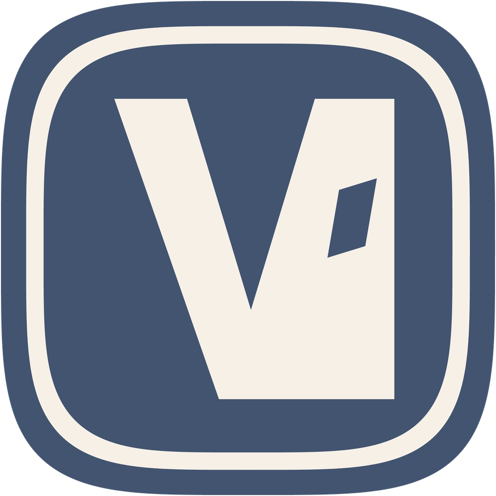

<p align="center">
  
</p>

<h1 align="center">Versta</h1>

<p align="center">A local host for your coding agents.</p>

<p align="center">
  <a href="https://github.com/shqingda/versta/releases/latest">Download</a>
  ·
  <a href="docs/usage.md">Usage</a>
  ·
  <a href="docs/web.md">Web</a>
  ·
  <a href="docs/architecture.md">Architecture</a>
</p>

Versta is a local AI coding-agent host. A macOS desktop app (Electron) and a local web entry share one on-machine runtime. It hosts CLIs you already run — Codex, Pi, OpenCode, and Grok Build — and keeps inference in those CLIs. There is no hosted multi-tenant workspace.

- Projects, sessions, approvals, and terminals in one UI
- Desktop and browser share the same local host
- Model calls stay in the installed CLIs
- Data stays on your machine

## Install

Download the Apple Silicon DMG from [GitHub Releases](https://github.com/shqingda/versta/releases/latest).

An optional web install script is still served at `https://moose.shqingda.workers.dev/install.sh`. The hostname has not been renamed.

## Develop

```sh
pnpm install
pnpm dev
```

[Development](docs/development.md).
