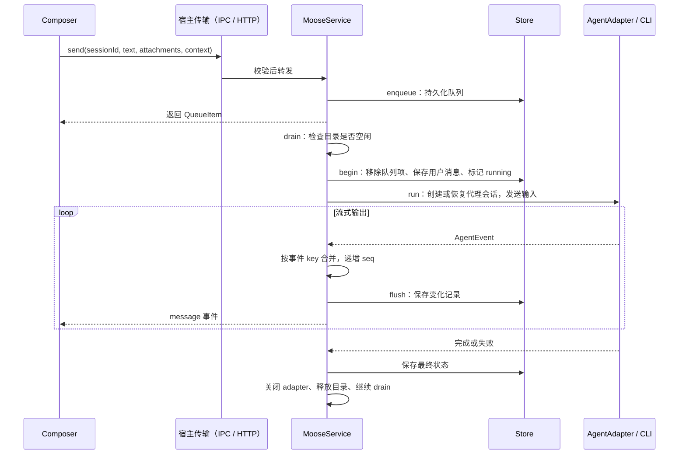
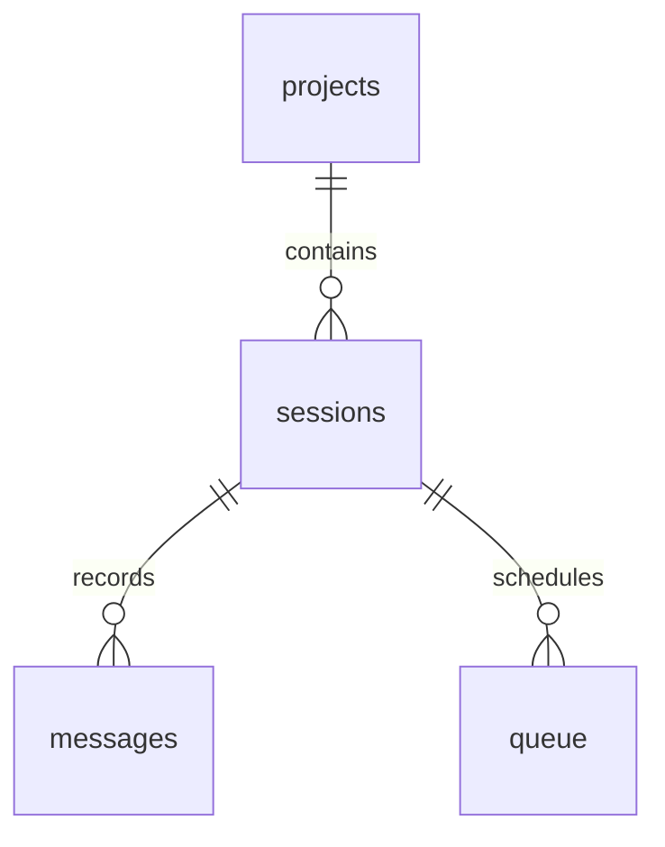

# Moose 技术架构

> 按 0.17.0 源码核对。安装版桌面与浏览器共用本机后台及原桌面数据目录；源码独立 Web 工作区不自动合并。

## 1. 项目定位

Moose 是可扩展的 AI 编程代理工作台，提供项目、会话、消息输入、审批和 Git 改动审阅。各 CLI 通过适配器接入统一的执行与事件接口；桌面版面向 Apple Silicon Mac，浏览器通过本机 Web 服务访问同一工作区。

Moose 负责交互、调度与历史存储；模型推理、工具执行及账号认证由代理 CLI 和对应服务完成。会话数据保存在本机，但使用代理时仍会与代理服务通信，“本地客户端”不代表离线推理。

当前有内置 PTY 终端、worktree 管理和独立本机 Web 服务；没有托管云端、多租户、内置文件编辑器、自动更新或遥测。Web 服务不是公网部署方案。

## 2. 总体架构：界面与执行分离

```mermaid
flowchart TB
  UI[Renderer：React 界面]
  Bridge[Preload：window.moose]
  Main[Main：窗口、原生菜单、IPC 网关]
  Host[SharedRuntime：本机服务连接]
  Service[独立本机服务：MooseService]
  DB[(SQLite 与附件目录)]
  Git[Git / 文件与技能目录查询]
  Codex[CodexAdapter]
  Grok[GrokAdapter]
  Pi[PiAdapter]
  OpenCode[OpenCodeAdapter]
  OCLI[opencode acp]
  PCLI[pi --mode rpc]
  CCLI[codex app-server]
  GCLI[grok agent stdio]
  UI <-->|类型化请求与事件| Bridge
  Bridge <-->|Electron IPC| Main
  Main <--> Host
  Host <-->|HTTP / SSE| Service
  Web[浏览器] <-->|HTTP / SSE| Service
  Service <--> DB
  Service --> Git
  Service <--> Codex
  Service <--> Grok
  Service <--> Pi
  Service <--> OpenCode
  OpenCode <-->|ACP stdio| OCLI
  Pi <-->|JSONL RPC| PCLI
  Codex <-->|JSON-RPC stdio| CCLI
  Grok <-->|ACP stdio| GCLI
```

| 层 | 主要职责 | 代码入口 |
| --- | --- | --- |
| Renderer | 页面状态、输入、时间线、设置、审阅 | [src/app.tsx](../src/app.tsx) |
| Preload | 暴露受限的请求与订阅接口 | [electron/preload.ts](../electron/preload.ts) |
| Main | 原生窗口、菜单、文件选择、剪贴板、系统入口、安全校验 | [electron/main.ts](../electron/main.ts) |
| Runtime | 安装版按需启动并连接本机共享服务；开发／独立模式保留 utility process | [electron/desktop-runtime.ts](../electron/desktop-runtime.ts)、[electron/shared-runtime.ts](../electron/shared-runtime.ts)、[electron/runtime-host.ts](../electron/runtime-host.ts) |
| Runtime / Service | 请求分发、执行调度、代理生命周期、事件落库 | [electron/web-server.ts](../electron/web-server.ts)、[electron/runtime.ts](../electron/runtime.ts)、[electron/service.ts](../electron/service.ts) |
| Provider | 抹平代理协议差异 | [electron/providers/types.ts](../electron/providers/types.ts) |
| Store | SQLite 读写、事务、迁移与重启恢复 | [electron/db/store.ts](../electron/db/store.ts) |

同步 SQLite 操作、代理协议处理和 Git 查询放在独立运行进程，避免直接阻塞界面。主进程仍负责原生窗口与系统能力，后台执行不依赖窗口是否打开。

## 3. 技术栈与构建

- **工程**：pnpm、ES modules、TypeScript、Vite 8、`vite-plugin-electron`。
- **界面**：React、shadcn / Base UI、Tailwind CSS、Motion、Lucide。
- **消息展示**：react-markdown、remark-gfm、rehype-highlight。
- **存储**：Drizzle ORM + better-sqlite3。
- **代理协议**：Codex 生成的 TypeScript 协议类型、ACP SDK。
- **验证与分发**：Vitest、Playwright Electron、electron-builder。

构建包含 main、preload、runtime、pty-host 和 web-server 五个入口。preload 为沙箱兼容的单文件 CJS，其余为 ESM；SQLite 和 PTY 原生依赖按 Electron ABI 准备。构建、热更新和打包约束统一见[开发与打包](development.md#构建与原生依赖)。

首屏按功能边界加载代码：历史与 worktree 由工具菜单持有公共弹窗外壳，首次打开时加载内容；计划面板首次切换时加载；Git 审阅模块在选中项目后加载，保留面板关闭动画和状态。扩展认证有跨弹窗的生命周期，继续由现有组件持有，不为缩小 bundle 强制卸载。终端启动恢复通过 SQLite 更新状态，避免把所有历史输出反序列化到 JS。

## 4. 先分清四个概念

| 概念 | 含义 | 生命周期 |
| --- | --- | --- |
| Project | 一个经过 `realpath` 规范化的本地目录 | 用户加入至删除 |
| Session | Moose 自己的会话，固定所属项目与 provider | 多轮消息共享 |
| nativeId | 代理端的 thread/session ID | 用于后续恢复上下文，可在编辑时更换 |
| runId | Moose 为一次队列执行分配的 ID | 一次用户输入及其代理输出 |

一轮回复可能包含多段 assistant 文本、思考摘要、工具记录和审批，所以 **一轮执行不等于一条消息记录**。这些记录通过 `runId` 关联；`position` 用于时间线排序和分页，`seq` 用于判断同一记录的新旧版本。

## 5. 一条消息如何完成

### 5.1 输入与持久化

界面中的新会话先作为未保存的输入页存在，发送时才创建实际 Session。已有会话的草稿文本、附件与上下文选择保存在 Session 中。

`send` 会检查归档状态、provider 开关、编辑锁，并解析附件 ID。随后先将消息写入 `queue`，由调度器决定何时执行；运行中的后续输入也走同一条路径。

### 5.2 按实际工作目录串行

Service 的 `active` Map 以会话实际工作目录的规范化路径为键。同目录内代理任务串行，不同项目或同项目的不同 worktree 可以并行。`editing` 集合在替换历史消息期间占用同一目录，防止执行与编辑竞争。

`drain()` 按队列时间顺序扫描，跳过已暂停、归档、provider 停用或目录被占用的任务。异步发现 CLI 后再次检查状态，避免等待期间发生删除、归档或队列取消后仍启动任务。

这个限制只作用于 Moose 内部，不能约束用户另外启动的 CLI 或编辑器。

### 5.3 流式记录与界面更新

Service 将 provider 的 `event.key` 与 `runId` 拼成消息 ID，文本增量合并到内存记录中。每 80 ms 将 dirty 记录保存到 SQLite，并发送 `message` 事件；审批等待等关键变化会立即刷新。

Store 和 Renderer 都通过 `seq` 拒绝旧版本覆盖新版本。这里保证的是消息记录更新的幂等合并，并非对任意重复的 CLI 文本增量做全局去重。

前端 [useWorkspace / useTranscript](../src/lib/workspace.ts) 分别维护项目快照与时间线：

- `changed` 触发合并后的快照或消息刷新。
- `message` 按 ID、seq 合并，再按 position 排序。
- 请求代次阻止切换会话后旧请求覆盖新页面。
- `transcript-reset` 清空编辑前的消息并重新加载。

## 6. 代理接入：统一接口，保留能力差异

[AgentAdapter](../electron/providers/types.ts) 统一能力探测、执行、审批响应、取消和关闭；历史、额度、分叉、审查与插话是可选接口。`RunContext` 提供工作目录、会话、输入、附件及回调，适配器上报 nativeId、原生 turn ID、上下文用量和统一 `AgentEvent`。创建或恢复会话封装在 `run()` 内部。

| 底座 | 协议与入口 | 会话延续 | 一轮完成依据 |
| --- | --- | --- | --- |
| Codex | `codex app-server`，JSON-RPC stdio | thread 创建／恢复，启动 turn | 对应线程的 `turn/completed`；Goal 另检查目标状态 |
| Grok Build | `grok agent stdio`，ACP | 依据能力创建／加载 session | `prompt` 调用结束 |
| Pi | `pi --mode rpc`，自定义 JSONL RPC | `sessionFile` | `agent_settled`，不能用 `agent_end` 提前结算 |
| OpenCode v2 | `opencode acp`，ACP | 创建／加载 session | `session/prompt` 调用结束 |

RPC 是调用方式，JSON-RPC 是具体消息协议，JSONL 是按行划分 JSON 消息的格式。Pi 与 Codex 都可以通过 stdio 传输 JSON 行，但消息信封与完成条件不同；公共 [rpc.ts](../electron/providers/rpc.ts) 通过 codec 处理差异。Grok 与 OpenCode 共用基础 ACP 事件转换，专有接口留在各自适配器中。

**权限模式与任务模式是两个维度。** `Session.mode` 表示 ask/auto/full；`PromptContext.mode` 表示 build/plan/goal。Codex Plan 使用原生协作模式并保留只读约束，Goal 使用原生目标接口；其他底座不能仅凭同名 CLI 命令视为已接通。当前功能、权限及真实验证范围集中在[能力表](providers/native-capabilities.md)，Pi 的协议细节见 [Pi 接入](providers/pi.md)。

代理 ID、设置字段和模式集中在 [providers.ts](../shared/providers.ts)，实例创建集中在 [registry.ts](../electron/providers/registry.ts)。[prompt.ts](../electron/providers/prompt.ts) 复用附件文本，[rpc.ts](../electron/providers/rpc.ts) 通过 codec 兼容不同信封。新增代理不再需要在 Service、设置页和探测脚本中复制二选一分支。

## 7. 审批、停止与编辑

### 审批与代理提问

Adapter 保留原始协议请求及可选答案，并发出 pending 消息。用户回答后，Service 检查会话仍在运行、消息仍为 pending 且未取消，再调用 `respond()`；Adapter 将答案关联回原始请求。

回答成功后消息变为 resolved。执行结束、停止或异常后，未完成的请求变为 expired，不能继续批准。会话状态会在 running 与 waiting 之间变化。

### 停止与恢复

停止会先暂停该会话队列，再取消并关闭 Adapter，等待运行结束；不会自动发送后续排队消息。失败也会暂停当前会话队列。

启动 Store 时，遗留的 running/waiting/queued 会话标记为 interrupted，pending/running 消息标记为 expired。Service 将磁盘中保留的队列设为暂停，避免重启后自动重复执行。恢复历史通过本地消息与 nativeId 完成。

### 编辑最新用户消息

编辑只允许空闲、未归档、没有待发队列的会话中的最新一条用户消息，附件保留原值。

1. 找到目标消息之前需要保留的历史。
2. Codex 有可用原生 turn ID 时，通过内部 `thread/fork` 准备此前的上下文；否则将保留历史组成 `historySeed`。
3. Store 在事务中删除目标消息及之后的记录，更新 nativeId/historySeed，将修改后的输入重新入队。
4. 发送 `transcript-reset`，界面重新加载并继续显示原 Moose Session。

原生 fork 是编辑实现细节，不会在侧栏创建新会话。此操作只替换对话记录，**不会撤销工作区文件改动**。当前没有“回到这条消息”入口或 IPC 方法。

## 8. 数据存储

| 表 | 存储内容 |
| --- | --- |
| projects | 项目名称、唯一规范化路径 |
| sessions | provider、nativeId、模型、权限、状态、草稿、historySeed |
| messages | 用户/代理文本、工具、审批等记录；details JSON 保存附件、问题、上下文与原生 turn ID |
| queue | 待发文本、附件、上下文及入队时间 |
| settings | 应用配置与带命名空间的用量、计划、后台命令、调度及操作记录 |
| worktrees | 受管工作目录、分支、归属及生命周期状态 |

数据库在 `userData/moose.sqlite`，启用 WAL 与外键。附件实体与元数据文件在相邻 `attachments/` 目录；UI 折叠状态等少量展示偏好使用 localStorage。

Drizzle 定义见 [schema.ts](../electron/db/schema.ts)；**实际启动迁移由手写 [migrations.ts](../electron/db/migrations.ts) 执行**，通过 `PRAGMA user_version` 管理，目前为 5。迁移、开始执行和替换最新轮次等操作使用事务。

会话必须先归档才能单独删除；项目没有受管 worktree 时可删除，并清理其会话、消息和队列；仍有受管目录时需先处理。项目删除不会删除工作目录文件。当前删除逻辑没有同步回收附件实体或对应 usage 设置，后续可补充孤立数据清理。

## 9. 文件、技能与 Git 审阅

- **文件引用**：[ContextCatalog](../electron/context-catalog.ts) 扫描当前目录，忽略常见构建目录与符号链接，使用模糊评分返回最多 60 条结果。目录扫描缓存 5 秒，并限制扫描数量和深度；不是完整的 `.gitignore` 索引器。
- **技能**：发现用户目录和项目目录中的 `.agents/skills`、`.codex/skills`、`.grok/skills`，读取 SKILL.md 元数据。发送前重新解析技能 ID 与路径。
- **输入同步**：[prompt-context.ts](../shared/prompt-context.ts) 根据编辑后的内联文字过滤仍然有效的文件和技能引用，避免删除文字后继续隐式携带引用。
- **附件**：[attachments.ts](../electron/attachments.ts) 将文件复制到受控目录，以 ID 访问；单文件上限 20 MB，不支持视频。小型文本可内嵌，图片按代理能力传递，其他文件提供路径。
- **Git**：[git.ts](../electron/git.ts) 解析 NUL 分隔的 porcelain 状态，区分 staged、unstaged、untracked。diff 限制为 256 KiB，处理二进制与截断，关闭外部 diff/textconv。diff 读取与写入操作分开；[git-actions.ts](../electron/git-actions.ts)负责逐文件暂存及带 HEAD／暂存区指纹的提交，[pull-requests.ts](../electron/pull-requests.ts)负责明确 GitHub origin／base／head 的草稿 PR，[review-workbench.ts](../electron/review-workbench.ts)管理目录锁、持久化操作回执与独立原生审查。只有用户显式操作才会暂存、提交或创建 PR，不自动推送或回滚。

文件引用解析时使用 realpath 检查项目边界；Git diff 还会确认目标仍属于当前改动列表。通过参数数组调用 Git，避免将文件名拼接成 shell 命令。

## 10. 用量与长会话展示

用量分为两个来源：上下文统计属于 Session，套餐额度属于 Provider。Service 将上下文统计持久化，将额度缓存 60 秒，并用 `usagePending` 合并同一代理的并发请求；前端弹层打开时刷新并保留上次结果。

Codex 优先读取多额度桶，分别展示通用和模型专属限制；Grok 读取实际 billing 数据。重置时间转换为本地日期，未知数据保持未知，不根据套餐名猜额度。新会话上下文显示 0，已有统计显示“已用 / 容量（百分比）”。

消息分页每次返回 80 条，以 position 游标向前加载。[Transcript](../src/components/transcript.tsx) 配合可见区域展示、滚动跟随和阅读位置处理。AI 完整复制通过后端 `responseText` 查询同 runId 的全部 assistant 文本，因此不会受当前分页范围或中间工具调用影响；思考与工具内容不混入复制结果。

Codex 会请求 `summary: 'auto'`，但代理不保证返回思考摘要。UI 只展示实际提供的摘要，空内容隐藏。

## 11. 安全与生命周期边界

Renderer 开启 sandbox、contextIsolation，关闭 nodeIntegration，只能通过 preload 的 `request` / `subscribe` 访问后台。主进程验证 IPC 来源窗口与 frame，并使用 [Zod 白名单](../shared/validation.ts) 校验方法和参数；Service 再校验其处理的请求。

正式界面从受限 `moose://app/` 协议加载，配置 CSP，禁用任意导航、webview 和窗口打开。Markdown 不启用原始 HTML 执行；外部链接校验协议后由系统浏览器打开。

这保护的是客户端渲染边界；代理文件与命令权限由 CLI 的执行策略控制，选择 full 意味着代理运行权限扩大。

安装版关闭窗口或普通退出仅断开客户端，共享后台继续运行。“退出并停止后台”才会让 Service 停止接收操作、取消任务、落库并关闭数据库。默认独立开发模式由 RuntimeHost 管理 utility process，退出时发送 `_shutdown` 并清理进程。后台异常会通知 UI；恢复连接或重启后读取持久化状态，不自动重放中断任务。

开发使用独立的 Moose Dev 数据目录；测试通过 `MOOSE_DATA_DIR` 指向临时目录，避免污染日常会话。

## 12. 阅读与维护顺序

建议按下面顺序读代码，先看业务流，再看协议细节：

1. [shared/types.ts](../shared/types.ts)：理解 Session、Message、Requests 与 AppEvent。
2. [src/app.tsx](../src/app.tsx) → [composer.tsx](../src/components/composer.tsx)：理解选择项目、创建会话与发送输入。
3. [preload.ts](../electron/preload.ts) → [main.ts](../electron/main.ts) → [desktop-runtime.ts](../electron/desktop-runtime.ts) → [shared-runtime.ts](../electron/shared-runtime.ts)：理解默认共享连接；独立模式另读 RuntimeHost。
4. [service.ts](../electron/service.ts)：沿 `send → drain → execute → accept → flush` 阅读主执行链。
5. [store.ts](../electron/db/store.ts)：理解队列、消息事务和恢复。
6. [registry.ts](../electron/providers/registry.ts) 及其注册的适配器：最后看具体协议映射。

新增代理时实现 AgentAdapter，并接入 provider 类型、校验、发现逻辑及 UI 选项；可选能力应由探测结果驱动。新增 IPC 操作时同步修改 Requests/Responses、Zod 校验、处理端和调用端。修改数据结构时同时维护 Drizzle schema 与实际迁移。

验证入口：`pnpm typecheck`、`pnpm test`、`pnpm test:e2e`；分发使用 `pnpm dist`，安装包启动检查见 [package-smoke.ts](../scripts/package-smoke.ts)。Mock 测试验证客户端流程，不能替代真实 CLI 的认证、协议兼容和额度验收。

## 13. Web 宿主与共享连接

`electron/web-server.ts` 在无窗口进程中启动 `MooseService`。浏览器的 `src/lib/web-api.ts` 实现同一份 MooseAPI，通过 HTTP 调用、SSE 接收变更通知；`web-host.tsx` 处理登录和服务端目录选择。客户端刷新或断开不会关闭 Service。安装版桌面通过同一服务访问数据库；独立模式的 utility process 不可同时打开服务占用的数据库。

OpenCode v2 适配器见 `electron/providers/opencode.ts`，通过 ACP stdio 连接私有 CLI 服务。与 Grok 共用 `acp-events.ts` 的文本／工具转换，底座专有命令分开处理。元数据与构造器分别登记在 `shared/providers.ts` 和 `electron/providers/registry.ts`。

启动、限制与后续顺序见 [Web 使用说明](web.md)。

### 显式共享后台

设置 `MOOSE_SHARED_RUNTIME_FILE` 后，Electron 主进程用 `SharedRuntime` 替代自有 `RuntimeHost`，读取 Web 服务的私有连接文件，通过已认证 HTTP 请求和 SSE 使用同一个 MooseService。桌面原生文件选择保留在主进程，选定项目转为服务请求，附件通过已有上传接口传入。退出桌面只关闭连接，独立 Web 服务继续拥有数据库、任务和终端。不设置该变量时，安装版自动在原桌面数据目录启动服务，开发与隔离测试仍保留 utility process。数据不搬迁、不合并；无需引入另一套迁移管线。安装版自动后台只监听回环地址，版本不匹配时拒绝业务请求，允许用户从菜单停止旧服务。

### 终端输出传输

桌面通过 IPC、Web 与共享桌面通过现有 SSE 事件通道接收终端输出，服务端每 33 ms 合并一次新增内容。输入仍走请求接口，不因重连自动重发；没有额外引入 WebSocket。

首次打开及事件连接恢复时，界面按绝对游标读取保留的输出。游标按 JavaScript 字符串长度计数，两端使用同一口径；与实时推送重叠的部分会去重。渲染繁忙时只记录需要补读，不在客户端排队保存每个输出块。服务端仍保留有上限的回放缓冲，超过保留范围会明确重置并提示截断，不能无限恢复历史输出。

SSE 对积压超过阈值的慢连接断开，重连后按游标补读。终端内容不再每 100 ms 轮询；会话列表与其他工具状态仍有低频刷新。输入与尺寸由一个客户端控制，其他客户端可同时查看。

## 14. 维护与精简原则

当前分层保留：界面、宿主传输、业务服务、代理适配器和存储。桌面与 Web 共用业务服务；两种传输各有生命周期，不为了减少文件数强行合并。MooseService 负责调度和跨模块协作，Git、扩展、worktree、终端已有独立模块；没有证据需要继续引入服务容器、事件总线或微服务。

优先删除重复逻辑和无效加载。历史／worktree 已共用弹窗外壳，终端恢复也已改为 SQL 状态更新，避免批量反序列化历史输出。`service.ts` 和 `app.tsx` 仍是较大的协调入口，后续应限制新领域逻辑继续进入；只有出现可独立描述、测试的职责时再提取，不按行数机械拆文件。

## 15. 日夜主题与视觉规则

配色参考 [Running Page](https://yihong.run/tracks) 的明暗层次与强调色，保留 Moose 的侧栏、对话、审阅和终端布局。没有引入该项目的业务代码或组件。

| 区域 | 日间 | 夜间 |
| --- | --- | --- |
| 工作区 | 白色 `#ffffff` | 炭黑 `#171918` |
| 侧栏 | 浅灰 `#f4f5f5` | 深灰 `#1d201d` |
| 卡片 | 白色 `#ffffff` | `#202320` |
| 强调色 | 深蓝 `#244f66` | 黄绿色 `#d4f77d` |

颜色统一定义在 `src/styles.css` 的语义变量中，组件按背景、文字、边框和状态引用，避免桌面与 Web 各自维护配色。强调色用于选中状态和主要操作；正文保持中性色。输入框与浮层通过细边框、有限阴影区分层次，不增加装饰性面板。

终端背景、前景和光标读取同一组主题变量，ANSI 颜色仍使用现有终端色表。保留键盘焦点提示和减少动态效果设置；主题调整不改变控件位置、快捷键或操作流程。
