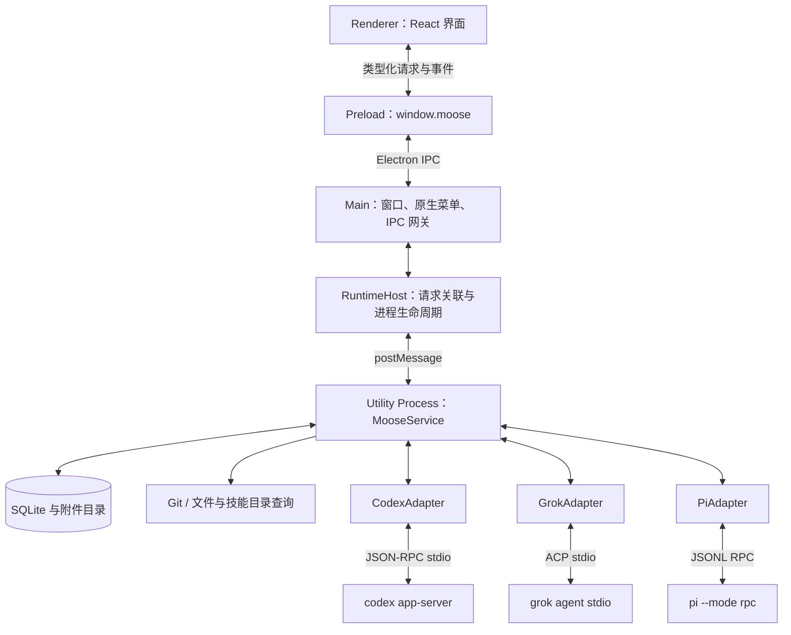
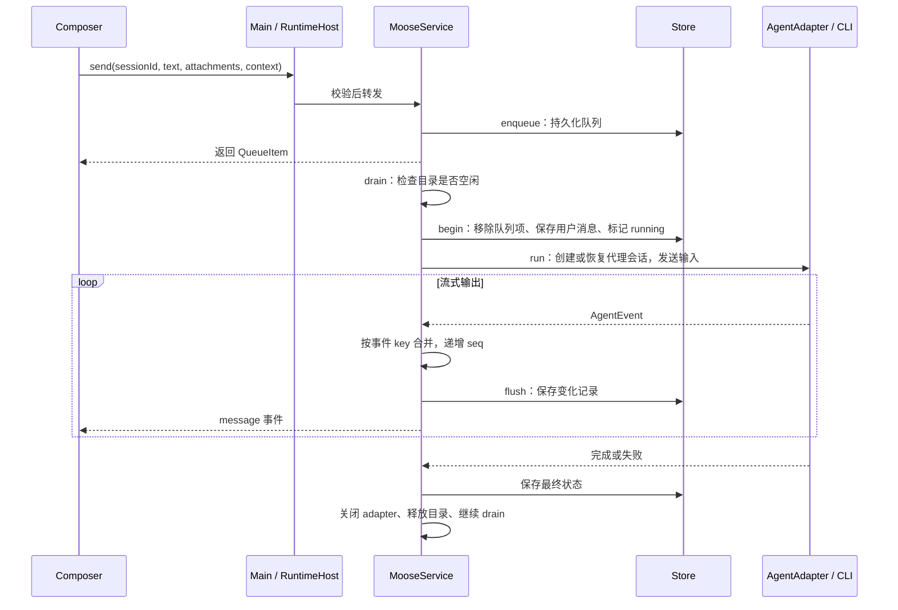
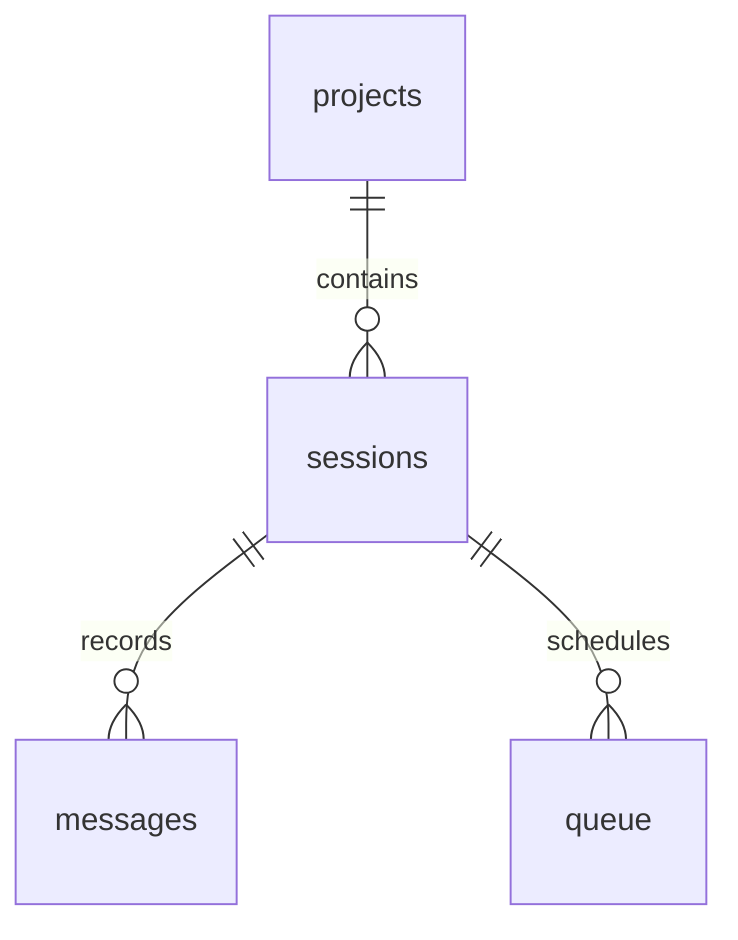

# Moose 技术架构

> 基于 0.6.0 源码梳理。本文描述当前实现，方便理解调用链和定位代码；不把早期计划当作已实现能力。

## 1. 项目定位

Moose 是面向 Apple Silicon Mac 的本地 Coding Agent 客户端。它提供项目、会话、消息输入、审批和 Git 改动审阅界面，通过本机 CLI 接入 Codex、Grok Build 与 Pi。

Moose 负责交互、调度与历史存储；模型推理、工具执行及账号认证由代理 CLI 和对应服务完成。会话数据保存在本机，但使用代理时仍会与代理服务通信，“本地客户端”不代表离线推理。

当前没有云端业务后端，因此未引入 Hono、Cloudflare 或远程数据库；也没有内置终端、文件编辑器、worktree 管理、自动更新或遥测。

## 2. 总体架构：界面与执行分离



| 层 | 主要职责 | 代码入口 |
| --- | --- | --- |
| Renderer | 页面状态、输入、时间线、设置、审阅 | [src/app.tsx](../src/app.tsx) |
| Preload | 暴露受限的请求与订阅接口 | [electron/preload.ts](../electron/preload.ts) |
| Main | 原生窗口、菜单、文件选择、剪贴板、系统入口、安全校验 | [electron/main.ts](../electron/main.ts) |
| RuntimeHost | 启动 utility process，关联请求响应，处理超时与退出 | [electron/runtime-host.ts](../electron/runtime-host.ts) |
| Runtime / Service | 请求分发、执行调度、代理生命周期、事件落库 | [electron/runtime.ts](../electron/runtime.ts)、[electron/service.ts](../electron/service.ts) |
| Provider | 抹平代理协议差异 | [electron/providers/types.ts](../electron/providers/types.ts) |
| Store | SQLite 读写、事务、迁移与重启恢复 | [electron/db/store.ts](../electron/db/store.ts) |

同步 SQLite 操作、代理协议处理和 Git 查询放在独立运行进程，避免直接阻塞界面。主进程仍负责原生窗口与系统能力，后台执行不依赖窗口是否打开。

## 3. 技术栈与构建

- **工程**：pnpm、ES modules、TypeScript、Vite 8、`vite-plugin-electron`。
- **界面**：React、shadcn / Base UI、Tailwind CSS、Motion、Lucide。
- **消息展示**：react-markdown、remark-gfm、rehype-highlight。
- **存储**：Drizzle ORM + better-sqlite3。
- **代理协议**：Codex 生成的 TypeScript 协议类型、ACP SDK。
- **验证与分发**：Vitest、Playwright Electron、electron-builder。

[vite.config.ts](../vite.config.ts) 使用插件 Flat API 构建 main、preload、runtime 三个入口：main/runtime 输出 ESM，preload 输出单文件 CJS，以适配沙箱 preload。三个入口首次构建完成后调用插件 `startup(['.'])`；后续 main/runtime 更新重启应用，preload 更新重新加载窗口，React 使用 HMR。

better-sqlite3 外置为运行时依赖，打包前按 Electron arm64 ABI 重建，原生 `.node` 文件从 ASAR 解包。构建和打包配置见 [package.json](../package.json)。

## 4. 先分清四个概念

| 概念 | 含义 | 生命周期 |
| --- | --- | --- |
| Project | 一个经过 `realpath` 规范化的本地目录 | 用户加入至删除 |
| Session | Moose 自己的会话，固定所属项目与 provider | 多轮消息共享 |
| nativeId | 代理端的 thread/session ID | 用于后续恢复上下文，可在编辑时更换 |
| runId | Moose 为一次队列执行分配的 ID | 一次用户输入及其代理输出 |

一轮回复可能包含多段 assistant 文本、思考摘要、工具记录和审批，所以 **一轮执行不等于一条消息记录**。这些记录通过 `runId` 关联；`position` 用于时间线排序和分页，`seq` 用于判断同一记录的新旧版本。

## 5. 一条消息如何完成



### 5.1 输入与持久化

界面中的新会话先作为未保存的输入页存在，发送时才创建实际 Session。已有会话的草稿文本、附件与上下文选择保存在 Session 中。

`send` 会检查归档状态、provider 开关、编辑锁，并解析附件 ID。随后先将消息写入 `queue`，由调度器决定何时执行；运行中的后续输入也走同一条路径。

### 5.2 按项目目录串行

Service 的 `active` Map 以规范化项目路径为键，同目录内一次只运行一个任务，不同项目可以并行。`editing` 集合在替换历史消息期间占用同一目录，防止执行与编辑竞争。

`drain()` 按队列时间顺序扫描，跳过已暂停、归档、provider 停用或目录被占用的任务。异步发现 CLI 后再次检查状态，避免等待期间发生删除、归档或队列取消后仍启动任务。

这个限制只作用于 Moose 内部，不能约束用户另外启动的 CLI 或编辑器。

### 5.3 流式记录与界面更新

Service 将 provider 的 `event.key` 与 `runId` 拼成消息 ID，文本增量合并到内存记录中。每 80 ms 将 dirty 记录保存到 SQLite，并发送 `message` 事件；审批等待等关键变化会立即刷新。

Store 和 Renderer 都通过 `seq` 拒绝旧版本覆盖新版本。这里保证的是消息记录更新的幂等合并，并非对任意重复的 CLI 文本增量做全局去重。

前端 [useWorkspace / useTranscript](../src/lib/workspace.ts) 分别维护项目快照与时间线：

- `changed` 触发合并后的快照或消息刷新。
- `message` 按 ID、seq 合并，再按 position 排序。
- 请求代次阻止切换会话后旧请求覆盖新页面。
- `transcript-reset` 清空编辑前的消息并重新加载。

## 6. 代理接入：统一接口，保留能力差异

[AgentAdapter](../electron/providers/types.ts) 的核心接口如下，具体输入输出类型见源文件：

```ts
interface AgentAdapter {
  probe(): Promise<Pick<ProviderInfo, 'models' | 'modes' | 'images'>>;
  run(context: RunContext): Promise<void>;
  respond(key: string, choice?: string, answers?: Record<string, string>): void;
  cancel(): Promise<void>;
  close(): Promise<void>;
  usage?(): Promise<UsageInfo>;
  fork?(session: Session, cwd: string, lastTurnId: string): Promise<string>;
}
```

`RunContext` 提供工作目录、会话、输入、附件及回调；Adapter 通过回调上报 nativeId、原生 turn ID、上下文用量与统一 `AgentEvent`。恢复会话封装在 `run()` 内部，没有独立的公共 resume 接口。

| 项目 | Codex | Grok Build |
| --- | --- | --- |
| 传输 | `codex app-server`，JSON-RPC stdio | `grok agent stdio`，ACP SDK |
| 会话恢复 | `thread/start` / `thread/resume` | 根据 ACP 能力创建或加载 session |
| 输入 | text、mention、skill、localImage | ACP prompt 内容，文件与技能路径通过文本补充 |
| 权限 | ask / auto / full | ask / full，拒绝不支持的 auto |
| 用量 | `account/rateLimits/read` | 扩展方法 `_x.ai/billing` |
| 上下文统计 | `thread/tokenUsage/updated` | 当前未映射对应统计 |

实现见 [codex.ts](../electron/providers/codex.ts)、[grok.ts](../electron/providers/grok.ts)。CLI 发现及子进程处理见 [process.ts](../electron/providers/process.ts)、[rpc.ts](../electron/providers/rpc.ts)。Moose 复用 CLI 登录状态，不自行保存账号密码。

**权限模式与任务模式是两个维度。** `Session.mode` 表示 ask/auto/full；`PromptContext.mode` 表示 build/plan/goal。Codex Plan 使用只读沙箱和规划指令；Goal 使用原生 `thread/goal/*` 接口。Grok 有自己的模式映射，不应假设两个代理具备完全相同的执行语义。

### Pi 与代理注册表（0.6.0）

Pi 通过 `pi --mode rpc` 接收 JSONL 命令，使用 sessionFile 恢复会话；`agent_settled` 表示本轮真正结束。支持模型能力探测、正文/思考/工具事件、图片及扩展提问，只暴露完全访问；没有内置审批沙箱、原生 Plan/Goal 或套餐额度接口。详见 [Pi 接入](providers/pi.md)。

代理 ID、设置字段和模式集中在 [providers.ts](../shared/providers.ts)，实例创建集中在 [registry.ts](../electron/providers/registry.ts)。[prompt.ts](../electron/providers/prompt.ts) 复用附件文本，[rpc.ts](../electron/providers/rpc.ts) 通过 codec 兼容不同信封。新增代理不再需要在 Service、设置页和探测脚本中复制二选一分支。

## 7. 审批、停止与编辑

### 审批与代理提问

Adapter 保留原始协议请求及可选答案，并发出 pending 消息。用户回答后，Service 检查会话仍在运行、消息仍为 pending 且未取消，再调用 `respond()`；Adapter 将答案关联回原始请求。

回答成功后消息变为 resolved。执行结束、停止或异常后，未完成的请求变为 expired，不能继续批准。会话状态会在 running 与 waiting 之间变化。

### 停止与恢复

停止会先暂停该会话队列，再取消并关闭 Adapter，等待运行结束；不会自动发送后续排队消息。失败也会暂停当前会话队列。

启动 Store 时，遗留的 running/waiting/queued 会话标记为 interrupted，pending/running 消息标记为 expired。Service 将磁盘中保留的队列设为暂停，避免重启后自动重复执行。恢复历史通过本地消息与 nativeId 完成。

### 编辑最新用户消息

编辑只允许空闲、未归档、没有待发队列的会话中的最新一条用户消息，附件保留原值。

1. 找到目标消息之前需要保留的历史。
2. Codex 有可用原生 turn ID 时，通过内部 `thread/fork` 准备此前的上下文；否则将保留历史组成 `historySeed`。
3. Store 在事务中删除目标消息及之后的记录，更新 nativeId/historySeed，将修改后的输入重新入队。
4. 发送 `transcript-reset`，界面重新加载并继续显示原 Moose Session。

原生 fork 是编辑实现细节，不会在侧栏创建新会话。此操作只替换对话记录，**不会撤销工作区文件改动**。当前没有“回到这条消息”入口或 IPC 方法。

## 8. 数据存储



| 表 | 存储内容 |
| --- | --- |
| projects | 项目名称、唯一规范化路径 |
| sessions | provider、nativeId、模型、权限、状态、草稿、historySeed |
| messages | 用户/代理文本、工具、审批等记录；details JSON 保存附件、问题、上下文与原生 turn ID |
| queue | 待发文本、附件、上下文及入队时间 |
| settings | 应用配置，以及 `usage:<sessionId>` 上下文统计 |

数据库在 `userData/moose.sqlite`，启用 WAL 与外键。附件实体与元数据文件在相邻 `attachments/` 目录；UI 折叠状态等少量展示偏好使用 localStorage。

Drizzle 定义见 [schema.ts](../electron/db/schema.ts)；**实际启动迁移由手写 [migrations.ts](../electron/db/migrations.ts) 执行**，通过 `PRAGMA user_version` 管理，目前为 3。迁移、开始执行和替换最新轮次等操作使用事务。

会话必须先归档才能单独删除；项目可直接删除并清理其会话、消息和队列。项目删除不会删除工作目录文件。当前删除逻辑没有同步回收附件实体或对应 usage 设置，后续可补充孤立数据清理。

## 9. 文件、技能与 Git 审阅

- **文件引用**：[ContextCatalog](../electron/context-catalog.ts) 扫描当前目录，忽略常见构建目录与符号链接，使用模糊评分返回最多 60 条结果。目录扫描缓存 5 秒，并限制扫描数量和深度；不是完整的 `.gitignore` 索引器。
- **技能**：发现用户目录和项目目录中的 `.agents/skills`、`.codex/skills`、`.grok/skills`，读取 SKILL.md 元数据。发送前重新解析技能 ID 与路径。
- **输入同步**：[prompt-context.ts](../shared/prompt-context.ts) 根据编辑后的内联文字过滤仍然有效的文件和技能引用，避免删除文字后继续隐式携带引用。
- **附件**：[attachments.ts](../electron/attachments.ts) 将文件复制到受控目录，以 ID 访问；单文件上限 20 MB，不支持视频。小型文本可内嵌，图片按代理能力传递，其他文件提供路径。
- **Git**：[git.ts](../electron/git.ts) 解析 NUL 分隔的 porcelain 状态，区分 staged、unstaged、untracked。diff 限制为 256 KiB，处理二进制与截断，关闭外部 diff/textconv。diff 读取与写入操作分开；[git-actions.ts](../electron/git-actions.ts)负责逐文件暂存及带 HEAD／暂存区指纹的提交，[pull-requests.ts](../electron/pull-requests.ts)负责明确 GitHub origin／base／head 的草稿 PR，[review-workbench.ts](../electron/review-workbench.ts)管理目录锁、持久化操作回执与独立原生审查。只有用户显式操作才会暂存、提交或创建 PR，不自动推送或回滚。

文件引用解析时使用 realpath 检查项目边界；Git diff 还会确认目标仍属于当前改动列表。通过参数数组调用 Git，避免将文件名拼接成 shell 命令。

## 10. 用量与长会话展示

用量分为两个来源：上下文统计属于 Session，套餐额度属于 Provider。Service 将上下文统计持久化，将额度缓存 60 秒，并用 `usagePending` 合并同一代理的并发请求；前端弹层打开时刷新并保留上次结果。

Codex 优先读取多额度桶，分别展示通用和模型专属限制；Grok 读取实际 billing 数据。重置时间转换为本地日期，未知数据保持未知，不根据套餐名猜额度。新会话上下文显示 0，已有统计显示“已用 / 容量（百分比）”。

消息分页每次返回 80 条，以 position 游标向前加载。[Transcript](../src/components/transcript.tsx) 配合可见区域展示、滚动跟随和阅读位置处理。AI 完整复制通过后端 `responseText` 查询同 runId 的全部 assistant 文本，因此不会受当前分页范围或中间工具调用影响；思考与工具内容不混入复制结果。

Codex 会请求 `summary: 'auto'`，但代理不保证返回思考摘要。UI 只展示实际提供的摘要，空内容隐藏。

## 11. 安全与生命周期边界

Renderer 开启 sandbox、contextIsolation，关闭 nodeIntegration，只能通过 preload 的 `request` / `subscribe` 访问后台。主进程验证 IPC 来源窗口与 frame，并使用 [Zod 白名单](../shared/validation.ts) 校验方法和参数；Service 再校验其处理的请求。

正式界面从受限 `moose://app/` 协议加载，配置 CSP，禁用任意导航、webview 和窗口打开。Markdown 不启用原始 HTML 执行；外部链接校验协议后由系统浏览器打开。

这保护的是客户端渲染边界；代理文件与命令权限由 CLI 的执行策略控制，选择 full 意味着代理运行权限扩大。

关闭窗口不退出应用，后台任务继续。`⌘ Q` 经 RuntimeHost 发出 `_shutdown`，Service 停止接收新操作、取消代理、落库并关闭数据库；RuntimeHost 负责超时和进程退出时拒绝未完成请求。运行进程异常会通知 UI，后续请求可重新启动运行进程，但不会自动重放中断任务。

开发使用独立的 Moose Dev 数据目录；测试通过 `MOOSE_DATA_DIR` 指向临时目录，避免污染日常会话。

## 12. 阅读与维护顺序

建议按下面顺序读代码，先看业务流，再看协议细节：

1. [shared/types.ts](../shared/types.ts)：理解 Session、Message、Requests 与 AppEvent。
2. [src/app.tsx](../src/app.tsx) → [composer.tsx](../src/components/composer.tsx)：理解选择项目、创建会话与发送输入。
3. [preload.ts](../electron/preload.ts) → [main.ts](../electron/main.ts) → [runtime-host.ts](../electron/runtime-host.ts)：理解跨进程通信。
4. [service.ts](../electron/service.ts)：沿 `send → drain → execute → accept → flush` 阅读主执行链。
5. [store.ts](../electron/db/store.ts)：理解队列、消息事务和恢复。
6. [codex.ts](../electron/providers/codex.ts) / [grok.ts](../electron/providers/grok.ts)：最后看具体协议映射。

新增代理时实现 AgentAdapter，并接入 provider 类型、校验、发现逻辑及 UI 选项；可选能力应由探测结果驱动。新增 IPC 操作时同步修改 Requests/Responses、Zod 校验、处理端和调用端。修改数据结构时同时维护 Drizzle schema 与实际迁移。

验证入口：`pnpm typecheck`、`pnpm test`、`pnpm test:e2e`；分发使用 `pnpm dist`，安装包启动检查见 [package-smoke.ts](../scripts/package-smoke.ts)。Mock 测试验证客户端流程，不能替代真实 CLI 的认证、协议兼容和额度验收。
