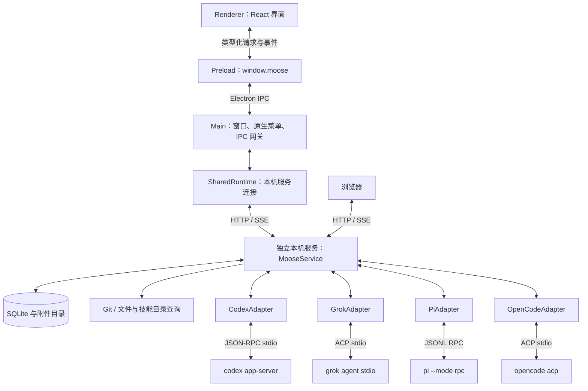
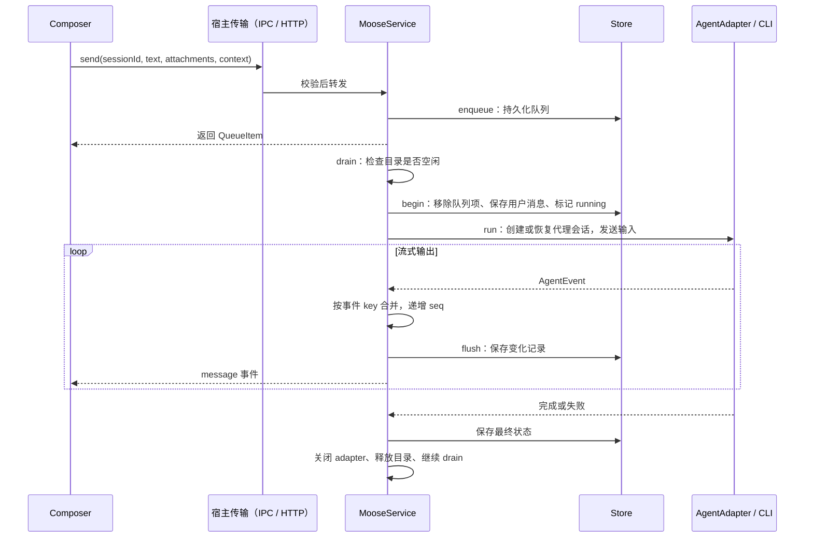
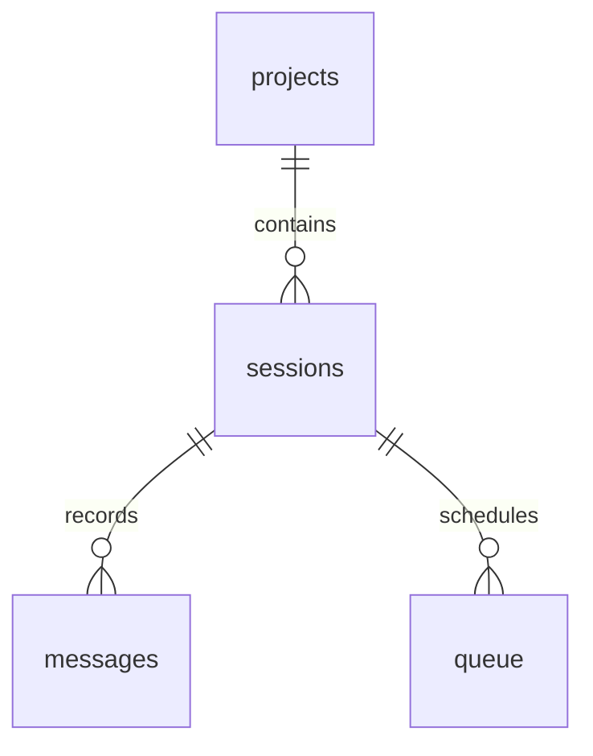

# Moose 技术架构

按 **0.23.3** 源码整理（2026-10-10）。这是实现说明：进程怎么分、一条消息怎么走完、数据存在哪。安装和日常操作见[使用指南](usage.md)，浏览器入口见 [Web 使用说明](web.md)。0.23.0、0.23.1 的性能数字仍以当时的验收为准，不在这里重报。

| 你想弄清的问题 | 看哪一节 |
| --- | --- |
| 界面、主进程、后台各管什么 | [第 2 节](#2-总体架构界面与执行分离) |
| 从按下发送到任务结束 | [第 5 节](#5-一条消息如何完成) |
| 四家 CLI 哪里相同、哪里必须分开 | [第 6 节](#6-代理接入统一接口保留能力差异) |
| 重启、停止、编辑消息会留下什么 | [第 7 节](#7-审批停止与编辑) |
| 桌面和浏览器怎样连到同一个后台 | [第 13 节](#13-web-宿主与共享连接) |

安装版的桌面和浏览器共用本机后台，以及原来的桌面数据目录。命令行独立安装和源码 `pnpm web` 默认用另一份数据，不会自动合并。

## 1. 项目定位

Moose 是可扩展的 AI 编程代理工作台，提供项目、会话、消息输入、审批和 Git 改动审阅。各 CLI 通过适配器接入统一的执行与事件接口；桌面版面向 Apple Silicon Mac，浏览器通过本机 Web 服务访问同一工作区。

Moose 负责交互、调度与历史存储；模型推理、工具执行及账号认证由代理 CLI 和对应服务完成。会话数据保存在本机，但使用代理时仍会与代理服务通信，“本地客户端”不代表离线推理。

当前有内置 PTY 终端（伪终端，用来跑交互式 shell）、Git worktree（同一仓库的另一份工作目录）、全文搜索、通知和只读文件面板；Web 安装版可用 `moose update` 手动更新。没有托管云端、多租户、文件编辑保存、自动安装升级或遥测。公网地址只分发安装包，本机 Web 工作区仍在用户机器运行。

## 2. 总体架构：界面与执行分离

```mermaid
flowchart TB
  UI[Renderer：React 界面]
  Bridge[Preload：window.moose]
  Main[Main：窗口、原生菜单、IPC 网关]
  Host[SharedRuntime：本机服务连接]
  Service[独立本机服务：MooseService]
  DB[(SQLite 与附件目录)]
  Git[Git / 文件与技能目录查询]
  Codex[CodexAdapter]
  Grok[GrokAdapter]
  Pi[PiAdapter]
  OpenCode[OpenCodeAdapter]
  OCLI[opencode acp]
  PCLI[pi --mode rpc]
  CCLI[codex app-server]
  GCLI[grok agent stdio]
  UI <-->|类型化请求与事件| Bridge
  Bridge <-->|Electron IPC| Main
  Main <--> Host
  Host <-->|HTTP / SSE| Service
  Web[浏览器] <-->|HTTP / SSE| Service
  Service <--> DB
  Service --> Git
  Service <--> Codex
  Service <--> Grok
  Service <--> Pi
  Service <--> OpenCode
  OpenCode <-->|ACP stdio| OCLI
  Pi <-->|JSONL RPC| PCLI
  Codex <-->|JSON-RPC stdio| CCLI
  Grok <-->|ACP stdio| GCLI
```

| 层 | 主要职责 | 代码入口 |
| --- | --- | --- |
| Renderer | 页面状态、输入、时间线、设置、审阅 | [src/app.tsx](../src/app.tsx) |
| Preload | 暴露受限的请求与订阅接口 | [electron/preload.ts](../electron/preload.ts) |
| Main | 原生窗口、菜单、文件选择、剪贴板、系统入口、安全校验 | [electron/main.ts](../electron/main.ts) |
| Runtime | 安装版按需启动并连接本机共享服务；开发／独立模式保留 utility process | [electron/desktop-runtime.ts](../electron/desktop-runtime.ts)、[electron/shared-runtime.ts](../electron/shared-runtime.ts)、[electron/runtime-host.ts](../electron/runtime-host.ts) |
| Runtime / Service | 请求分发与共享目录锁，协调业务服务 | [electron/web-server.ts](../electron/web-server.ts)、[electron/runtime.ts](../electron/runtime.ts)、[electron/service.ts](../electron/service.ts) |
| Provider | 抹平代理协议差异 | [electron/providers/types.ts](../electron/providers/types.ts) |
| Store | SQLite 读写、事务、迁移与重启恢复 | [electron/db/store.ts](../electron/db/store.ts) |
| ProviderRegistry | CLI 发现、能力探测、额度缓存与探测进程清理 | [provider-registry.ts](../electron/provider-registry.ts) |
| SessionExecution | 按目录执行队列、合并流式事件、批量落库、取消与关闭 | [session-execution.ts](../electron/session-execution.ts) |

ProviderRegistry 负责发现 CLI 和缓存额度，SessionExecution 负责排队执行。Store、目录锁、附件、Git、worktree、后台任务和原生历史仍在同一个 MooseService 里，共用一份 SQLite、同一个执行器。关闭时先等正在准备目录的任务和运行中的任务放开资源，再关闭数据库。刷新配置会使过期的 CLI 探测和额度缓存失效。

同步 SQLite 操作、代理协议处理和 Git 查询放在独立运行进程，避免直接阻塞界面。主进程仍负责原生窗口与系统能力，后台执行不依赖窗口是否打开。

## 3. 技术栈与构建

- **工程**：pnpm、ES modules、TypeScript、Vite 8、`vite-plugin-electron`。
- **界面**：React、shadcn / Base UI、Tailwind CSS、Motion、Lucide。
- **消息展示**：react-markdown、remark-gfm、rehype-highlight；只读源码面板使用 Pierre／Shiki，本地打包语法资源。
- **存储**：Drizzle ORM + better-sqlite3。
- **代理协议**：Codex 生成的 TypeScript 协议类型、ACP SDK。
- **验证与分发**：Vitest、Playwright Electron、electron-builder。

构建包含 main、preload、runtime、pty-host 和 web-server 五个入口。preload 为沙箱兼容的单文件 CJS，其余为 ESM；SQLite 和 PTY 原生依赖按 Electron ABI 准备。构建、热更新和打包约束统一见[开发与打包](development.md#构建与原生依赖)。

首屏按功能边界加载，延后加载的是模块，不是把功能删掉：

| 什么时候才加载 | 加载什么 | 为什么不跟首屏一起走 |
| --- | --- | --- |
| 第一次打开对应弹窗 | 历史、worktree 的内容；外壳由工具菜单先拿着 | 没打开就不解析这些面板 |
| 第一次切到计划 | 计划面板 | 多数会话用不到 |
| 选中项目之后 | Git 审阅 | 要留着面板关闭动画和已有状态 |
| 终端启动恢复 | 只通过 SQLite 更新状态 | 避免把全部历史输出反序列化进 JS |

扩展登录会跨过好几个弹窗，状态留在现有组件里。若为了减小包体把这块拆出去，登录做到一半就会丢。

### 界面职责与设计变量

| 模块 | 管什么 |
| --- | --- |
| `app.tsx` | 应用壳 |
| `workspace-header.tsx` | 实际工作目录 |
| `useSessionDrafts` | 文本、附件和延迟保存。发送只消费已经提交的内容，等待回执时新打的字留着 |
| `useWorkspaceLayout` | 侧栏弹簧和面板位置 |
| `useAuxiliaryPanel` | 文件／审阅共用的宽度、指针和键盘调整、关闭、焦点返回 |
| `styles/tokens.css` | 中性灰日夜颜色、系统字体、间距和尺寸 |
| `styles/base.css`、`controls.css` | 基础样式和无障碍规则 |

导航、对话、输入、文件和审阅、终端、设置各自管自己的交互，上面没有再套一层全局状态库。入口样式在 [styles.css](../src/styles.css)：它引入 Tailwind 和 [tokens.css](../src/styles/tokens.css)。各区域的样式在 `src/styles/`，由 [app.css](../src/app.css) 按区域导入。[main.tsx](../src/main.tsx) 同时引入这两份入口。

组件用 Base UI、Motion 和现有图标。一直看得到的侧栏用不透明表面；盖在内容上的弹窗可以用背景模糊，系统开启“减少透明度”或“提高对比度”时关掉模糊。面板和侧栏用同一套无回弹弹簧，拖动时位置马上跟上；开启“减少动态效果”时直接到目标位置。

Pierre 使用现有 JavaScript 正则引擎与 GitHub 浅／深两套主题；通过锁定版本的 pnpm patch 移除从未使用的主题集合与 WASM 引擎入口。语言加载器全部保留，本地按需加载，不依赖远程字体或高亮资源。补丁与测量方法见[开发指南](development.md#资源与包体积)。

## 4. 先分清四个概念

| 概念 | 含义 | 生命周期 |
| --- | --- | --- |
| Project | 一个经过 `realpath` 规范化的本地目录 | 用户加入至删除 |
| Session | Moose 自己的会话，固定所属项目与 provider | 多轮消息共享 |
| nativeId | 代理端的 thread/session ID | 用于后续恢复上下文，可在编辑时更换 |
| runId | Moose 为一次队列执行分配的 ID | 一次用户输入及其代理输出 |

一轮回复可能包含多段 assistant 文本、思考摘要、工具记录和审批，所以 **一轮执行不等于一条消息记录**。这些记录通过 `runId` 关联；`position` 用于时间线排序和分页，`seq` 用于判断同一记录的新旧版本。

## 5. 一条消息如何完成

```mermaid
sequenceDiagram
  participant UI as Composer
  participant Main as 宿主传输（IPC / HTTP）
  participant S as MooseService
  participant DB as Store
  participant A as AgentAdapter / CLI
  UI->>Main: send(sessionId, text, attachments, context)
  Main->>S: 校验后转发
  S->>DB: enqueue：持久化队列
  S-->>UI: 返回 QueueItem
  S->>S: drain：检查目录是否空闲
  S->>DB: begin：移除队列项、保存用户消息、标记 running
  S->>A: run：创建或恢复代理会话，发送输入
  loop 流式输出
    A-->>S: AgentEvent
    S->>S: 按事件 key 合并，递增 seq
    S->>DB: flush：保存变化记录
    S-->>UI: message 事件
  end
  A-->>S: 完成或失败
  S->>DB: 保存最终状态
  S->>S: 关闭 adapter、释放目录、继续 drain
```

### 5.1 输入与持久化

界面中的新会话先作为未保存的输入页存在，发送时才创建实际 Session。已有会话的草稿文本、附件与上下文选择保存在 Session 中。上次使用的底座、模型、推理强度、权限档位和任务模式写在设置表的 `selection` 记录里，随快照一起恢复，不等待底座探测；探测结果到达后，失效的值再收成仍可用的默认项。桌面和浏览器读的是同一份后台记录。

`send` 会检查归档状态、provider 开关、编辑锁，并解析附件 ID。随后先将消息写入 `queue`，由调度器决定何时执行；运行中的后续输入也走同一条路径。

### 5.2 按实际工作目录串行

Service 的 `active` Map 以会话实际工作目录的规范化路径为键。同目录内代理任务串行，不同项目或同项目的不同 worktree 可以并行。`editing` 集合在替换历史消息期间占用同一目录，防止执行与编辑竞争。

`drain()` 按队列时间顺序扫描，跳过已暂停、归档、provider 停用或目录被占用的任务。异步发现 CLI 后再次检查状态，避免等待期间发生删除、归档或队列取消后仍启动任务。

这个限制只作用于 Moose 内部，不能约束用户另外启动的 CLI 或编辑器。

### 5.3 流式记录与界面更新

Service 将 provider 的 `event.key` 与 `runId` 拼成消息 ID，文本增量合并到内存记录中。每 80 ms 将 dirty 记录保存到 SQLite，并发送 `message` 事件；审批等待等关键变化会立即刷新。

Store 和 Renderer 都通过 `seq` 拒绝旧版本覆盖新版本。这里保证的是消息记录更新的幂等合并，并非对任意重复的 CLI 文本增量做全局去重。

前端 [useWorkspace / useTranscript](../src/lib/workspace.ts) 分别维护项目快照与时间线：

- `changed` 触发合并后的快照或消息刷新。
- `message` 按 ID、seq 合并，再按 position 排序。
- 请求代次阻止切换会话后旧请求覆盖新页面。
- `transcript-reset` 清空编辑前的消息并重新加载。

## 6. 代理接入：统一接口，保留能力差异

下面把本机安装的代理 CLI 称作**底座**，目前是 Codex、Grok Build、Pi 和 OpenCode。

[AgentAdapter](../electron/providers/types.ts) 统一能力探测、执行、审批响应、取消和关闭；历史、额度、分叉、审查与插话是可选接口。`RunContext` 提供工作目录、会话、输入、附件及回调，适配器上报 nativeId、原生 turn ID、上下文用量和统一 `AgentEvent`。创建或恢复会话封装在 `run()` 内部。

| 底座 | 协议与入口 | 会话延续 | 一轮完成依据 |
| --- | --- | --- | --- |
| Codex | `codex app-server`，JSON-RPC stdio | thread 创建／恢复，启动 turn | 对应线程的 `turn/completed`；Goal 另检查目标状态 |
| Grok Build | `grok agent stdio`，ACP | 依据能力创建／加载 session | `prompt` 调用结束 |
| Pi | `pi --mode rpc`，自定义 JSONL RPC | `sessionFile` | `agent_settled`，不能用 `agent_end` 提前结算 |
| OpenCode v2 | `opencode acp`，ACP | 创建／加载 session | `session/prompt` 调用结束 |

RPC 是调用方式，JSON-RPC 是具体消息协议，JSONL 是按行划分 JSON 消息的格式。Pi 与 Codex 都可以通过 stdio 传输 JSON 行，但消息信封与完成条件不同；公共 [rpc.ts](../electron/providers/rpc.ts) 通过 codec 处理差异。Grok 与 OpenCode 共用基础 ACP 事件转换，专有接口留在各自适配器中。

**权限模式与任务模式是两个维度。** `Session.mode` 表示 ask/auto/full；`PromptContext.mode` 表示 build/plan/goal。四个底座都提供这三项任务模式和三档权限。CLI 有对应接口时直接映射；没有时由 Moose 用只读提示、工具拦截或审批代选实现。各家的具体映射见[能力表](providers/native-capabilities.md)，Pi 的协议细节见 [Pi 接入](providers/pi.md)。

代理 ID、设置字段和模式集中在 [providers.ts](../shared/providers.ts)，实例创建集中在 [registry.ts](../electron/providers/registry.ts)。[prompt.ts](../electron/providers/prompt.ts) 复用附件文本，[rpc.ts](../electron/providers/rpc.ts) 通过 codec 兼容不同信封。新增代理不再需要在 Service、设置页和探测脚本中复制二选一分支。

## 7. 审批、停止与编辑

### 审批与代理提问

Adapter 保留原始协议请求及可选答案，并发出 pending 消息。用户回答后，Service 检查会话仍在运行、消息仍为 pending 且未取消，再调用 `respond()`；Adapter 将答案关联回原始请求。

回答成功后消息变为 resolved。执行结束、停止或异常后，未完成的请求变为 expired，不能继续批准。会话状态会在 running 与 waiting 之间变化。

### 停止与恢复

停止会先暂停该会话队列，再取消并关闭 Adapter，等待运行结束；不会自动发送后续排队消息。失败也会暂停当前会话队列。

启动 Store 时，遗留的 running/waiting/queued 会话标记为 interrupted，pending/running 消息标记为 expired。Service 将磁盘中保留的队列设为暂停，避免重启后自动重复执行。恢复历史通过本地消息与 nativeId 完成。

### 编辑最新用户消息

编辑只允许空闲、未归档、没有待发队列的会话中的最新一条用户消息，附件保留原值。

1. 找到目标消息之前需要保留的历史。
2. Codex 有可用原生 turn ID 时，通过内部 `thread/fork` 准备此前的上下文；否则将保留历史组成 `historySeed`。
3. Store 在事务中删除目标消息及之后的记录，更新 nativeId/historySeed，将修改后的输入重新入队。
4. 发送 `transcript-reset`，界面重新加载并继续显示原 Moose Session。

原生 fork 是编辑实现细节，不会在侧栏创建新会话。此操作只替换对话记录，**不会撤销工作区文件改动**。当前没有“回到这条消息”入口或 IPC 方法。

## 8. 数据存储

```mermaid
erDiagram
  projects ||--o{ sessions : contains
  sessions ||--o{ messages : records
  sessions ||--o{ queue : schedules
```

| 表 | 存储内容 |
| --- | --- |
| projects | 项目名称、唯一规范化路径 |
| sessions | provider、nativeId、模型、权限、状态、草稿、historySeed |
| messages | 用户/代理文本、工具、审批等记录；details JSON 保存附件、问题、上下文与原生 turn ID |
| queue | 待发文本、附件、上下文及入队时间 |
| settings | 应用配置与带命名空间的用量、计划、后台命令、调度及操作记录 |
| worktrees | 受管工作目录、分支、归属及生命周期状态 |

数据库在 `userData/moose.sqlite`，启用 WAL 与外键。附件实体与元数据文件在相邻 `attachments/` 目录；UI 折叠状态等少量展示偏好使用 localStorage。

Drizzle 定义见 [schema.ts](../electron/db/schema.ts)；**实际启动迁移由手写 [migrations.ts](../electron/db/migrations.ts) 执行**，通过 `PRAGMA user_version` 管理，目前为 5。迁移、开始执行和替换最新轮次等操作使用事务。

会话必须先归档才能单独删除；项目没有受管 worktree 时可删除，并清理其会话、消息和队列；仍有受管目录时需先处理。项目删除不会删除工作目录文件。当前删除逻辑没有同步回收附件实体或对应 usage 设置，后续可补充孤立数据清理。

## 9. 文件、技能与 Git 审阅

- **文件引用**：[ContextCatalog](../electron/context-catalog.ts) 扫描当前目录，忽略常见构建目录与符号链接，使用模糊评分返回最多 60 条结果。目录扫描缓存 5 秒，并限制扫描数量和深度；不是完整的 `.gitignore` 索引器。
- **技能**：发现用户目录和项目目录中的 `.agents/skills`、`.codex/skills`、`.grok/skills`，读取 SKILL.md 元数据。发送前重新解析技能 ID 与路径。
- **输入同步**：[prompt-context.ts](../shared/prompt-context.ts) 根据编辑后的内联文字过滤仍然有效的文件和技能引用，避免删除文字后继续隐式携带引用。
- **附件**：[attachments.ts](../electron/attachments.ts) 将文件复制到受控目录，以 ID 访问；单文件上限 20 MB，不支持视频。小型文本可内嵌，图片按代理能力传递，其他文件提供路径。
- **Git**：状态和 diff 在 [git.ts](../electron/git.ts)，写入在 [git-actions.ts](../electron/git-actions.ts)，草稿 PR 在 [pull-requests.ts](../electron/pull-requests.ts)，只针对已经写明的 GitHub origin、base 和 head。[review-workbench.ts](../electron/review-workbench.ts) 管目录锁、持久化的操作回执，以及独立的原生审查。porcelain 用 NUL 分隔，区分已暂存、未暂存和未跟踪。单次 diff 上限 256 KiB，二进制和超长会截断，并关掉外部 diff／textconv。读 diff 和写仓库分开。提交带上当时的 HEAD 和暂存区指纹，预览过期就要重新确认。只有用户明确操作才会暂存、提交或创建 PR，不会自动推送或回滚。

文件引用解析时使用 realpath 检查项目边界；Git diff 还会确认目标仍属于当前改动列表。通过参数数组调用 Git，避免将文件名拼接成 shell 命令。

## 10. 用量与长会话展示

用量分为两个来源：上下文统计属于 Session，套餐额度属于 Provider。Service 将上下文统计持久化，将额度缓存 60 秒，并用 `usagePending` 合并同一代理的并发请求；前端弹层打开时刷新并保留上次结果。

Codex 优先读取多额度桶，分别展示通用和模型专属限制；Grok 读取实际 billing 数据。重置时间转换为本地日期，未知数据保持未知，不根据套餐名猜额度。新会话上下文显示 0，已有统计显示“已用 / 容量（百分比）”。

消息分页每次返回 80 条，以 position 游标向前加载。[Transcript](../src/components/transcript.tsx) 配合可见区域展示、滚动跟随和阅读位置处理。AI 完整复制通过后端 `responseText` 查询同 runId 的全部 assistant 文本，因此不会受当前分页范围或中间工具调用影响；思考与工具内容不混入复制结果。

[transcript-messages.ts](../src/lib/transcript-messages.ts) 单独管理消息合并：流式单条更新从末尾查找，不为每次输出创建完整映射；分页才建立索引。只有新增历史或位置改变才排序，过期或重复数据返回原数组和页面对象，避免无效渲染。异步请求的失败与加载状态同样检查请求代次，旧会话结果不会覆盖新会话。

工作区一更新，没变的正文不应重新解析。文件引用、消息编辑回调、翻译函数和 Markdown 组件的类型因此保持稳定。流式更新复用代码块和已经显示的本地图片，换行开关留着，同一张图不反复读。

Codex 会请求 `summary: 'auto'`，但代理不保证返回思考摘要。UI 只展示实际提供的摘要，空内容隐藏。

## 11. 安全与生命周期边界

Renderer 开启 sandbox、contextIsolation，关闭 nodeIntegration，只能通过 preload 的 `request` / `subscribe` 访问后台。主进程验证 IPC 来源窗口与 frame，并使用 [Zod 白名单](../shared/validation.ts) 校验方法和参数；Service 再校验其处理的请求。

正式界面从受限 `moose://app/` 协议加载，配置 CSP，禁用任意导航、webview 和窗口打开。Markdown 不启用原始 HTML 执行；外部链接校验协议后由系统浏览器打开。

这保护的是客户端渲染边界。代理能不能改文件，由任务模式和权限档位一起决定：计划模式会收成只读；完全访问才会放宽沙箱或跳过审批，帮我批准不是同一档。各家映射见[能力表](providers/native-capabilities.md)。

安装版关闭窗口或普通退出仅断开客户端，共享后台继续运行。停止共享后台才会让 Service 停止接收操作、取消任务、落库并关闭数据库。默认独立开发模式由 RuntimeHost 管理 utility process，退出时发送 `_shutdown` 并清理进程。后台异常会通知 UI；恢复连接或重启后读取持久化状态，不自动重放中断任务。

开发使用独立的 Moose Dev 数据目录；测试通过 `MOOSE_DATA_DIR` 指向临时目录，避免污染日常会话。

## 12. 阅读与维护顺序

建议按下面顺序读代码，先看业务流，再看协议细节：

1. [shared/types.ts](../shared/types.ts)：先看 Session、Message、Requests 和 AppEvent 各是什么。
2. [src/app.tsx](../src/app.tsx)，然后是 [composer.tsx](../src/components/composer.tsx)：选择项目、创建会话、发送输入。
3. [preload.ts](../electron/preload.ts)、[main.ts](../electron/main.ts)、[desktop-runtime.ts](../electron/desktop-runtime.ts)、[shared-runtime.ts](../electron/shared-runtime.ts)：默认的共享连接。独立模式再读 RuntimeHost。
4. [service.ts](../electron/service.ts)：主执行链是 `send`、`drain`、`execute`、`accept`、`flush`。
5. [store.ts](../electron/db/store.ts)：队列、消息事务和恢复。
6. [registry.ts](../electron/providers/registry.ts) 和它注册的适配器：最后再看具体协议怎么映射。

新增代理时实现 AgentAdapter，并接入 provider 类型、校验、发现逻辑及 UI 选项；可选能力应由探测结果驱动。新增 IPC 操作时同步修改 Requests/Responses、Zod 校验、处理端和调用端。修改数据结构时同时维护 Drizzle schema 与实际迁移。

验证入口：`pnpm typecheck`、`pnpm test`、`pnpm test:e2e`；`pnpm dist` 只构建桌面包，正式联合发布使用 `pnpm release:prepare` 和 `pnpm release:publish`。安装包启动检查见 [package-smoke.ts](../scripts/package-smoke.ts)。Mock 测试验证客户端流程，不能替代真实 CLI 的认证、协议兼容和额度验收。

## 13. Web 宿主与共享连接

`electron/web-server.ts` 在无窗口进程中启动 `MooseService`。浏览器的 `src/lib/web-api.ts` 实现同一份 MooseAPI，通过 HTTP 调用、SSE 接收变更通知；`web-host.tsx` 处理登录和服务端目录选择。客户端刷新或断开不会关闭 Service。安装版桌面通过同一服务访问数据库；独立模式的 utility process 不可同时打开服务占用的数据库。

静态资源由 [web-assets.ts](../electron/web-assets.ts) 单独处理，按流读取和传输。文本达到 1 KiB 后，客户端支持的话再用低开销 gzip。带内容指纹的 Vite 资源可以长期缓存；HTML 和固定文件名通过 ETag／Last-Modified 重新验证。HEAD 和 304 不读正文，服务端也不长期缓存资源缓冲区。登录、API 和 SSE 仍由 Web 宿主管。OpenCode 的协议差异在[第 6 节](#6-代理接入统一接口保留能力差异)。

启动、限制和三条入口的差别见 [Web 使用说明](web.md)。

下面先分清“连的是哪一个后台”，再讲终端输出怎样送到页面。

### 显式共享后台

桌面可以不自己持有数据库，改连一个已经在跑的服务。原生的文件选择、菜单和剪贴板仍留在主进程；选定的项目变成服务请求，附件走已有的上传接口。退出桌面只断开连接，数据库、任务和终端仍属于那个服务。数据不搬迁，也不另做一套迁移。

| 怎么启动 | 实际连到哪 |
| --- | --- |
| 设置了 `MOOSE_SHARED_RUNTIME_FILE` | 主进程用 `SharedRuntime` 替换自己的 `RuntimeHost`，读取连接文件，经已认证的 HTTP 和 SSE 使用同一个 MooseService |
| 安装版，没有这个变量 | 自动在原来的桌面数据目录启动服务，只监听回环地址。后台版本和桌面不一致时，拒绝普通业务请求，避免新界面去调旧后台。菜单里没有“停止后台”；等任务结束后，按 [Web 说明](web.md#桌面安装版在浏览器中打开同一工作区) 停掉旧服务，再打开新版 |
| 开发和隔离测试 | 仍用 utility process，不自动改成共享后台 |

### 终端输出传输

桌面通过 IPC、Web 与共享桌面通过现有 SSE 事件通道接收终端输出，服务端每 33 ms 合并一次新增内容。输入仍走请求接口，不因重连自动重发；没有额外引入 WebSocket。

首次打开及事件连接恢复时，界面按绝对游标读取保留的输出。游标按 JavaScript 字符串长度计数，两端使用同一口径；与实时推送重叠的部分会去重。渲染繁忙时只记录需要补读，不在客户端排队保存每个输出块。服务端仍保留有上限的回放缓冲，超过保留范围会明确重置并提示截断，不能无限恢复历史输出。

SSE 对积压超过阈值的慢连接断开，重连后按游标补读。终端内容不再每 100 ms 轮询；会话列表与其他工具状态仍有低频刷新。输入与尺寸由一个客户端控制，其他客户端可同时查看。

2026-09 评估 Web 入口时还考虑过另外三种做法，当前都没有采用：

| 当时的方案 | 现在 |
| --- | --- |
| 终端单独用 WebSocket | 终端和会话事件共用 SSE |
| 网关进程和执行进程拆开，重启网关不影响任务 | 两者仍在同一个后台进程里。重启后台会结束它管理的任务 |
| 输入预测回显、笔记栏、资源监控栏 | 没做。文件预览和通知后来按更小的范围交付，见[开发计划](providers/native-capabilities-plan.md) |

## 14. 维护与精简原则

分层就这五层：界面、宿主传输、业务服务、代理适配器、存储。桌面和 Web 共用业务服务，两种传输各有自己的生命周期，不为了少几个文件合成一个。Git、扩展、worktree、终端已经是独立模块；MooseService 负责调度和跨模块协作。现在不需要服务容器、事件总线，也不拆成多个服务。

| 已经做过的收敛 | 目的 |
| --- | --- |
| 历史和 worktree 共用弹窗外壳 | 少一套重复的弹窗生命周期 |
| 终端恢复改为 SQL 更新状态 | 不再把全部历史输出反序列化进 JS |
| `AppLoader` 把工作区和 Web 登录分开 | 登录通过后才加载工作区 |
| 搜索、文件、设置第一次使用时再加载 | 关掉后仍留着组件状态和退出动画 |
| 选中项目后才准备审阅模块 | 第一次来回切换时面板还在 |

`service.ts` 和 `app.tsx` 仍然是比较大的协调入口。新的业务逻辑不要再往里堆；只有一块职责能单独讲清、单独测试时再提出去。不要按行数拆文件。延后加载只是晚点解析模块，功能还在，安装包也不会因此少掉同样多的字节。

## 15. 日夜主题与视觉规则

视觉参考是 Apple 的[材质](https://developer.apple.com/design/human-interface-guidelines/materials)、[排版](https://developer.apple.com/design/human-interface-guidelines/typography)和[侧栏](https://developer.apple.com/design/human-interface-guidelines/sidebars)：内容优先、系统字体、层次柔和、圆角适度。桌面仍是 Electron，CSS 半透明不是原生 Liquid Glass。

| 规则 | 具体做法 |
| --- | --- |
| 白天 | 正文、审阅、输入框用白；侧栏和辅助卡片只用接近白的浅灰。输入框靠轻微阴影分层，不加外框 |
| 夜间 | 缩小正文和侧栏的明度差，避免一大块灰把内容切开；输入框略亮，还能认出来 |
| 颜色用途 | 变量在 [tokens.css](../src/styles/tokens.css)。蓝只用在主要操作、焦点和运行状态。侧栏标识、正文、选中的会话保持中性色。代码增删、失败和语法高亮保留原来的阅读颜色 |
| 圆角 | 基础控件 8px（`--radius: 0.5rem`），输入框 `1rem`，对话气泡 16px，发送按钮圆形 |
| 动效 | 侧栏宽度、标题栏左侧留白、Web 侧栏按钮共用一个无回弹弹簧，从当前的位置和速度接着动。展开、折叠、中途反向都不先跳到终点。窄屏 Web 的侧栏是盖在上面的，标题不动。“减少动态效果”时立刻到位。标题栏分隔线不占高度，图标中心线对齐 |
| 浮层 | 对话框、确认框、弹出层、下拉菜单、选择菜单和工具提示共用 Base UI 的出现和消失过渡，中途可以反向。系统开启“减少动态效果”时只做很短的淡入淡出。能直接拖的面板继续用弹簧 |
| 点击与焦点 | 输入区用文字光标表示可编辑，按钮保留键盘焦点环。图标按钮和包住它的浮层触发器至少 32px。按下马上有反馈，不再额外上下跳一下 |
| 辅助功能 | 保留“减少透明度”和“提高对比度”。终端的背景、前景和光标读同一组主题变量 |
| 半透明和阴影 | 侧栏可以轻微半透明，浮层可以用很轻的阴影 |
| 不要加的东西 | 会话行、气泡、输入框不加装饰外框，也不做切角 |

应用图标、官网和会话欢迎图使用同一张 Versta 图标母图（`src/assets/brand/versta-icon.png`）。侧栏的 `MooseMark` 从 `moose-mark.json` 画单色剪影。Web favicon 是同一轮廓导出的深浅两份 SVG，跟系统 `prefers-color-scheme` 走，不跟应用里的主题设置走。源文件和生成命令见[图标与品牌资源](development.md#图标与品牌资源)。

## 16. 搜索、通知、文件查看与错误恢复

这些功能经 [shared/experience.ts](../shared/experience.ts) 扩展既有请求／响应契约，沿用 IPC 或 HTTP 传输，不另建服务。新增偏好沿用设置存储，旧数据默认关闭通知；等待原因、客户端焦点和通知领取仅保存在运行时内存。

| 功能 | 后台职责 | 前端与宿主职责 |
| --- | --- | --- |
| 等待原因 | Service 根据暂停、禁用、目录任务／终端／操作占用返回原因及可用目标 | 侧栏用图标，输入区解释原因并提供定位；不按计时猜测 |
| 全文搜索 | `experience-data.ts` 参数化字面子串查询，每页 50 条；`locateMessage` 按位置读目标前后文 | 搜索防抖 200 ms、丢弃旧请求，查历史时不跟随新消息 |
| 通知 | `notices.ts` 按事件 ID 单次分配；有效焦点登记可抑制提醒 | 主动开启时请求权限，获得授权后领取并显示；点击导航 |
| 文件查看 | `file-preview.ts` 验证会话实际目录和真实路径，限制读取大小，提供目录列表及受控下载 | 右侧只读面板、多标签、Markdown／源码切换；桌面另存与 Web 认证下载 |
| 错误恢复 | `shared/errors.ts` 定义稳定代码，传输保留代码和详情，兼容旧字符串 | 分离连接状态与操作失败；认证打开设置，未知写入先核对 |

搜索直接查询已保存的项目、会话和消息内容，不读取草稿或 CLI 隐藏数据；没有全文索引，查询成本会随文本规模增长。搜索结果游标与历史分页游标不是同一个接口，后者仍按消息 `position` 每页 80 条向前读取。

通知去重范围是同一个后台，不是跨机器的全局保证。领取后不再分配，即使客户端未成功显示，也不补发历史通知。桌面通过 [Node-API 原生桥接](../native/notification-permission.mm) 在应用自身进程读取／请求 macOS 权限；Web 使用浏览器权限，没有关闭全部客户端后的推送服务。

文件预览最多读取 1 MiB 文本，支持的图片最多 20 MiB；PDF 等只提供下载。目录树按需读取单个目录，最多 2,000 项，隐藏 `.git` 与符号链接。Markdown 不执行 HTML，远程图片保留链接，本地相对链接再次经过后台边界检查。该检查保护受控入口，不是隔离同一用户所有本机程序的系统沙箱。

具体用户步骤见[使用指南](usage.md#状态搜索和结果查看)，设计取舍与例子见[面试追问](interview/reference/07-search-notice-preview.md#19-搜索通知和文件预览怎样串起用户体验)，验证范围见[测试指南](testing.md#用户体验收尾验收)。
