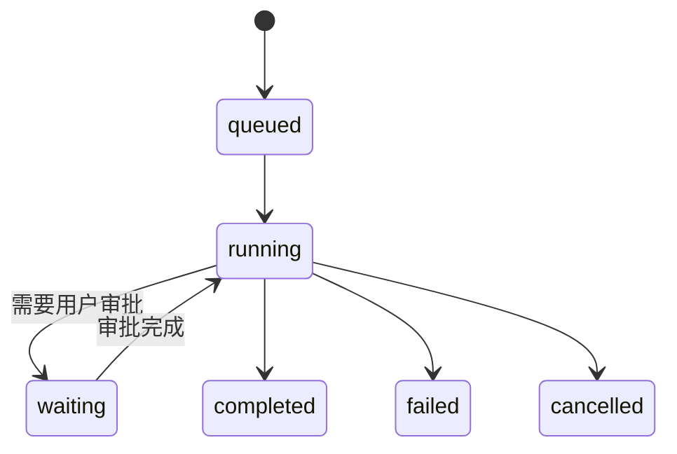
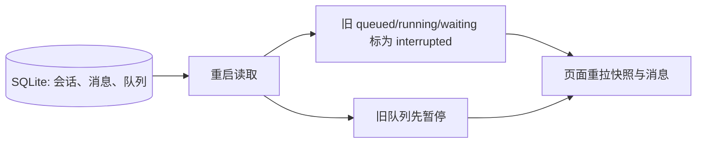
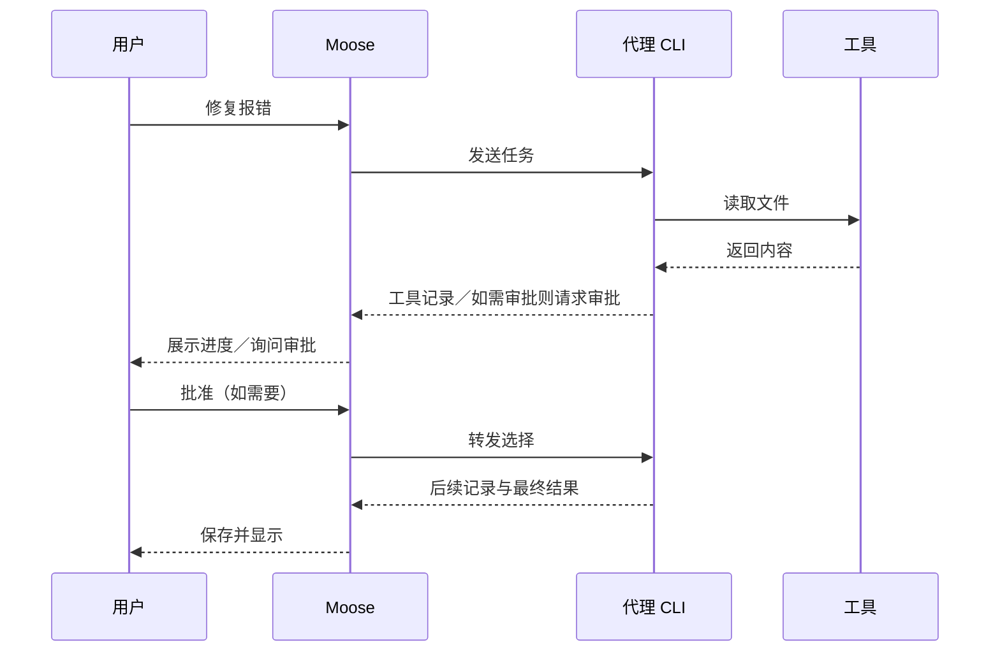

# 前端与 AI 应用面试参考答案

配合[题目](questions.md)使用，共 84 题。先用具体场景说明问题，再讲做法和适用边界。代码和图示用于讲解；标明“Moose”的内容才是项目实际实现。完整项目链路见[项目面试指南](project-interview-guide.md)。

### 复习导航

- [一、TypeScript 与类型系统](#part-1)
- [二、流式处理与实时通信](#part-2)
- [三、前端状态管理与数据流](#part-3)
- [四、性能优化与渲染](#part-4)
- [五、前端 AI 架构设计](#part-5)
- [六、AI 特性与前端工程实践](#part-6)
- [七、AI 工程化与前端工具链](#part-7)
- [八、大模型前端集成](#part-8)
- [场景题](#part-9)

<a id="part-1"></a>

## 一、TypeScript与类型系统

### 1. 在定义AI接口返回的嵌套数据结构（如多轮对话、工具调用结果）时，如何用TypeScript的泛型与条件类型实现灵活的类型推导？

假设页面要调用“发送消息”和“查询用量”：两者都是请求，但参数、返回数据不同。泛型就是把相同的请求外壳复用，让每次调用仍能得到准确的类型提示。

先定义稳定的外层结构，再用泛型表示变化的内容。例如 `Result<T>` 表示“成功时返回 T，失败时返回错误”；`request<M extends Method>(method: M, params: Requests[M]): Promise<Responses[M]>` 让方法名决定参数和返回值。条件类型用于按条件选类型；`T extends Promise<infer U> ? U : T` 中的 `infer U` 就是取出 Promise 里的类型。

简化示例中，方法名决定参数和返回值，写错参数会直接报类型错误：

```ts
type Params = { send: { text: string }; usage: { provider: string } };
type Outputs = { send: { queueId: string }; usage: { used: number } };
declare function request<M extends keyof Params>(
  method: M,
  params: Params[M],
): Promise<Outputs[M]>;

request('send', { text: '修复报错' }); // Promise<{ queueId: string }>
```

Moose 在 `shared/types.ts` 中定义 `Method`、`Requests`、`Responses`，`window.moose.request` 用方法名约束参数和返回类型；IPC 入口再用 Zod 校验实际传入的数据。

### 2. 当AI接口返回的字段可能因模型版本不同而动态变化时，如何设计类型守卫（type guard）与类型收缩策略？

TypeScript 只能检查写代码时声明的类型，无法保证网络收到的 JSON 真按声明返回。类型守卫是运行时检查：检查通过后，代码才把“未知数据”当成某种确定结构。

接口返回值先当作 `unknown`：检查是否为对象，再根据 `type` 或版本字段验证必需字段，最后转换成页面统一使用的类型。比如旧版给 `text`、新版给 `delta.content`，可以在适配器里分别识别，向页面都输出文本增量。

下面的守卫只在真的找到字符串 `text` 后才允许读取它：

```ts
function hasText(value: unknown): value is { text: string } {
  return typeof value === 'object' && value !== null &&
    'text' in value && typeof value.text === 'string';
}
```

缺少关键字段应报告协议错误；多了不认识的字段可忽略。不能直接用 `as` 把数据“断言正确”。Moose 的 `shared/validation.ts` 用 Zod 校验 IPC 参数；各代理适配器把 CLI 原始事件转换为统一的 `AgentEvent`，页面不直接依赖某个 CLI 的字段。

### 5. 设计一个类型系统，用于描述AI Agent执行过程中的状态流转（如思考→执行→观察→完成），并实现类型安全的状态切换。

Agent 一轮任务会经历排队、执行、等待用户批准、结束等状态。如果只用几个互不相关的布尔值，容易出现“已经完成却还在等待批准”的矛盾组合。

用判别联合表示状态，例如 `{ status: 'running', runId }`、`{ status: 'waiting', requestId }` 和 `{ status: 'done' }`。处理事件时再检查转移是否合法：已结束的任务不能被迟到的“开始”事件改回运行中，审批也只能答复仍在等待的请求。

简化状态图（省略失败后的恢复等分支）：



类型能防止漏写字段和遗漏分支，运行时仍须核对当前状态及 `runId`。Moose 用 `Status` 字符串联合表示 idle、queued、running、waiting 等状态；Service 还会检查审批是否属于当前待处理请求。它没有完整的类型级状态机。

### 7. 如何用TypeScript声明一个支持流式Chunk数据与错误处理的泛型接口，并兼容SSE、WebSocket等多种传输方式？

流式回答会不断到达小段数据。SSE 和 WebSocket 只是传送这些数据的通道，页面真正关心的仍是“收到正文、报错还是结束”。

先统一业务事件，`T` 表示正文片段的具体类型：

```ts
type StreamEvent<T> =
  | { type: 'chunk'; runId: string; seq: number; data: T }
  | { type: 'error'; runId: string; message: string }
  | { type: 'done'; runId: string };
```

SSE 和 WebSocket 分别解码消息，再交给同一个处理函数；传输错误与模型报错要分开。

还要约定取消和断线重连：断开连接不等于取消服务端任务。Moose 的适配器把各 CLI 的 stdio 消息转成统一 `AgentEvent`；Web 页面通过 HTTP 发请求、SSE 收业务事件，并不直接读取 CLI 输出。

<a id="part-2"></a>

## 二、流式处理与实时通信

### 1. 请设计一个支持“断线重连+消息去重”的SSE客户端，并处理AI长文本生成中的网络抖动问题。

网络断开时，服务端可能还在生成。重连后若把已经收到的文字再拼一次，回答会重复；若漏了中间一段，回答又会缺字，所以要先确定续接规则。

服务端为一次生成分配 `runId`，为可补发的增量事件分配递增序号。客户端记住最后处理的序号，作为重连游标；断线后带这个序号重连，丢弃重复事件，发现缺号就请求补发。服务端必须保存可补发的事件，否则客户端单靠序号找不回遗漏内容。

例如断线前已处理序号 1、2；重连后依次收到 2、3，就丢弃重复的 2，只接上 3。若直接收到 4，说明 3 丢了，必须补读或重拉完整结果。

序号检查的核心逻辑（设计示意；服务端还需支持补发）：

```ts
if (event.seq <= lastSeq) return;          // 重复事件
if (event.seq !== lastSeq + 1) return reloadSnapshot(); // 中间缺号
append(event.text);
lastSeq = event.seq;
```

网络抖动时保留已有文字并提示重连，主动停止则另发取消请求；不要把重连当作重新提交生成任务。原生 `EventSource` 可借事件 `id`／`Last-Event-ID` 续接。Moose Web 的 `EventSource` 断线后自动重连，重连成功会重新拉快照；页面按消息 ID 和 `seq` 接受较新版本。服务端没有按 SSE 事件 ID 补发每个增量。

### 2. 如何在前端实现一个“流式Markdown解析器”，在AI逐字输出过程中实时渲染标题、列表、代码块，并避免标签截断？

Markdown 不是逐字就能确定格式的：例如开头收到两个反引号时，还不知道第三个会不会到来。显示流式回答时，要允许尚未写完的语法暂时保持未完成。

先累积原文，再按帧或短时间间隔解析当前全文；未闭合的代码块可暂时按代码显示，生成结束后再解析一次。

长文本若解析成本高，可缓存已稳定的块，只重算尾部，但要处理后续语法影响前文的情况。Moose 后台每 80 ms 批量保存并推送变化的消息；前端用 `react-markdown` 渲染当前全文，没有增量 AST 解析器。

### 3. 当AI流式返回的数据包含多个独立片段（如文本、代码、表格）时，如何设计Chunk合并算法以保证片段完整性？

一轮回答可能同时产生正文、工具记录和表格。网络包的到达顺序不一定就是页面应显示的顺序，也不能把不同内容的文字拼进同一条消息。

先给片段身份：同一轮用 `runId`，每个文本、代码或表格片段用 `partId`，片段内再用序号。相同片段按序追加、不同片段分别保存；重发的序号丢弃，缺号等待补发。若上游发来的是完整快照，就替换旧内容，不再追加。

显示顺序单独记录，不能以网络到达顺序代替。工具参数等结构化内容未收全时先缓存，不能拿半截 JSON 执行。Moose 用 `runId:event.key` 生成消息 ID，同一条记录更新时递增 `seq`；页面按 ID/seq 合并，再按 `position` 排序。

Moose 按整条消息版本合并的关键代码（摘自 `src/lib/workspace.ts`）：

```ts
const old = rows.get(row.id);
if (!old || old.seq < row.seq) rows.set(row.id, row);
// 最后按 position 排序，而非按事件到达顺序
```

Moose 收到同一条消息的旧版本 `seq=6` 和新版本 `seq=8` 时，保留 8；它传给页面的是整条消息的新版本，因此是**替换旧记录**，不是把两份正文拼起来。

### 5. 在React 18+中，如何用useTransition与useDeferredValue优化AI流式输出的渲染性能，避免主线程阻塞？

浏览器主要在同一条线程上处理输入、运行 JavaScript 和更新画面。长回答频繁重新解析时，用户打字或点停止按钮就可能变慢；这题要分清哪些更新必须立刻显示。

输入框和停止按钮应先响应，长回答渲染可以稍后更新。`useDeferredValue` 可让昂贵的回答组件暂时使用旧文本；`useTransition` 可将非紧急的状态更新降优先级，但不要用它控制输入框本身。

以下是把输入更新与长回答渲染分开的用法示意：

```tsx
const deferredText = useDeferredValue(streamedText);
return <MarkdownView source={deferredText} />;
```

`streamedText` 可以继续更新；昂贵的 Markdown 组件可稍后跟上。

这两个 Hook 不会让一段同步运行 200ms 的解析代码自动变快；仍要减少解析次数、缓存结果或放进 Worker。Moose 目前靠批量推送、消息级 `memo` 和分页减轻渲染，没有使用这两个 Hook。

### 8. 当AI服务端返回的流式数据包含自定义事件（如[DONE]、[ERROR]）时，前端如何解析并触发相应回调？

“一次读到的数据”和“一条完整事件”不是一回事。网络可能把一条 SSE 事件拆成两次送来，也可能一次送来好几条，先组装完整事件才能判断结束标记。

实现时用流式 `TextDecoder` 解码，保留未完成的行，遇空行才结算一条 SSE 事件；同一事件中的多行 `data:` 要合并。

SSE 组帧的关键是把最后半条留到下一次读取（解析示意）：

```ts
buffer += decoder.decode(chunk, { stream: true });
const frames = buffer.split('\n\n');
buffer = frames.pop() ?? '';
for (const frame of frames) dispatchCompleteEvent(frame);
```

这里以 `\n` 为换行符示意；实际还要兼容 `\r\n`，并解析每条事件中的多行 `data:`。

只有完整数据恰好是 `[DONE]` 才结束；`[ERROR]` 按约定解析，不能在普通正文中搜到字符串就触发回调。网络断开、解析失败和模型报错分别处理，完成后清理监听。Moose Web SSE 传 JSON 业务事件，不使用 `[DONE]` 文本标记；CLI 侧的 `rpc.ts` 先按换行拆出完整 JSON，再分发响应、通知和审批请求。

<a id="part-3"></a>

## 三、前端状态管理与数据流

### 1. 在大型AI应用中，如何用Zustand或Redux Toolkit管理多轮对话、生成任务、用户配置等复杂状态？

聊天页的状态变化频率不同：输入框每敲一个字就变，用户设置很少变，消息还会由后台持续更新。把它们都放进一个大对象，容易让无关组件反复更新。

先按归属拆状态：消息和任务是服务端数据，设置是低频共享状态，输入框与弹窗是局部状态。若用 Zustand，可按 ID 存消息，组件用 selector 只订阅需要的那条；更新一条消息时保留其他对象引用。

按 ID 订阅单条消息的示意；更新另一条消息时，这个选择结果可保持不变：

```ts
const message = useChatStore((state) => state.messagesById[id]);
// 更新时只替换 messagesById[id]，保留其他消息对象
```

不要把每个输入字符和全部历史都塞进一个全局 store，也别把能计算出的值再存一份。Moose 的 `useWorkspace` 管全局快照，`useTranscript` 管当前会话消息与分页，输入框状态留在组件；没有使用 Zustand 或 Redux。

### 2. 设计一个“状态快照”系统，支持将AI对话的完整状态（包括流式中间结果）序列化保存与恢复。

所谓快照，是重开页面或应用后还能用的数据记录，不是把正在运行的整个 JavaScript 程序保存下来。先区分“可持久化的数据”和“只能重新建立的连接、进程”。

快照只保存能恢复的事实：数据版本、会话配置、消息及版本、待发送队列、最后确认的游标和原生会话 ID。写入时保证这些记录一致；恢复时先校验和迁移，再补读消息。

运行中的 Promise、网络连接和进程不能序列化，重启后应标为中断并核对结果。Moose 的 `Snapshot` 不含全部消息；消息另存 SQLite，重启时修正运行状态并暂停旧队列。

恢复时只恢复数据，并修正无法继续的运行状态（示意）：

```ts
const status = saved.status;
const restoredStatus = ['queued', 'running', 'waiting'].includes(status)
  ? 'interrupted' : status;
// 连接和 Promise 由新进程重新建立
```

Moose 的恢复顺序可以记成：



### 5. 用户发送 AI 请求后，怎样立即给出反馈，同时避免把尚未生成的内容当成结果？

用户点击发送后，模型可能还要排队或等审批。此时页面要立即承认“请求已收到”，却不能装作回答已经生成。

发送后立刻显示“已提交／排队中”，这是真实状态；不要预先显示一段虚构的 AI 回答。后台确认后关联正式任务 ID，收到真实增量才展示回答。失败要保留用户输入，让用户决定是否重试。

重试要防重复执行，旧会话的迟到结果也不能覆盖当前会话。Moose 的 `send` 返回表示输入已持久化到队列，不表示模型已经完成。

<a id="part-4"></a>

## 四、性能优化与渲染

### 1. 对话历史达到万条时，怎样做搜索与过滤，并验证实际延迟？

一万条消息放在数据库里并不等于页面要一次加载一万条。搜索时，真正影响体验的还有查询耗时、传到页面的数据量和渲染数量。

不要先把一万条历史全搬到浏览器再过滤。让存储层按关键词、会话和时间过滤，返回有限的一页结果；输入时做短暂防抖，取消过期查询。高频搜索可考虑全文索引，并注意排序与分页稳定性。

用游标取一页历史的查询示意，下一页带上本页最小的 `position`：

```sql
SELECT * FROM messages
WHERE session_id = ? AND position < ?
ORDER BY position DESC LIMIT 80;
```

用真实规模数据分别测查询耗时、首屏显示和内存，报告样本及统计口径。Moose 的 Store 按 `position` 游标每次读取 80 条消息，前端按需加载更早记录；目前没有完整的对话全文搜索。

### 2. 请设计一个“虚拟化渲染”方案，用于超长AI生成内容（如数万Token的文档）的平滑滚动与快速定位。

普通列表会为每条历史消息创建页面元素；消息越多，浏览器布局和滚动的负担越重。虚拟列表让屏幕外的消息暂时不占真实 DOM 节点。

虚拟列表只挂载可视区域和前后少量内容；长消息按实际高度测量，避免估错后滚动跳动。向上加载旧消息时保持用户当前看到的位置，跳转目标先定位记录再滚动过去。

生成中的消息高度会变化，代码块也可能展开，所以要处理重新测量和键盘可访问性。Moose 每页加载 80 条历史消息，离屏消息使用 `content-visibility: auto` 减少布局成本；它没有按像素位置维护完整虚拟列表。

例如有一万条消息、屏幕只容得下约二十条：虚拟列表只为这二十条及附近几条创建 DOM，其他位置留高度占位；滚到别处再替换显示的那一批。分页则是从存储中分批取数据，两者可以同时使用。

### 5. 设计一个“按需加载”策略，仅渲染AI对话列表中可视区域及附近的消息，其余部分保留为纯文本。

一条很长的 AI 回答即使只有一条消息，Markdown 解析和代码高亮也可能昂贵。因此“少加载消息”和“少渲染远处的消息内容”是两层不同优化。

保存完整原文，显示层按视口决定渲染成本：可见项渲染 Markdown，远处先保留轻量占位或纯文本摘要，并在接近视口时预渲染。切换展示方式不能改变消息身份或让滚动位置跳动。

它比普通分页复杂，先用性能数据证明有必要。Moose 当前做分页、消息级 `memo` 和离屏布局优化，没有实现题目所说的“只渲染可视区”方案。

### 9. 如何用React.memo、useMemo、useCallback避免AI消息列表因无关状态变更导致的全量重渲染？

流式输出时往往只有最后一条消息在变，前面几百条不该每次都重新渲染。React 的缓存能帮忙，但前提是旧消息的对象引用确实保持不变。

先用 React Profiler 查看哪些组件重复渲染、各耗时多少。消息列表用稳定 ID 作 key，更新一条消息时保留其他消息的对象引用，再用 `React.memo` 隔开无关行；昂贵的解析结果可 `useMemo`，传给子组件的回调按需要稳定。

消息行的 `key` 和对象引用都要稳定，缓存才有机会生效：

```tsx
const MessageRow = memo(({ message }: { message: Message }) =>
  <article>{message.text}</article>);
messages.map((m) => <MessageRow key={m.id} message={m} />);
```

`memo` 挡不住自身 props 或 Context 变化，也不该给每个小计算都套缓存。Moose 的消息合并会保留未变化记录，时间线也使用消息级 `memo`。

<a id="part-5"></a>

## 五、前端AI架构设计

### 2. 如何用Monorepo管理AI前端、Node.js中间层、共享类型定义、工具脚本的统一代码库？

一个产品可能同时有桌面应用、网页、后台和共享类型。放在同一仓库便于一起修改，但必须说清哪些是独立包、哪些只是同一包里的目录。

Monorepo 是多个可独立管理的包共用仓库和锁文件。可按 `apps/web`、`apps/server`、`packages/contracts` 划分；共享契约只放两端都需要的类型和校验，浏览器包不能误引入 Node 依赖。CI 按依赖关系检查受影响的包。

Moose 仓库已有 pnpm workspace，包含应用根包、站点和商店包；应用内部的 `src`、`electron`、`shared` 仍是目录分层，不是三个独立 package。

### 5. 如何用DDD（领域驱动设计）划分AI前端的核心领域（对话、模型、工具、知识库）与界限上下文？

“领域”可以先理解为一组由同类业务规则管理的对象。比如会话消息如何保存，与代理工具如何执行，是两类不同规则；DDD 要回答它们的边界在哪里。

按业务规则划边界，而不是按页面或数据库表机械分层：对话管会话与消息，执行管队列、取消和审批，接入层处理不同代理协议；如果真有知识库，再把文档和检索单独建域。模块之间用明确 ID 和接口协作。

Moose 的 Project、Session、Message、QueueItem 是业务概念，Provider 与 Store 隔离协议和存储；规则仍有不少集中在 Service，不能说已完整落地 DDD。

### 6. 设计一个“事件驱动”架构，用EventEmitter或MessageChannel解耦AI各个模块（输入、处理、输出）。

点“发送”时，调用方需要知道请求有没有被接受；之后“产生新消息”则可能同时影响时间线、角标和存储。前者是请求，后者是事件，混在一起会难以追踪。

实现上，`send` 返回操作结果；`messageChanged` 通知多个订阅者。事件带实体 ID 和版本，订阅时先读快照再接增量；漏事件时重新拉快照。

订阅事件后，组件离开时要注销监听（接口用法示意）：

```ts
const unsubscribe = window.moose.subscribe((event) => {
  if (event.type === 'changed') void refresh();
});
return unsubscribe;
```

每个请求要有 ID、超时和错误处理，组件卸载要取消订阅。Moose 的 `request` 返回操作结果，`subscribe` 接收 `message`、`changed` 等事件；前端收到 `changed` 后重拉快照，收到 `message` 后按 ID/seq 合并。

### 9. 前端能否直接调用多个 AI 服务商 API？密钥、权限和计费应放在哪里处理？

浏览器里的代码和请求可以被用户查看，写进去的长期密钥就不能再算秘密。接多个模型服务商时，先决定凭据属于谁、谁有权调用、费用由谁承担。

常见方案是后端持有长期凭据，验证用户权限、限流、记录用量后转发模型响应；只有服务商提供受限短期凭证或用户自带密钥时，才考虑浏览器直连。

多服务商的输入和错误可在公共层统一，模型能力差异留给适配器。Moose Renderer 不直连模型：它调用本机后台，由代理 CLI 使用自己的登录状态，这与 SaaS 的服务端代付计费不同。

<a id="part-6"></a>

## 六、AI特性与前端工程实践

### 1. 在前端实现一个Agent循环时，如何管理工具调用的异步执行、超时处理与结果合并？

例如用户让 Agent 修一个报错：模型先要求读文件，看到文件内容后才决定如何修改。这种“模型提出下一步、工具返回结果、模型再判断”的往复，才叫 Agent 循环。

Moose 中各方的分工如下。图里的审批只在代理提出请求时发生：



执行这段循环的应是可信后台。前端负责展示每一步、收集审批和发出取消指令，不能直接执行模型给出的 Shell 或数据库命令。

如果自行实现循环，应给每轮任务和每次工具调用分别编号（示意为 `runId`、`callId`），结果才能对应回原调用。互不依赖的读取可并行，写入或依赖前一步的调用要按顺序。比如同时读两个文件，一个成功、一个超时，就分别返回“文件内容”和“超时”，不能只留下最后完成的一项。

自己实现工具执行时，超时必须传到工具本身（示意）：

```ts
const controller = new AbortController();
const timer = setTimeout(() => controller.abort(), 10_000);
try { return await tool.run(args, { signal: controller.signal }); }
finally { clearTimeout(timer); }
```

工具若不支持 `signal`，还需调用其专门的停止接口。

超时要通知底层工具停止；`Promise.race` 只结束等待，不会自动停进程。断线后有副作用的调用可能结果未知，不能盲目重跑。Moose 实际由代理 CLI 决定并执行工具；Service 保存工具记录，把审批关联到当前 `runId` 和待处理消息，停止时取消并关闭适配器。

### 3. 在AI产品中，前端可以通过哪些技术手段（如缓存、压缩、懒加载）帮助降低Token成本？

Token 是模型实际读取或生成的内容单位，不是网页下载的字节数。压缩图片、懒加载页面可能让网页更快，却不会自动缩短发给模型的提示词。

Token 成本取决于真正送进模型和由模型生成的内容。可以减少重复上下文、只引用相关文件片段、压缩过长历史、限制无必要的输出；相同且允许复用的请求才考虑缓存。

Moose 可以选择文件引用并显示底座给的上下文用量，但没有自行完成整套 token 裁剪和费用结算。

### 9. 在AI多轮对话中，如何设计上下文窗口的管理策略（如滑动窗口、关键信息提取、自动摘要）？

模型一次只能看到有限长度的内容，这个上限叫上下文窗口。对话变长后，不能简单把最旧消息一刀切掉，否则早先的约束和工具结果可能丢失。

先给上下文分预算：必须遵守的指令、最近对话、相关文件与工具结果、最终输出预留。接近窗口上限时，优先去掉重复材料或只取相关片段，再对较早历史做摘要；工具调用和其结果要成对保留。

例如总预算为 8 千 token，可先给必需指令 1 千、最近对话 3 千、相关文件 2 千、输出预留 2 千。若文件再多，就只取相关片段或压缩较早对话；这些数字只是解释分配方法，不是 Moose 的固定配额。

摘要应写明已做决定、约束、未完成事项，并保留原文供核对，因为摘要可能漏细节。Moose 主要恢复底座原生会话，上下文压缩由底座处理，不应说成 Moose 自己实现了自动摘要。

<a id="part-7"></a>

## 七、AI工程化与前端工具链

### 1. 如何设计一个AI前端项目的标准化目录结构，兼顾业务功能、共享组件、工具函数与类型定义？

目录结构的作用是让改一处功能时能找到代码，并看出哪些模块可以相互依赖。AI 应用尤其要分清浏览器界面、系统能力、代理协议和持久化存储。

目录先按运行边界划分，再按功能细分；让人能迅速找到 UI、业务规则、外部协议和存储。共享目录只放确有共同维护需求的契约，避免把所有代码塞进 `utils`。

Moose 的 `src` 放 React，`electron` 放本机业务，`shared` 放跨进程类型和校验；`electron/providers` 处理代理协议，`electron/db` 处理存储。依赖方向应是页面经受限接口调用后台，而不是页面直接访问数据库。

### 2. 请设计一套AI前端代码规范（ESLint、Prettier、Commitlint），并集成Git Hooks自动检查。

代码规范不是一个工具：有的工具检查类型，有的找潜在错误，有的只统一空格与换行。它们各管一类问题，放进本地检查和 CI 才能稳定执行。

Commitlint 可约束提交信息；Git Hook 提前反馈，CI 再执行同一组检查，避免本地跳过 Hook 就漏检。生成代码和构建产物应排除，规则冲突要先解决。

本项目可实际运行的检查命令是：

```sh
pnpm typecheck
pnpm lint
pnpm test
```

这些命令适合复用到 Hook 或 CI，是否启用由各自配置决定。

Moose 目前使用 TypeScript、oxlint、oxfmt、测试和构建脚本；不能把题目列出的 ESLint、Prettier、Commitlint 都说成已安装。

### 4. 设计一个AI前端项目的CI/CD流水线，包括代码检查、单元测试、E2E测试、构建优化、自动部署。

CI/CD 是从代码提交到可安装版本的一连串自动检查和构建。关键不是列出一堆工具名，而是让有问题的代码在发布前被拦住，并知道最终产物对应哪个提交。

PR 阶段先锁定依赖，再跑类型、lint、单测、构建和关键 E2E；发布阶段只使用通过验证的提交及制品，记录版本、签名和回滚方式。真实模型测试单独受控执行，避免每个 PR 都受登录、额度和网络波动影响。

Moose 有对应检查和打包命令；命令存在不等于已经有自动部署流水线。它的桌面与 Web 安装器还必须按同一版本一起验证和发布。

### 6. AI 应用怎样监控页面体验（LCP、INP、CLS）和模型响应（首字时间、生成耗时）？

用户感觉“慢”可能是页面半天不出现、点击没反应，也可能是模型迟迟不出第一个字。它们发生在不同阶段，混成一个总耗时就找不到瓶颈。

页面体验和模型响应要分开测。LCP 看主要内容何时出现，INP 看交互响应，CLS 看布局是否跳动；AI 侧记发送、首个有效输出和完成的时间，再区分工具执行、审批等待和模型生成。

模型任务的两段时间要分别记（计时示意）：

```ts
const sentAt = performance.now();
onFirstChunk(() => record('firstChunkMs', performance.now() - sentAt));
onDone(() => record('totalMs', performance.now() - sentAt));
```

工具等待和审批时间还需单独标记。

按设备、模型、版本看分位数和失败率，不只报平均值。Moose 做过特定场景的启动、包体与内存测量，但尚无完整的线上 Core Web Vitals 和模型耗时监控面板。

### 8. 设计一个AI前端日志系统，结构化记录用户操作、AI请求、响应时间、错误信息，便于回溯分析。

用户说“任务卡住了”时，单看一条错误信息通常不够。日志要能沿同一次请求或执行，把入队、启动、工具调用和失败按时间串起来。

用 `requestId`、`runId` 把“入队、开始、工具、审批、完成”串起来；每条日志记录时间、事件、耗时和错误码。普通日志只留必要摘要，调试日志按需开启并限制大小，避免把用户输入、密钥或完整回答直接上传。

一条结构化日志只保留排查所需的字段（示意）：

```ts
log({ event: 'run.failed', runId, requestId,
  durationMs, errorCode, version });
```

用户输入和密钥不要放进这个对象。

Moose 把用户消息、工具、审批和错误按 `runId` 保存到 SQLite，并在时间线按顺序展示；这能追查一次任务，但没有覆盖所有用户点击的遥测平台。

### 9. 如何用Webpack或Vite优化AI前端构建性能，实现代码分割、Tree Shaking、预加载、持久缓存？

构建慢影响开发和发布，页面加载慢影响用户，两者要分别测。拆包、预加载和缓存也有代价：提前加载太多内容，首屏反而会变慢。

先量构建时间和首屏实际加载量，再用动态 `import` 延后不急需的面板；让可静态分析的模块进入 Tree Shaking。预加载只给马上要用的内容，过多反而抢首屏带宽。开发依赖缓存、浏览器资源缓存和生产构建缓存要分别处理。

非首屏面板可在用户打开时才加载（React 示意）：

```tsx
const ReviewPanel = lazy(() => import('./review-panel'));
// 打开面板时在 Suspense 内渲染 ReviewPanel
```

Moose 使用 Vite，也做过面板按需加载和安装包裁剪。包体变小不自动证明启动更快，要用同条件的打包应用实测。

### 10. 请设计一个AI前端依赖管理策略，定期更新模型SDK、工具库，并评估兼容性与性能影响。

升级模型 SDK 可能改变流事件、工具调用参数或错误格式，即使项目还能编译，也可能在真实运行时出错。依赖更新因此要验证行为，不只是把版本号改掉。

锁定版本和锁文件，小批量更新依赖；先看变更说明，再跑类型、协议测试、关键 E2E 与打包验证。模型 SDK 尤其要查流事件、工具参数、取消和错误格式；原生依赖还要核对运行时 ABI。

Moose 锁定 pnpm 依赖版本；Codex 协议类型可用 `pnpm protocol:generate` 重新生成，之后还要跑类型检查、测试和真实 CLI 流程，不能只看生成成功。

<a id="part-8"></a>

## 八、大模型前端集成

### 1. 如何用OpenAI Function Calling或Tools在前端实现AI工具调用（如计算器、搜索、数据库查询）？

模型说“调用计算器”只是给出调用意图，计算器并不会因为模型输出了几个字就自动执行。应用需要验证请求、执行受允许的工具，再把结果送回模型。

具体流程是先收全模型给出的工具名和参数，校验名称、参数与用户权限，由可信后台执行，再按原 `call_id` 把成功或错误交还模型；多次调用要分别匹配，并设置轮次上限。

例如模型给出示意调用 `{ callId: 'c1', name: 'calculator', args: { expression: '2+3' } }`。后台确认允许使用计算器后得到 `5`，再把 `{ callId: 'c1', result: 5 }` 交还模型；相同 `callId` 保证结果不会配到另一次调用上。

工具调用的关键边界是白名单与参数校验（后台伪代码）：

```ts
const tool = allowedTools[call.name];
if (!tool) throw new Error('不允许的工具');
const args = tool.schema.parse(call.args);
return { callId: call.callId, result: await tool.run(args) };
```

浏览器不应保存数据库凭据或执行任意命令。Moose 不在 Renderer 直接调用模型 Tools API。代理 CLI 执行工具并发出事件；适配器转为工具记录，Service 保存和推送，审批则由 Service 校验后按原请求交还 CLI。

### 5. 如何用WebSocket实现双向流式通信，支持AI模型主动推送进度更新、中断信号、工具调用请求？

WebSocket 允许浏览器和后台在同一连接上双向发消息，适合同时传生成内容和取消、审批指令。但连接断开后，先前消息不会自动重新出现。

先约定消息格式：类型、`runId`、请求 ID、序号和内容。服务端推送增量、工具请求与完成；客户端发送审批、取消等指令。连接中断后，要靠服务端保留的事件和游标补读；重新打开 WebSocket 本身不会恢复漏掉的内容。

收到事件时先核对任务与序号（客户端示意）：

```ts
socket.onmessage = ({ data }) => {
  const event = JSON.parse(data);
  if (event.runId !== activeRunId || event.seq <= lastSeq) return;
  if (event.seq !== lastSeq + 1) return reloadSnapshot();
  lastSeq = event.seq; apply(event);
};
```

连接要鉴权、限缓冲并处理慢客户端；取消请求也要等服务端确认。Moose Web 用 HTTP 发命令、SSE 收后台事件；桌面端经 preload/IPC 转发到同一后台。它没有用于模型事件的 WebSocket 服务。

### 6. 如何用Server-Sent Events实现模型输出的“进度条”与“部分结果预览”？

SSE 能让后台不断往页面发送内容，所以用户可以边等边看回答。“正在输出”是可观察状态，“已经完成 63%”则需要已知总量，这两件事要分开。

SSE 可以逐条发 `delta`、状态、`done` 和 `error`。前端边收边展示正文，收到明确的 `done` 才认定完成；断线只是连接问题。若不知道总 token 或总步骤，就显示“正在生成”，不要伪造百分比。

页面只接收增量和状态，取消要走另一条请求（SSE 示意）：

```ts
const stream = new EventSource('/events');
stream.addEventListener('delta', (e) => append(JSON.parse(e.data).text));
stream.addEventListener('done', () => stream.close());
```

长文本要批量刷新，用户停止时另调取消接口。Moose 的 `/api/events` 用 SSE 推送消息和状态；页面按消息版本显示部分回答，完成由任务状态判断，不把上下文用量当生成百分比。

<a id="part-9"></a>

## 场景题

### 1. 如何判断用户设备

“判断设备”不是一个单独的问题：为了排版、识别触屏，还是提供安装包，所需信息都不同。手机屏幕宽也可能很大，桌面浏览器窗口也可能很窄。

布局看视口和媒体查询，触控交互看 `pointer/hover`，功能支持做特性检测；只有分发不同安装包时才需要系统和架构信息。UA 可作辅助，但会被伪装，屏宽也不能证明设备一定是手机。

Moose 的系统信息可由 Electron 后台取得，页面通过受限接口使用。

### 2. 将多次提交压缩成一次提交

假设自己连续提交了三次小修正，合并请求里想只留一条清楚的提交记录，这就是“压缩提交”。它会重写提交 ID，所以先看这些提交是否已经被别人使用。

自己尚未共享的分支，可用 `git rebase -i HEAD~N` 将后续提交设为 `squash`／`fixup`；也可 `reset --soft` 后重新提交。先确认基准提交并保存未提交改动。

这会改写提交历史。若已经推送并有人基于它开发，先协调；必须更新远端时用 `--force-with-lease`，不要直接强推。只想让合并结果是一条提交，也可用 squash merge。

Moose 提供 Git 改动预览、暂存和提交入口，提交前会重查 HEAD 与暂存区；没有压缩已有提交的界面操作。

### 4. 滚动跟随导航（电梯导航）该如何实现

长文档侧边的目录会随着正文滚动高亮当前章节，常叫电梯导航。它有“点目录定位”和“滚动正文更新目录”两个方向。

电梯导航要双向联动：点击目录滚到对应章节；用户手动滚动时，目录高亮当前章节。章节设稳定 ID，用 `scrollIntoView` 定位，并用 `scroll-margin-top` 避开固定头部。

用 IntersectionObserver 观察章节，统一规定多章同时可见时选哪章；平滑滚动期间别让高亮来回跳。还要照顾键盘、减少动画设置和页面底部的特殊情况。

章节进入观察范围时更新目录高亮（核心示意）：

```ts
const observer = new IntersectionObserver((entries) => {
  const current = entries.find((e) => e.isIntersecting);
  if (current) setActiveId(current.target.id);
}, { rootMargin: '-20% 0px -60% 0px' });
sections.forEach((section) => observer.observe(section));
```

实际还要在卸载时 `disconnect()`，并规定多个章节同时命中的顺序。

Moose 的候选列表用 `scrollIntoView` 保持当前选项可见，但没有页面章节式电梯导航。

### 6. 如何统计页面的long task（长任务）

页面点了按钮却隔一会儿才响应，常见原因是主线程一直忙于某段 JavaScript。长任务记录的是这段连续占用时间，不直接告诉你是哪一行代码。

用 `PerformanceObserver` 订阅 `longtask`，统计主线程被连续占用约 50ms 以上的次数、开始时间和持续时间；先检查浏览器是否支持，结束时断开观察。

浏览器支持时订阅长任务（核心示意）：

```ts
const observer = new PerformanceObserver((list) => {
  for (const entry of list.getEntries()) record(entry.startTime, entry.duration);
});
observer.observe({ entryTypes: ['longtask'] });
```

它能告诉你“何时卡了多久”，通常不能直接指出业务函数。要定位代码，还需 Performance 录制和源码。Moose 目前没有自动采集 long task，遇到长回答卡顿需用浏览器性能工具定位。

### 7. PerformanceObserver如何测量页面性能

浏览器会记录导航、图片加载、绘制等性能事件。`PerformanceObserver` 像一个订阅器：告诉浏览器想看哪类记录，之后在回调里接收。

按问题订阅 `navigation`、`resource`、`paint` 等类型，支持时用 `buffered` 补读已产生的条目。业务阶段可用 `performance.mark/measure` 单独计时。

观察回调只做轻量收集，随后聚合并采样上报。LCP、CLS 等不能随便拿某一条 entry 当最终值；跨进程的 `performance.now()` 也不能直接相减。

Moose 的性能脚本用 `performance.now()` 测特定流程；产品内没有用 `PerformanceObserver` 持续采集页面性能条目。

### 8. 移动端如何实现下拉滚动加载（顶部加载）

聊天列表向上翻旧消息时，新消息会插到现有内容上方。如果只把数据插入列表，原本正在看的那行会被推到下面，用户会感觉画面突然跳了。

聊天历史向上加载时，接近顶部才按游标取更早一页；用 `loading` 和 `hasMore` 防重复请求。插入旧消息前记下首个可见消息及其偏移，插入后让它仍留在原位置，避免画面跳动。

插入旧消息前后用容器高度差补偿滚动位置：

```ts
const before = list.scrollHeight;
await loadOlderMessages();
requestAnimationFrame(() => {
  list.scrollTop += list.scrollHeight - before;
});
```

这是等高差补偿的简化写法；图片后加载时还需再校正。

图片等内容后续改变高度时还要校正。Moose 已有顶部历史分页，但目前通过“加载更早”按钮触发，并非自动下拉加载。

### 9. 判断页签是否为活跃状态

切换到另一个浏览器页签，和把当前窗口移到后台，不一定是同一种状态。“可见”表示页面仍能被看到，“有焦点”表示键盘输入会交给它。

代码中用 `document.visibilityState`／`visibilitychange` 判断页签是否可见；用 `document.hasFocus()` 判断是否可接收键盘输入。并排窗口可能可见却没焦点。

隐藏时可暂停动画和非必要轮询，恢复时补读数据；不能因为页签隐藏就停止后台任务。

Moose 在审阅面板仅于页签可见时轮询 Git 状态；扩展面板还在窗口重新获得焦点时刷新。任务运行由后台管理，不随页签隐藏而停止。

### 10. 在网络带宽一定的情况下，切片上传感觉和整体上传消费的时间应该是差不多的这种说法正确吗？

把文件切成十块不会把 10 MB 变成更少的字节。分片主要改变失败后怎样重传、能否暂停续传，而不是改变带宽本身。

理想情况下，总字节和总带宽一样，纯传输时间下限都接近“数据量 ÷ 带宽”；分片不会凭空增加带宽。真实耗时还包括请求、校验和合并开销。

分片的主要价值是失败后只重传一块、支持暂停续传和有界并发。分片过小增加请求开销，并发过多也可能拥塞，所以不能断言一定与整文件同速或快几倍。

Moose 附件先按单文件 20 MB 限额导入本地受控目录；Web 上传按文件逐个提交，没有分片上传来提升传输速度。

### 11. 大文件切片上传的时候，确定切片数量的时候，有那些考量因素

例如 1 GB 文件若每片 1 MB，就会产生约一千次上传请求；每片 100 MB，请求少了，但失败时可能要重传很大一块。片数其实由片大小决定。

先选每片大小，再用 `ceil(文件大小 / 分片大小)` 得到数量。片小重传便宜但请求多；片大请求少却占内存、失败代价高。还要遵守服务端的分片数、大小和会话时限。

并发数是另一个参数，应根据网络和失败率压测，不要一次读入全部分片。文件哈希、最终合并和移动端内存也要计入。

Moose 当前没有网络分片参数：附件单文件上限 20 MB，由后台一次导入并保存。

### 12. 页面关闭时执行方法，该如何做

关闭页面不是可靠的“最后一次保存机会”：浏览器可能直接结束进程，异步请求也可能发不完。因此重要内容必须在用户编辑过程中逐步保存。

重要状态平时就保存，页面转为 `hidden` 时尽力补存，`pagehide` 作补充；`beforeunload` 只在确有未保存内容时提示。关页时的异步请求未必能完成，移动端进程被杀甚至不触发关闭事件。

关页前尽力补存的事件入口可以这样写（示意）：

```ts
document.addEventListener('visibilitychange', () => {
  if (document.visibilityState === 'hidden') saveDraft();
});
window.addEventListener('pagehide', saveDraft);
```

`saveDraft` 仍应在编辑过程中定期执行，不能只靠这两个事件。

Moose 关窗后共享后台可继续工作，崩溃恢复依靠持久化记录，不靠窗口关闭回调。

### 14. 长文本溢出，展开/收起如何实现

“展开/收起”有两个状态：页面只显示前几行，或显示完整原文。关键是短内容不必出现展开按钮，而且收起不能丢失原文。

折叠时用 `line-clamp` 限行，展开后显示原文；通过 `scrollHeight > clientHeight` 判断是否真的溢出，短内容不显示按钮。宽度、字体或内容变化后要重新判断。

按钮带 `aria-expanded`，展开时尽量保持阅读位置；复制应得到完整原文。Moose 的工具与思考记录可折叠，普通回答不是统一截成三行。

### 15. 如何实现鼠标拖拽

拖动弹窗或调整侧栏宽度，是在页面内移动元素；把本地文件拖进页面，则是浏览器文件拖放。两者看起来像，使用的事件和数据不同。

拖动页面元素可用 Pointer Events：按下时记起点和原位置，`setPointerCapture` 保证移出元素仍收到移动，移动时更新 `transform`，抬起或取消时清理。按需用 `requestAnimationFrame` 合并更新，并限制越界。

要区分点击与拖动，触屏还要配置 `touch-action`；重要操作提供键盘替代。系统文件拖入页面则用 drag/drop 与 DataTransfer，是另一类需求。

拖动开始时捕获指针，结束时释放（关键代码）：

```ts
handle.onpointerdown = (e) => handle.setPointerCapture(e.pointerId);
handle.onpointermove = (e) => {
  if (handle.hasPointerCapture(e.pointerId)) resizeTo(e.clientX);
};
handle.onpointerup = (e) => handle.releasePointerCapture(e.pointerId);
```

实际还要处理 `pointercancel` 和宽度边界。

Moose 的审阅面板宽度拖动就使用 Pointer Events 和 `setPointerCapture`，还提供方向键调整；文件拖入输入区则使用 `DataTransfer.files`。

### 16. 统计全站每一个静态资源加载耗时，该如何做

想知道哪张图片或哪个脚本拖慢页面，光测页面总耗时不够，还需要按资源分别记录开始、结束和类型。浏览器的 Resource Timing 提供这类基础记录。

每个页面用 Resource Timing 读取已有资源耗时，再用 `PerformanceObserver` 接收后续记录；按页面、资源类型和发布版本汇总，长页面定期消费以免缓冲溢出。

URL 要去掉敏感参数。跨域资源若未提供 `Timing-Allow-Origin`，部分阶段时间不可见；能加载 CDN 资源，不代表能取得全部内部耗时。

Moose 目前没有逐资源的 Resource Timing 采集；性能脚本测的是指定应用流程，不能当作全站资源监控。

### 17. 防止前端页面重复请求

重复请求有不同成因：用户连点、多个组件同时读同一数据，或旧搜索还没结束就发新搜索。它们的处理方式不一样，先分清来源。

连点按钮要限制提交；两个组件读同一数据可共享同一个在途 Promise；搜索词变化则取消旧查询并用代次丢掉迟到结果。写操作还需服务端幂等键，禁用按钮不够。

并发读取同一资源时，共用在途 Promise（示意）：

```ts
if (!pending.has(key)) {
  pending.set(key, fetchData(key).finally(() => pending.delete(key)));
}
return pending.get(key)!;
```

写请求不能仅凭这一层去重，仍要服务端支持幂等。

Moose 的额度查询会合并并发读取；前端请求代次则用于防旧快照覆盖新快照，两者解决的问题不同。

### 18. ResizeObserver作用是什么

窗口没变大，侧栏却可能展开，导致中间的终端变窄。此时监听浏览器窗口的 resize 没用，要观察终端容器本身。

ResizeObserver 监听元素本身的尺寸，适合侧栏展开后终端或图表容器变宽、但窗口尺寸没变的情况；`window.resize` 只能监听窗口变化。

观察的是容器尺寸，而不是窗口尺寸：

```ts
const observer = new ResizeObserver(() => fitAddon.fit());
observer.observe(container);
// 组件卸载时 observer.disconnect()
```

回调中不要反复改动被观察元素的尺寸，避免循环触发；必要时比较新旧尺寸并把写操作放到下一帧。组件卸载时断开观察。Moose 终端视图就用它调整终端大小。

### 19. 要实时统计用户浏览器窗口大小，该如何做

如果只是“屏幕窄时改成单栏”，CSS 就能完成；如果页面要显示当前宽高，JavaScript 才需要读取尺寸并监听变化。

业务确实要显示宽高数值时，监听 `window.resize`、读取 `innerWidth/innerHeight` 并按帧合并更新；只改布局用 CSS 媒体查询即可。

手机软键盘和缩放影响的是可视视口，可按需看 `visualViewport`；若关心某个容器而非窗口，用 ResizeObserver。监听要在组件卸载时清理。

Moose 审阅面板初始宽度按 `window.innerWidth` 计算，窗口 resize 时重新限制面板宽度；它没有持续上报用户窗口尺寸。

### 20. 当项目报错，你想定位是哪个commit 引入的错误的时，该怎么做

一个问题可能是最近一百个提交中的某一个引入的。`git bisect` 每次检查中间版本，像二分查找一样不断缩小范围，比逐个回退快。

先找一版明确正常的提交和一版明确出错的提交，写出稳定复现步骤，再用 `git bisect` 逐次把中间版本标记为 `good` 或 `bad`，最终缩小到引入问题的提交。结束后运行 `git bisect reset`。

环境、依赖和测试数据要尽量固定；外部服务波动不能拿来判断提交好坏。可重复的测试脚本还可交给 `git bisect run` 自动执行。

假设 `GOOD` 是正常提交、`BAD` 是出错提交，二分定位的命令是：

```sh
git bisect start BAD GOOD
# 每次复现后执行 git bisect good 或 git bisect bad
git bisect reset
```

Moose 的 Git 面板可查看状态和 diff，但没有内置 `git bisect`；定位引入提交仍要在仓库命令行完成。

### 21. 如何移除一个指定的commit

“移除提交”有两种含义：让已共享的历史保留、另做一次反向修改，或在私人分支上改写历史。选错方式会影响后来基于该提交继续开发的人。

已经共享的提交通常用 `git revert <commit>` 新增反向提交，保留历史；只在自己的未共享分支上，才考虑交互式 rebase 删除该提交。`reset` 到它之前会连后续提交一起移走，不能随手用。

先保持工作区干净并留备份；后续提交若依赖它，撤销可能冲突。撤销合并提交还须指定主线。

Moose 可预览、暂存并创建 Git 提交，没有撤销指定 Git 提交的入口；编辑会话历史也不会回滚工作区文件。

### 22. 如何还原用户操作流程

用户说“我点了发送之后没反应”，仅看最后一条报错往往看不出前面发生了什么。要按时间串起操作、请求、状态和错误，才能还原过程。

用同一会话或 trace ID 串起页面、关键操作、请求、状态变化和错误，再附上版本与设备信息，就能按时间还原大致流程。确实需要视觉回放时再采集脱敏的 DOM 变化；它也不能复原所有 Canvas 或外部系统状态。

密码、输入和附件默认遮蔽，控制采样和保存时长。Moose 的任务时间线能还原代理活动，不等于完整记录用户的每次点击。

### 23. 可有办法将请求的调用源码地址包括代码行数也上报上去？

全站请求都经过同一个封装函数，报错堆栈常只指向这个公共函数。若想找到真正发起请求的业务代码，就要在发起当时留下调用信息。

可以在统一请求入口采集调用堆栈，连同 requestId 和发布版本上报。线上代码通常已打包压缩，需要对应版本的 source map，才能映射回原始文件与行号。若等请求异步失败后才取堆栈，往往只看到公共错误处理代码。

堆栈并非总能准确还原，所以最好同时记录稳定的业务操作名；采样、脱敏，避免上传本机路径或为每个请求付出高额开销。

要在发起请求时捕获调用位置，而不是失败后再抓：

```ts
const callerStack = new Error().stack;
try { return await fetch(url); }
catch (error) { report({ error, callerStack, requestId }); throw error; }
```

上报前还应采样、脱敏，并用对应版本的 source map 还原源码行号。

Moose 通过运行、消息和错误信息排查任务；没有把每次前端请求的调用文件和行号统一上报。

### 24. 请求失败会弹出一个toast,如何保证批量请求失败，只弹出一个toast

页面同时发十个请求，断网时可能同时失败。如果每个请求都弹一次提示，用户会看到十个相同 toast；提示需要聚合，但错误记录不能丢。

让网络层返回每个请求的真实错误，提示层再按错误类型或业务批次聚合。比如断网导致十个请求失败，只弹一次“网络不可用”，但十条失败仍各自记录，不能吞掉结果。

同一批业务请求可用 `allSettled` 汇总成“部分加载失败”；鉴权过期统一跳登录，用户主动取消不弹失败 toast。避免组件和全局拦截器重复提示。

例如三项数据并行加载，只在整批结束后提示一次，同时保留每项的结果：

```ts
const results = await Promise.allSettled([loadA(), loadB(), loadC()]);
if (results.some((item) => item.status === 'rejected')) {
  showToast('部分数据加载失败');
}
```

Moose 的 `useWorkspace.perform` 把界面异步错误写入一个全局错误提示；它没有按业务批次聚合多次请求错误的专用 toast 机制。

### 25. 如何减少项目里面if-else

很多 `if-else` 不一定有问题。要看它们是在表达固定映射、异常条件，还是几种不断扩张的业务策略，再决定是否调整结构。

固定值映射可改成对象表，异常条件用提前返回，复杂但稳定的不同策略可拆成命名函数。真正互斥的流程用 `switch` 也很清楚，没必要为了消灭 `if` 增加抽象。

例如只有固定文案差异时，用映射表即可：

```ts
const label = { queued: '排队中', running: '执行中', waiting: '等待审批' } as const;
function statusLabel(status: keyof typeof label) { return label[status]; }
```

Moose 把不同代理的协议差异放进 Adapter 是有意义的拆分；Service 按请求类型分支并不天然是坏代码。

### 27. 如何实现预览PDF文件

“预览 PDF”可能只要求用户能打开看，也可能要求统一的搜索、页码和标注。需求不同，使用浏览器内置查看器还是自己渲染的成本差很多。

只需“点开看”时，可用浏览器自带 PDF 查看器；若要求统一的页码、搜索和标注，再考虑 PDF.js。带鉴权文件应通过受控地址或请求获取，关闭预览时释放 Blob URL。

大文件只渲染可见页；还要处理跨域、Range 请求、字体和扫描件没有可选文字等问题。Moose 支持附件，不代表已有 PDF 阅读器。

### 28. 如何在划词选择的文本上添加右键菜单（划词：鼠标滑动选择一组字符，对组字符进行操作）

用户先选中一句话，再点右键想要“复制”或“解释”。浏览器能提供选中的文字和位置，但点击菜单时选区可能变化，所以要先保存需要的信息。

在目标区域监听 `contextmenu`，读取浏览器的 Selection／Range；只有选区非空且起止都属于目标区域，才显示自定义菜单。菜单坐标可取鼠标位置或选区矩形，并限制在视口内。

点击菜单可能让选区消失，因此先保存所需文字和位置。支持 Escape、键盘入口；若内容之后会变化，持久标注不能只保存旧 DOM Range。

先确认选区确实属于目标区域，再保存文字（关键示意）：

```ts
const selection = window.getSelection();
const range = selection?.rangeCount ? selection.getRangeAt(0) : null;
if (!range || range.collapsed || !root.contains(range.commonAncestorContainer)) return;
const selectedText = selection!.toString();
```

Moose 的对话和代码审阅支持查看、复制，当前没有针对任意划词弹出操作菜单的功能。

### 29. 富文本里面，是如何做到划词的(鼠标滑动选择一组字符，对组字符进行操作)？

普通网页能选中文字，富文本编辑器还要知道这段文字对应文档模型中的哪个位置。否则 DOM 重排后，评论和加粗可能落到错误的文字上。

浏览器用 Selection 和 Range 表示划词：起点节点与偏移、终点节点与偏移，选区可以跨多个标签。富文本编辑器还要把 DOM 位置映射成自己的文档位置。

加粗、评论等操作应更新编辑器的数据模型并进入撤销历史，而不是直接拼 `innerHTML`；点击工具栏前先保存选区，文档变化后还要能重新定位标注。

Moose 的输入框是普通文本输入，回答由 Markdown 渲染；没有富文本编辑器的选区模型与标注历史。

### 30. 如何做好前端监控方案

监控不是把所有浏览器事件都上传，而是让线上故障能回答“谁受影响、从哪版开始、发生在哪个步骤”。因此先确定要排查的问题，再决定采集什么。

前端监控先回答四件事：哪里出错、影响谁、何时变慢、关键操作是否完成。分别采集 JS 异常、请求失败、页面性能和业务失败，并带上版本、页面、会话或 trace ID，方便串起一次问题。

按影响人数和严重度告警，避免同一错误刷屏；上报需采样、脱敏并控制保存期限。Moose 把任务消息、审批和错误保存到本地 SQLite，可沿时间线排查单次任务；没有完整的远程监控平台。

### 31. 如何标准化处理线上用户反馈的问题

用户报告的通常是症状，例如“发送后一直转圈”，并不等于根因。处理反馈要先把症状变成可复现、可定位的记录，再谈修复。

先记录用户版本、环境、操作步骤、预期与实际结果，并经用户同意收集相关日志。按影响范围和可复现性排序；复现后定位、修复、验证回归，最后把结果回复用户。

Moose 把输入入队、运行、等待审批和失败分别记录为状态；反馈“没反应”时，先查当前会话和 `runId`，再判断卡在页面、后台还是代理 CLI。

### 33. 浏览器有同源策略，但是为何cdn请求资源的时候不会有跨域限制

网页能显示 CDN 图片，却未必能用 JavaScript 读取那张图片的像素。原因是“把资源放进页面”和“读取跨站响应内容”是两种不同权限。

同源策略主要限制跨源读取，不是禁止加载所有跨源资源。页面能嵌入 CDN 图片、样式或经典脚本；但用 `fetch` 读取跨域响应，通常需要 CDN 通过 CORS 响应头明确允许当前页面读取。

模块脚本、字体和 Canvas 像素读取还有各自限制；CSP 等策略也可能拦截资源。图片能显示，不代表 JS 能读取它的像素或完整资源计时。

以另一域名的同一张图片为例：

| 页面操作 | 结果 |
| --- | --- |
| `` | 通常可以显示 |
| `fetch('https://cdn.example/a.png')` 后读取内容 | 需要 CDN 通过 CORS 允许当前源 |
| 画到 Canvas 后读取像素 | 还需满足跨源图片读取要求，否则画布会被污染 |

Moose Web 页面和 API 由同一个本机服务提供，CSP 默认只允许加载本站资源；它目前不依赖跨域 CDN 资源。

### 34. cookie可以实现不同域共享吗

Cookie 是浏览器访问某个域名时自动附带的小段数据。讨论“共享”前，先看两个站点是否同属一个可设置 Cookie 的父域。

有共同父域的子域可以通过 `Domain=example.com` 共享 Cookie；不设 Domain 时只属于当前主机。两个无关域不能直接共享同一个 Cookie，跨域登录通常由统一身份服务完成跳转，再各自建立会话。

跨站发送还受 `SameSite`、`Secure` 和浏览器策略影响；跨源请求若要带 Cookie，还要配好 credentials 与 CORS。Moose Web 的 `moose_session` 不设置 `Domain`，是当前主机的 Cookie，没有跨子域共享。

### 36. 前端如何实现折叠面板效果？

折叠面板看似只是显示或隐藏内容，但标题能否用键盘操作、收起后内部按钮还能否被聚焦，也属于实现的一部分。

普通折叠面板优先用 `<details><summary>`，自带基本语义和键盘操作。需要手风琴或受控状态时，用按钮控制面板，并同步 `aria-expanded` 和 `aria-controls`。

无需受控状态时，原生元素就能提供折叠行为：

```html
<details>
  <summary>工具调用详情</summary>
  <pre>执行结果…</pre>
</details>
```

收起后内容不能继续被 Tab 聚焦；动画要照顾减少动态效果的偏好。Moose 的工具和思考记录用 `details/summary` 折叠。

### 37. dom里面，如何判定a元素是否是b元素的子元素

问题中的“子元素”可能指直接下一层，也可能指任意深度的后代。先说清关系，再选对应的 DOM 判断方法。

判断 a 是否在 b 内可用 `b.contains(a)`，但 a 与 b 是同一个节点时也返回 true。要求严格后代就加 `a !== b`；只判断直接子元素用 `a.parentElement === b`。

若是在处理 Shadow DOM 中的事件，普通包含关系可能不够，应看事件的 `composedPath()`。

Moose 目前没有依赖 `contains()` 或 Shadow DOM 跨边界判断的关键业务逻辑。

### 41. flex:1代表什么

Flex 布局先看所有子项的基础大小，再分配多出来或不足的空间。`flex: 1` 影响的是这套分配规则，不是简单写一个固定宽度。

`flex: 1` 通常按 `flex: 1 1 0%` 计算：元素可增长、可收缩，以 0% 为基础分配空间。几个子项都写它时通常平分可分配空间，不等于每项都占满父容器。

长内容把 Flex 子项撑开时，关键是允许它缩小：

```css
.sidebar { flex: 0 0 240px; }
.transcript { flex: 1; min-width: 0; overflow: auto; }
```

内容最小尺寸仍可能把布局撑开。横向长文本常配 `min-width: 0`，纵向滚动容器常配 `min-height: 0`；Moose 的消息区域用后者保证可滚动。

### 42. 一般是怎么做代码重构的

重构的目的通常是降低后续改动的成本，例如新增一个代理时不用改遍整个页面。它应改变代码组织，而不悄悄改变用户可见行为。

重构先指出具体痛点，比如协议分支散落或函数难测；用现有行为和相关测试作基线，再小步调整，每步验证。一次只改一类结构问题，便于看出行为有没有变。

Moose 把代理协议差异收在 Adapter 层，新增代理时不必让页面处处加分支。抽象以减少实际重复和错误为准，不以类或文件数量衡量效果。

### 43. 如何清理源码里面没有被引用的代码，主要是JS、TS、CSS代码

一段代码“搜不到引用”不一定真没用：路由、动态导入、插件登记和运行时拼接的类名都可能绕过普通文本搜索。删除前要确认入口。

先用 TypeScript、依赖分析和搜索找候选，再核对真实运行入口与外部 API。CSS 还要检查动态 class 和页面覆盖情况，不能只看源码搜索结果。

分批删除，每批跑构建、相关测试和关键页面。生成代码、约定式文件及外部调用的导出尤其要核实用途。

删除候选代码后，至少跑现有项目检查：

```sh
pnpm typecheck
pnpm lint
pnpm build
```

动态入口仍要人工核对。

Moose 用 `pnpm typecheck`、`pnpm lint` 和构建发现部分失效引用；动态入口仍需人工核对，没有一键清理 JS/TS/CSS 死代码的工具。

### 44. 前端应用如何做国际化？

国际化不只是把“发送”翻译成英文。日期显示、复数、句子顺序和按钮宽度都会随语言变化。

用稳定的文案 key 管理翻译，并为缺失翻译设置回退；日期、数字和复数用 `Intl` 处理，不把句子拆成词后硬拼。语言选择可由用户覆盖系统语言。

还要检查长文案、时区和无障碍文本。Moose 有中英文词典与 system/en/zh-CN 设置；部分日期格式仍固定，不能说所有内容都已完整本地化。

### 45. 应用如何做应用灰度发布

灰度发布是先让少量稳定选定的用户使用新版本，观察是否出错，再扩大范围。这里真正要控制的是受影响的人数，以及出错时能否及时停下。

实现时用稳定分组确定哪些用户先拿到新版本，观察错误率、性能和关键业务指标后再扩大。功能开关可快速停用新能力；代码回滚前还要检查新旧数据能否兼容。

分组不能每次刷新随机变化。Moose 目前没有自动更新或灰度平台，桌面与独立 Web 安装版共同使用一个版本；讨论灰度时应明确这是设计方案。

### 49. [React]循环渲染中为什么推荐不用index 做key

列表第一行突然插入一条消息，原第二行会变成第三行。如果 key 使用行号，React 可能把“旧第二行的组件状态”留在新的第二行。

React 用 key 判断哪一行还是原来的那一行。以 index 作 key 时，输入值、展开状态等可能跟着行号跑到别的记录上。

```tsx
messages.map((message, index) => <Row key={index} message={message} />) // 插入后身份错位
messages.map((message) => <Row key={message.id} message={message} />) // 身份跟着消息走
```

优先用稳定的业务 ID，也别每次生成随机 key。Moose 时间线用 `message.id`，流式更新只改内容，不改消息身份。

### 50. [React]如何避免使用context 的时候，引起整个挂载节点树的重新渲染

Context 用来把数据传给下面很多组件。它的值一变，真正读取它的组件要更新；问题是怎样避免高频数据牵动不相关的组件。

因此先把高频状态与低频设置拆开，让 Provider 只包需要的范围，传入的对象和函数引用按需保持稳定。

更细粒度的高频订阅可用 selector store。`memo` 挡不住组件自己读取的 Context 更新。Moose 的 LocaleContext 只管语言，切语言时文案更新是正常结果。

### 51. 前端如何实现截图？

用户说“截图”时，可能想截网页里的某个卡片，也可能想截整个屏幕。前者可以重绘 DOM，后者涉及浏览器授权，效果与限制都不同。

DOM 区域可用库重绘到 Canvas，但可能与真实画面有差异；用户屏幕捕获需要授权；自动化测试的整页截图由浏览器工具完成。

跨域图片、iframe、字体和敏感信息都要处理，长图还要限制尺寸。Moose 有测试截图能力，不能说产品已有面向用户的截图功能。

### 52. 当QPS达到峰值时，该如何处理？

QPS 是每秒请求数。请求突然变多时，先看究竟是哪一段处理不过来；只在前端加一个转圈动画，不能解决后台已经过载的问题。

定位瓶颈后，服务端做配额、限流、队列与必要的扩容；可缓存的读请求做缓存，非关键任务可延后。超限时给明确的重试信息。

收到限流响应时，先尊重服务端给的等待时间（示意）：

```ts
if (response.status === 429) {
  const raw = response.headers.get('Retry-After');
  const seconds = raw && /^\d+$/.test(raw) ? Number(raw) : undefined;
  showRetryAfter(seconds);
}
```

自动重试写操作前还需确认幂等，且 `Retry-After` 也可能是日期格式。

前端减少重复请求，限制并发，重试加退避和抖动，保留用户输入。Moose 的目录互斥解决本地任务竞争，并不是公网 QPS 限流。

### 55. 如何保证用户的使用体验

“体验好”可以从一次真实操作判断：发送后是否知道已排队、卡住时能否停止、失败后输入还在不在。把抽象口号落到具体任务，才好验证。

以关键任务能否完成为准：操作后及时反馈状态，等待时说清进展，失败时保留输入和恢复办法，长任务允许停止；键盘和读屏也应可用。

用真实设备和任务完成率、延迟、错误率验证。Moose 展示排队、审批与执行状态，提供停止和历史恢复；这些机制有助于体验，效果仍需实际测量。

### 56. 如何解决页面请求接口大规模并发问题

页面同时加载几百项资料，浏览器和后台都可能被瞬间压住。这里的并发控制是限制同一时刻运行的请求数，而不是简单把请求全部延后。

不要把几百个请求同时 `Promise.all`。用有上限的任务队列，优先加载当前页面必需数据；切页后取消无用请求，重复读取共享同一个在途结果。

每个请求的失败要单独记录，不能让一项失败掩盖全部结果。并发上限靠实际网络和服务端容量确定；前端控并发仍不能代替服务端限流，收到 429 应按指示退避。

例如上限设为 4：先发 4 个请求，其中 1 个完成后再从队列取第 5 个，始终最多 4 个在途。即使第 2 个失败，也记录它的错误并继续处理其余任务。

共享任务游标，让固定数量的 worker 依次取任务，并保留每项结果：

```ts
let next = 0;
const results = new Array(tasks.length);
async function worker() {
  while (next < tasks.length) {
    const i = next++;
    try { results[i] = { status: 'fulfilled', value: await tasks[i]() }; }
    catch (reason) { results[i] = { status: 'rejected', reason }; }
  }
}
await Promise.all(Array.from({ length: 4 }, worker));
```

生产实现还要支持取消、优先级，并按服务端容量调整 `4`。

Moose 后台按实际工作目录串行运行代理任务，不同目录可并行；这是任务调度，并非页面所有 HTTP 请求的通用并发队列。

### 57. 设计一套全站请求耗时统计工具

一次请求至少有“发出、收到响应头、读完内容”几个时间点。若不先定义统计到哪个时间点，两份“接口耗时”数据就可能不能比较。

在统一的 fetch/Axios 入口用 `performance.now()` 记录开始和结束，避免系统时间调整影响耗时；附上方法、规范化路由、状态、页面和 requestId。失败、取消也结算一次，并排除监控自身的请求。

若统计到响应头到达，用统一入口包住请求：

```ts
const started = performance.now();
try {
  const response = await fetch(input, init);
  record('headersMs', performance.now() - started);
  return response;
} catch (error) {
  record('failedMs', performance.now() - started);
  throw error;
}
```

流式正文读完的时间须另记。

先说清耗时终点：`fetch` 返回通常只是响应头到达，读完流式正文还要另记时间；HTTP 4xx/5xx 也需检查 `response.ok`。Moose 的 `send` 返回队列项，完成由后续任务事件表示；目前没有统一的全站请求耗时统计器。

### 58. 大文件上传了解多少

上传大文件时，网络中断后若只能从头再来，用户会反复浪费时间。分片上传让已经由服务端确认的部分可以保留，只补传缺失片段。

大文件上传先申请 `uploadId`，按片切分并限制并发；失败的片单独重试。恢复时查询服务端已确认的片，只补缺失部分，最后校验并合并文件。

切片只取当前要上传的一块，不读取整个文件：

```ts
for (let offset = 0; offset < file.size; offset += chunkSize) {
  const part = file.slice(offset, offset + chunkSize);
  await uploadPart(uploadId, offset, part);
}
```

这段是串行示意；断点续传还要先查询已确认分片。

服务端要让重复片上传幂等，限制大小、类型和配额；客户端别一次把文件读进内存。Moose 目前是将附件复制到本地受控目录，单文件上限 20 MB，不属于网络分片上传。

### 60. 站点一键换肤的实现方式有哪些？

换肤要改的不止页面背景，文字、边框、焦点状态和图表都要一起变化。把颜色直接写死在每个组件里，后续很难保证一致。

用背景、文字、边框等语义 CSS 变量定义主题，根节点切换 `class` 或 `data-theme`；组件只引用这些变量。保存用户选择，system 模式跟随系统外观。

主题变量让组件只依赖颜色语义：

```css
:root { --surface: #fff; --text: #111; }
[data-theme='dark'] { --surface: #171717; --text: #eee; }
.panel { background: var(--surface); color: var(--text); }
```

页面首次显示前就应用主题，避免闪白；检查对比度、焦点和图表颜色。Moose 提供 system/light/dark，用户选择优先于系统值。

### 61. 如何实现网页加载进度条？

看到一个会动的进度条，不代表程序知道真正完成了百分之多少。先区分“告诉用户还在工作”的状态提示，和“已知总量”的真实进度。

先定义进度代表哪件事。页面或路由加载通常没有统一的真实百分比，可显示正在加载，到关键内容就绪后结束；已知总字节数的下载才适合显示按字节计算的比例。

并行任务要等必要任务都结束，不能第一个请求完成就收起进度条。AI 生成总量未知时，显示运行或等待状态即可；Moose 就有这类状态。

### 63. cookie构成部分有哪些

服务端登录后会告诉浏览器保存什么 Cookie，以及何时、向哪里发送。名称和值是数据本身，后面的属性是发送规则。

Cookie 由 `name=value` 和设置时的属性组成。常见属性有 `Domain`、`Path`、`Expires/Max-Age`、`Secure`、`HttpOnly`、`SameSite`，有些场景还会用 `Partitioned`。

属性规定发送范围、期限及安全限制；后续请求的 Cookie 头通常只发送名称和值。`HttpOnly` 禁止脚本读取，但浏览器仍会自动携带；`Path` 不是安全隔离。

Moose 在 HTTPS 下设置的响应头可以简化看成：

```http
Set-Cookie: moose_session=<随机值>; HttpOnly; SameSite=Strict; Path=/; Secure
```

Moose Web 没有设置跨子域共享的 `Domain`。浏览器后续请求只带回 `Cookie: moose_session=<随机值>`，后台再检查这个值是否属于有效会话；HTTP 访问时不会设置 `Secure`。

### 64. 扫码登录实现方式

二维码本身不该等于登录凭据。它只是让手机找到电脑正在等待的那次登录请求；最终授权必须由已登录的手机用户确认。

电脑先向服务端申请短期、一次性的扫码会话，二维码只放不可预测的会话标识。手机扫码后显示将要登录的设备并让用户确认；服务端授权后，电脑通过轮询或推送得知结果，建立自己的登录会话。

会话要过期、只消费一次并绑定原电脑，二维码里不能放长期凭证。Moose 当前没有扫码登录，这是一套设计方案。

### 65. DNS协议了解多少

浏览器拿到网址后，先要知道域名对应哪个网络地址，才能建立连接。DNS 负责找地址，不负责请求网址后面的页面路径。

DNS 把域名解析成记录：A/AAAA 给出 IP，CNAME 指向另一个域名。浏览器、系统和递归解析器会查缓存；缓存失效后，解析器再查询权威记录，并按 TTL（记录建议的缓存时长）缓存结果。

拿到地址后还要建立连接和进行 HTTP 通信。CDN 可借解析策略选择节点，多层缓存也意味着域名切换不一定立即对所有人生效。

Moose 本机 Web 服务校验访问来源和会话 Cookie，DNS 解析仍由浏览器与系统完成；Moose 自己没有 DNS 解析模块。

### 66. 函数式编程了解多少？

例如把一组消息合并成新列表，可以只根据传入数据计算，不碰网络或数据库。这样的计算容易测试；把结果保存到数据库则是另一类操作。

函数式编程强调把数据转换写成尽量纯的函数，把网络、数据库等副作用留在边界。相同输入得到相同输出，测试与复用就更容易。

纯函数只合并数据，不在里面发请求或写库：

```ts
function newer(old: Message, incoming: Message): Message {
  return incoming.seq > old.seq ? incoming : old;
}
```

Moose 的 `mergeMessages` 就按 `seq` 选择较新记录，再按 `position` 排序。

例如 Moose 的消息合并可以只根据旧消息和新消息返回结果，Service 再负责存库、订阅和调用代理。并不需要把每个循环都改成 `reduce`，也不必为“不可变”深拷贝所有数据。

### 68. 什么是领域模型

做聊天产品时，页面上看到的“项目、会话、消息”并非三个随便命名的表。它们的身份、归属关系和允许的操作，构成了业务本身。

领域模型是用业务概念及规则描述系统。Moose 中，Project 是工作目录，Session 是对话，Message 是对话记录，QueueItem 是待执行输入；`runId` 标识一次执行，`nativeId` 关联代理原生会话。

模型要表达关系和约束，例如一个会话有多轮、一次执行可能产生多条消息，同一目录只能同时运行一个任务。规则落在 Service/Store 中即可，不必为了领域模型把所有概念写成复杂类。

规则也可以是很短的函数，而不是只有几个数据类型（示意）：

```ts
function canApprove(run: Run, requestId: string) {
  return run.status === 'waiting' && run.pendingRequestId === requestId;
}
```

## 源码核对入口

项目实例以本次读取的实现为准，优先查看以下文件。文中的方案题不表示这些能力已落地。

| 文件                                                                             | 适合核对的主题                                 |
| -------------------------------------------------------------------------------- | ---------------------------------------------- |
| [shared/types.ts](../../shared/types.ts)                                               | 泛型 IPC、Session/Message/Status、用量类型     |
| [shared/validation.ts](../../shared/validation.ts)                                     | Zod 运行时校验与输入边界                       |
| [electron/service.ts](../../electron/service.ts)                                       | 排队、目录互斥、流式合并、取消、编辑、用量缓存 |
| [electron/db/store.ts](../../electron/db/store.ts)                                     | SQLite 事务、消息版本、分页、启动恢复          |
| [electron/providers/types.ts](../../electron/providers/types.ts)                       | AgentAdapter、统一事件与能力差异               |
| [electron/providers/rpc.ts](../../electron/providers/rpc.ts)                           | stdio 拆包、请求 ID、超时和连接关闭            |
| [electron/runtime-host.ts](../../electron/runtime-host.ts)                             | utility process 生命周期与请求关联             |
| [electron/preload.ts](../../electron/preload.ts)                                       | Renderer 的受限桥接接口                        |
| [electron/main.ts](../../electron/main.ts)                                             | 窗口、IPC 来源校验与安全设置                   |
| [electron/web-server.ts](../../electron/web-server.ts) / [src/lib/web-api.ts](../../src/lib/web-api.ts) | Web Cookie、SSE 与断线重拉 |
| [electron/attachments.ts](../../electron/attachments.ts) / [src/components/composer.tsx](../../src/components/composer.tsx) | 附件大小、导入与拖放 |
| [src/lib/workspace.ts](../../src/lib/workspace.ts)                                     | 快照、请求代次、消息合并                       |
| [src/components/transcript.tsx](../../src/components/transcript.tsx)                   | Markdown、memo、工具折叠和完整回答复制         |
| [src/components/ui/message-scroller.tsx](../../src/components/ui/message-scroller.tsx) | 滚动容器与 content-visibility                  |
| [src/components/review-panel.tsx](../../src/components/review-panel.tsx) / [src/components/terminal-view.tsx](../../src/components/terminal-view.tsx) | 拖动、窗口变化与 ResizeObserver |
| [src/lib/i18n.tsx](../../src/lib/i18n.tsx) / [src/app.tsx](../../src/app.tsx)                | 国际化、主题、会话搜索                         |
| [pnpm-workspace.yaml](../../pnpm-workspace.yaml) / [scripts/measure-performance.ts](../../scripts/measure-performance.ts) | workspace 与性能脚本 |
| [vite.config.ts](../../vite.config.ts) / [package.json](../../package.json)                  | 构建入口、脚本、依赖和打包范围                 |
