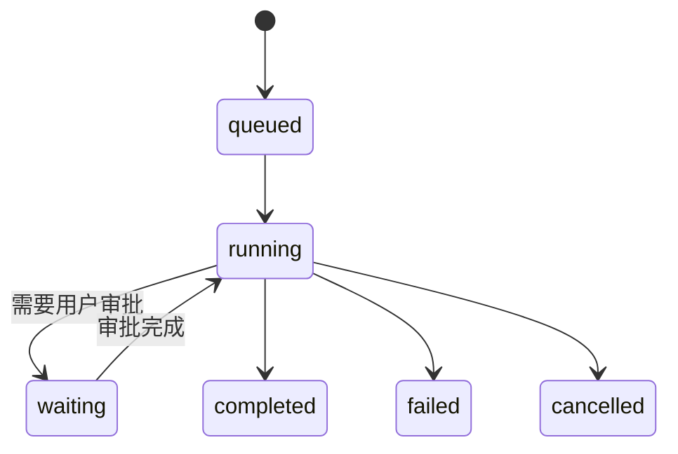
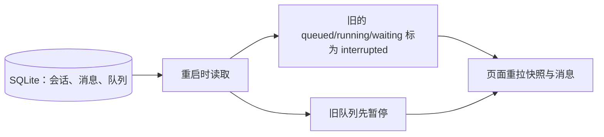
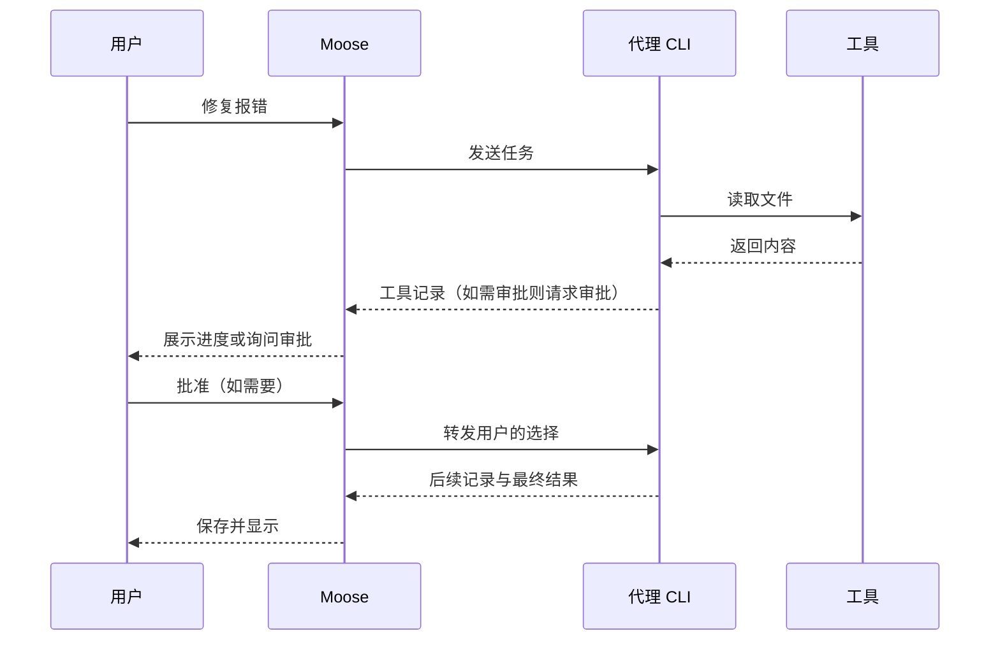

# 前端与 AI 应用面试参考答案

配合[题目](questions.md)使用，共 84 题，按“章节＋原题号”对应；题号不连续是沿用了原题号，不是答案遗漏。

每道题都按同一个顺序排列，可以只读需要的部分：

| 小节 | 作用 |
| --- | --- |
| **这题在考什么** | 交代背景：实际开发中什么时候会碰到这个问题，面试官想看什么 |
| **一句话回答** | 可以直接对面试官说出口的结论 |
| **展开说明** | 具体做法和理由；对比内容用表格 |
| **示例** | 带中文注释的代码，只用于讲解 |
| **Moose 里的做法** | 项目的实际实现（按 0.23.1 源码核对）；与项目无关的题省略 |
| **容易答错的地方** | 常见的过度结论和边界 |

只有“Moose 里的做法”是项目的真实实现，其余代码和方案都是通用讲解。完整项目链路见[项目面试指南](project-interview-guide.md)。

### 复习导航

- [一、TypeScript 与类型系统](#一typescript-与类型系统)
- [二、流式处理与实时通信](#二流式处理与实时通信)
- [三、前端状态管理与数据流](#三前端状态管理与数据流)
- [四、性能优化与渲染](#四性能优化与渲染)
- [五、前端 AI 架构设计](#五前端-ai-架构设计)
- [六、AI 特性与前端工程实践](#六ai-特性与前端工程实践)
- [七、AI 工程化与前端工具链](#七ai-工程化与前端工具链)
- [八、大模型前端集成](#八大模型前端集成)
- [场景题](#场景题)

## 一、TypeScript 与类型系统

### 1. 在定义 AI 接口返回的嵌套数据结构（如多轮对话、工具调用结果）时，如何用 TypeScript 的泛型与条件类型实现灵活的类型推导？

> **这题在考什么**：AI 应用里接口很多，比如“发送消息”和“查询用量”，它们都是请求，但参数和返回数据各不相同。面试官想看你能不能复用同一个请求外壳，同时让每次调用都拿到准确的类型提示，而不是到处写 `any`。

**一句话回答**：把不变的外层结构固定下来，用泛型表示变化的部分，再用“方法名到参数、返回值的映射表”让编译器根据方法名自动推出类型。

**展开说明**
- 先定义稳定的外壳。例如 `Result<T>` 表示“成功时返回 T，失败时返回错误”，所有接口共用同一套成功和失败处理。
- 再用映射表把方法名、参数和返回值绑在一起：`request<M extends Method>(method: M, params: Requests[M]): Promise<Responses[M]>`。传入方法名后，参数类型和返回类型就都确定了，写错参数会直接报错。
- 条件类型（按“某类型是否满足条件”来选择结果类型）适合做类型提取。比如 `T extends Promise<infer U> ? U : T`，其中 `infer U` 的意思是“把 Promise 里包着的类型取出来”。
- 类型只在写代码和编译时起作用。数据真正进来时，仍需要运行时校验。

**示例**：下面是一个简化版，方法名决定参数和返回值。

```ts
// 每个方法名对应的参数和返回值
type Params = { send: { text: string }; usage: { provider: string } };
type Outputs = { send: { queueId: string }; usage: { used: number } };

declare function request<M extends keyof Params>(
  method: M,          // M 被推断为 'send' 或 'usage'
  params: Params[M],  // 参数类型随方法名变化
): Promise<Outputs[M]>; // 返回类型也随方法名变化

request('send', { text: '修复报错' }); // 推出 Promise<{ queueId: string }>
```

**Moose 里的做法**：Moose 在 `shared/types.ts` 中定义 `Method`、`Requests`、`Responses`。`window.moose.request` 用方法名约束参数和返回类型；IPC 入口再用 Zod 校验实际传入的数据。

### 2. 当 AI 接口返回的字段可能因模型版本不同而动态变化时，如何设计类型守卫（type guard）与类型收缩策略？

> **这题在考什么**：TypeScript 只检查你写代码时声明的类型，管不了网络上实际收到的 JSON。模型升级后字段可能改名或换位置。面试官想看你是否知道要在运行时检查数据，再把它“收窄”成确定的类型。

**一句话回答**：接口返回值先当作 `unknown`，用类型守卫在运行时逐项检查，检查通过后再转换成页面统一使用的类型。

**展开说明**
- 类型守卫是一个返回 `value is X` 的函数。它在运行时做检查，检查通过后，TypeScript 才允许把这份数据当成 X 使用。
- 收窄的顺序是：先确认是不是对象，再根据 `type` 或版本字段判断是哪种格式，最后验证必需字段。
- 不同版本的差异放在适配器里消化。比如旧版给 `text`、新版给 `delta.content`，适配器分别识别，对页面都输出同一种“文本增量”。
- 缺少关键字段时，应当报告协议错误；多出不认识的字段可以忽略，这样模型新增字段时不会把页面弄坏。

**示例**：下面的守卫只有在真的找到字符串类型的 `text` 后，才允许读取它。

```ts
function hasText(value: unknown): value is { text: string } {
  return typeof value === 'object' && value !== null && // 先确认是对象
    'text' in value && typeof value.text === 'string';  // 再确认字段和类型
}
```

**Moose 里的做法**：Moose 的 `shared/validation.ts` 用 Zod 校验 IPC 参数。各代理适配器把 CLI 的原始事件转换为统一的 `AgentEvent`，页面不直接依赖某个 CLI 的字段。

**容易答错的地方**
- 不能直接用 `as` 把数据“断言正确”。`as` 只是让编译器闭嘴，运行时什么也没检查。

### 5. 设计一个类型系统，用于描述 AI Agent 执行过程中的状态流转（如思考→执行→观察→完成），并实现类型安全的状态切换。

> **这题在考什么**：Agent 一轮任务会经历排队、执行、等待用户批准、结束等状态。如果用几个互不相关的布尔值表示，很容易出现“已经完成却还在等待批准”这种矛盾组合。面试官想看你会不会用类型把不合法的状态和切换排除掉。

**一句话回答**：用判别联合描述每种状态各自带哪些数据，用函数签名限制哪些状态可以切换到哪些状态，运行时再核对当前状态和任务 ID。

**展开说明**
- 判别联合（用一个公共字段区分几种形态的类型）适合表示状态。例如 `{ status: 'running', runId }`、`{ status: 'waiting', requestId }` 和 `{ status: 'done' }`，每种状态只带自己需要的字段。
- 处理事件时检查转移是否合法。已经结束的任务，不能被迟到的“开始”事件改回运行中；审批也只能答复仍在等待的那个请求。
- 可以把切换函数的参数限制为特定状态。例如“批准”函数只接受等待态，编译器就不允许把完成态传进去。但调用方仍需先读取并检查当前状态。

**示例**：先看简化的状态图（省略了失败后恢复等分支）。


```mermaid
stateDiagram-v2
  [*] --> queued
  queued --> running
  running --> waiting: 需要用户审批
  waiting --> running: 审批完成
  running --> completed
  running --> failed
  running --> cancelled
```

下面的代码只演示“等待审批 → 运行中”这一条转移，其他事件省略。

```ts
type RunState =
  | { status: 'running'; runId: string }
  | { status: 'waiting'; runId: string; requestId: string }
  | { status: 'completed'; runId: string };

function approve(
  state: Extract<RunState, { status: 'waiting' }>, // 只接受等待态
  requestId: string,
): Extract<RunState, { status: 'running' }> {      // 只能返回运行态
  if (state.requestId !== requestId) throw new Error('审批已失效'); // 运行时再核对
  return { status: 'running', runId: state.runId };
}
```

**Moose 里的做法**：Moose 用 `Status` 字符串联合表示 idle、queued、running、waiting 等状态，Service 在运行时检查审批是否属于当前待处理的请求。它没有完整的类型级状态机。

**容易答错的地方**
- 类型只能防止漏写字段和遗漏分支。来自网络的请求在运行时仍要核对当前状态和 `runId`，不能用 `as` 绕过。
- 这个示例只改变状态，不包含“向代理发送批准”这个副作用。

### 7. 如何用 TypeScript 声明一个支持流式 Chunk 数据与错误处理的泛型接口，并兼容 SSE、WebSocket 等多种传输方式？

> **这题在考什么**：流式回答会一小段一小段地到达。SSE、WebSocket 只是运送这些数据的通道，页面真正关心的是“收到正文、出错了还是结束了”。面试官想看你能不能把业务事件和传输方式分开设计。

**一句话回答**：先定义一个与传输无关的泛型事件联合（正文片段、错误、结束），各种传输方式只负责解码，再交给同一个处理函数。

**展开说明**
- 业务事件只描述三件事：收到一段正文、出错、结束。泛型 `T` 表示正文片段的具体类型，文本、结构化数据都能复用。
- SSE 和 WebSocket 各自负责把收到的消息解码成上面的事件，后续逻辑完全相同，以后换传输方式也不用改页面。
- 传输错误（比如断网）和模型报错（比如额度不足）要分开表示，因为处理方式不同：前者可以重连，后者要提示用户。
- 还要提前约定取消和断线重连的规则。

**示例**：下面是统一的事件类型，`seq` 是序号，用来发现重复或缺失。

```ts
type StreamEvent<T> =
  | { type: 'chunk'; runId: string; seq: number; data: T } // 正文片段
  | { type: 'error'; runId: string; message: string }      // 业务错误
  | { type: 'done'; runId: string };                        // 正常结束
```

**Moose 里的做法**：Moose 的适配器把各 CLI 的 stdio 消息转成统一的 `AgentEvent`。Web 页面通过 HTTP 发请求、通过 SSE 收业务事件，并不直接读取 CLI 输出。

**容易答错的地方**
- 断开连接不等于取消服务端任务。要停止生成，需要单独发取消请求。

## 二、流式处理与实时通信

### 1. 请设计一个支持“断线重连+消息去重”的 SSE 客户端，并处理 AI 长文本生成中的网络抖动问题。

> **这题在考什么**：网络断开时，服务端可能还在继续生成。重连后如果把已经收到的文字再拼一遍，回答会重复；如果漏掉中间一段，回答会缺字。面试官想看你是否先定好“从哪里接着收”的规则。

**一句话回答**：给每次生成一个 `runId`、每条增量一个递增序号，客户端记住处理到的最后序号，重连后丢弃重复、发现缺号就补读，而且服务端必须保存可补发的事件。

**展开说明**
- 服务端为一次生成分配 `runId`，为可补发的增量事件分配递增序号。客户端记下最后处理的序号，作为重连游标（告诉服务端“我收到哪里了”的位置标记）。
- 断线后带着这个序号重连：序号小于等于已处理的就丢弃，序号跳号就说明中间丢了，需要补读。
- 举例：断线前已处理序号 1、2；重连后依次收到 2、3，就丢掉重复的 2，只接上 3。如果直接收到 4，说明 3 丢了，必须补读或重新拉取完整结果。
- 网络抖动时保留已经显示的文字，并提示正在重连。原生 `EventSource` 可以借助事件 `id` 和请求头 `Last-Event-ID` 续接。

**示例**：下面是序号检查的核心逻辑（设计示意，服务端还要支持补发）。

```ts
if (event.seq <= lastSeq) return;                       // 重复事件，丢弃
if (event.seq !== lastSeq + 1) return reloadSnapshot(); // 中间缺号，重拉完整结果
append(event.text);                                     // 正好是下一条，追加
lastSeq = event.seq;
```

**Moose 里的做法**：Moose Web 的 `EventSource` 断线后自动重连，重连成功会重新拉取快照；页面按消息 ID 和 `seq` 接受较新的版本。服务端没有按 SSE 事件 ID 补发每个增量。

**容易答错的地方**
- 服务端必须保存可补发的事件，否则客户端单靠序号也找不回遗漏的内容。
- 不要把重连当成重新提交生成任务。用户主动停止时，要另外发取消请求。

### 2. 如何在前端实现一个“流式 Markdown 解析器”，在 AI 逐字输出过程中实时渲染标题、列表、代码块，并避免标签截断？

> **这题在考什么**：Markdown 不是收到一个字就能确定格式的。比如刚收到两个反引号时，还不知道第三个会不会来，也就不知道这是不是代码块。面试官想看你怎样处理“语法还没写完”的中间状态，同时不让页面卡顿。

**一句话回答**：先累积原文，按帧或固定短间隔解析当前全文，未闭合的语法暂时按“未完成”显示，生成结束后再完整解析一次。

**展开说明**
- 不要每收到一个字就解析一次。把增量先攒进原文，再按帧或短时间间隔解析，能明显减少计算量。
- 允许语法暂时不完整。例如代码块还没收到结束标记时，先把后面的内容按代码显示，等结束标记到达后自然变成正常代码块。
- 生成结束后再解析一次全文，确保最终结果正确。
- 长文本解析成本高时，可以缓存已经稳定的前面几块，只重新解析尾部。但要处理“后面的语法影响前面”的情况，比如后来出现的结束标记改变了前文的含义。

**Moose 里的做法**：Moose 后台每 80 ms 批量保存并推送有变化的消息。前端用 `react-markdown` 渲染当前全文，没有增量 AST 解析器；但它保持渲染组件的类型稳定，文字增量到来时不会卸载已有的代码块，也不会重新读取本地图片。

### 3. 当 AI 流式返回的数据包含多个独立片段（如文本、代码、表格）时，如何设计 Chunk 合并算法以保证片段完整性？

> **这题在考什么**：一轮回答可能同时产生正文、工具记录和表格。网络包到达的顺序不一定是页面应该显示的顺序，不同内容的文字也不能拼进同一条消息。面试官想看你怎样给片段编身份、决定追加还是替换。

**一句话回答**：给每个片段一个唯一身份和片段内序号，同一片段按序合并、不同片段分开保存，显示顺序单独记录，不依赖网络到达顺序。

**展开说明**
- 先给片段身份：同一轮用 `runId`，每个文本、代码或表格片段用 `partId`，片段内再用序号。
- 相同片段按序号追加，不同片段分别保存，重复发来的序号直接丢弃。
- 发现缺号时，如果协议支持补发就请求补发；不支持就重新读取完整状态，不能无限等待。
- 显示顺序单独记录，不能拿网络到达顺序代替。
- 工具参数这类结构化内容没收全时先缓存，不能拿半截 JSON 去执行。

上游发来的数据形态不同，合并方式也不同：

| 上游发来的是 | 合并方式 |
| --- | --- |
| 增量（只有新增的一小段） | 按序号追加到同一片段 |
| 完整快照（整条内容的最新版本） | 用新版本替换旧内容，不再追加 |

**示例**：下面是 Moose 按整条消息版本合并的关键代码（简化自 `src/lib/transcript-messages.ts`）。

```ts
const old = result[index];
if (old && old.seq >= message.seq) continue; // 旧版本或重复版本，跳过
result[index] = message;                     // 用新版本替换整条记录
// 只有位置真的变化时才按 position 重新排序，而不是按事件到达顺序
```

**Moose 里的做法**：Moose 用 `runId:event.key` 生成消息 ID，同一条记录更新时递增 `seq`；页面按 ID 和 `seq` 合并，再按 `position` 排序。如果收到同一条消息的旧版本 `seq=6` 和新版本 `seq=8`，就保留 8。它传给页面的是整条消息的新版本，所以是**替换旧记录**，不是把两份正文拼起来。

### 5. 在 React 18+中，如何用 useTransition 与 useDeferredValue 优化 AI 流式输出的渲染性能，避免主线程阻塞？

> **这题在考什么**：浏览器主要在同一条线程上处理输入、运行 JavaScript 和更新画面。长回答频繁重新解析时，用户打字或点“停止”就会变卡。面试官想看你能否分清哪些更新必须马上显示、哪些可以晚一点。

**一句话回答**：输入框和停止按钮必须立刻响应，长回答的渲染可以稍后更新；`useDeferredValue` 和 `useTransition` 就是用来降低后者优先级的。

**展开说明**

| Hook | 作用 | 适合用在 |
| --- | --- | --- |
| `useDeferredValue` | 让昂贵组件暂时使用旧值，空闲时再追上新值 | 长回答的 Markdown 渲染组件 |
| `useTransition` | 把某次状态更新标记为不紧急 | 切换视图、过滤列表等非紧急更新 |

- 输入框本身的状态不要放进 `useTransition`，否则打字会有延迟。
- 这两个 Hook 只调整更新的先后顺序。如果一段解析代码同步运行 200 ms，它照样会卡住线程，需要另外减少解析次数、缓存结果或放进 Worker（浏览器的后台线程）。

**示例**：下面把长回答渲染和其他更新分开，回答组件读的是“可以延后”的文本。

```tsx
const deferredText = useDeferredValue(streamedText); // 紧急更新优先，这里可以稍后跟上
return <MarkdownView source={deferredText} />;
```

**Moose 里的做法**：Moose 目前靠批量推送、消息级 `memo` 和分页减轻渲染压力，没有使用这两个 Hook。

**容易答错的地方**
- 这两个 Hook 不会让一段同步运行 200 ms 的解析代码自动变快。

### 8. 当 AI 服务端返回的流式数据包含自定义事件（如[DONE]、[ERROR]）时，前端如何解析并触发相应回调？

> **这题在考什么**：“一次读到的数据”和“一条完整事件”不是一回事。网络可能把一条 SSE 事件拆成两次送来，也可能一次送来好几条。面试官想看你是否先把事件组装完整，再判断是不是结束或报错标记。

**一句话回答**：先按 SSE 规则把字节流拼成完整事件，再看事件数据是否恰好是 `[DONE]` 或约定的 `[ERROR]` 格式，然后触发对应回调。

**展开说明**
- 用流式 `TextDecoder` 解码。`{ stream: true }` 能保证一个汉字的字节被拆到两次读取时不会解成乱码。
- 保留还没读完的半行，遇到空行才算一条 SSE 事件结束。同一事件里的多行 `data:` 要合并起来。
- 只有完整数据恰好等于 `[DONE]` 才结束；`[ERROR]` 按事先约定的格式解析。
- 网络断开、解析失败和模型报错要分开处理，完成后清理监听。

**示例**：下面演示 SSE 组帧的关键一步，把最后不完整的半条留到下一次读取（解析示意）。

```ts
buffer += decoder.decode(chunk, { stream: true }); // 新数据接到缓冲区后面
const frames = buffer.split('\n\n');                // 空行分隔完整事件
buffer = frames.pop() ?? '';                         // 最后一段可能不完整，留着
for (const frame of frames) dispatchCompleteEvent(frame);
```

这里以 `\n` 为换行符示意，实际还要兼容 `\r\n`，并解析每条事件中的多行 `data:`。

**Moose 里的做法**：Moose Web 的 SSE 传的是 JSON 业务事件，不使用 `[DONE]` 文本标记。CLI 侧的 `rpc.ts` 先按换行拆出完整的 JSON，再分发响应、通知和审批请求。

**容易答错的地方**
- 不能在普通正文里搜到 `[DONE]` 字符串就触发结束回调。正文里完全可能出现这几个字符。

## 三、前端状态管理与数据流

### 1. 在大型 AI 应用中，如何用 Zustand 或 Redux Toolkit 管理多轮对话、生成任务、用户配置等复杂状态？

> **这题在考什么**：聊天页里各种状态变化频率差别很大：输入框每敲一个字就变，用户设置很少变，消息还会被后台持续更新。全塞进一个大对象，无关组件就会跟着反复渲染。面试官想看你会不会按归属拆分状态。

**一句话回答**：先按“数据归谁管、变化多快”拆状态，再用按 ID 存储和 selector 精确订阅，让一条消息变化只影响用到它的组件。

**展开说明**

| 状态 | 特点 | 放在哪里 |
| --- | --- | --- |
| 消息、生成任务 | 服务端数据，后台持续更新 | 全局 store，按 ID 存储 |
| 用户设置 | 低频变化，多处共享 | 全局共享状态 |
| 输入框、弹窗开关 | 只有当前组件关心 | 组件局部状态 |

- 用 Zustand 时，可以按 ID 存消息，组件用 selector（从 store 里挑出自己需要那部分的函数）只订阅需要的那一条。
- 更新一条消息时，保留其他消息的对象引用不变，这样订阅其他消息的组件不会重新渲染。

**示例**：下面按 ID 订阅单条消息；更新另一条消息时，这个选择结果保持不变。

```ts
const message = useChatStore((state) => state.messagesById[id]);
// 更新时只替换 messagesById[id]，其他消息对象保持原引用
```

**Moose 里的做法**：Moose 的 `useWorkspace` 管全局快照，`useTranscript` 管当前会话的消息与分页，输入框状态留在组件里。它没有使用 Zustand 或 Redux。

**容易答错的地方**
- 不要把每个输入字符和全部历史都塞进一个全局 store。
- 能从已有数据算出来的值，不要再存一份。

### 2. 设计一个“状态快照”系统，支持将 AI 对话的完整状态（包括流式中间结果）序列化保存与恢复。

> **这题在考什么**：快照是关掉再打开页面或应用后还能用的数据记录，不是把正在运行的整个 JavaScript 程序存下来。面试官想看你能否分清“能存下来的数据”和“只能重新建立的连接、进程”。

**一句话回答**：快照只保存能恢复的事实，运行中的连接和进程不保存；重启后把原来“进行中”的任务标为中断，再重新拉取数据。

**展开说明**
- 快照保存这些内容：数据版本、会话配置、消息及其版本、待发送队列、最后确认的游标和原生会话 ID。
- 写入时保证这些记录彼此一致，不能出现队列写了一半、消息没写的情况。
- 恢复时先校验数据并按版本迁移旧格式，再补读消息。
- 运行中的 Promise、网络连接和进程无法序列化。重启后要把相关任务标为中断，再核对实际结果。

**示例**：恢复时只恢复数据，并修正已经无法继续的运行状态（示意）。

```ts
const status = saved.status;
const restoredStatus = ['queued', 'running', 'waiting'].includes(status)
  ? 'interrupted' : status; // 原来进行中的任务，重启后一律标为中断
// 连接和 Promise 由新进程重新建立
```

**Moose 里的做法**：Moose 的 `Snapshot` 不包含全部消息，消息另存在 SQLite 里。重启时它会修正运行状态，并暂停旧队列。恢复顺序如下：


```mermaid
flowchart LR
  A[("SQLite：会话、消息、队列")] --> B[重启时读取]
  B --> C["旧的 queued/running/waiting 标为 interrupted"]
  B --> D[旧队列先暂停]
  C --> E[页面重拉快照与消息]
  D --> E
```

### 5. 用户发送 AI 请求后，怎样立即给出反馈，同时避免把尚未生成的内容当成结果？

> **这题在考什么**：用户点了发送，模型可能还要排队或等审批。页面要立刻告诉用户“请求收到了”，但不能假装回答已经生成。面试官想看你能否区分“真实的等待状态”和“虚构的结果”。

**一句话回答**：发送后马上显示“已提交／排队中”这种真实状态，等收到真实的增量才显示回答，失败时保留用户输入。

**展开说明**
- 发送后立刻显示“已提交”或“排队中”，这是真实发生的事，可以放心展示。
- 不要预先显示一段虚构的 AI 回答。后台确认后，把这条请求关联到正式任务 ID，收到真实增量才开始展示回答。
- 失败时保留用户输入的内容，让用户自己决定是否重试。
- 重试要防止重复执行；切换会话后，旧会话迟到的结果也不能覆盖当前会话。

**Moose 里的做法**：Moose 的 `send` 返回，表示用户输入已经持久化到队列，不表示模型已经完成回答。

## 四、性能优化与渲染

### 1. 对话历史达到万条时，怎样做搜索与过滤，并验证实际延迟？

> **这题在考什么**：历史消息多了以后，搜索不能先把一万条都搬进浏览器再过滤。面试官想看你能否把工作分到合适的层，并且用可信的方法测出延迟，而不是只报一个最快值。

**一句话回答**：存储层负责查匹配，页面只显示一页结果，点击后再读取目标消息附近的历史；性能按后台查询、端到端响应和页面渲染分层测，并报 P95。

**展开说明**
- 工作分三步：存储层查出匹配内容，页面展示一页结果，用户点击后再读取目标消息附近的历史。
- 防 SQL 注入和按字面匹配是两个不同问题。绑定参数让输入不会被当成 SQL 执行；转义 `%`、`_` 和反斜杠，才能让这些字符按字面匹配。只做参数绑定的话，用户输入 `%` 仍可能匹配到所有内容。
- 输入时做防抖（停止输入一小段时间后才发请求），并丢弃过期请求的结果，避免旧结果覆盖新结果。
- 性能分层测量：后台查询耗时、包含防抖和传输的响应时间、页面渲染耗时，以及搜索期间终端是否仍然响应。
- P95 表示样本中约 95% 的查询不超过这个耗时。不能只报最快的一次。

**Moose 里的做法**
- Moose 已实现消息内容搜索：项目名、会话标题、已保存消息的标题和正文都可以匹配，也包含归档会话。它用参数化的 `LIKE` 子串查询，没有引入全文索引。
- 搜索每页 50 条，用排序字段组成游标继续加载；输入防抖 200 ms，过期请求的结果会被丢弃。点击结果后，按消息的 `position` 读取上下文。
- 普通历史向前翻页仍是每页 80 条，这是另一套逻辑。
- 0.21.0 的本机基准使用一万条约 1 KiB 的消息，后端 P95 约 33 ms；0.21.1 的回归测试继续检查 300 ms 预算。这个数字不包含 200 ms 防抖，也不是大数据量下的普遍保证。
- 如果数据增长后查询扫描拖慢了后台，再评估全文索引和中文检索方案。源码和限制见[项目搜索链路](project-interview-reference.md#搜索命中后怎样找到很久以前的消息)。

**容易答错的地方**
- 不能拿历史分页的 SQL 当成搜索实现。
- 参数绑定不等于转义通配符。

### 2. 请设计一个“虚拟化渲染”方案，用于超长 AI 生成内容（如数万 Token 的文档）的平滑滚动与快速定位。

> **这题在考什么**：普通列表会为每条历史消息创建页面元素，消息越多，浏览器的布局和滚动负担越重。面试官想看你是否理解虚拟列表的原理，以及它和分页的区别。

**一句话回答**：只为可视区域及前后少量内容创建 DOM，其他位置用高度占位；同时按实际高度测量，保证滚动不跳、跳转能准确定位。

**展开说明**
- 虚拟列表只挂载可视区域和前后少量内容。比如一万条消息、屏幕只放得下约二十条，就只为这二十条及附近几条创建 DOM，其他位置留出高度占位，滚到别处再替换显示的那一批。
- 长消息要按实际高度测量，否则估算高度和真实高度不一致，滚动时会跳。
- 向上加载旧消息时，要保持用户当前看到的位置不动。跳转到某条消息时，先定位记录，再滚动过去。
- 生成中的消息高度会不断变化，代码块也可能展开，所以要支持重新测量；还要照顾键盘可访问性。

分页和虚拟列表解决的是不同问题，可以同时使用：

| 方案 | 解决什么 | 做法 |
| --- | --- | --- |
| 分页 | 一次从存储读太多数据 | 分批从存储中取数据 |
| 虚拟列表 | 页面上 DOM 节点太多 | 只渲染看得见的那部分 |

**Moose 里的做法**：Moose 每页加载 80 条历史消息，离屏消息使用 `content-visibility: auto` 减少布局成本。它没有按像素位置维护完整的虚拟列表。

### 5. 设计一个“按需加载”策略，仅渲染 AI 对话列表中可视区域及附近的消息，其余部分保留为纯文本。

> **这题在考什么**：一条很长的 AI 回答即使只算一条消息，Markdown 解析和代码高亮也可能很昂贵。面试官想看你是否知道“少加载几条消息”和“少渲染远处消息的内容”是两层不同的优化。

**一句话回答**：完整原文照常保存，显示层根据离视口的远近决定渲染成本：看得见的渲染完整 Markdown，远处的先用纯文本或占位，快滚到时再预渲染。

**展开说明**
- 数据层保存完整原文，不因显示方式而丢内容。
- 可见的消息渲染完整 Markdown；远处的消息先显示轻量占位或纯文本摘要；接近视口时提前渲染，避免用户看到闪烁。
- 切换展示方式时，不能改变消息身份，也不能让滚动位置跳动。
- 这比普通分页复杂，应先用性能数据证明确实有必要再做。

**Moose 里的做法**：Moose 当前做的是分页、消息级 `memo` 和离屏布局优化，没有实现题目所说的“只渲染可视区”方案。

### 9. 如何用 React.memo、useMemo、useCallback 避免 AI 消息列表因无关状态变更导致的全量重渲染？

> **这题在考什么**：流式输出时往往只有最后一条消息在变，前面几百条不该每次都重新渲染。面试官想看你是否知道 React 的缓存要生效，前提是旧消息的对象引用真的没变。

**一句话回答**：先用 Profiler 找出真正重复渲染的组件，再保证消息 key 和对象引用稳定，用 `React.memo` 隔开无关的行，昂贵计算用 `useMemo`，传下去的回调用 `useCallback` 稳定住。

**展开说明**
- 先用 React Profiler 查看哪些组件在重复渲染、每次耗时多少，再决定优化哪里。
- 消息列表用稳定的消息 ID 作 `key`。更新一条消息时保留其他消息的对象引用，`React.memo` 才能判断出“这一行没变”并跳过渲染。
- 昂贵的解析结果可以用 `useMemo` 缓存；传给子组件的回调按需要用 `useCallback` 保持稳定，否则每次都是新函数，`memo` 会失效。

**示例**：下面的消息行用 `memo` 包裹，`key` 和 `message` 引用稳定时才会跳过渲染。

```tsx
const MessageRow = memo(({ message }: { message: Message }) =>
  <article>{message.text}</article>);
messages.map((m) => <MessageRow key={m.id} message={m} />); // key 用稳定 ID
```

**Moose 里的做法**：Moose 的消息合并会保留未变化记录的对象引用，时间线使用消息级 `memo`。传给消息行的文件上下文、翻译函数和回调也保持稳定，避免一次快照更新让所有行的 `memo` 失效。

**容易答错的地方**
- `memo` 挡不住组件自身 props 或它所用 Context 的变化。
- 不该给每个小计算都套缓存，缓存本身也有比较和内存开销。

## 五、前端 AI 架构设计

### 2. 如何用 Monorepo 管理 AI 前端、Node.js 中间层、共享类型定义、工具脚本的统一代码库？

> **这题在考什么**：一个产品可能同时有桌面应用、网页、后台和共享类型。放在同一个仓库方便一起改，但要说清楚哪些是独立的包、哪些只是同一个包里的目录。面试官想看你理解 Monorepo 的边界。

**一句话回答**：Monorepo 是多个可独立管理的包共用一个仓库和锁文件；按应用和共享契约划分包，并防止浏览器端误引入 Node 依赖。

**展开说明**
- Monorepo 里每个包有自己的依赖和构建配置，但共用仓库和一份锁文件，改动可以在同一个提交里完成。
- 可以按 `apps/web`、`apps/server`、`packages/contracts` 划分。
- 共享契约包只放两端都需要的类型和校验。浏览器包不能误引入 Node 依赖，否则会打包失败或在浏览器里报错。
- CI 按包之间的依赖关系，只检查受影响的包，节省时间。

**Moose 里的做法**：Moose 仓库已有 pnpm workspace，包含应用根包、站点和商店包。应用内部的 `src`、`electron`、`shared` 仍是目录分层，不是三个独立的 package。

### 5. 如何用 DDD（领域驱动设计）划分 AI 前端的核心领域（对话、模型、工具、知识库）与界限上下文？

> **这题在考什么**：“领域”可以先理解为一组受同类业务规则管理的对象。比如会话消息怎么保存，和代理工具怎么执行，是两类不同的规则。面试官想看你能否按业务规则划出模块边界。

**一句话回答**：按业务规则而不是按页面或数据库表划分边界，比如对话、执行、协议接入各成一块，模块之间只通过明确的 ID 和接口协作。

**展开说明**
- 界限上下文（一组规则和术语只在其中有效的边界）应按业务规则划，而不是机械地按页面或数据库表分层。
- 对话域管会话与消息；执行域管队列、取消和审批；接入层处理不同代理的协议。
- 如果真的有知识库，再把文档和检索单独建一个域。
- 模块之间用明确的 ID 和接口协作，不直接读写对方的内部数据。

**Moose 里的做法**：Moose 的 Project、Session、Message、QueueItem 是业务概念，Provider 与 Store 分别隔离了协议和存储。但不少规则仍集中在 Service 里。

**容易答错的地方**
- 不能说 Moose 已经完整落地了 DDD。

### 6. 设计一个“事件驱动”架构，用 EventEmitter 或 MessageChannel 解耦 AI 各个模块（输入、处理、输出）。

> **这题在考什么**：点“发送”时，调用方需要知道请求有没有被接受；之后“产生了新消息”可能同时影响时间线、角标和存储。前者是请求，后者是事件，混在一起就很难追踪。面试官想看你能否分清两者，并处理好订阅时漏事件的问题。

**一句话回答**：需要结果的操作走请求，返回成功或失败；状态变化走事件，广播给多个订阅者；事件带实体 ID 和版本，订阅与读快照之间的空隙要靠版本合并或游标补读来消除。

**展开说明**

| 类型 | 例子 | 特点 |
| --- | --- | --- |
| 请求 | `send` | 一问一答，调用方要拿到操作结果 |
| 事件 | `messageChanged` | 一对多通知，发出方不关心谁在听 |

- 事件要带实体 ID 和版本，订阅者才能判断新旧、去重合并。
- 为了避免“快照已读完、订阅还没建立”这段时间漏掉事件，可以先建立订阅再读快照，按版本合并两者；也可以让服务端提供带游标的快照和补读机制。
- 每个请求要有 ID、超时和错误处理；组件卸载时要取消订阅，避免内存泄漏。

**示例**：下面是订阅事件、并在组件离开时注销监听的用法（接口示意）。

```ts
const unsubscribe = window.moose.subscribe((event) => {
  if (event.type === 'changed') void refresh(); // 收到变化通知后刷新
});
return unsubscribe; // 组件卸载时调用，注销监听
```

**Moose 里的做法**：Moose 的 `request` 返回操作结果，`subscribe` 接收 `message`、`changed` 等事件。前端收到 `changed` 后重拉快照，收到 `message` 后按 ID 和 `seq` 合并。

**容易答错的地方**
- 仅仅把“订阅”和“读快照”两次调用按顺序写出来，并不能保证中间没有空隙。

### 9. 前端能否直接调用多个 AI 服务商 API？密钥、权限和计费应放在哪里处理？

> **这题在考什么**：浏览器里的代码和请求用户都能看到，写进去的长期密钥就不再是秘密。接多个模型服务商时，要先想清楚凭据属于谁、谁有权调用、费用由谁承担。

**一句话回答**：一般不直连：长期密钥放在后端，由后端验证权限、限流、记账后再转发；只有服务商提供受限的短期凭证，或用户用自己的密钥时，才考虑浏览器直连。

**展开说明**
- 常见方案是后端持有长期凭据，先验证用户权限、做限流、记录用量，再转发模型响应。
- 浏览器直连只适合两种情况：服务商提供权限受限的短期凭证，或者用户自带密钥、费用由用户自己承担。
- 多服务商的输入格式和错误可以在公共层统一，各模型的能力差异留给各自的适配器处理。

**Moose 里的做法**：Moose 的 Renderer 不直连模型。它调用本机后台，由代理 CLI 使用自己的登录状态，这与 SaaS 由服务端代付计费的模式不同。

## 六、AI 特性与前端工程实践

### 1. 在前端实现一个 Agent 循环时，如何管理工具调用的异步执行、超时处理与结果合并？

> **这题在考什么**：比如用户让 Agent 修一个报错，模型先要读文件，看到内容后才决定怎么改。这种“模型提出下一步、工具返回结果、模型再判断”的往复，才叫 Agent 循环。面试官想看你知道循环应该在哪里执行，以及多个工具调用怎样编号、超时和合并结果。

**一句话回答**：循环由可信后台执行，前端只负责展示、审批和取消；每次工具调用单独编号，独立的读取可以并行，有依赖的按顺序，超时要真正通知工具停下。

**展开说明**
- 执行循环的应是可信后台。前端负责展示每一步、收集用户审批、发出取消指令，不能直接执行模型给出的 Shell 或数据库命令。
- 每轮任务和每次工具调用分别编号（示意为 `runId`、`callId`），结果才能对应回原来的调用。
- 互不依赖的读取可以并行，写入或依赖上一步结果的调用要按顺序执行。
- 每个调用单独记录结果。比如同时读两个文件，一个成功、一个超时，就分别返回“文件内容”和“超时”，不能只留下最后完成的那一项。
- 断线后，有副作用的调用可能结果未知，不能盲目重跑。

**示例**：先看 Moose 中各方的分工。图里的审批只在代理提出请求时才会发生。


```mermaid
sequenceDiagram
  participant U as 用户
  participant M as Moose
  participant A as 代理 CLI
  participant T as 工具
  U->>M: 修复报错
  M->>A: 发送任务
  A->>T: 读取文件
  T-->>A: 返回内容
  A-->>M: 工具记录（如需审批则请求审批）
  M-->>U: 展示进度或询问审批
  U->>M: 批准（如需要）
  M->>A: 转发用户的选择
  A-->>M: 后续记录与最终结果
  M-->>U: 保存并显示
```

如果自己实现工具执行，超时信号必须传到工具本身（示意）。

```ts
const controller = new AbortController();
const timer = setTimeout(() => controller.abort(), 10_000); // 10 秒后发出中止信号
try { return await tool.run(args, { signal: controller.signal }); } // 工具要监听 signal
finally { clearTimeout(timer); } // 无论成败都清掉定时器
```

如果工具不支持 `signal`，还需要调用它专门的停止接口。

**Moose 里的做法**：Moose 实际由代理 CLI 决定并执行工具。Service 保存工具记录，把审批关联到当前 `runId` 和待处理消息，停止时取消任务并关闭适配器。

**容易答错的地方**
- `Promise.race` 只是不再等待，并不会自动停止底层进程。超时必须通知工具真正停下。

### 3. 在 AI 产品中，前端可以通过哪些技术手段（如缓存、压缩、懒加载）帮助降低 Token 成本？

> **这题在考什么**：Token 是模型实际读取或生成的内容单位，不是网页下载的字节数。压缩图片、懒加载页面能让网页更快，却不会让发给模型的提示词变短。面试官想看你能否分清“网页性能优化”和“模型成本优化”。

**一句话回答**：Token 成本只取决于送进模型和模型生成的内容，所以要减少重复上下文、只送相关片段、压缩过长历史、限制不必要的输出，只有相同且允许复用的请求才缓存。

**展开说明**

| 手段 | 能否降低 Token | 原因 |
| --- | --- | --- |
| 压缩图片、懒加载页面 | 不能 | 只影响网页下载，不改变发给模型的内容 |
| 去掉重复上下文 | 能 | 同样的内容不再重复送进模型 |
| 只引用相关文件片段 | 能 | 不把整份文件塞给模型 |
| 压缩过长的历史 | 能 | 旧对话变短 |
| 限制无必要的输出 | 能 | 生成的内容也计入 Token |
| 缓存相同请求 | 能，有前提 | 只适用于完全相同、且允许复用结果的请求 |

**Moose 里的做法**：Moose 可以选择文件引用，并显示底座给出的上下文用量，但没有自行完成整套 token 裁剪和费用结算。

### 9. 在 AI 多轮对话中，如何设计上下文窗口的管理策略（如滑动窗口、关键信息提取、自动摘要）？

> **这题在考什么**：模型一次能看到的内容长度有上限，这个上限叫上下文窗口。对话变长后，不能简单把最旧的消息一刀切掉，否则早先定下的约束和工具结果可能丢失。面试官想看你怎样分配预算、取舍内容。

**一句话回答**：先给上下文分预算（必需指令、最近对话、相关材料、输出预留），快超限时先去重、只取相关片段，再摘要较早的历史，工具调用和结果要成对保留。

**展开说明**
- 先分预算：必须遵守的指令、最近的对话、相关文件与工具结果、为最终输出预留的空间。
- 举例：总预算 8 千 token，可以给必需指令 1 千、最近对话 3 千、相关文件 2 千、输出预留 2 千。文件再多时，就只取相关片段或压缩较早的对话。这些数字只用来说明分配方法，不是 Moose 的固定配额。
- 接近上限时，优先去掉重复材料或只取相关片段，再对较早的历史做摘要。
- 工具调用和它的结果要成对保留，只留其中一半会让模型看不懂。
- 摘要要写明已经做出的决定、约束和未完成事项，并保留原文供核对，因为摘要可能漏掉细节。

**Moose 里的做法**：Moose 主要恢复底座的原生会话，上下文压缩由底座处理。

**容易答错的地方**
- 不应说成 Moose 自己实现了自动摘要。

## 七、AI 工程化与前端工具链

### 1. 如何设计一个 AI 前端项目的标准化目录结构，兼顾业务功能、共享组件、工具函数与类型定义？

> **这题在考什么**：目录结构的作用，是让人改某个功能时能快速找到代码，并看出哪些模块可以互相依赖。AI 应用尤其要分清浏览器界面、系统能力、代理协议和持久化存储。

**一句话回答**：先按运行边界划分目录（页面、本机后台、跨进程共享），再在里面按功能细分，并规定依赖方向。

**展开说明**
- 先按运行边界划分，再按功能细分，让人能迅速找到 UI、业务规则、外部协议和存储各在哪里。
- 共享目录只放确实需要两边共同维护的契约，比如跨进程的类型和校验。
- 规定依赖方向：页面通过受限接口调用后台，而不是直接访问数据库。

**Moose 里的做法**：Moose 的 `src` 放 React 代码，`electron` 放本机业务，`shared` 放跨进程的类型和校验；`electron/providers` 处理代理协议，`electron/db` 处理存储。依赖方向应是页面经受限接口调用后台，而不是页面直接访问数据库。

**容易答错的地方**
- 避免把所有代码都塞进 `utils`，那样目录就失去了说明作用。

### 2. 请设计一套 AI 前端代码规范（ESLint、Prettier、Commitlint），并集成 Git Hooks 自动检查。

> **这题在考什么**：代码规范不是一个工具能搞定的：有的工具检查类型，有的找潜在错误，有的只统一空格和换行。面试官想看你知道它们各管什么，以及怎样让检查在本地和 CI 里都稳定执行。

**一句话回答**：类型检查、lint、格式化、提交信息检查各管一类问题；Git Hook 在本地提前反馈，CI 再跑同一组检查兜底。

**展开说明**

| 工具类别 | 管什么 | 常见工具 |
| --- | --- | --- |
| 类型检查 | 类型是否匹配 | TypeScript |
| Lint | 潜在错误和不良写法 | ESLint、oxlint |
| 格式化 | 空格、换行、引号等风格 | Prettier、oxfmt |
| 提交信息检查 | 提交说明是否符合约定 | Commitlint |

- Git Hook（在提交等 Git 操作前自动运行的脚本）能提前反馈问题。
- CI 要再执行同一组检查，因为本地可以跳过 Hook，只靠 Hook 会漏检。
- 生成的代码和构建产物要排除在检查之外；不同工具的规则冲突要先解决。

**示例**：本项目可以实际运行的检查命令如下，适合复用到 Hook 或 CI 中，是否启用由各自配置决定。

```sh
pnpm typecheck   # 类型检查
pnpm lint        # 代码检查
pnpm test        # 测试
```

**Moose 里的做法**：Moose 目前使用 TypeScript、oxlint、oxfmt、测试和构建脚本。

**容易答错的地方**
- 不能把题目列出的 ESLint、Prettier、Commitlint 都说成 Moose 已经安装。

### 4. 设计一个 AI 前端项目的 CI/CD 流水线，包括代码检查、单元测试、E2E 测试、构建优化、自动部署。

> **这题在考什么**：CI/CD 是从提交代码到产出可安装版本的一连串自动检查和构建。关键不是列一堆工具名，而是让有问题的代码在发布前被拦住，并且能说清最终产物对应哪个提交。

**一句话回答**：PR 阶段跑类型、lint、单测、构建和关键 E2E；发布阶段只使用通过验证的提交和制品，并记录版本、签名和回滚方式；真实模型测试单独受控执行。

**展开说明**
- PR 阶段先锁定依赖，再依次跑类型检查、lint、单元测试、构建和关键 E2E（模拟用户操作的端到端测试）。
- 发布阶段只使用已经通过验证的提交和制品（构建产出的安装包等文件），并记录版本、签名和回滚方式。
- 调用真实模型的测试要单独、受控地执行，避免每个 PR 都受登录状态、额度和网络波动影响。

**Moose 里的做法**：Moose 已有可执行的联合发布脚本。`release:prepare` 检查并打包桌面与 Web，记录当前提交；`release:publish` 核对版本、提交和校验值，上传草稿、部署 Web，再从公网安装验证，通过后才公开 Release。

**容易答错的地方**
- 这是显式运行的发布流程。不能仅凭脚本存在，就声称每次 push 都会自动上线。
- 两端发布不是跨 GitHub 与 Cloudflare 的原子事务，可能一端成功、另一端失败。

### 6. AI 应用怎样监控页面体验（LCP、INP、CLS）和模型响应（首字时间、生成耗时）？

> **这题在考什么**：用户觉得“慢”，可能是页面半天不出现、点击没反应，也可能是模型迟迟不出第一个字。这些发生在不同阶段，混成一个总耗时就找不到瓶颈。面试官想看你能否分阶段测量。

**一句话回答**：页面体验用 LCP、INP、CLS 衡量，模型响应单独记录首字时间和总耗时，并区分工具执行、审批等待和模型生成，按分位数和失败率分析。

**展开说明**

| 指标 | 衡量什么 |
| --- | --- |
| LCP | 页面主要内容何时显示出来 |
| INP | 用户交互后多久有响应 |
| CLS | 页面布局是否跳动 |
| 首字时间 | 从发送到第一个有效输出的时间 |
| 总耗时 | 从发送到生成完成的时间 |

- AI 侧要记录发送、首个有效输出和完成三个时间点，再把工具执行、审批等待和模型生成分开统计，否则等审批的时间会被误算成模型慢。
- 按设备、模型、版本分组看分位数和失败率，不能只报平均值，平均值会掩盖少数很慢的情况。

**示例**：下面分别记录首字时间和总耗时（计时示意）。

```ts
const sentAt = performance.now(); // 发送时刻
onFirstChunk(() => record('firstChunkMs', performance.now() - sentAt)); // 首字时间
onDone(() => record('totalMs', performance.now() - sentAt));            // 总耗时
```

**Moose 里的做法**：Moose 做过特定场景下的启动、包体与内存测量，但还没有完整的线上 Core Web Vitals 和模型耗时监控面板。

### 8. 设计一个 AI 前端日志系统，结构化记录用户操作、AI 请求、响应时间、错误信息，便于回溯分析。

> **这题在考什么**：用户反馈“任务卡住了”时，只看一条错误信息通常不够。面试官想看你能否设计出能把一次请求从入队到失败串起来的日志，同时注意隐私。

**一句话回答**：用 `requestId`、`runId` 把一次执行的各个环节串起来，每条日志记录时间、事件、耗时和错误码；普通日志只留摘要，敏感内容不上传。

**展开说明**
- 结构化日志就是每条日志都用固定字段记录，而不是一句自由文本，方便按字段搜索和统计。
- 用 `requestId`、`runId` 把“入队、开始、工具调用、审批、完成”串成一条时间线。
- 每条日志记录时间、事件名、耗时和错误码。
- 普通日志只保留必要摘要；调试日志按需开启，并限制大小。不要把用户输入、密钥或完整回答直接上传。

**示例**：下面这条日志只保留排查所需的字段（示意）。

```ts
log({ event: 'run.failed', runId, requestId, // 用 ID 关联同一次执行
  durationMs, errorCode, version });         // 耗时、错误码、版本
```

**Moose 里的做法**：Moose 把用户消息、工具、审批和错误按 `runId` 保存到 SQLite，并在时间线上按顺序展示。这能追查一次任务，但没有覆盖所有用户点击的遥测平台。

### 9. 如何用 Webpack 或 Vite 优化 AI 前端构建性能，实现代码分割、Tree Shaking、预加载、持久缓存？

> **这题在考什么**：构建慢影响开发和发布，页面加载慢影响用户，这两件事要分别衡量。拆包、预加载和缓存也都有代价，比如提前加载太多内容，首屏反而更慢。面试官想看你是否先测量、再有针对性地优化。

**一句话回答**：先测构建时间和首屏加载量，再用动态 `import` 延后不急需的模块、保证代码能被 Tree Shaking，只预加载马上要用的内容，三类缓存分别处理。

**展开说明**
- 先测量：构建时间是多少，首屏实际加载了多少代码。
- 代码分割：用动态 `import` 把不急需的面板拆出去，用户打开时才加载。
- Tree Shaking（构建时删掉没被用到的代码）要求模块能被静态分析，比如使用 ES Module 的 `import`/`export`。
- 预加载只给马上要用的内容，加载过多会抢占首屏带宽。
- 开发时的依赖缓存、浏览器的资源缓存、生产构建的缓存是三回事，要分别处理。

**示例**：下面让非首屏面板在用户打开时才加载（React 示意）。

```tsx
const ReviewPanel = lazy(() => import('./review-panel')); // 单独打包，按需加载
// 打开面板时在 Suspense 内渲染 ReviewPanel
```

**Moose 里的做法**：Moose 使用 Vite，也做过面板按需加载和安装包裁剪。

**容易答错的地方**
- 包体变小不能自动证明启动更快，要用相同条件下打包出的应用实际测量。

### 10. 请设计一个 AI 前端依赖管理策略，定期更新模型 SDK、工具库，并评估兼容性与性能影响。

> **这题在考什么**：升级模型 SDK 可能改变流事件、工具调用参数或错误格式。项目照样能编译，真实运行时却可能出错。面试官想看你是否知道依赖升级要验证行为，而不只是改版本号。

**一句话回答**：锁定版本、小批量更新，先读变更说明，再跑类型、协议测试、关键 E2E 和打包验证，模型 SDK 重点查流事件、工具参数、取消和错误格式。

**展开说明**
- 锁定版本并提交锁文件，保证每个人、每次构建装的依赖都一样。
- 小批量更新，出问题时容易定位是哪个依赖导致的。
- 升级前先看变更说明，升级后跑类型检查、协议测试、关键 E2E 与打包验证。
- 模型 SDK 尤其要检查流事件、工具参数、取消和错误格式有没有变化。
- 原生依赖（包含编译好的二进制模块）还要核对运行时 ABI（二进制接口版本），否则可能在 Electron 或 Node 里加载失败。

**Moose 里的做法**：Moose 锁定 pnpm 依赖版本。Codex 协议类型可以用 `pnpm protocol:generate` 重新生成，之后还要跑类型检查、测试和真实 CLI 流程。

**容易答错的地方**
- 不能只看协议类型生成成功就认为升级没问题。

## 八、大模型前端集成

### 1. 如何用 OpenAI Function Calling 或 Tools 在前端实现 AI 工具调用（如计算器、搜索、数据库查询）？

> **这题在考什么**：模型说“调用计算器”，只是给出了调用意图，计算器并不会因为模型输出了几个字就自动执行。面试官想看你清楚应用要负责验证请求、执行允许的工具、再把结果交还模型，以及这些事该在哪里做。

**一句话回答**：收全模型给出的工具名和参数，校验名称、参数和用户权限，由可信后台执行，再按原来的调用 ID 把结果或错误交还模型。

**展开说明**
- 先收全模型给出的工具名和参数。流式返回时参数可能分几段到达，没收全不能执行。
- 校验三件事：工具名在白名单里、参数符合格式、当前用户有权限。
- 由可信后台执行工具，再按原来的 `call_id` 把成功结果或错误交还模型。
- 一次回答里有多个调用时要分别匹配，并设置循环轮次上限，防止模型无限调用。
- 举例：模型给出 `{ callId: 'c1', name: 'calculator', args: { expression: '2+3' } }`。后台确认允许使用计算器后得到 `5`，再把 `{ callId: 'c1', result: 5 }` 交还模型。相同的 `callId` 保证结果不会配到另一次调用上。

**示例**：下面是后台执行前的关键检查，白名单加参数校验（伪代码）。

```ts
const tool = allowedTools[call.name];        // 只查白名单里的工具
if (!tool) throw new Error('不允许的工具');
const args = tool.schema.parse(call.args);   // 参数不合法会直接抛错
return { callId: call.callId, result: await tool.run(args) }; // 带回原 callId
```

**Moose 里的做法**：Moose 不在 Renderer 里直接调用模型的 Tools API。代理 CLI 执行工具并发出事件；适配器把事件转为工具记录，Service 负责保存和推送；审批则由 Service 校验后，按原请求交还 CLI。

**容易答错的地方**
- 浏览器不应保存数据库凭据，也不应执行任意命令。

### 5. 如何用 WebSocket 实现双向流式通信，支持 AI 模型主动推送进度更新、中断信号、工具调用请求？

> **这题在考什么**：WebSocket 允许浏览器和后台在同一个连接上互相发消息，适合同时传生成内容和取消、审批这类指令。但面试官想看你是否知道：连接断开后，之前漏掉的消息不会自己回来。

**一句话回答**：先约定带类型、`runId`、请求 ID 和序号的消息格式，服务端推增量和请求，客户端发审批和取消；断线后靠服务端保存的事件和游标补读。

**展开说明**
- 消息格式包含：类型、`runId`、请求 ID、序号和内容。
- 服务端推送生成增量、工具调用请求和完成通知；客户端发送审批、取消等指令。
- 连接中断后，要靠服务端保留的事件和客户端的游标补读漏掉的部分。
- 连接要做鉴权，限制缓冲区大小，并处理消费太慢的客户端，避免服务端内存被撑满。
- 取消请求发出后，要等服务端确认才算真正取消。

**示例**：下面在收到事件时先核对是不是当前任务、序号是否连续（客户端示意）。

```ts
socket.onmessage = ({ data }) => {
  const event = JSON.parse(data);
  if (event.runId !== activeRunId || event.seq <= lastSeq) return; // 别的任务或重复事件
  if (event.seq !== lastSeq + 1) return reloadSnapshot();          // 缺号，重拉完整状态
  lastSeq = event.seq; apply(event);                               // 正常应用
};
```

**Moose 里的做法**：Moose Web 用 HTTP 发命令、用 SSE 接收后台事件；桌面端经 preload/IPC 转发到同一个后台。它没有用于模型事件的 WebSocket 服务。

**容易答错的地方**
- 重新打开 WebSocket 本身不会恢复漏掉的内容。

### 6. 如何用 Server-Sent Events 实现模型输出的“进度条”与“部分结果预览”？

> **这题在考什么**：SSE 能让后台持续往页面推送内容，用户可以边等边看回答。但“正在输出”是能观察到的状态，“已经完成 63%”却需要知道总量。面试官想看你能否分清这两件事，不去伪造进度。

**一句话回答**：用 SSE 逐条推送增量、状态、完成和错误事件，前端边收边显示，收到明确的完成事件才算结束；不知道总量时只显示“正在生成”，不显示百分比。

**展开说明**
- SSE 可以逐条发送 `delta`（增量）、状态、`done` 和 `error` 事件。
- 前端边收边展示正文，实现“部分结果预览”；收到明确的 `done` 才认定完成，断线只是连接问题，不代表结束。
- 如果不知道总 token 数或总步骤数，就显示“正在生成”，不要伪造百分比。
- 长文本要批量刷新页面，避免每个增量都触发一次渲染。
- SSE 是单向的。用户点停止时，要另外调用取消接口。

**示例**：下面的页面只接收增量和完成事件，取消需要走另一条请求（SSE 示意）。

```ts
const stream = new EventSource('/events');
stream.addEventListener('delta', (e) => append(JSON.parse(e.data).text)); // 追加正文
stream.addEventListener('done', () => stream.close());                    // 明确完成才关闭
```

**Moose 里的做法**：Moose 的 `/api/events` 用 SSE 推送消息和状态。页面按消息版本显示部分回答，是否完成由任务状态判断，不把上下文用量当作生成百分比。


## 场景题

### 1. 如何判断用户设备

> **这题在考什么**：做响应式页面、触屏适配或提供下载按钮时，都会想“先判断用户是什么设备”。面试官想看你是否明白：目的不同，该看的信息也不同，而不是一律去解析 UA。

**一句话回答**：先问清楚为什么要判断设备，排版看视口，交互看指针能力，功能看特性检测，只有分发安装包才需要系统和架构信息。

**展开说明**
- 先拆目的。“判断设备”不是一个单独的问题，为了排版、为了识别触屏、为了提供安装包，需要的信息都不一样。
- 布局看视口宽度和媒体查询。因为排版真正受影响的是可用空间，而不是设备类型。
- 触控交互看 `pointer` / `hover` 媒体特性（分别表示主要输入是粗略还是精确指针、能否悬停）。因为有触屏的笔记本、接了鼠标的平板都很常见。
- 功能支持做特性检测，也就是直接检查某个 API 是否存在，而不是根据设备名推测。
- 只有分发不同安装包时，才需要操作系统和 CPU 架构信息。

| 目的 | 该看什么 |
| --- | --- |
| 排版 | 视口宽度、媒体查询 |
| 触控交互 | `pointer`、`hover` 媒体特性 |
| 功能是否可用 | 特性检测 |
| 分发安装包 | 操作系统和架构 |

**容易答错的地方**
- UA（User-Agent 字符串）只能作辅助，它可以被伪装。
- 屏幕宽不能证明是桌面：手机屏幕宽度也可能很大，桌面浏览器窗口也可能拉得很窄。

### 2. 将多次提交压缩成一次提交

> **这题在考什么**：你连续提交了三次小修正，合并请求里希望只留一条清楚的记录，这就是“压缩提交”（squash）。面试官想看你会不会操作，更想看你知不知道它会改写历史、什么时候不能随便做。

**一句话回答**：未共享的分支用 `git rebase -i` 把后续提交标成 `squash` 或 `fixup`，或者 `reset --soft` 后重新提交；已推送的分支要先和别人协调，必要时用 `--force-with-lease` 更新远端。

**展开说明**
- 先确认基准提交，并保存好未提交的改动，避免操作中丢失。
- 用 `git rebase -i HEAD~N` 打开最近 N 个提交的列表，把除第一个外的提交改成 `squash`（合并并保留提交说明）或 `fixup`（合并并丢弃说明）。
- 也可以用 `git reset --soft` 回到基准提交。这样改动仍留在暂存区，再提交一次即可得到单个提交。
- 压缩会生成新的提交 ID，等于改写历史。所以先看这些提交是否已经被别人使用。
- 如果只是希望合并到主干时变成一条提交，也可以直接用平台的 squash merge，不必改写自己的分支。

**Moose 里的做法**：Moose 提供 Git 改动预览、暂存和提交入口，提交前会重新检查 HEAD 与暂存区；没有在界面上压缩已有提交的操作。

**容易答错的地方**
- 已经推送且有人基于它开发时，不要直接强推，要先协调。
- 必须更新远端时用 `--force-with-lease`（远端没被别人更新时才覆盖），而不是 `--force`。

### 4. 滚动跟随导航（电梯导航）该如何实现

> **这题在考什么**：长文档侧边的目录会随着正文滚动高亮当前章节，点目录又能跳到对应章节，这就是电梯导航。面试官想看你能否把“点击定位”和“滚动高亮”两个方向都处理好，并照顾到边界情况。

**一句话回答**：章节设稳定 ID，点击目录用 `scrollIntoView` 定位，滚动时用 IntersectionObserver 判断当前章节并更新高亮。

**展开说明**
- 给每个章节设稳定的 ID，目录项和章节靠它一一对应。
- 点击目录时调用 `scrollIntoView` 滚到对应章节。再给章节加 `scroll-margin-top`（滚动定位时在顶部预留的距离），避免标题被固定头部挡住。
- 用户手动滚动时，用 IntersectionObserver（浏览器提供的“元素是否进入可视区域”的观察器）观察各个章节，进入观察范围就更新目录高亮。它比监听 `scroll` 后逐个计算位置更省性能。
- 点击触发平滑滚动的过程中，会依次经过多个章节。这段时间要暂停根据滚动更新高亮，否则高亮会来回跳。
- 还要照顾键盘操作、用户的“减少动画”系统设置，以及滚到页面底部时最后几节不够高、无法进入观察范围的情况。

**示例**：下面的代码在章节进入观察范围时更新目录高亮。`rootMargin` 把判定区域收窄到视口偏上的一条带上。

```ts
const observer = new IntersectionObserver((entries) => {
  // 取第一个进入判定区域的章节
  const current = entries.find((e) => e.isIntersecting);
  if (current) setActiveId(current.target.id);
}, { rootMargin: '-20% 0px -60% 0px' }); // 上方缩进 20%、下方缩进 60%
sections.forEach((section) => observer.observe(section));
```

**容易答错的地方**
- 示例只取第一个命中的章节。实际要规定多个章节同时可见时选哪一个。
- 组件卸载时要调用 `disconnect()` 停止观察。

### 6. 如何统计页面的 long task（长任务）

> **这题在考什么**：用户点了按钮却隔一会儿才有反应，常见原因是主线程一直在执行某段 JavaScript。面试官想看你知道怎么把这种“卡顿”量化出来，以及这种数据能说明什么、不能说明什么。

**一句话回答**：用 `PerformanceObserver` 订阅 `longtask` 类型，记录主线程被连续占用约 50ms 以上的次数、开始时间和持续时间。

**展开说明**
- 长任务指主线程被一段任务连续占用约 50ms 以上。超过这个时长，用户的点击和输入就会明显延迟响应。
- 用 `PerformanceObserver`（订阅浏览器性能记录的接口）订阅 `longtask`，在回调里拿到每条长任务的开始时间和持续时间。
- 订阅前先检查浏览器是否支持这个类型，不再需要时断开观察。
- 长任务数据只告诉你“什么时候卡了多久”，通常不能直接指出是哪个业务函数。要定位到代码，还需要浏览器 Performance 面板录制，再对照源码分析。

**示例**：下面这段代码在浏览器支持时订阅长任务，并把开始时间和持续时间交给记录函数。

```ts
const observer = new PerformanceObserver((list) => {
  // 每条 entry 就是一次长任务
  for (const entry of list.getEntries()) record(entry.startTime, entry.duration);
});
observer.observe({ entryTypes: ['longtask'] });
```

**Moose 里的做法**：Moose 目前没有自动采集 long task。遇到长回答卡顿时，需要用浏览器性能工具定位。

**容易答错的地方**
- 长任务记录的是主线程连续占用的时间段，不等于知道了是哪一行代码导致的。

### 7. PerformanceObserver 如何测量页面性能

> **这题在考什么**：浏览器会自动记录页面导航、资源加载、首次绘制等性能事件。面试官想看你知道怎样按需订阅这些记录，以及采集和上报时有哪些坑。

**一句话回答**：按要排查的问题订阅 `navigation`、`resource`、`paint` 等类型，用 `buffered` 补读订阅前已产生的记录，业务阶段用 `performance.mark/measure` 单独计时。

**展开说明**
- `PerformanceObserver` 像一个订阅器：告诉浏览器你想看哪类性能记录，之后它在回调里把记录交给你。
- 按问题选类型。`navigation` 是页面导航耗时，`resource` 是各个资源的加载耗时，`paint` 是首次绘制等时间点。
- 浏览器支持时加上 `buffered: true`，可以补读订阅之前已经产生的记录。因为脚本执行时，很多加载事件往往已经发生了。
- 自己的业务阶段（比如“打开弹窗到数据显示”）用 `performance.mark` 打点、`performance.measure` 计算两点间耗时。
- 回调里只做轻量收集，之后再聚合并采样上报，避免性能监控本身拖慢页面。

**Moose 里的做法**：Moose 的性能脚本用 `performance.now()` 测量特定流程；产品内没有用 `PerformanceObserver` 持续采集页面性能条目。

**容易答错的地方**
- LCP（最大内容绘制）、CLS（累计布局偏移）这类指标会多次更新，不能随便拿某一条 entry 当最终值。
- 不同进程各自的 `performance.now()` 起点不同，不能直接相减。

### 8. 移动端如何实现下拉滚动加载（顶部加载）

> **这题在考什么**：聊天列表向上翻旧消息时，旧消息会插到现有内容上方。如果只是把数据插进列表，用户正在看的那行会被推下去，画面突然一跳。面试官想看你怎么避免重复请求，以及怎么保持阅读位置不动。

**一句话回答**：接近顶部时按游标取更早的一页，用 `loading` 和 `hasMore` 防止重复请求；插入前记下锚点位置，插入后补偿滚动距离，让原来看的内容留在原处。

**展开说明**
- 滚动接近顶部才触发加载，并按游标（上一页最早一条消息的标识）请求更早的一页。游标比页码稳定，中间有新消息也不会错位。
- 用 `loading` 标记防止加载期间重复请求，用 `hasMore` 标记没有更早数据时停止请求。
- 插入旧消息前，记下第一个可见消息及其相对容器的偏移。插入后调整 `scrollTop`，让这条消息仍在原位置，画面就不会跳。
- 简单做法是比较插入前后的容器总高度 `scrollHeight`，把差值加到 `scrollTop` 上。

**示例**：下面的代码在插入旧消息前后，用容器高度差补偿滚动位置。

```ts
const before = list.scrollHeight;        // 插入前的总高度
await loadOlderMessages();
requestAnimationFrame(() => {
  // 新增内容有多高，就往下滚多少
  list.scrollTop += list.scrollHeight - before;
});
```

**Moose 里的做法**：Moose 已有顶部历史分页，但目前通过“加载更早”按钮触发，并不是自动下拉加载。

**容易答错的地方**
- 示例假设 `loadOlderMessages()` 完成时新增 DOM 已经提交。在 React 中仅等待 fetch 完成并不保证这一点，应在提交后的布局阶段按锚点补偿。
- 图片之后才加载完成、改变了高度时，还需要再次校正。

### 9. 判断页签是否为活跃状态

> **这题在考什么**：页面切到后台时，常需要暂停动画或轮询；用户回来时再刷新数据。面试官想看你能否区分“页面可见”和“页面有焦点”，并知道该在这两种状态下做什么、不该做什么。

**一句话回答**：用 `document.visibilityState` 和 `visibilitychange` 判断页签是否可见，用 `document.hasFocus()` 判断是否能接收键盘输入，两者不是一回事。

**展开说明**
- “可见”表示页面仍能被用户看到，“有焦点”表示键盘输入会交给它。切换浏览器页签和把窗口移到后台，不一定是同一种状态。
- `document.visibilityState` 的值是 `visible` 或 `hidden`，状态变化时触发 `visibilitychange` 事件。
- `document.hasFocus()` 判断当前文档是否有焦点。两个窗口并排时，页面可能可见但没有焦点。
- 页面隐藏时可以暂停动画和非必要的轮询，恢复可见时补读期间错过的数据。

**Moose 里的做法**：Moose 会把可见性、焦点和当前会话报告给共享后台，用来抑制正在查看的会话的通知。任务运行由后台管理，不会随页签隐藏而停止。浏览器对后台页签的节流也可能延迟心跳，因此后台对焦点登记设置了有效期。

**容易答错的地方**
- 不能因为页签隐藏就停止后台任务。
- 可见不等于有焦点。

### 10. 在网络带宽一定的情况下，切片上传感觉和整体上传消费的时间应该是差不多的这种说法正确吗？

> **这题在考什么**：很多人以为分片上传能“提速”。面试官想看你是否明白：分片不改变总字节数和带宽，它真正解决的是失败重传和续传问题。

**一句话回答**：理想情况下基本正确，纯传输时间的下限都接近“数据量 ÷ 带宽”；但真实耗时还包括请求、校验和合并开销，所以不能断言一定同速或一定更快。

**展开说明**
- 把 10 MB 文件切成十块，总字节数还是 10 MB。带宽不变时，纯传输时间下限都接近“数据量 ÷ 带宽”，分片不会凭空增加带宽。
- 真实耗时多出来的部分，来自每个分片的请求开销、校验和服务端合并。
- 分片的主要价值是：失败后只需重传一块，能暂停后续传，还能控制并发数量（有界并发）。
- 分片过小会让请求开销占比变大；并发过多也可能造成网络拥塞，反而变慢。

**Moose 里的做法**：Moose 的附件先按单文件 20 MB 的限额导入本地受控目录；Web 上传按文件逐个提交，没有用分片上传来提升传输速度。

**容易答错的地方**
- 不能断言分片上传一定与整文件同速，也不能说它一定快几倍。

### 11. 大文件切片上传的时候，确定切片数量的时候，有那些考量因素

> **这题在考什么**：1 GB 文件如果每片 1 MB，会产生约一千次请求；每片 100 MB，请求少了，但失败一次就要重传很大一块。面试官想看你知道片数其实由片大小决定，以及如何权衡。

**一句话回答**：先选每片大小，再用 `ceil(文件大小 / 分片大小)` 算出片数；片大小要在请求开销、内存占用、失败重传代价和服务端限制之间权衡。

**展开说明**
- 片数是算出来的，真正要选的是每片大小。`ceil` 表示向上取整，最后一片可以不满。
- 片小的好处是失败重传便宜，代价是请求次数多。片大则请求少，但占用内存多，失败一次代价高。
- 必须遵守服务端对分片数量、单片大小和上传会话时限的限制。
- 并发数是另一个独立参数，应根据真实网络和失败率压测确定。
- 不要一次把全部分片读进内存，应按需读取。还要把文件哈希计算、最终合并和移动端内存上限都算进去。

| 片大小 | 好处 | 代价 |
| --- | --- | --- |
| 小 | 失败只重传一小块 | 请求多，开销占比高 |
| 大 | 请求少 | 占内存多，失败重传代价高 |

**Moose 里的做法**：Moose 当前没有网络分片参数。附件单文件上限 20 MB，由后台一次导入并保存。

### 12. 页面关闭时执行方法，该如何做

> **这题在考什么**：用户写了一半直接关掉页面，你想在关闭前把草稿存下来。面试官想看你知不知道关闭事件并不可靠，以及正确的保存策略是什么。

**一句话回答**：重要内容在编辑过程中就逐步保存，页面变为 `hidden` 时尽力补存一次，`pagehide` 作补充，`beforeunload` 只在确有未保存内容时用来提示。

**展开说明**
- 关闭页面不是可靠的“最后一次保存机会”。浏览器可能直接结束进程，异步请求也可能来不及发完。所以重要状态要平时就保存。
- 页面的 `visibilityState` 变成 `hidden` 时尽力补存。这是移动端最可靠的时机，因为用户切走后进程随时可能被系统杀掉。
- `pagehide` 事件作为补充，它在页面被卸载或放入往返缓存时触发。
- `beforeunload` 只在确实有未保存内容时使用，用来弹出“确定离开吗”的提示，不适合用来做保存。

**示例**：下面是关页前尽力补存的事件入口写法（示意）。

```ts
document.addEventListener('visibilitychange', () => {
  // 页面被隐藏（切走、锁屏、关闭前）时补存
  if (document.visibilityState === 'hidden') saveDraft();
});
window.addEventListener('pagehide', saveDraft); // 补充入口
```

**Moose 里的做法**：Moose 关闭窗口后，共享后台可以继续工作；崩溃恢复依靠持久化记录，不依靠窗口关闭回调。

**容易答错的地方**
- 关页时发出的异步请求未必能完成。
- 移动端进程被杀时，甚至不会触发任何关闭事件。

### 14. 长文本溢出，展开/收起如何实现

> **这题在考什么**：评论、简介等长文本常默认只显示几行，点“展开”看全文。面试官想看你怎么判断“是否真的溢出”，以及怎么保证收起时不丢原文、交互可访问。

**一句话回答**：收起时用 `line-clamp` 限制行数，展开时显示原文；用 `scrollHeight > clientHeight` 判断是否真的溢出，没溢出就不显示按钮。

**展开说明**
- 只有两个状态：显示前几行，或显示完整原文。收起只是视觉上截断，DOM 里始终保留全文。
- 收起状态用 CSS `line-clamp`（按行数截断并显示省略号）限制行数。
- 用 `scrollHeight > clientHeight` 判断内容是否超出了可见高度。短内容不溢出，就不显示展开按钮。
- 容器宽度、字体或内容变化后，是否溢出可能改变，需要重新判断。
- 按钮加上 `aria-expanded` 属性，让读屏软件知道当前是展开还是收起。展开时尽量保持用户的阅读位置。

**Moose 里的做法**：Moose 的工具记录和思考记录可以折叠，普通回答不是统一截成三行。

**容易答错的地方**
- 复制时应得到完整原文，而不是截断后的内容。

### 15. 如何实现鼠标拖拽

> **这题在考什么**：拖动弹窗、拖动分隔条调整侧栏宽度，都是页面内拖拽；把本地文件拖进页面，则是浏览器的文件拖放。面试官想看你能否分清这两类需求，并把页面内拖拽的细节做扎实。

**一句话回答**：页面元素拖动用 Pointer Events：按下时记录起点并 `setPointerCapture`，移动时更新 `transform`，抬起或取消时清理；系统文件拖入页面则用 drag/drop 事件和 DataTransfer。

**展开说明**
- 用 Pointer Events（统一了鼠标、触屏、触控笔的指针事件），一套代码同时支持多种输入。
- 按下时记录起点和元素原位置，并调用 `setPointerCapture`（让元素在指针移出后仍持续收到移动事件），否则拖得快时指针一离开元素就丢事件。
- 移动时更新 `transform` 而不是 `left/top`，因为 `transform` 不触发重排。需要时用 `requestAnimationFrame` 把多次移动合并到一帧更新，并限制元素不越界。
- 抬起（`pointerup`）或取消（`pointercancel`）时都要清理状态。
- 要区分点击和拖动，比如移动超过几像素才算拖动。触屏上还要设置 CSS `touch-action`，防止浏览器把手势当成页面滚动。重要操作要提供键盘替代方式。

| 需求 | 使用的 API |
| --- | --- |
| 拖动页面元素、调整宽度 | Pointer Events、`setPointerCapture` |
| 把系统文件拖进页面 | drag/drop 事件、DataTransfer |

**示例**：下面的关键代码在拖动开始时捕获指针，移动时调整宽度，结束时释放。

```ts
// 按下时捕获指针，之后移出分隔条也能收到事件
handle.onpointerdown = (e) => handle.setPointerCapture(e.pointerId);
handle.onpointermove = (e) => {
  // 只有处于拖动中（已捕获）才调整宽度
  if (handle.hasPointerCapture(e.pointerId)) resizeTo(e.clientX);
};
handle.onpointerup = (e) => handle.releasePointerCapture(e.pointerId);
```

**Moose 里的做法**：Moose 的文件和审阅共用一个右侧面板，调整宽度用的就是 Pointer Events 和 `setPointerCapture`，还支持用方向键调整；把文件拖入输入区则使用 `DataTransfer.files`。

### 16. 统计全站每一个静态资源加载耗时，该如何做

> **这题在考什么**：想知道是哪张图片、哪个脚本拖慢了页面，只看页面总耗时不够，需要按资源分别统计。面试官想看你会用 Resource Timing，并知道跨域、隐私和缓冲区这些限制。

**一句话回答**：每个页面先用 Resource Timing 读取已有的资源耗时，再用 `PerformanceObserver` 接收后续记录，按页面、资源类型和发布版本汇总上报。

**展开说明**
- Resource Timing 是浏览器为每个资源自动记录的耗时数据，包括开始、结束、各阶段时间和资源类型。
- 页面加载时先用 `performance.getEntriesByType('resource')` 读出已有记录，再用 `PerformanceObserver` 订阅之后新加载的资源。
- 上报后按页面、资源类型和发布版本汇总，才能看出某次发布是否让某类资源变慢。
- 浏览器的资源记录缓冲区有上限。长时间停留的页面要定期消费记录，避免缓冲溢出丢数据。
- 上报前要去掉 URL 里的敏感参数，比如 token。

**Moose 里的做法**：Moose 目前没有逐资源的 Resource Timing 采集；性能脚本测的是指定的应用流程，不能当作全站资源监控。

**容易答错的地方**
- 跨域资源如果没有返回 `Timing-Allow-Origin` 响应头，部分阶段的时间不可见。能加载 CDN 资源，不代表能拿到它的全部内部耗时。

### 17. 防止前端页面重复请求

> **这题在考什么**：重复请求有几种不同来源：用户连点按钮、多个组件同时读取同一份数据、搜索框旧请求还没回来又发了新请求。面试官想看你能否先分清来源，再给出对应的处理方式。

**一句话回答**：连点就限制提交，多个组件读同一数据就共享在途 Promise，搜索类就取消旧请求并丢弃迟到结果；写操作还要有服务端幂等键兜底。

**展开说明**
- 用户连点按钮时，在请求进行中限制再次提交。
- 多个组件同时读取同一数据时，共享同一个“在途 Promise”（已经发出、还没返回的请求）。后来者直接等待它，不再发新请求。
- 搜索词变化时，取消旧查询，并用“请求代次”（每次请求递增的编号）丢弃迟到的旧结果，防止旧结果覆盖新结果。
- 写操作要让服务端支持幂等键：同一个键重复提交只生效一次。

| 来源 | 处理方式 |
| --- | --- |
| 用户连点 | 请求进行中限制提交 |
| 多组件读同一数据 | 共享在途 Promise |
| 搜索词频繁变化 | 取消旧请求，用代次丢弃迟到结果 |
| 写操作重复提交 | 服务端幂等键 |

**示例**：下面的代码让并发读取同一资源的调用方共用一个在途 Promise，请求结束后从表中移除。

```ts
if (!pending.has(key)) {
  // 没有在途请求才发起，结束（成功或失败）后清掉
  pending.set(key, fetchData(key).finally(() => pending.delete(key)));
}
return pending.get(key)!;
```

**Moose 里的做法**：Moose 的额度查询会合并并发读取；前端的请求代次则用于防止旧快照覆盖新快照，两者解决的问题不同。

**容易答错的地方**
- 对写操作来说，只禁用按钮不够，还需要服务端幂等键。

### 18. ResizeObserver 作用是什么

> **这题在考什么**：浏览器窗口没变，侧栏展开后中间的终端或图表却变窄了，这时监听 `window.resize` 收不到任何通知。面试官想看你知道要观察元素本身的尺寸，以及使用时的注意点。

**一句话回答**：ResizeObserver 监听某个元素自身的尺寸变化，适合容器变了但窗口没变的场景；`window.resize` 只能感知窗口变化。

**展开说明**
- 典型场景：侧栏展开后，终端或图表容器变宽或变窄，但窗口尺寸没变。此时需要观察容器本身。
- 在回调里根据新尺寸重新布局，比如让终端重新计算行列数。
- 回调中不要反复修改被观察元素的尺寸，否则会循环触发。必要时先比较新旧尺寸，并把写操作放到下一帧。
- 组件卸载时断开观察。

**示例**：下面的代码观察终端容器的尺寸，变化时让终端重新适配。

```ts
const observer = new ResizeObserver(() => fitAddon.fit()); // 按新尺寸重算终端大小
observer.observe(container);  // 观察容器，而不是窗口
// 组件卸载时 observer.disconnect()
```

**Moose 里的做法**：Moose 的终端视图就用 ResizeObserver 来调整终端大小。

### 19. 要实时统计用户浏览器窗口大小，该如何做

> **这题在考什么**：需求可能只是“窄屏改成单栏”，也可能真的要在页面上显示或使用当前宽高。面试官想看你能否先分清这两种情况，不要用 JavaScript 去做 CSS 就能完成的事。

**一句话回答**：只改布局用 CSS 媒体查询；确实需要宽高数值时，监听 `window.resize`，读取 `innerWidth/innerHeight`，并按帧合并更新。

**展开说明**
- 如果只是屏幕窄时改变排版，CSS 媒体查询就能完成，不需要 JavaScript。
- 业务确实要用到宽高数值时，监听 `window.resize`，读取 `innerWidth` 和 `innerHeight`。
- `resize` 触发很频繁，用 `requestAnimationFrame` 把同一帧内的多次变化合并成一次更新。
- 手机软键盘弹出和页面缩放影响的是“可视视口”，需要时看 `visualViewport`。
- 如果关心的是某个容器而不是整个窗口，用 ResizeObserver。
- 监听要在组件卸载时清理。

**Moose 里的做法**：Moose 右侧面板的初始宽度按 `window.innerWidth` 计算，窗口 resize 时重新限制面板宽度；它没有持续上报用户的窗口尺寸。

### 20. 当项目报错，你想定位是哪个 commit 引入的错误的时，该怎么做

> **这题在考什么**：某个功能以前好好的，现在坏了，中间有一百个提交。逐个回退太慢。面试官想看你会不会用 `git bisect` 二分定位，以及怎样保证判断结果可靠。

**一句话回答**：找一个确定正常的提交和一个确定出错的提交，用 `git bisect` 每次检出中间版本复现并标记 `good` 或 `bad`，直到缩小到引入问题的那个提交，最后 `git bisect reset`。

**展开说明**
- `git bisect` 像二分查找：每次检出好坏两点中间的版本，你判断它是好是坏，范围就缩小一半。一百个提交大约七次就能定位。
- 开始前要有一版明确正常的提交、一版明确出错的提交，以及稳定的复现步骤。
- 每次复现后执行 `git bisect good` 或 `git bisect bad` 标记结果。
- 结束后运行 `git bisect reset`，回到开始前所在的分支。
- 如果有可重复的测试脚本，可以交给 `git bisect run` 自动执行和标记。

**示例**：假设 `GOOD` 是正常提交、`BAD` 是出错提交，二分定位的命令如下。

```sh
git bisect start BAD GOOD   # 先写坏的，再写好的
# 每次复现后执行 git bisect good 或 git bisect bad
git bisect reset            # 结束，回到原分支
```

**容易答错的地方**
- 环境、依赖和测试数据要尽量固定。外部服务的波动不能拿来判断提交好坏，否则会标错。

### 21. 如何移除一个指定的 commit

> **这题在考什么**：“移除提交”有两种意思：在已共享的历史上做一次反向修改，或在自己的私人分支上改写历史。面试官想看你能否根据提交是否已共享选对方式，避免影响基于它开发的同事。

**一句话回答**：已经共享的提交用 `git revert <commit>` 新增一个反向提交；只在自己未共享的分支上，才考虑用交互式 rebase 删除它。

**展开说明**
- `git revert <commit>` 会新建一个提交，内容正好抵消目标提交。历史完整保留，不影响别人。
- 交互式 rebase（`git rebase -i`）可以在列表里删掉目标提交，但会改写历史，只适合自己尚未共享的分支。
- 操作前保持工作区干净，并留一个备份分支。
- 如果后续提交依赖这个提交的改动，撤销时可能出现冲突，需要手动解决。
- 撤销合并提交时，还要用 `-m` 指定以哪一边为主线。

| 方式 | 适用场景 | 代价 |
| --- | --- | --- |
| `git revert` | 已共享的提交 | 多一个反向提交 |
| 交互式 rebase 删除 | 自己未共享的分支 | 改写历史 |

**Moose 里的做法**：Moose 可以预览、暂存并创建 Git 提交，没有撤销指定 Git 提交的入口；编辑会话历史也不会回滚工作区文件。

**容易答错的地方**
- `reset` 到目标提交之前，会连同它后面的所有提交一起移走，不能随手用。

### 22. 如何还原用户操作流程

> **这题在考什么**：用户反馈“我点了发送之后没反应”，只看最后一条报错往往看不出前面发生了什么。面试官想看你怎样把操作、请求、状态和错误串起来，还原问题现场，同时保护用户隐私。

**一句话回答**：用同一个会话 ID 或 trace ID 串起页面、关键操作、请求、状态变化和错误，附上版本和设备信息，按时间顺序还原流程；确实需要画面回放时再采集脱敏的 DOM 变化。

**展开说明**
- 给每次会话分配 ID，或用 trace ID（贯穿一次操作全链路的追踪标识）把前端操作和后端请求关联起来。
- 记录页面切换、关键操作、请求、状态变化和错误，并附上发布版本和设备信息。按时间排序后，就能看出大致流程。
- 需要视觉回放时，再采集 DOM 变化来重建画面，而且要脱敏。
- 密码、输入框内容和附件默认遮蔽，并控制采样比例和数据保存时长。

**Moose 里的做法**：Moose 的任务时间线能还原代理的活动，但这不等于完整记录了用户的每次点击。

**容易答错的地方**
- DOM 回放也不能复原所有 Canvas 内容或外部系统的状态。

### 23. 可有办法将请求的调用源码地址包括代码行数也上报上去？

> **这题在考什么**：全站请求都走同一个封装函数，请求失败时堆栈常常只指向这个公共函数，看不出是哪段业务代码发起的。面试官想看你知道要在“发起时”采集调用信息，以及如何把压缩代码还原成源码行号。

**一句话回答**：可以。在统一请求入口发起请求时采集调用堆栈，连同 requestId 和发布版本一起上报，再用对应版本的 source map 映射回原始文件和行号。

**展开说明**
- 在统一请求入口用 `new Error().stack` 获取当前调用堆栈。必须在发起请求时取，因为请求异步失败后再取，往往只能看到公共错误处理代码。
- 上报时带上 requestId 和发布版本号，方便和后端日志对应，也能找到对应版本的 source map。
- 线上代码通常经过打包压缩，堆栈里的行列号指向压缩后的文件。需要对应版本的 source map（压缩代码到源码的位置映射文件）才能还原。
- 堆栈并不总能准确还原，所以最好同时记录一个稳定的业务操作名，比如“提交订单”。
- 要采样和脱敏，避免上传本机路径，也避免为每个请求都付出采集堆栈的开销。

**示例**：下面的代码在发起请求时就捕获调用位置，失败时连同错误一起上报。

```ts
const callerStack = new Error().stack;   // 发起时记录调用堆栈
try { return await fetch(url); }
catch (error) { report({ error, callerStack, requestId }); throw error; } // 上报后继续抛出
```

### 24. 请求失败会弹出一个 toast,如何保证批量请求失败，只弹出一个 toast

> **这题在考什么**：页面同时发了十个请求，断网时它们一起失败，如果每个都弹提示，用户会看到十个相同的 toast。面试官想看你怎样把提示聚合起来，同时不丢失每个请求的错误信息。

**一句话回答**：网络层如实返回每个请求的错误，提示层再按错误类型或业务批次聚合，只弹一次提示，但每条失败仍各自记录。

**展开说明**
- 网络层不负责弹提示，只把每个请求的真实错误交给上层。这样错误不会被吞掉。
- 提示层按错误类型聚合。比如断网导致十个请求失败，只弹一次“网络不可用”，十条失败仍分别记录。
- 同一批业务请求可以用 `Promise.allSettled`（等所有 Promise 结束，无论成功失败都返回各自结果）汇总，整批结束后提示一次“部分加载失败”。
- 不同错误区别对待：鉴权过期统一跳转登录页，用户主动取消的请求不弹失败提示。
- 避免组件内部和全局拦截器各弹一次，造成重复提示。

**示例**：下面的代码并行加载三项数据，只在整批结束后提示一次，同时保留每项的结果。

```ts
const results = await Promise.allSettled([loadA(), loadB(), loadC()]);
// 只要有一项失败，就提示一次
if (results.some((item) => item.status === 'rejected')) {
  showToast('部分数据加载失败');
}
```

**Moose 里的做法**：Moose 分别保存连接状态和操作错误，重连成功不能清掉尚待处理的保存失败。专门的处理建议依赖稳定的错误码，未知错误会保留详情。目前没有按业务批次聚合多次请求错误的专用 toast 机制。

### 25. 如何减少项目里面 if-else

> **这题在考什么**：代码里一长串 `if-else` 看着难维护，但不是所有 `if` 都该消灭。面试官想看你能否先判断这些分支在表达什么，再选合适的结构，而不是为了消灭 `if` 过度抽象。

**一句话回答**：固定值映射改成对象表，异常条件用提前返回，复杂但稳定的不同策略拆成命名函数；真正互斥的流程用 `switch` 也很清楚。

**展开说明**
- 先看分支在表达什么：是固定的值映射、异常条件，还是几种不断增加的业务策略。
- 固定的值映射（比如状态码对应文案）改成对象表，新增一项只需加一行。
- 异常条件用提前返回（guard clause），先处理不合法的情况并 `return`，主流程就不用层层嵌套。
- 复杂但稳定的不同策略，拆成各自命名的函数，每个函数只关心一种情况。
- 真正互斥的几种流程用 `switch` 也很清楚，没必要为了减少 `if` 增加抽象。

| 分支类型 | 推荐写法 |
| --- | --- |
| 固定值映射 | 对象表 |
| 异常条件 | 提前返回 |
| 复杂但稳定的策略 | 拆成命名函数 |
| 少量互斥流程 | `switch` |

**示例**：下面的例子只有固定文案差异，用映射表就能代替多个 `if`。

```ts
// 状态到文案的固定映射
const label = { queued: '排队中', running: '执行中', waiting: '等待审批' } as const;
function statusLabel(status: keyof typeof label) { return label[status]; }
```

**Moose 里的做法**：Moose 把不同代理的协议差异放进 Adapter，这是有意义的拆分；Service 按请求类型分支，并不天然是坏代码。

### 27. 如何实现预览 PDF 文件

> **这题在考什么**：“预览 PDF”可能只要求用户能打开看，也可能要求统一的页码、搜索和标注。面试官想看你能否根据需求选方案，并考虑鉴权、大文件和资源释放等细节。

**一句话回答**：只需点开查看就用浏览器自带的 PDF 查看器；要求统一的页码、搜索和标注时再考虑 PDF.js 自己渲染。

**展开说明**
- 浏览器内置 PDF 查看器成本最低，用 `iframe` 或新页签打开即可，但各浏览器界面不统一，也难以定制。
- PDF.js 是 Mozilla 开源的 PDF 渲染库，可以完全控制界面，实现统一的页码、搜索和标注，代价是开发和维护成本更高。
- 需要鉴权的文件，应通过受控的地址或带凭证的请求获取。如果用 Blob URL（`URL.createObjectURL` 生成的临时地址）展示，关闭预览时要调用 `URL.revokeObjectURL` 释放内存。
- 大文件只渲染可见的页面。
- 还要处理跨域、Range 请求（按字节范围分段下载）、字体缺失，以及扫描件没有可选文字等问题。

| 方案 | 适用场景 | 代价 |
| --- | --- | --- |
| 浏览器内置查看器 | 只需点开查看 | 界面不统一，难定制 |
| PDF.js | 需要统一的页码、搜索、标注 | 开发和维护成本高 |

**Moose 里的做法**：Moose 对 PDF 提供经过认证的下载和另存，不内嵌 PDF 渲染器；图片、文本和代码另有受控预览。

### 28. 如何在划词选择的文本上添加右键菜单（划词：鼠标滑动选择一组字符，对组字符进行操作）

> **这题在考什么**：用户选中一句话后点右键，希望出现“复制”“解释”等自定义菜单。面试官想看你会用 Selection 和 Range 读取选区，并处理“选区是否属于目标区域”“点菜单时选区消失”等细节。

**一句话回答**：在目标区域监听 `contextmenu`，读取 Selection 和 Range，只有选区非空且完全在目标区域内时才显示自定义菜单，并先把选中文字和位置保存下来。

**展开说明**
- 在目标区域监听 `contextmenu`（右键菜单事件），用 `window.getSelection()` 拿到 Selection（当前选区），再取出其中的 Range（一段连续选中范围）。
- 只有选区非空，且起点和终点都在目标区域内，才阻止默认菜单并显示自定义菜单。
- 菜单坐标可以取鼠标位置，也可以取选区的矩形位置，并限制在视口内，避免菜单超出屏幕。
- 点击菜单可能让选区消失，所以在弹出菜单时就保存所需的文字和位置。
- 支持按 Escape 关闭菜单，并提供键盘入口。

**示例**：下面的关键代码先确认选区确实属于目标区域，再保存选中的文字。

```ts
const selection = window.getSelection();
const range = selection?.rangeCount ? selection.getRangeAt(0) : null;
// 没有选区、选区为空、或不在目标区域内，都不显示菜单
if (!range || range.collapsed || !root.contains(range.commonAncestorContainer)) return;
const selectedText = selection!.toString(); // 先保存文字，防止点菜单后选区丢失
```

**容易答错的地方**
- 如果内容之后会变化，持久标注不能只保存旧的 DOM Range，因为 DOM 变化后它会失效或指向错误位置。

### 29. 富文本里面，是如何做到划词的(鼠标滑动选择一组字符，对组字符进行操作)？

> **这题在考什么**：普通网页选中文字就够了，但富文本编辑器还要知道这段文字对应文档数据中的哪个位置，否则 DOM 一重排，评论和加粗就会落到错误的文字上。面试官想看你理解浏览器选区和编辑器文档模型之间的关系。

**一句话回答**：浏览器用 Selection 和 Range 表示划词，富文本编辑器再把这些 DOM 位置映射成自己文档模型里的位置，所有操作都通过修改模型完成。

**展开说明**
- 浏览器用 Selection 和 Range 描述选区：起点节点加偏移量、终点节点加偏移量。选区可以跨越多个标签。
- 富文本编辑器内部有自己的文档模型（描述内容和格式的数据结构），需要把 DOM 位置映射成模型中的位置。
- 加粗、评论等操作应该修改编辑器的数据模型，并进入撤销历史，而不是直接拼接 `innerHTML`。
- 点击工具栏按钮可能让编辑区失去选区，所以点击前要先保存选区。
- 文档内容变化后，已有的标注还要能重新定位到正确的文字上。

**容易答错的地方**
- 不能直接拼 `innerHTML` 来实现格式操作，这样绕过了模型和撤销历史。

### 30. 如何做好前端监控方案

> **这题在考什么**：线上用户说“页面坏了”，开发者却在本地复现不出来，这时只能靠监控数据排查。面试官想看你是否知道监控要解决什么问题，而不是只会说“接个 SDK 全量上报”。

**一句话回答**：监控的目标是让线上故障能回答“谁受影响、从哪个版本开始、坏在哪一步”，所以先定要排查的问题，再决定采集 JS 异常、请求失败、性能和业务失败这几类数据。

**展开说明**
- 先回答四件事：哪里出错、影响了谁、什么时候变慢、关键操作有没有完成。采集内容围绕这四件事来定，而不是把所有浏览器事件都上传。
- 对应地采集四类数据：JS 异常、请求失败、页面性能和业务失败（例如“提交订单”没有成功）。
- 每条数据都带上版本号、页面、会话 ID 或 trace ID（一次请求在前后端之间传递的追踪编号）。这样才能把同一次问题的多条记录串起来。
- 告警按影响人数和严重程度触发，并对同一错误去重，避免一个报错刷屏、淹没真正的问题。
- 上报要做采样（只上报一部分，控制成本）、脱敏（去掉手机号、令牌等敏感信息），并限定数据保存期限。

**Moose 里的做法**：Moose 把任务消息、审批和错误保存在本地 SQLite 数据库里，可以沿着时间线排查某一次任务。它没有完整的远程监控平台。

**容易答错的地方**
- 监控不等于“把所有事件都上传”。没有明确排查目标的数据，量越大越难用。

### 31. 如何标准化处理线上用户反馈的问题

> **这题在考什么**：用户反馈往往只有一句“发送后一直转圈”。面试官想看你能否把一句模糊的症状，变成一套可复现、可定位、可闭环的处理流程。

**一句话回答**：先把用户描述的症状整理成带环境和步骤的可复现记录，按影响范围排优先级，复现、定位、修复、验证回归后再回复用户。

**展开说明**
- 先记录关键信息：用户使用的版本、运行环境、操作步骤、预期结果和实际结果。征得用户同意后，再收集相关日志。
- 按影响范围和能否复现来排序。影响人多、能稳定复现的问题优先处理。
- 复现之后再定位根因、修复，并做回归验证，确认没有把别的功能改坏。
- 最后把处理结果回复给用户，让这条反馈有始有终。

**Moose 里的做法**：Moose 把“输入入队、运行中、等待审批、失败”分别记录为不同状态。用户反馈“没反应”时，先查当前会话和 `runId`（一次执行的编号），再判断问题卡在页面、后台服务还是代理 CLI。

**容易答错的地方**
- 用户报告的是症状，不等于根因。不先复现就直接改代码，很可能改错地方。

### 33. 浏览器有同源策略，但是为何 cdn 请求资源的时候不会有跨域限制

> **这题在考什么**：很多人以为同源策略会拦住所有跨域请求，但页面明明能显示 CDN 上的图片和脚本。面试官想看你是否分得清“加载资源”和“用 JS 读取响应内容”是两回事。

**一句话回答**：同源策略主要限制的是跨源“读取”，而不是跨源“加载”；页面可以嵌入 CDN 的图片、样式和经典脚本，但要用 JS 读取它们的内容，就需要 CDN 通过 CORS 明确授权。

**展开说明**
- 同源指协议、域名、端口都相同。同源策略限制的是脚本读取另一个源的响应内容，并不禁止页面加载所有跨源资源。
- ``、`<link rel="stylesheet">`、普通的 `<script>`（经典脚本）都可以直接引用 CDN 地址，资源会被浏览器加载并使用。
- 如果用 `fetch` 去读跨域响应，通常需要 CDN 返回 CORS 响应头（如 `Access-Control-Allow-Origin`），明确允许当前页面读取。
- 模块脚本（`type="module"`）、字体文件和 Canvas 像素读取各有跨源限制。此外，CSP（内容安全策略，由站点声明允许从哪里加载资源）也可能直接拦下资源。

以另一个域名上的同一张图片为例：

| 页面操作 | 结果 |
| --- | --- |
| `` | 通常可以显示 |
| `fetch('https://cdn.example/a.png')` 后读取内容 | 需要 CDN 通过 CORS 允许当前源 |
| 画到 Canvas 后读取像素 | 还需满足跨源图片读取要求，否则画布会被污染 |

**Moose 里的做法**：Moose Web 的页面和 API 由同一个本机服务提供，CSP 默认只允许加载本站资源。它目前不依赖跨域 CDN 资源。

**容易答错的地方**
- 图片能显示，不代表 JS 能读取它的像素，也不代表能拿到完整的资源计时数据。

### 34. cookie 可以实现不同域共享吗

> **这题在考什么**：公司有多个站点，希望登录一次就能到处用，于是会问 Cookie 能不能跨域共享。面试官想看你是否清楚 Cookie 的作用域规则，以及无关域名之间怎么做单点登录。

**一句话回答**：同一父域下的子域可以通过设置 `Domain` 共享 Cookie；两个毫不相关的域名不能直接共享，通常借助统一身份服务跳转登录，再各自建立会话。

**展开说明**
- Cookie 是浏览器访问某个域名时自动附带的一小段数据。讨论能否共享，先看两个站点是否属于同一个可以设置 Cookie 的父域。
- 有共同父域时，设置 `Domain=example.com`，`a.example.com` 和 `b.example.com` 都能收到这个 Cookie。不设 `Domain` 时，Cookie 只属于当前主机。
- 两个无关域名（例如 `a.com` 和 `b.com`）无法共享同一个 Cookie。跨域登录通常由统一身份服务完成跳转，各站点再分别建立自己的会话。
- 跨站发送还受 `SameSite`（限制跨站请求是否携带 Cookie）、`Secure`（只在 HTTPS 下发送）和浏览器隐私策略影响。
- 跨源请求如果要带上 Cookie，前端要设置 credentials（如 `fetch` 的 `credentials: 'include'`），服务端也要配好对应的 CORS 响应头。

**Moose 里的做法**：Moose Web 的 `moose_session` 没有设置 `Domain`，是当前主机的 Cookie，没有做跨子域共享。

### 36. 前端如何实现折叠面板效果？

> **这题在考什么**：设置页、FAQ、日志详情都常用折叠面板。面试官想看你除了“切换显示隐藏”，是否还会考虑语义、键盘操作和无障碍。

**一句话回答**：普通折叠优先用原生 `<details><summary>`；需要手风琴或受控状态时，用按钮控制面板，并同步 `aria-expanded` 和 `aria-controls`。

**展开说明**
- 折叠面板看起来只是显示或隐藏内容，但标题能否用键盘操作、收起后里面的按钮还能不能被聚焦，也属于实现的一部分。
- `<details><summary>` 是浏览器原生的折叠元素，自带基本语义和键盘操作，不需要额外写 JS。
- 需要“同时只展开一项”的手风琴效果，或由外部状态控制展开时，用 `<button>` 做标题。用 `aria-expanded` 告诉读屏软件当前是否展开，用 `aria-controls` 指向被控制的面板。
- 加展开动画时，要照顾用户系统里“减少动态效果”的偏好（`prefers-reduced-motion`）。

**示例**：不需要受控状态时，下面这段原生 HTML 就能实现折叠：

```html
<details>
  <!-- 点击或按键即可展开/收起 -->
  <summary>工具调用详情</summary>
  <pre>执行结果…</pre>
</details>
```

**Moose 里的做法**：Moose 的工具调用记录和思考记录用 `details/summary` 折叠。

**容易答错的地方**
- 收起后的内容不能还能被 Tab 键聚焦到，否则键盘用户会“跳进”看不见的区域。

### 37. dom 里面，如何判定 a 元素是否是 b 元素的子元素

> **这题在考什么**：做“点击外部关闭弹窗”这类功能时，要判断点击的目标是否在弹窗内。面试官想看你是否分清“直接子元素”和“任意层级后代”，并知道对应的 API。

**一句话回答**：判断 a 是否在 b 内部用 `b.contains(a)`；要排除 a 就是 b 本身，加上 `a !== b`；只判断直接子元素用 `a.parentElement === b`。

**展开说明**
- 先问清题意：“子元素”可能指直接下一层，也可能指任意深度的后代。关系不同，方法也不同。
- `b.contains(a)` 判断 a 是否是 b 的后代，但 a 和 b 是同一个节点时也返回 `true`。
- 要求严格后代时写 `b.contains(a) && a !== b`。
- 只判断直接子元素时，比较 `a.parentElement === b`。
- 在 Shadow DOM（组件内部被封装隔离的 DOM 树）中处理事件时，普通的包含判断可能不准。这时应查看事件的 `composedPath()`，它返回事件经过的完整节点路径，包括 Shadow DOM 内部的节点。

| 需求 | 写法 |
| --- | --- |
| 任意层级后代（含自身） | `b.contains(a)` |
| 严格后代 | `b.contains(a) && a !== b` |
| 直接子元素 | `a.parentElement === b` |

**容易答错的地方**
- `contains` 对自身也返回 `true`，不能直接当作“严格子元素”来用。

### 41. flex:1 代表什么

> **这题在考什么**：两栏布局里，常见写法是左侧固定、右侧 `flex: 1` 占满剩余空间，但长内容经常把布局撑破。面试官想看你是否理解 `flex: 1` 的真实含义，以及为什么常要配合 `min-width: 0`。

**一句话回答**：`flex: 1` 通常等价于 `flex: 1 1 0%`，表示元素可以增长、可以收缩，并以 0% 作为基础大小来分配剩余空间。

**展开说明**
- Flex 布局先看所有子项的基础大小，再分配多出来或不够的空间。`flex: 1` 改变的是这套分配规则，而不是给元素写一个固定宽度。
- 三个值分别是 `flex-grow: 1`（有多余空间时可增长）、`flex-shrink: 1`（空间不够时可收缩）和 `flex-basis: 0%`（从 0 开始分配）。
- 几个子项都写 `flex: 1` 时，通常会平分可分配的空间。
- Flex 子项默认的最小尺寸是内容本身的大小，长文本或宽表格仍可能把布局撑开。横向布局里常加 `min-width: 0`，纵向滚动容器里常加 `min-height: 0`，允许它缩到比内容更小，再交给 `overflow` 滚动。

**示例**：下面是左侧固定宽度、右侧占满剩余空间并可滚动的写法：

```css
/* 侧栏：不增长、不收缩，固定 240px */
.sidebar { flex: 0 0 240px; }
/* 主区：占满剩余空间；min-width: 0 允许被长内容压缩，超出部分滚动 */
.transcript { flex: 1; min-width: 0; overflow: auto; }
```

**Moose 里的做法**：Moose 的消息区域使用 `min-height: 0`，保证它能够正常滚动。

**容易答错的地方**
- `flex: 1` 不等于“每一项都占满父容器”，而是参与分配剩余空间。

### 42. 一般是怎么做代码重构的

> **这题在考什么**：项目做久了，加一个小功能就要改一大片代码，这时就需要重构。面试官想看你是否有安全重构的方法，而不是一口气推倒重写。

**一句话回答**：先找出具体的痛点，用现有行为和测试做基线，然后小步修改、每步验证；重构只改代码组织，不悄悄改变用户可见的行为。

**展开说明**
- 重构的目的通常是降低后续修改的成本。例如新增一个代理时，不需要把整个页面都改一遍。
- 先指出具体痛点，比如协议分支散落在各处，或者某个函数很难测试。没有明确痛点的重构容易变成个人偏好。
- 用现有行为和相关测试作为基线，再小步调整，每一步都验证一次。
- 一次只改一类结构问题。这样出了问题，能看出是哪一步改变了行为。

**Moose 里的做法**：Moose 把不同代理的协议差异收拢在 Adapter 层（适配层），新增代理时不需要让页面到处添加分支判断。

**容易答错的地方**
- 抽象的好坏以是否减少了实际的重复和错误来衡量，而不是看拆出了多少个类或文件。

### 43. 如何清理源码里面没有被引用的代码，主要是 JS、TS、CSS 代码

> **这题在考什么**：老项目里积累了很多看似没用的代码，大家都不敢删。面试官想看你知道怎么找出死代码，更重要的是知道哪些“搜不到引用”的代码其实还在用。

**一句话回答**：先用 TypeScript 检查、依赖分析和搜索找出候选，再核对真实的运行入口和外部 API，分批删除，每批都跑构建、测试并检查关键页面。

**展开说明**
- 一段代码搜不到引用，不一定真的没用。路由配置、动态导入（`import()`）、插件注册和运行时拼接的类名，都可能绕过普通的文本搜索。
- 先用 TypeScript 编译检查、依赖分析工具和搜索找出候选代码，再核对真实运行入口和对外暴露的 API。
- CSS 还要检查动态拼出的 class 名，以及页面上是否真的用到，不能只看源码搜索结果。
- 生成的代码、按约定自动加载的文件（如按文件名注册的路由），以及被外部调用的导出，尤其要核实用途。
- 分批删除，每批都跑构建、相关测试，并检查关键页面。

**示例**：删除候选代码后，至少跑一遍项目现有的检查命令：

```sh
pnpm typecheck  # 类型检查，发现失效的导入和引用
pnpm lint       # 代码规范检查
pnpm build      # 确认能正常构建
```

**Moose 里的做法**：Moose 用这三条命令发现了一部分失效引用，但动态入口仍需人工核对。项目没有一键清理 JS/TS/CSS 死代码的工具。

### 44. 前端应用如何做国际化？

> **这题在考什么**：产品要上线英文版时，很多人以为把文案翻译一遍就够了。面试官想看你是否知道日期、数字、复数、语序和布局都会随语言变化。

**一句话回答**：用稳定的文案 key 管理翻译并设置缺失回退，日期、数字和复数交给 `Intl` 处理，允许用户覆盖系统语言，并检查长文案、时区和无障碍文本。

**展开说明**
- 国际化不只是把“发送”翻译成 “Send”。日期显示、复数形式、句子语序和按钮宽度都会随语言变化。
- 用稳定的 key（如 `composer.send`）管理翻译文案，并为缺失的翻译设置回退语言，避免页面直接显示 key。
- 日期、数字和复数用浏览器内置的 `Intl` API 处理（如 `Intl.DateTimeFormat`、`Intl.PluralRules`）。不要把句子拆成单词后硬拼，因为不同语言的语序不同。
- 默认跟随系统语言，同时允许用户手动选择并覆盖。
- 还要检查长文案会不会撑破布局、时区是否正确，以及读屏软件读到的无障碍文本是否也已翻译。

**Moose 里的做法**：Moose 有中英文两套词典，语言设置有 system、en、zh-CN 三个选项。部分日期格式仍然是固定的，不能说所有内容都已完整本地化。

### 45. 应用如何做应用灰度发布

> **这题在考什么**：新版本直接推给所有用户，一旦出问题影响面就很大。面试官想看你是否知道怎样分批放量、观察指标，以及出错时如何快速止损。

**一句话回答**：先让少量稳定选定的用户使用新版本，观察错误率、性能和业务指标，没问题再逐步扩大；同时用功能开关保证能快速停用。

**展开说明**
- 灰度发布要控制的是两件事：受影响的人数，以及出问题时能否及时停下。
- 用稳定的分组规则决定谁先拿到新版本，例如按用户 ID 计算哈希值后取模。同一个用户每次访问都应落在同一组。
- 放量前后观察错误率、性能和关键业务指标，指标正常再扩大比例。
- 功能开关（feature flag）可以在不重新发版的情况下快速关闭新能力。
- 回滚代码之前，要先确认新版本写入的数据能否被旧版本正确读取。

**Moose 里的做法**：Moose 桌面版和独立 Web 安装版共用同一个发布版本。Web 版的 `moose update` 由用户主动执行。它不是灰度平台，也不会自动安装升级。讨论稳定分组和自动回滚时，应说明这是设计方案。

**容易答错的地方**
- 分组不能每次刷新都随机变化，否则同一个用户会在新旧版本之间来回切换。

### 49. [React]循环渲染中为什么推荐不用 index 做 key

> **这题在考什么**：渲染列表时 React 要求给每一项设置 key，很多人图省事直接用数组下标。面试官想看你是否理解 key 的作用，以及下标做 key 在插入、删除时会出什么问题。

**一句话回答**：React 用 key 判断“哪一项还是原来那一项”；用 index 做 key 时，列表一插入或删除，组件状态就可能跟着下标错位到别的记录上。

**展开说明**
- 每次重新渲染时，React 会根据 key 把新旧列表里的项对应起来，key 相同就复用原来的组件和它的内部状态。
- 假设在列表第一行插入一条新消息，原来的第二行就变成第三行。如果 key 是下标，React 会把“旧第二行”的组件状态留给新的第二行。
- 于是输入框里的内容、展开状态等，会跟着行号跑到另一条记录上。
- 应该优先使用稳定的业务 ID 做 key。

**示例**：下面两行对比了用下标和用业务 ID 做 key 的区别：

```tsx
// 用下标：插入一条后，组件身份和消息错位
messages.map((message, index) => <Row key={index} message={message} />)
// 用业务 ID：组件身份始终跟着消息走
messages.map((message) => <Row key={message.id} message={message} />)
```

**Moose 里的做法**：Moose 的消息时间线用 `message.id` 做 key。流式更新时只修改消息内容，不改变消息的身份。

**容易答错的地方**
- 不要每次渲染都生成随机 key。这样每一项都会被当成新元素，状态会丢失，性能也会变差。

### 50. [React]如何避免使用 context 的时候，引起整个挂载节点树的重新渲染

> **这题在考什么**：Context 能把数据传给很深的子组件，但值一变，读取它的组件都会更新。面试官想看你如何防止高频变化的数据牵动大片无关组件。

**一句话回答**：把高频状态和低频设置拆成不同的 Context，让 Provider 只包住需要它的范围，并保持传入对象和函数的引用稳定；更细粒度的订阅用 selector store。

**展开说明**
- Context 的值一变，所有读取它的组件都要重新渲染。问题不在“读取的组件会更新”，而在于高频数据会牵动不相关的组件。
- 把高频状态（如输入中的文字）和低频设置（如主题、语言）拆到不同的 Context 里。
- Provider 只包住真正需要这份数据的子树，不要都放在应用根节点。
- 传给 Provider 的对象和函数，按需用 `useMemo`、`useCallback` 保持引用稳定。否则父组件每次渲染都会生成新对象，导致所有消费者更新。
- 需要更细粒度订阅高频数据时，可以用 selector store（如 Zustand），组件只订阅自己用到的那一小块。

**Moose 里的做法**：Moose 的 LocaleContext 只管理语言。切换语言时，所有文案跟着更新，这是正常且符合预期的结果。

**容易答错的地方**
- `memo` 挡不住组件自己读取的 Context 的更新。只要组件里调用了 `useContext`，值一变它就会重新渲染。

### 51. 前端如何实现截图？

> **这题在考什么**：“截图”在不同需求里含义差别很大：可能是导出网页上的一张卡片，也可能是截取整个屏幕。面试官想看你能否先区分需求，再说出各自的实现方式和限制。

**一句话回答**：网页内的区域可以用库把 DOM 重绘到 Canvas 上；截取用户屏幕需要通过浏览器授权；自动化测试里的整页截图由浏览器工具完成。

**展开说明**
- 截网页里的某个区域时，可以用 html2canvas 这类库把 DOM 重新绘制到 Canvas 上，再导出图片。它是“重新画一遍”，结果可能和真实画面有差异。
- 截取用户屏幕或窗口需要用户授权，例如通过 `navigator.mediaDevices.getDisplayMedia()` 让用户选择要共享的内容。
- 自动化测试中的整页截图，由 Playwright 等浏览器自动化工具直接完成。
- 无论哪种方式，都要处理跨域图片、iframe、字体和敏感信息；生成长图时还要限制尺寸，避免内存过大。

| 方案 | 适用场景 | 代价 |
| --- | --- | --- |
| DOM 重绘到 Canvas | 导出页面上的某块内容 | 可能与真实画面不一致，受跨域资源限制 |
| 屏幕捕获 | 截取用户屏幕或窗口 | 需要用户授权 |
| 浏览器自动化工具 | 测试中的整页截图 | 只用于测试环境，不面向用户 |

**Moose 里的做法**：Moose 有测试中的截图能力，但不能说产品已经有面向用户的截图功能。

### 52. 当 QPS 达到峰值时，该如何处理？

> **这题在考什么**：大促或热点事件时请求量猛增，服务开始变慢甚至报错。面试官想看你是否先定位瓶颈，再分清服务端和前端各自该做什么。

**一句话回答**：先定位是哪一段处理不过来；服务端做配额、限流、排队和必要的扩容，读请求加缓存、非关键任务延后；前端减少重复请求、限制并发，并按服务端指示退避重试。

**展开说明**
- QPS 是每秒请求数。请求突增时，先确认瓶颈在哪一段。只在前端加一个转圈动画，解决不了后台已经过载的问题。
- 服务端：做配额、限流、请求排队和必要的扩容；能缓存的读请求做缓存，非关键任务延后处理。超出限制时，返回明确的重试信息。
- 前端：减少重复请求，限制同时发出的请求数；重试时加入退避（每次等待时间逐步加长）和抖动（加一点随机时间，避免大量客户端同时重试）。
- 失败时保留用户已经输入的内容，不要让用户重填。

**示例**：下面这段示意代码演示收到 429（请求过多）时，优先使用服务端给出的等待时间：

```ts
if (response.status === 429) {
  // Retry-After 是服务端建议的等待时间
  const raw = response.headers.get('Retry-After');
  // 这里只处理纯秒数的写法
  const seconds = raw && /^\d+$/.test(raw) ? Number(raw) : undefined;
  showRetryAfter(seconds);
}
```

**Moose 里的做法**：Moose 的目录互斥用来解决本地任务之间的竞争，并不是公网 QPS 限流。

**容易答错的地方**
- 自动重试写操作之前，要确认这个操作是幂等的（重复执行结果相同），否则可能重复下单。
- `Retry-After` 除了秒数，也可能是一个日期格式，不能只按数字解析。

### 55. 如何保证用户的使用体验

> **这题在考什么**：“保证用户体验”是个很空的问题，容易答成口号。面试官想看你能否把它落到具体的操作场景里，并说清楚怎么验证。

**一句话回答**：以关键任务能否顺利完成为标准：操作后及时反馈，等待时说明进展，失败时保留输入并给出恢复办法，长任务可以停止，键盘和读屏也能正常使用。

**展开说明**
- 用一次真实操作来判断体验：发送后用户是否知道已经排队，卡住时能否停止，失败后输入还在不在。把口号落到具体任务，才能验证。
- 操作后立刻反馈状态，等待时说明当前进展。
- 失败时保留用户的输入，并给出恢复办法。
- 耗时较长的任务允许用户中途停止。
- 键盘操作和读屏软件也要能完成同样的任务。

**Moose 里的做法**：
- 侧栏用图标表达会话状态，排队原因放在输入区显示，减少重复信息。
- 归档操作可以撤销；提示在鼠标悬停或键盘聚焦时暂停消失，减少误操作。
- 设置保存失败时保留输入；写入结果未知时先核对，而不是直接重发，降低恢复成本。
- 验收应覆盖键盘操作、读屏名称、断连和多客户端同时使用等情况。

**容易答错的地方**
- 测试通过不能直接换算成用户满意度或提效比例。

### 56. 如何解决页面请求接口大规模并发问题

> **这题在考什么**：一个页面要同时加载几百项数据，直接全部发出去会压垮浏览器和后台。面试官想看你能否实现一个有上限的并发队列，并处理好失败、取消和优先级。

**一句话回答**：不要用 `Promise.all` 一次发出几百个请求，而是用有并发上限的任务队列，先加载当前页面必需的数据，切页时取消无用请求，并单独记录每个请求的结果。

**展开说明**
- 并发控制是限制同一时刻运行的请求数量，而不是把所有请求都往后推。
- 用有上限的任务队列，优先加载当前页面必需的数据。用户切走页面后，取消已经没用的请求。
- 多处读取同一份数据时，共享同一个正在进行的请求结果，避免重复发送。
- 每个请求的失败要单独记录，不能因为一项失败就丢掉全部结果。
- 并发上限要根据实际网络情况和服务端容量来确定。

举个例子：上限设为 4 时，先发出 4 个请求；其中 1 个完成后，再从队列取出第 5 个，始终最多 4 个同时进行。即使第 2 个失败，也记录它的错误，继续处理其余任务。

**示例**：下面的代码用 4 个 worker 共享一个任务游标，依次领取任务，并保留每一项的结果：

```ts
let next = 0; // 共享游标：下一个待领取的任务下标
const results = new Array(tasks.length);
async function worker() {
  while (next < tasks.length) {
    const i = next++; // 领取任务（JS 单线程，这一步不会被打断）
    try { results[i] = { status: 'fulfilled', value: await tasks[i]() }; }
    catch (reason) { results[i] = { status: 'rejected', reason }; } // 单项失败不影响其他任务
  }
}
// 启动 4 个 worker，即最多 4 个请求同时进行
await Promise.all(Array.from({ length: 4 }, worker));
```

生产环境的实现还需要支持取消和优先级，并根据服务端容量调整上限 `4`。

**Moose 里的做法**：Moose 后台按实际工作目录串行运行代理任务，不同目录之间可以并行。这是任务调度，不是覆盖页面所有 HTTP 请求的通用并发队列。

**容易答错的地方**
- 前端控制并发不能代替服务端限流。收到 429 时，仍应按服务端指示退避。

### 57. 设计一套全站请求耗时统计工具

> **这题在考什么**：团队想知道“接口到底慢不慢”，就需要统一采集请求耗时。面试官想看你能否先定义清楚“耗时”统计到哪个时间点，再设计统一的采集入口和上报字段。

**一句话回答**：在统一的 fetch 或 Axios 入口里用 `performance.now()` 记录开始和结束时间，附带方法、规范化后的路由、状态码、页面和 requestId；失败和取消也要记一次，并先约定好耗时的终点。

**展开说明**
- 一次请求至少有“发出、收到响应头、读完内容”几个时间点。不先定义统计到哪一个点，两份“接口耗时”数据可能根本没法比较。
- 在统一的请求入口里记录时间，而不是在每个业务调用处分别写。
- 使用 `performance.now()` 而不是 `Date.now()`。前者是单调递增的高精度时钟，不受用户修改系统时间的影响。
- 每条记录附带请求方法、规范化后的路由（如把 `/users/123` 归并为 `/users/:id`）、状态码、所在页面和 requestId。
- 请求失败、被取消时也要结算一次耗时；同时排除监控上报自身的请求，避免统计自己。

**示例**：下面这段代码在统一入口里包住请求，统计到响应头到达为止的耗时：

```ts
const started = performance.now();
try {
  const response = await fetch(input, init);
  // fetch 返回时通常只是响应头到达
  record('headersMs', performance.now() - started);
  return response;
} catch (error) {
  // 网络失败等情况也记一次耗时
  record('failedMs', performance.now() - started);
  throw error;
}
```

**Moose 里的做法**：Moose 的 `send` 返回的是队列项，任务是否完成要看后续的任务事件。Moose 目前没有统一的全站请求耗时统计器。

**容易答错的地方**
- `fetch` 返回通常只代表响应头到达；流式正文读完要另外记录时间。
- HTTP 4xx/5xx 不会让 `fetch` 抛错，需要检查 `response.ok` 才能识别失败。

### 58. 大文件上传了解多少

> **这题在考什么**：上传几个 G 的视频时，网络一断就要从头再传，体验很差。面试官想看你是否了解分片上传和断点续传的完整流程，以及前后端各要注意什么。

**一句话回答**：先向服务端申请 `uploadId`，把文件切成多片、限制并发上传，失败的片单独重试；恢复时查询服务端已确认的分片，只补传缺失部分，最后校验并合并文件。

**展开说明**
- 分片上传的价值在于：已经被服务端确认的部分可以保留，网络中断后只需补传缺失的片段。
- 上传前先申请一个 `uploadId`，用来标识这次上传任务。
- 按固定大小切片，并限制同时上传的分片数量；某一片失败时只重试这一片。
- 断点续传时，先向服务端查询哪些分片已确认，只补传剩下的部分；全部完成后，服务端校验并合并成完整文件。
- 服务端要让重复上传同一片的结果一致（幂等），并限制文件大小、类型和用户配额。
- 客户端不要一次性把整个文件读进内存。

**示例**：下面这段串行示意代码演示如何切片；`file.slice` 只截取当前这一块，不会读取整个文件：

```ts
for (let offset = 0; offset < file.size; offset += chunkSize) {
  // 只取当前要上传的这一片
  const part = file.slice(offset, offset + chunkSize);
  await uploadPart(uploadId, offset, part);
}
```

这段只是串行示意；断点续传还要先查询服务端已确认的分片。

**Moose 里的做法**：Moose 目前是把附件复制到本地受控目录，单个文件上限 20 MB，不属于网络分片上传。

### 60. 站点一键换肤的实现方式有哪些？

> **这题在考什么**：深色模式、品牌主题都需要“一键换肤”。面试官想看你是否会用 CSS 变量统一管理颜色，并处理好跟随系统、首屏闪白和对比度这些细节。

**一句话回答**：用语义化的 CSS 变量定义背景、文字、边框等颜色，在根节点切换 `class` 或 `data-theme`，组件只引用变量；保存用户的选择，system 模式下跟随系统外观。

**展开说明**
- 换肤要改的不只是页面背景，文字、边框、焦点状态和图表颜色都要一起变。如果颜色写死在每个组件里，很难保证一致。
- 按语义定义 CSS 变量，例如 `--surface` 表示面板背景、`--text` 表示正文颜色，而不是按色值命名。
- 在根节点切换 `class` 或 `data-theme` 属性，组件只引用变量，不直接写颜色。
- 保存用户选择；system 模式通过 `prefers-color-scheme` 媒体查询跟随系统外观。
- 在页面首次显示之前就应用主题，避免先白后黑的闪烁；同时检查文字对比度、焦点样式和图表颜色。

**示例**：下面的 CSS 演示组件只依赖颜色语义，切换 `data-theme` 即可换肤：

```css
/* 默认（浅色）主题 */
:root { --surface: #fff; --text: #111; }
/* 深色主题只覆盖变量值 */
[data-theme='dark'] { --surface: #171717; --text: #eee; }
/* 组件只引用变量，不写死颜色 */
.panel { background: var(--surface); color: var(--text); }
```

**Moose 里的做法**：Moose 提供 system、light、dark 三种主题，用户的手动选择优先于系统设置。

### 61. 如何实现网页加载进度条？

> **这题在考什么**：页面顶部的加载进度条很常见，但它显示的百分比往往是“演”出来的。面试官想看你能否分清“告诉用户还在工作”的状态提示，和“已知总量”的真实进度。

**一句话回答**：先定义进度条代表哪件事；页面和路由加载通常没有真实百分比，只需显示加载中、关键内容就绪后结束；只有已知总字节数的下载，才适合显示按字节计算的比例。

**展开说明**
- 一个会动的进度条，不代表程序知道真正完成了百分之多少。
- 页面或路由加载通常没有统一的真实百分比。可以显示“正在加载”，等关键内容准备好后再结束。
- 下载文件时，如果知道总字节数（例如响应头里有 `Content-Length`），就可以按已接收字节显示真实比例。
- 有多个并行任务时，要等所有必要任务都结束才收起进度条，不能第一个请求完成就收起。
- AI 生成内容这类总量未知的任务，显示“运行中”或“等待中”的状态即可。

**Moose 里的做法**：Moose 对 AI 生成任务就使用这类运行和等待状态。

### 63. cookie 构成部分有哪些

> **这题在考什么**：登录态、会话安全都离不开 Cookie。面试官想看你是否知道 Cookie 由哪些部分组成，每个属性控制什么，以及常见的安全误解。

**一句话回答**：Cookie 由 `name=value` 和设置时附带的属性组成，常见属性有 `Domain`、`Path`、`Expires/Max-Age`、`Secure`、`HttpOnly`、`SameSite`，部分场景还会用到 `Partitioned`。

**展开说明**
- 服务端通过 `Set-Cookie` 响应头告诉浏览器保存什么、何时过期、向哪里发送。名称和值是数据本身，后面的属性是发送规则。
- 各属性的作用如下表。

| 属性 | 作用 |
| --- | --- |
| `Domain` | 哪些域名可以收到这个 Cookie |
| `Path` | 哪些路径下的请求会携带它 |
| `Expires` / `Max-Age` | 过期时间，或者有效的秒数 |
| `Secure` | 只在 HTTPS 下发送 |
| `HttpOnly` | 禁止 JS 通过 `document.cookie` 读取 |
| `SameSite` | 控制跨站请求是否携带 |
| `Partitioned` | 按顶层站点分区存储，用于第三方嵌入场景 |

- 属性只在设置时出现。浏览器后续发请求时，`Cookie` 请求头通常只带名称和值。

**示例**：Moose 在 HTTPS 下设置的响应头可以简化为：

```http
Set-Cookie: moose_session=<随机值>; HttpOnly; SameSite=Strict; Path=/; Secure
```

**Moose 里的做法**：Moose Web 没有设置用于跨子域共享的 `Domain`。浏览器之后的请求只会带回 `Cookie: moose_session=<随机值>`，后台再检查这个值是否属于有效会话。通过 HTTP 访问时不会设置 `Secure`。

**容易答错的地方**
- `HttpOnly` 只禁止脚本读取，浏览器仍会自动携带这个 Cookie。
- `Path` 不是安全隔离手段，不能靠它防止其他路径的页面访问 Cookie。

### 64. 扫码登录实现方式

> **这题在考什么**：网页版微信、各类后台都支持手机扫码登录电脑。面试官想看你能否说清楚三方（电脑、手机、服务端）之间的交互流程，以及怎样防止二维码被盗用。

**一句话回答**：电脑先向服务端申请一个短期、一次性的扫码会话，二维码里只放这个会话的标识；已登录的手机扫码后由用户确认授权，电脑通过轮询或推送得知结果，再建立自己的登录会话。

**展开说明**
- 二维码本身不应该等于登录凭据。它只是让手机找到电脑正在等待的那次登录请求，最终授权必须由已登录的手机用户确认。
- 第一步，电脑向服务端申请扫码会话，服务端返回一个不可预测的会话标识，电脑把它显示成二维码。
- 第二步，手机扫码后，显示即将登录的设备信息，由用户点击确认。
- 第三步，服务端记录授权；电脑通过轮询或推送（如 WebSocket）得知已授权，然后建立自己的登录会话。
- 扫码会话要设置过期时间，只能使用一次，并绑定发起请求的那台电脑。

**Moose 里的做法**：Moose 当前没有扫码登录，上面是一套设计方案。

**容易答错的地方**
- 二维码里不能放长期凭证，否则被拍照或截图就可能被冒用登录。

### 65. DNS 协议了解多少

> **这题在考什么**：“从输入网址到页面显示发生了什么”的第一步就是 DNS 解析。面试官想看你是否了解常见记录类型、解析和缓存的过程，以及为什么改了解析不会立刻生效。

**一句话回答**：DNS 把域名解析成记录，A/AAAA 记录给出 IP 地址，CNAME 记录指向另一个域名；解析过程经过多层缓存，缓存失效后由递归解析器查询权威记录，并按 TTL 缓存结果。

**展开说明**
- 浏览器拿到网址后，要先知道域名对应哪个网络地址，才能建立连接。DNS 只负责找地址，不负责网址后面的页面路径。
- 常见记录：A 记录对应 IPv4 地址，AAAA 记录对应 IPv6 地址，CNAME 记录把一个域名指向另一个域名。
- 浏览器、操作系统和递归解析器（如运营商或公共 DNS）都会查询自己的缓存。缓存失效后，递归解析器再去查询权威 DNS 服务器上的记录，并按 TTL（记录建议的缓存时长）缓存结果。
- 拿到 IP 之后，才进入建立连接和 HTTP 通信阶段。
- CDN 可以借助解析策略，把用户引导到较近或较空闲的节点。

**容易答错的地方**
- 因为有多层缓存，修改域名解析后不一定立刻对所有人生效。

### 66. 函数式编程了解多少？

> **这题在考什么**：函数式编程在前端很常见，比如 React 的纯组件和 reducer。面试官想看你能否说出它的核心思想，以及实际写代码时怎样划分纯计算和副作用。

**一句话回答**：函数式编程强调把数据转换写成尽量纯的函数（相同输入总得到相同输出、不修改外部状态），把网络请求、数据库读写等副作用放在系统边界，这样更容易测试和复用。

**展开说明**
- 例如把一组消息合并成新列表，只需要根据传入的数据计算，不涉及网络或数据库，这种计算很容易测试。把结果保存到数据库则是另一类操作，属于副作用。
- 纯函数的特点是：相同输入总是得到相同输出，并且不修改函数外部的任何东西。
- 把数据转换写成纯函数，把网络、数据库等副作用集中留在边界，测试和复用都更容易。

**示例**：下面这个纯函数只比较并返回较新的消息，不发请求、不写数据库：

```ts
function newer(old: Message, incoming: Message): Message {
  // 只根据入参计算，没有副作用
  return incoming.seq > old.seq ? incoming : old;
}
```

**Moose 里的做法**：Moose 的 `mergeMessages` 就是这样的纯函数：按 `seq` 保留较新的记录；没有变化时直接返回原数组；位置发生变化时，才按 `position` 重新排序。存库、订阅和调用代理这些副作用都留在 Service 层。

**容易答错的地方**
- 函数式风格不要求把每个循环都改写成 `reduce`。
- 也不需要为了“不可变”去深拷贝所有数据。

### 68. 什么是领域模型

> **这题在考什么**：业务复杂后，代码里的概念如果和业务说法对不上，沟通和维护都会变难。面试官想看你能否用业务概念和规则来描述系统，并能结合实际项目举例。

**一句话回答**：领域模型是用业务概念和业务规则来描述系统，它不仅定义有哪些对象，还表达它们的身份、归属关系、约束和允许的操作。

**展开说明**
- 以聊天产品为例，页面上的“项目、会话、消息”不是三个随便命名的表，它们的身份、归属关系和允许的操作，构成了业务本身。
- 模型要表达关系和约束，例如一个会话包含多轮对话，一次执行可能产生多条消息。
- 规则放在 Service 或 Store 中实现即可，不必为了“领域模型”把所有概念都写成复杂的类。

**示例**：业务规则也可以是一个很短的函数，而不只是几个数据类型。下面是示意代码，判断一次执行能否被审批：

```ts
function canApprove(run: Run, requestId: string) {
  // 只有处于等待状态，且审批请求与当前待处理请求一致，才允许审批
  return run.status === 'waiting' && run.pendingRequestId === requestId;
}
```

**Moose 里的做法**：
- Project 表示工作目录，Session 表示一次对话，Message 是对话记录，QueueItem 是等待执行的输入。
- `runId` 标识一次执行，`nativeId` 关联代理自身的原生会话。
- 同一目录下的代理执行互斥，而终端和手动命令可以和它共享同一目录并行运行。

## 源码核对入口

文中的 Moose 实例按 0.23.1 源码核对，可从以下文件查起。方案题里描述的做法不代表项目已经实现。

| 文件 | 适合核对的主题 |
| --- | --- |
| [shared/types.ts](../../shared/types.ts) | 泛型 IPC、Session/Message/Status、用量类型 |
| [shared/validation.ts](../../shared/validation.ts) | Zod 运行时校验与输入边界 |
| [electron/service.ts](../../electron/service.ts) | 请求分发、目录互斥、调度原因 |
| [electron/session-execution.ts](../../electron/session-execution.ts) | 队列执行、流式事件合并、80 ms 批量落库、取消 |
| [electron/provider-registry.ts](../../electron/provider-registry.ts) | 代理发现、额度查询的并发合并 |
| [electron/db/store.ts](../../electron/db/store.ts) | SQLite 事务、消息版本、分页、启动恢复 |
| [electron/providers/types.ts](../../electron/providers/types.ts) | AgentAdapter、统一事件与能力差异 |
| [electron/providers/rpc.ts](../../electron/providers/rpc.ts) | stdio 拆包、请求 ID、超时和连接关闭 |
| [electron/runtime-host.ts](../../electron/runtime-host.ts) | utility process 生命周期与请求关联 |
| [electron/preload.ts](../../electron/preload.ts) | Renderer 的受限桥接接口 |
| [electron/main.ts](../../electron/main.ts) | 窗口、IPC 来源校验与安全设置 |
| [electron/web-server.ts](../../electron/web-server.ts) / [src/lib/web-api.ts](../../src/lib/web-api.ts) | Web Cookie、SSE 与断线重拉 |
| [electron/attachments.ts](../../electron/attachments.ts) / [src/components/composer.tsx](../../src/components/composer.tsx) | 附件大小、导入与拖放 |
| [src/lib/workspace.ts](../../src/lib/workspace.ts) | 快照、请求代次、历史分页 |
| [src/lib/transcript-messages.ts](../../src/lib/transcript-messages.ts) | 按 `seq` 合并消息、保持引用稳定 |
| [src/components/transcript.tsx](../../src/components/transcript.tsx) | Markdown、memo、工具折叠和完整回答复制 |
| [src/components/ui/message-scroller.tsx](../../src/components/ui/message-scroller.tsx) | 滚动容器与 content-visibility |
| [src/lib/auxiliary-panel.tsx](../../src/lib/auxiliary-panel.tsx) / [src/components/terminal-view.tsx](../../src/components/terminal-view.tsx) | 面板拖动、窗口变化与 ResizeObserver |
| [src/lib/i18n.tsx](../../src/lib/i18n.tsx) / [src/app.tsx](../../src/app.tsx) / [src/components/search-dialog.tsx](../../src/components/search-dialog.tsx) | 国际化、主题、搜索防抖与代次 |
| [pnpm-workspace.yaml](../../pnpm-workspace.yaml) / [scripts/measure-performance.ts](../../scripts/measure-performance.ts) | workspace 与性能脚本 |
| [vite.config.ts](../../vite.config.ts) / [package.json](../../package.json) | 构建入口、脚本、依赖和打包范围 |

搜索、通知、预览及错误契约另见 [shared/experience.ts](../../shared/experience.ts)、[experience-data.ts](../../electron/experience-data.ts)、[notices.ts](../../electron/notices.ts)、[file-preview.ts](../../electron/file-preview.ts) 和 [shared/errors.ts](../../shared/errors.ts)。
