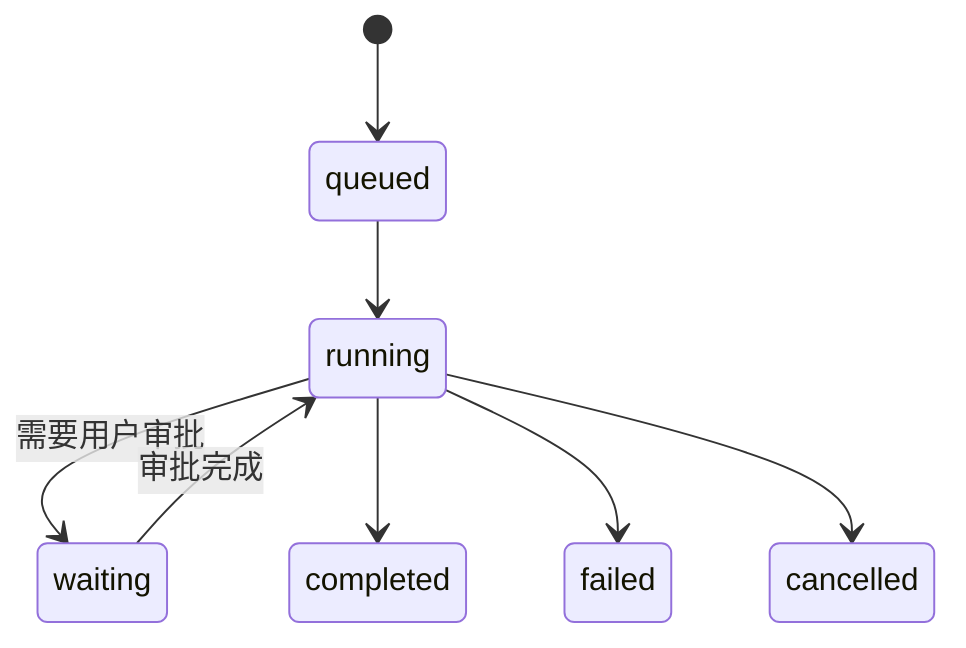

# 一、TypeScript 与类型系统

> 本章 4 题，题号沿用原题号。每题按“这题在考什么 → 一句话回答 → 展开说明 → 示例 → Moose 里的做法 → 容易答错的地方”排列。[题目列表](../questions.md) ｜ [答案目录](README.md)

## 1. 在定义 AI 接口返回的嵌套数据结构（如多轮对话、工具调用结果）时，如何用 TypeScript 的泛型与条件类型实现灵活的类型推导？

> **这题在考什么**：AI 应用里接口很多，比如“发送消息”和“查询用量”，它们都是请求，但参数和返回数据各不相同。面试官想看你能不能复用同一个请求外壳，同时让每次调用都拿到准确的类型提示，而不是到处写 `any`。

**一句话回答**：把不变的外层结构固定下来，用泛型表示变化的部分，再用“方法名到参数、返回值的映射表”让编译器根据方法名自动推出类型。

**展开说明**
- 先定义稳定的外壳。例如 `Result<T>` 表示“成功时返回 T，失败时返回错误”，所有接口共用同一套成功和失败处理。
- 再用映射表把方法名、参数和返回值绑在一起：`request<M extends Method>(method: M, params: Requests[M]): Promise<Responses[M]>`。传入方法名后，参数类型和返回类型就都确定了，写错参数会直接报错。
- 条件类型（按“某类型是否满足条件”来选择结果类型）适合做类型提取。比如 `T extends Promise<infer U> ? U : T`，其中 `infer U` 的意思是“把 Promise 里包着的类型取出来”。
- 类型只在写代码和编译时起作用。数据真正进来时，仍需要运行时校验。

**示例**：下面是一个简化版，方法名决定参数和返回值。

```ts
// 每个方法名对应的参数和返回值
type Params = { send: { text: string }; usage: { provider: string } };
type Outputs = { send: { queueId: string }; usage: { used: number } };

declare function request<M extends keyof Params>(
  method: M,          // M 被推断为 'send' 或 'usage'
  params: Params[M],  // 参数类型随方法名变化
): Promise<Outputs[M]>; // 返回类型也随方法名变化

request('send', { text: '修复报错' }); // 推出 Promise<{ queueId: string }>
```

**Moose 里的做法**：Moose 在 `shared/types.ts` 中定义 `Method`、`Requests`、`Responses`。`window.moose.request` 用方法名约束参数和返回类型；IPC 入口再用 Zod 校验实际传入的数据。

## 2. 当 AI 接口返回的字段可能因模型版本不同而动态变化时，如何设计类型守卫（type guard）与类型收缩策略？

> **这题在考什么**：TypeScript 只检查你写代码时声明的类型，管不了网络上实际收到的 JSON。模型升级后字段可能改名或换位置。面试官想看你是否知道要在运行时检查数据，再把它“收窄”成确定的类型。

**一句话回答**：接口返回值先当作 `unknown`，用类型守卫在运行时逐项检查，检查通过后再转换成页面统一使用的类型。

**展开说明**
- 类型守卫是一个返回 `value is X` 的函数。它在运行时做检查，检查通过后，TypeScript 才允许把这份数据当成 X 使用。
- 收窄的顺序是：先确认是不是对象，再根据 `type` 或版本字段判断是哪种格式，最后验证必需字段。
- 不同版本的差异放在适配器里消化。比如旧版给 `text`、新版给 `delta.content`，适配器分别识别，对页面都输出同一种“文本增量”。
- 缺少关键字段时，应当报告协议错误；多出不认识的字段可以忽略，这样模型新增字段时不会把页面弄坏。

**示例**：下面的守卫只有在真的找到字符串类型的 `text` 后，才允许读取它。

```ts
function hasText(value: unknown): value is { text: string } {
  return typeof value === 'object' && value !== null && // 先确认是对象
    'text' in value && typeof value.text === 'string';  // 再确认字段和类型
}
```

**Moose 里的做法**：Moose 的 `shared/validation.ts` 用 Zod 校验 IPC 参数。各代理适配器把 CLI 的原始事件转换为统一的 `AgentEvent`，页面不直接依赖某个 CLI 的字段。

**容易答错的地方**
- 不能直接用 `as` 把数据“断言正确”。`as` 只是让编译器闭嘴，运行时什么也没检查。

## 5. 设计一个类型系统，用于描述 AI Agent 执行过程中的状态流转（如思考→执行→观察→完成），并实现类型安全的状态切换。

> **这题在考什么**：Agent 一轮任务会经历排队、执行、等待用户批准、结束等状态。如果用几个互不相关的布尔值表示，很容易出现“已经完成却还在等待批准”这种矛盾组合。面试官想看你会不会用类型把不合法的状态和切换排除掉。

**一句话回答**：用判别联合描述每种状态各自带哪些数据，用函数签名限制哪些状态可以切换到哪些状态，运行时再核对当前状态和任务 ID。

**展开说明**
- 判别联合（用一个公共字段区分几种形态的类型）适合表示状态。例如 `{ status: 'running', runId }`、`{ status: 'waiting', requestId }` 和 `{ status: 'done' }`，每种状态只带自己需要的字段。
- 处理事件时检查转移是否合法。已经结束的任务，不能被迟到的“开始”事件改回运行中；审批也只能答复仍在等待的那个请求。
- 可以把切换函数的参数限制为特定状态。例如“批准”函数只接受等待态，编译器就不允许把完成态传进去。但调用方仍需先读取并检查当前状态。

**示例**：先看简化的状态图（省略了失败后恢复等分支）。



下面的代码只演示“等待审批 → 运行中”这一条转移，其他事件省略。

```ts
type RunState =
  | { status: 'running'; runId: string }
  | { status: 'waiting'; runId: string; requestId: string }
  | { status: 'completed'; runId: string };

function approve(
  state: Extract<RunState, { status: 'waiting' }>, // 只接受等待态
  requestId: string,
): Extract<RunState, { status: 'running' }> {      // 只能返回运行态
  if (state.requestId !== requestId) throw new Error('审批已失效'); // 运行时再核对
  return { status: 'running', runId: state.runId };
}
```

**Moose 里的做法**：Moose 用 `Status` 字符串联合表示 idle、queued、running、waiting 等状态，Service 在运行时检查审批是否属于当前待处理的请求。它没有完整的类型级状态机。

**容易答错的地方**
- 类型只能防止漏写字段和遗漏分支。来自网络的请求在运行时仍要核对当前状态和 `runId`，不能用 `as` 绕过。
- 这个示例只改变状态，不包含“向代理发送批准”这个副作用。

## 7. 如何用 TypeScript 声明一个支持流式 Chunk 数据与错误处理的泛型接口，并兼容 SSE、WebSocket 等多种传输方式？

> **这题在考什么**：流式回答会一小段一小段地到达。SSE、WebSocket 只是运送这些数据的通道，页面真正关心的是“收到正文、出错了还是结束了”。面试官想看你能不能把业务事件和传输方式分开设计。

**一句话回答**：先定义一个与传输无关的泛型事件联合（正文片段、错误、结束），各种传输方式只负责解码，再交给同一个处理函数。

**展开说明**
- 业务事件只描述三件事：收到一段正文、出错、结束。泛型 `T` 表示正文片段的具体类型，文本、结构化数据都能复用。
- SSE 和 WebSocket 各自负责把收到的消息解码成上面的事件，后续逻辑完全相同，以后换传输方式也不用改页面。
- 传输错误（比如断网）和模型报错（比如额度不足）要分开表示，因为处理方式不同：前者可以重连，后者要提示用户。
- 还要提前约定取消和断线重连的规则。

**示例**：下面是统一的事件类型，`seq` 是序号，用来发现重复或缺失。

```ts
type StreamEvent<T> =
  | { type: 'chunk'; runId: string; seq: number; data: T } // 正文片段
  | { type: 'error'; runId: string; message: string }      // 业务错误
  | { type: 'done'; runId: string };                        // 正常结束
```

**Moose 里的做法**：Moose 的适配器把各 CLI 的 stdio 消息转成统一的 `AgentEvent`。Web 页面通过 HTTP 发请求、通过 SSE 收业务事件，并不直接读取 CLI 输出。

**容易答错的地方**
- 断开连接不等于取消服务端任务。要停止生成，需要单独发取消请求。

---

[答案目录](README.md) ｜ 下一章：[二、流式处理与实时通信](02-streaming.md)
