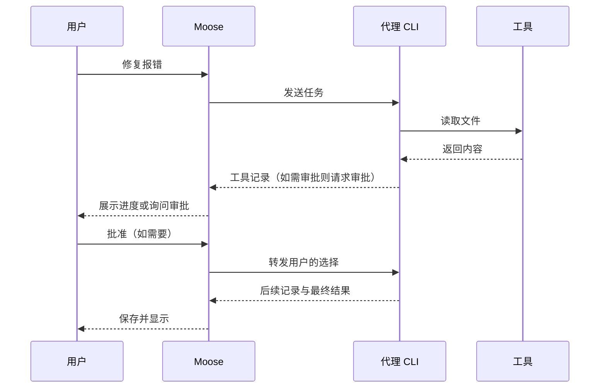

# 六、AI 特性与前端工程实践

> 本章 5 题，题号沿用原题号。每题按“这题在考什么 → 一句话回答 → 展开说明 → 示例 → Moose 里的做法 → 容易答错的地方”排列。[题目列表](../questions.md) ｜ [答案目录](README.md)

## 1. 在前端实现一个 Agent 循环时，如何管理工具调用的异步执行、超时处理与结果合并？

> **这题在考什么**：比如用户让 Agent 修一个报错，模型先要读文件，看到内容后才决定怎么改。这种“模型提出下一步、工具返回结果、模型再判断”的往复，才叫 Agent 循环。面试官想看你知道循环应该在哪里执行，以及多个工具调用怎样编号、超时和合并结果。

**一句话回答**：循环由可信后台执行，前端只负责展示、审批和取消；每次工具调用单独编号，独立的读取可以并行，有依赖的按顺序，超时要真正通知工具停下。

**展开说明**
- 执行循环的应是可信后台。前端负责展示每一步、收集用户审批、发出取消指令，不能直接执行模型给出的 Shell 或数据库命令。
- 每轮任务和每次工具调用分别编号（示意为 `runId`、`callId`），结果才能对应回原来的调用。
- 互不依赖的读取可以并行，写入或依赖上一步结果的调用要按顺序执行。
- 每个调用单独记录结果。比如同时读两个文件，一个成功、一个超时，就分别返回“文件内容”和“超时”，不能只留下最后完成的那一项。
- 断线后，有副作用的调用可能结果未知，不能盲目重跑。

**示例**：先看 Moose 中各方的分工。图里的审批只在代理提出请求时才会发生。



如果自己实现工具执行，超时信号必须传到工具本身（示意）。

```ts
const controller = new AbortController();
const timer = setTimeout(() => controller.abort(), 10_000); // 10 秒后发出中止信号
try { return await tool.run(args, { signal: controller.signal }); } // 工具要监听 signal
finally { clearTimeout(timer); } // 无论成败都清掉定时器
```

如果工具不支持 `signal`，还需要调用它专门的停止接口。

**Moose 里的做法**：Moose 实际由代理 CLI 决定并执行工具。Service 保存工具记录，把审批关联到当前 `runId` 和待处理消息，停止时取消任务并关闭适配器。

**容易答错的地方**
- `Promise.race` 只是不再等待，并不会自动停止底层进程。超时必须通知工具真正停下。

## 3. 在 AI 产品中，前端可以通过哪些技术手段（如缓存、压缩、懒加载）帮助降低 Token 成本？

> **这题在考什么**：Token 是模型实际读取或生成的内容单位，不是网页下载的字节数。压缩图片、懒加载页面能让网页更快，却不会让发给模型的提示词变短。面试官想看你能否分清“网页性能优化”和“模型成本优化”。

**一句话回答**：Token 成本只取决于送进模型和模型生成的内容，所以要减少重复上下文、只送相关片段、压缩过长历史、限制不必要的输出，只有相同且允许复用的请求才缓存。

**展开说明**

| 手段 | 能否降低 Token | 原因 |
| --- | --- | --- |
| 压缩图片、懒加载页面 | 不能 | 只影响网页下载，不改变发给模型的内容 |
| 去掉重复上下文 | 能 | 同样的内容不再重复送进模型 |
| 只引用相关文件片段 | 能 | 不把整份文件塞给模型 |
| 压缩过长的历史 | 能 | 旧对话变短 |
| 限制无必要的输出 | 能 | 生成的内容也计入 Token |
| 缓存相同请求 | 能，有前提 | 只适用于完全相同、且允许复用结果的请求 |

**Moose 里的做法**：Moose 可以选择文件引用，并显示底座给出的上下文用量，但没有自行完成整套 token 裁剪和费用结算。

## 9. 在 AI 多轮对话中，如何设计上下文窗口的管理策略（如滑动窗口、关键信息提取、自动摘要）？

> **这题在考什么**：模型一次能看到的内容长度有上限，这个上限叫上下文窗口。对话变长后，不能简单把最旧的消息一刀切掉，否则早先定下的约束和工具结果可能丢失。面试官想看你怎样分配预算、取舍内容。

**一句话回答**：先给上下文分预算（必需指令、最近对话、相关材料、输出预留），快超限时先去重、只取相关片段，再摘要较早的历史，工具调用和结果要成对保留。

**展开说明**
- 先分预算：必须遵守的指令、最近的对话、相关文件与工具结果、为最终输出预留的空间。
- 举例：总预算 8 千 token，可以给必需指令 1 千、最近对话 3 千、相关文件 2 千、输出预留 2 千。文件再多时，就只取相关片段或压缩较早的对话。这些数字只用来说明分配方法，不是 Moose 的固定配额。
- 接近上限时，优先去掉重复材料或只取相关片段，再对较早的历史做摘要。
- 工具调用和它的结果要成对保留，只留其中一半会让模型看不懂。
- 摘要要写明已经做出的决定、约束和未完成事项，并保留原文供核对，因为摘要可能漏掉细节。

**Moose 里的做法**：Moose 主要恢复底座的原生会话，上下文压缩由底座处理。

**容易答错的地方**
- 不应说成 Moose 自己实现了自动摘要。

## 10. 模型输出的 Markdown 和链接怎样安全渲染？前端能防住提示词注入吗？

> **这题在考什么**：聊天界面几乎都会把模型回答渲染成 Markdown。可模型的输出可能受它读过的网页、文件或工具结果操纵，里面混进一段 HTML、一个 `javascript:` 链接或一张图片，就可能在用户的浏览器里执行脚本或把数据带走。面试官想看你是否把模型输出当成不可信内容，并分清前端能防什么、不能防什么。

**一句话回答**：把模型输出当作不可信的用户输入来渲染：不渲染原始 HTML（或经过白名单清洗），链接只放行 `http(s)` 等少数协议，外部图片不自动加载，代码块只展示不执行；提示词注入的根源在模型读到的内容里，前端只能减少损失，真正的防线是工具最小权限、危险操作人工审批和隔离密钥。

**展开说明**
- 原始 HTML：要么直接跳过，要么用 DOMPurify、rehype-sanitize 这类白名单清洗器处理后再渲染，不要把模型输出塞进 `innerHTML`。
- 链接：只允许 `https:`、`http:` 等明确的协议，`javascript:`、`data:` 一律丢弃；外链要在新窗口或系统浏览器打开，不要在应用窗口内跳转。
- 图片和链接也是泄露数据的通道。被注入的指令可能让模型输出 ``，浏览器一自动加载图片，数据就随 URL 发出去了。所以外部图片最好改成点击才打开，或者用 CSP 限制图片来源。
- 代码块只做高亮和复制，绝不自动执行；“运行”按钮也要走正常的审批流程。
- 提示词注入（模型把读到的内容误当成指令）来自网页、文件、工具结果等外部材料。前端清洗只能挡住渲染层面的攻击，挡不住模型被骗去调用工具。

| 风险 | 前端能做的 | 必须在别处做的 |
| --- | --- | --- |
| 原始 HTML、脚本 | 跳过或清洗 HTML、配置 CSP | — |
| 恶意链接、图片外传 | 协议白名单、外部图片不自动加载 | — |
| 模型被骗去调用工具 | 显示审批详情 | 工具最小权限、后端校验、人工审批 |
| 密钥泄露 | 界面里不展示密钥 | 密钥不放进模型能读到的上下文 |

**示例**：下面用 `react-markdown` 跳过原始 HTML，并只放行 `http(s)` 和相对链接（示意）。

```tsx
<ReactMarkdown
  skipHtml // 不渲染模型输出里的原始 HTML
  urlTransform={(url) =>
    /^https?:/i.test(url) || !/^\w[\w+.-]*:/.test(url) ? url : '' // 其他协议一律清空
  }
>
  {text}
</ReactMarkdown>
```

**Moose 里的做法**：`src/components/markdown.tsx` 用 `react-markdown` 加 `remark-gfm`、`rehype-highlight` 渲染消息，开启了 `skipHtml`，`urlTransform` 只保留 `http(s)`、`file:` 和不带协议的相对路径。链接被改写成点击事件：`http(s)` 链接通过 `openExternal` 交给系统浏览器打开，其余当作本地文件在应用内预览；外部图片不会自动加载，只显示成一个点击才打开的链接。代码块只提供换行和复制按钮。`shared/validation.ts` 里 `openExternal` 的参数校验只允许 `http:`、`https:`。`electron/main.ts` 的窗口开启了 `sandbox`、`contextIsolation`，关闭了 `nodeIntegration`；`setWindowOpenHandler` 一律拒绝新窗口，`will-navigate` 和 `will-redirect` 阻止跳离当前页面，并注入 CSP（`img-src 'self' data:`、`object-src 'none'` 等）。Web 版的 CSP 在 `electron/web-server.ts` 里设置。这些措施管的是渲染层，代理会不会被注入内容骗去执行命令，要靠下一题的审批和底座的沙箱。

**容易答错的地方**
- 以为用了 Markdown 库就安全。很多库有允许原始 HTML 的选项，链接协议也要自己限制。
- 以为前端清洗能“解决”提示词注入。它只能防止渲染层被利用，模型被骗之后能做什么，取决于它手里工具的权限。

## 11. Agent 要执行危险操作（改文件、跑命令、联网）前，审批界面该怎么设计？

> **这题在考什么**：Agent 能改文件、跑命令，一次误批就可能删掉代码或泄露数据。审批界面要让用户看清“到底要做什么”，更要保证用户批准的正是那一个操作，而不是后来冒出来的另一个。面试官想看你对展示内容、授权范围和后端校验的整体设计。

**一句话回答**：审批卡要展示确切的命令、工作目录、文件改动和权限范围，提供“仅此一次 / 本会话内允许 / 拒绝”等选项；每个审批绑定到具体的请求 ID 和任务 ID，由后端重新校验仍然有效才放行；同时用沙箱限定默认能做的事，把“明确拒绝”和“结果未知”分开处理。

**展开说明**
- 展示内容：要执行的命令和工作目录、要改的文件和 diff、要申请的额外权限（比如联网、写工作区外的目录），以及模型给出的理由。不要只显示“是否允许执行工具？”。
- 授权范围：区分“仅此一次”和“本会话内同类操作都允许”。范围越大越要说清楚，默认选最小的。
- 拒绝最好能附带原因，让模型据此换一种做法，而不是原样再试一遍。
- 绑定与校验：审批要带上请求 ID 和所属任务 ID。后端收到时先检查这个请求是否仍在等待、任务是否还在运行、选项是否在允许范围内。这样，过期页面上的旧“批准”按钮无法批准一个新操作。
- 超时与结束：等待太久或任务已结束时，审批应变成“已过期”，而不是默认批准或默认拒绝。
- 明确拒绝和结果未知要分开：用户点了拒绝，操作确定没执行；审批发出后连接断了，操作可能已经执行，这时要标成“未知”，让用户查看现场再决定，不能自动重试。
- 沙箱（限制进程能访问的文件和网络的运行环境）决定哪些操作根本不需要问：比如只允许写工作区、默认禁止联网，超出范围才弹审批。

| 档位 | 默认能做什么 | 何时弹审批 |
| --- | --- | --- |
| 只读 | 读文件 | 任何写入或命令 |
| 工作区写入 | 改工作区内文件、跑受限命令 | 越出工作区、联网、提权 |
| 完全访问 | 几乎不受限 | 不弹，用户自担风险 |

**示例**：下面是后端处理审批回复时的校验顺序（伪代码）。

```ts
const pending = pendingRequests.get(requestId);  // 只认仍在等待的请求
if (!pending || pending.runId !== activeRunId) throw new Error('请求已失效');
if (!pending.options.has(choice)) throw new Error('无效的选项'); // 只接受当初给出的选项
agent.reply(pending.rpcId, choice);              // 用原始请求 ID 回给代理
pendingRequests.delete(requestId);               // 用过即删，不能重复批准
```

**Moose 里的做法**：
- 审批由代理 CLI 发起。以 Codex 为例，`electron/providers/codex.ts` 收到 `item/commandExecution/requestApproval`、`item/fileChange/requestApproval` 或 `item/permissions/requestApproval` 这类 JSON-RPC 请求后，记下原始请求 ID 和可选项，生成一条 `kind: 'approval'`、状态为 `pending` 的消息，标题是命令，正文是理由和改动或权限内容，选项为“Allow once”和“Deny”。
- 消息 ID 由任务 ID 和请求键拼成（`electron/session-execution.ts`）。用户回复走 `respond` 请求，`electron/service.ts` 先确认对应任务仍在运行、消息仍是 `pending`、任务没有被取消，否则返回“This request is no longer active”；适配器再核对选项是否属于当初给出的那几个，用原始请求 ID 回给 CLI，然后删除这条待处理请求。
- 任务结束、失败或被取消时，仍在等待的审批会被标成 `expired`，不会被当作批准或拒绝。Grok 适配器在取消和关闭时会把未决的权限请求回复为 `cancelled`。
- Plan 模式和原生代码审查期间，Codex 的命令和文件改动审批会被自动拒绝。
- 权限档位：`electron/providers/codex-permissions.ts` 把“请求批准”映射为 `on-request` 加 `workspace-write` 沙箱，并关闭沙箱网络和网页搜索；“帮我批准”改由 Codex 的 `auto_review` 审核；“完全访问”对应 `never` 加 `danger-full-access`。0.23.3 起四家都有这三档。Pi 仍没有可暂停的工具协议：请求批准会中止改动，帮我批准和完全访问允许同一组工具。OpenCode 由 Moose 在权限回调里交给用户、选一次性允许或选始终允许。见[计划、目标与三档权限](../reference/08-plan-goal-permissions.md)。
- Moose 没有实现审批超时（任务结束前一直等待），也没有“拒绝并附原因”的输入框。Codex 的审批卡只提供“仅此一次”和“拒绝”，没有“本会话内允许”；Grok 的选项则直接使用代理给出的列表。

**容易答错的地方**
- 只在前端把按钮置灰，后端不校验请求是否仍有效。页面刷新或多端同时打开时，旧请求就可能被重复批准。
- 断线后把“没收到结果”当成“被拒绝”并自动重试，导致同一条命令执行两次。

---

上一章：[五、前端 AI 架构设计](05-architecture.md) ｜ [答案目录](README.md) ｜ 下一章：[七、AI 工程化与前端工具链](07-engineering-toolchain.md)
