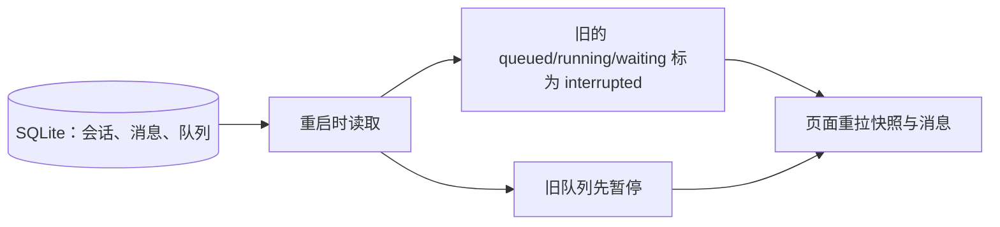

# 三、前端状态管理与数据流

> 题单，对着说。每题顺序固定：这题在考什么 → 一句话回答 → 展开说明 → 示例 → Moose 里的做法 → 容易答错的地方。对应 [答案](../03-state-management.md)，原题 1、2、5、6。事实按 Moose 0.23.3。答题稿里写了「没有」的，不要说成已经做了。

## 1. 在大型 AI 应用中，如何用 Zustand 或 Redux Toolkit 管理多轮对话、生成任务、用户配置等复杂状态？

> **这题在考什么**：聊天页里各种状态变化频率差别很大：输入框每敲一个字就变，用户设置很少变，消息还会被后台持续更新。全塞进一个大对象，无关组件就会跟着反复渲染。面试官想看你会不会按归属拆分状态。

**一句话回答**：先按“数据归谁管、变化多快”拆状态，再用按 ID 存储和 selector 精确订阅，让一条消息变化只影响用到它的组件。

**展开说明**

| 状态 | 特点 | 放在哪里 |
| --- | --- | --- |
| 消息、生成任务 | 服务端数据，后台持续更新 | 全局 store，按 ID 存储 |
| 用户设置 | 低频变化，多处共享 | 全局共享状态 |
| 输入框、弹窗开关 | 只有当前组件关心 | 组件局部状态 |

- 用 Zustand 时，可以按 ID 存消息，组件用 selector（从 store 里挑出自己需要那部分的函数）只订阅需要的那一条。
- 更新一条消息时，保留其他消息的对象引用不变，这样订阅其他消息的组件不会重新渲染。

**示例**：下面按 ID 订阅单条消息；更新另一条消息时，这个选择结果保持不变。

```ts
const message = useChatStore((state) => state.messagesById[id]);
// 更新时只替换 messagesById[id]，其他消息对象保持原引用
```

**Moose 里的做法**：Moose 的 `useWorkspace` 管全局快照，`useTranscript` 管当前会话的消息与分页，输入框状态留在组件里。它没有使用 Zustand 或 Redux。

**容易答错的地方**
- 不要把每个输入字符和全部历史都塞进一个全局 store。
- 能从已有数据算出来的值，不要再存一份。

## 2. 设计一个“状态快照”系统，支持将 AI 对话的完整状态（包括流式中间结果）序列化保存与恢复。

> **这题在考什么**：快照是关掉再打开页面或应用后还能用的数据记录，不是把正在运行的整个 JavaScript 程序存下来。面试官想看你能否分清“能存下来的数据”和“只能重新建立的连接、进程”。

**一句话回答**：快照只保存能恢复的事实，运行中的连接和进程不保存；重启后把原来“进行中”的任务标为中断，再重新拉取数据。

**展开说明**
- 快照保存这些内容：数据版本、会话配置、消息及其版本、待发送队列、最后确认的游标和原生会话 ID。
- 写入时保证这些记录彼此一致，不能出现队列写了一半、消息没写的情况。
- 恢复时先校验数据并按版本迁移旧格式，再补读消息。
- 运行中的 Promise、网络连接和进程无法序列化。重启后要把相关任务标为中断，再核对实际结果。

**示例**：恢复时只恢复数据，并修正已经无法继续的运行状态（示意）。

```ts
const status = saved.status;
const restoredStatus = ['queued', 'running', 'waiting'].includes(status)
  ? 'interrupted' : status; // 原来进行中的任务，重启后一律标为中断
// 连接和 Promise 由新进程重新建立
```

**Moose 里的做法**：Moose 的 `Snapshot` 不包含全部消息，消息另存在 SQLite 里。重启时它会修正运行状态，并暂停旧队列。恢复顺序如下：



## 5. 用户发送 AI 请求后，怎样立即给出反馈，同时避免把尚未生成的内容当成结果？

> **这题在考什么**：用户点了发送，模型可能还要排队或等审批。页面要立刻告诉用户“请求收到了”，但不能假装回答已经生成。面试官想看你能否区分“真实的等待状态”和“虚构的结果”。

**一句话回答**：发送后马上显示“已提交／排队中”这种真实状态，等收到真实的增量才显示回答，失败时保留用户输入。

**展开说明**
- 发送后立刻显示“已提交”或“排队中”，这是真实发生的事，可以放心展示。
- 不要预先显示一段虚构的 AI 回答。后台确认后，把这条请求关联到正式任务 ID，收到真实增量才开始展示回答。
- 失败时保留用户输入的内容，让用户自己决定是否重试。
- 重试要防止重复执行；切换会话后，旧会话迟到的结果也不能覆盖当前会话。

**Moose 里的做法**：Moose 的 `send` 返回，表示用户输入已经持久化到队列，不表示模型已经完成回答。

## 6. React 19 的 Actions、useActionState 和 useOptimistic 解决什么问题？在 AI 对话里怎么用？

> **这题在考什么**：发送消息这类操作，以前要手写一堆状态：`sending` 开关、错误信息、防重复点击、失败后回滚。React 19 把“异步操作 + 等待状态 + 乐观更新”做成了内置能力。面试官想看你知道这些 API 各管什么，以及乐观更新的边界在哪里。

**一句话回答**：Action 是放进 transition 里执行的异步函数，React 自动维护“进行中”状态；`useActionState` 再帮你保存每次操作的结果和错误；`useOptimistic` 让用户消息先显示出来，操作结束后自动换成真实状态，失败时自动撤回。

**展开说明**

| API | 管什么 | 对话里的用法 |
| --- | --- | --- |
| Action（异步 `startTransition`） | 异步函数执行期间，`isPending` 自动为 `true` | 发送期间禁用发送按钮 |
| `useActionState` | 保存上一次操作的返回值（结果或错误）和 `isPending` | 显示“发送失败，请重试” |
| `useOptimistic` | 操作进行中先显示一个临时状态，结束后回到真实状态 | 用户消息立刻出现在列表里 |
| `<form action={fn}>` | 提交表单直接调用 Action，配合 `useFormStatus` 读取提交状态 | 输入框和发送按钮写成一个表单 |

- `useOptimistic` 的临时状态只在 Action 进行期间存在。成功后，真实数据（比如服务端返回的消息列表）到了，就替换临时状态；失败时没有新数据，临时状态自然消失，相当于自动回滚。
- 它适合“结果基本可以预知”的内容，比如用户自己刚打的那句话。AI 的回答无法预知，不能用它伪造，这正是[第 5 题](#5-用户发送-ai-请求后怎样立即给出反馈同时避免把尚未生成的内容当成结果)说的“立即反馈但不伪造结果”。
- 临时消息要带一个标记，例如 `pending: true`，界面显示成半透明或“发送中”，让用户知道它还没被确认。
- 失败时乐观消息会消失，所以要另外把输入内容留在输入框或错误提示里，否则用户打的字就丢了。

**示例**：用户消息先乐观显示，发送结束后由真实列表接管。

```tsx
const [optimistic, addOptimistic] = useOptimistic(
  messages,
  (list, text: string) => [...list, { id: 'temp', role: 'user', text, pending: true }],
);
const [error, sendAction, isPending] = useActionState(async (_prev: string | null, form: FormData) => {
  const text = String(form.get('text'));
  addOptimistic(text); // 立刻显示用户消息
  try {
    await api.send(text); // 成功后外部 messages 更新，临时消息被替换
    return null;
  } catch {
    return '发送失败，请重试'; // 失败时临时消息自动撤回
  }
}, null);
// <form action={sendAction}> ... <button disabled={isPending}>发送</button>
```

**Moose 里的做法**：Moose 使用 React 19.3.0（见 `package.json`），但没有使用 Actions、`useActionState`、`useOptimistic` 或 `useTransition`。输入框（`src/components/composer.tsx`）用 `useState` 手动维护 `sending`，发送期间拒绝重复提交，失败时保留草稿；用户消息不会乐观插入列表，而是等后台写入队列后，由推送来的快照显示出来。

**容易答错的地方**
- `useOptimistic` 的更新要在 Action 或 transition 里调用，在普通事件处理函数里直接调用，React 会给出警告，临时状态也不会按预期保留。
- 乐观更新不等于不处理失败。自动回滚只是撤掉界面上的临时状态，错误提示和重试入口仍要自己做。

---

上一篇：[二、流式 · 下](02-streaming-2.md) ｜ [题单目录](README.md) ｜ 下一篇：[四、性能](04-performance.md)
