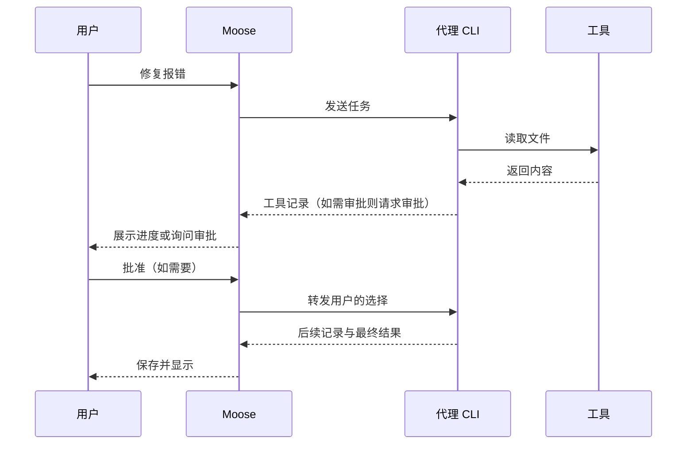

# 六、AI 特性与前端工程实践 · 上

> 题单，对着说。每题顺序固定：这题在考什么 → 一句话回答 → 展开说明 → 示例 → Moose 里的做法 → 容易答错的地方。对应 [答案](../06-ai-features.md) 第 1、3、9 题。下篇是输出安全和审批。事实按 Moose 0.23.3。答题稿里写了「没有」的，不要说成已经做了。

## 1. 在前端实现一个 Agent 循环时，如何管理工具调用的异步执行、超时处理与结果合并？

> **这题在考什么**：比如用户让 Agent 修一个报错，模型先要读文件，看到内容后才决定怎么改。这种“模型提出下一步、工具返回结果、模型再判断”的往复，才叫 Agent 循环。面试官想看你知道循环应该在哪里执行，以及多个工具调用怎样编号、超时和合并结果。

**一句话回答**：循环由可信后台执行，前端只负责展示、审批和取消；每次工具调用单独编号，独立的读取可以并行，有依赖的按顺序，超时要真正通知工具停下。

**展开说明**
- 执行循环的应是可信后台。前端负责展示每一步、收集用户审批、发出取消指令，不能直接执行模型给出的 Shell 或数据库命令。
- 每轮任务和每次工具调用分别编号（示意为 `runId`、`callId`），结果才能对应回原来的调用。
- 互不依赖的读取可以并行，写入或依赖上一步结果的调用要按顺序执行。
- 每个调用单独记录结果。比如同时读两个文件，一个成功、一个超时，就分别返回“文件内容”和“超时”，不能只留下最后完成的那一项。
- 断线后，有副作用的调用可能结果未知，不能盲目重跑。

**示例**：先看 Moose 中各方的分工。图里的审批只在代理提出请求时才会发生。



如果自己实现工具执行，超时信号必须传到工具本身（示意）。

```ts
const controller = new AbortController();
const timer = setTimeout(() => controller.abort(), 10_000); // 10 秒后发出中止信号
try { return await tool.run(args, { signal: controller.signal }); } // 工具要监听 signal
finally { clearTimeout(timer); } // 无论成败都清掉定时器
```

如果工具不支持 `signal`，还需要调用它专门的停止接口。

**Moose 里的做法**：Moose 实际由代理 CLI 决定并执行工具。Service 保存工具记录，把审批关联到当前 `runId` 和待处理消息，停止时取消任务并关闭适配器。

**容易答错的地方**
- `Promise.race` 只是不再等待，并不会自动停止底层进程。超时必须通知工具真正停下。

## 3. 在 AI 产品中，前端可以通过哪些技术手段（如缓存、压缩、懒加载）帮助降低 Token 成本？

> **这题在考什么**：Token 是模型实际读取或生成的内容单位，不是网页下载的字节数。压缩图片、懒加载页面能让网页更快，却不会让发给模型的提示词变短。面试官想看你能否分清“网页性能优化”和“模型成本优化”。

**一句话回答**：Token 成本只取决于送进模型和模型生成的内容，所以要减少重复上下文、只送相关片段、压缩过长历史、限制不必要的输出，只有相同且允许复用的请求才缓存。

**展开说明**

| 手段 | 能否降低 Token | 原因 |
| --- | --- | --- |
| 压缩图片、懒加载页面 | 不能 | 只影响网页下载，不改变发给模型的内容 |
| 去掉重复上下文 | 能 | 同样的内容不再重复送进模型 |
| 只引用相关文件片段 | 能 | 不把整份文件塞给模型 |
| 压缩过长的历史 | 能 | 旧对话变短 |
| 限制无必要的输出 | 能 | 生成的内容也计入 Token |
| 缓存相同请求 | 能，有前提 | 只适用于完全相同、且允许复用结果的请求 |

**Moose 里的做法**：Moose 可以选择文件引用，并显示底座给出的上下文用量，但没有自行完成整套 token 裁剪和费用结算。

## 9. 在 AI 多轮对话中，如何设计上下文窗口的管理策略（如滑动窗口、关键信息提取、自动摘要）？

> **这题在考什么**：模型一次能看到的内容长度有上限，这个上限叫上下文窗口。对话变长后，不能简单把最旧的消息一刀切掉，否则早先定下的约束和工具结果可能丢失。面试官想看你怎样分配预算、取舍内容。

**一句话回答**：先给上下文分预算（必需指令、最近对话、相关材料、输出预留），快超限时先去重、只取相关片段，再摘要较早的历史，工具调用和结果要成对保留。

**展开说明**
- 先分预算：必须遵守的指令、最近的对话、相关文件与工具结果、为最终输出预留的空间。
- 举例：总预算 8 千 token，可以给必需指令 1 千、最近对话 3 千、相关文件 2 千、输出预留 2 千。文件再多时，就只取相关片段或压缩较早的对话。这些数字只用来说明分配方法，不是 Moose 的固定配额。
- 接近上限时，优先去掉重复材料或只取相关片段，再对较早的历史做摘要。
- 工具调用和它的结果要成对保留，只留其中一半会让模型看不懂。
- 摘要要写明已经做出的决定、约束和未完成事项，并保留原文供核对，因为摘要可能漏掉细节。

**Moose 里的做法**：Moose 主要恢复底座的原生会话，上下文压缩由底座处理。

**容易答错的地方**
- 不应说成 Moose 自己实现了自动摘要。

---

上一篇：[五、架构](05-architecture.md) ｜ [题单目录](README.md) ｜ 下一篇：[六、输出安全与审批 · 下](06-ai-features-2.md)
