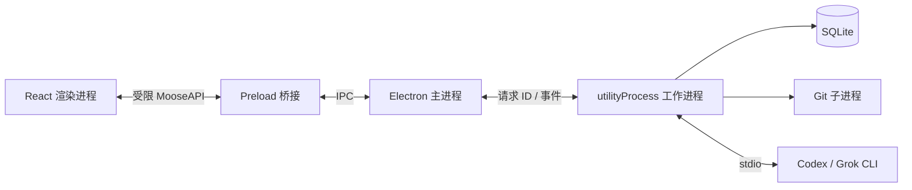

# Moose 项目经历：面试怎么讲，技术怎么理解

当前版本的面试准备请先读[完整面试指南（0.11.0）](project-interview-guide.md)，已结合现有代码补充新增功能、技术取舍和追问。本文保留早期讲解，部分功能说明与代码片段已过时。

> 版本范围：这份面试材料保留原有题目、讲解与历史示例，不作为最新功能清单。当前架构见 [技术架构](../architecture.md)，测试结果见 [验证说明](../testing.md)；0.6.0 新增 Pi，详见 [Pi 接入](../providers/pi.md)。

这份材料按“先讲清项目，再回答追问”来读。开场先用下面的介绍；被问到实现时，再看后面的对应章节。代码片段用于理解和核对，不需要背代码或一串英文缩写。

## 面试开场：请介绍一下你的项目

### 一分钟版：可以直接照着练

> Moose 是我独立开发的一款 Mac 桌面应用，用来集中使用 Codex、Grok 这类 AI 编程工具。用户选一个本地代码项目，输入“帮我修复这个问题”，就能在界面里看 AI 的回复、执行了哪些操作，以及代码具体改了什么。需要用户批准或补充信息时，也能直接在界面里处理。
>
> 技术上，我用 Electron 做桌面应用，React 和 TypeScript 写界面和业务逻辑，SQLite 保存本地聊天记录、草稿和待处理消息。AI 能力通过用户已经安装的官方命令行工具接入，模型本身由服务商提供。
>
> 我主要解决了三个问题：把不同 AI 工具的返回结果整理成统一界面；把运行任务和数据库操作放到后台，避免直接卡住窗口；同一份代码一次只安排一个任务，防止应用里的两个任务同时修改它。应用重启后也能找回历史和待处理消息，由用户决定是否继续。

### 面试官说“展开说说你是怎么做的”

> 我先把使用流程定下来：打开代码目录、创建对话、发送需求、查看执行过程，最后检查代码改动。
>
> 然后把程序分成三个部分：React 负责显示和交互；Electron 主进程负责窗口、菜单和文件选择；后台工作进程负责调用 AI 工具、执行 Git 查询和保存数据。它们之间通过消息通信，比如界面发出“发送任务”的请求，后台执行后把结果通知界面。
>
> 接入 AI 时，Codex 和 Grok 的消息格式不一样。我分别写了一层转换代码，把它们的回复、工具执行、审批和提问，转成 Moose 内部统一的数据结构，这样界面就不用各写一套。
>
> 另外我做了任务排队。如果同一个代码目录已经有任务在运行，新消息先保存下来，等前一个结束再处理；不同目录可以同时运行。保存到本地数据库后，即使应用关掉，待处理消息也不会只因为内存清空而丢失。
>
> 验证上，我分别检查业务逻辑、真实桌面操作流程、真实 Codex 调用和打包后的启动。Grok 的连接和模型列表已经验证，但真实生成曾被账号额度限制，不能说所有能力都验证完成了。

### 先把“项目、会话、任务”分清楚

| 词 | 在 Moose 里是什么意思 | 例子 |
| --- | --- | --- |
| 项目 | 电脑上的一个代码目录 | `/Projects/shop`，里面放商城源码 |
| 会话 | 围绕这个项目的一段聊天 | “登录问题排查”这段对话 |
| 消息 | 用户或 AI 发出的一条内容 | “帮我修复登录按钮” |
| 一轮任务 | 从发送一次需求，到 AI 完成、失败或被停止的这段执行 | AI 读代码、改文件，再回复处理结果 |
| 上下文 | AI 处理当前需求时参考的信息 | 前面的聊天、选中的文件、附件和技能说明 |
| Coding Agent | 能结合代码并调用工具完成编程任务的 AI 程序 | 不只回答问题，还能按权限读取文件、运行命令 |
| CLI | 命令行工具，平常通过终端启动的程序 | Moose 在后台启动 `codex` 或 `grok` |
| provider | 代码中对接入方的称呼 | Codex 或 Grok，负责提供各自的 AI 执行能力 |

### 一条需求在程序里怎么走

以“帮我修复登录按钮”为例：

1. **界面收集输入**：React 取得文字、附件和所选项目，向后台发送请求。
2. **后台检查并保存**：检查参数是否合法，把需求写入数据库，判断这个代码目录是否已有任务。
3. **安排执行**：目录空闲就启动；有任务占用就先排队。
4. **调用 AI 工具**：启动对应的官方 CLI，创建或恢复对话，再提交需求。
5. **持续显示过程**：CLI 陆续返回文字和工具执行记录，后台整理后通知 React 更新界面。需要审批时，显示按钮并把用户选择传回去。
6. **保存并查看结果**：保存消息和状态，释放目录占用，继续处理待执行消息。用户在 Git 改动面板查看新增、删除和修改的内容。

下面保留完整实现说明。每节先解释问题和做法，再给术语、代码与限制。


## 一、项目经历（简历版本）

**Moose（Coding Agent 桌面客户端）｜独立开发｜全栈开发**

技术栈：Electron、React、TypeScript、Vite、shadcn/Base UI、Tailwind CSS、Drizzle ORM、SQLite

- 面向 macOS 开发本地 Coding Agent 客户端，通过 Codex App Server 与 Grok ACP 接入代理，统一流式输出、工具记录、权限审批和交互提问。
- 划分主进程、沙箱渲染进程与后台工作进程，通过经过类型约束和参数检查的消息通信；同一代码目录的任务依次执行，不同目录可同时运行，待处理消息与聊天历史保存在本地。
- 实现项目与会话管理、最新消息编辑与历史续聊、附件与图片输入、Git 改动审阅；支持 `@` 文件模糊搜索、技能选择及 Codex Plan、Goal 模式。
- 完成中英双语、主题切换、键盘快捷键及 arm64 打包；完成业务逻辑测试与 Electron 界面流程测试，并有真实 Codex 调用和打包后运行的验证记录。

## 二、项目定位、个人职责与技术栈

### 2.1 独立开发，非任职项目

Moose 是个人独立开发项目，应放在简历的“个人项目”或“独立项目”中，不归入比亚迪的任职经历。项目时间应填写自己的实际开发时间，不套用上一段工作经历的任职时间。

个人职责覆盖需求定义、界面设计、Electron 工程搭建、代理协议接入、本地数据建模、交互实现、测试与打包。这里的“全栈”指桌面渲染端、具备系统能力的本地后台和数据层，并不意味着开发了云端 API 或模型推理服务。

项目定位是统一已有 Coding Agent 的桌面操作入口。Moose 负责组织项目、会话、输入、审批、结果与 Git 审阅；具体推理和工具执行由本机安装的官方 CLI 完成。目前没有用户规模、商业收入或团队提效数据，不应添加未经测量的百分比成果。

### 2.2 为什么选择这些技术

技术栈不用一次背完。先说三件事：**Electron 把网页技术做成桌面应用，React 做界面，SQLite 存本地数据**。TypeScript 帮我在开发时发现类型错误；其他库在被追问时再讲。下面的 ORM 是“用代码操作数据库的工具”，tokens 是统一命名的颜色等样式值，ES module 是 JavaScript 的模块组织方式。

| 技术 | 当前用途与选择理由 | 对应代码 |
| --- | --- | --- |
| Electron | 提供原生窗口、文件选择、菜单、剪贴板、系统浏览器入口和后台进程能力 | [main.ts](../../electron/main.ts) |
| React | 组织会话时间线、输入区、设置页和 Git 审阅等交互；通过状态与事件同步界面 | [app.tsx](../../src/app.tsx)、[workspace.ts](../../src/lib/workspace.ts) |
| TypeScript | 约束前后端 IPC、代理事件、项目与会话数据类型 | [types.ts](../../shared/types.ts) |
| Vite、vite-plugin-electron | 统一渲染端与 Electron 多入口开发构建，处理热更新和进程重启 | [vite.config.ts](../../vite.config.ts) |
| shadcn/Base UI | 复用 Select、Dialog、Menu 等交互组件，减少自行实现焦点管理与键盘交互的成本 | [ui](../../src/components/ui)、[components.json](../../components.json) |
| Tailwind CSS | 配合语义颜色 tokens 和局部 CSS 调整排版、主题与组件状态 | [app.css](../../src/app.css) |
| Drizzle ORM | 类型化地操作 SQLite 表结构、查询和事务 | [schema.ts](../../electron/db/schema.ts)、[store.ts](../../electron/db/store.ts) |
| SQLite、better-sqlite3 | 将历史、队列、草稿与设置保存在本地；同步数据库操作放到工作进程 | [store.ts](../../electron/db/store.ts) |
| Zod | 在运行时校验跨进程请求，补足 TypeScript 无法验证外部输入的问题 | [validation.ts](../../shared/validation.ts) |
| Motion | 实现可中途反向操作的侧栏动画，适配减少动态效果设置 | [app.tsx](../../src/app.tsx) |
| pnpm、ES module | 管理固定版本依赖与 lockfile；主进程和工作进程采用 ESM 输出 | [package.json](../../package.json) |

首版是本地应用，没有引入 Hono 或 Cloudflare。同步、账号服务和远程协作不在当前范围内，没有必要为这些尚不存在的需求部署云基础设施。

**阅读与版本说明**：本文按当前工作区解释关键交互；原稿对应 package.json 0.5.3。测试数字属于 [验收记录](../releases/validation-history.md) 中对应版本的历史结果，不代表本次重新测试了当前版本。0.3.0 的“编辑后新建会话”已变化：当前编辑最新用户消息会在原会话中替换这一轮；0.6.0 已移除独立历史续聊入口。代码片段为节选或简化示意，完整实现以链接文件为准。

## 三、第一条：接入代理，统一交互

> 面向 macOS 开发本地 Coding Agent 客户端，通过 Codex App Server 与 Grok ACP 接入代理，统一流式输出、工具记录、权限审批和交互提问。

### 3.1 “本地客户端”具体指什么

你可以理解为“装在 Mac 上的操作界面”。代码文件和聊天记录存在电脑里，AI 推理仍可能通过官方工具访问网络上的模型服务。

项目目录、SQLite 数据库、附件副本与 CLI 进程都在用户的 Mac 上。Moose 查找已经安装的 `codex`、`grok` 可执行文件，并允许用户在设置中指定绝对路径。PATH 补充了 Homebrew 和常见 CLI 安装目录，避免从 Finder 启动应用时找不到命令。

“本地”不表示模型离线运行。CLI 仍按其自身机制访问模型服务，用户输入和被代理读取的内容可能发送给服务商。Moose 不自行实现登录、不保存账号密码，也不将 CLI 凭据复制到自己的数据库。

代码：[process.ts](../../electron/providers/process.ts)、[settings-dialog.tsx](../../src/components/settings-dialog.tsx)。

### 3.2 Codex App Server 如何接入

**可以这样讲**：“我没有去模拟终端里的键盘输入，而是启动 Codex 提供的程序接口，发送结构化请求，再接收它返回的结果。”

**名词拆开看**：App Server 是 Codex 给其他程序调用的接口入口；子进程是 Moose 启动的另一个程序；stdio 是两个程序通过标准输入和输出传数据。JSON-RPC 是约定好的请求和响应格式，例如请求带编号 17，响应也带编号 17，就能知道它在回答哪次请求。thread 是一段对话，turn 是其中一轮执行；通知是不需要先提问就能收到的进度消息。

通过子进程启动 `codex app-server`，使用 stdio 传输 JSON-RPC 消息。请求通过 ID 匹配响应；通知用于接收异步增量与任务状态；服务端发起的请求用于审批和提问。

基本流程是初始化连接、读取账号和模型能力、创建或恢复 thread、启动 turn、接收事件、处理完成或取消。Moose 保存 provider 的原生 thread ID；下次发送消息时优先恢复该 thread，而不是把每次输入都作为独立对话。

```ts
// 节选：electron/providers/codex.ts
await rpc.request('initialize', {
  clientInfo: { name: 'moose', title: 'Moose', version: '0.1.0' },
  capabilities: { experimentalApi: true },
});
rpc.send({ method: 'initialized', params: {} });
```

片段中的 clientInfo 版本是当前适配器中的静态字符串，不是安装包版本号；安装包版本由 package.json 管理。协议类型由所选 Codex CLI 生成并保存在仓库中，但生成类型不能替代真实协议验证，也不能保证任意 CLI 版本兼容。

代码：[codex.ts](../../electron/providers/codex.ts)、[rpc.ts](../../electron/providers/rpc.ts)、[generated/codex](../../electron/providers/generated/codex)。

### 3.3 Grok ACP 如何接入

**ACP 是客户端和 AI 工具之间的一套通信约定**。SDK 是帮助使用这套约定的代码库；NDJSON 是一行一条 JSON 消息，便于连续传输。这里的关键是：Grok 用另一套接口，我为它单独写接入代码，再把结果转换成界面能理解的格式。握手就是连接后先互相确认身份信息、版本或支持的功能。

Grok 使用 ACP SDK 的 `ClientSideConnection` 和 NDJSON 流连接 `grok agent … stdio`。初始化后读取能力；如果官方 CLI 提供 `cached_token` 登录方式，就调用该认证入口复用现有登录状态。

首次对话使用 `newSession`；后续在能力允许时调用 `loadSession`。恢复过程可能回放已有消息，因此适配器在新 prompt 开始前抑制旧消息进入当前执行，避免重复展示历史。

Grok 与 Codex 的会话、模型和权限格式不同。Moose 没有把两者硬套成完全相同的协议，而是在适配器内部处理差异，再向上提供统一接口。

代码：[grok.ts](../../electron/providers/grok.ts)。真实 Grok 握手、认证和模型发现已验证；实际生成曾因 HTTP 402 额度耗尽失败，文件修改与续聊不能写成已完成真实验证。

### 3.4 统一适配器与事件模型

**适配器就是转换层**。例如 Codex 和 Grok 对“AI 回复了一段文字”的字段叫法不同，转换后都变成 Moose 的文字消息；审批则变成审批卡片。这样新增接入方时，主要增加转换代码，已有聊天界面可以继续使用。能力探测就是先问对方“你支持图片、哪些模型和哪些模式”，再决定显示什么选项。

```ts
// 节选：electron/providers/types.ts
export interface AgentAdapter {
  probe(): Promise<Pick<ProviderInfo, 'models' | 'modes' | 'images'>>;
  fork?(session: Session, cwd: string, lastTurnId: string): Promise<string>;
  run(context: RunContext): Promise<void>;
  respond(key: string, choice?: string, answers?: Record<string, string>): void;
  cancel(): Promise<void>;
  close(): Promise<void>;
}
```

`probe` 返回真实可用能力，`run` 承载一次输入的执行，`respond` 回答服务端请求，`cancel` 与 `close` 管理取消和资源释放。`fork` 是可选能力，避免要求所有 provider 支持同一种历史分支机制。

归一化事件包含 `key`、`kind`、`text`/`delta`、`state`、`choices` 和 `questions`。界面只需要根据事件类别渲染消息、工具、审批或提问卡片，不必在每个组件中判断原始 JSON-RPC/ACP 字段。

### 3.5 流式输出与工具记录

**流式输出就是边生成边显示**，像聊天回答逐段出现。delta 指“这次新增加的文字”，最终事件可能带完整答案。如果把完整答案再追加一次，页面就会重复，所以增量要追加、完整结果要替换。dirty 是“内容变了、需要保存和通知界面”的标记；约 80 毫秒合并处理一次，避免每来几个字就写一次数据库。

Codex 的 `item/agentMessage/delta` 被转换为文本增量；`item/completed` 里的最终文本覆盖已有内容。覆盖与追加必须区分，否则容易把完整响应再次追加到增量响应后面。

```ts
// 节选：electron/service.ts
if (event.text !== undefined) row.text = event.text.slice(0, 500_000);
if (event.delta) row.text = (row.text + event.delta).slice(0, 500_000);
run.rows.set(id, row);
run.dirty.add(id);
```

服务层以约 80 ms 的间隔刷新 dirty 消息，降低频繁落库与 IPC 通知的开销。渲染端通过 React Markdown、GFM 和代码高亮展示结果。工具输出与思考过程使用可展开记录，避免长命令输出占满时间线。

当前单条文本最多保留 500,000 个字符，这是内存和展示上的保护边界，并非无限日志存储。工具记录保存的是代理返回的执行信息，Moose 没有另做一个通用终端。

代码：[service.ts](../../electron/service.ts)、[transcript.tsx](../../src/components/transcript.tsx)。

### 3.6 权限审批如何准确关联

**审批就是 AI 要执行某个操作前，请用户决定是否允许**。难点不只是放两个按钮，而是确保点击“允许”回答的是眼前这次操作。如果任务已经停止，旧按钮就必须失效，不能误批准下一个任务。下面表格中的英文是传给 Codex 的实际配置值，不需要在开场背诵；沙箱是对程序能读写哪些位置、能否联网的限制。

适配器记录服务端请求 ID、请求类型和允许的选项，服务层将其归属到当前执行。用户点击审批时，后台检查执行是否仍然存在、消息是否仍为 pending、选项是否属于原请求，然后返回原协议要求的响应结构。

Codex 的三档权限对应如下：

| 界面选项 | 审批策略 | 审批处理者 | 沙箱 |
| --- | --- | --- | --- |
| 请求批准 | on-request | user | workspace-write，网络关闭 |
| 帮我批准 | on-request | auto_review | 同上 |
| 完全访问 | never | user | danger-full-access |

“帮我批准”调用 Codex 提供的审核机制，Moose 没有自行编写风险评分模型。停止任务或进程结束后，未回答审批会失效；迟到的点击不能作用到下一次执行。Grok 当前只暴露已支持的请求批准与完全访问，不伪装出风险自动审核能力。

代码：[codexPermissions](../../electron/providers/codex.ts)、[respond 处理](../../electron/service.ts)。

### 3.7 交互提问如何区别于审批

**审批问“能不能做”，交互提问问“你具体想要什么”**。例如“是否允许执行这条命令”属于审批，“界面用深色还是浅色”属于需求提问。两者都要保留原问题编号，才能把答案传回正确位置。

审批通常是允许或拒绝某个工具操作；提问是代理需要用户补充需求。统一问题结构保存问题 ID、文本、选项以及是否属于秘密输入。界面支持选择已有选项或输入答案，后台检查必填问题是否已回答。

Codex 对接 `item/tool/requestUserInput`；Grok 对接其 ask-user-question 扩展，并将回答重新组装成原协议字段。这样能保持原始问题关联，而不是把回答当成一条没有上下文的新聊天消息。

**这一条可以这样讲：**“我分别接入 Codex 和 Grok，把它们不同格式的回复转换成统一的消息和操作卡片。重点处理了回答重复显示，以及旧审批误作用到新任务的问题。”

## 四、第二条：进程架构、调度与恢复

> 划分主进程、沙箱渲染进程与后台工作进程，通过经过类型约束和参数检查的消息通信；同一代码目录的任务依次执行，不同目录可同时运行，待处理消息与聊天历史保存在本地。

### 4.1 三类进程为什么要分开

**进程可以理解为操作系统中各自运行的一份程序，有自己的内存和执行环境。** Moose 把显示界面、管理窗口、执行后台工作分开。主进程像窗口管理员；渲染进程运行 React 页面；工作进程做 AI 调用、Git 查询和数据库操作。

**为什么分开**：数据库查询等同步操作会让所在进程等待。如果把这些操作放在主进程，窗口操作就可能受影响。`utilityProcess` 是 Electron 用来启动后台工作进程的 API 名称。Preload 是界面与主进程之间的桥接脚本，限定界面能请求什么功能。下面图中的 IPC 就是进程之间发送消息。



主进程处理窗口、菜单、文件选择和系统入口；渲染进程负责界面；`utilityProcess` 承载代理、Git 和数据库。Preload 是受限桥接脚本，不是第四个独立业务进程。

SQLite 使用同步驱动，将其放在工作进程能避免同步查询直接阻塞主进程的窗口操作。隔离并不代表后台永远不会阻塞；大查询、文件遍历和事件合并仍需要控制规模。

代码：[main.ts](../../electron/main.ts)、[runtime-host.ts](../../electron/runtime-host.ts)、[runtime.ts](../../electron/runtime.ts)。

### 4.2 沙箱与能力边界

**这里要解决的是：聊天页面里显示的内容，不能随便获得电脑文件和命令执行权限。** 所以 React 页面不能直接调用 Node.js 的文件接口，只能经过预先提供的入口请求后台处理。contextIsolation 表示隔开网页脚本与桥接脚本的执行环境；CSP 是限制网页能加载、执行哪些资源的规则。它们限制的是应用界面，AI 工具本身的执行权限还要单独控制。

```ts
// 节选：electron/main.ts
webPreferences: {
  preload: join(directory, '../preload/preload.cjs'),
  sandbox: true,
  contextIsolation: true,
  nodeIntegration: false,
  spellcheck: true,
}
```

渲染层不能直接使用 Node 文件或进程 API。Preload 只暴露 `request` 与 `subscribe`；主进程还会检查 IPC 来自当前可信窗口的主 frame。

Markdown 不执行原始 HTML；外链只允许 HTTP(S)，经过校验后交给系统浏览器；应用禁止任意新窗口、webview 和页面导航，并配置 CSP。这是减少渲染内容获得系统能力的入口，不应在面试中描述为“绝对安全”或“完全隔离代理执行”：代理 CLI 的权限由另一层沙箱和审批策略决定。

### 4.3 类型化 IPC 与运行时校验各解决什么问题

**IPC（Inter-Process Communication）就是进程间通信**。例如界面说“请发送这条消息”，主进程转给后台；后台回答“已开始”，之后继续推送进度。不同进程不能当作同一个普通函数调用环境直接共享所有对象，需要约定消息格式。

**类型化**指 TypeScript 在写代码时检查“方法、参数、返回值是否配套”。**运行时校验**指程序真正收到请求后，用 Zod 再检查数据：比如附件数量有没有超限、ID 格式对不对。前者帮助开发者写对代码，后者检查实际收到的内容。pending Map 是保存“还没收到答复的请求”的表；超时就是等太久后报错，而不是一直转圈。

```ts
// 节选：shared/types.ts
export interface MooseAPI {
  request<M extends Method>(method: M, params: Requests[M]): Promise<Responses[M]>;
  subscribe(listener: (event: AppEvent) => void): () => void;
}
```

泛型关联方法名、参数和返回值，让开发时误传字段、误用返回结构更容易被编译器发现。但运行时收到的数据并不会因为声明了 TS 类型就自动可信，因此还需要 Zod。

```ts
// 节选：shared/validation.ts
export function validate<M extends Method>(method: M, input: unknown): Requests[M] {
  if (!Object.hasOwn(schemas, method)) throw new Error('Unknown operation');
  return schemas[method].parse(input) as Requests[M];
}
```

各方法使用 strictObject，校验 UUID、字符串长度、枚举、附件数量与 URL 协议。主进程到工作进程的请求另有 ID、pending Map 和超时处理；工作进程异常退出时拒绝未完成请求并通知界面，避免请求永久挂起。

### 4.4 同一份代码依次处理，不同目录可以同时处理

**先看场景**：你在同一个商城目录开两个会话，一个改登录，一个改导航。两边可能都会改同一个文件，互相覆盖。因此 Moose 让同一目录一次只执行一个任务。第一个结束，第二个再开始，这叫“串行”。商城目录和博客目录互不相同时，可以同时执行，这叫“并行”。

**实现很直接**：后台维护一张“哪个目录正在运行任务”的表，即 `active Map`。准备运行前查表，运行时登记，结束时移除。`realpath` 用于确认路径实际指向的位置，避免同一目录的不同路径写法绕过检查。调度器就是负责检查这张表、决定下一条需求何时开始的代码，不是另装的一套调度系统。

项目添加时使用 `realpath` 规范化路径。调度器用规范化后的项目路径作为 `active` Map 的键；同一目录已有执行时，后续消息留在队列中。

```ts
// 节选：electron/service.ts
if (session.archived || this.active.has(project.path) || this.editing.has(project.path)) continue;
// …创建 run 并登记目录占用…
this.active.set(project.path, run);
run.promise = this.execute(run, project.path, item.text, item.attachments || [], item.context);
```

调度循环没有立即 await 每个 `execute`，因此不同目录可以同时执行。`draining` 与 `drainAgain` 避免异步查找 CLI 期间重复进入调度造成竞争。执行结束后释放目录并再次调度。

选择目录作为单位，是因为两个会话可能修改同一份代码。这个约束只覆盖 Moose 内部的相同规范化项目目录，不是跨应用文件锁，也不覆盖任意父子目录或 Git 仓库重叠关系；外部终端和其他客户端仍能修改文件。

### 4.5 后发的需求先排队，关掉应用也要保存

**队列就是待办列表**：AI 正在改登录，你又发“接着补个测试”，新消息先排着，前一项处理完再开始。这里是 Moose 自己保存在 SQLite 里的记录，没有用 Redis 或 Kafka 这类独立消息系统。

**持久化就是保存到磁盘，关闭应用后还在**。只存在内存里的列表，进程退出就没了。事务则把“移除待办、写入用户消息、更新会话状态”当成一组数据库操作：要么一起成功，要么一起撤销，避免只做了一半。事务只保护这些数据库操作，不会把 AI 对代码文件的修改一起撤销。

运行中的后续输入先保存为 queue 记录，包含文本、附件和上下文选择，可编辑文本或取消。任务真正开始时，通过事务将队列项移除、更新会话状态并写入用户消息，减少“队列已经消费但用户消息没有保存”的中间状态。

应用重新打开时，已有队列会进入暂停集合，需要用户明确继续，不会自动重放潜在的文件修改请求。排队消息的模式、文件引用与技能是提交时保存的上下文；模型与权限仍采用执行时的会话配置，并非所有配置都作为队列快照固化。

代码：[enqueue / begin](../../electron/db/store.ts)、[Composer 队列界面](../../src/components/composer.tsx)。

### 4.6 中断恢复的准确含义

**恢复的是聊天记录和待办，不是让一条执行到一半的命令原地复活**。比如改文件过程中应用退出，下次打开能看到历史和中断状态，但不会擅自把需求再执行一次；用户需要先检查文件改到了哪里。

WAL 是 SQLite 先写日志再整理到数据库的一种模式；外键约束用来检查相关记录的关联关系；迁移是应用升级时更新数据库结构。`interrupted` 表示任务中断，`expired` 表示旧消息或审批已失效。

数据库保存项目、会话、消息、队列与设置；附件内容保存为本地文件。SQLite 开启 WAL 和外键约束；数据库升级通过 `PRAGMA user_version` 与事务执行，目前迁移到 v3，增加了草稿和队列上下文字段。

启动时，未完成会话标记为 interrupted，未完成消息或审批标记为 expired。历史、草稿和 provider 原生会话 ID 保留，用户可以继续会话。

“恢复”并不是恢复被杀死进程的内存，也不保证恢复某条命令执行到一半的现场，更不自动重试所有中断操作。已产生的文件改动需要用户审阅后决定如何继续。

代码：[Store 构造函数](../../electron/db/store.ts)、[migrations.ts](../../electron/db/migrations.ts)。

### 4.7 如何避免重复、迟到事件污染

**例子**：你点了停止，但旧任务最后一段回复这时才到，不能让它继续更新页面；你切到会话 B，会话 A 的迟到查询结果也不能盖住 B。`runId` 区分是哪次执行，`seq` 是更新序号，较旧序号不会覆盖较新的内容。幂等合并指同一条带编号的更新再处理一次，不会多出一条重复记录；这不等于上游重复发送的每段文字都能识别。

服务层用 `runId + provider event key` 生成消息 ID，每次更新递增 `seq`。数据库和渲染层只接受比已有记录更新的序号。取消后通过 `run.cancelled` 拒绝后续事件；切换会话时，前端用请求代次忽略旧异步请求结果。

这里保障的是已归一化消息更新的顺序和幂等合并。对于 provider 本身重复发送、且没有可识别原始序号的同一段 delta，不能宣称端到端 exactly-once。

代码：[accept](../../electron/service.ts)、[saveMessage](../../electron/db/store.ts)、[mergeMessages](../../src/lib/workspace.ts)。

### 4.8 关窗口与退出应用

**关闭窗口和退出程序是两件事**。Mac 上关掉窗口后，后台任务可以继续；按 Cmd+Q 才是退出应用，需要停止任务并保存数据。SIGTERM 可以理解为“请正常结束”，SIGKILL 是“强制终止”；先给正常清理机会，超时再强制结束。

macOS 关闭窗口后保留后台任务；再次激活应用时重建窗口。Cmd+Q 则触发有序退出：停止新请求、取消执行、关闭 CLI、刷新数据、关闭数据库。

CLI 在独立进程组内启动，清理时先 SIGTERM，超时再 SIGKILL，尽量清理派生子进程。这不构成对断电、强制杀进程和所有 daemon 化子进程的绝对保证。

**这一条可以这样讲：**“我把运行 AI、查 Git 和存数据放到后台，界面通过限定好的消息入口调用。同一个代码目录一次只执行一个任务，后来发的消息先存起来排队。重启后能找回历史和待办，但是否继续执行由用户决定。”

## 五、第三条：项目、历史与上下文能力

> 实现项目与会话管理、最新消息编辑与历史续聊、附件与图片输入、Git 改动审阅；支持 `@` 文件模糊搜索、技能选择及 Codex Plan、Goal 模式。

### 5.1 项目与会话管理

**项目是代码目录，会话是这个目录下的一段聊天**。归档是把会话收起来，还能恢复；删除是移除 Moose 保存的记录。删除项目不会删除用户电脑里的源码。

项目对应一个本地目录，会话归属于项目并固定 provider。界面支持新建、重命名、标题搜索、会话归档与恢复；新会话在首次发送后才进入侧栏。项目删除删除的是 Moose 中的项目及相关会话、消息、队列记录，不删除代码目录，也不删除官方 CLI 历史。

归档与删除经过确认弹窗；有运行中任务或历史操作时，后台拒绝相关项目变更，避免只靠界面禁用按钮。当前项目菜单保留删除，已归档会话才允许删除；不要沿用旧版“项目归档”的介绍。

代码：[sidebar.tsx](../../src/components/sidebar.tsx)、[confirm-dialog.tsx](../../src/components/confirm-dialog.tsx)、[service.ts](../../electron/service.ts)。

### 5.2 历史分支续聊与编辑消息

**先区分两件事**：编辑最新消息，是修正刚才的需求并重新执行；历史续聊，是从之前的对话位置另开一个分支。对话记录变化不会撤销已经写进文件的代码，不能把它当成 Git 回滚。

复制消息通过受限通信接口写入系统剪贴板。当前界面只给最新用户消息提供编辑入口，已移除独立历史续聊入口。编辑发送后，后台在原会话中替换最后一轮，保留更早历史和原附件，并重新排队执行；会话须空闲、未归档且没有待处理消息。早期历史续聊流程曾保留原会话并生成新草稿；这不是当前界面的能力。

准备此前的对话上下文时，Codex 有有效的原生 turn ID 时，调用 `thread/fork` 并传入 `lastTurnId`；否则将保留的可见消息组织为历史上下文供新会话继续。Grok 当前采用后者。

```ts
// 节选：electron/service.ts
if (source.provider === 'codex' && source.nativeId && lastUser?.nativeTurnId) {
  adapter = this.adapterFactory(source.provider, await this.providerPath(source.provider));
  this.probing.add(adapter);
  if (adapter.fork) nativeId = await adapter.fork(source, project.path, lastUser.nativeTurnId);
}
```

可见历史重建不等同于完整复制模型内部状态；原生 fork 失败也不会被静默伪装成成功。最重要的边界是：历史分支改变对话上下文，不会回滚代码文件，也没有创建 Git worktree。

### 5.3 附件与图片输入

**附件需要复制一份保存**：否则用户挪走原文件后，草稿和历史里的附件就可能打不开。UUID 是用来区分文件的唯一标识；文件签名是文件内容开头的格式特征，比只看 `.png` 后缀更可靠。图片、文本和其他文件走不同输入方式，不能说应用自己能解析所有文件。

提供原生文件选择、拖放文件、粘贴图片入口。导入时复制到应用数据目录，使用 UUID 文件名与元数据记录，避免后续引用完全依赖原文件位置。单文件限制 20 MB，每次最多 10 个；常见视频扩展名不支持。

图片按文件签名识别 PNG、JPEG、GIF、WebP，不只相信扩展名。Codex 使用 `localImage` 输入；小于等于 1 MB 的文本附件读成文本上下文；其他文件提供路径交给代理处理。因此“附件支持”不等于内置了完整 PDF、音视频解析器。

Grok 1.0.30 的 ACP 没有声明图片输入能力，界面和适配器会阻止向它发送图片，不把路径字符串假装成图片理解。

代码：[attachments.ts](../../electron/attachments.ts)、[attachments.tsx](../../src/components/attachments.tsx)。

### 5.4 Git 改动审阅

**Git 改动审阅就是显示文件哪里增加、删除、修改了**。已暂存（staged）指已经执行 `git add` 的修改；未暂存（unstaged）是还没加入暂存区的修改；未跟踪（untracked）是 Git 还没纳入管理的新文件。diff 是新旧内容对比，hunk 是其中一块连续改动。用户用这个面板检查结果，但面板也会显示本来就存在的修改。

使用 `git status --porcelain=v1 -z` 获取稳定、以 NUL 分隔的输出，分别解析索引状态与工作区状态。同一文件可以同时属于 staged 和 unstaged；重命名记录需要额外读取旧路径字段。

已暂存使用 `git diff --cached`，未暂存使用 `git diff`；未跟踪文本直接读取后生成新增行预览。Git 命令通过参数数组执行，关闭外部 diff/textconv，路径作为字面 pathspec 处理，降低特殊文件名和外部命令带来的干扰。

预览前验证路径归属与当前 Git 状态；二进制只提示不可预览，超大 diff 限制到 256 KB，符号链接按链接信息处理。渲染端解析 hunk 的起始行号，分别显示旧行号与新行号。

审阅范围是整个工作区当前改动，包含运行代理前已有的修改，不宣称能精确证明每一行都是本轮 AI 生成。当前没有内置提交、推送或通用文件编辑器。

代码：[git.ts](../../electron/git.ts)、[diff.ts](../../src/lib/diff.ts)、[review-panel.tsx](../../src/components/review-panel.tsx)。

### 5.5 `@` 文件与文件夹模糊搜索

**模糊搜索就是不用输入完整文件名，也能找到候选文件**。输入 `@` 后搜路径，选中后告诉 AI 重点参考哪个文件。索引是预先整理好的文件路径清单；缓存是短时间复用这份清单，减少重复遍历。这里只搜文件名和路径，不是搜索所有文件正文。

输入框识别光标之前的 `@query`，调用后台项目目录索引。索引同时包含文件和文件夹，排除 `.git`、node_modules、构建输出等目录与符号链接，限制遍历深度和总条目数，并短暂缓存结果。

匹配先看连续子串，再看字符子序列，对连续匹配和词边界加分，同时考虑文件名与相对路径。结果排序后最多返回 60 项。例如 `aptsx` 可以匹配 `Application.tsx`；中文名称也按字符参与匹配。这里是有界的轻量文件搜索，不是全文内容检索。

选择后保存项目相对路径；真正执行前重新解析 realpath 并检查目录归属，避免索引中的旧路径或越界链接直接成为后台读文件入口。macOS `/var` 与 `/private/var` 的别名需要统一后再比较。

代码：[context-catalog.ts](../../electron/context-catalog.ts)、[context-suggestions.tsx](../../src/components/context-suggestions.tsx)。

### 5.6 技能发现与选择

**技能可以理解为写给 AI 的操作说明书**，例如约定如何检查某类项目。Moose 找到这些 `SKILL.md` 文件，让用户选择，再把位置交给 AI 使用。frontmatter 是 Markdown 文件开头保存名称、描述等信息的一小段配置。

扫描用户主目录和当前项目下的 `.agents/skills`、`.codex/skills`、`.grok/skills`，读取 SKILL.md 的名称与描述，按全局和项目分组，并按真实路径去重。后台为路径生成标识；用户提交时再次确认标识属于当前技能目录。

Codex 将技能转换成结构化 `{ type: 'skill', name, path }` 输入，文件引用转换成 mention；Grok 则通过文本明确提供技能文件位置。技能选择不是给 Moose 安装可任意执行的扩展，实际读取和应用技能由代理完成。

目录发现有遍历数量、深度和单文件大小限制；frontmatter 是轻量字段提取，不是完整 YAML 引擎，也不保证发现所有服务商插件系统中的技能。

### 5.7 Plan 模式如何实现

**Plan 就是“先分析并给方案”**。实现时不仅给 AI 一句提示，还把本轮 Codex 本地执行设为只读，限制它直接改文件。提权指请求放宽当前限制，计划模式中会拒绝这类请求。

当前选定 Codex 生成协议中没有可直接采用的 turn collaborationMode 字段，因此 Moose 使用只读沙箱、规划开发者指令和拒绝提权处理实现计划模式。

```ts
// 简化示意，源自 electron/providers/codex.ts
const planning = context.promptContext?.mode === 'plan';
const overrides = planning ? {
  sandbox: 'read-only',
  approvalPolicy: 'never',
  approvalsReviewer: 'user',
  config: { web_search: 'disabled' },
} : {};
```

这让“先探索并给计划”不仅是输入框上的标签。用户选择 Plan 时，即使会话原本设置完全访问，本轮也使用只读配置。当前 Grok Plan 不可用，不把同名 UI 选项等同于服务商原生支持。

只读沙箱主要限制本机命令的文件操作；外部工具仍需遵循规划指令和对应权限机制，不能把它描述为对任意远端工具的通用只读证明。

### 5.8 Goal 模式如何实现

**Goal 就是让 AI 围绕一个目标继续推进，可能要执行多轮**。普通一轮回复结束，不代表目标已经完成，所以后台还要查询目标状态。比如“完成这项修改并验证”，第一轮可能只完成了修改，后面还需要验证；也可能因为额度不足或遇到阻碍而停止。

Codex 使用 `thread/goal/set` 和 `thread/goal/get` 管理持久化目标。当前流程先保存 paused 目标，启动带完整用户输入及上下文的首轮；首轮结束后检查目标状态，如果尚未达到终态则激活原生目标，等待后续执行。

之所以要区分首轮完成与目标完成，是因为 Goal 可能跨越多个 turn。适配器不会在每个 `turn/completed` 后立即结束 Moose 的任务，而是检查目标是否仍为 active。停止时将目标暂停并中断当前 turn；结束清理时也尝试暂停仍然活动的目标。

目标支持的实际停止状态包括完成、阻塞和额度/预算限制，不能把所有正常结束都描述为目标必然达成。Grok 的 `/goal` 命令已接入，但额度限制下尚未完成真实生成验证。

**这一条可以这样讲：**“用户可以把文件、附件和技能说明一起交给 AI，这些选择会跟随草稿和排队消息保存。做完后可以在界面检查 Git 改动，也可以编辑最新需求或从之前的聊天继续，但恢复聊天不会撤销代码修改。”

## 六、第四条：桌面体验、测试与交付

> 完成中英双语、主题切换、键盘快捷键及 arm64 打包；完成业务逻辑测试与 Electron 界面流程测试，并有真实 Codex 调用和打包后运行的验证记录。

### 6.1 中英双语与主题切换

**这部分是把设置真正用到整个应用**：切语言时，页面和原生菜单都要变化；切主题时，背景、文字、边框统一变化；退出再打开还要记住选择。LocaleContext 是 React 中共享语言设置的方式，nativeTheme 用来获取系统主题。

界面文本通过统一词典和 LocaleContext 获取，支持跟随系统及手动选择。原生菜单也读取语言设置；代理输出、代码和命令保持原文。

主题支持浅色、深色、跟随系统。主进程读取 nativeTheme 与系统辅助功能设置，通过快照和事件通知渲染层；CSS 使用语义 tokens 控制背景、正文、边框、强调和危险颜色。用户文字缩放保存到设置，目前默认基础字号为 15 px。

这不表示所有 provider 原始错误都经过完整本地化，也不表示代理输出会自动翻译。

代码：[i18n.tsx](../../src/lib/i18n.tsx)、[app.tsx](../../src/app.tsx)、[app.css](../../src/app.css)。

### 6.2 键盘、输入法与交互细节

**一个具体问题是中文输入法**：按回车可能只是选中了候选词，不能立刻发送消息。其他细节包括键盘能操作菜单、隐藏侧栏后焦点不能进入它、用户要求减少动画时立即切换。ARIA 是帮助辅助技术识别控件的标注，VoiceOver 是 macOS 的屏幕朗读工具。

原生菜单定义 Cmd+N 新建会话、Cmd+K 搜索、Cmd+, 设置和 Cmd+B 侧栏开关，再向界面发送命令事件。输入框 Enter 发送、Shift+Enter 换行；检查 `isComposing` 和 keyCode 229，避免中文输入法确认候选词时误发送。

`@`、`/` 菜单保留输入焦点，支持方向键、Enter/Tab 选择和 Escape 关闭。图标按钮提供可访问名称；消息操作在悬浮或键盘聚焦时出现。设置返回按钮采用完整行点击区域，完全访问使用危险色强调。

侧栏保留在布局中，通过 Motion 改变宽度；收起时设为 inert，防止键盘进入不可见内容。弹簧动画允许中途反向操作，并在减少动态效果时立即切换。当前做了 ARIA、键盘和减少动态适配，尚未完成完整人工 VoiceOver 审计。

### 6.3 长会话与流式响应性能

**聊天多了，不能每次都把所有历史重新读取一遍**。所以每次取 80 条，再按需加载更早的消息；新回复只合并有变化的记录。游标分页就是记住“上次读到哪条”，继续从这个位置取，而不是一次读完整张表。DOM 是浏览器中的页面节点；这里只证明分页等行为，不能把一万条历史测试说成一万条同时显示仍然流畅。

数据库按消息 position 进行游标式分页，每次展示页读取 80 条，额外取一条判断是否还有历史。前端按 ID/seq 合并消息，避免整段会话每次重新获取；配合消息滚动组件保持阅读位置并提供“回到最新”。

```ts
// 节选：src/lib/workspace.ts
const rows = new Map(previous.map(row => [row.id, row]));
for (const row of incoming) {
  const old = rows.get(row.id);
  if (!old || old.seq < row.seq) rows.set(row.id, row);
}
return [...rows.values()].sort((a, b) => a.position - b.position);
```

10,000 条历史测试主要验证持久化、80 条分页、加载更早内容与输入响应，并不是一次挂载全部 10,000 条 DOM 的性能证明。随着用户不断加载更早消息，内存中的列表仍会增长；不应把现状写成严格恒定内存的无限虚拟列表。

### 6.4 arm64 构建与原生依赖

**开发时能启动，不代表安装包一定能启动**。SQLite 驱动里有需要匹配 Electron 运行环境的本机二进制文件，打包缺少它或版本不匹配，就会报错。arm64 是 Apple Silicon 的处理器架构；ABI 是二进制模块与运行环境之间的接口约定；ASAR 是 Electron 的文件打包格式。HMR 指开发时更新页面模块，ESM/CJS 是两种 JavaScript 模块格式。

vite-plugin-electron 的 Flat API 配置 main、preload、runtime 三个入口，等首次构建都完成后再启动 Electron。React 走 HMR；preload 更新刷新窗口；main/runtime 更新重启应用并清理旧进程。主进程和 runtime 输出 ESM，沙箱 preload 输出单个 CJS 文件。

better-sqlite3 包含原生二进制，必须匹配 Electron ABI 与 arm64 架构。打包时将其作为运行时依赖外置，重建并在 ASAR 中解包 `.node` 文件，最终通过 electron-builder 生成 `.app` 和 `.dmg`。

当前只验证 Apple Silicon macOS，不能把 Electron 理论上的跨平台能力写成已交付 Windows/Linux。安装包未配置 Developer ID 签名、公证和自动更新。

代码：[vite.config.ts](../../vite.config.ts)、[package.json](../../package.json)、[dev-smoke.ts](../../scripts/dev-smoke.ts)。

### 6.5 22 项单元测试分别验证什么

**单元测试是单独检查一块逻辑**。例如构造同目录的两条任务，检查第二条确实等待；停止任务后模拟旧事件到达，检查它被忽略。下面 22 项是 0.3.0 的历史验收数字，后续验收记录还有新增；本次文档修改没有重跑测试。

| 测试文件 | 主要验证点 |
| --- | --- |
| [store.test.ts](../../tests/unit/store.test.ts) | 数据库升级、重启状态、消息幂等合并、分页、队列事务 |
| [service.test.ts](../../tests/unit/service.test.ts) | 同目录串行与跨目录并行、审批失效、取消后迟到事件、显式恢复队列 |
| [protocol.test.ts](../../tests/unit/protocol.test.ts) | Codex/Grok 事件归一化、能力数据、错误展开、IPC 参数拒绝 |
| [git.test.ts](../../tests/unit/git.test.ts) | Git 状态与特殊路径、二进制/大文件/符号链接、路径限制 |
| [conversation.test.ts](../../tests/unit/conversation.test.ts) | 保留原历史的分支、项目删除范围、附件保存、权限映射、diff 行号 |
| [context.test.ts](../../tests/unit/context.test.ts) | 文件模糊搜索、目录越界、技能发现与校验、原生目标续轮等待 |

22 指当时通过的测试用例数，不是断言总数、覆盖率或“没有缺陷”的保证。测试替身可以稳定制造审批、取消与协议事件，属于可重复验证，不替代真实服务商调用。

### 6.6 六条 Electron 端到端流程

**端到端测试是启动真实应用，模拟用户完整操作一遍**。fixture 是专门写的测试程序，按预设返回审批或消息，方便稳定复现问题；它不是真实模型。下面六条是 0.3.0 的验收场景，部分交互后来已调整，应结合当前代码和后续验收记录理解。

Playwright 启动真实 Electron 应用，跨越 renderer、preload、main、runtime 和 SQLite；代理端使用仓库内专用协议 fixture，测试它产生的真实临时文件改动。

1. 打开项目、发送任务、审批、检查文件与 diff、保存草稿、切换主题和语言。
2. 10,000 条历史分页、中文输入法、重命名、归档/恢复及重启草稿恢复。
3. Grok ACP 拒绝审批、交互提问、取消和队列保留。
4. 附件、权限、消息复制与编辑、侧栏快捷键。
5. 项目归档/删除确认及取消，检查代码文件保留。
6. `@` 搜索、技能与 Plan 键盘选择、结构化协议输入、设置返回按钮点击区域。

代码：[workspace.spec.ts](../../tests/e2e/workspace.spec.ts)、[agent.mjs](../../tests/fixtures/agent.mjs)。测试 fixture 不进入生产安装包。

### 6.7 真实调用与安装包验证

**真实调用检查“是否真的能与官方工具配合工作”；安装包检查“装好的应用是否能正常启动并访问数据库”**。这两类检查与模拟测试互相补充。下面是已有验收记录，不是本次重新调用模型的结果。

真实 Codex 验证覆盖临时项目修改文件、关闭进程后续聊、图片与文本读取、原生历史分支、文件引用、只读计划和目标完成。打包后再次启动可执行文件，检查版本号、渲染沙箱和经后台访问 SQLite 的结果，补上“开发运行成功但安装包缺少原生模块”的验证缺口。

真实 Codex 的普通工作区写入没有触发审批，审批路径通过专门协议 fixture 验证；不能将两者拼接描述成“真实模型所有审批场景均已通过”。Grok 的真实生成仍受账号额度影响。

完整证据与复现入口：[validation.md](../releases/validation-history.md)、[check-revision.ts](../../scripts/check-revision.ts)、[check-modes.ts](../../scripts/check-modes.ts)、[package-smoke.ts](../../scripts/package-smoke.ts)。真实模型脚本会消耗服务商额度。

**这一条可以这样讲：**“我不仅验证 React 页面，还用 Playwright 跑实际 Electron 多进程链路，并单独验证真实 CLI 和安装包。自动化测试、真实服务商调用和打包后运行各自解决不同的问题。”

## 七、面试追问：按“问题 → 做法 → 原因”回答

### 7.1 为什么不直接用命令行？你做的价值在哪里？

> 官方命令行已经能执行编程任务，我做的是桌面操作体验：把项目和聊天集中管理，持续显示执行过程，用卡片处理审批和提问，再把代码改动放在同一个应用里审阅。我负责客户端和本地后台，没有自己训练模型。

### 7.2 为什么用 Electron？

> 我希望复用 React 和 TypeScript 做界面，同时需要访问本地文件、启动官方 CLI、操作窗口和系统菜单，Electron 能把这些能力组合起来。代价是安装包和运行资源开销，以及需要处理多进程和原生依赖打包。目前实际验证的是 Apple Silicon Mac。

### 7.3 IPC 到底是什么？你在哪里用了？

> 就是不同进程之间传消息。比如 React 页面不能直接启动 CLI，它先通过桥接接口发出请求，主进程检查来源后转给工作进程执行。结果再通过消息回到界面。我用 TypeScript 约束请求格式，用 Zod 检查实际收到的参数。

### 7.4 同目录串行和队列，有什么实际用处？

> 比如同一商城项目里，两个会话都可能改登录文件，我不让它们同时运行。后台记录哪个目录正忙，后续需求先存进数据库，等前一个结束再启动。另一个博客目录可以同时运行。这个限制只管理 Moose 自己的任务，不能阻止用户在编辑器或其他终端里改文件。

### 7.5 关掉应用之后，能接着干吗？

> 关闭窗口时后台可以继续，退出整个应用会取消任务。重开后能恢复聊天、草稿和排队消息，也保留官方工具的会话编号，方便继续对话。但不会自动重发中断的任务，因为文件可能已经改了一部分，重复执行会有问题。

### 7.6 接两个 AI 工具的难点是什么？

> 它们的请求和返回格式不同，支持的能力也不同。我分别写适配器，把文字、工具操作、审批和提问转成统一格式。界面共用一套展示逻辑，但图片和模式等功能仍按接入方实际能力开放，不强行做成完全一致。

### 7.7 选一个你能讲透的难点

**推荐讲任务排队**，因为场景和代码容易对应：

> 问题是同一个目录可能在多个会话里被修改，所以我先按真实目录路径记录当前任务。新需求先保存到 SQLite，再检查目录是否空闲。空闲才开始，完成或失败后释放占用，继续检查待办。取消时保留后续消息但暂停处理；重启后也要用户手动继续。这样既减少应用内部同时改文件的冲突，也避免重启后未经确认再次执行修改。

如果继续问细节，再看 4.4 的目录占用表、4.5 的数据库事务、4.7 的迟到事件处理。先把这条完整讲顺，再扩展代理接入和打包，不用一次堆出所有术语。

### 7.8 你怎么证明它能用？

> 我把验证分成几层：用业务逻辑测试检查排队和数据保存；用 Playwright 启动真实 Electron 应用，检查用户操作流程；再单独用真实 Codex 检查文件修改和继续对话；最后启动打包后的应用，确认本地数据库能正常使用。模拟协议的测试不等于真实模型测试，Grok 的真实生成仍有额度造成的验证缺口。

**数字怎么说**：验收文档记录了 0.3.0 的 22 项单元测试、6 条 Electron 流程，以及 0.4.2 的 25 项单元测试、9 条 Electron 用例等后续结果。这些是历史记录，不是 0.6.0 的验证成绩；当前结果以测试与验证文档为准。没有测量过用户量、提效比例和覆盖率，就不写这些数字。
