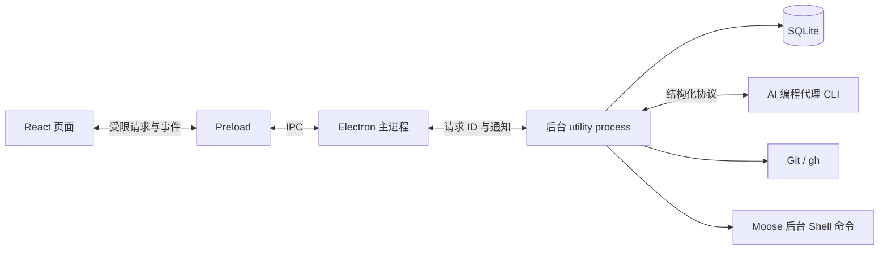

# Moose 项目面试指南

这份文档是 Moose 项目经历与面试准备的统一入口，已合并原项目经历材料。以 0.14.0 和当前 Web／OpenCode 开发增量为基础，核对日期为 2026 年 9 月 20 日。已发布能力、开发中能力和真实验证范围分别说明。

阅读顺序是：先能介绍项目，再能讲清一条任务怎么执行，最后挑几个自己最熟悉的难点展开。文中的第一人称回答供你练习，面试时按实际参与和理解程度讲，不必逐字背。

## 怎么用这份指南

如果面试准备时间有限，先读第 1、3、4、7 节，再从第 16 节选两个问题练习。它们足以串起项目定位、执行流程、并发控制和故障处理。面试偏前端，就多看第 6、14 节；偏 Electron 和客户端工程，就多看第 3、7、13、15 节。

完整目录：

1. [先把项目讲清楚](#1-先把项目讲清楚)
2. [哪些是自己做的，哪些来自底座](#2-哪些是自己做的哪些来自底座)
3. [为什么分成三类进程](#3-为什么分成三类进程)
4. [从按下发送到任务结束](#4-从按下发送到任务结束)
5. [不同代理如何接进同一套界面](#5-不同代理如何接进同一套界面)
6. [流式消息和 React 页面如何保持一致](#6-流式消息和-react-页面如何保持一致)
7. [排队、并行和重启恢复](#7-排队并行和重启恢复)
8. [Plan、Goal 和运行中插话](#8-plangoal-和运行中插话)
9. [原生历史与子代理](#9-原生历史与子代理)
10. [用 worktree 隔离代码修改](#10-用-worktree-隔离代码修改)
11. [Git 提交、PR 和原生代码审查](#11-git-提交pr-和原生代码审查)
12. [配置、MCP、插件与认证](#12-配置mcp插件与认证)
13. [后台命令与定时任务](#13-后台命令与定时任务)
14. [输入体验和安全边界](#14-输入体验和安全边界)
15. [怎么证明这些功能真的可用](#15-怎么证明这些功能真的可用)
16. [面试里值得展开的四个问题](#16-面试里值得展开的四个问题)
17. [容易被追问的技术取舍](#17-容易被追问的技术取舍)
18. [简历写法、演示和最后复习](#18-简历写法演示和最后复习)

## 1. 先把项目讲清楚

### 一分钟介绍

> Moose 是我独立开发的 AI 编程客户端，通过统一的桌面和 Web 界面接入不同的本机编程代理 CLI，支持代码修改、测试执行和改动审查。用户以项目为单位创建会话，下达开发任务，在执行过程中处理权限审批，完成后检查 diff 并提交代码。
>
> 项目主要解决多项目、多会话使用时的任务管理问题：不同 CLI 的交互协议不一致，执行状态分散在终端中，同一工作目录下的并发任务还可能互相影响。我负责客户端交互、CLI 协议适配、任务调度和持久化，模型推理与代理内部的工具调用由接入的 CLI 负责。
>
> 技术栈是 Electron、React、TypeScript 和 SQLite。实现重点包括统一不同 CLI 的执行事件、按工作目录调度任务，以及处理审批、取消和异常恢复；需要并行修改同一项目时，通过 Git worktree 隔离工作目录。

开场说明项目用途、个人职责和核心技术问题即可。协议接入可结合第 5 节展开；并发控制与故障恢复对应第 7、10、13 节。

### 对方让你展开时

> 从一次任务的执行流程看，用户提交需求后，Moose 先校验参数并将输入持久化到队列。调度器确认目标工作目录可用，再启动对应的 CLI，创建或恢复原生会话。
>
> CLI 通过结构化协议返回文本增量、工具执行状态和审批请求。适配器将这些消息转换成 Moose 的统一事件，后台保存执行记录，前端按事件更新会话时间线。这里需要分别处理请求响应与执行完成通知，不能将请求被接收直接视为任务完成。
>
> 并发控制以实际工作目录为单位。同一目录中的代理任务串行执行，不同目录可以并行；同一项目需要并行开发时，使用 Git worktree 创建独立工作目录。这能减少 Moose 管理的任务之间相互覆盖文件，但不能阻止外部编辑器或终端修改文件，因此提交前仍需重新校验仓库状态。
>
> 架构上，React 渲染进程负责交互，Electron 主进程负责窗口和系统能力，独立后台进程负责 CLI、数据库和调度。Web 入口复用业务服务，通过 HTTP 和 SSE 与前端通信。目前也支持桌面显式接入同一后台实例，客户端退出不再决定任务进程是否结束；共享启动入口会自动连接或启动后台；默认桌面入口切换与历史数据迁移仍在后续计划中。

### 项目的使用价值

Moose 面向同时使用多个项目和代理会话的开发场景。它将任务状态、权限审批、执行记录与 Git 改动关联到具体项目和会话，便于用户切换任务后继续跟踪进度、审查结果。

例如，同一项目中两个会话分别处理功能开发和缺陷修复时，客户端不仅需要展示回复，还需要决定任务能否并行、在哪个目录执行，以及何时允许合并。项目的工程重点因此集中在 CLI 接入、任务调度、状态持久化和代码改动检查。

目前没有可引用的用户规模、商业收入、提效比例或性能对照数据。面试时可以讲完成了什么、验证了什么，以及为什么这么设计，不需要给个人项目补一个没有依据的增长指标。

## 2. 哪些是自己做的，哪些来自底座

这里的“底座”，指负责推理、工具调用和原生会话管理的 AI 编程代理运行时，Moose 通过它们的 CLI 程序接口接入。Moose 负责这些运行时的接入和应用层管理，不实现模型推理循环；例如，工具调用由代理发起，审批展示与用户响应转发由 Moose 完成。

| 部分 | Moose 负责什么 | 底座或外部工具负责什么 |
| --- | --- | --- |
| 一轮代理任务 | 收集输入、排队、选择工作目录、显示和保存状态 | 模型推理、决定工具调用、执行代理工具 |
| 审批与提问 | 展示问题、校验请求仍有效、把选择送回去 | 提出审批或问题、解释选择并继续执行 |
| Plan 与 Goal | 提供入口，保存计划版本，组织批准执行 | 原生规划模式、目标状态和后续执行机制 |
| 子代理 | 接收活动、展示关系与历史、转接受支持的控制 | 决定是否委派、创建和运行子代理 |
| 原生历史 | 浏览、导入、记录来源及操作状态 | 提供原生会话、分叉和压缩接口 |
| Git 与 worktree | 展示目标和预览、验证状态、安排调用 | Git 修改索引、生成提交、创建和合并工作目录 |
| 配置与扩展 | 选择作用域、预览、版本检查、显示诊断 | CLI 写原生配置、管理插件及认证凭据 |
| 后台命令与调度 | 创建并管理命令进程、记录调度、领取周期 | 本机 Shell 执行用户命令；代理消息仍由底座处理 |

最后一行需要单独记住：0.11.0 的后台命令确实由 Moose 启动和管理。因此不能再笼统地说“所有命令都由底座执行”。用户在命令面板里启动的进程，和 Codex 工具内部创建的进程，是两套不同的生命周期。

项目最初是本地桌面应用，现在也有本机 Web 入口。代码目录、聊天数据和调度记录保存在本机，模型请求仍可能通过 CLI 发往服务商。本地存储不等于离线推理，也不等于代理读取的内容永远不出电脑。

### 先分清几个对象

| 对象 | 它表示什么 | 为什么需要单独区分 |
| --- | --- | --- |
| 项目 `Project` | 加入 Moose 的本地目录 | 确定归属和默认工作位置 |
| 会话 `Session` | 项目下面的一段对话 | 固定底座，保存模型、权限、草稿等选择 |
| 原生会话标识 `nativeId` | CLI 侧的 thread、session 或 sessionFile | 继续已有上下文，不把每次发送都当成新对话 |
| 执行 `runId` | Moose 中一次输入所对应的执行 | 一轮可能产生很多段回答、工具和审批记录 |
| 消息 `Message` | 时间线里的一条可更新记录 | 用 `seq` 判断版本，用 `position` 排序和分页 |
| 队列项 `QueueItem` | 已保存但尚未开始执行的输入 | 可以编辑、移除或等待目录空闲 |
| 工作目录 `Worktree` | 为隔离任务创建的 Git checkout | 同项目的两段会话可以操作不同文件副本 |

一个 Moose 会话固定一个底座。不能把 Codex 的原生上下文直接迁移给 Grok 或 Pi。即使都是聊天界面，背后的状态格式和恢复方式也不同。

## 3. 为什么分成三类进程

窗口交互、系统集成与任务执行具有不同的运行负载。Moose 将数据库操作、Git 调用和 CLI 连接放在独立后台进程，减少这些操作对窗口响应的直接影响，并明确各进程的职责。

Moose 的划分是：



React 负责页面状态和交互。主进程负责窗口、菜单、文件选择、剪贴板和打开系统浏览器。后台 `utilityProcess` 负责服务调度、数据库、代理连接以及后台命令。Preload 是页面调用主进程的桥接脚本，不是第四个独立业务进程。

同步数据库操作在后台进程执行，不直接阻塞 Electron 主进程的事件循环。窗口关闭后，任务能否继续取决于后台进程是否仍在运行；窗口重建时通过快照和消息记录恢复界面。默认桌面模式退出应用会停止任务，显式共享模式则由独立服务继续运行。

进程拆分引入了请求关联、超时处理和退出通知等通信成本。Moose 用请求 ID 关联返回值，用事件持续推送进度。后台异常退出时，会拒绝还在等待的请求并通知页面，避免按钮一直转圈。

### TypeScript 和 Zod 为什么都需要

TypeScript 让开发时的方法名、参数和返回类型对应起来。例如请求 `scheduleUpdate` 时，必须传任务 ID、版本和允许修改的字段。

IPC 接收端使用 Zod 进行运行时校验，检查 UUID、枚举、字符串长度及未知字段。TypeScript 类型在运行时被擦除，不能替代这些检查。主进程还会检查请求是不是来自可信窗口的主 frame。类型约束、输入校验和来源检查各管一层。

页面不开 Node 集成，开启 `contextIsolation` 和 renderer sandbox。它通过 `window.moose.request`、`subscribe` 使用限定好的能力，不直接操作文件系统和进程。

需要注意，隔离到后台不等于后台永不阻塞。同步数据库操作仍会占用那个进程的事件循环，文件遍历和大输出仍需要限制规模。

代码入口：[主进程](../../electron/main.ts)、[桥接](../../electron/preload.ts)、[后台宿主](../../electron/runtime-host.ts)、[请求类型](../../shared/types.ts)、[参数校验](../../shared/validation.ts)。

### Web 入口与桌面入口怎样共用

前端通过 `request / subscribe` 接口调用业务。桌面版由 preload 转成 IPC；浏览器版用 HTTP 请求和 SSE 事件，后端仍复用同一个 `MooseService` 实现。目录选择、剪贴板、附件和打开编辑器等宿主能力分别处理，不能把服务器路径当成浏览器所在电脑的路径。

当前 Web 后台需要单独启动，只监听本机回环地址，使用独立数据目录。桌面默认仍运行自己的后台；设置连接文件后，可以接入这个 Web 后台。访问链接携带一次启动有效的令牌，换取 HttpOnly 会话 cookie 后清除地址中的令牌。服务校验 Host、Origin 和业务参数；客户端断开不触发服务关闭。

浏览器重连时重新读取快照与消息，消息按 ID 和版本合并；写请求不会自动重试，因为响应丢失不代表命令没执行。终端输出通过 IPC／SSE 推送，初次打开和重连按输出游标补读。补读与实时输出可能重叠，因此按游标去重；客户端渲染繁忙时合并为一次补读，不逐块积压。缓冲有上限，超出保留范围会明确提示截断。高延迟输入优化、完整业务事件游标和多设备终端控制权仍是后续工作，不能说已经实现无缝远程协作。

现在增加了显式共享模式：先启动 Web 后台，再让桌面读取它生成的私有连接文件。此时两端操作同一份会话和同一组 CLI 进程，退出桌面只断开连接，不关闭后台。当前不自动迁移已有桌面数据，也未实现后台自动启动和系统服务安装。显式共享连接用于先验证任务进程所有权和多客户端状态同步，再逐步完善默认启动流程。

## 4. 从按下发送到任务结束

用一个具体需求串起来：“修复登录按钮，并补一个测试。”

**第一步，界面收集本次输入。** 除了文字，还可能有附件、`@` 文件引用、技能和任务模式。新建会话时先显示一个未保存的输入页，首次发送才创建实际会话；已有会话则使用原来的会话 ID。

**第二步，后台检查并保存。** Service 检查会话是否归档、底座是否启用、参数是否合法，并解析附件。正常发送先写入 SQLite 队列。这个动作表示“需求已经被 Moose 接收”，还不表示底座已经开始执行。

**第三步，调度器选择能开始的任务。** 它检查会话是否暂停、实际工作目录是否被占用，以及是否有互斥操作。如果目录空闲，就准备对应的 CLI；异步准备结束后还要再检查一次，防止用户已经取消队列或应用开始退出。

**第四步，记录执行开始。** 数据库用一个事务完成出队、写入本轮用户消息、把会话标成运行中。Moose 分配 `runId`，登记目录占用，再调用适配器。

**第五步，底座处理需求。** 适配器启动 CLI，创建或恢复原生会话，传入当前目录、输入和执行设置。底座返回文字增量、工具活动、审批或提问，适配器将它们转换成统一事件。

**第六步，结果持续落库并显示。** Service 合并同一事件的更新，保存变化，通知页面。用户回答审批时，答案沿原请求返回；它不会变成一条无关联的新聊天消息。

**第七步，收尾。** 完成、失败或取消后，后台保存最终状态，让未处理的审批失效，关闭本轮适配器，释放目录。能继续执行的队列再由调度器处理；失败、停止、Plan 结束等情况会保留相应暂停规则。

这条流程里有两类返回。`send` 的返回只确认队列已经保存；任务过程和最终状态通过后续事件更新。如果把它们当成同一次短请求，就很难处理几十秒甚至更长的执行。

代码入口：[Service 的 send、drain、execute](../../electron/service.ts)、[Store 的 enqueue、begin](../../electron/db/store.ts)。

## 5. 不同代理如何接进同一套界面

### 共用界面，分别处理协议

不同 CLI 的启动方式、消息格式和完成信号各有差异。Moose 为每类协议提供适配器，让它们各自理解原协议，向上输出统一的 `AgentEvent`。

| 底座 | 通信入口 | 会话延续 | 一轮完成依据 |
| --- | --- | --- | --- |
| Codex | `codex app-server`，stdio JSON-RPC | 创建或恢复 thread，再启动 turn | 对应线程的 `turn/completed`；Goal 还要检查目标状态 |
| Grok Build | ACP SDK，经 stdio 连接 | 根据能力使用 `newSession` 或 `loadSession` | `prompt` 调用返回 |
| Pi | `pi --mode rpc`，按行传输 JSON | 保存 `sessionFile`，后续用它恢复 | `agent_settled`，不能只看到 `agent_end` 就结束 |
| OpenCode v2 | `opencode acp`，stdio ACP | `session/new` 或 `session/load` | `session/prompt` 返回，调用受理不是任务完成 |

stdio 指程序的标准输入输出。这里传的是程序接口的数据，并不是自动向终端窗口敲字。JSON-RPC 的请求有 ID，用来找到对应的回复；通知则用于报告持续发生的进度。

统一事件描述“这是一段回答”“这是工具输出”“这里需要审批”，不要求页面理解每个底座的原始字段。新增 Pi 时，共用了按行传输、请求关联和进程清理，但为 Pi 单独实现消息格式转换；不能因为都传 JSON，就把 Pi RPC 当成 Codex 的 JSON-RPC。

### 为什么不把各个执行循环写成一个大函数

适配层统一输入、增量事件、审批响应和取消接口；原生协议的完成条件与恢复行为仍由各适配器分别处理：Grok 恢复会话可能回放历史，Pi 的一次结束事件之后可能继续重试或压缩，Codex 又有 thread、turn 和子线程的区分。

如果把这些差异都塞进公共循环，最后通常会出现大量“如果是 Codex”“如果是 Pi”的分支。当前代码将这些规则留在适配器中，公共 Service 只负责调度和数据。原生历史另有 `NativeSessions` 接口，Git、配置、后台命令也分别有自己的模块。

### 能力相同，不能只看按钮名字

| 能力 | Codex | Grok Build | Pi | OpenCode v2 |
| --- | --- | --- | --- | --- |
| 普通对话与原生会话恢复 | 已接入 | 已接入 | 已接入 | 已接入 |
| 权限选项 | 请求批准、原生自动审核、完全访问 | 请求批准、完全访问 | 仅完全访问，无内置审批沙箱 | 请求审批，遵循 CLI 权限策略 |
| Plan 审阅后执行 | 已接入原生模式 | Moose 未接通此流程 | 未接入 | 未接入 |
| Goal | 原生目标接口 | ACP 转交原生 `/goal` 命令 | 未接入 | 未接入 |
| 当前回合插话 | 原生 `turn/steer` | 原生 `_x.ai/interject` | 保持普通队列 | 保持普通队列 |
| 子代理 | 活动与独立历史面板，控制受能力限制 | 工具活动展示 | 未接入专门管理 | 未接入专门管理 |
| 原生历史导入 | 支持 | 支持回放导入 | 未接入浏览导入入口 | 未接入浏览导入入口 |
| 显式分叉、手动压缩、原生审查 | 已接入 | 未接入 | 未接入 | 未接入 |
| 配置、MCP、插件管理 | 已接入首批功能 | 使用原 CLI | 使用原 CLI | 使用原 CLI |

这张表描述 Moose 当前已接入的范围（截至 0.15.0），不是对各个底座全部能力的判断。入口会结合底座返回的能力和已验证接口决定是否开放；服务端也检查条件，不能只靠隐藏按钮。
### 审批按钮怎么找到原来的请求

审批关联着具体执行、具体消息和底座请求 ID。用户点击后，Service 会重新确认这轮还在运行、没有取消、消息仍等待处理；适配器再检查选项，把结果按原协议回复。旧回合已经结束时，即使页面还来不及收起按钮，这次点击也不能批准下一轮任务。

审批和提问也要分开。审批是在问“是否允许执行这个操作”，提问是在补充需求，比如“修改移动端还是桌面端”。提问的答案按原问题 ID 返回，不能当成普通聊天消息塞进下一轮。Pi 扩展也可能提出确认问题，但这不意味着 Pi 的所有工具执行都有审批保护。

代码入口：[适配器接口](../../electron/providers/types.ts)、[注册入口](../../electron/providers/registry.ts)、[Codex](../../electron/providers/codex.ts)、[Grok](../../electron/providers/grok.ts)、[Pi](../../electron/providers/pi.ts)。

### 新增一家 CLI，怎样避免越写越乱

对外介绍可以说“可扩展的 AI 编程代理工作台”。这里的“代理”与“模型”不同：模型生成结果，代理还负责工具执行、权限和会话状态。Moose 负责 CLI 接入、任务调度、执行记录与用户交互；代理运行时负责根据任务决定工具调用并执行。

当前 OpenCode 接入以 v2 官方 ACP 文档为依据，执行 `opencode acp`。它通过 stdin/stdout 收发标准 ACP 消息，并由 CLI 为该进程启动私有服务。Moose 先检查 v2 版本，再读取握手能力和会话配置选项，处理模型选择、文本／思考／工具事件、审批、取消与恢复原会话。恢复时先抑制历史回放，再接收新一轮输出，避免旧回答重复显示。

本机 v2.0.10 已验证真实握手和模型列表；执行与审批使用测试 CLI 验证，不把它写成真实模型生成验收。当前不宣称 OpenCode 已接入原生 Plan、Goal、历史列表、额度查询或配置管理，Moose 只开放请求审批档位，实际工具权限仍由 CLI 的配置策略决定。

新增适配器需登记元数据、构造器、配置和翻译，并补协议测试；共用的 ACP 文本／工具事件转换放在 `acp-events.ts`，底座专有控制留在各自适配器。这样不用把每家的条件判断塞进 Service。

## 6. 流式消息和 React 页面如何保持一致

### 一轮回复为什么拆成多条记录

一次执行可能先解释问题，再运行命令，中间请求批准，最后总结结果。如果只保存一个不断增长的答案字符串，就很难单独更新工具状态，也难以回答“这个批准按钮属于哪次操作”。

Moose 用 `runId` 把这些记录归为同一轮，再用底座事件 key 区分其中的条目。同一条目可以从运行中变成完成，也可以逐步追加文字。复制 AI 回复时，再按本轮组合对应正文。

### 增量和最终结果怎么合并

假设底座先后发来“已找到”“登录问题”，最后又发来完整文本“已找到登录问题”。前两条应当追加，最后一条应当替换。如果都当增量处理，用户就会看见重复回答。

因此 Service 对 `delta` 做追加，对完整 `text` 做覆盖。同一记录每次更新递增 `seq`，数据库和页面只接受更新的版本。这个序号保护的是 Moose 消息的新旧顺序；如果上游无标识地重复发送同一段增量，不能宣称它一定能自动识别。

### 为什么约 80 毫秒刷新一次

模型输出可能很碎。如果几个字就写一次 SQLite、发一次跨进程消息，页面和后台会做很多重复工作。Moose 先在内存合并变化，把记录标为待刷新，再约每 80 毫秒批量保存和推送。审批等待等关键状态及时刷新，不让操作卡片等到一轮结束才出现。

代价是突然崩溃时，最后一小段尚未落盘的增量可能丢失。这里做的是减少刷新开销与控制数据损失窗口之间的取舍，不能说每个刚收到的字符都已经持久化。

### 会话切换时，迟到结果怎么办

用户从 A 切到 B 后，A 的历史查询可能才返回。前端用请求代次识别这种情况：切换或重置会话时推进代次，只应用仍属于当前请求的结果。实时事件也按会话 ID 过滤。

在 React 中，代次放在 `useRef`，因为它需要跨渲染保存，却不需要驱动页面变化。真正要显示的消息放在 state。订阅在 effect 中建立，清理时取消订阅和定时器。异步更新消息时使用函数式 state 更新，避免用旧闭包里的数组覆盖新收到的内容。

### 长会话怎么处理

历史使用 `position` 游标分页，每页显示 80 条，多取一条判断还有没有更早内容。页面按 ID 和 `seq` 合并新消息，消息行用 `memo` 减少无变化行的重复渲染。滚动组件负责跟随输出、保持阅读位置和回到最新，条目还使用浏览器的 `content-visibility` 降低离屏内容的渲染负担。

这不是只保留可见行的严格虚拟列表。用户持续加载更早历史，内存和 DOM 仍可能增长。一万条历史的自动化测试验证了分页、持久化和交互行为，没有证明一万条同时渲染仍保持固定帧率，也没有测出“性能提升了多少”。

代码入口：[事件合并与 flush](../../electron/service.ts)、[前端数据 Hook](../../src/lib/workspace.ts)、[时间线](../../src/components/transcript.tsx)、[滚动组件](../../src/components/ui/message-scroller.tsx)。

## 7. 排队、并行和重启恢复

### 为什么按实际目录控制并发

同一个项目里开两段聊天，并不意味着它们操作不同文件。一个任务改登录，一个任务改导航，仍可能同时改 `App.tsx`。

Moose 用实际工作目录作为调度单位。同一目录中的会话执行串行，不同目录可以并行。引入 worktree 后，两段会话虽然属于同一项目，但目录不同，因而能分别运行。目录会做规范化和归属检查，避免同一个路径因符号链接或别名被误认为不同位置。底座在一轮任务内部怎样安排子代理，仍由底座控制，不受这张会话调度表直接管理。

这个规则还覆盖 Moose 自己的 Git 写入、原生历史变更和后台命令。它们与代理执行共用目录互斥约束，避免不同入口各自认为目录空闲。配置写入影响范围更大，另有全局互斥，后面会讲。

这里不是跨应用文件锁。外部编辑器、终端和其他客户端仍然能修改文件；也不能把“相同规范化目录互斥”扩大成检测所有父子目录或重叠仓库。

### 为什么有了 JavaScript 单线程，还要防竞争

异步函数在 `await` 时会让出执行。调度器开始查 CLI 路径时，用户可能取消了消息；查找结束后，如果直接沿用之前读到的队列和会话，就会执行一个已经失效的需求。

Moose 一方面避免调度循环重复进入，另一方面在异步准备之后重新查队列、目录占用和退出状态。单线程只说明同一时刻没有两段 JavaScript 同时执行，不代表跨越异步等待的业务判断始终成立。

### 队列为什么先写数据库

用户发出“接着补测试”后，如果它只存在内存里，进程退出就丢了。SQLite 队列保存文字、附件和本次选择的任务上下文。真正开始时，通过事务一起完成出队、保存用户消息和更新会话状态。

这个事务只覆盖数据库。它不能把后续 CLI 请求和文件修改一起变成原子操作。如果恰好在出队后、发给底座前崩溃，重启需要把这轮视为中断，而不是假装数据库事务能保证外部执行必达。

队列也不是所有设置的完整快照。文件引用、技能和模式随输入保存，模型和权限等仍取执行时的会话配置。面试被问到“排队后改模型有没有作用”时，需要按这个边界回答。

### 重启能恢复到哪一步

数据库保存历史、草稿、队列和原生会话 ID。启动时，未完成的执行和审批变成中断或失效，旧队列先暂停，等待用户明确恢复。这里恢复的是记录和继续处理的入口，不是被杀死进程的内存，也不是撤回它已写入的文件。

普通队列与定时任务还要区分：普通旧队列不自动恢复；仍启用、尚未领取的定时周期按调度规则可能补跑一次。已经领取但结果不明的周期会暂停核对，第 13 节再展开。

SQLite 开启 WAL 和外键约束，当前 schema 是 5。升级通过迁移和事务完成。历史、关系和有排序要求的数据用专门的表；扩展操作、后台命令和调度记录放在 settings 表中按命名空间保存 JSON。后者实现简单，也方便和现有队列共用事务，但记录量继续增长时，专表和索引会更合适。

### 为什么要有“结果未知”

设想 Moose 已经向底座发送一个会产生副作用的请求，但回复回来前连接断了。此时只能知道“没收到确认”，不能知道“对方没执行”。自动重试可能重复提交、重复创建任务或再次消耗额度。

因此，插话、原生历史变更、提交、扩展管理等操作会保留请求 ID 或意图指纹。同一请求不盲目重放，明确拒绝和未知结果分开处理。版本用于判断“当前对象还是不是用户看到的版本”，请求 ID 用于判断“这次操作是不是已经提交过”，两者解决不同问题。

这套设计减少自动重复，但不等于外部副作用严格执行一次。SQLite 与 CLI、Git、远端服务之间没有统一事务，未知状态就是对这个事实的明确表达。

代码入口：[目录调度](../../electron/service.ts)、[数据库与迁移](../../electron/db/store.ts)、[迁移版本](../../electron/db/migrations.ts)、[原生操作记录](../../electron/native-history.ts)、[插话记录](../../electron/steering.ts)。

## 8. Plan、Goal 和运行中插话

这三个功能解决不同的问题：Plan 让用户先审方案，Goal 让底座围绕目标继续推进，插话让用户在当前回合尚未结束时补充要求。

### Plan：审阅的是哪一版计划

0.11.0 的 Codex Plan 已调用原生 `collaborationMode: plan`。这和旧稿里“只靠规划提示词”的做法不同。Moose 同时保留只读 sandbox 和禁止提权的约束；即使会话原来选了完全访问，规划这轮也不会沿用它。

底座生成计划后，Moose 保存正文和版本。用户修改计划，版本就增加。批准时，后台检查计划是否完成、是否还是最新计划、版本是否一致、是否已经批准，以及会话里有没有其他排队消息。

检查通过后，“记录批准所对应的队列项”和“将批准正文入队”放在同一个事务里。执行切回原生 default 模式，使用同一原生会话，并恢复会话选择的执行权限。计划阶段结束后不会顺手执行队列里的下一条需求。

例如，用户看到版本 2，另一处已经改成版本 3，旧批准按钮就必须失败。单纯把按钮置灰防不了旧请求或重复请求；最终约束需要放在后台和数据库里。

### Goal：谁在继续安排下一轮

Codex Goal 调用 `thread/goal/set`、`get`，设置目标及可选 token 预算。Moose 先让输入进入原生任务，再按目标状态进入底座的继续执行机制；遇到完成、阻塞、预算或额度限制等终态后结束等待。

Grok 则通过 ACP 发送底座自己的 `/goal` 命令。Moose 没有在外面自己写一个“回答完就自动再问一次”的循环，也不能把 Codex 的预算和状态语义直接套给 Grok。Pi 没有接入 Goal。

### 插话：和下一条排队消息有什么不同

普通发送表示“当前任务结束后再处理”。插话表示“把这条补充送给正在运行的当前回合”。Moose 对 Codex 调用 `turn/steer`，带上 `expectedTurnId`，明确指定本次输入属于哪一轮。Grok 使用 ACP 扩展 `_x.ai/interject`，将补充输入交给当前会话，在安全执行边界处理；`queued` 只代表底座已接收，不代表模型已采用。两者都不会由 Moose 自动取消当前任务。普通队列由 Moose 持久化和调度，不依赖底座自己的排队机制。

它不会强行暂停在某一行代码，也不承诺刚执行的操作能撤回。底座接收新输入后按自己的执行机制处理。插话不能悄悄改变本轮模型、权限或任务模式。

Moose 先记录投递，再调用底座。收到确认后标记接收成功；底座明确说回合已结束时，保留用户输入；断连或超时则标为未知，不自动改成新任务再次发送。这是在保护用户的原始意图，而不只是实现一个“立即发送”按钮。

代码入口：[计划版本与批准](../../electron/plans.ts)、[投递状态](../../electron/steering.ts)、[Codex 原生调用](../../electron/providers/codex.ts)、[Grok Goal](../../electron/providers/grok.ts)。

## 9. 原生历史与子代理

### 为什么还要读取 CLI 的历史

用户可能先在终端里工作，后来才打开 Moose。Moose 自己的数据库里没有那段对话，但底座已经保存了原生会话。因此新增了浏览、预览和导入入口。

导入会核对底座会话的工作目录，保存来源，并识别重复导入。历史按底座接口读取，分页过程中检查游标是否前进，还有限制总条目和文本大小，避免异常接口让导入无限循环或占满内存。

导入不表示搬走官方历史，也不是在两个客户端之间持续双向同步。它把可读取的记录呈现在 Moose 中，并关联原生 ID，供后续继续会话。

### 编辑、分叉、压缩分别改变什么

| 操作 | 解决什么问题 | 不会自动发生什么 |
| --- | --- | --- |
| 编辑最新用户消息 | 修正刚才的需求，在 Moose 原会话中替换最后一轮并重新执行 | 不撤销上一轮已修改的文件 |
| 显式原生分叉 | 从指定历史节点另开一段对话，保留来源关系 | 不创建独立代码目录 |
| 手动压缩 | 请底座整理上下文，为继续对话控制上下文规模 | 不等于删除 Moose 聊天记录或自行截掉提示词 |

Codex 具备这些已接入的原生接口。其他底座能力不够时，需要保留限制；用可见文字重建上下文，也不能宣称完整复制了底座内部状态。

### 子代理是不是 Moose 自己派出来的

默认由底座根据任务和原生配置决定是否委派。Moose 没有要求用户每次先打开一个开关，也不会为了展示“多代理”强制拆任务。

Moose 的工作是识别委派活动、展示任务与结果，并且正确区分主线程和子线程。例如子线程发来完成通知，只能更新这个子任务，不能把父任务结束。已识别子线程的审批继续通过主任务关联的审批流程处理，独立历史面板不能随意取得所有审批的控制权。

Codex 提供结构化子线程信息，Moose 可以显示父子关系、历史和受支持的发送／停止操作。Grok 当前主要通过 ACP 工具活动展示委派，不假造一套同样完整的子线程树。底座确认收到控制请求，也不代表子任务已经做完。

另外，`thread/resume` 的含义是加载会话，不等于让一个已关闭的子代理重新开始工作。当前恢复已关闭子任务仍需主代理执行。

### 为什么有时看不到“思考”

Moose 已订阅底座提供的相关事件，Codex 还显式请求 `summary: auto`。有文本就显示，没有文本就隐藏空记录。已有一次最小探测中，回答正常但上游没有发来摘要事件；这只能说明那一次没有摘要，不能推断所有模型都支持或都不支持。

面试里更准确的表述是“展示底座提供的思考摘要或 thought 内容”。客户端不能通过增加一个组件，取得协议本来没有提供的模型内部推理。

代码入口：[历史协调](../../electron/native-history.ts)、[Codex 原生会话](../../electron/providers/codex-sessions.ts)、[Grok 原生会话](../../electron/providers/grok-sessions.ts)、[子代理事件转换](../../electron/providers/codex-subagents.ts)。

## 10. 用 worktree 隔离代码修改

会话分叉隔离的是对话上下文。要让两个任务同时写代码，还需要隔离文件。Git worktree 给同一仓库提供多个工作目录，每个目录检出自己的分支，避免两个任务直接写同一份工作区文件。

Moose 从用户指定的 ref 创建分支和受管 worktree，再创建一个空白会话绑定它。原会话的目录和原生 ID 保持原样，不把旧对话悄悄搬进新目录。未提交文件、依赖和聊天历史也不会自动复制过去。

```text
项目 shop
├─ 会话 A → 项目根目录       → 当前分支
├─ 会话 B → worktree/login   → 登录修复分支
└─ 会话 C → worktree/search  → 搜索改进分支
```

这时 B 和 C 可以并行。B 的文件引用、项目技能、代理执行、后台命令、Git diff 和“打开编辑器”都必须使用 B 的实际目录。只给 CLI 设置 `cwd`，其他入口仍指向项目根目录，会出现“改的是一份代码，看的是另一份代码”的错误。

### 合并为什么还要分两步

准备合并前，用户先确认来源提交、目标分支和两边 diff。目标是项目根目录当前检出的分支。Moose 检查这些状态没有漂移，再执行准备合并。

即使没有冲突，也先停在可检查的暂存结果，用户确认后才提交。有冲突时，在目标目录编辑文件、逐个标记解决并暂存，再完成合并；也可以中止。合并涉及的两个目录暂停新的写入任务，其他 worktree 可以继续工作。

Git 的合并状态与 Moose 的记录需要一起核对。重启后保留冲突现场，允许继续或中止；不能仅凭数据库写着“合并中”，就盲目再运行一次 merge。

### 为什么清理这么谨慎

受管目录里可能有用户手工改的文件，也可能有尚未合并的提交。清理前会检查活动任务、排队任务、未提交内容、未跟踪及忽略文件、未合并提交。用户选择保留后，也不能自动清理。

因此，`node_modules` 这类忽略目录也可能阻止清理。代价是需要用户先处理一些文件，但能避免顺手删掉未检查的数据。清理保留分支和聊天记录；旧会话也不会因为目录不见了而自动退回项目根目录继续写。

这部分使用真实临时 Git 仓库测试创建、冲突、继续、中止和清理。目录隔离并不隔离所有东西：端口、外部数据库、远端资源和仓库共享配置仍可能冲突。

代码入口：[worktree 管理](../../electron/worktrees.ts)、[目录归属](../../electron/db/store.ts)、[真实 Git 验收](../providers/phase-three-testing.md)。

## 11. Git 提交、PR 和原生代码审查

### 用户确认的内容和实际提交的内容要一致

Moose 的改动面板区分已暂存、未暂存和未跟踪文件。同一文件可能同时有前两种状态，暂存以文件为单位，不是逐段选择。面板反映整个工作区的当前修改，包含代理运行前已有的内容，不能把每一行都标成“本轮 AI 生成”。

提交前会展示完整暂存文件列表和 diff，并记录当前分支、HEAD 和暂存区指纹。指纹可以理解为这份暂存内容的摘要。用户点击提交时，后台再次检查：如果预览后又暂存了别的文件，就要求重新预览。

Git hooks 和签名配置仍保留。即使提交前检查通过，hook 或外部程序也可能改变内容，所以提交后还要核对实际生成的树。如果内容变了，要明确告诉用户哪个 commit 已经生成，让用户检查，不能伪装成完全符合预览，也不能擅自回滚它。

命令通过参数数组调用，路径按字面意义处理。读取 diff 时关闭外部 diff 和 textconv，减少仓库配置及特殊文件名对预览的干扰。普通提交也不会绕过一个尚未结束的 merge、rebase 或 cherry-pick。

### 创建 PR 的边界

当前通过本机 `gh` 创建 GitHub 草稿 PR。需要明确 origin、源分支、已推送的 HEAD 和目标分支；预览会 fetch 所选 base，以本地 Git 对象生成差异，创建前再次校验。

它不会自动推送本地分支，首批也不支持跨 fork、企业版 GitHub 或其他托管平台。已有相同目标的 OPEN PR 会返回原链接。同一请求 ID 不重复创建，连接异常时保留未知状态供核对。

### 原生审查为什么另开线程

用户执行任务的会话已有上下文和权限。直接拿它去做审查，容易混淆“正在修改代码”和“只读检查代码”的状态。

Moose 为 Codex 原生审查另建只读线程，调用 `review/start`，目标可以是未提交改动、相对某分支的差异或指定 commit。审查结果、状态和停止入口独立保存，不挤进原执行会话。文件路径和行号使用底座返回的内容，不虚构结构化定位。

审查仍会消耗模型额度，也可能漏报或误报。它不能代替测试，更不能把“调用原生 review 接口”说成 Moose 自己开发了一套静态分析器。

代码入口：[Git 操作](../../electron/git-actions.ts)、[审查管理](../../electron/review-workbench.ts)、[PR 操作](../../electron/pull-requests.ts)、[Git 与审查验收](../providers/phase-four-testing.md)。

## 12. 配置、MCP、插件与认证

### 先区分这几类扩展

Skill 更接近交给代理阅读的操作说明；MCP 让代理连接额外工具或资源；插件是底座管理的一组扩展能力；hook 则是在特定事件发生时触发处理。它们可能有关联，但不是同一种配置文件。

Moose 0.11.0 先接入 Codex 管理接口。用户可以看配置来源、修改用户级默认模型、切换 MCP／插件、安装卸载插件、注册 MCP 和发起 OAuth。Hooks 先做只读诊断。Grok 和 Pi 继续使用各自 CLI 管理，不能把 Codex 的插件格式直接拿过去用。

### 为什么先读“来源”，再允许修改

一个有效值可能来自用户配置、项目配置、profile 或受管理的设置。用户改了文件却没生效，常常是另一个来源优先级更高。

Moose 先显示来源，只允许写底座确认可写的用户配置层。写入前重新读取版本，再传 `expectedVersion`，防止覆盖外部修改。保存后建立新的读取连接，检查实际生效结果；如果被其他层覆盖，就给出诊断。

插件安装卸载调用已验证的 CLI 命令，配置开关走配置写入接口。没有因为协议类型中出现了某个字段，就假定它是可以稳定使用的生产能力。

### 为什么配置写入用全局互斥

普通目录锁保护某个 checkout。用户级底座配置可能影响多个项目，不能只锁当前目录，否则其他任务可能在配置改到一半时启动。

所以 Moose 在有活动任务或目录操作时拒绝这类写入；写入期间暂停新队列启动。调度器从异步路径查询返回后，还要再检查一次配置锁。操作结束释放锁，再继续调度。

这个取舍比较保守，用户需要等任务结束后改配置，但运行中的行为更容易解释。它只约束 Moose，不能拦住用户从外部终端直接编辑配置。

### 注册一个 MCP 为什么默认不启用

注册配置和运行服务器是两件事。尤其 STDIO MCP 可能启动一个本地程序，如果点击保存就立即启动，用户很难单独核对“我要保存什么”和“我要开始运行什么”。

Moose 新建 HTTP 或 STDIO MCP 时先预览，再以禁用状态写入，之后单独启用。同名项即使藏在未生效配置层也不会直接覆盖。STDIO 的命令和参数按字段处理，不拼成一段额外 Shell 文本；环境变量填写名称，不在表单里保存其密钥值。

### OAuth 和敏感信息怎么处理

认证由底座发起，Moose 把检查过的授权 URL 交给系统浏览器，等待底座报告完成。URL 不进入聊天或数据库；取消和超时会关闭本次连接，但不能声称撤销已经由服务端颁发的凭据。

配置读取返回白名单中的展示字段，不把整个原始配置、命令、headers 或环境变量值扔给页面。配置诊断也避免直接透传可能含凭据的原始报错。操作回执保存意图指纹，不重复存一份新 MCP 的完整配置正文。

这里说的是配置管理链路。代理回复和用户命令输出仍会作为正常历史保存；如果它们自己打印敏感内容，不能宣传应用已经做到全局自动脱敏。

代码入口：[配置操作协调](../../electron/extensions.ts)、[Codex 配置适配](../../electron/providers/codex-extensions.ts)、[插件 CLI](../../electron/providers/codex-plugins.ts)、[MCP 输入约束](../../shared/mcp-registration.ts)。

## 13. 后台命令与定时任务

### 文本命令面板做到了哪一步

用户可以在会话实际目录中运行 Shell 命令，查看 stdout／stderr，向标准输入发送一行文字，发送 EOF 或停止进程。例如运行 `read line; printf '%s' "$line"` 后，界面里的输入会写进这个命令的 stdin。

命令面板适合一次性命令。此外，0.12.0 起增加了 node-pty 与 xterm.js 组成的交互终端，支持 vim 等终端程序，后续支持弹窗、底部和右侧布局。两种进程分别接收输入、记录退出结果和处理停止请求；Moose 不会直接接管底座已经创建的工具进程。

命令输出有上限，只保留最近约 128K 字符，每个项目保留最近 100 条命令的输出；较旧的请求记录仍保留，避免重试又执行一次。标准输入不单独记录，不过命令自己可能把输入回显到输出。

### 关窗口、退出、崩溃是三种情况

关闭窗口时，后台仍在，命令可以继续。正常退出应用时，会停止命令进程组，保存中断状态。后台运行进程被突然杀掉时，专用父进程管道关闭，监视逻辑据此清理它拥有的命令进程组。

重启后不会读取一个旧 PID 然后盲目杀进程，因为那个 PID 可能已经属于别的程序。旧运行记录没有可靠结果时标记未知，也不会自动重跑命令。对于主动脱离原进程组的守护程序，当前实现没有完整生命周期保证。

### 定时器只是入口，真正重要的是持久化

调度记录保存任务内容、绝对时间、时区、固定间隔、启用状态和最后一次执行信息。定时器周期性检查是否到期；具体要不要运行，还要看目录是否忙、上一轮是否仍在排队或运行。

到期后先领取本次周期，再触发副作用。代理消息的“记录本轮已领取”和“消息入队”放进同一个 SQLite 事务；命令则先保存领取记录，再启动进程。定时代理消息进入现有队列，沿用绑定会话执行时的底座、模型和权限，以普通 Build 模式运行。

### 休眠后错过十次，要执行十次吗

当前规则是最多合并补跑一次，然后把下次时间推进到未来周期。例如每分钟一次，电脑休眠十分钟，恢复后不会瞬间创建十个任务。上一轮没有结束时，也不会重叠启动下一轮。

保存的是绝对时间和固定经过时长。时区用于输入和展示，这不是每天当地时间九点的日历 cron。夏令时变化不会把一个固定 24 小时间隔自动变成每天固定钟点。

应用退出后没有后台系统服务替它运行；重开应用时才按规则核对。窗口关闭继续执行、应用退出后不执行，这两句话需要同时讲清。

### 编辑和恢复有哪些限制

任务先暂停，才能编辑名称、类型、正文、下次时间和间隔。预览后保存仍保持暂停，用户再单独恢复。后台检查版本，运行中或排队中的已领取任务不能被编辑成另一份内容；已经触发过的单次任务也不能靠恢复按钮再跑一次。

重启时先核对事实。如果命令记录已经完成，只是调度记录还没更新，就恢复正确终态；如果代理消息仍在持久化队列里，就保留排队关系并暂停后续触发，交给原会话恢复或移除。真正无法确认结果时才标记未知。

创建请求的指纹还必须与后来的编辑分开。否则，用户编辑过名称后，重试最初那次创建请求就可能被误认为另一个操作。当前保留原始创建意图，重试只返回已有任务，不覆盖新内容，也不解除暂停。

代码入口：[命令生命周期](../../electron/command-jobs.ts)、[调度器](../../electron/schedules.ts)、[后台记录](../../electron/background-store.ts)、[定时任务编辑](../../src/components/schedule-form.tsx)、[验收说明](../providers/phase-six-testing.md)。

## 14. 输入体验和安全边界

### 文件引用、附件和技能

`@` 搜索的是项目文件名和路径，不是代码全文或向量检索。后台做有界目录扫描，排除依赖、构建目录等内容，再对候选路径做模糊匹配。选中时保存相对路径，执行前重新解析真实路径并检查归属，避免旧索引或符号链接让引用跑到工作目录外。

附件导入会复制到应用数据目录，避免用户移动原文件后草稿失效。每次最多 10 个、单个 20 MB，图片按内容特征识别；小文本可以读入上下文，其他文件提供给代理处理。它不是一套内置的全格式文档解析器。图片是否能发送和理解，还取决于对应底座及模型能力。

技能目录会读取 `SKILL.md` 的名称、描述和位置，并做真实路径去重与提交时校验。Codex 可以接结构化 skill／mention 输入，缺少同类接口的底座则通过文本传递位置。扫描并选择技能，不等于把这段技能代码安装到 Moose 里执行。

### 前端交互有哪些值得讲的细节

中文输入法按 Enter 可能只是确认候选词。输入框检查组合输入状态，避免这一刻把未完成的文字发出去。`@` 和 `/` 菜单支持方向键、Enter／Tab 选择和 Escape 关闭，同时保留输入焦点。

图标按钮有可访问名称，对话框提供标题，复用 Base UI 组件处理焦点和键盘交互。侧栏收起后设为 `inert`，避免键盘进入不可见内容；动画支持中途反向操作，并遵循减少动态效果设置。中英双语和主题也使用集中配置，避免各组件自己维护一套状态。

这些是可以结合界面演示的实际工作，但不能说已经做完所有无障碍认证。当前记录没有完整的人工 VoiceOver 审计。

### 安全需要分三层讲

第一层是页面能力。Renderer 没有 Node 权限，Markdown 不执行原始 HTML，IPC 检查来源与参数，页面不能任意导航、开窗口或嵌入 webview。

第二层是后台再检查一次：目录是否属于这个项目、审批是否仍在等待、用户看到的改动是否已经变化、有没有另一个任务正在操作同一目录。UI 禁用按钮是提示，不能成为唯一防线。普通 Git 等程序使用参数数组调用；用户明确输入 Shell 脚本的命令面板，则按它本来的用途执行脚本。

第三层是代理自身权限。Codex sandbox 和原生审核由底座执行；Grok 有自己的选项；Pi 没有内置审批沙箱，必须明确使用完全访问。Moose 的后台 Shell 也使用本机用户权限，不会继承某段 Codex 会话的只读沙箱。

Plan 使用只读限制，也不能推导出所有外部 MCP 服务都绝对没有副作用。页面隔离、CLI 文件权限、远端工具权限是不同边界，需要分别说明。

代码入口：[附件处理](../../electron/attachments.ts)、[引用与技能](../../electron/context-catalog.ts)、[输入框](../../src/components/composer.tsx)、[权限映射](../../electron/providers/codex-permissions.ts)、[主进程安全入口](../../electron/main.ts)。

## 15. 怎么证明这些功能真的可用

### 四种验证各管什么

| 验证方式 | 能证明什么 | 不能由它推出什么 |
| --- | --- | --- |
| 单元与服务测试 | 消息合并、队列事务、版本冲突、目录约束、取消和重启状态等规则 | 所有真实 CLI 版本都会按相同顺序返回 |
| Electron 端到端测试 | 页面、preload、主进程、后台和 SQLite 能走完整流程 | 测试用 CLI 的回答就是真实模型结果 |
| 真实 CLI 最小验证 | 某个版本下接口和实际事件确实可用 | 所有账号、模型、系统和复杂任务都已验证 |
| 打包应用验证 | 原生依赖、签名、启动及实际打包代码能运行 | 已完成 Apple 公证或所有平台发布 |

自动化里的 fixture 是可控的模拟 CLI。它能稳定构造“先通知后回复”“拒绝审批”“连接突然断开”这些难以让真实模型每次重现的场景。Git 和 Shell 的关键场景则直接使用临时目录中的真实程序。

这样的分工既能省模型 token，也能覆盖故障时序。重要的是保留少量真实协议验证，避免模拟程序和客户端恰好犯了同一个理解错误。

### 0.11.0 可以引用哪些证据

发布记录中的完整结果是 **123 项单元测试、33 项 Electron 回归通过**，类型、Lint、格式和差异空白检查通过。数字是当时的通过用例数，不是覆盖率，也不表示没有缺陷。本次写文档没有重新执行测试。

真实 Codex 已有原生 Plan、按修改后的计划执行、同回合插话的最小验证。Codex 和 Grok 分别有一次子代理计算 `2 + 2` 并返回 `4` 的真实委派验证，也验证过真实历史读取。Pi 完成了真实 RPC 握手；现有记录没有验收 Pi 的真实模型生成。

0.11.0 的配置管理做过 Codex 0.155.1 真实只读探测。真实用户配置写入、插件安装和服务端 OAuth 没有拿用户环境做发布测试，而是使用隔离夹具。原生审查和远端 PR 创建也不能把夹具验证说成全部真实服务验收。

Grok 早期生成曾受额度限制，后来补了最小委派和历史验证。面试时按具体场景说明，不继续沿用“Grok 从未真实运行过”或反过来“所有 Grok 功能都实测通过”的说法。

### 为什么单独检查安装包

better-sqlite3 有原生二进制，需要匹配 Electron 的 ABI 和 arm64 架构。开发环境能运行，不代表打包后还能找到并加载这个模块。因此打包时按 Electron 重建原生依赖，将 `.node` 文件从 ASAR 解包，再实际启动 `.app`。

0.11.0 检查了版本号、renderer sandbox、SQLite、真实 Shell 输入输出及定时任务创建／暂停／编辑；DMG 完整性和 deep／strict 签名校验通过。发布的 DMG 与本地文件核对 SHA-256，tag 指向对应代码提交。

当前是 Apple Silicon macOS 包，使用 ad-hoc 签名，未做 Apple Developer ID 公证，没有自动更新。Electron 能支持其他平台，不代表 Moose 已经交付 Windows 和 Linux。

记录与入口：[0.11.0 发布说明](../releases/0.11.0.md)、[测试总览](../testing.md)、[打包检查脚本](../../scripts/package-smoke.ts)、[签名检查](../../scripts/verify-signature.cjs)。

## 16. 面试里值得展开的四个问题

下面四个问题都有代码或回归依据。选择两三个你能继续解释细节的例子即可，不必把每次踩坑都讲一遍。

### 例子一：请求回复和完成通知，谁先到都可能

**场景。** 启动一轮任务后，通常会先收到启动请求的回复，再收到执行完成通知。但真实异步接口不保证页面想象中的顺序：任务很短时，完成通知可能先到。

**问题。** 如果处理完成通知时已经清空运行状态，随后又用迟到的启动回复写回 turn ID，就会把已经结束的任务恢复成“仍在运行”。再点击插话或停止，操作会指向一个旧回合。

**处理。** Codex 适配器记住已完成的 turn ID。收到启动回复时，只有它没有被完成通知处理过，才更新活动回合。回归测试专门构造通知先到的顺序，而不是只测正常快慢。

面试时可以说：

> 我碰到的一个问题是，请求回复和推送通知来自同一连接，但到达顺序不能按业务直觉假设。后来我用明确的回合 ID 判断状态，避免迟到的启动回复把已完成任务重新标成运行。因此测试除检查返回值外，还覆盖事件乱序下的状态转换。

依据：[Codex completedTurnId 处理](../../electron/providers/codex.ts)、[原生工作流回归](../../tests/unit/native-workflows.test.ts)。

### 例子二：用户预览过，不代表现在仍是那份改动

**场景。** 用户看完暂存区准备提交，另一个工具又执行了一次 `git add`。页面上的预览此时已经过期。

**问题。** 只检查“用户点过确认”，可能提交他没看过的文件。Moose 自己的目录锁也阻止不了外部终端修改索引。

**处理。** 预览保存分支、HEAD 和暂存区指纹，提交前重新核对；有变化就重新预览。提交后再检查实际树，捕捉 hook 修改内容的情况。已有提交如实报告，不擅自撤销。

> 提交预览与实际提交之间存在状态变化的时间窗口。例如用户预览后，外部终端又暂存了其他文件，原来的确认就不再覆盖当前暂存区。因此我在提交前重新校验分支、HEAD 和暂存区指纹，发生变化时要求重新预览。计划批准、配置保存和定时任务编辑也都用了类似的版本检查，但各自保留自己的业务规则。

依据：[Git 操作实现](../../electron/git-actions.ts)、[Git 操作测试](../../tests/unit/git-actions.test.ts)。

### 例子三：命令完成了，调度记录却还写着运行中

**场景。** 命令已经执行完，退出码也保存了，但调度器还没同步最后状态，应用就退出了。

**问题。** 如果重启时直接把所有“运行中”的调度标为未知，会把一个已经明确完成的任务报错；如果直接再跑一次，又可能重复产生文件改动。

**处理。** 恢复时先找命令自己的结果记录，有可靠终态就采用它。代理任务也先检查持久化队列，仍在队列里就保留原关系；没有可靠依据时才标记未知并暂停。

> 恢复时优先核对已持久化的命令结果、队列项与调度记录。有明确退出结果时恢复终态，仍在队列中的任务保留原关联，无法确认结果的操作标记为未知并暂停，避免仅凭过期的运行状态重复执行有副作用的任务。

依据：[Schedules 构造与 reconcileCommands](../../electron/schedules.ts)、[后台任务恢复测试](../../tests/unit/background.test.ts)。

### 例子四：终端能找到 CLI，桌面应用却找不到

**场景。** 用户在终端里能运行代理，从 Finder 打开 Moose 后却提示找不到命令。CLI 如果通过 pnpm 等工具安装，真实可执行路径可能不在 GUI 进程原有的 PATH 里。

**处理。** Moose 读取登录交互 Shell 的 PATH，合并常见安装目录，并支持手动绝对路径。读取有超时、缓存和并发复用，Shell 输出用标记分隔，避免欢迎语污染解析。仍只接受实际可执行文件，不把 alias 或 function 当成普通 CLI 路径。

> 这个问题发生在开发环境之外，所以只用终端启动应用很容易漏掉。修复后，我把路径发现作为独立模块验证，也在文档里给出 Node PATH 的排查方式。桌面应用依赖外部工具时，需要验证用户实际启动应用的环境。

依据：[进程与路径发现](../../electron/providers/process.ts)、[路径发现测试](../../tests/unit/process.test.ts)、[开发说明](../development.md)。

## 17. 容易被追问的技术取舍

### Electron 启动慢、包体积大、内存高，你怎么优化？

我把它们作为三个指标分别测量，因为安装包变小，不一定意味着运行时内存下降。

首先看首屏实际需要什么。空工作区不需要解析 Markdown 对话记录，也不需要设置页面和浏览器连接入口。因此我把这些模块改成按需加载，并在各自区域设置加载边界，避免打开设置时整个界面闪空。代价是第一次使用相应功能需要加载额外代码，所以还要验证首次打开、焦点和键盘操作。

其次检查打包内容，而不是只看前端 bundle。Moose 的原生依赖中带有其他平台的预编译文件、源码和构建中间文件；这些不应进入仅面向 macOS arm64 的发行包。本轮保留当前架构需要的 SQLite、PTY 二进制和终端辅助程序，排除其他内容，同时不再分发生产 source map。开发模式仍生成 source map；生产问题定位会少一层便利，这是需要明确的取舍。每次调整之后，都实际启动安装包验证数据库读写和终端，而不是只检查构建成功。

本机同一环境下的结果如下。包大小是安装后的应用大小，不是压缩 DMG 大小；前端数字使用构建输出的十进制 kB。

| 指标 | 修改前 | 修改后 |
| --- | ---: | ---: |
| 首屏主 JS，未压缩 | 1,272.67 kB | 895.04 kB |
| 安装后的应用 | 约 323 MiB | 约 292 MiB |
| 三次温缓存启动的耗时中位数 | 568 ms | 503 ms |
| 启动后进程工作集之和，中位数 | 571 MiB | 566 MiB |
| renderer JS 堆，中位数 | 6.9 MiB | 6.4 MiB |

测量通过 `pnpm perf:measure` 启动打包后的应用，使用临时空工作区、关闭代理发现，并在欢迎界面可见后等待 1.5 秒采集内存。启动耗时包括自动化连接开销，样本只有三次且使用温缓存，因此不能把它当作所有机器的冷启动提升承诺。进程工作集相加也可能重复计算共享页，不等于独占物理内存。当前内存差异很小，还不足以证明显著改善。

剩余体积主要来自 Electron Framework，约 284 MiB。要继续减少，需要权衡框架版本或技术栈；不能通过关闭沙箱、删除需要的原生模块来换数字。后续内存优化应先用长会话和大量终端复现问题，再判断是否需要列表虚拟化、输出缓冲上限或资源释放优化。本轮没有这些场景的测量，就不宣称已经解决。

方法参考 [Electron 性能指南](https://www.electronjs.org/docs/latest/tutorial/performance)，实际结果以项目的打包测量为准。

### 为什么选 Electron，而不是原生 Swift 或 Tauri

> 我比较熟悉 React 和 TypeScript，项目又有长时间线、Markdown、代码 diff 和复杂表单，Electron 能让我复用这套技术完成桌面交互，也方便接本机 CLI。代价是包体和运行开销较大。当前目标先是把 Apple Silicon Mac 上的流程做好，我没有做过和 Swift、Tauri 的同场景性能对照，因此不会说 Electron 性能更优。

### 为什么用同步 SQLite，不担心卡住吗

> 本地队列、消息和状态更新比较适合事务数据库。同步驱动的调用和事务组织直接，我把它放在独立工作进程，并通过批量消息落库、分页和输出上限控制负担。它仍会阻塞那个工作进程，所以如果以后数据量显著增长，我会先测慢查询和后台延迟，再决定是否调整数据结构或执行方式。

WAL 也不代表可以无限并发写数据库。它是本地数据库运行方式的一部分，不能替代应用层的调度规则。

### 为什么没上 Redux、Redis 或消息队列服务

> 界面状态目前能按全局快照、会话时间线和局部表单划分，已有 Hook 和事件订阅足以管理；后台队列又只在这台机器上调度，用 SQLite 能和开始执行的记录放进同一个事务。现在没有跨机器消费和云端协作需求，引入额外服务会增加部署与恢复成本。以后如果出现实际需求，再调整边界。

这里不是说这些工具不好，而是说明当前问题用现有结构能解决。不要把“没用某个库”本身当成果。

### 适配器有什么不足，下一家代理怎么接

> 我会先验证对方有没有稳定程序接口，确认握手、输入、增量、完成、取消和审批的语义，再实现适配器，最后补模拟协议和一次真实最小验证。通用界面可以复用，但新能力不一定都能复用。比如没有原生插话接口，就保留普通队列，不拿停止重启冒充插话。

目前仍有一些能力按底座分别实现，协议升级也会带来维护成本。生成类型能帮助发现字段变化，但不能代替运行时校验和真实验证。

### 如果所有请求都加 requestId，是不是就不会重复

> requestId 只标识某次操作，必须先持久化并在重试时查它，才能真正起作用；还要核对同一 ID 对应的内容没有被换掉。即便如此，请求在外部成功、回执在本地丢失时，仍可能无法知道结果。这里选择显示未知并让用户核对，不承诺跨 SQLite、CLI 和远端服务的严格一次执行。

### 项目用了 AI 辅助开发，面试时怎么说明

可以直接说明 AI 参与了实现和测试编写，再讲你实际负责的需求、取舍和验收。例如子代理默认由底座决定是否启用、测试尽量少消耗模型额度，这些都是这个项目里明确讨论过的产品要求。

面试官继续追问时，选一个你确实核对过的实现，讲清楚为什么接受这个方案、哪里改过、用什么结果验收。自己尚未读懂的模块，先补读再写进重点经历。“个人独立项目”说明项目归属，不需要把它解释成所有代码都逐行手写。

### 你会怎么继续优化

先选一个具体问题再谈方案。长历史继续增长，可以测滚动与内存，再决定是否做真正的列表虚拟化。后台记录越来越多，可以为命令和调度建专表、索引和清理策略。多底座协议持续变动，可以整理版本与能力验证用例，减少每次升级的人工核对。

交互式 PTY 已实现；终端事件推送与重连补偿也已实现；后续重点是多客户端输入控制、系统后台调度及更多底座原生能力。自动更新、公证和更多平台则属于分发工作。它们是后续计划，不能列进已经交付的成果。

## 18. 简历写法、演示和最后复习

### 简历可以这样写

**Moose｜个人独立项目｜可扩展的 AI 编程代理工作台**

技术栈：Electron、React、TypeScript、SQLite／Drizzle、Vite、Vitest、Playwright。

- 设计可扩展的代理适配层，接入不同 AI 编程代理的程序接口，将流式回复、工具活动、审批和提问转换为统一事件，复用会话界面并保留底座能力差异。
- 设计渲染端、主进程与后台工作进程分工，通过类型约束及运行时校验处理 IPC；使用 SQLite 保存历史和队列，按实际工作目录组织串行与并行执行。
- 实现 Codex 原生 Plan 审阅执行、运行中插话、历史导入与分叉、子代理面板，以及 Git worktree 隔离、合并、提交预览和独立只读审查。
- 完成 Codex 配置与 MCP／插件管理、后台命令及持久化定时任务；使用版本检查、请求去重和重启状态核对减少过期操作与自动重复执行。
- 建立协议夹具、业务单测、桌面／浏览器流程和发行包验收，验证审批、断连、目录互斥、取消及恢复；具体测试数量引用对应发布记录，避免把历史数字当成当前结果。

这段可以按简历空间压成三四条。项目时间和个人职责填写实际情况，放在个人项目经历中。职责可以覆盖需求、界面、协议、数据、测试和交付；不要把本地后台写成云端服务，也不要把底座模型能力写成自己训练或研发的成果。

### 三到五分钟演示怎么安排

准备一个可丢弃的临时 Git 仓库。先展示项目和会话，再跑一条短任务，说明输出、工具和审批分别在哪；随后展示 diff、暂存和提交预览，说明用户确认的是哪份内容。如果需要现场调用真实模型，提前确认 CLI 登录和额度，不把临场网络条件当成唯一演示方案。

不想消耗模型 token，可以直接演示后台命令：输入 `read line; printf 'received:%s' "$line"`，再发一行 `hello`，展示输出和退出状态。然后创建一个未来的 Shell 定时任务，暂停后编辑，说明保存仍保持暂停。这个过程能展示真实 Electron、IPC、后台进程和持久化，不需要假装模拟回复是真实模型生成。

worktree、冲突和原生计划适合有时间时再展开。每次演示只抓一个因果关系，比如“两个会话为什么能并行”，不要快速点开所有面板，让面试官来猜功能之间的联系。

### 最后检查这些话有没有说准确

| 容易说过头的话 | 当前更准确的说法 |
| --- | --- |
| 我实现了一套多 Agent 调度系统 | 底座自主委派，Moose 接收活动并提供受支持的控制；Moose 自己调度的是会话队列和定时任务 |
| 各个底座功能完全统一 | 共用交互和事件结构，能力按实际接入区分 |
| 分叉后两个任务就能安全并行改代码 | 对话分叉还要配合独立 worktree，且外部资源仍可能冲突 |
| 请求失败就重试，能保证只执行一次 | 明确拒绝与结果未知分开处理，同一请求不盲目重放 |
| Plan 绝对不会产生任何副作用 | 使用原生规划模式和本地只读约束，外部工具能力仍需单独判断 |
| 支持终端和系统定时任务 | 当前是 Moose 管理的文本命令，固定间隔调度要求应用运行 |
| 万条消息不卡，性能提升明显 | 验证了一万条持久化历史下的分页和交互，没有对照性能数据 |
| 完成跨平台、安全认证和自动更新 | 当前验证 Apple Silicon macOS，ad-hoc 签名，未公证，无自动更新 |

旧稿中的几条结论也不要继续背：Plan 已接原生模式；已有显式历史导入和分叉；已有 worktree、Git 提交和后台命令；目录调度使用会话实际目录；数据库已经是 schema 5。原来的简化代码用于理解历史实现，不能当成 0.11.0 的逐行源码。

### 面试前值得自己打开的代码

| 想复习什么 | 先读哪里 | 能回答的问题 |
| --- | --- | --- |
| 一条输入的完整执行 | [service.ts](../../electron/service.ts) 的 send、drain、execute、accept、cancel | 什么时刻入队、开始、落库和释放目录 |
| 持久化和重启 | [store.ts](../../electron/db/store.ts)、[migrations.ts](../../electron/db/migrations.ts) | 事务保护什么，哪些状态不能恢复 |
| IPC 与进程边界 | [main.ts](../../electron/main.ts)、[runtime-host.ts](../../electron/runtime-host.ts)、[validation.ts](../../shared/validation.ts) | 页面能调用什么，超时和退出如何处理 |
| 各个底座的差异 | [providers/types.ts](../../electron/providers/types.ts) 及已注册的适配器 | 共用什么，哪些语义需要单独实现 |
| 页面消息一致性 | [workspace.ts](../../src/lib/workspace.ts)、[transcript.tsx](../../src/components/transcript.tsx) | 迟到查询、消息版本和分页怎么处理 |
| 计划和插话 | [plans.ts](../../electron/plans.ts)、[steering.ts](../../electron/steering.ts) | 批准版本和投递结果怎么保留 |
| 并行与代码交付 | [worktrees.ts](../../electron/worktrees.ts)、[git-actions.ts](../../electron/git-actions.ts) | 目录隔离、过期预览和冲突怎么处理 |
| 配置与后台调度 | [extensions.ts](../../electron/extensions.ts)、[schedules.ts](../../electron/schedules.ts) | 为什么需要版本、互斥和重启核对 |
| 测试证据 | [发布记录](../releases/0.11.0.md)、[后台测试](../../tests/unit/background.test.ts)、[桌面测试](../../tests/e2e/background.spec.ts) | 测到了哪条边界，哪些仍未实测 |

真正准备好这个项目的标准，不是把表里的文件名背下来。是拿“修登录按钮”这一个需求，能够顺着解释输入怎么保存、在哪个目录执行、谁决定工具调用、状态怎么传回页面，以及任何一步中断后用户会看到什么。
