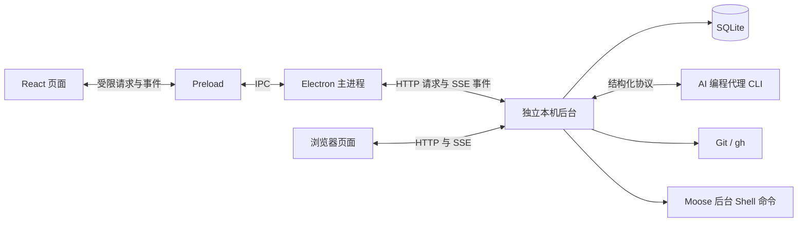

# Moose 项目面试追问资料

本文保留 Moose 的实现细节、技术取舍和面试追问，供[简明指南](project-interview-guide.md)按需查阅。原稿以 0.19.0 为基线（2026-09-21 核对）；面试前仍须对照[能力表](../providers/native-capabilities.md)和当前源码。第一人称回答只供练习，应按实际参与情况讲。

## 怎么用这份指南

准备顺序面向国内前端、AI 应用前端和偏前端的全栈岗位，参考 2026-03-21 至 2026-09-21 的面经。P0 先讲熟，P1 能展开，P2 按岗位补充；都不代表某题必问或不重要。

| 等级 | 准备标准 | 重点 |
| --- | --- | --- |
| P0：先讲熟 | 不看文档讲清问题、实现、失败路径和证据，能接两轮追问 | 项目职责、任务链路、流式状态、并发与恢复、权限安全、性能测量、AI 代码验证 |
| P1：能展开 | 能解释设计取舍，知道对应源码和限制 | 底座适配细节、Plan／插话、子代理、MCP、worktree、后台调度 |
| P2：按岗补充 | 知道作用与边界，被问到再展开 | 特定 CLI 的 Goal、Git 托管细节、配置编辑、安装排障等 |

**先复习：** 1、2、4、6、7、14、15 节，再挑第 16、17 节的例子；其余按岗位补。开场不必罗列所有功能。

**按岗位调整：** Electron／IDE 岗重看 3、10、13 节及打包、PATH；Agent 平台岗重看 5、8、9、12 节；普通前端岗先讲 React、异步竞态、性能和交互。RAG、向量检索、模型训练不是 Moose 已实现能力；JS／TS、浏览器网络和算法基础仍需另练。

**国内近半年依据与局限：**

- [字节 AI 全栈一面](https://www.nowcoder.com/discuss/913848724952997888?sourceSSR=home)：项目链路、流式输出、职责与 AI 代码排查。
- [虚拟盒子前端实习](https://ac.nowcoder.com/discuss/1676918?type=0)：SSE、断网、心跳、网络基础与 AI 记忆；作者使用转写和 AI 整理。
- [字节前端汇编](https://www.nowcoder.com/discuss/923168327453642752)：AI 工作流、Skills／MCP、测试与传统基础。
- [字节 Agent 汇编](https://www.nowcoder.com/discuss/930603820395036672)：超时、幂等、SSE 重连、长任务耗时。

样本偏实习与字节，汇编也不等于第一手记录；这些只帮助安排复习，不能推断全行业出题频率。投递时仍按 JD 调整。

完整目录：

1. [先把项目讲清楚](#1-先把项目讲清楚)
2. [哪些是自己做的，哪些来自底座](#2-哪些是自己做的哪些来自底座)
3. [为什么分成三类进程](#3-为什么分成三类进程)
4. [从按下发送到任务结束](#4-从按下发送到任务结束)
5. [不同代理如何接进同一套界面](#5-不同代理如何接进同一套界面)
6. [流式消息和 React 页面如何保持一致](#6-流式消息和-react-页面如何保持一致)
7. [排队、并行和重启恢复](#7-排队并行和重启恢复)
8. [Plan、Goal 和运行中插话](#8-plangoal-和运行中插话)
9. [原生历史与子代理](#9-原生历史与子代理)
10. [用 worktree 隔离代码修改](#10-用-worktree-隔离代码修改)
11. [Git 提交、PR 和原生代码审查](#11-git-提交pr-和原生代码审查)
12. [配置、MCP、插件与认证](#12-配置mcp插件与认证)
13. [后台命令与定时任务](#13-后台命令与定时任务)
14. [输入体验和安全边界](#14-输入体验和安全边界)
15. [怎么证明这些功能真的可用](#15-怎么证明这些功能真的可用)
16. [面试里值得展开的四个问题](#16-面试里值得展开的四个问题)
17. [容易被追问的技术取舍](#17-容易被追问的技术取舍)
18. [简历写法、演示和最后复习](#18-简历写法演示和最后复习)

## 1. 先把项目讲清楚

### 一分钟介绍

> Moose 是我独立开发的 AI 编程客户端。桌面和 Web 共用界面，接入多种本机代理 CLI；用户按项目创建会话、下达任务、处理审批，完成后检查 diff 并提交。
>
> 难点是不同 CLI 协议和状态分散，同目录并行还可能互相改文件。我负责交互、协议适配、调度和持久化；推理与代理内部工具由 CLI 负责。技术栈是 Electron、React、TypeScript、SQLite；用 worktree 隔离同项目的并行修改。

开场到此即可；协议、并发和恢复在第 5、7、10、13 节展开。

### 对方让你展开时

> 用户提交后，Moose 校验并持久化队列；目录空闲时启动 CLI，创建或恢复原生会话。
>
> CLI 返回文字、工具状态与审批。适配器转成统一事件，后台保存，前端更新；请求被接收不等于执行完成。
>
> 同一实际目录的任务串行，不同目录并行；worktree 给同项目独立目录。但外部编辑器和终端仍能改文件，提交前须重查仓库状态。
>
> React 管交互，Electron 主进程管系统能力，独立后台管 CLI、数据库和调度。Web 经 HTTP / SSE 复用同一服务；安装版的桌面和浏览器共用后台与原数据目录。普通退出保留任务，显式停止后台才结束任务。

### 项目的使用价值

Moose 把任务状态、审批、记录和 Git 改动关联到项目与会话。两个会话分别开发和修复缺陷时，它还要决定能否并行、在哪个目录执行、何时允许合并。工程重点因此是 CLI 接入、调度、持久化和改动检查。

目前没有可引用的用户规模、收入或提效比例；启动、内存、包体测量也不能推断用户生产效率。只讲已交付和已验证的内容。

## 2. 哪些是自己做的，哪些来自底座

“底座”是负责推理、工具调用和原生会话的代理运行时。Moose 经 CLI 接入并管理应用层流程，不实现模型推理循环；代理发起工具调用，Moose 展示审批并转发用户选择。

| 部分 | Moose 负责什么 | 底座或外部工具负责什么 |
| --- | --- | --- |
| 一轮代理任务 | 收集输入、排队、选择工作目录、显示和保存状态 | 模型推理、决定工具调用、执行代理工具 |
| 审批与提问 | 展示问题、校验请求仍有效、把选择送回去 | 提出审批或问题、解释选择并继续执行 |
| Plan 与 Goal | 提供入口，保存计划版本，组织批准执行 | 原生规划模式、目标状态和后续执行机制 |
| 子代理 | 接收活动、展示关系与历史、转接受支持的控制 | 决定是否委派、创建和运行子代理 |
| 原生历史 | 浏览、导入、记录来源及操作状态 | 提供原生会话、分叉和压缩接口 |
| Git 与 worktree | 展示目标和预览、验证状态、安排调用 | Git 修改索引、生成提交、创建和合并工作目录 |
| 配置与扩展 | 选择作用域、预览、版本检查、显示诊断 | CLI 写原生配置、管理插件及认证凭据 |
| 后台命令与调度 | 创建并管理命令进程、记录调度、领取周期 | 本机 Shell 执行用户命令；代理消息仍由底座处理 |

Moose 管理用户在命令面板手动启动的进程；它与 Codex 工具内部创建的进程生命周期不同。

代码、聊天和调度记录在本机；模型请求仍可能经 CLI 发往服务商。本地存储不等于离线推理。

### 先分清几个对象

| 对象 | 它表示什么 | 为什么需要单独区分 |
| --- | --- | --- |
| 项目 `Project` | 加入 Moose 的本地目录 | 确定归属和默认工作位置 |
| 会话 `Session` | 项目下面的一段对话 | 固定底座，保存模型、权限、草稿等选择 |
| 原生会话标识 `nativeId` | CLI 侧的 thread、session 或 sessionFile | 继续已有上下文，不把每次发送都当成新对话 |
| 执行 `runId` | Moose 中一次输入所对应的执行 | 一轮可能产生很多段回答、工具和审批记录 |
| 消息 `Message` | 时间线里的一条可更新记录 | 用 `seq` 判断版本，用 `position` 排序和分页 |
| 队列项 `QueueItem` | 已保存但尚未开始执行的输入 | 可以编辑、移除或等待目录空闲 |
| 工作目录 `Worktree` | 为隔离任务创建的 Git checkout | 同项目的两段会话可以操作不同文件副本 |

一个 Moose 会话固定一个底座。不同底座之间不能直接迁移原生上下文。即使都是聊天界面，背后的状态格式和恢复方式也不同。

## 3. 为什么分成三类进程

窗口、系统集成和任务执行负载不同；数据库、Git 与 CLI 放在独立后台，避免直接拖慢窗口。

Moose 的划分是：



React 管页面；主进程管窗口、菜单、文件选择、剪贴板与系统浏览器；后台管调度、数据库、代理和命令。开发与独立模式用 `utilityProcess`，安装版默认用独立本机服务。Preload 只是桥接脚本，不是第四个业务进程。

同步数据库调用不阻塞主进程，但仍可能阻塞后台。窗口重开时用快照和消息恢复界面；安装版普通退出只断开客户端，停止共享后台才停任务。独立开发模式则随应用退出停止后台。

进程通信要处理请求 ID、超时和退出通知；后台异常退出时，拒绝待处理请求并通知页面，避免按钮一直转圈。

### TypeScript 和 Zod 为什么都需要

TypeScript 约束方法名、参数和返回类型；例如 `scheduleUpdate` 必须带任务 ID、版本和允许修改的字段。

IPC 接收端用 Zod 检查 UUID、枚举、长度和未知字段；TS 类型运行时不存在。主进程还检查请求是否来自可信窗口的主 frame。

页面关闭 Node 集成，开启 `contextIsolation` 与 sandbox，只经 `window.moose.request`、`subscribe` 使用受限能力。

后台仍可能被同步查询、文件遍历或大输出阻塞，须限制规模。

代码入口：[主进程](../../electron/main.ts)、[桥接](../../electron/preload.ts)、[共享后台连接](../../electron/shared-runtime.ts)、[独立模式宿主](../../electron/runtime-host.ts)、[请求类型](../../shared/types.ts)、[参数校验](../../shared/validation.ts)。

### Web 入口与桌面入口怎样共用

前端都用 `request / subscribe`：桌面经 preload / IPC，浏览器经 HTTP / SSE，共用 `MooseService`。目录选择、剪贴板、附件和编辑器入口按宿主分别处理；服务器路径不等于浏览器设备路径。

安装版按需启动回环地址上的共享后台，桌面和浏览器复用原数据目录；源码启动的独立 Web 工作区保留自己的目录，也可通过连接文件接入。访问链接中的一次性令牌换取 HttpOnly cookie 后从地址清除。服务校验 Host、Origin 和参数；客户端断开不关服务。

浏览器重连后重读快照和消息，按 ID、版本合并；写请求不自动重试，因为回执丢失不等于未执行。终端输出经 IPC／SSE 推送，初次打开及重连按游标补读；与实时输出重叠时去重，渲染繁忙则合并补读。缓冲超限会提示截断。多个窗口可看终端，但输入和尺寸调整只归一个控制端；其他窗口可接管，旧端写入会被拒绝。关面板释放租约，异常断线 15 秒后失效。控制权不决定 Shell 是否继续运行；高延迟输入和完整业务事件游标仍待完善。

没有另做数据迁移：安装版继续用原 SQLite 与附件目录，只改后台启动方式。桌面通过私有连接文件接入，重新打开会复用服务；升级遇旧后台需先停再启。独立 Web 工作区不自动合并，也未安装系统守护服务。

## 4. 从按下发送到任务结束

用一个具体需求串起来：“修复登录按钮，并补一个测试。”

**第一步，界面收集本次输入。** 除了文字，还可能有附件、`@` 文件引用、技能和任务模式。新建会话时先显示一个未保存的输入页，首次发送才创建实际会话；已有会话则使用原来的会话 ID。

**第二步，后台检查并保存。** Service 检查会话是否归档、底座是否启用、参数是否合法，并解析附件。正常发送先写入 SQLite 队列。这个动作表示“需求已经被 Moose 接收”，还不表示底座已经开始执行。

**第三步，调度器选择能开始的任务。** 它检查会话是否暂停、实际工作目录是否被占用，以及是否有互斥操作。如果目录空闲，就准备对应的 CLI；异步准备结束后还要再检查一次，防止用户已经取消队列或应用开始退出。

**第四步，记录执行开始。** 数据库用一个事务完成出队、写入本轮用户消息、把会话标成运行中。Moose 分配 `runId`，登记目录占用，再调用适配器。

**第五步，底座处理需求。** 适配器启动 CLI，创建或恢复原生会话，传入当前目录、输入和执行设置。底座返回文字增量、工具活动、审批或提问，适配器将它们转换成统一事件。

**第六步，结果持续落库并显示。** Service 合并同一事件的更新，保存变化，通知页面。用户回答审批时，答案沿原请求返回；它不会变成一条无关联的新聊天消息。

**第七步，收尾。** 完成、失败或取消后，后台保存最终状态，让未处理的审批失效，关闭本轮适配器，释放目录。能继续执行的队列再由调度器处理；失败、停止、Plan 结束等情况会保留相应暂停规则。

这条流程里有两类返回。`send` 的返回只确认队列已经保存；任务过程和最终状态通过后续事件更新。如果把它们当成同一次短请求，就很难处理几十秒甚至更长的执行。

代码入口：[Service 的 send、drain、execute](../../electron/service.ts)、[Store 的 enqueue、begin](../../electron/db/store.ts)。

### 从启动入口定位到执行代码

| 阶段 | 先读代码 | 需要讲清的边界 |
| --- | --- | --- |
| 启动桌面 | [main.ts](../../electron/main.ts) → [desktop-runtime.ts](../../electron/desktop-runtime.ts) → [shared-runtime.ts](../../electron/shared-runtime.ts) | 安装版按需启动或连接共享服务，React 不直接打开数据库 |
| 建立服务 | [web-server.ts](../../electron/web-server.ts) → [store.ts](../../electron/db/store.ts)／[service.ts](../../electron/service.ts) | 同一数据目录只由一个服务持有；默认开发模式另走 runtime.ts |
| 选择项目、创建输入页 | [app.tsx](../../src/app.tsx) → 宿主目录选择 → Service | 记录规范化目录；首次发送才保存会话 |
| 提交输入 | [composer.tsx](../../src/components/composer.tsx) → request → `send` | Enter 与输入法确认分开；请求返回确认入队，不代表完成 |
| 调度与执行 | Service 的 `drain`／`execute` → [AgentAdapter](../../electron/providers/types.ts) | 使用会话实际目录，底座负责推理和工具执行 |
| 保存与展示 | Service 的 `accept`／`flush` → Store → [workspace.ts](../../src/lib/workspace.ts) | 按消息 ID 和 seq 更新；完成信号与普通增量分开处理 |

Web 页面的入口不同：通过 [web-api.ts](../../src/lib/web-api.ts) 发送 HTTP 请求并订阅 SSE，进入同一个 Service。不要把桌面的 preload 路径照搬成浏览器调用链。

## 5. 不同代理如何接进同一套界面

### 共用界面，分别处理协议

不同 CLI 的启动方式、消息格式和完成信号各有差异。Moose 为每类协议提供适配器，让它们各自理解原协议，向上输出统一的 `AgentEvent`。

| 底座 | 通信入口 | 会话延续 | 一轮完成依据 |
| --- | --- | --- | --- |
| Codex | `codex app-server`，stdio JSON-RPC | 创建或恢复 thread，再启动 turn | 对应线程的 `turn/completed`；Goal 还要检查目标状态 |
| Grok Build | ACP SDK，经 stdio 连接 | 根据能力使用 `newSession` 或 `loadSession` | `prompt` 调用返回 |
| Pi | `pi --mode rpc`，按行传输 JSON | 保存 `sessionFile`，后续用它恢复 | `agent_settled`，不能只看到 `agent_end` 就结束 |
| OpenCode v2 | `opencode acp`，stdio ACP | `session/new` 或 `session/load` | `session/prompt` 返回，调用受理不是任务完成 |

stdio 指程序的标准输入输出。这里传的是程序接口的数据，并不是自动向终端窗口敲字。JSON-RPC 的请求有 ID，用来找到对应的回复；通知则用于报告持续发生的进度。

统一事件描述“这是一段回答”“这是工具输出”“这里需要审批”，不要求页面理解每个底座的原始字段。新增 Pi 时，共用了按行传输、请求关联和进程清理，但为 Pi 单独实现消息格式转换；不能因为都传 JSON，就把 Pi RPC 当成 Codex 的 JSON-RPC。

### 为什么不把各个执行循环写成一个大函数

适配层统一输入、增量、审批和取消接口；完成与恢复仍各自处理：Grok 恢复时可能回放历史，Pi 的结束事件后可能继续重试或压缩，Codex 还区分 thread、turn 和子线程。

这些差异留在适配器；公共 Service 只管调度和数据。原生历史用 `NativeSessions`，Git、配置和后台命令也各有模块，避免公共循环堆满底座分支。

### 能力相同，不能只看按钮名字

| 能力 | Codex | Grok Build | Pi | OpenCode v2 |
| --- | --- | --- | --- | --- |
| 普通对话与原生会话恢复 | 已接入 | 已接入 | 已接入 | 已接入 |
| 权限选项 | 请求批准、原生自动审核、完全访问 | 请求批准、完全访问 | 仅完全访问，无内置审批沙箱 | 请求审批，遵循 CLI 权限策略 |
| Plan 审阅后执行 | 已接入原生模式 | Moose 未接通此流程 | 未接入 | 未接入 |
| Goal | 原生目标接口 | ACP 转交原生 `/goal` 命令 | 未接入 | 未接入 |
| 当前回合插话 | 原生 `turn/steer` | 原生 `_x.ai/interject` | 保持普通队列 | 保持普通队列 |
| 子代理 | 活动与独立历史面板，控制受能力限制 | 工具活动展示 | 未接入专门管理 | 未接入专门管理 |
| 原生历史导入 | 支持 | 支持回放导入 | 未接入浏览导入入口 | 未接入浏览导入入口 |
| 显式分叉、手动压缩、原生审查 | 已接入 | 未接入 | 未接入 | 未接入 |
| 配置、MCP、插件管理 | 已接入 | 部分用户级功能已接入 | 部分用户级功能已接入 | 部分用户级功能已接入 |

这张表是概览，具体版本和支持范围以[能力表](../providers/native-capabilities.md)为准。入口按握手能力与已验证接口开放，服务端也检查条件。

### 审批按钮怎么找到原来的请求

审批绑定执行、消息和底座请求 ID。点击时 Service 重查该轮仍在运行、未取消、请求仍待处理；适配器校验选项后按原协议回复。旧按钮不能批准下一轮。

审批问“可否执行”，提问问“需求是什么”，例如改移动端还是桌面端。答案按原问题 ID 返回，不塞进下一轮聊天。Pi 扩展能提确认问题，不等于 Pi 所有工具都有审批沙箱。

代码入口：[适配器接口](../../electron/providers/types.ts)、[注册入口](../../electron/providers/registry.ts)、[Codex](../../electron/providers/codex.ts)、[Grok](../../electron/providers/grok.ts)、[Pi](../../electron/providers/pi.ts)。

### 新增一家 CLI，怎样避免越写越乱

“代理”不只是模型：它还管理工具、权限和会话。Moose 管 CLI 接入、调度、记录与交互；代理运行时决定并执行内部工具。

OpenCode v2 用 `opencode acp` 经 stdin/stdout 通信，由 CLI 启动私有服务。Moose 检查版本与握手能力，处理模型、文本／思考／工具事件、审批、取消和续接；恢复时抑制旧历史回放，避免重复显示。

v2.0.10 已验证握手、模型列表，以及隔离目录里的真实文件写入、续接、审批批准／拒绝与取消；不代表所有模型和权限配置都通过。原生 Plan、Goal、历史列表和额度查询未接入；工具权限仍按 CLI 配置执行。

新增适配器需登记元数据、构造器和配置，补协议测试；共用 ACP 事件转换放在 `acp-events.ts`，底座专有控制留在各自适配器。

## 6. 流式消息和 React 页面如何保持一致

### 一轮回复为什么拆成多条记录

一轮可能先解释、再运行命令、请求批准，最后总结；单个答案字符串无法分别更新工具和审批。

`runId` 归拢本轮，底座事件 key 区分条目；条目可追加文字或从运行中变成完成。复制回复时按本轮组合正文。

### 增量和最终结果怎么合并

例如先后收到“已找到”“登录问题”，又收到完整文本“已找到登录问题”：前两段追加，最后一段覆盖，否则重复。

Service 追加 `delta`、覆盖完整 `text`；更新递增 `seq`，数据库和页面只收新版本。`seq` 不能识别上游无标识的重复增量。

### 为什么约 80 毫秒刷新一次

零碎输出先在内存合并，约每 80 毫秒批量保存和推送，减少 SQLite、跨进程与页面更新；审批等关键状态及时刷新。

代价是崩溃时尚未落盘的一小段可能丢失，不能说每个字符到达即持久化。

### 会话切换时，迟到结果怎么办

从 A 切到 B 后，A 的历史可能才返回。前端推进请求代次，只应用当前结果；实时事件再按会话 ID 过滤。

代次放 `useRef`，显示消息放 state；effect 清理订阅和定时器。异步更新用函数式 state，避免旧闭包覆盖新消息。

### 长会话怎么处理

历史按 `position` 游标每页取 80 条，多取一条判断还有没有更早内容。页面按 ID／`seq` 合并；`memo` 减少重复渲染，滚动组件维护阅读位置，`content-visibility` 降低离屏布局负担。

这不是严格虚拟列表，持续加载时 DOM 仍增长。一万条历史测试验证了分页、持久化和交互，没证明同时渲染的帧率或性能提升比例。

代码入口：[事件合并与 flush](../../electron/service.ts)、[前端数据 Hook](../../src/lib/workspace.ts)、[时间线](../../src/components/transcript.tsx)、[滚动组件](../../src/components/ui/message-scroller.tsx)。

## 7. 排队、并行和重启恢复

### 为什么按实际目录控制并发

两个会话即使任务不同，也可能同时改 `App.tsx`。

Moose 按实际工作目录调度：同目录串行，不同目录并行；worktree 让同项目的会话使用不同目录。目录先规范化并核对归属，避免符号链接或别名绕过。底座内部的子代理仍由底座调度。

Moose 的 Git 写入、原生历史变更、后台命令也共用目录互斥；配置写入影响更广，另用全局互斥。

这不是跨应用文件锁：外部程序仍能修改文件，也不检测所有父子目录或重叠仓库。

### 为什么有了 JavaScript 单线程，还要防竞争

`await` 会让出执行；查 CLI 路径期间，用户可能已取消队列。沿用旧状态就可能执行失效需求。

Moose 防止调度循环重入，并在异步准备后重查队列、目录占用和退出状态。单线程不保证跨 `await` 的判断仍有效。

### 队列为什么先写数据库

SQLite 队列保存文字、附件和本次任务上下文，避免退出后丢失。执行开始时，事务一起完成出队、保存用户消息和更新状态。

事务只覆盖数据库，不包含 CLI 和文件修改。若出队后、发送前崩溃，这轮应标中断，不能假设外部执行必达。

队列不是完整设置快照：文件引用、技能和模式随输入保存，模型与权限取执行时会话配置。

### 重启能恢复到哪一步

数据库保存历史、草稿、队列和原生 ID。重启时，未完成执行与审批标为中断或失效，旧队列暂停待用户恢复；已死亡进程及其写过的文件不会被“恢复”或撤回。

普通旧队列不自动恢复；仍启用、尚未领取的定时周期按规则最多补跑一次。已领取但结果不明的周期暂停核对（第 13 节）。

SQLite 开启 WAL 与外键约束，升级走迁移和事务。历史、关系、排序数据用专表；扩展操作、后台命令和调度记录按命名空间存入 settings JSON，便于共用事务。记录量增长后可改为专表与索引。

### 为什么要有“结果未知”

副作用请求发出后若断线，只能确定没收到确认，不能确定对方没执行。自动重试可能重复提交、创建任务或耗费额度。

插话、原生历史变更、提交和扩展管理会记录请求 ID 或意图指纹；明确拒绝与未知结果分开处理。版本检查对象是否仍是用户看到的版本，请求 ID 检查是否重复提交。

SQLite、CLI、Git 和远端没有统一事务，因此不能承诺外部副作用严格只执行一次。

### 长期运行、断连、休眠和升级，分别怎么恢复？

> 客户端断开和后台死亡不同。桌面或浏览器只是界面；后台持有数据库、代理进程和终端。后台仍活着时，关窗后任务继续，重连读快照、消息并补终端输出；后台崩溃则只能核对记录，不能靠会话 ID 复活 Shell。
>
> 写操作可能已执行但回执丢失：标为未知，不自动重试；重连也不默认批准审批。升级遇旧后台则拒绝写入，提示停掉旧后台再启动。
>
> 夹具覆盖断连与重启时序；Pi／OpenCode 的真实文件写入、跨进程续接和取消，以及 OpenCode 审批批准／拒绝已有最小验证。系统休眠、数小时内存和实际安装替换仍未验收。

**重连会逐条重放所有事件吗？** 不会。界面靠快照、持久化消息和终端游标补读，没有通用全量事件日志；SSE 重连也不意味着写操作可安全重试。

**任务从五分钟变成二十分钟怎么查？** 分别测排队、CLI 握手、首个输出、工具、审批等待和 UI 更新，并对比相同底座、模型、输入。页面卡顿查 renderer，工具卡住查子进程；目前没有统一跨进程 trace 仪表盘。

**测量边界：** 2026-09-21，一万条历史、20 次打开与分页，66 秒内 DOM 未累积；第 5～20 轮 GC 后堆从 10.44 增到 10.93 MiB。这是短时 renderer 场景，不能证明全应用无泄漏。见[测试记录](../testing.md#长期运行与恢复当前覆盖与待验收)。

代码入口：[目录调度](../../electron/service.ts)、[数据库与迁移](../../electron/db/store.ts)、[迁移版本](../../electron/db/migrations.ts)、[原生操作记录](../../electron/native-history.ts)、[插话记录](../../electron/steering.ts)。

## 8. Plan、Goal 和运行中插话

Plan 先审方案，Goal 围绕目标持续推进，插话在当前回合补充要求。

### Plan：审阅的是哪一版计划

Codex Plan 自 0.11.0 起使用原生 `collaborationMode: plan`，并限制为只读 sandbox、禁止提权；即使会话选了完全访问，规划这轮也不沿用。

Moose 保存计划正文和版本；修改后版本递增。批准时，后台检查完成状态、最新版本、是否已批准及其他排队消息。

批准记录与正文入队在同一事务中完成。执行切回原生 default 模式，沿用原生会话并恢复所选权限；规划结束不会顺手执行下一条需求。

例如用户看到版本 2，计划已改成版本 3，旧批准必须失败；按钮置灰挡不住旧请求，后台和数据库也要校验。

### Goal：谁在继续安排下一轮

Codex Goal 用 `thread/goal/set`、`get` 设置目标和可选 token 预算。输入先进入原生任务，再由底座继续执行；完成、阻塞、预算或额度限制时结束等待。

Grok 通过 ACP 发送原生 `/goal`。Moose 不自行循环提问，也不套用 Codex 的预算和状态语义。Pi、OpenCode 尚未接入 Goal。

### 插话：和下一条排队消息有什么不同

普通消息等当前任务结束；插话送入正在运行的回合。Codex 用带 `expectedTurnId` 的 `turn/steer`；Grok 用 ACP 扩展 `_x.ai/interject`，在安全执行边界处理。`queued` 只表示底座接收，不表示模型已采用。Moose 不因此取消任务；普通队列仍由 Moose 持久化和调度。

插话不能暂停到某行代码、撤回已执行操作，或暗改本轮模型、权限和模式；后续由底座处理。

Moose 先记录投递，再调用底座。确认后标为已接收；回合已结束则保留输入；断连或超时标为未知，不擅自改为新任务重发。

代码入口：[计划版本与批准](../../electron/plans.ts)、[投递状态](../../electron/steering.ts)、[Codex 原生调用](../../electron/providers/codex.ts)、[Grok Goal](../../electron/providers/grok.ts)。

## 9. 原生历史与子代理

### 为什么还要读取 CLI 的历史

终端中的原生会话不在 Moose 数据库里，因此提供浏览、预览和导入。

导入核对工作目录和来源，识别重复；按底座接口分页读取，并限制游标、条目数和文本大小，防止无限循环或耗尽内存。

导入保留官方历史，只把可读记录和原生 ID 关联到 Moose，供后续续接；不持续双向同步。

### 编辑、分叉、压缩分别改变什么

| 操作 | 解决什么问题 | 不会自动发生什么 |
| --- | --- | --- |
| 编辑最新用户消息 | 修正刚才的需求，在 Moose 原会话中替换最后一轮并重新执行 | 不撤销上一轮已修改的文件 |
| 显式原生分叉 | 从指定历史节点另开一段对话，保留来源关系 | 不创建独立代码目录 |
| 手动压缩 | 请底座整理上下文，为继续对话控制上下文规模 | 不等于删除 Moose 聊天记录或自行截掉提示词 |

Codex 已接入这些原生接口。其他底座若只能用可见文字重建上下文，就不能称为完整复制内部状态。

### 子代理是不是 Moose 自己派出来的

是否委派由底座按任务和原生配置决定；Moose 不强制拆任务。

Moose 识别委派、展示结果，并区分父子线程：子线程完成不能结束父任务；子线程审批仍走主任务关联的流程，历史面板不能接管所有审批。

Codex 提供结构化父子关系、历史和受支持的发送／停止操作。Grok 主要展示 ACP 工具活动，不伪造完整子线程树。控制请求被接收也不代表子任务完成。

`thread/resume` 只加载会话；已关闭子任务仍需主代理恢复。

### 为什么有时看不到“思考”

Moose 订阅相关事件，Codex 请求 `summary: auto`；有文本就显示。一次探测中回答正常却没有摘要事件，不能据此推断所有模型的支持情况。

准确说法是“展示底座提供的思考摘要或 thought 内容”；组件无法取得协议未提供的内部推理。

代码入口：[历史协调](../../electron/native-history.ts)、[Codex 原生会话](../../electron/providers/codex-sessions.ts)、[Grok 原生会话](../../electron/providers/grok-sessions.ts)、[子代理事件转换](../../electron/providers/codex-subagents.ts)。

## 10. 用 worktree 隔离代码修改

会话分叉只隔离对话。并行写代码还要隔离文件：Git worktree 为同一仓库提供多个工作目录和分支。

Moose 从指定 ref 创建分支、受管 worktree 和绑定它的空白会话。原会话目录与原生 ID 不变；未提交文件、依赖和聊天历史不自动复制。

```text
项目 shop
├─ 会话 A → 项目根目录       → 当前分支
├─ 会话 B → worktree/login   → 登录修复分支
└─ 会话 C → worktree/search  → 搜索改进分支
```

B、C 可并行，但文件引用、技能、代理、命令、Git diff 和编辑器入口都要指向各自目录；只改 CLI 的 `cwd` 会让查看和修改落在不同目录。

### 合并为什么还要分两步

合并前预览来源提交、项目根目录当前目标分支及双方 diff；Moose 检查状态未漂移后才准备合并。

无冲突也先停在可检查的暂存结果，确认后提交。有冲突则在目标目录修改、标记解决并暂存，再完成或中止合并。相关两个目录暂停新写入，其他 worktree 继续工作。

重启后联合核对 Git 状态和 Moose 记录，保留冲突现场供继续或中止，不能只凭数据库状态重跑 merge。

### 为什么清理这么谨慎

清理前检查活动与排队任务、未提交内容、未跟踪及忽略文件、未合并提交；用户选了保留就不自动清理。

连 `node_modules` 等忽略目录也可能阻止清理，须先由用户处理。清理保留分支和聊天记录；旧会话不会自动退回项目根目录写入。

真实临时 Git 仓库覆盖创建、冲突、继续、中止和清理。worktree 不隔离端口、外部数据库、远端资源和共享配置。

代码入口：[worktree 管理](../../electron/worktrees.ts)、[目录归属](../../electron/db/store.ts)、[真实 Git 验收](../releases/feature-validation-history.md#phase-three)。

## 11. Git 提交、PR 和原生代码审查

### 用户确认的内容和实际提交的内容要一致

改动面板区分已暂存、未暂存和未跟踪；同一文件可同时有前两种状态。暂存按文件，面板包含代理运行前的改动，不能都标成“本轮 AI 生成”。

提交预览展示暂存文件及 diff，并记录分支、HEAD 和暂存区摘要指纹。点击提交时再次核对；预览后暂存内容有变，就重新预览。

保留 Git hooks 和签名配置。hook 或外部程序仍可能改内容，所以提交后核对实际树；若有变化，告知已生成的 commit 供检查，不伪称符合预览，也不擅自回滚。

命令用参数数组调用，路径按字面处理；读 diff 时关闭外部 diff、textconv。未结束的 merge、rebase、cherry-pick 不能被普通提交绕过。

### 创建 PR 的边界

通过本机 `gh` 创建 GitHub 草稿 PR。明确 origin、源分支、已推送 HEAD 和目标分支；预览先 fetch base，用本地 Git 对象生成 diff，创建前再校验。

不自动推送，也暂不支持跨 fork、企业版 GitHub 和其他平台。已有相同目标的 OPEN PR 则返回原链接；请求 ID 防重复，连接异常保留未知状态。

### 原生审查为什么另开线程

执行会话已有上下文和权限；审查需要独立的只读状态。

Moose 新建只读线程调用 Codex `review/start`，可审未提交改动、相对分支的 diff 或指定 commit。结果、状态、停止入口独立保存；路径和行号采用底座返回值。

审查耗费额度，也可能漏报、误报；不能代替测试或称为 Moose 自研静态分析器。

代码入口：[Git 操作](../../electron/git-actions.ts)、[审查管理](../../electron/review-workbench.ts)、[PR 操作](../../electron/pull-requests.ts)、[Git 与审查验收](../releases/feature-validation-history.md#phase-four)。

## 12. 配置、MCP、插件与认证

### 先区分这几类扩展

Skill 是代理阅读的操作说明；MCP 连接工具或资源；插件由底座管理扩展能力；hook 在特定事件触发。它们有关联，但配置不同。

Moose 0.11.0 接入 Codex 管理接口：查看配置来源、修改用户级默认模型、切换 MCP／插件、安装卸载插件、注册 MCP、发起 OAuth；Hooks 只读诊断。其他底座仍用各自 CLI 管理。

### 为什么先读“来源”，再允许修改

有效值可能来自用户、项目、profile 或受管理配置；修改未生效，可能是另一来源优先级更高。

Moose 显示来源，只写底座确认可写的用户层。写前重读版本并传 `expectedVersion`；保存后重连检查实际生效值，被其他层覆盖则给出诊断。

插件安装卸载调用已验证的 CLI 命令，开关走配置接口；不把协议字段直接当成稳定能力。

### 为什么配置写入用全局互斥

目录锁只保护单个 checkout；用户级配置影响多个项目，因此需要全局互斥。

有活动任务或目录操作时拒绝写入；写入期间暂停新任务。调度器异步查询返回后复查配置锁，操作结束再恢复调度。

用户须等任务结束再改配置。锁只约束 Moose，挡不住外部终端编辑。

### 注册一个 MCP 为什么默认不启用

注册与运行是两件事；STDIO MCP 会启动本地程序，因此保存时不立即运行。

新建 HTTP／STDIO MCP 先预览，以禁用状态写入，再单独启用；不覆盖隐藏于其他配置层的同名项。STDIO 命令与参数分字段处理，不拼 Shell 文本；环境变量只填名称，不保存密钥值。

### OAuth 和敏感信息怎么处理

底座发起认证，Moose 在系统浏览器打开经检查的授权 URL，等底座报告完成。URL 不入聊天或数据库；取消、超时只关闭连接，不撤销服务端凭据。

页面只收到白名单展示字段，不接收完整配置、命令、headers 或环境变量值。诊断不透传原始报错；回执只存意图指纹，不重复存 MCP 配置正文。

以上限于配置链路；代理回复和命令输出仍入历史，若其自身打印秘密，应用并无全局自动脱敏。

代码入口：[配置操作协调](../../electron/extensions.ts)、[Codex 配置适配](../../electron/providers/codex-extensions.ts)、[插件 CLI](../../electron/providers/codex-plugins.ts)、[MCP 输入约束](../../shared/mcp-registration.ts)。

## 13. 后台命令与定时任务

### 文本命令面板做到了哪一步

用户可在会话目录运行 Shell、查看 stdout／stderr、向 stdin 发送文字或 EOF、停止进程。例如 `read line; printf '%s' "$line"` 会读入界面输入。

命令面板适合一次性命令；0.12.0 起有 node-pty／xterm.js 交互终端，支持 vim 及弹窗、底部、右侧布局。两类进程各自处理输入、退出和停止；Moose 不接管底座创建的工具进程。

输出只保留最近约 128K 字符、每项目最近 100 条；旧请求记录仍保留以防重试。stdin 不单独记录，但命令可能自行回显。

### 关窗口、退出、崩溃是三种情况

安装版关窗或普通退出后共享后台、命令和终端继续运行；停止后台才清理进程。独立开发模式随应用退出。后台被杀时，父进程管道关闭，监视逻辑清理其命令进程组。

重启不按旧 PID 盲目杀进程：PID 可能已复用。无可靠结果的旧记录标为未知，不自动重跑；主动脱离进程组的守护程序尚无完整生命周期保证。

### 定时器只是入口，真正重要的是持久化

调度记录保存内容、绝对时间、时区、间隔、启用状态和上次结果。定时检查到期后，还要判断目录忙闲及上一轮状态。

到期先领取周期，再触发副作用：代理消息的领取与入队在同一 SQLite 事务；命令先记录领取再启动。代理消息沿用绑定会话的底座、模型、权限，以普通 Build 模式排队执行。

### 休眠后错过十次，要执行十次吗

错过的周期最多合并补跑一次，再推进到未来；每分钟一次的任务休眠十分钟后不会连跑十次，上一轮未结束也不重叠启动。

固定间隔按经过时长；日历规则按指定时区的每天／每周钟点，且能预览未来时间。每隔 24 小时不等于夏令时后仍在当地九点；暂不支持月度或任意 cron。

安装版退出后共享后台仍可调度，但没有开机自启或系统唤醒；睡眠中不保证准时。重启 Moose 后核对持久化状态，不恢复旧活进程。

### 编辑和恢复有哪些限制

须先暂停，才能编辑名称、类型、正文、时间和间隔；预览保存后仍暂停，需单独恢复。后台查版本，已领取的排队或运行任务不可换内容，已执行的单次任务不可再恢复执行。

重启先核对事实：命令已有结果就恢复终态；代理消息仍在队列则保留关联、暂停后续触发，交由原会话恢复或移除；无法确认才标未知。

创建指纹与后续编辑分开保存。重试原创建请求只返回已有任务，不因名称已改就误认新请求，也不覆盖内容或解除暂停。

代码入口：[命令生命周期](../../electron/command-jobs.ts)、[调度器](../../electron/schedules.ts)、[后台记录](../../electron/background-store.ts)、[定时任务编辑](../../src/components/schedule-form.tsx)、[测试方法](../testing.md)。

## 14. 输入体验和安全边界

### 文件引用、附件和技能

`@` 只搜索项目文件名和路径。后台有界扫描，排除依赖与构建目录，再模糊匹配；选择后存相对路径，执行前重解真实路径并检查归属，防止旧索引或符号链接越界。

附件复制到应用数据目录，防止原文件移动后草稿失效；每次最多 10 个、单个 20 MB。图片按内容识别，小文本可读入上下文，其他文件交代理处理；并非全格式解析器。图片能力取决于底座和模型。

读取 `SKILL.md` 名称、描述、位置，按真实路径去重，提交时再校验。Codex 接结构化 skill／mention；其他底座可用文本传位置。扫描、选择不等于在 Moose 中执行技能代码。

### 前端交互有哪些值得讲的细节

中文输入法按 Enter 可能只确认候选词，因此发送前检查组合输入状态。`@`、`/` 菜单支持方向键、Enter／Tab、Escape，并保留输入焦点。

图标按钮有可访问名称，对话框有标题，Base UI 处理焦点和键盘。收起侧栏设为 `inert`；动画可中途反向并遵循减少动态效果设置。双语和主题集中配置。

可现场演示这些细节；尚无完整人工 VoiceOver 审计。

### 安全需要分三层讲

页面层：Renderer 无 Node 权限，Markdown 不执行原始 HTML，IPC 检查来源和参数，禁止任意导航、开窗口、嵌入 webview。

后台层：复查目录归属、审批状态、预览是否过期及目录互斥；UI 禁用按钮只作提示。Git 等程序用参数数组；用户输入的 Shell 脚本则按脚本执行。

代理层：Codex sandbox 和审批由底座执行，Grok 有自身选项；Pi 无内置审批沙箱，须明确使用完全访问。后台 Shell 用本机用户权限，不继承 Codex 只读沙箱。

Plan 的只读限制不保证外部 MCP 无副作用；页面、CLI 文件及远端工具权限须分别说明。

代码入口：[附件处理](../../electron/attachments.ts)、[引用与技能](../../electron/context-catalog.ts)、[输入框](../../src/components/composer.tsx)、[权限映射](../../electron/providers/codex-permissions.ts)、[主进程安全入口](../../electron/main.ts)。

## 15. 怎么证明这些功能真的可用

### 四种验证各管什么

| 验证方式 | 能证明什么 | 不能由它推出什么 |
| --- | --- | --- |
| 单元与服务测试 | 消息合并、队列事务、版本冲突、目录约束、取消和重启状态等规则 | 所有真实 CLI 版本都会按相同顺序返回 |
| Electron 端到端测试 | 页面、preload、主进程、后台和 SQLite 能走完整流程 | 测试用 CLI 的回答就是真实模型结果 |
| 真实 CLI 最小验证 | 某个版本下接口和实际事件确实可用 | 所有账号、模型、系统和复杂任务都已验证 |
| 打包应用验证 | 原生依赖、签名、启动及实际打包代码能运行 | 已完成 Apple 公证或所有平台发布 |

可控的模拟 CLI 可稳定构造“通知先到”“拒绝审批”“突然断连”；关键 Git、Shell 场景则在临时目录跑真实程序。

仍保留少量真实协议验证，防止模拟程序与客户端共同误解接口。

### 当前可以引用哪些验证证据

0.19.0 有 **166 项单测、48 项桌面／Web 回归通过**，类型、lint、格式和安装包检查也通过。这是该版用例数，非覆盖率或无缺陷保证；真实 CLI 验收另计。

真实 Codex 验证了原生 Plan、按修改后计划执行及同回合插话。Codex、Grok 均做过子代理计算 `2 + 2` 得 `4` 和历史读取的最小验证。2026-09-21 验证了 Pi 0.85.1／`openai-codex/gpt-5.6-luna`、OpenCode 2.0.10／`xai/grok-4.6` 的写文件、跨进程续接和取消，OpenCode 审批批准／拒绝也通过。Pi 无内置审批沙箱，不能称为同等权限隔离。

0.11.0 对 Codex 0.155.1 做过真实只读配置探测；用户配置写入、插件安装、服务端 OAuth 用隔离夹具，原生审查和远端 PR 也未做完整真实服务验收。

Grok 早期受额度限制，后来补了委派和历史的最小真实验证；按场景说明验证范围。

### 为什么单独检查安装包

better-sqlite3 原生二进制须匹配 Electron ABI 和 arm64。打包时重建依赖、从 ASAR 解包 `.node`，再实际启动 `.app`；开发环境可用不足以证明安装包可用。

0.11.0 检查版本、renderer sandbox、SQLite、真实 Shell 输入输出、定时任务创建／暂停／编辑；DMG 完整性、deep／strict 签名及 SHA-256 均核对，tag 指向对应提交。

当前只交付 Apple Silicon macOS 包，ad-hoc 签名，未做 Developer ID 公证或自动更新，也未交付 Windows、Linux。

记录与入口：[0.19.0 发布说明](../releases/0.19.0.md)、[0.11.0 发布说明](../releases/0.11.0.md)、[测试总览](../testing.md)、[打包检查脚本](../../scripts/package-smoke.ts)、[签名检查](../../scripts/verify-signature.cjs)。

## 16. 面试里值得展开的四个问题

四个案例都有代码或回归依据；面试时选两三个能讲透的即可。

### 例子一：请求回复和完成通知，谁先到都可能

**场景。** 异步接口不保证启动回复先于完成通知；短任务可能先通知完成。

**问题。** 完成通知清空状态后，迟到的启动回复若写回 turn ID，会把已结束任务标为运行；插话、停止便指向旧回合。

**处理。** 适配器记录已完成 turn ID；启动回复只更新未完成的回合。回归测试专门构造通知先到。

面试时可以说：

> 请求回复和推送通知即使来自同一连接，也不能假设顺序。我用回合 ID 判断状态，防止迟到的启动回复恢复已完成任务；测试覆盖了乱序转换。

依据：[Codex completedTurnId 处理](../../electron/providers/codex.ts)、[原生工作流回归](../../tests/unit/native-workflows.test.ts)。

### 例子二：用户预览过，不代表现在仍是那份改动

**场景。** 用户预览暂存区后，另一个工具执行 `git add`，预览过期。

**问题。** 只查“点过确认”可能提交未看过的文件；目录锁挡不住外部终端改索引。

**处理。** 预览保存分支、HEAD、暂存区指纹；提交前复核，变化则重看。提交后核对实际树，报告 hook 改动和已生成的 commit，不擅自撤销。

> 预览后外部终端可能继续暂存文件。我在提交前复核分支、HEAD 和暂存区指纹，变化就重新预览。计划批准、配置保存、定时编辑也有版本检查，各自按业务规则处理。

依据：[Git 操作实现](../../electron/git-actions.ts)、[Git 操作测试](../../tests/unit/git-actions.test.ts)。

### 例子三：命令完成了，调度记录却还写着运行中

**场景。** 命令和退出码已保存，调度状态尚未更新时应用退出。

**问题。** 全部标为未知会误报；直接重跑可能重复改文件。

**处理。** 先查命令结果，有可靠终态就采用；代理任务若仍在持久化队列则保留关联。无依据才标未知并暂停。

> 恢复时核对命令结果、队列项和调度记录：有结果就恢复终态，在队列就保留关联，无法确认才标未知并暂停，避免重复执行。

依据：[Schedules 构造与 reconcileCommands](../../electron/schedules.ts)、[后台任务恢复测试](../../tests/unit/background.test.ts)。

### 例子四：终端能找到 CLI，桌面应用却找不到

**场景。** 终端能运行代理，Finder 启动 Moose 却找不到：pnpm 等安装路径可能不在 GUI 的 PATH 中。

**处理。** 读取登录交互 Shell 的 PATH，合并常见目录，支持手动绝对路径；读取设超时、缓存、并发复用，以标记隔开欢迎语。只接受真实可执行文件，不把 alias、function 当路径。

> 只从终端启动应用会漏掉 GUI 环境问题。我独立验证路径发现，并给出 Node PATH 排查方法；桌面应用要按用户实际启动方式验收。

依据：[进程与路径发现](../../electron/providers/process.ts)、[路径发现测试](../../tests/unit/process.test.ts)、[开发说明](../development.md)。

## 17. 容易被追问的技术取舍

### Electron 启动慢、包体积大、内存高，你怎么优化？

启动、包体、内存分别测；包变小不代表运行内存下降。

空工作区不需解析 Markdown 历史、加载设置和浏览器入口；这些模块改为按需加载，并按区域设置加载边界。首次使用会额外加载，因此验证首次打开、焦点和键盘。

还要检查打包内容：仅保留 macOS arm64 所需的 SQLite、PTY 二进制和终端辅助程序，排除其他平台文件、源码、中间文件及生产 source map。开发模式仍生成 source map，生产排错则少一层便利。每次改动后实际启动安装包，验证数据库和终端。

0.16.1 又将历史、worktree、计划面板按需加载，Git 审阅延后到选中项目；历史和 worktree 共用弹窗外壳。安装包仅留英语、简中系统资源及变体，同时保留 Unicode 数据和运行组件。

同机同脚本对比 0.16.0；首屏 JS 计入入口和 HTML 预加载的全部依赖。

| 指标 | 0.16.0 | 0.16.1 |
| --- | ---: | ---: |
| 首屏 JS，未压缩 | 897.30 kB | 587.98 kB |
| 安装后的应用，磁盘占用 | 291.7 MiB | 244.5 MiB |
| DMG | 122.0 MiB | 110.4 MiB |
| 三次温缓存启动的耗时中位数 | 627 ms | 620 ms |
| 桌面与共享服务进程树 RSS 合计，中位数 | 573 MiB | 567 MiB |
| renderer JS 堆，中位数 | 6.1 MiB | 5.1 MiB |

`pnpm perf:measure` 用打包应用、临时空工作区、关闭代理发现；隐藏窗口，每次重启共享服务，欢迎页就绪 1.5 秒后采内存。耗时含自动化连接，RSS 可能重复计共享页。仅三次样本：包体和首屏代码减少，启动未见明确改善，常驻内存小幅下降。旧版独立后台未计共享服务，不能拼接趋势。

0.16.2 升至 Electron 44.4.3 后同脚本测三次：启动中位数 632 ms、RSS 562 MiB；相比 0.16.1 无显著启动加速。

内存还分常驻量与临时分配。旧终端恢复把全部历史读到 JS 再反序列化，只为改运行状态；现改为 SQLite 内更新。隔离库放 30 条各 1 MiB 历史（1 条运行中），独立进程各测三次：JS 堆增量约 54 MiB → 不足 1 MiB，RSS 增量中位数约 68 → 34 MiB。SQLite 仍解析 JSON；这是合成恢复场景，不代表全应用少占 34 MiB。

后续先测长会话时间线、终端输出和后台任务；目前没有这些瓶颈证据，也未引入虚拟列表、缓存层或更换框架。

方法参考 [Electron 性能指南](https://www.electronjs.org/docs/latest/tutorial/performance)，实际结果以项目的打包测量为准。

### 为什么选 Electron，而不是原生 Swift 或 Tauri

> 项目有长时间线、Markdown、diff 和复杂表单；Electron 让我复用熟悉的 React／TypeScript 并接入本机 CLI。代价是包体和运行开销。当前只做 Apple Silicon Mac，未与 Swift、Tauri 做同场景性能对照。

### 为什么用同步 SQLite，不担心卡住吗

> 本地队列、消息和状态适合事务数据库。同步 SQLite 放在独立工作进程，配合批量落库、分页和输出上限；它仍会阻塞该进程。数据增长后先测慢查询和后台延迟，再调整。

WAL 不能让写入无限并发，也不能替代应用调度。

### 为什么没上 Redux、Redis 或消息队列服务

> 界面状态按全局快照、会话时间线、局部表单划分，用 Hook 和事件订阅即可。队列只在本机运行，SQLite 可将入队和状态放进同一事务；目前无跨机器消费或云协作需求。

“没用某个库”本身不是成果；关键是当前结构满足需求。

### 适配器有什么不足，下一家代理怎么接

> 先验证稳定接口及握手、输入、增量、完成、取消、审批语义，再写适配器、模拟测试和一次真实最小验证。界面可复用，能力未必通用；没有原生插话就只保留普通队列。

部分能力仍按底座实现；生成类型能发现字段变化，不能代替运行时校验和真实验证。

### 如果所有请求都加 requestId，是不是就不会重复

> requestId 须持久化，重试时核对 ID 和内容；外部成功但回执丢失时，结果仍可能未知。此时提示核对，不承诺跨 SQLite、CLI、远端严格执行一次。

### 项目用了 AI 辅助开发，面试时怎么说明

直接说明 AI 参与实现和测试，再讲自己负责的需求、取舍与验收。子代理由底座决定、测试尽量省模型额度，都是明确的产品要求。

追问时挑自己核对过的实现，讲方案、修改和验收；未读懂的模块先补读。“个人独立项目”指项目归属，不等于逐行手写。

### 你会怎么继续优化

按问题优化：长历史先测滚动和内存，再决定虚拟化；后台记录增长可建专表、索引和清理策略；协议变化可整理版本与能力用例。

已实现 PTY、终端推送与重连补偿、多客户端输入和尺寸控制、安装版共享后台。后续是长期运行、更多原生能力、系统后台管理，以及自动更新、公证和更多平台；不要写成已交付。

## 18. 简历写法、演示和最后复习

### 简历可以这样写

**Moose｜个人独立项目｜可扩展的 AI 编程代理工作台**

技术栈：Electron、React、TypeScript、SQLite／Drizzle、Vite、Vitest、Playwright。

- 设计可扩展的代理适配层，接入不同 AI 编程代理的程序接口，将流式回复、工具活动、审批和提问转换为统一事件，复用会话界面并保留底座能力差异。
- 设计渲染端、主进程与后台工作进程分工，通过类型约束及运行时校验处理 IPC；使用 SQLite 保存历史和队列，按实际工作目录组织串行与并行执行。
- 实现 Codex 原生 Plan 审阅执行、运行中插话、历史导入与分叉、子代理面板，以及 Git worktree 隔离、合并、提交预览和独立只读审查。
- 完成 Codex 配置与 MCP／插件管理、后台命令及持久化定时任务；使用版本检查、请求去重和重启状态核对减少过期操作与自动重复执行。
- 建立协议夹具、业务单测、桌面／浏览器流程和发行包验收，验证审批、断连、目录互斥、取消及恢复；具体测试数量引用对应发布记录，避免把历史数字当成当前结果。

简历可压成三四条，时间和职责按实际填写。可写需求、界面、协议、数据、测试和交付；别把本地后台写成云服务，或把底座模型能力写成自研成果。

### 三到五分钟演示怎么安排

用可丢弃的临时 Git 仓库演示：项目与会话→短任务的输出、工具、审批→diff、暂存、提交预览。调用真实模型前确认 CLI 登录和额度，并备好离线方案。

不耗模型 token 时，运行 `read line; printf 'received:%s' "$line"`，输入 `hello`，展示输出和退出；再创建未来的 Shell 定时任务，暂停后编辑并说明保存仍暂停。这能展示 Electron、IPC、后台和持久化。

有时间再演示 worktree、冲突和原生计划；每次讲清一个因果关系，如两个会话为何能并行。

### 最后检查这些话有没有说准确

| 容易说过头的话 | 当前更准确的说法 |
| --- | --- |
| 我实现了一套多 Agent 调度系统 | 底座自主委派，Moose 接收活动并提供受支持的控制；Moose 自己调度的是会话队列和定时任务 |
| 各个底座功能完全统一 | 共用交互和事件结构，能力按实际接入区分 |
| 分叉后两个任务就能安全并行改代码 | 对话分叉还要配合独立 worktree，且外部资源仍可能冲突 |
| 请求失败就重试，能保证只执行一次 | 明确拒绝与结果未知分开处理，同一请求不盲目重放 |
| Plan 绝对不会产生任何副作用 | 使用原生规划模式和本地只读约束，外部工具能力仍需单独判断 |
| 支持终端和系统定时任务 | 已有 PTY、命令及日历调度；依赖本机后台运行，没有系统唤醒或开机自启 |
| 万条消息不卡，性能提升明显 | 验证了一万条持久化历史下的分页和交互，没有对照性能数据 |
| 完成跨平台、安全认证和自动更新 | 当前验证 Apple Silicon macOS，ad-hoc 签名，未公证，无自动更新 |

复习以当前源码和能力表为准，分清会话分叉与 worktree、界面重连与进程恢复、客户端退出与停止后台。

### 面试前值得自己打开的代码

| 想复习什么 | 先读哪里 | 能回答的问题 |
| --- | --- | --- |
| 一条输入的完整执行 | [service.ts](../../electron/service.ts) 的 send、drain、execute、accept、cancel | 什么时刻入队、开始、落库和释放目录 |
| 持久化和重启 | [store.ts](../../electron/db/store.ts)、[migrations.ts](../../electron/db/migrations.ts) | 事务保护什么，哪些状态不能恢复 |
| IPC 与进程边界 | [main.ts](../../electron/main.ts)、[shared-runtime.ts](../../electron/shared-runtime.ts)、[validation.ts](../../shared/validation.ts) | 页面能调用什么，超时和退出如何处理 |
| 各个底座的差异 | [providers/types.ts](../../electron/providers/types.ts) 及已注册的适配器 | 共用什么，哪些语义需要单独实现 |
| 页面消息一致性 | [workspace.ts](../../src/lib/workspace.ts)、[transcript.tsx](../../src/components/transcript.tsx) | 迟到查询、消息版本和分页怎么处理 |
| 计划和插话 | [plans.ts](../../electron/plans.ts)、[steering.ts](../../electron/steering.ts) | 批准版本和投递结果怎么保留 |
| 并行与代码交付 | [worktrees.ts](../../electron/worktrees.ts)、[git-actions.ts](../../electron/git-actions.ts) | 目录隔离、过期预览和冲突怎么处理 |
| 配置与后台调度 | [extensions.ts](../../electron/extensions.ts)、[schedules.ts](../../electron/schedules.ts) | 为什么需要版本、互斥和重启核对 |
| 测试证据 | [发布记录](../releases/0.17.0.md)、[后台测试](../../tests/unit/background.test.ts)、[桌面测试](../../tests/e2e/background.spec.ts) | 测到了哪条边界，哪些仍未实测 |

用“修登录按钮”串起全链路：输入如何保存、在哪个目录执行、谁决定工具调用、状态如何回页面、中断后用户看到什么。
