# Moose 项目面试追问资料

本文配合[简明指南](project-interview-guide.md)使用：指南讲主线，这里按话题收集实现细节、设计理由、失败处理和验证证据。被追问到某一点时再来查，不必通读。

| 阅读前须知 | 说明 |
| --- | --- |
| 源码基准 | **Moose 0.23.1**，核对日期 2026-10-09 |
| 性能与验收数字 | 都注明了当时的版本和条件，不代表当前版本重新测过 |
| 底座是否支持某项功能 | 以[能力表](../providers/native-capabilities.md)为准 |
| 引用块里的第一人称回答 | 只是示范，请按自己实际参与的部分改写 |

## 怎么用这份资料

**一句话**：按岗位挑章节读，先分清“底座”和“后台”这两个词。

| 你想弄清的问题 | 建议阅读顺序 |
| --- | --- |
| 项目里有哪些对象、谁调用谁 | 第 2 节（职责与术语）→ 第 3 节（进程）→ 第 4 节（任务链路） |
| 前端岗位：流式更新、异步竞争、交互细节 | 第 6 节 → 第 19 节 → 第 14 节 |
| 后端／系统岗位：排队、并发、重启恢复 | 第 7 节 → 第 13 节 → 第 16 节 |
| Agent／协议岗位 | 第 5、8、9、12 节，按被问到的底座挑选 |
| 准备演示、简历或回答性能问题 | 第 15 节（验证）→ 第 17 节（取舍）→ 第 18 节（简历与演示） |

全文先分清两个词，它们不是同一个进程：

| 词 | 指什么 |
| --- | --- |
| **底座** | 接入的代理 CLI（Codex、Grok Build、Pi、OpenCode） |
| **后台** | Moose 自己的本机服务进程 |

完整目录：

1. [先把项目讲清楚](#1-先把项目讲清楚)
2. [哪些是自己做的，哪些来自底座](#2-哪些是自己做的哪些来自底座)
3. [为什么分成三类进程](#3-为什么分成三类进程)
4. [从按下发送到任务结束](#4-从按下发送到任务结束)
5. [不同代理如何接进同一套界面](#5-不同代理如何接进同一套界面)
6. [流式消息和 React 页面如何保持一致](#6-流式消息和-react-页面如何保持一致)
7. [排队、并行和重启恢复](#7-排队并行和重启恢复)
8. [Plan、Goal 和运行中插话](#8-plangoal-和运行中插话)
9. [原生历史与子代理](#9-原生历史与子代理)
10. [用 worktree 隔离代码修改](#10-用-worktree-隔离代码修改)
11. [Git 提交、PR 和原生代码审查](#11-git-提交pr-和原生代码审查)
12. [配置、MCP、插件与认证](#12-配置mcp插件与认证)
13. [后台命令与定时任务](#13-后台命令与定时任务)
14. [输入体验和安全边界](#14-输入体验和安全边界)
15. [怎么证明这些功能真的可用](#15-怎么证明这些功能真的可用)
16. [面试里值得展开的四个问题](#16-面试里值得展开的四个问题)
17. [容易被追问的技术取舍](#17-容易被追问的技术取舍)
18. [简历写法、演示和最后复习](#18-简历写法演示和最后复习)
19. [搜索、通知和文件预览怎样串起用户体验](#19-搜索通知和文件预览怎样串起用户体验)

## 1. 先把项目讲清楚

**一句话**：别罗列功能，用“两个会话同时修改登录页”这个场景讲清问题、做法和剩余风险。

一分钟介绍见[简明指南](project-interview-guide.md#一分钟介绍)。被要求展开时，按下图的因果顺序讲：

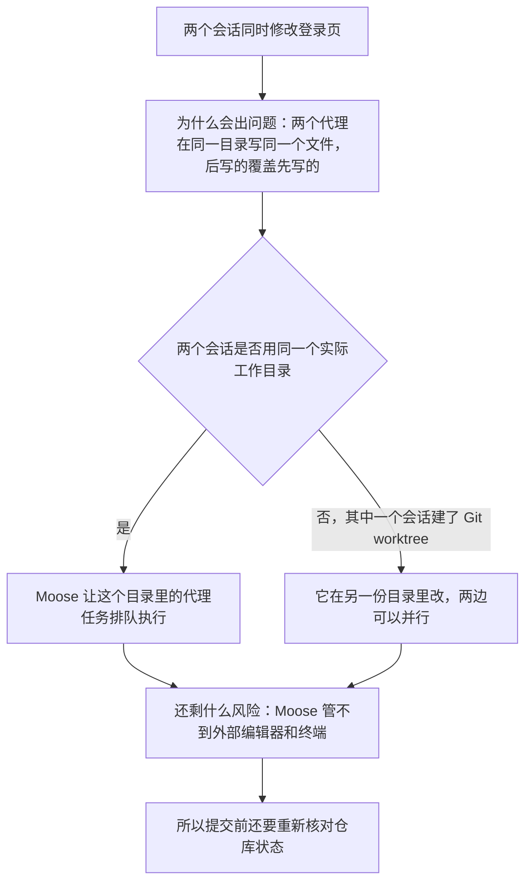
```mermaid
flowchart TD
  A["两个会话同时修改登录页"] --> P["为什么会出问题：两个代理在同一目录写同一个文件，后写的覆盖先写的"]
  P --> B{"两个会话是否用同一个实际工作目录"}
  B -->|"是"| C["Moose 让这个目录里的代理任务排队执行"]
  B -->|"否，其中一个会话建了 Git worktree"| D["它在另一份目录里改，两边可以并行"]
  C --> R["还剩什么风险：Moose 管不到外部编辑器和终端"]
  D --> R
  R --> F["所以提交前还要重新核对仓库状态"]
```

项目价值和可以引用的证据要分开说：

| 可以说 | 不能说 |
| --- | --- |
| 把分散在多个终端里的任务、审批、历史和代码改动集中到一处追踪 | 用户规模、收入或提效比例（目前都没有数据） |
| 安装包变小、查询变快 | 把这些换算成“开发效率提升了多少” |

## 2. 哪些是自己做的，哪些来自底座

**一句话**：Moose 不做模型推理、不执行代理的工具调用，只负责代理之外的应用层流程。

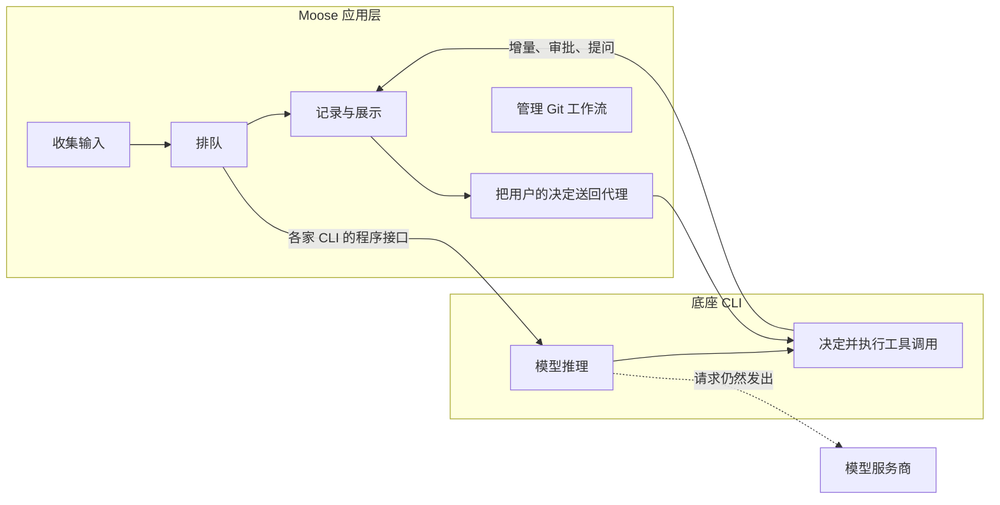
```mermaid
flowchart LR
  subgraph MO["Moose 应用层"]
    I["收集输入"] --> Q["排队"]
    Q --> R["记录与展示"]
    R --> BK["把用户的决定送回代理"]
    GW["管理 Git 工作流"]
  end
  subgraph BASE["底座 CLI"]
    INF["模型推理"] --> TOOL["决定并执行工具调用"]
  end
  Q -->|"各家 CLI 的程序接口"| INF
  TOOL -->|"增量、审批、提问"| R
  BK --> TOOL
  INF -.->|"请求仍然发出"| VEN["模型服务商"]
```

| 部分 | Moose 负责 | 底座或外部工具负责 |
| --- | --- | --- |
| 一轮代理任务 | 收集输入、排队、选择工作目录、显示和保存状态 | 模型推理、决定调用哪些工具、执行工具 |
| 审批与提问 | 展示问题、确认请求仍然有效、把用户的选择送回去 | 发起审批或提问，根据回答继续执行 |
| Plan 与 Goal | 提供入口、保存计划版本、组织“批准后执行” | 原生规划模式、目标状态和后续执行 |
| 子代理 | 接收活动、展示父子关系与历史、转发受支持的控制 | 决定是否委派，创建和运行子代理 |
| 原生历史 | 浏览、导入、记录来源和操作状态 | 提供原生会话、分叉和压缩接口 |
| Git 与 worktree | 展示改动和预览、核对状态、安排调用 | Git 实际修改索引、生成提交、创建和合并工作目录 |
| 配置与扩展 | 选择作用域、预览改动、版本检查、显示诊断 | CLI 写入原生配置，管理插件和认证凭据 |
| 后台命令与定时任务 | 启动和管理命令进程、保存调度、领取到期周期 | 本机 Shell 执行命令；定时发出的代理消息仍由底座处理 |

两个常被忽略的边界：

- **进程归属**：Moose 只管理用户在命令面板或终端里**手动启动**的进程。代理在工具调用里自己启动的进程，由底座管理。
- **本机不等于离线**：数据存在本机，但 CLI 仍会把请求发给模型服务商。

### 先分清几个对象

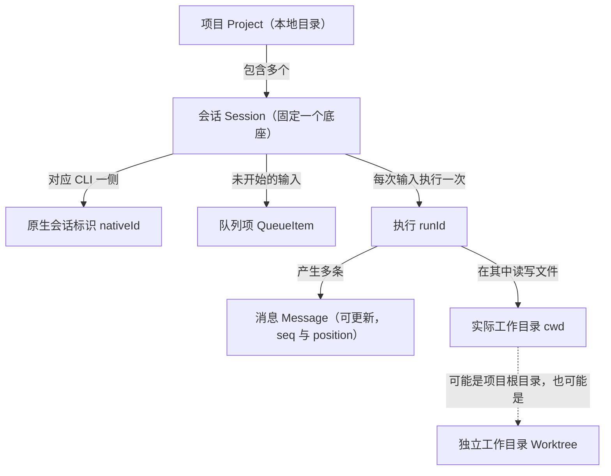
```mermaid
flowchart TD
  P["项目 Project（本地目录）"] -->|"包含多个"| S["会话 Session（固定一个底座）"]
  S -->|"对应 CLI 一侧"| N["原生会话标识 nativeId"]
  S -->|"未开始的输入"| QI["队列项 QueueItem"]
  S -->|"每次输入执行一次"| RUN["执行 runId"]
  RUN -->|"产生多条"| M["消息 Message（可更新，seq 与 position）"]
  RUN -->|"在其中读写文件"| CWD["实际工作目录 cwd"]
  CWD -.->|"可能是项目根目录，也可能是"| WT["独立工作目录 Worktree"]
```

| 对象 | 表示什么 | 为什么要单独区分 |
| --- | --- | --- |
| 项目 `Project` | 加入 Moose 的一个本地目录 | 决定会话归属和默认工作位置 |
| 会话 `Session` | 项目下的一段对话，固定使用一个底座 | 保存模型、权限、草稿等选择 |
| 原生会话标识 `nativeId` | CLI 那一侧的 thread、session 或 sessionFile | 后续发送能接着原来的上下文，而不是每次新开对话 |
| 执行 `runId` | 一次输入在 Moose 中对应的一次执行 | 一轮执行会产生多段回答、多次工具调用和审批 |
| 消息 `Message` | 时间线上一条**可以更新**的记录 | 用 `seq` 判断新旧版本，用 `position` 排序和分页 |
| 队列项 `QueueItem` | 已保存、还没开始执行的输入 | 可以编辑、移除，或等待目录空闲 |
| 实际工作目录 `cwd` | 本轮真正读写文件的目录，可能是项目根目录，也可能是 worktree | 调度、文件预览、终端和 Git 必须用同一个目录 |
| 独立工作目录 `Worktree` | 同一个 Git 仓库的另一份工作目录 | 同一项目的两个会话可以改不同的文件副本 |

#### 例子：会话 S 发了两次需求

| 时刻 | 发生了什么 | 标识怎么变 |
| --- | --- | --- |
| 第一次发送 | 产生执行 R1 | 新的 `runId` = R1 |
| R1 运行中 | 回答、工具调用和审批分别落成记录 | 它们是不同的 `Message` |
| 某条回答从“正在检查”更新成“检查完成” | 同一条记录被改写 | 消息 ID 不变，`seq` 变大，`position` 不变 |
| 第二次发送 | 产生执行 R2 | 新的 `runId` = R2 |

容易混淆的另外两个标识：

| 标识 | 用途 | 不能拿来做什么 |
| --- | --- | --- |
| `requestId` | 标识一次接口操作及其回执 | 不能代替 `runId` 或消息版本 |
| 通知的事件 ID | 只用于通知去重 | 不是消息序号 |

一个 Moose 会话固定一个底座。不同底座的原生上下文格式和恢复方式都不同，不能直接互相迁移。

### 常用技术名词

| 分类 | 名词 | 在本项目里的意思 |
| --- | --- | --- |
| 通信 | IPC | 本机进程之间互相传消息。这里指 Electron 页面和主进程之间的通信 |
| 通信 | Preload | Electron 的桥接脚本，只把少数受限能力暴露给页面，不是独立的业务进程 |
| 通信 | HTTP + SSE | HTTP 用来发请求；SSE（Server-Sent Events）是服务器向浏览器单向持续推送事件的通道。Web 版用它接收实时更新 |
| 通信 | stdio | 程序的标准输入和输出。Moose 往 CLI 子进程的 stdin 写 JSON、从 stdout 读 JSON，不是模拟敲键盘 |
| 协议 | JSON-RPC | 基于 JSON 的调用格式：请求和回复带同一个 `id` 来配对；不带 `id` 的是通知，用来报告进度 |
| 协议 | ACP | Agent Client Protocol，Grok Build 和 OpenCode 使用的代理通信协议 |
| 数据 | 事务 | 一组数据库操作要么全部生效，要么全部不生效 |
| 数据 | WAL | SQLite 的一种日志模式，读写之间互相阻塞更少，但不代表写入可以无限并发 |
| 数据 | Zod | 运行时数据校验库。TypeScript 类型在运行时不存在，收到的真实数据仍需校验 |
| 数据 | 游标分页 | 不按“第几页”取数据，而是“从某个位置往前或往后取 N 条”，数据变化时不会错位 |
| 终端 | PTY | 伪终端，让 Shell 以为自己连着真实终端，vim 这类交互程序才能正常工作 |
| 状态 | 结果未知 | 写请求发出后没收到回执：既不能确定执行了，也不能确定没执行 |

## 3. 为什么分成三类进程

**一句话**：窗口要流畅，慢活（数据库、Git、CLI 子进程）全部放进独立的本机后台。

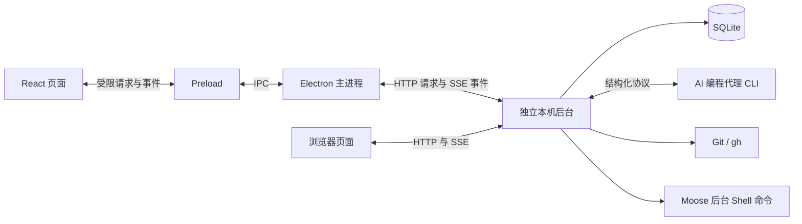
```mermaid
flowchart LR
  UI["React 页面"] <-->|"受限请求与事件"| P["Preload"]
  P <-->|"IPC"| M["Electron 主进程"]
  M <-->|"HTTP 请求与 SSE 事件"| U["独立本机后台"]
  W["浏览器页面"] <-->|"HTTP 与 SSE"| U
  U --> DB[("SQLite")]
  U <-->|"结构化协议"| CLI["AI 编程代理 CLI"]
  U --> G["Git / gh"]
  U --> S["Moose 后台 Shell 命令"]
```

如果都放进 Electron 主进程，一次慢查询就会让整个窗口卡住。

| 进程 | 负责什么 |
| --- | --- |
| React 渲染进程 | 页面和交互；没有 Node 权限 |
| Electron 主进程 | 窗口、菜单、文件选择框、剪贴板、打开系统浏览器 |
| 本机后台 | 调度、SQLite、代理 CLI、Git、Shell 命令和终端 |

| 运行方式 | 后台形态 |
| --- | --- |
| 开发模式 | Electron 的 `utilityProcess` |
| 安装版 | 默认是一个独立的本机服务，桌面和浏览器共用 |

拆开之后要讲清的两点：

| 新问题 | 做法 |
| --- | --- |
| 同步 SQLite 不会卡住窗口，但会卡住后台自己 | 历史要分页，命令输出要设上限 |
| 后台意外退出时，等待中的请求没人回复，按钮会一直转圈 | 进程之间的调用带请求 ID 和超时；后台退出时立即拒绝所有等待中的请求并通知页面 |

### 关掉窗口，任务为什么还在跑

| 操作 | 安装版 | 从源码启动的独立开发模式 |
| --- | --- | --- |
| 普通关窗或退出 | 只断开客户端，后台继续执行任务 | 后台随应用一起退出 |
| 重新打开 | 读取快照和消息，恢复界面 | — |
| 显式“停止后台” | 只有这一步才会结束任务 | — |

### TypeScript 和 Zod 为什么都需要

| 防线 | 什么时候起作用 | 挡住什么 |
| --- | --- | --- |
| TypeScript | 编译时 | 保证前端调用 `scheduleUpdate` 时带上任务 ID、版本和允许修改的字段 |
| Zod（IPC 接收端） | 运行时 | 校验 UUID 格式、枚举值、字符串长度和多余字段 |
| 主进程来源检查 | 运行时 | 只接受来自可信窗口主 frame 的请求 |
| 页面隔离 | 始终 | 关闭 Node 集成，开启 `contextIsolation` 和 sandbox |
| 受限入口 | 始终 | 页面只能通过 `window.moose.request` 和 `subscribe` 两个入口调用后台 |

- TypeScript 管不了运行时实际传进来的数据。
- 页面有 bug 或被注入脚本时，主进程收到什么都有可能，所以运行时还要再校验一遍。

### Web 入口与桌面入口怎样共用

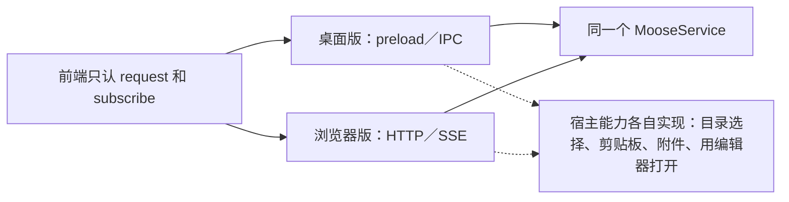
```mermaid
flowchart LR
  F["前端只认 request 和 subscribe"] --> D["桌面版：preload／IPC"]
  F --> B["浏览器版：HTTP／SSE"]
  D --> SVC["同一个 MooseService"]
  B --> SVC
  D -.-> H1["宿主能力各自实现：目录选择、剪贴板、附件、用编辑器打开"]
  B -.-> H1
```

- 两个入口最后都调用同一个 `MooseService`，差异只在宿主能力。
- 要特别注意：后台所在机器的文件路径不等于浏览器所在设备的路径。

#### 数据目录

| 启动方式 | 数据目录 |
| --- | --- |
| 安装版 | 按需在本机回环地址启动共享后台，桌面和浏览器共用原来的数据目录，没有做数据迁移 |
| 从源码启动的独立 Web 工作区 | 使用自己的目录，不会自动合并 |
| 升级后旧版本后台还在运行 | 新客户端拒绝写入，提示先停掉旧后台再启动 |

#### 访问认证

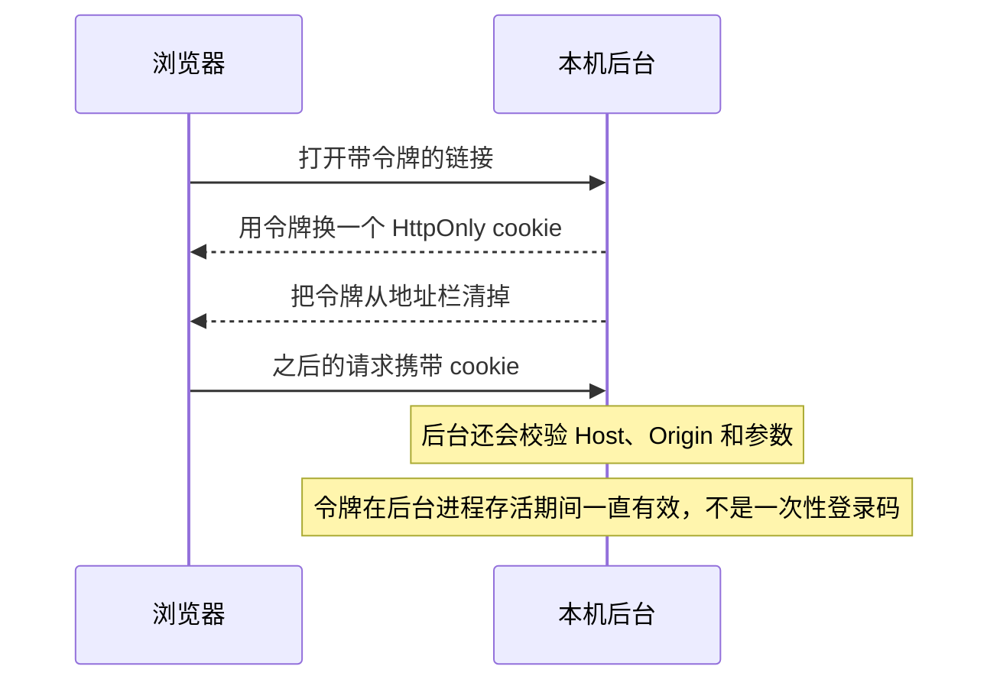
```mermaid
sequenceDiagram
  participant B as 浏览器
  participant S as 本机后台
  B->>S: 打开带令牌的链接
  S-->>B: 用令牌换一个 HttpOnly cookie
  S-->>B: 把令牌从地址栏清掉
  B->>S: 之后的请求携带 cookie
  Note over S: 后台还会校验 Host、Origin 和参数
  Note over S: 令牌在后台进程存活期间一直有效，不是一次性登录码
```

#### 断线重连

| 类型 | 重连后怎么做 | 原因 |
| --- | --- | --- |
| 读 | 重新读取快照和消息，按消息 ID 和版本合并 | 目前没有通用的事件游标，不能重放漏掉的事件 |
| 写 | 不会自动重试 | 没收到回执不等于没执行 |
| 终端输出 | 首次打开和重连时按游标补读，和实时输出重叠的部分去重；缓冲区超限时提示已截断 | 避免重复或静默丢失 |

#### 多个窗口看同一个终端

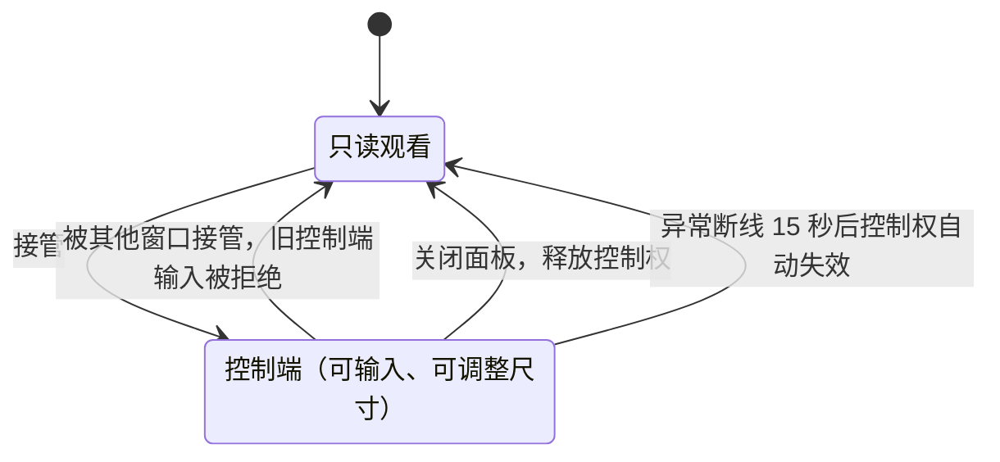
```mermaid
stateDiagram-v2
  state "只读观看" as Viewer
  state "控制端（可输入、可调整尺寸）" as Controller
  [*] --> Viewer
  Viewer --> Controller : 接管
  Controller --> Viewer : 被其他窗口接管，旧控制端输入被拒绝
  Controller --> Viewer : 关闭面板，释放控制权
  Controller --> Viewer : 异常断线 15 秒后控制权自动失效
```

- 所有窗口都可以看，但输入和调整尺寸只归一个控制端。
- 控制权只决定谁能输入，不影响 Shell 是否继续运行。

#### 还没做完的部分

- 高延迟网络下的输入体验。
- 通用的事件游标：目前重连靠重读快照，而不是重放漏掉的事件。

代码入口：[主进程](../../electron/main.ts)、[桥接](../../electron/preload.ts)、[共享后台连接](../../electron/shared-runtime.ts)、[独立模式宿主](../../electron/runtime-host.ts)、[请求类型](../../shared/types.ts)、[参数校验](../../shared/validation.ts)。

## 4. 从按下发送到任务结束

**一句话**：`send` 只确认“已入队”，执行过程和最终状态全部靠后续事件推送。

以需求“修复登录按钮，并补一个测试”为例：

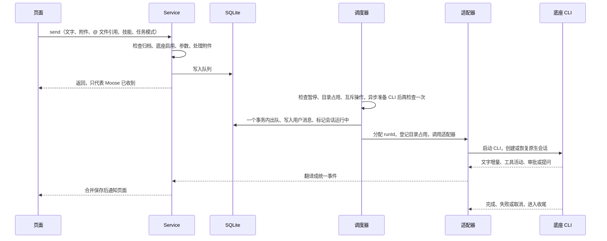
```mermaid
sequenceDiagram
  participant UI as 页面
  participant SV as Service
  participant DB as SQLite
  participant EX as 调度器
  participant AD as 适配器
  participant CLI as 底座 CLI
  UI->>SV: send（文字、附件、@ 文件引用、技能、任务模式）
  SV->>SV: 检查归档、底座启用、参数，处理附件
  SV->>DB: 写入队列
  SV-->>UI: 返回，只代表 Moose 已收到
  EX->>EX: 检查暂停、目录占用、互斥操作，异步准备 CLI 后再检查一次
  EX->>DB: 一个事务内出队、写入用户消息、标记会话运行中
  EX->>AD: 分配 runId，登记目录占用，调用适配器
  AD->>CLI: 启动 CLI，创建或恢复原生会话
  CLI-->>AD: 文字增量、工具活动、审批或提问
  AD-->>SV: 翻译成统一事件
  SV-->>UI: 合并保存后通知页面
  CLI-->>AD: 完成、失败或取消，进入收尾
```

| 步骤 | 做什么 | 要讲清的细节 |
| --- | --- | --- |
| 1. 界面收集输入 | 文字、附件、`@` 文件引用、技能和任务模式 | 新建会话时先显示一个未保存的输入页，第一次发送才真正创建会话 |
| 2. 后台检查并入队 | Service 检查会话是否已归档、底座是否启用、参数是否合法，处理附件，写进 SQLite 队列 | 此时只代表“Moose 已收到”，底座还没开始执行 |
| 3. 调度器挑选任务 | 检查会话是否暂停、实际工作目录是否被占用、有没有互斥操作；目录空闲就准备 CLI（例如查找 CLI 路径） | 准备是异步的，完成后还要再检查一次：用户可能已取消队列，或应用正在退出 |
| 4. 记录执行开始 | 一个数据库事务里完成出队、写入本轮用户消息、把会话标为运行中；再分配 `runId`、登记目录占用、调用适配器 | 三件事要么全部生效，要么全部不生效 |
| 5. 底座处理需求 | 适配器启动 CLI，创建或恢复原生会话，传入工作目录、输入和执行设置 | 底座返回的文字增量、工具活动、审批或提问被翻译成统一事件 |
| 6. 持续保存并显示 | 后台合并同一条记录的连续更新，保存后通知页面 | 审批答案沿原请求送回底座，不会变成一条新的聊天消息 |
| 7. 收尾 | 保存最终状态，让未处理的审批失效，关闭本轮适配器，释放目录，再调度下一条 | 见下图 |

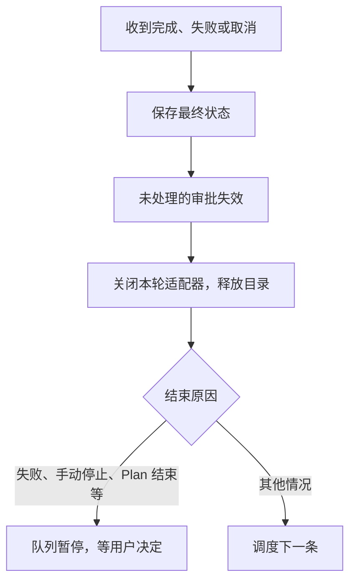
```mermaid
flowchart TD
  E["收到完成、失败或取消"] --> S1["保存最终状态"]
  S1 --> S2["未处理的审批失效"]
  S2 --> S3["关闭本轮适配器，释放目录"]
  S3 --> J{"结束原因"}
  J -->|"失败、手动停止、Plan 结束等"| P["队列暂停，等用户决定"]
  J -->|"其他情况"| N["调度下一条"]
```

这条链路里有两种“返回”，不能当成同一次请求：

| 返回 | 含义 | 为什么分开 |
| --- | --- | --- |
| `send` 请求的返回 | 只确认队列已保存 | 长任务可能持续几十秒甚至几十分钟 |
| 后续事件 | 推送任务过程和最终状态 | 一次请求等不完这么长的任务 |

### 从启动入口定位到执行代码

| 阶段 | 先读的代码 | 要讲清的边界 |
| --- | --- | --- |
| 启动桌面 | [main.ts](../../electron/main.ts) → [desktop-runtime.ts](../../electron/desktop-runtime.ts) → [shared-runtime.ts](../../electron/shared-runtime.ts) | 安装版按需启动或连接共享后台，React 不直接打开数据库 |
| 建立服务 | [web-server.ts](../../electron/web-server.ts) → [store.ts](../../electron/db/store.ts)／[service.ts](../../electron/service.ts) | 一个数据目录只由一个后台持有；默认开发模式走 runtime.ts |
| 选择项目、新建输入页 | [app.tsx](../../src/app.tsx) → 宿主的目录选择 → Service | 保存规范化后的目录；首次发送才创建会话 |
| 提交输入 | [composer.tsx](../../src/components/composer.tsx) → `request('send')` → Service | 区分 Enter 发送和输入法确认；返回只代表已入队 |
| 调度与执行 | [session-execution.ts](../../electron/session-execution.ts) 的 `drain`／`execute` → [AgentAdapter](../../electron/providers/types.ts) | 使用会话的实际目录；推理和工具执行归底座 |
| 保存与展示 | session-execution.ts 的 `accept`／`flush` → Store → [workspace.ts](../../src/lib/workspace.ts) | 按消息 ID 和 `seq` 更新；完成信号与普通增量分开处理 |

- Web 页面的入口不同：它通过 [web-api.ts](../../src/lib/web-api.ts) 发 HTTP 请求、订阅 SSE，再进入同一个 Service。
- 不要把桌面的 preload 路径照搬成浏览器的调用链。

## 5. 不同代理如何接进同一套界面

**一句话**：每家协议一个适配器，向上只输出统一的 `AgentEvent`；界面一样，能力不一定一样。

### 共用界面，分别处理协议

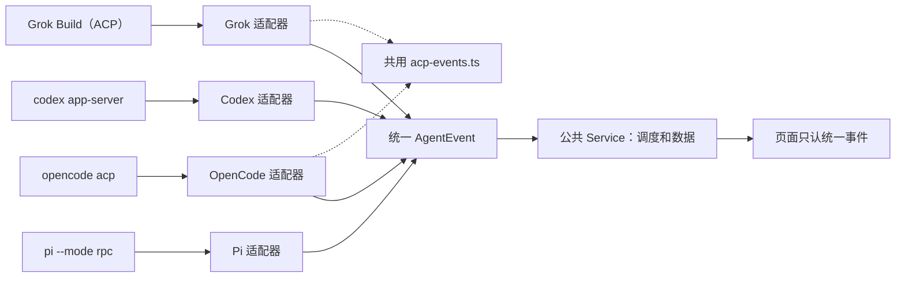
```mermaid
flowchart LR
  C1["codex app-server"] --> A1["Codex 适配器"]
  C2["Grok Build（ACP）"] --> A2["Grok 适配器"]
  C3["pi --mode rpc"] --> A3["Pi 适配器"]
  C4["opencode acp"] --> A4["OpenCode 适配器"]
  A2 -.-> ACP["共用 acp-events.ts"]
  A4 -.-> ACP
  A1 --> EV["统一 AgentEvent"]
  A2 --> EV
  A3 --> EV
  A4 --> EV
  EV --> SV["公共 Service：调度和数据"]
  SV --> UI["页面只认统一事件"]
```

| 底座 | 通信方式 | 怎样延续会话 | 怎样判断一轮结束 |
| --- | --- | --- | --- |
| Codex | `codex app-server`，stdio 上的 JSON-RPC | 创建或恢复 thread，再开始 turn | 对应线程的 `turn/completed`；Goal 模式还要查目标状态 |
| Grok Build | ACP SDK，经 stdio 连接 | 按能力选择 `newSession` 或 `loadSession` | `prompt` 调用返回 |
| Pi | `pi --mode rpc`，每行一个 JSON | 保存 `sessionFile`，之后用它恢复 | `agent_settled`；看到 `agent_end` 还不能结束，之后可能继续重试或压缩 |
| OpenCode v2 | `opencode acp`，stdio 上的 ACP | `session/new` 或 `session/load` | `session/prompt` 返回；调用被受理不等于任务完成 |

- 统一事件的例子：“这是一段回答”“这是工具输出”“这里需要审批”“这一轮结束了”。页面不需要理解各家的原始字段。
- “都用 JSON”不代表协议相同。接入 Pi 时复用了按行读写、请求与回复配对、进程清理这些通用部分，消息格式转换是单独写的；Pi 的 RPC 并不是 Codex 那种 JSON-RPC。

### 为什么不把各家的执行逻辑写进一个大函数

```ts
// 反例（示意）：所有底座挤进同一个执行函数，代码里到处是“如果是 Pi 就……”
if (provider === 'pi') { /* 等 agent_settled，agent_end 之后还可能重试或压缩 */ }
else if (provider === 'grok') { /* 抑制恢复会话时回放的旧历史 */ }
else if (provider === 'codex') { /* 区分 thread、turn 和子线程 */ }

// 实际分工：适配层只统一输入、增量、审批和取消这些接口；
// 完成判断和会话恢复留在各适配器内部，公共 Service 只管调度和数据。
```

差异不只是字段名，还包括语义：

| 底座 | 语义差异 | 不处理会怎样 |
| --- | --- | --- |
| Grok | 恢复会话时可能把旧历史重新回放一遍 | 界面重复显示，需要抑制 |
| Pi | `agent_end` 之后还可能重试或压缩上下文 | 过早结束，必须等 `agent_settled` |
| Codex | 要区分 thread、turn 和子线程 | 由 Codex 适配器单独处理 |

原生历史、Git、配置和后台命令也各有独立模块，避免公共流程里堆满底座分支。

### 界面一样，能力不一定一样

| 能力 | Codex | Grok | Pi | OpenCode |
| --- | --- | --- | --- | --- |
| 运行中插话 | 已接入原生接口 | 已接入原生接口 | Pi 1.x 已接入原生接口 | 没有，只能走普通排队 |
| 权限 | — | — | 没有内置的审批沙箱，只能以完全访问方式运行 | — |

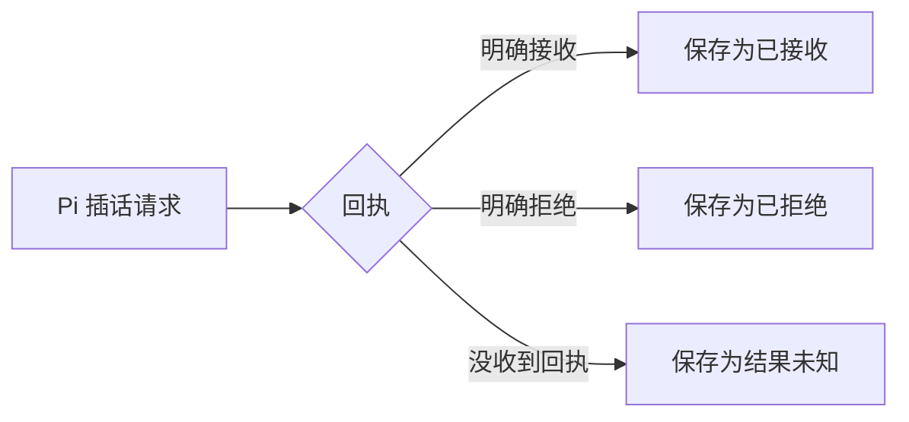
```mermaid
flowchart LR
  ST["Pi 插话请求"] --> R{"回执"}
  R -->|"明确接收"| A["保存为已接收"]
  R -->|"明确拒绝"| B["保存为已拒绝"]
  R -->|"没收到回执"| C["保存为结果未知"]
```

- Pi 的插话回执可以不带原生 turn ID，所以这三种结果要分开保存。
- 不能因为页面上都有发送按钮，就说四个底座都能修改正在执行的回合。
- Pi 的扩展可以弹出确认问题，但这不等于所有工具执行都经过审批。

完整的支持情况集中维护在[能力表](../providers/native-capabilities.md)，这里不重复。页面按已接入的能力开放入口，后台仍会检查 CLI 版本、握手结果和当前会话状态。

### 审批答案怎样送回原来的请求

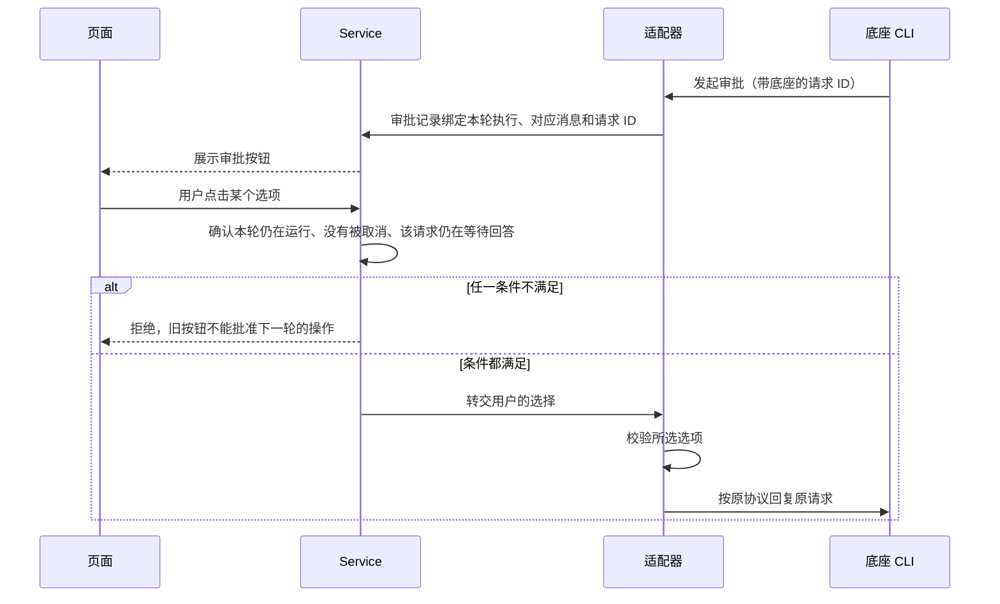
```mermaid
sequenceDiagram
  participant UI as 页面
  participant SV as Service
  participant AD as 适配器
  participant CLI as 底座 CLI
  CLI->>AD: 发起审批（带底座的请求 ID）
  AD->>SV: 审批记录绑定本轮执行、对应消息和请求 ID
  SV-->>UI: 展示审批按钮
  UI->>SV: 用户点击某个选项
  SV->>SV: 确认本轮仍在运行、没有被取消、该请求仍在等待回答
  alt 任一条件不满足
    SV-->>UI: 拒绝，旧按钮不能批准下一轮的操作
  else 条件都满足
    SV->>AD: 转交用户的选择
    AD->>AD: 校验所选选项
    AD->>CLI: 按原协议回复原请求
  end
```

| | 审批 | 提问 |
| --- | --- | --- |
| 问什么 | “这个操作可以执行吗” | “你的需求是什么”（例如改移动端还是桌面端） |
| 答案怎么送回 | 按原问题的 ID 送回 | 按原问题的 ID 送回 |
| 会不会进下一轮聊天 | 不会 | 不会 |

代码入口：[适配器接口](../../electron/providers/types.ts)、[注册入口](../../electron/providers/registry.ts)、[Codex](../../electron/providers/codex.ts)、[Grok](../../electron/providers/grok.ts)、[Pi](../../electron/providers/pi.ts)、[OpenCode](../../electron/providers/opencode.ts)。

### 新增一家 CLI，怎样避免越写越乱

以 OpenCode v2 为例：它通过 `opencode acp` 在 stdin／stdout 上通信，由 CLI 自己启动私有服务。

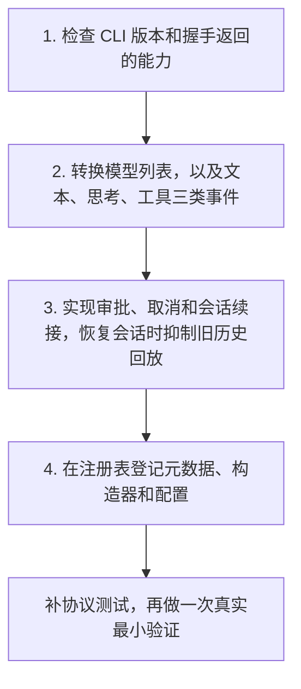
```mermaid
flowchart TD
  S1["1. 检查 CLI 版本和握手返回的能力"] --> S2["2. 转换模型列表，以及文本、思考、工具三类事件"]
  S2 --> S3["3. 实现审批、取消和会话续接，恢复会话时抑制旧历史回放"]
  S3 --> S4["4. 在注册表登记元数据、构造器和配置"]
  S4 --> S5["补协议测试，再做一次真实最小验证"]
```

- Grok 和 OpenCode 共用的 ACP 事件转换放在 `acp-events.ts`，各自独有的控制留在自己的适配器里。

验证范围要如实说：

| 状态 | 内容 |
| --- | --- |
| OpenCode 2.0.10 已验证 | 握手、模型列表，以及在隔离目录里真实写文件、续接、审批批准／拒绝和取消 |
| 0.22.0 起新增 | ACP 历史列表与回放导入 |
| 不代表 | 所有模型和权限配置都通过了 |
| 尚未接入 | Plan、Goal 和额度查询 |
| 仍由 CLI 决定 | 工具权限按 CLI 自己的配置执行 |

## 6. 流式消息和 React 页面如何保持一致

**一句话**：一轮回复拆成多条可更新记录，用 `seq` 防旧覆盖新，约 80 毫秒批量落盘，用请求代次丢弃迟到结果。

### 一轮回复为什么拆成多条记录

```text
runId = R1（一轮执行）
├── 回答记录    "先解释……"              可以追加文字
├── 工具记录    运行命令                 运行中 → 已完成
├── 审批记录    请求批准                 等待 → 已有结果
└── 回答记录    "最后总结……"            可以追加文字

复制回复时：按本轮把正文记录拼起来
```

- 如果只存一个答案字符串，就没法单独更新某个工具的状态或某个审批的结果。
- `runId` 把同一轮的记录归在一起，底座事件里的 key 区分每一条记录。

### 增量和最终结果怎么合并

| 时刻 | 收到什么 | Service 怎么处理 | 页面上看到什么 |
| --- | --- | --- | --- |
| t1 | 增量 `delta`：“已找到” | 追加，`seq` 加一 | 已找到 |
| t2 | 增量 `delta`：“登录问题” | 追加，`seq` 加一 | 已找到登录问题 |
| t3 | 完整 `text`：“已找到登录问题” | 覆盖，`seq` 加一 | 已找到登录问题 |
| 反例 | 如果 t3 也追加 | — | 已找到登录问题已找到登录问题（重复一遍） |

```ts
// 示意：同一条记录的合并规则
if (event.delta) record.text += event.delta;        // 增量：追加
else if (event.text != null) record.text = event.text; // 完整文本：覆盖
record.seq += 1;                                      // 每次更新版本加一

// 数据库和页面都只接受比当前更新的版本
if (incoming.seq <= current.seq) return current;      // 旧版本不能覆盖新版本
```

局限：如果上游自己重复发送了同一段增量又没带标识，`seq` 识别不出来。

### 为什么约每 80 毫秒保存一次

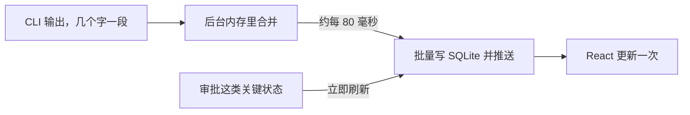
```mermaid
flowchart LR
  CLI["CLI 输出，几个字一段"] --> BUF["后台内存里合并"]
  BUF -->|"约每 80 毫秒"| W["批量写 SQLite 并推送"]
  W --> UI["React 更新一次"]
  AP["审批这类关键状态"] -->|"立即刷新"| W
```

| | 内容 |
| --- | --- |
| 不合并的开销 | 每段都写一次 SQLite、跨进程推送一次、触发一次 React 更新 |
| 合并的收益 | 约每 80 毫秒批量保存和推送一次 |
| 代价 | 进程突然崩溃时，最后还没落盘的一小段增量可能丢失 |
| 不能说 | “每个字到达就已持久化” |

### 切换会话时，迟到的结果怎么办

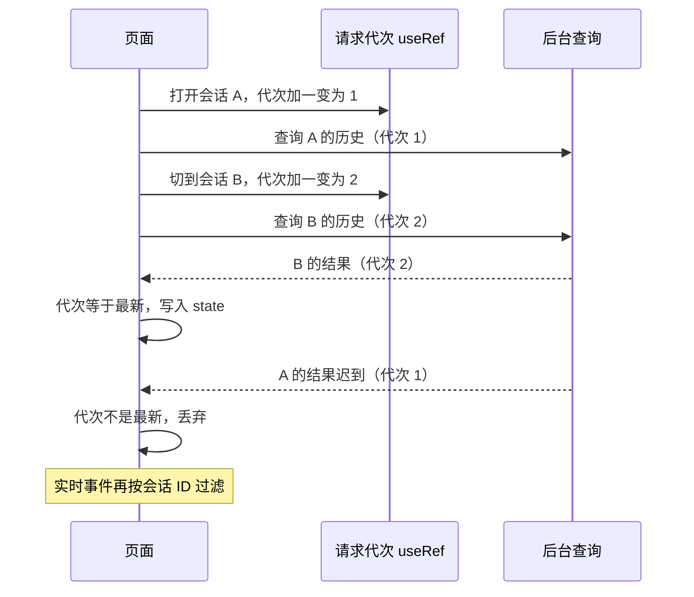
```mermaid
sequenceDiagram
  participant UI as 页面
  participant REF as 请求代次 useRef
  participant API as 后台查询
  UI->>REF: 打开会话 A，代次加一变为 1
  UI->>API: 查询 A 的历史（代次 1）
  UI->>REF: 切到会话 B，代次加一变为 2
  UI->>API: 查询 B 的历史（代次 2）
  API-->>UI: B 的结果（代次 2）
  UI->>UI: 代次等于最新，写入 state
  API-->>UI: A 的结果迟到（代次 1）
  UI->>UI: 代次不是最新，丢弃
  Note over UI: 实时事件再按会话 ID 过滤
```

如果直接使用迟到的 A 结果，B 的界面会被 A 的数据覆盖。

| React 手段 | 放什么 | 为什么 |
| --- | --- | --- |
| `useRef` | 请求代次 | 改它不触发重渲染 |
| state | 要显示的消息 | 变化需要重渲染 |
| effect 清理 | 取消订阅和定时器 | 离开会话后不再接收旧数据 |
| 函数式更新 state | 异步回调里的合并 | 避免旧闭包里的旧值覆盖新消息 |

### 长会话怎么处理

| 手段 | 解决什么 |
| --- | --- |
| 按 `position` 游标分页，每页 80 条，多取一条 | 多取的一条用来判断还有没有更早的内容 |
| 按消息 ID 和 `seq` 合并新旧数据 | 新旧页面数据不冲突 |
| 消息行用 `memo` | 跳过没变化的记录 |
| 滚动组件 | 保持阅读位置 |
| `content-visibility` | 屏幕外的消息少做布局计算 |

#### 0.23.x 减少流式更新时的无效工作

| 优化 | 效果与边界 |
| --- | --- |
| 合并时保留没变化的消息对象，只有位置真的变了才重新排序 | 一万条已加载消息里连续更新最后一条 2,000 次，合并函数耗时从 937 ms 降到 4 ms。这只是单个函数的微基准，不代表整页帧率提升了同样倍数 |
| 文件上下文、翻译函数和消息回调保持引用稳定 | 避免一次快照更新让所有消息行的 `memo` 失效 |
| Markdown 渲染组件的类型保持稳定 | 文字增量到来时不会卸载已有的代码块或重新读取本地图片 |

要主动说明的边界：

- **这不是严格的虚拟列表**，持续向上加载时 DOM 节点仍会增加。
- 一万条历史的测试验证了分页、持久化和交互正常，没有证明同时渲染一万条也不卡。

代码入口：[执行与 flush](../../electron/session-execution.ts)、[前端数据 Hook](../../src/lib/workspace.ts)、[消息合并](../../src/lib/transcript-messages.ts)、[时间线](../../src/components/transcript.tsx)、[滚动组件](../../src/components/ui/message-scroller.tsx)。性能数据见 [0.23.0 验收记录](../releases/0.23.0-validation.md)。

## 7. 排队、并行和重启恢复

**一句话**：Moose 按实际工作目录串行化需要独占的操作，队列先落库；重启后按记录核对状态，结果不明的写操作不自动重试。

### 为什么按实际目录控制并发

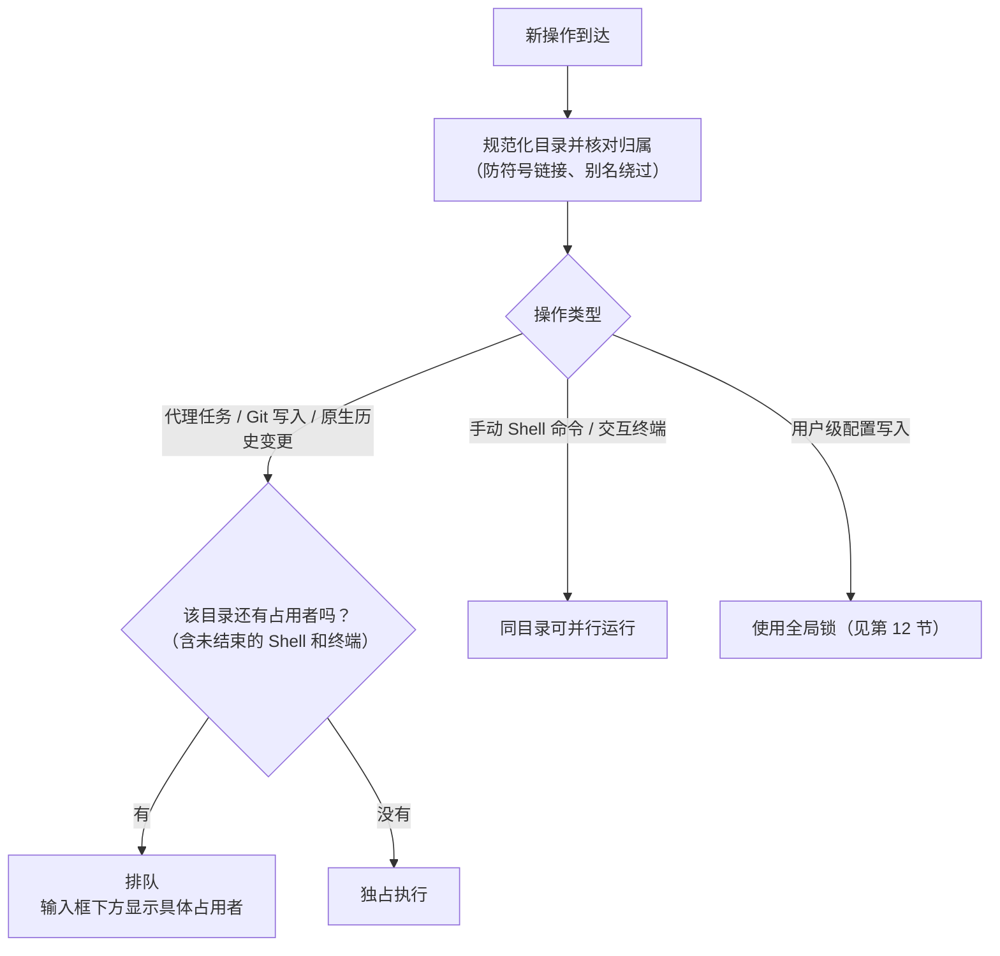
```mermaid
flowchart TD
    A["新操作到达"] --> B["规范化目录并核对归属<br/>（防符号链接、别名绕过）"]
    B --> C{"操作类型"}
    C -->|"代理任务 / Git 写入 / 原生历史变更"| D{"该目录还有占用者吗？<br/>（含未结束的 Shell 和终端）"}
    D -->|"有"| E["排队<br/>输入框下方显示具体占用者"]
    D -->|"没有"| F["独占执行"]
    C -->|"手动 Shell 命令 / 交互终端"| G["同目录可并行运行"]
    C -->|"用户级配置写入"| H["使用全局锁（见第 12 节）"]
```

两个会话即使任务不同，也可能同时改 `App.tsx`，所以调度单位是**实际工作目录**：同目录串行，不同目录可以并行。同一项目想并行改代码，就用 worktree 给会话分配不同目录（见第 10 节）。

| 操作 | 是否独占目录 | 说明 |
| --- | --- | --- |
| 代理任务、Git 写入、原生历史变更 | 独占 | 同一目录内串行 |
| 手动 Shell 命令、交互终端 | 不独占 | 可在同目录并行，但只要还有一个没结束，就会挡住上面那些独占操作 |
| 用户级配置写入 | 全局锁 | 影响所有项目，另用一把锁 |

- 不能笼统地说“同目录所有进程都串行”。
- “为什么还在排队”由后台根据实际占用算出，可以定位到具体占用者，不是前端按等待时长猜的。
- 底座内部的子代理怎么并发，仍由底座决定。

边界：

- 不是操作系统级的文件锁，外部程序照样能改文件。
- 不检测父子目录或重叠的仓库。

### JavaScript 是单线程，为什么还要防竞争

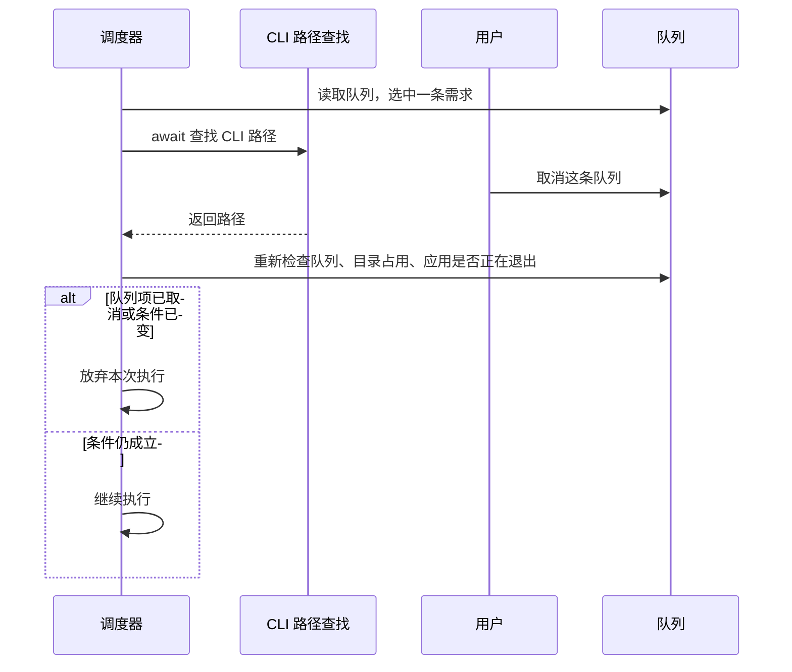
```mermaid
sequenceDiagram
    participant S as 调度器
    participant F as CLI 路径查找
    participant U as 用户
    participant Q as 队列
    S->>Q: 读取队列，选中一条需求
    S->>F: await 查找 CLI 路径
    U->>Q: 取消这条队列
    F-->>S: 返回路径
    S->>Q: 重新检查队列、目录占用、应用是否正在退出
    alt 队列项已取消或条件已变
        S->>S: 放弃本次执行
    else 条件仍成立
        S->>S: 继续执行
    end
```

- 单线程只保证同一时刻只有一段代码在跑，不保证 `await` 前的判断在 `await` 之后仍然成立。
- 如果沿用旧判断，就会执行一条已经失效的需求。
- 对策：调度循环防止重入，每次异步准备结束后重新检查队列、目录占用和应用是否正在退出。

### 队列为什么先写数据库

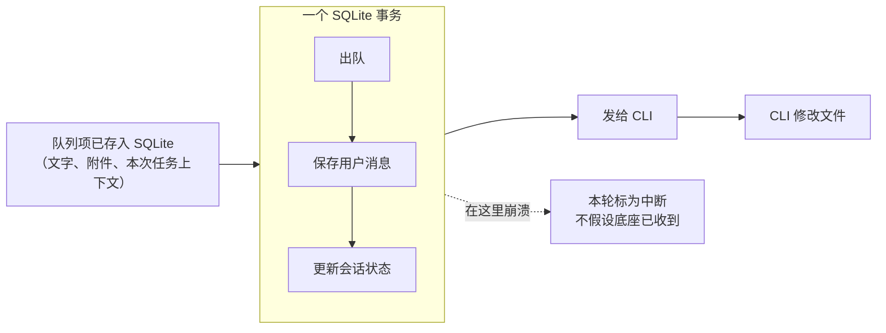
```mermaid
flowchart LR
    Q["队列项已存入 SQLite<br/>（文字、附件、本次任务上下文）"] --> T
    subgraph T["一个 SQLite 事务"]
        T1["出队"] --> T2["保存用户消息"] --> T3["更新会话状态"]
    end
    T --> X["发给 CLI"]
    X --> Y["CLI 修改文件"]
    T -.->|"在这里崩溃"| Z["本轮标为中断<br/>不假设底座已收到"]
```

- 队列项先写进 SQLite，应用退出也不会丢。
- 事务只覆盖数据库，不包括 CLI 调用和文件修改。
- 如果在“出队之后、发给 CLI 之前”崩溃，这一轮标为中断。

队列项不是完整的设置快照：

| 随输入一起保存 | 执行时才读取会话当时的配置 |
| --- | --- |
| 文件引用、技能、模式 | 模型、权限 |

### 重启后能恢复到哪一步

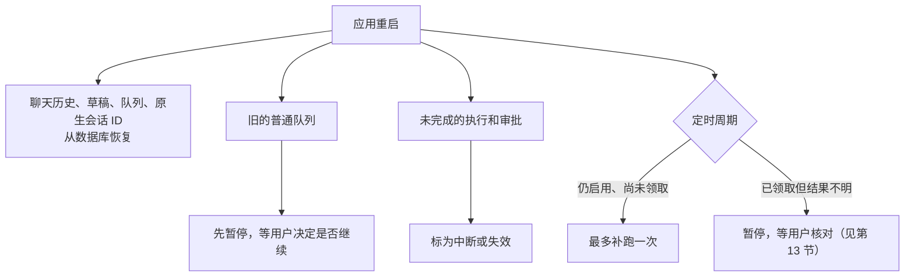
```mermaid
flowchart TD
    R["应用重启"] --> A["聊天历史、草稿、队列、原生会话 ID<br/>从数据库恢复"]
    R --> B["旧的普通队列"] --> B1["先暂停，等用户决定是否继续"]
    R --> C["未完成的执行和审批"] --> C1["标为中断或失效"]
    R --> D{"定时周期"}
    D -->|"仍启用、尚未领取"| D1["最多补跑一次"]
    D -->|"已领取但结果不明"| D2["暂停，等用户核对（见第 13 节）"]
```

| 能恢复 | 不能恢复 |
| --- | --- |
| 聊天历史、草稿、队列、原生会话 ID | 已经退出的 CLI 进程不会复活 |
| 旧的普通队列：先暂停，等用户决定是否继续 | 进程已经改过的文件不会被撤销 |
| 未完成的执行和审批：标为中断或失效 | 不能凭会话 ID 让死掉的 Shell 重新运行 |
| 仍启用、尚未领取的定时周期：最多补跑一次 | 已领取但结果不明的周期：暂停，等用户核对（见第 13 节） |

存储做法：

| 做法 | 好处或边界 |
| --- | --- |
| SQLite 开启 WAL 和外键约束 | — |
| 表结构升级走迁移脚本和事务 | — |
| 历史、关系和排序数据用专门的表 | — |
| 扩展操作、后台命令和调度记录按命名空间存在 settings 的 JSON 里 | 好处：能和其他状态共用一个事务。边界：记录量变大以后，可以再拆成专表并加索引 |

### 为什么要有“结果未知”

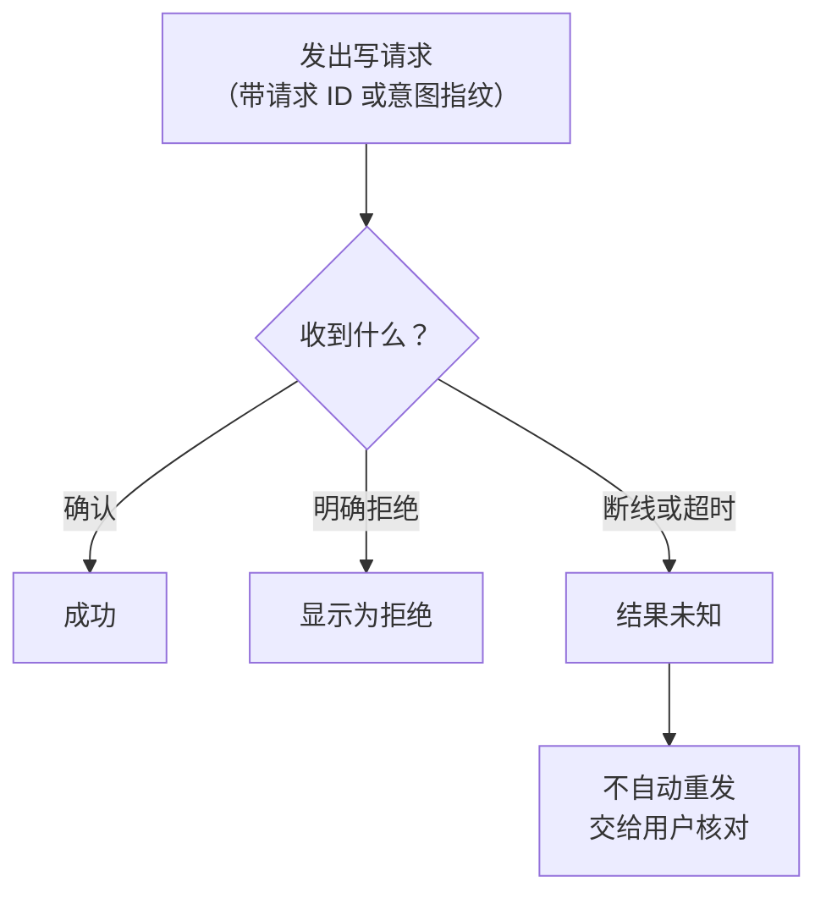
```mermaid
flowchart TD
    A["发出写请求<br/>（带请求 ID 或意图指纹）"] --> B{"收到什么？"}
    B -->|"确认"| C["成功"]
    B -->|"明确拒绝"| D["显示为拒绝"]
    B -->|"断线或超时"| E["结果未知"]
    E --> F["不自动重发<br/>交给用户核对"]
```

- 写请求发出后断线，只能确定“没收到确认”，不能确定对方没执行。
- 自动重试可能重复提交、重复创建任务或重复消耗额度。
- 插话、原生历史变更、Git 提交和扩展管理都会记录请求 ID 或“意图指纹”（对操作内容的摘要）。

两种检查作用不同：

| 检查 | 确认什么 |
| --- | --- |
| 版本检查 | 对象还是用户看到的那个版本 |
| 请求 ID 检查 | 这个请求是否已经提交过 |

边界：SQLite、CLI、Git 和远端服务之间没有共同的事务，所以不能承诺外部操作“严格只执行一次”。

### 长时间运行、断连、休眠和升级，分别怎么恢复

| 情况 | 怎么处理 |
| --- | --- |
| 客户端断开（关桌面窗口或浏览器），后台还活着 | 任务照常继续；重连后读取快照和消息，补读终端输出 |
| 后台崩溃 | 只能根据记录核对状态，不能靠会话 ID 让 Shell 复活 |
| 写操作可能已执行、只是回执丢了 | 标为结果未知，不自动重试 |
| 重连时有待处理的审批 | 不会自动批准 |
| 升级后遇到旧版本后台 | 新客户端拒绝写入，提示先停掉旧后台再启动 |

> **面试时可以这样说**：客户端断开和后台退出是两回事。桌面窗口和浏览器只是界面，数据库、代理进程和终端都在后台。后台还活着时，关窗口任务照常继续，重连后读取快照和消息、补读终端输出；后台崩溃了，就只能根据记录核对状态，不能靠会话 ID 让 Shell 复活。写操作可能已经执行、只是回执丢了，所以标为结果未知，不自动重试；重连也不会自动批准审批。升级后遇到旧版本后台，新客户端拒绝写入，提示先停掉旧后台再启动。

#### 验证到哪一步

| 验证 | 结果 | 边界 |
| --- | --- | --- |
| 协议夹具 | 覆盖了断连和重启的时序 | — |
| Pi、OpenCode 真实运行 | 真实文件写入、跨进程续接和取消；OpenCode 还验证了审批批准／拒绝 | — |
| 0.22.0 发布后，对源码构建跑两小时固定负载 | 720 次循环、180 轮流式任务、119 次 Web 重连、11 次桌面重开，没有应用错误；按相同阶段对比资源占用，没有看到持续累积，结束后没有残留进程 | 自动化负载，不是真实系统休眠，也不是真实模型的长任务 |
| 此前另一次长运行 | 在 4394 秒时因测试窗口意外关闭而失败 | 根因至今没有确认 |
| 真实休眠／唤醒 | 还没有人工验收 | — |

两小时负载的证据见 [0.22.0 证据索引](../releases/0.22.0-evidence.md)。

#### 常见追问

**重连会把漏掉的事件全部重放吗？** 不会。

- 界面靠快照、已保存的消息和终端游标补读，没有通用的全量事件日志。
- SSE 重连成功也不意味着写操作可以安全重试。

**任务从五分钟变成二十分钟，怎么查？**

```text
总耗时 = 排队 + CLI 握手 + 首个输出 + 工具执行 + 等待审批 + 界面更新
         （每段分别测，并在相同底座、模型和输入下对比）
```

- 页面卡顿查渲染进程，工具卡住查子进程。
- 目前还没有统一的跨进程 trace 面板。

**内存测量的边界。**

| 时间 | 场景 | 结果 | 边界 |
| --- | --- | --- | --- |
| 2026-09-21 | 一万条历史反复打开和分页 20 次，共 66 秒 | DOM 没有累积；第 5～20 轮在 GC 后，JS 堆从 10.44 MiB 增到 10.93 MiB | 只是渲染进程的短时场景，不能证明整个应用没有内存泄漏 |

见[长历史测量记录](../releases/runtime-validation-history.md#长历史短时测量2026-09-21)。

代码入口：[目录调度](../../electron/session-execution.ts)、[数据库](../../electron/db/store.ts)、[迁移](../../electron/db/migrations.ts)、[原生操作记录](../../electron/native-history.ts)、[插话记录](../../electron/steering.ts)。

## 8. Plan、Goal 和运行中插话

**一句话**：Plan 是“先出方案、批准某个版本后再做”，Goal 的续跑由底座决定，插话是送进正在运行的回合；三者都由 Moose 后台按模式调用 CLI，而不是把斜杠命令原样转发。

| | 用户想表达的 | 支持的底座 |
| --- | --- | --- |
| **Plan** | “先给我方案，我批准后再做。” | 目前只对 Codex 开放 |
| **Goal** | “按这个目标一直做下去，直到完成或遇到阻碍。” | Codex 和 Grok；Pi 和 OpenCode 尚未接入 |
| **插话** | 在当前任务执行过程中补充要求 | Codex、Grok、Pi 1.x；OpenCode 不支持，走普通队列 |

#### `/plan` 和 `/goal` 是模式选择入口

```mermaid
flowchart TD
    A["输入框里输入 /"] --> B{"选中 Plan mode 或 Goal mode 候选项？"}
    B -->|"是"| C["前端删掉这段文字<br/>把 mode 放进草稿上下文"]
    C --> D["发送：正文和模式一起进入队列"]
    D --> E["后台按模式调用 CLI"]
    B -->|"否，只是在正文里打出 /plan"| F["模式不切换<br/>文字照常作为正文"]
```

- `/plan`、`/goal` 是 **Moose 的模式选择入口**，不是发给 CLI 的命令。
- 选中后草稿上下文里是 `mode: 'plan'` 或 `mode: 'goal'`。

#### `turn/start` 这类名字是什么

```mermaid
sequenceDiagram
    participant M as Moose 后台
    participant C as codex app-server 子进程
    M->>C: 启动本机子进程
    M->>C: 向 stdin 写一行 JSON（id、method、params）
    C-->>M: stdout 返回回复，带同一个 id
    M->>M: 按 id 找到正在等待的调用
    C-->>M: stdout 推送进度通知，不算请求的回复
```

- `turn/start`、`thread/goal/set` 等是 **Moose 后台发给 Codex 的请求名**，不是用户输入的命令，也不是网址。
- 它们走第 5 节说的 stdio 管道，每行是 `{ id, method, params }`，所以“发请求”不一定走 HTTP。
- 源码见[进程启动](../../electron/providers/process.ts)、[请求与回复配对](../../electron/providers/rpc.ts)和 [Codex 适配器](../../electron/providers/codex.ts)。

| 名称 | 含义 |
| --- | --- |
| thread（会话） | Codex 保存对话和任务状态的地方，同一个 thread 可以执行多轮 |
| turn（执行轮次） | 在 thread 里处理一次输入。Plan 的“写方案”和批准后的“执行方案”是两个 turn |
| `turn/start` | 开始一个 turn，把正文和本轮模式交给 Codex |
| `thread/goal/set` | 创建或更新长期目标：目标文字、暂停或继续、可选的 token 预算 |
| `thread/goal/get` | 读取目标当前的状态，供 Moose 判断是否还要等待 |

### Plan：批准的是哪一版计划

以输入 `/plan`、选中“Plan mode”、发送“给登录页加验证码”为例：

```mermaid
sequenceDiagram
    participant U as 用户
    participant B as Moose 后台
    participant D as SQLite
    participant C as Codex
    U->>B: 选中 Plan mode，发送“给登录页加验证码”
    B->>C: collaborationMode/list 询问是否支持规划模式
    B->>C: turn/start（mode 为 plan，文件只读，禁止提权）
    C-->>B: item/plan/delta 等通知逐段返回计划
    B->>D: 存为计划消息，版本 1，暂停会话队列
    U->>B: 修改计划
    B->>D: 保存新正文，版本加一
    U->>B: 批准并执行（带版本号）
    B->>D: 重新检查，同一事务写批准记录和执行任务
    B->>C: 同一会话 turn/start（mode 为 default，恢复原权限）
    Note over B,C: 执行轮收到的是带批准版本号的计划正文
```

- 写方案这一轮权限限制为只读、禁止提权；即使会话平时允许写文件，也不沿用写权限。
- 页面显示“修改计划”和“批准并执行”；规划完成本身不会自动开始写代码。

批准时后台重新检查四个条件，全部满足才放行：

```text
计划已经生成完毕
  且 版本仍是最新
  且 还没被批准过
  且 会话里没有更新的需求
```

“批准记录”和“按此版本执行的新任务”在同一个事务里写入，所以重复点击不会执行两次，也不会执行旧版本。

迟到的批准请求：

| 时刻 | 发生了什么 | 结果 |
| --- | --- | --- |
| T1 | 页面停在计划版本 2 | 按钮看起来仍可点 |
| T2 | 另一处把计划改成版本 3 | 数据库里最新版本是 3 |
| T3 | 针对版本 2 的批准请求到达后台 | 后台拒绝 |

只把旧按钮置灰挡不住迟到的请求，所以后台必须自己检查版本。

代码入口：[模式候选项](../../src/components/context-suggestions.tsx)、[计划展示与按钮](../../src/components/plan-review.tsx)、[计划版本与批准事务](../../electron/plans.ts)、[队列与暂停](../../electron/session-execution.ts)、[Codex Plan 协议](../../electron/providers/codex.ts)。

### Goal：谁来安排下一轮

以输入 `/goal`、选中“Goal mode”、发送“把项目里的类型错误修完”为例。Moose 负责启动任务、显示结果；要不要继续下一轮，由底座的 Goal 机制决定。

#### 选择 Codex 时

```mermaid
sequenceDiagram
    participant B as Moose 后台
    participant C as Codex
    B->>C: thread/goal/set（目标文字，状态暂停，可选 token 预算）
    B->>C: turn/start 先把正文当普通任务执行一轮
    C-->>B: 这一轮结束
    B->>C: thread/goal/get 查询目标状态
    alt 已完成、受阻、达到预算或额度上限
        B->>B: 任务结束
    else 仍需继续
        B->>C: thread/goal/set 把目标改为 active
        loop Codex 每完成一轮
            C-->>B: 一轮完成
            B->>C: thread/goal/get
            Note over B: 仍在继续就等待，进入终止状态就结束等待
        end
    end
    opt 用户停止任务或断开连接
        B->>C: 尝试把仍在继续的目标改回暂停
    end
```

- 后续轮次由 Codex 安排，Moose 只负责查询状态、决定是否还要等待。

#### 选择 Grok 时

```text
实际发给 Grok 的内容（ACP 的 session/prompt）：
/goal 把项目里的类型错误修完
```

| 底座 | Goal 怎么实现 | Moose 等什么 |
| --- | --- | --- |
| Codex | `thread/goal/set` 和 `thread/goal/get` | 目标进入完成、受阻或达到上限等终止状态 |
| Grok | 后台在正文前加上 `/goal `，通过 ACP 的 `session/prompt` 发送，由 Grok 自己处理 | 这次调用返回即可；不使用 Codex 的 `thread/goal/*` 接口 |
| Pi、OpenCode | 尚未接入 Goal | — |

代码入口：[模式候选项](../../src/components/context-suggestions.tsx)、[Codex Goal 协议与状态等待](../../electron/providers/codex.ts)、[Grok ACP 命令](../../electron/providers/grok.ts)。

### 插话：和下一条排队消息有什么不同

| | 普通发送 | 插话 |
| --- | --- | --- |
| 什么时候生效 | 等当前任务结束后再开始 | 送进正在运行的回合 |
| 由谁保存和调度 | Moose 的持久化队列 | 底座接收后自行处理 |
| 各底座的接口 | — | Codex：带 `expectedTurnId` 的 `turn/steer`；Grok：ACP 扩展 `_x.ai/interject`；Pi 1.x：原生 `steer`；OpenCode：不支持，走普通队列 |

```mermaid
sequenceDiagram
    participant U as 用户
    participant B as Moose 后台
    participant D as SQLite
    participant P as 底座
    U->>B: 运行中补充一句要求
    B->>D: 先记录这次投递
    B->>P: 调用插话接口（Codex 带 expectedTurnId）
    alt 底座确认
        B->>D: 标为已接收（queued 只表示收到）
    else 回合已经结束
        B->>U: 保留输入，让用户决定
    else 断连或超时
        B->>D: 标为结果未知，不改成新任务重发
    end
    U->>B: 停止任务
    B->>P: 先清掉底座里还没投递的插话
    B->>P: 再取消任务
```

- `expectedTurnId` 确保插话进的是用户看到的那个回合，而不是已经换掉的新回合。
- 底座返回 `queued` 只表示它收到了，不表示模型已经采纳。
- 停止时先清插话再取消，防止迟到的插话变成下一轮的输入。

插话不能做的事：

- 不能让代理停在某一行代码。
- 不能撤回已执行的操作。
- 不能悄悄改变本轮的模型、权限或模式。

代码入口：[投递状态](../../electron/steering.ts)、[Codex](../../electron/providers/codex.ts)、[Grok](../../electron/providers/grok.ts)、[Pi](../../electron/providers/pi.ts)。

## 9. 原生历史与子代理

**一句话**：CLI 自己的历史只读导入、关联原生 ID，不改源数据也不双向同步；子代理由底座决定是否派出，Moose 只负责识别、展示和守住审批与完成状态的规则。

### 为什么还要读取 CLI 自己的历史

```mermaid
flowchart LR
    A["用户直接在终端里<br/>和 CLI 聊过的会话"] --> B{"底座"}
    B -->|"Codex"| C["原生历史接口"]
    B -->|"Grok、OpenCode"| D["ACP 列出并回放会话"]
    B -->|"Pi"| E["只读解析本地 JSONL<br/>沿当前分支还原对话"]
    C --> F["分页读取<br/>限制游标、条目数、文本大小"]
    D --> F
    E --> F
    F --> G["核对工作目录和来源<br/>识别重复导入"]
    G --> H["可读记录和原生 ID<br/>关联到 Moose"]
```

这些会话不在 Moose 的数据库里，为了能接着继续工作，Moose 提供浏览、预览和导入。

- 限制游标、条目数和文本大小，是为了防止死循环或内存耗尽。
- 原生历史本身不被修改；Pi 的源文件也不改写。
- 不做持续的双向同步。

### 编辑、分叉、压缩分别改变什么

| 操作 | 解决什么问题 | **不会**自动发生什么 |
| --- | --- | --- |
| 编辑最新一条用户消息 | 修正刚才的需求：替换最后一轮并重新执行 | 不会撤销上一轮已经改过的文件 |
| 原生分叉 | 从某个历史节点另开一段对话，保留来源关系 | 不会创建独立的代码目录 |
| 手动压缩 | 让底座整理上下文，控制上下文长度 | 不会删除 Moose 的聊天记录 |

- 目前只有 Codex 接入了分叉和压缩的原生接口。
- 如果某个底座只能用可见文字重建上下文，就不能说是完整复制了内部状态。

### 子代理是不是 Moose 派出来的

不是。是否委派、委派给谁，由底座根据任务和自身配置决定，Moose 不强制拆分任务。

```mermaid
sequenceDiagram
    participant P as 主代理（底座）
    participant S as 子线程
    participant M as Moose
    participant U as 用户
    P->>S: 底座自行决定委派
    S-->>M: 子线程事件
    M->>M: 识别委派，区分父子线程
    S->>M: 子线程发起审批
    M->>U: 走主任务关联的审批流程
    Note over M,U: 历史面板不能代为批准
    S-->>M: 子线程完成
    Note over M: 父任务不因此标为完成
```

| 底座 | 提供什么 | Moose 能做什么 |
| --- | --- | --- |
| Codex | 结构化的父子关系和历史 | 展示子线程，对子线程发送消息和停止 |
| Grok | 只有 ACP 工具活动 | 只展示这些活动，不伪造一棵完整的子线程树 |

- 控制请求被底座接收，也不代表子任务已经完成。
- 在 Codex 里用 `thread/resume` 打开一个已结束的子线程，只是把它的历史加载出来，不会让它重新运行；要继续那部分工作，需要主代理重新委派。

### 为什么有时看不到“思考”

```mermaid
flowchart TD
    A["Moose 订阅思考相关事件<br/>向 Codex 请求 summary: auto"] --> B{"底座返回了摘要或 thought 文字？"}
    B -->|"是"| C["显示"]
    B -->|"否"| D["不显示<br/>只说明这次调用没有摘要"]
```

- 一次探测中回答正常、却没有返回任何摘要，这只能说明那次调用没有摘要，不能推断所有模型都不支持。
- 准确的说法是“展示底座提供的思考摘要或 thought 内容”。协议没给的内部推理，客户端拿不到。

代码入口：[历史协调](../../electron/native-history.ts)、[Codex 原生会话](../../electron/providers/codex-sessions.ts)、[Grok 原生会话](../../electron/providers/grok-sessions.ts)、[Pi 历史](../../electron/providers/pi-sessions.ts)、[ACP 历史](../../electron/providers/acp-sessions.ts)、[子代理事件转换](../../electron/providers/codex-subagents.ts)。

## 10. 用 worktree 隔离代码修改

**一句话**：会话分叉只隔离对话，worktree 才隔离文件；合并分预览和确认两步，清理前逐项检查，宁可阻止也不误删。

```text
项目 shop
├─ 会话 A → 项目根目录       → 当前分支
├─ 会话 B → worktree/login   → 登录修复分支
└─ 会话 C → worktree/search  → 搜索改进分支
```

Git worktree 可以为同一个仓库提供多个工作目录，各自在不同分支上，所以 B 和 C 可以并行改代码。

| | 会话分叉 | worktree |
| --- | --- | --- |
| 隔离对话 | 是 | 新建一个空白会话 |
| 隔离文件 | 否 | 是，独立工作目录和分支 |

创建 worktree 时：

- Moose 从指定的 ref 创建分支和受管的 worktree，并为它新建一个空白会话。
- 原会话的目录和原生 ID 不变。
- 未提交的文件、依赖目录和聊天历史都不会自动复制过去。

必须跟着切换到各自目录的东西：文件引用、技能、代理、命令、Git diff 和“用编辑器打开”。如果只改了 CLI 的 `cwd`，就会出现“代理改的是 A 目录，用户看到的 diff 却是 B 目录”的错位。

### 合并为什么分两步

```mermaid
flowchart TD
    A["第一步：预览<br/>来源提交、项目根目录当前的目标分支、双方 diff"] --> B{"预览后状态有变化吗？"}
    B -->|"有"| A
    B -->|"没有"| C["开始合并<br/>相关两个目录暂停新写入，其他 worktree 照常"]
    C --> D{"有冲突？"}
    D -->|"没有"| E["停在可检查的暂存结果上"]
    E --> F["第二步：用户确认后提交"]
    D -->|"有"| G["用户在目标目录里修改<br/>标记已解决并暂存"]
    G --> H{"用户选择"}
    H -->|"完成"| F
    H -->|"中止"| I["中止合并"]
```

- 即使没有冲突，也先停在暂存结果上，用户确认后再提交。
- 合并中途应用重启：Moose 同时核对 Git 的实际状态和自己的记录，保留冲突现场供用户继续或中止，不会只凭数据库状态重新执行 merge。

### 为什么清理这么谨慎

```mermaid
flowchart TD
    A["请求删除 worktree"] --> B{"有运行中或排队的任务？"}
    B -->|"有"| X["阻止清理，交给用户处理"]
    B -->|"没有"| C{"有未提交的改动？"}
    C -->|"有"| X
    C -->|"没有"| D{"有未跟踪或被忽略的文件？<br/>（包括 node_modules）"}
    D -->|"有"| X
    D -->|"没有"| E{"有还没合并的提交？"}
    E -->|"有"| X
    E -->|"没有"| F{"用户选择了保留？"}
    F -->|"是"| Y["不自动清理"]
    F -->|"否"| G["删除 worktree<br/>保留分支和聊天记录"]
```

- 连 `node_modules` 这类被忽略的目录也会阻止清理，需要用户先处理。
- 清理后，旧会话不会悄悄退回项目根目录去写文件。

验证与边界：

| 项目 | 内容 |
| --- | --- |
| 验证方式 | 真实的临时 Git 仓库，覆盖创建、冲突、继续、中止和清理 |
| 0.22.x 回归 | 冲突状态下桌面重开后，通过界面完成或中止合并 |
| 隔离不了的 | 端口、外部数据库、远端资源和共享配置 |

代码入口：[worktree 管理](../../electron/worktrees.ts)、[worktree 的 Git 操作](../../electron/worktree-git.ts)、[真实 Git 验收](../releases/feature-validation-history.md#worktree)。

## 11. Git 提交、PR 和原生代码审查

**一句话**：提交前后各核对一次，保证用户确认的就是实际提交的；PR 只建草稿、不自动推送；代码审查另开只读线程，结果如实标注为底座输出。

### 用户确认的内容和实际提交的内容要一致

改动面板的分类：

| 分类 | 说明 |
| --- | --- |
| 已暂存 | 同一个文件可以同时有已暂存和未暂存的部分 |
| 未暂存 | 暂存按文件进行 |
| 未跟踪 | 新文件 |

面板里也包括代理运行**之前**就存在的改动，所以不能把它们都标成“本轮 AI 生成”。

```mermaid
sequenceDiagram
    participant U as 用户
    participant B as Moose 后台
    participant G as Git
    U->>B: 打开提交预览
    B->>G: 读取已暂存的文件和 diff
    B-->>U: 展示预览，记下分支、HEAD、暂存区内容指纹
    Note over G: 另一个终端可能执行了 git add
    U->>B: 点击提交
    B->>G: 再核对一次指纹
    alt 预览之后暂存区变了
        B-->>U: 要求重新预览
    else 一致
        B->>G: 提交（保留用户的 hooks 和签名配置）
        B->>G: 核对实际提交的文件树
        opt 和预览不一致（hook 或外部程序改了内容）
            B-->>U: 告知已生成的 commit 供检查，不擅自回滚
        end
    end
```

- 提交后不一致时，不会假装符合预览，也不会擅自回滚。

安全细节：

| 做法 | 说明 |
| --- | --- |
| Git 命令以参数数组调用，路径按字面处理 | 避免路径被当成命令解析 |
| 读取 diff 时关闭外部 diff 工具和 textconv | — |
| 还没结束的 merge、rebase、cherry-pick | 不能被普通提交绕过 |

### 创建 PR 的边界

```mermaid
flowchart TD
    A["明确 origin、源分支、已推送的 HEAD、目标分支"] --> B["预览：先 fetch 目标分支<br/>用本地 Git 对象生成 diff"]
    B --> C{"相同源分支和目标分支<br/>已有打开的 PR？"}
    C -->|"有"| D["直接返回原链接"]
    C -->|"没有"| E["创建前再校验一次"]
    E --> F["通过本机 gh 创建 GitHub 草稿 PR<br/>请求 ID 防止重复创建"]
    F -.->|"连接中断"| G["保留结果未知"]
```

不做的事：

- 不会自动推送分支。
- 暂不支持跨 fork、GitHub 企业版和其他代码平台。

### 原生代码审查为什么另开线程

| | 执行任务的会话 | 审查线程 |
| --- | --- | --- |
| 上下文 | 已经带着任务上下文 | 新建的干净线程 |
| 权限 | 有写权限 | 只读 |
| 调用 | — | Codex 的 `review/start` |
| 结果保存 | — | 审查结果、状态和停止入口单独保存 |

- 可以审查：未提交的改动、相对某个分支的 diff、某个 commit。
- 文件路径和行号直接采用底座返回的值。

要如实说明：

- 审查会消耗额度。
- 可能漏报或误报，不能代替测试。
- 不是 Moose 自研的静态分析器。

代码入口：[Git 操作](../../electron/git-actions.ts)、[审查管理](../../electron/review-workbench.ts)、[PR 操作](../../electron/pull-requests.ts)、[Git 与审查验收](../releases/feature-validation-history.md#git-与原生审查)。

## 12. 配置、MCP、插件与认证

**一句话**：Moose 只写底座确认可写的用户级配置，写前带版本、写后核对生效值，写入期间用全局锁暂停调度；新 MCP 默认禁用，敏感信息不进页面和数据库。

### 先分清几类扩展

| 概念 | 是什么 |
| --- | --- |
| Skill | 给代理阅读的操作说明（`SKILL.md`） |
| MCP | 让代理连接外部工具或资源的协议 |
| 插件 | 由底座管理的扩展能力包 |
| Hook | 在特定事件发生时触发的脚本 |

它们彼此有关联，但配置方式各不相同。设置里的 **扩展（Extensions）** 页管理所选底座的**用户级**配置：

| 底座 | 已接入 | 未开放或需在别处完成 |
| --- | --- | --- |
| Codex | 查看配置来源、默认模型、MCP、插件和 MCP 的 OAuth 登录 | 项目级配置写入、Hooks 编辑 |
| Grok、Pi、OpenCode | 各自的一部分用户级管理 | 项目级配置写入、Hooks 编辑；OAuth 仍需在 CLI 里完成 |

- 各底座具体支持什么，见[能力表](../providers/native-capabilities.md)。
- 早期“只有 Codex 支持配置管理”的说法已经过时。

### 为什么先显示“来源”，再允许修改

一个配置项的最终值可能来自用户级、项目级、profile 或组织下发的受管理配置。用户改了却不生效，往往是别的层级优先级更高。

```mermaid
sequenceDiagram
    participant U as 用户
    participant B as Moose 后台
    participant A as 底座
    B->>A: 读取每项配置的来源
    B-->>U: 显示来源，只允许改底座确认可写的用户层
    U->>B: 修改配置
    B->>A: 写入前重新读取版本
    B->>A: 带 expectedVersion 写入用户层
    B->>A: 保存后重新连接，读取实际生效的值
    alt 被其他层覆盖
        B-->>U: 给出诊断
    else 生效
        B-->>U: 显示新值
    end
```

- `expectedVersion` 避免覆盖别处刚做的修改。
- 插件的安装和卸载调用经过验证的 CLI 命令，启用和停用走配置接口。
- 协议里出现的字段，不会直接当成稳定能力开放。

### 为什么配置写入要用全局锁

```mermaid
flowchart TD
    A["请求写用户级配置"] --> B{"有任务正在运行<br/>或有目录操作？"}
    B -->|"有"| C["拒绝写入"]
    B -->|"没有"| D["加全局配置锁<br/>暂停调度新任务"]
    D --> E["写入配置"]
    E --> F["释放锁，恢复调度"]
    S["调度器的异步查询返回"] --> T{"配置锁还在？"}
    T -->|"在"| U["不启动新任务"]
    T -->|"不在"| V["继续调度"]
```

目录锁只保护一个工作目录，而用户级配置会影响所有项目，所以需要全局锁。

| 做法 | 解决什么 | 代价/边界 |
| --- | --- | --- |
| 有任务运行或有目录操作时拒绝写配置，写入期间暂停调度 | 用户级配置影响所有项目，目录锁管不到 | 用户必须等任务结束才能改配置 |
| 调度器异步查询返回后重新检查配置锁 | `await` 期间锁状态可能已变（同第 7 节） | — |
| 全局锁本身 | — | 只约束 Moose 自己，挡不住外部终端直接改配置文件 |

### 新注册的 MCP 为什么默认不启用

```mermaid
flowchart TD
    A["新建 HTTP 或 STDIO 类型的 MCP"] --> B["预览"]
    B --> C{"其他配置层已有同名项？"}
    C -->|"有"| D["不覆盖它"]
    C -->|"没有"| E["以禁用状态写入"]
    E --> F["用户单独启用"]
    F --> G["STDIO 类型此时才在本机启动程序"]
```

注册和运行是两回事：STDIO 类型的 MCP 一启用就会在本机启动一个程序，所以保存时不应立即运行。

| 字段 | 怎么保存 |
| --- | --- |
| STDIO 的命令和参数 | 分字段保存，不拼成一段 Shell 文本 |
| 环境变量 | 只填变量名，不保存密钥的值 |

### OAuth 和敏感信息怎么处理

```mermaid
sequenceDiagram
    participant U as 用户
    participant M as Moose
    participant A as 底座
    participant W as 系统浏览器
    U->>M: 登录某个 MCP
    M->>A: 请求登录
    A-->>M: 底座发起认证，返回授权链接
    M->>M: 检查授权链接，不写进聊天记录或数据库
    M->>W: 在系统浏览器中打开
    U->>W: 完成授权
    A-->>M: 报告完成
    opt 用户取消或超时
        M->>A: 只关闭这次连接，不撤销服务端已有的凭据
    end
```

| 页面能拿到 | 页面拿不到 |
| --- | --- |
| 白名单里的展示字段 | 完整配置、命令、请求头、环境变量的值 |

- 诊断信息不直接透传原始报错。
- 操作回执只保存意图指纹，不重复保存 MCP 配置正文。
- 边界：以上保护只覆盖配置链路。代理的回复和命令输出仍会进入历史记录，如果它们自己打印了密钥，Moose 没有全局自动脱敏。

代码入口：[配置操作协调](../../electron/extensions.ts)、[Codex 配置适配](../../electron/providers/codex-extensions.ts)、[其他底座的用户配置](../../electron/providers/user-extensions.ts)、[插件 CLI](../../electron/providers/codex-plugins.ts)、[MCP 输入约束](../../shared/mcp-registration.ts)。

## 13. 后台命令与定时任务

**一句话**：命令和终端跑在共享后台里，关窗不停；定时任务先“领取”周期再执行，错过的周期最多补跑一次，结果不明就标为未知、不自动重跑。

### 两种运行命令的方式

| | 命令面板 | 交互终端 |
| --- | --- | --- |
| 适合 | 一次性命令 | vim 等需要终端的交互程序 |
| 技术 | 直接通过管道读写 stdin／stdout／stderr | PTY 伪终端，页面用 xterm.js 显示 |
| 能做什么 | 查看输出、向 stdin 发送文字或结束符（EOF）、停止进程 | 完整的终端体验，可停靠在弹窗、底部或右侧 |

命令面板的例子：

```bash
# 命令会读入用户在界面上输入的一行文字，再原样打印
read line; printf '%s' "$line"
```

终端面板的行为（0.21.3 起统一，操作步骤见[使用指南](../usage.md#终端命令与定时任务)）：

| 操作 | 行为 |
| --- | --- |
| 打开面板 | 没有标签就新建一个 Shell，已有则复用 |
| 切换停靠位置 | 不会重建进程 |
| 关闭最后一个标签，或最后一个 Shell 自己退出 | 面板自动收起 |
| 只是隐藏面板 | Shell 仍然保留 |

保留量：

| 内容 | 保留多少 |
| --- | --- |
| 命令输出 | 最近约 128K 字符 |
| 命令记录 | 每个项目最近 100 条 |
| 旧的请求记录 | 仍保留，用来识别重复请求 |
| stdin 的输入 | 不单独记录，但命令自己可能把它回显到输出里 |

### 关窗口、退出、崩溃是三种情况

| 情况 | 结果 |
| --- | --- |
| 安装版关窗或普通退出 | 共享后台、命令和终端继续运行 |
| 显式停止后台 | 这时才清理进程 |
| 后台被强制结束 | 父进程管道关闭，监视逻辑清理它启动的命令进程组 |
| 重启后 | 不按旧 PID 杀进程，因为 PID 可能已被别的程序复用；无法确认结果的旧记录标为未知，不自动重跑 |

- 独立开发模式下，后台随应用退出。
- 主动脱离进程组的守护程序，目前没有完整的生命周期保证。

### 定时器只是入口，关键是持久化

调度记录保存：内容、绝对时间、时区、间隔、启用状态和上次结果。

```mermaid
sequenceDiagram
    participant T as 定时检查
    participant S as 调度器
    participant D as SQLite
    participant P as 命令进程
    T->>S: 发现某个周期到期
    S->>S: 检查目录是否空闲、上一轮是否结束
    alt 代理消息
        S->>D: 同一事务内领取周期并入队
        Note over S,D: 沿用绑定会话的底座、模型和权限，以普通模式排队
    else 命令
        S->>D: 先记录领取
        S->>P: 再启动进程
    end
```

- 原则是**先“领取”这个周期，再执行有副作用的操作**。
- 这样重启后能分清哪些周期已经处理过。

### 休眠期间错过了十次，要补跑十次吗

不要。以每分钟一次的任务、电脑休眠十分钟为例：

| 时刻 | 发生了什么 | 结果 |
| --- | --- | --- |
| 休眠开始 | 电脑进入睡眠 | 不会唤醒电脑，睡眠期间不保证准时 |
| 休眠中的十分钟 | 本应触发十次 | 都没有执行 |
| 唤醒后 | 调度器发现错过十个周期 | 合并为最多补跑一次 |
| 补跑之后 | 计算下次时间 | 下次时间推到未来，不会连跑十次 |
| 补跑还没结束时又到期 | 上一轮仍在运行 | 不会重叠启动下一轮 |

两种时间规则：

| 规则 | 怎么算 | 注意 |
| --- | --- | --- |
| 固定间隔 | 按实际经过的时长 | “每隔 24 小时”在夏令时切换时与“每天当地九点”不同 |
| 日历规则 | 按指定时区的每天或每周某个钟点，可预览接下来几次的时间 | — |

- 目前不支持每月规则或任意 cron 表达式。
- 安装版退出后共享后台仍能继续调度，但没有开机自启。

### 编辑和恢复有哪些限制

重启后先核对事实，再决定状态：

```mermaid
flowchart TD
    A["重启后读取调度记录"] --> B{"这一次是什么情况？"}
    B -->|"命令已有结果"| C["恢复成最终状态"]
    B -->|"代理消息还在队列里"| D["保留关联，暂停后续触发<br/>由用户在原会话中恢复或移除"]
    B -->|"无法确认"| E["标为未知"]
```

编辑规则：

- 必须先暂停，才能编辑名称、类型、正文、时间和间隔；保存后仍是暂停状态，需要单独恢复。
- 后台会检查版本。已经被领取、正在排队或运行的那一次不能换内容。
- 已执行过的单次任务不能再恢复。
- “创建”请求的指纹和后续编辑分开保存。重试原来的创建请求只会返回已有任务，不会因为名称改过就当成新请求，也不会覆盖内容或解除暂停。

代码入口：[命令生命周期](../../electron/command-jobs.ts)、[调度器](../../electron/schedules.ts)、[后台记录](../../electron/background-store.ts)、[定时任务编辑](../../src/components/schedule-form.tsx)、[测试方法](../testing.md)。

## 14. 输入体验和安全边界

**一句话**：文件引用、附件和技能在执行前都会再次校验；前端照顾输入法、键盘、可访问性和动效；安全按页面、后台、代理三层分别说明，前端禁用按钮不是防线。

### 文件引用、附件和技能

```mermaid
flowchart TD
    A["输入 @"] --> B["后台限量扫描项目内文件名和路径<br/>排除依赖和构建目录"]
    B --> C["模糊匹配"]
    C --> D["选中后保存相对路径"]
    D --> E["真正执行前重新解析真实路径"]
    E --> F{"仍在项目内？"}
    F -->|"是"| G["作为引用交给代理"]
    F -->|"否（旧索引或符号链接指向项目外）"| H["拒绝"]
```

| 输入 | 怎么处理 | 边界 |
| --- | --- | --- |
| **`@` 文件引用** | 只搜索项目内的文件名和路径，执行前重新检查真实路径 | 防止旧索引或符号链接指向项目外 |
| **附件** | 复制到应用数据目录，原文件被移动后草稿仍然有效；每次最多 10 个，单个不超过 20 MB；图片按文件内容（而不是扩展名）识别；小文本可以直接读进上下文；其他文件交给代理处理 | Moose 不是万能格式解析器；能否理解图片取决于底座和模型 |
| **技能** | 读取 `SKILL.md` 的名称、描述和位置，按真实路径去重，提交时再校验；Codex 支持结构化的技能引用，其他底座以文本形式传递技能位置 | 扫描和选择技能，不等于 Moose 执行了技能里的代码 |

### 前端交互有哪些值得讲的细节

| 方面 | 做法 |
| --- | --- |
| **中文输入法** | 按 Enter 可能只是确认候选词，所以发送前先检查是否处于输入法组合状态 |
| **键盘操作** | `@` 和 `/` 菜单支持方向键、Enter／Tab 选择、Escape 关闭，并始终保留输入框焦点。0.23.1 起文件树支持 Tab 进入、方向键浏览、Enter 打开；搜索结果支持 Ctrl／⌘+Home／End 跳到首尾 |
| **可访问性** | 图标按钮有可读名称，对话框有标题，Base UI 负责焦点管理和键盘操作；收起的侧栏设为 `inert`，读屏和 Tab 都不会进入 |
| **动效** | 侧栏宽度、标题栏留白和 Web 切换按钮绑定在同一个无回弹的弹簧动画上，避免折叠时标题先往右跳再拉回；动画中途反向时从当前位置和速度继续 |
| **减少动态效果** | 系统开启时直接切换；窄屏 Web 改用覆盖式侧栏 |
| **过渡统一** | 0.23.0 起菜单、弹窗和提示也统一为可中途反向的过渡 |
| **语言与主题** | 中英双语和主题集中配置 |

动效验证：

- 桌面和 Web 共用[逐帧回归检查](../../tests/e2e/sidebar-motion.ts)，验证单向移动、起止边界和中途反向。
- 在真实可见窗口里的视觉核对仍需单独做。

这些都可以现场演示。边界：还没有做过完整的 VoiceOver 人工听读审计。

### 安全分三层讲

```mermaid
flowchart TB
    subgraph L1["页面层"]
        P["渲染进程无 Node 权限<br/>Markdown 不执行原始 HTML<br/>IPC 检查来源和参数"]
    end
    subgraph L2["后台层"]
        B["复查目录归属、审批状态<br/>预览是否过期、目录互斥"]
    end
    subgraph L3["代理层"]
        A["Codex 沙箱和审批由底座执行<br/>Grok 自有权限选项<br/>Pi 只能以完全访问运行"]
    end
    L1 --> L2 --> L3
```

| 层 | 措施 |
| --- | --- |
| 页面层 | 渲染进程没有 Node 权限；Markdown 不执行原始 HTML；IPC 检查请求来源和参数；禁止任意导航、新开窗口和嵌入 webview |
| 后台层 | 复查目录归属、审批状态、预览是否过期和目录互斥——前端禁用按钮只是提示，不是防线。Git 等程序以参数数组调用；用户自己输入的 Shell 脚本则照原样作为脚本执行 |
| 代理层 | Codex 的沙箱和审批由底座执行；Grok 有自己的权限选项；Pi 没有内置审批沙箱，只能明确以完全访问运行。Moose 的后台 Shell 以本机用户权限运行，不继承 Codex 的只读沙箱 |

还要补一句：

- Plan 的只读限制只约束本地文件，不能保证外部 MCP 工具没有副作用。
- 页面权限、CLI 文件权限和远端工具权限要分别说明。

代码入口：[附件处理](../../electron/attachments.ts)、[引用与技能](../../electron/context-catalog.ts)、[输入框](../../src/components/composer.tsx)、[权限映射](../../electron/providers/codex-permissions.ts)、[主进程安全设置](../../electron/main.ts)。

## 15. 怎么证明这些功能真的可用

**一句话**：四类验证各证明一层，组合起来才可信；每一层都有它证明不了的东西，引用时要说清版本和边界。

### 四类验证各管什么

```mermaid
flowchart BT
    U["单元与服务测试<br/>规则是否正确"] --> E["桌面／Web 端到端测试<br/>完整流程能否走通"]
    E --> R["真实 CLI 最小验证<br/>某个 CLI 版本下接口是否可用"]
    R --> P["安装包验证<br/>打包后的产物能否运行"]
```

图从下往上读：越往上越接近用户真实使用，但覆盖的场景也越少。

| 验证方式 | 能证明什么 | 不能据此推出什么 |
| --- | --- | --- |
| 单元与服务测试 | 消息合并、队列事务、版本冲突、目录约束、取消和重启状态等规则正确 | 所有真实 CLI 版本都会按相同顺序返回事件 |
| 桌面／Web 端到端测试 | 页面、宿主传输、后台和 SQLite 能走通完整流程 | 测试用 CLI 的回答等于真实模型的结果 |
| 真实 CLI 最小验证 | 某个 CLI 版本下，接口和实际事件确实可用 | 所有账号、模型、系统和复杂任务都验证过 |
| 安装包验证 | 原生依赖、签名、启动和打包后的代码能运行 | 已完成 Apple 公证，或已支持所有平台 |

#### 为什么既用模拟 CLI 又用真实 CLI

| 手段 | 用在哪里 | 作用 |
| --- | --- | --- |
| 模拟 CLI 程序 | “完成通知先到”“审批被拒绝”“连接突然断开”等难以复现的场景 | 稳定地制造这些顺序和故障 |
| 临时目录里的真实程序 | Git 和 Shell 的关键场景 | 直接验证真实命令的行为 |
| 少量真实协议验证 | 各代理 CLI 的接口 | 防止模拟程序和客户端对接口有同样的误解 |

### 当前可以引用的证据

| 证据类型 | 内容 | 边界 |
| --- | --- | --- |
| 0.23.1 发布验收 | 35 个文件、209 项单元测试，83 项桌面／Web 端到端测试全部通过；另有格式、lint、类型检查、构建、桌面安装包检查、独立 Web 干净安装和公网安装验证。见 [0.23.1 验收记录](../releases/0.23.1-validation.md) | 这是该版本的用例数量，不是覆盖率，也不保证没有缺陷；真实 CLI 验证另算 |
| 长时间运行 | 0.22.0 发布后对源码构建跑了两小时固定负载，结果见第 7 节 | 针对源码构建 |
| 持续回归覆盖 | 中文和特殊字符搜索、跨分页定位、阅读历史时的流式更新、桌面与 Web 通知去重、保存失败时保留输入、结果未知时不重发、文件读取边界等 | 自动化回归 |
| 未做人工验收的 | 系统通知授权弹窗的点击、通知中心的实际展示、VoiceOver 听读、真实休眠／唤醒 | 面试时要主动说明没测 |

#### 真实 CLI 验证时间线（各自注明版本）

| 时间／版本 | 底座 | 验证内容 |
| --- | --- | --- |
| 更早（Moose 0.11.0） | Codex 0.155.1 | 真实的只读配置探测；用户配置写入、插件安装和服务端 OAuth 使用的是隔离夹具，原生审查和远端 PR 创建也没有完整的真实服务验收 |
| — | Codex 0.155.0 | 原生 Plan、修改计划后批准执行、同一回合内插话 |
| — | Codex 和 Grok | 各让子代理计算 `2 + 2` 得到 `4`，以及历史读取的最小验证 |
| 2026-09-21 | Pi 0.85.1 和 OpenCode 2.0.10 | 隔离目录里真实写文件、跨进程续接、运行中取消；OpenCode 还通过了审批批准／拒绝 |
| 2026-10-02 | Pi 1.0.0 和 OpenCode 2.0.21 | 历史预览、去重导入、跨目录拒绝、导入后续聊；Pi 还验证了原生插话被实际消费 |

### 为什么要单独检查安装包

```mermaid
flowchart LR
    A["better-sqlite3<br/>原生模块"] --> B["针对 Electron 重新编译<br/>匹配 ABI 和 arm64"]
    B --> C["把 .node 文件<br/>从 ASAR 归档中解包"]
    C --> D["实际启动打包后的 .app"]
    D --> F{"能正常运行?"}
    F -- 是 --> G["安装包可用"]
    F -- 否 --> H["开发环境能跑也没用"]
```

- 原生模块的二进制必须匹配 Electron 的 ABI 和 arm64 架构。
- 开发环境能跑，不能证明安装包能跑。

#### 每次发布的两步检查

| 命令 | 桌面包 | 独立 Web 包 |
| --- | --- | --- |
| `pnpm release:prepare` | 严格签名、版本、渲染进程沙箱、SQLite、命令输入输出、终端三种停靠位置、定时任务编辑 | 干净安装、重复启动、更新时保留运行中的任务、校验失败时保留旧版 |
| `pnpm release:publish` | — | 部署后从公网安装器真实安装一遍 |

#### 交付范围

| 项目 | 现状 |
| --- | --- |
| 桌面 | Apple Silicon macOS 桌面 DMG；ad-hoc 签名，没有 Developer ID 公证 |
| Web | 独立 Web 安装包 |
| 更新方式 | Web 版可手动执行 `moose update` 更新；桌面版是检查到新版本后下载替换；都不是后台自动安装升级 |
| 其他平台 | 没有 Windows 和 Linux 安装包 |

相关入口：[测试总览](../testing.md)、[打包检查脚本](../../scripts/package-smoke.ts)、[签名检查](../../scripts/verify-signature.cjs)、[发布记录](../releases/)。

## 16. 面试里值得展开的四个问题

**一句话**：四个案例分别讲异步乱序、过期预览、重启核对和图形环境 PATH，都有代码和回归测试作依据，挑两三个自己能讲透的即可。

| 案例 | 核心问题 | 关键手段 |
| --- | --- | --- |
| 例子一 | 回复和通知的到达顺序不确定 | 用回合 ID 判断状态 |
| 例子二 | 预览后暂存区被外部修改 | 提交前复核指纹 |
| 例子三 | 命令完成但调度记录没更新 | 重启时对照多处记录 |
| 例子四 | 图形应用拿不到 Shell 的 PATH | 登录式 Shell 读取加兜底 |

### 例子一：请求回复和完成通知，谁先到都有可能

#### 出问题的时序

```mermaid
sequenceDiagram
    participant M as Moose适配器
    participant C as Codex
    M->>C: 请求开始一轮
    Note over C: 任务很短，很快执行完
    C-->>M: 完成通知（turn T1）
    M->>M: 清空当前回合状态
    C-->>M: 迟到的启动回复（turn T1）
    M->>M: 把 T1 写回，任务被标回运行中
    Note over M: 之后的插话和停止指向不存在的回合
```

#### 修复后的时序

```mermaid
sequenceDiagram
    participant M as Moose适配器
    participant C as Codex
    M->>C: 请求开始一轮
    C-->>M: 完成通知（turn T1）
    M->>M: 记住 completedTurnId 为 T1
    C-->>M: 迟到的启动回复（turn T1）
    M->>M: T1 已完成，不更新状态
    Note over M: 任务保持已完成
```

| | 内容 |
| --- | --- |
| 场景 | Moose 向 Codex 发“开始一轮”的请求，Codex 会先回复一个 turn ID，执行完再发“完成”通知。异步接口不保证回复一定先于通知到达，很短的任务可能先收到完成通知 |
| 问题 | 完成通知到达后，状态被清空；随后迟到的启动回复又把 turn ID 写了回去，已经结束的任务就被标回“运行中”，之后的插话和停止都会指向一个不存在的回合 |
| 处理 | 适配器记住已完成的 turn ID，启动回复只更新还没完成的回合。回归测试专门构造了“通知先到”的顺序 |

> **面试时可以这样说**：请求的回复和推送的通知即使走同一条连接，也不能假设先后顺序。我用回合 ID 判断状态，防止迟到的启动回复把已完成的任务改回运行中，并写了测试覆盖这种乱序。

依据：[Codex 适配器的 completedTurnId](../../electron/providers/codex.ts)、[原生工作流回归](../../tests/unit/native-workflows.test.ts)。

### 例子二：用户预览过，不代表现在还是那份改动

#### 出问题的时序

```mermaid
sequenceDiagram
    participant U as 用户
    participant M as Moose
    participant T as 外部终端
    participant G as Git索引
    U->>M: 预览暂存区
    M->>G: 读取暂存内容
    T->>G: git add 新文件
    U->>M: 确认提交
    M->>G: 提交
    Note over G: 用户没看过的文件也被提交了
```

#### 修复后的时序

```mermaid
sequenceDiagram
    participant U as 用户
    participant M as Moose
    participant T as 外部终端
    participant G as Git索引
    U->>M: 预览暂存区
    M->>G: 保存分支、HEAD 和暂存区指纹
    T->>G: git add 新文件
    U->>M: 确认提交
    M->>G: 重新核对指纹
    M-->>U: 指纹变了，要求重新预览
    Note over M,G: 指纹一致才提交，提交后再核对实际内容
```

| | 内容 |
| --- | --- |
| 场景 | 用户预览了暂存区准备提交，这时另一个终端执行了 `git add`，预览已经过期 |
| 问题 | 如果只检查“用户点过确认”，就可能把用户没看过的文件一起提交。Moose 的目录锁也挡不住外部终端修改索引 |
| 处理 | 预览时保存分支、HEAD 和暂存区指纹，提交前重新核对，变了就要求重新预览。提交后再核对实际提交的内容；如果 hook 改动了内容，报告已经生成的 commit，不擅自撤销 |

> **面试时可以这样说**：预览之后，外部终端可能还在暂存文件。所以我在提交前复核分支、HEAD 和暂存区指纹，有变化就要求重新预览。计划批准、配置保存、定时任务编辑也用了类似的版本检查，各自按业务规则处理。

依据：[Git 操作实现](../../electron/git-actions.ts)、[Git 操作测试](../../tests/unit/git-actions.test.ts)。

### 例子三：命令已经结束，调度记录却还写着运行中

#### 出问题的时间线

| 时刻 | 发生了什么 | 数据库里的状态 |
| --- | --- | --- |
| t1 | 定时触发命令 | 调度记录：运行中 |
| t2 | 命令跑完，退出码已保存 | 命令结果：已完成；调度记录：仍是运行中 |
| t3 | 更新调度状态之前应用退出 | 两处记录不一致 |
| t4 | 重启 | 全标未知会误报；直接重跑可能重复修改文件 |

#### 修复后的重启核对

```mermaid
flowchart TD
    S["重启，发现调度记录为运行中"] --> A{"命令自己有可靠的最终状态?"}
    A -- 有 --> R1["直接采用该最终状态"]
    A -- 没有 --> B{"是代理消息且还在队列里?"}
    B -- 是 --> R2["保留与队列项的关联"]
    B -- 否 --> R3["标为未知并暂停，不重跑"]
```

| | 内容 |
| --- | --- |
| 场景 | 定时触发的命令已经跑完，退出码也存好了，但更新调度状态之前应用退出了 |
| 问题 | 重启后如果把所有“运行中”都标为未知，会误报；如果直接重跑，又可能重复修改文件 |
| 处理 | 重启时先查命令自己的结果，有可靠的最终状态就直接采用；如果是代理消息且还在队列里，就保留关联；只有确实无从判断时才标为未知并暂停 |

> **面试时可以这样说**：恢复时我会把命令结果、队列项和调度记录对照着看：有结果就恢复成最终状态，还在队列就保留关联，确实无法确认才标为未知并暂停，避免重复执行。

依据：[调度器的 reconcileCommands](../../electron/schedules.ts)、[后台任务恢复测试](../../tests/unit/background.test.ts)。

### 例子四：终端里能找到 CLI，桌面应用却找不到

#### 出问题的对比

| 启动方式 | 能拿到 Shell 配置里的 PATH 吗 | 结果 |
| --- | --- | --- |
| 从终端启动 | 能 | 找得到 pnpm 等工具安装的 CLI |
| 从 Finder 打开 | 不能 | 提示找不到 CLI |

#### 修复后的路径发现

```mermaid
flowchart TD
    A["需要查找代理 CLI"] --> B["启动登录式交互 Shell 读取 PATH<br/>设置超时、缓存结果、合并并发请求"]
    B --> C["用特殊标记把真正的输出<br/>和 Shell 欢迎语分开"]
    C --> D["合并常见安装目录"]
    U["用户手动填写的绝对路径"] --> E
    D --> E{"是真实存在的可执行文件?"}
    E -- 是 --> OK["采用"]
    E -- "否（含 alias 或 function）" --> NO["不当成路径"]
```

| | 内容 |
| --- | --- |
| 场景 | 用户在终端里能运行代理 CLI，从 Finder 打开 Moose 却提示找不到。原因是 pnpm 等工具的安装路径写在 Shell 配置里，而从 Finder 启动的图形应用拿不到这些 PATH |
| 问题 | 只从终端启动来测试，发现不了这个问题 |
| 处理 | 启动登录式交互 Shell 读取它的 PATH，再合并常见安装目录，同时支持用户手动填写绝对路径。读取 PATH 时设置超时、缓存结果、合并并发请求，并用特殊标记把真正的输出和 Shell 欢迎语分开。只接受真实存在的可执行文件，不把 alias 或 function 当成路径 |

> **面试时可以这样说**：只从终端启动应用测试，会漏掉图形界面环境下的问题。我单独验证了路径发现，并在开发文档里写了 PATH 的排查方法；桌面应用要按用户真实的启动方式来验收。

依据：[进程与路径发现](../../electron/providers/process.ts)、[路径发现测试](../../tests/unit/process.test.ts)、[开发说明](../development.md)。

## 17. 容易被追问的技术取舍

**一句话**：每个取舍都讲“为什么够用、代价是什么、什么时候再改”；性能结论只说测量能支持的部分。

### Electron 启动慢、包体积大、内存高，你怎么优化？

**先讲结论**：做过三类优化——首屏按需加载、发行包内容裁剪、减少不必要的内存分配。首屏代码和资源体积明显下降，但几次小样本测量没有证明启动时间显著变快，这两件事要分开讲。

#### 结论速览

| 指标 | 变化 | 能不能说变快／变小了 |
| --- | --- | --- |
| 首屏 JS 和资源体积 | 0.23.0 静态入口 JS 减少 69.4%；0.16.1 首屏 JS 从 897.30 kB 降到 587.98 kB | 能，体积明显下降 |
| 安装包体积 | 0.23.0 DMG 只减少 0.7%；0.16.1 DMG 从 122.0 MiB 降到 110.4 MiB | 0.16.1 能说变小；0.23.0 几乎不变 |
| 启动时间 | 两次都在样本波动范围内 | 不能说启动变快 |
| 运行内存 | 进程树 RSS 小幅下降 | 只能说小幅下降，且含共享页 |
| 终端恢复内存（合成实验） | JS 堆增量从约 54 MiB 降到不足 1 MiB | 只代表该合成场景 |

#### 三类指标要分开测

```mermaid
flowchart LR
    O["一次优化"] --> S["启动耗时"]
    O --> P["包体积"]
    O --> M["运行内存"]
    P -.-|"首屏 JS 变小，安装包总大小可能几乎不变"| S
    P -.-|"包变小，不代表运行时内存下降"| M
```

一项变好不代表另一项也变好。例如把模块挪到按需加载，首屏 JS 变小了，但安装包总大小几乎不变。

#### 最近一次：0.22.1 → 0.23.0

| 做法 | 内容 |
| --- | --- |
| 首屏按需 | 首屏只加载欢迎页需要的代码，工作区在认证后再加载 |
| 欢迎图 | 换成按显示尺寸导出的透明图 |
| Web 静态资源 | 支持 gzip、条件请求和带内容指纹的缓存 |

| 指标 | 0.22.1 | 0.23.0 | 解读 |
| --- | ---: | ---: | --- |
| 静态入口 JS | 730,167 B | 223,759 B | 减少 69.4% |
| 欢迎图 PNG | 926,074 B | 59,516 B | 减少 93.6% |
| Web 欢迎页资源正文 | 1,818,213 B | 366,610 B | 减少 79.8% |
| macOS DMG | 122,317,859 B | 121,472,918 B | 只减少 0.7%：代码大多只是挪到了按需模块 |
| 桌面三次就绪时间 | 602／649／604 ms | 582／566／602 ms | 在样本波动范围内，不能说启动变快 |
| 桌面进程树 RSS | 566／564／563 MiB | 559／559／559 MiB | 含共享页，短时样本 |

测量方法：

- 体积用 `pnpm size:measure` 统计静态入口依赖图。
- 启动和内存用 `pnpm perf:measure`，在打包应用、隔离的共享后台、隐藏窗口下热启动三次。
- RSS 包含共享内存页，不能理解为独占的物理内存。

#### 被测量拦住的一次退步

| 步骤 | 发生了什么 |
| --- | --- |
| 尝试 | 在根入口加 Suspense |
| 发现 | 打包后的性能检查显示启动多了约 0.5 秒等待 |
| 改法 | 先加载宿主模块再挂载 React |

是测量拦住了这次退步，而不是凭感觉判断“优化了”。见 [0.23.0 验收记录](../releases/0.23.0-validation.md)。

#### 更早的实验：0.16.0 → 0.16.1

| 做法 | 内容 |
| --- | --- |
| 按需加载 | 历史、worktree、计划面板改为按需加载，Git 审阅延后到选中项目时才加载 |
| 包内容裁剪 | 只保留 macOS arm64 所需的 SQLite、PTY 二进制，排除其他平台文件、源码和生产 source map |
| 系统资源 | 只保留英语和简体中文 |
| 代价 | 生产环境去掉 source map，线上排错少了一层便利 |

| 指标（同机同脚本） | 0.16.0 | 0.16.1 |
| --- | ---: | ---: |
| 首屏 JS，未压缩 | 897.30 kB | 587.98 kB |
| 安装后的应用，磁盘占用 | 291.7 MiB | 244.5 MiB |
| DMG | 122.0 MiB | 110.4 MiB |
| 三次温缓存启动耗时中位数 | 627 ms | 620 ms |
| 桌面与共享服务进程树 RSS 中位数 | 573 MiB | 567 MiB |
| 渲染进程 JS 堆中位数 | 6.1 MiB | 5.1 MiB |

- **口径**：首屏 JS 包括入口和 HTML 预加载的全部依赖。测量时用打包应用和临时空工作区，关闭代理发现，隐藏窗口，每次重启共享服务，欢迎页就绪 1.5 秒后采集内存；耗时包含自动化连接本身。
- **结论**：包体和首屏代码减少了，启动没有明确改善，常驻内存小幅下降。
- **0.16.2**：升级到 Electron 44.4.3 后同样测三次，启动中位数 632 ms、RSS 562 MiB，也没有显著变化。
- **不能连成趋势**：更早版本的后台不是共享服务，统计口径不同。

#### 内存：终端恢复的合成实验

```mermaid
flowchart LR
    subgraph Old["旧逻辑"]
        A1["读出全部历史输出到 JavaScript"] --> A2["反序列化"] --> A3["只改一个运行状态字段"]
    end
    subgraph New["新逻辑"]
        B1["直接在 SQLite 里更新运行状态字段"]
    end
```

| 指标（30 条各 1 MiB 的历史，其中 1 条运行中，各测三次） | 旧逻辑 | 新逻辑 |
| --- | ---: | ---: |
| JS 堆增量 | 约 54 MiB | 不足 1 MiB |
| RSS 增量中位数 | 约 68 MiB | 约 34 MiB |

边界：SQLite 仍要解析 JSON，而且这是隔离数据库里的合成场景，不代表整个应用少占了 34 MiB。

#### 后续方向

- 先测长会话时间线、终端输出和后台任务这几处。
- 目前还没有这些地方的瓶颈证据，所以没有引入虚拟列表或缓存层，也没有考虑换框架。
- 方法参考 [Electron 性能指南](https://www.electronjs.org/docs/latest/tutorial/performance)，结论以项目自己的打包测量为准。

### 为什么选 Electron，而不是原生 Swift 或 Tauri

| 收益 | 代价 | 没做过的 |
| --- | --- | --- |
| 长时间线、Markdown、diff 和复杂表单可以复用熟悉的 React 和 TypeScript；方便接入本机 CLI | 包体和运行开销 | 目前只做 Apple Silicon Mac，没有和 Swift、Tauri 做过同场景的性能对比 |

> **面试时可以这样说**：项目里有长时间线、Markdown、diff 和复杂表单。Electron 让我复用熟悉的 React 和 TypeScript，也方便接入本机 CLI。代价是包体和运行开销。目前只做 Apple Silicon Mac，没有和 Swift、Tauri 做过同场景的性能对比。

### 为什么用同步 SQLite，不怕卡住吗

```mermaid
flowchart LR
    R["渲染进程"] --> Main["主进程"] --> B["独立的后台进程<br/>同步 SQLite"]
    B --- X["批量落库、分页、输出上限"]
```

| 做法 | 仍然存在的限制 |
| --- | --- |
| 队列、消息和状态需要事务，所以用数据库 | — |
| 同步 SQLite 放在独立的后台进程里 | 它仍然会阻塞后台进程本身 |
| 批量落库、分页和输出上限 | 数据量增长后要先测慢查询和后台响应延迟，再决定怎么调整 |
| WAL 模式 | 不能让写入无限并发，也替代不了应用层的调度 |

> **面试时可以这样说**：本地的队列、消息和状态需要事务，适合用数据库。同步 SQLite 放在独立的后台进程里，配合批量落库、分页和输出上限；它仍然会阻塞后台进程本身。数据量增长后，我会先测慢查询和后台响应延迟，再决定怎么调整。

### 为什么没用 Redux、Redis 或消息队列

| 没用的东西 | 现在的需求 | 现在的方案 |
| --- | --- | --- |
| Redux | 界面状态分成全局快照、当前会话时间线和局部表单三类 | Hook 加事件订阅 |
| Redis／消息队列 | 队列只在本机运行，没有跨机器消费或云端协作的需求 | SQLite 把入队和状态更新放进同一个事务 |

> **面试时可以这样说**：界面状态分成全局快照、当前会话时间线和局部表单三类，用 Hook 加事件订阅就够了。队列只在本机运行，SQLite 能把入队和状态更新放进同一个事务；目前没有跨机器消费或云端协作的需求。

“没用某个库”本身不是成果，要讲的是现在的结构为什么满足需求。

### 适配器有什么不足，下一家代理怎么接

```mermaid
flowchart TD
    A{"对方有稳定的程序接口?"} -- 是 --> B["验证握手、输入、增量、完成、取消和审批的语义"]
    B --> C["写适配器"]
    C --> D["模拟测试"]
    D --> E["一次真实最小验证"]
    E --> F{"有原生插话?"}
    F -- 有 --> G["接入原生插话"]
    F -- 没有 --> H["只提供普通排队"]
```

- 界面可以复用，能力不一定通用；部分能力仍要按底座单独实现。
- 从协议生成的类型能发现字段变化，但代替不了运行时校验和真实验证。

> **面试时可以这样说**：先确认对方有稳定的程序接口，并验证握手、输入、增量、完成、取消和审批的语义，再写适配器、模拟测试和一次真实最小验证。界面可以复用，能力不一定通用；没有原生插话，就只提供普通排队。

### 如果所有请求都带 requestId，是不是就不会重复执行

```mermaid
flowchart TD
    A["收到带 requestId 的重试"] --> B{"持久化记录里有同一 ID 且内容一致?"}
    B -- 没有 --> C["按新请求处理"]
    B -- 有 --> D{"上次结果是否确定?"}
    D -- 确定 --> E["返回已有结果，不重复执行"]
    D -- "未知（外部操作成功但回执丢了）" --> F["提示用户核对，不盲目重发"]
```

- requestId 必须持久化，重试时要同时核对 ID 和请求内容。
- 不承诺跨 SQLite、CLI 和远端服务严格只执行一次。

> **面试时可以这样说**：requestId 必须持久化，重试时要同时核对 ID 和请求内容。但如果外部操作成功了、回执却丢了，结果仍然是未知的。这时我会提示用户核对，而不是承诺跨 SQLite、CLI 和远端服务严格只执行一次。

### 你会怎么继续优化

| 触发条件 | 先做什么 |
| --- | --- |
| 长历史 | 先测滚动性能和内存，再决定要不要做虚拟列表 |
| 后台记录变多 | 建专表、加索引、设清理策略 |
| 协议变化频繁 | 整理按版本划分的能力测试用例 |

#### 已交付和未做，别说反

| 已经交付（不要再说成待办） | 还没做 |
| --- | --- |
| PTY 终端 | 真实休眠等长期运行验收 |
| 终端输出推送与重连补读 | 系统级后台服务管理 |
| 多客户端终端控制权 | 自动安装更新 |
| 安装版共享后台 | Apple 公证 |
| Web 手动更新 | 其他平台的安装包 |
| 消息内容搜索 | |
| 通知 | |
| 只读文件面板 | |
| Pi 和 OpenCode 的原生历史 | |

## 18. 简历写法、演示和最后复习

**一句话**：简历写三四条自己做的设计与实现，演示用临时仓库讲清一个因果关系，最后对照“容易说过头”表格逐条收口。

### 简历可以这样写

| 简历条目 | 对应能力 |
| --- | --- |
| 代理适配层 | 多底座接入与统一事件 |
| 进程分工与存储 | IPC 校验、SQLite、目录串并行 |
| 原生工作流与代码交付 | Plan、插话、历史、子代理、worktree、提交预览、审查 |
| 配置与调度 | MCP／插件、后台命令、定时任务、防重复 |
| 测试与交付 | 夹具、单元、端到端、安装包验收 |

**Moose｜个人独立项目｜可扩展的 AI 编程代理工作台**

技术栈：Electron、React、TypeScript、SQLite／Drizzle、Vite、Vitest、Playwright。

- 设计可扩展的代理适配层，接入 Codex、Grok Build、Pi、OpenCode 等编程代理的程序接口，把流式回复、工具活动、审批和提问转换为统一事件，复用会话界面，同时保留各底座的能力差异。
- 设计渲染进程、主进程与本机后台的分工，用类型约束加运行时校验处理 IPC；用 SQLite 保存历史和队列，按实际工作目录组织任务的串行与并行。
- 实现 Codex 原生 Plan 审阅后执行、运行中插话、多底座原生历史导入、子代理面板，以及 Git worktree 隔离与合并、提交预览和独立只读代码审查。
- 实现多底座用户级配置与 MCP／插件管理、后台命令和持久化定时任务；用版本检查、请求去重和重启后状态核对，避免执行过期操作和重复执行。
- 建立协议夹具、业务单元测试、桌面／浏览器端到端测试和安装包验收，覆盖审批、断连、目录互斥、取消和恢复；测试数量引用对应版本的发布记录。

| 可以写 | 不要写 |
| --- | --- |
| 需求、界面、协议、数据、测试和交付 | 把本地后台写成云服务 |
| 时间和职责按实际情况填写，压缩成三四条即可 | 把底座的模型能力写成自己的成果 |

### 三到五分钟的演示怎么安排

前提：用一个可以随时丢弃的临时 Git 仓库；调用真实模型前，先确认 CLI 已登录、额度够用，并准备不依赖模型的备选方案。

| 顺序 | 主线演示 | 展示什么 |
| --- | --- | --- |
| 1 | 打开项目、新建会话，发一个短任务 | 流式文字和工具活动 |
| 2 | 处理一次审批 | 审批流程 |
| 3 | 查看 diff、暂存文件、打开提交预览 | 代码交付 |
| 加分 | 有时间再演示 worktree、合并冲突或原生 Plan | 每次只讲清一个因果关系，比如“这两个会话为什么能并行” |

#### 不消耗模型额度的备选

| 顺序 | 操作 | 说明 |
| --- | --- | --- |
| 1 | 在命令面板运行 `read line; printf 'received:%s' "$line"`，输入 `hello` | 展示输出和退出码 |
| 2 | 创建一个未来执行的 Shell 定时任务，暂停后编辑 | 说明“保存后仍保持暂停” |
| 能展示的 | Electron、IPC、后台和持久化 | |

### 最后检查这些话有没有说过头

| 容易说过头的话 | 更准确的说法 |
| --- | --- |
| 我实现了一套多 Agent 调度系统 | 子代理由底座自主委派，Moose 接收活动并提供受支持的控制；Moose 自己调度的是会话队列和定时任务 |
| 各个底座功能完全统一 | 共用交互和事件结构，能力按实际接入情况区分 |
| 分叉后两个任务就能安全地并行改代码 | 对话分叉还要配合独立 worktree，而且外部资源仍可能冲突 |
| 请求失败就重试，能保证只执行一次 | 明确拒绝和结果未知分开处理，同一请求不盲目重发 |
| Plan 绝对不会产生副作用 | 使用原生规划模式加本地只读约束；外部工具有没有副作用要单独判断 |
| 支持终端和系统级定时任务 | 有 PTY、命令和日历调度，但依赖本机后台运行，没有开机自启和系统唤醒 |
| 万条消息不卡，性能提升明显 | 有万条历史的分页与搜索测试，搜索有后端耗时基准；不能推广成整页帧率或用户提效 |
| 重连后事件全部重放 | 靠快照、已保存的消息和终端游标补读，没有通用的全量事件日志 |
| 已完成跨平台、安全认证和自动更新 | 只交付 macOS arm64 桌面和 Web 包；没有公证；Web 是手动更新，不是自动安装升级 |
| 项目提效了 X% | 没有实测的提效数据，不报数字 |
| 用了 RAG、训练了模型、支持云端多租户 | 这些都不是本项目实现的能力 |

#### 最容易混的三组概念

| 概念 A | 概念 B | 区别 |
| --- | --- | --- |
| 会话分叉 | worktree | 前者隔离对话，后者隔离文件 |
| 界面重连 | 进程恢复 | 重连只是重新读数据，退出的进程不会复活 |
| 客户端退出 | 停止后台 | 关窗口不等于停任务 |

### 面试前值得自己打开的代码

| 想复习什么 | 先读哪里 | 读完能回答的问题 |
| --- | --- | --- |
| 一条输入的完整执行 | [service.ts](../../electron/service.ts) 的 `send` 请求处理，[session-execution.ts](../../electron/session-execution.ts) 的 `drain`、`execute`、`accept`、`flush` | 什么时候入队、开始执行、保存和释放目录 |
| 持久化和重启 | [store.ts](../../electron/db/store.ts)、[migrations.ts](../../electron/db/migrations.ts) | 事务保护了什么，哪些状态无法恢复 |
| IPC 与进程边界 | [main.ts](../../electron/main.ts)、[shared-runtime.ts](../../electron/shared-runtime.ts)、[validation.ts](../../shared/validation.ts) | 页面能调用什么，超时和后台退出怎么处理 |
| 各底座的差异 | [providers/types.ts](../../electron/providers/types.ts) 和已注册的适配器 | 哪些是共用的，哪些语义要单独实现 |
| 页面消息一致性 | [workspace.ts](../../src/lib/workspace.ts)、[transcript-messages.ts](../../src/lib/transcript-messages.ts)、[transcript.tsx](../../src/components/transcript.tsx) | 迟到的查询、消息版本和分页怎么处理 |
| 计划和插话 | [plans.ts](../../electron/plans.ts)、[steering.ts](../../electron/steering.ts) | 批准的版本和投递结果怎么保存 |
| 并行与代码交付 | [worktrees.ts](../../electron/worktrees.ts)、[git-actions.ts](../../electron/git-actions.ts) | 目录隔离、过期预览和冲突怎么处理 |
| 配置与后台调度 | [extensions.ts](../../electron/extensions.ts)、[schedules.ts](../../electron/schedules.ts) | 为什么需要版本检查、互斥和重启核对 |
| 测试证据 | [0.23.1 验收记录](../releases/0.23.1-validation.md)、[后台测试](../../tests/unit/background.test.ts)、[桌面测试](../../tests/e2e/background.spec.ts) | 测到了哪些边界，哪些还没实测 |

#### 用“修登录按钮”把全链路串一遍

最后确认自己能回答这五个问题：

1. 输入怎样保存？
2. 在哪个目录执行？
3. 谁决定调用工具？
4. 状态怎样回到页面？
5. 中途断掉后用户会看到什么？

## 19. 搜索、通知和文件预览怎样串起用户体验

**一句话**：任务可能运行很久，搜索帮用户找回原文，通知告诉用户该回来了，文件预览让用户检查产出；三者都复用已有的后台和数据库，没有另建搜索服务或云端推送。

| 功能 | 回答用户的问题 | 关键设计 |
| --- | --- | --- |
| 搜索 | 当初那条原文在哪？ | 先查询，再加载目标附近的上下文 |
| 通知 | 离开页面后，什么时候该回来？ | 共享后台统一分配，只领取一次 |
| 文件预览 | 代理产出的文件对不对？ | 后台按会话实际目录校验路径 |
| 状态和错误 | 接下来该做什么？ | 先分类，再决定页面行为 |

### 搜索命中后，怎样找到很久以前的消息？

用户搜索“登录失败”，命中的消息在两千条之前，而页面只加载了最近 80 条；只在当前 DOM 里找，必然找不到。所以分两步：**先查询，再加载目标附近的上下文**。

```mermaid
sequenceDiagram
    participant U as 用户
    participant P as 搜索弹窗
    participant B as 共享后台
    participant D as SQLite
    U->>P: 输入“登录失败”
    Note over P: 停止输入 200 ms 后查询，并推进请求代次
    P->>B: 第一步 查询（范围加关键词）
    B->>D: 参数化 LIKE 子串查询（已转义特殊字符）
    D-->>B: 每页 50 条加下一页游标
    B-->>P: 结果（旧代次的结果被丢弃）
    U->>P: 点击某条结果
    P->>B: 第二步 定位上下文（消息 ID）
    B->>D: 确认所属会话，按 position 读取前后消息
    B-->>P: 目标附近的片段
    P-->>U: 高亮目标，暂停自动跟随最新消息
```

| 步骤 | 做法 | 边界 |
| --- | --- | --- |
| 1. 防抖加代次 | 输入停止 200 ms 后才查询，范围可以是全部项目、当前项目或当前会话；每次输入或切换范围都推进请求代次，较晚返回的旧结果不会覆盖新结果 | 防抖减少查询次数，代次保证显示正确，两者不能互相替代 |
| 2. 字面子串匹配 | 后台对项目名、会话标题和消息的标题／正文做参数化的 `LIKE` 子串查询，并转义 `%`、`_` 和反斜杠，让它们按普通字符匹配；包括已归档的会话 | 不扫描草稿、配置凭据和 CLI 的隐藏数据；如果密钥本身被写进了消息正文，它仍会被搜到——这里没有自动识别敏感内容的机制 |
| 3. 游标分页 | 每页 50 条，按时间、消息位置和会话 ID 排序，用最后一条的这几个值生成下一页的游标 | 不是相关性排序，也不是全文索引；查询期间数据仍可能变化，不提供冻结的结果快照 |
| 4. 定位上下文 | 点击结果后，后台确认消息所属的会话，按它的 `position` 读取前后的消息，页面高亮目标 | 和普通历史分页（每页 80 条）不是同一个接口 |
| 5. 阅读历史时不打扰 | 查看目标期间，新到的其他消息不会插进当前片段，页面也不会自动滚回底部；已有消息的新版本仍会更新 | 用户点“回到最新消息”才恢复实时跟随 |

```text
// 请求代次的伪代码
generation += 1                  // 每次输入或切换范围都推进代次
const mine = generation
const result = await search(query, scope)
if (mine !== generation) return  // 已经有更新的请求，丢弃这份旧结果
show(result)
```

#### 为什么先用 SQLite 子串查询

| 好处 | 代价 | 实测 |
| --- | --- | --- |
| 天然支持中文和特殊字符；不需要索引迁移；没有额外服务 | `%关键词%` 可能扫描大量文本 | 0.21.0 用一万条、每条约 1 KiB 的数据测得后端 P95 约 33 ms；之后的回归继续检查 300 ms 的预算，并确认同时运行的终端仍然响应 |

这个数字不包括防抖、网络和渲染，也不保证更大的数据库同样快。

代码：[查询与定位](../../electron/experience-data.ts)、[搜索弹窗](../../src/components/search-dialog.tsx)、[消息加载](../../src/lib/workspace.ts)。验证：[数据与性能测试](../../tests/unit/experience.test.ts)、[用户流程](../../tests/e2e/experience.spec.ts)。

### 桌面和两个网页都开着，为什么只提醒一次？

如果每个页面收到“任务完成”都自己弹通知，同一件事会提醒三次。所以由共享后台统一决定由谁来显示。

```mermaid
sequenceDiagram
    participant D as 桌面
    participant W1 as 网页1
    participant W2 as 网页2
    participant B as 共享后台
    D->>B: 登记会话、可见性、焦点（定期续报）
    W1->>B: 登记会话、可见性、焦点（定期续报）
    W2->>B: 登记会话、可见性、焦点（定期续报）
    Note over B: 任务完成，查看仍然有效的登记
    Note over B: 有客户端正在前台看这个会话就不提醒
    B->>B: 生成带 ID 的通知事件
    W1->>B: 领取通知（有权限且开启了偏好）
    B-->>W1: 领取成功，标为已领取
    D->>B: 领取同一通知
    B-->>D: 已被领取，拿不到第二份
    W1->>W1: 显示系统通知
```

| 环节 | 做法 |
| --- | --- |
| 登记 | 每个客户端登记自己当前打开的会话、页面是否可见、是否有焦点，并定期续报；后台只采用仍然有效的登记 |
| 免打扰判断 | 只要有客户端正在前台查看这个会话，就不再提醒 |
| 领取 | 任务产生带 ID 的通知事件，由有权限且开启了对应偏好的客户端来领取；后台把它标为已领取，其他客户端就拿不到第二份 |
| 权限 | 只有用户主动开启通知时才申请权限；Web 使用浏览器权限；桌面通过应用自己的 macOS 原生桥接读取和申请权限，用户拒绝时不会把开关误显示为开启 |

#### 保证什么，不保证什么

| 保证 | 不保证 |
| --- | --- |
| 同一个后台只分配一次 | 操作系统一定会显示：领取后客户端崩溃、系统开了勿扰或权限变了，都可能让通知看不到 |
| — | 必达：Moose 不会为了“必达”去重放历史提醒 |
| — | 跨数据目录去重：不同数据目录的独立后台之间不共享去重状态 |
| — | 离线推送：所有页面都关了、桌面也退出后，没有常驻的推送服务 |

- 通知只包含项目、会话标题和状态，不含正文、命令或审批内容。
- 点击后回到对应会话或待处理项。
- 读取历史快照也不会重新生成通知。

代码：[后台协调](../../electron/notices.ts)、[页面焦点与领取](../../src/lib/notifications.ts)、[桌面权限桥接](../../electron/notification-permission.ts)。验证用的是真实共享后台，系统显示和权限申请的结果是受控模拟；真实读取权限和人工点击弹窗要分开说明。

### 本地文件链接为什么不能直接交给页面读取？

例如 worktree 会话的回复里出现 `../private.txt`，或一个指向其他目录的符号链接，只看文件名看不出它最终会读到哪里。所以页面只提交 ID 和相对信息，由后台重新确定允许读取的范围。

```mermaid
flowchart TD
    P["页面提交附件 ID<br/>或 项目／会话 加文件路径"] --> S["后台根据会话的实际目录<br/>确定允许读取的范围"]
    S --> R["解析真实路径（展开符号链接）"]
    R --> C{"真实路径在允许的目录内?"}
    C -- 否 --> X["拒绝读取"]
    C -- 是 --> O{"是普通文件?"}
    O -- 否 --> X
    O -- 是 --> F["打开文件"]
    F --> V{"打开的文件和路径在此期间没被替换?"}
    V -- 否 --> X
    V -- 是 --> OK["按预览限制返回内容"]
```

- 附件另外限制在 Moose 的附件目录内。
- 这能减少路径穿越和符号链接绕过，但不能说是能防住同一用户下恶意本地进程的完整沙箱。

#### 预览限制

| 类型 | 处理 |
| --- | --- |
| 文本 | 最多读前 1 MiB 并提示截断 |
| 图片 | 预览上限 20 MiB |
| PDF 和其他无法显示的格式 | 提供下载 |
| 下载 | 桌面用系统保存对话框，Web 下载仍需登录认证；“另存为”不能覆盖正在读取的源文件 |
| 远程图片 | 只保留链接，不会自动向外部网站发请求 |

#### 右侧文件面板（只读查看器）

| 支持 | 不支持或限制 |
| --- | --- |
| 目录按需展开 | 单个目录最多显示 2,000 项 |
| 代码高亮使用本地打包的 Pierre／Shiki | 隐藏 `.git` 和符号链接 |
| Markdown 默认渲染，并按文件所在目录解析相对链接 | 不支持编辑保存 |
| 多标签、查找和复制 | 不支持代码折叠 |
| 打开或关闭面板不会丢掉聊天草稿 | |

代码：[读取与边界检查](../../electron/file-preview.ts)、[文件面板](../../src/components/files-panel.tsx)、[源码显示](../../src/components/code-preview.tsx)。验证覆盖了文件消失、超出大小限制、越界路径、worktree，以及另存时保护源文件。

### 状态和错误怎样指导下一步，而不是堆提示？

#### 侧栏状态

| 状态 | 侧栏表现 |
| --- | --- |
| 运行中、待处理、排队、异常 | 显示图标，图标仍带提示文字和读屏名称 |
| 完成、空闲 | 不加图标 |
| 需要解释时 | 输入区显示后台根据实际调度条件算出的原因，例如“队列已暂停”或“终端正占用目录”，并提供跳转到占用者的入口 |

前端不会根据“等了多久”去猜原因。

#### 错误先分类，再决定页面怎么做

```mermaid
flowchart TD
    E["出现错误"] --> A{"已知的事实是什么?"}
    A -- "连接断开，读取失败" --> R1["重连后重新读取"]
    A -- "认证或代理安装错误" --> R2["引导打开服务商设置"]
    A -- "写请求发出后丢了回执" --> R3["先核对状态，保留用户输入"]
    A -- "后台版本不匹配" --> R4["提示等任务结束后停止旧后台再启动"]
    A -- "无法识别" --> R5["通用说明加可复制的详情"]
```

| 已知的事实 | 页面怎么做 | 为什么 |
| --- | --- | --- |
| 连接断开，读取失败 | 重连后重新读取 | 读取不会重复创建任务 |
| 明确的认证或代理安装错误 | 引导打开服务商设置 | 反复重发修不好登录或安装问题 |
| 写请求发出后丢了回执 | 先核对状态，保留用户输入 | 可能已经执行过，自动重发可能重复操作 |
| 后台版本不匹配 | 提示等任务结束后停止旧后台再启动 | 自动停止可能打断正在执行的任务 |
| 无法识别的错误 | 通用说明加可复制的详情 | 不能凭错误文案猜出确定的诊断 |

#### 其他细节

| 设计 | 内容 |
| --- | --- |
| 状态分开保存 | 连接状态和操作失败分开保存，所以一次刷新成功不会抹掉还没处理的保存失败 |
| 提示分开 | CLI 路径“已保存”和代理“能连接”分开提示 |
| 终端 | 结束终端需要确认，关闭面板时终端继续运行 |
| 归档撤销 | 提供 10 秒撤销，鼠标悬停或键盘聚焦时暂停倒计时，撤销后队列仍保持暂停 |

这些设计都是为了避免把“界面恢复了”误当成“外部操作已经安全完成”。

代码：[稳定错误码](../../shared/errors.ts)、[错误入口](../../src/components/error-notice.tsx)、[调度原因](../../electron/service.ts)；验证集中在 [experience.spec.ts](../../tests/e2e/experience.spec.ts)。
