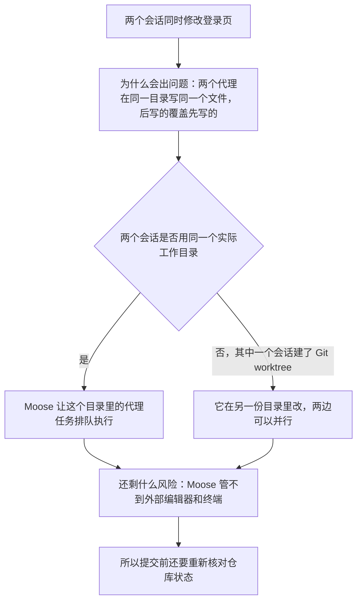
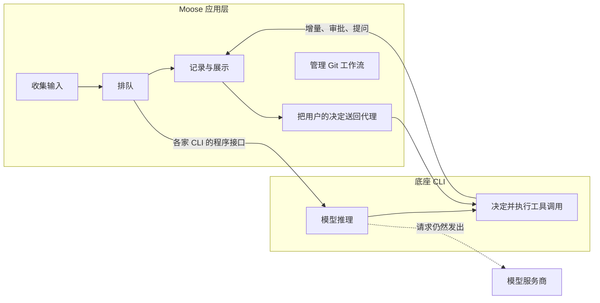
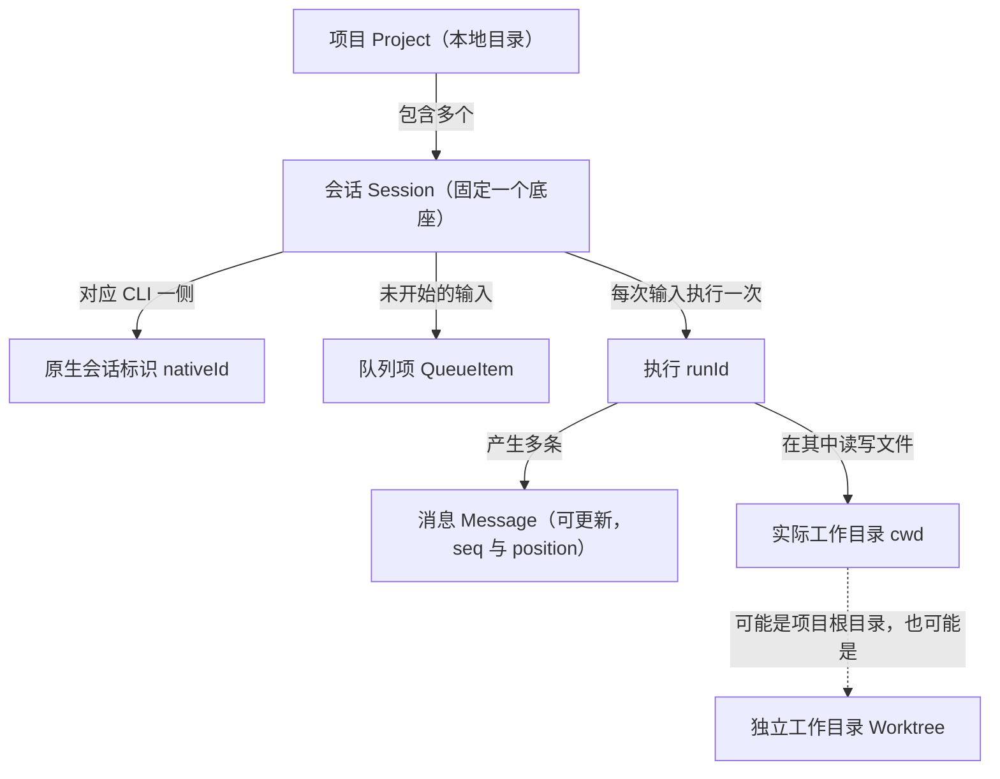
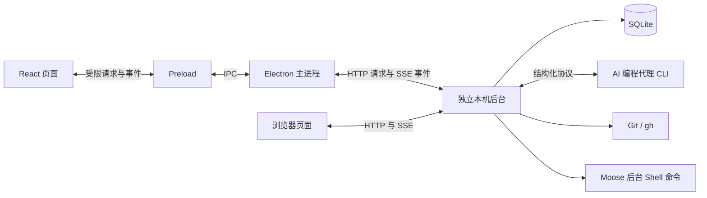
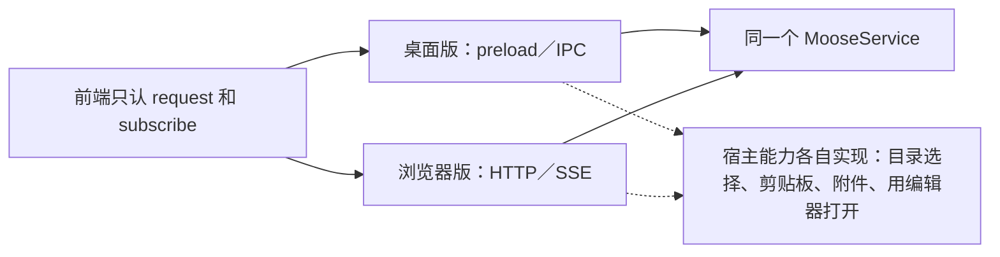
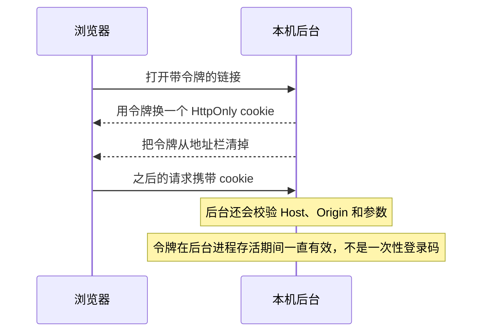
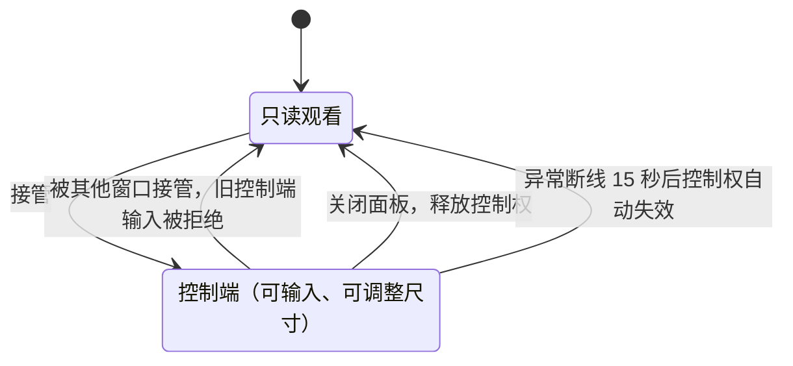
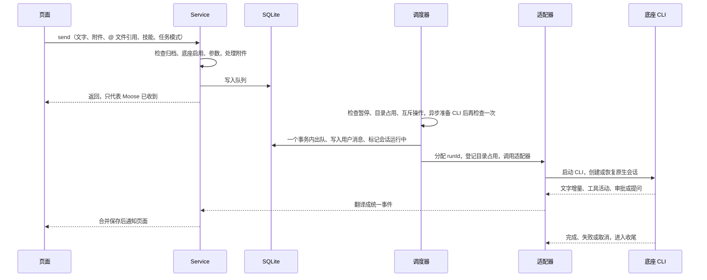
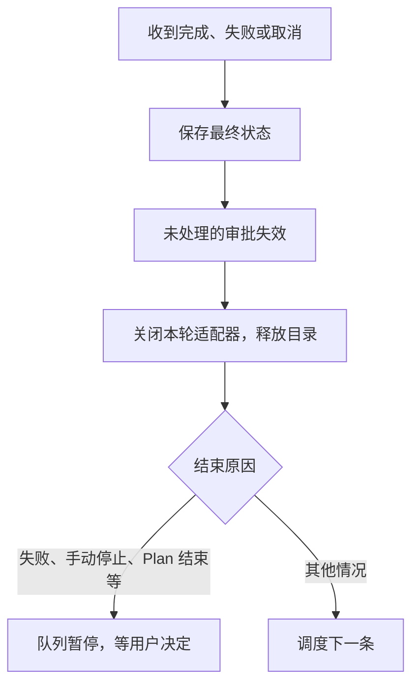

# 项目全貌：职责、进程与任务链路

> 本篇收录追问资料第 1–4 节，节号与全套资料统一。源码基准 Moose 0.23.1。[追问资料目录](README.md)

## 1. 先把项目讲清楚

**一句话**：别罗列功能，用“两个会话同时修改登录页”这个场景讲清问题、做法和剩余风险。

一分钟介绍见[简明指南](../project-interview-guide.md#一分钟介绍)。被要求展开时，按下图的因果顺序讲：

项目价值和可以引用的证据要分开说：

| 可以说 | 不能说 |
| --- | --- |
| 把分散在多个终端里的任务、审批、历史和代码改动集中到一处追踪 | 用户规模、收入或提效比例（目前都没有数据） |
| 安装包变小、查询变快 | 把这些换算成“开发效率提升了多少” |

## 2. 哪些是自己做的，哪些来自底座

**一句话**：Moose 不做模型推理、不执行代理的工具调用，只负责代理之外的应用层流程。

| 部分 | Moose 负责 | 底座或外部工具负责 |
| --- | --- | --- |
| 一轮代理任务 | 收集输入、排队、选择工作目录、显示和保存状态 | 模型推理、决定调用哪些工具、执行工具 |
| 审批与提问 | 展示问题、确认请求仍然有效、把用户的选择送回去 | 发起审批或提问，根据回答继续执行 |
| Plan 与 Goal | 提供入口、保存计划版本、组织“批准后执行” | 原生规划模式、目标状态和后续执行 |
| 子代理 | 接收活动、展示父子关系与历史、转发受支持的控制 | 决定是否委派，创建和运行子代理 |
| 原生历史 | 浏览、导入、记录来源和操作状态 | 提供原生会话、分叉和压缩接口 |
| Git 与 worktree | 展示改动和预览、核对状态、安排调用 | Git 实际修改索引、生成提交、创建和合并工作目录 |
| 配置与扩展 | 选择作用域、预览改动、版本检查、显示诊断 | CLI 写入原生配置，管理插件和认证凭据 |
| 后台命令与定时任务 | 启动和管理命令进程、保存调度、领取到期周期 | 本机 Shell 执行命令；定时发出的代理消息仍由底座处理 |

两个常被忽略的边界：

- **进程归属**：Moose 只管理用户在命令面板或终端里**手动启动**的进程。代理在工具调用里自己启动的进程，由底座管理。
- **本机不等于离线**：数据存在本机，但 CLI 仍会把请求发给模型服务商。

### 先分清几个对象

| 对象 | 表示什么 | 为什么要单独区分 |
| --- | --- | --- |
| 项目 `Project` | 加入 Moose 的一个本地目录 | 决定会话归属和默认工作位置 |
| 会话 `Session` | 项目下的一段对话，固定使用一个底座 | 保存模型、权限、草稿等选择 |
| 原生会话标识 `nativeId` | CLI 那一侧的 thread、session 或 sessionFile | 后续发送能接着原来的上下文，而不是每次新开对话 |
| 执行 `runId` | 一次输入在 Moose 中对应的一次执行 | 一轮执行会产生多段回答、多次工具调用和审批 |
| 消息 `Message` | 时间线上一条**可以更新**的记录 | 用 `seq` 判断新旧版本，用 `position` 排序和分页 |
| 队列项 `QueueItem` | 已保存、还没开始执行的输入 | 可以编辑、移除，或等待目录空闲 |
| 实际工作目录 `cwd` | 本轮真正读写文件的目录，可能是项目根目录，也可能是 worktree | 调度、文件预览、终端和 Git 必须用同一个目录 |
| 独立工作目录 `Worktree` | 同一个 Git 仓库的另一份工作目录 | 同一项目的两个会话可以改不同的文件副本 |

#### 例子：会话 S 发了两次需求

| 时刻 | 发生了什么 | 标识怎么变 |
| --- | --- | --- |
| 第一次发送 | 产生执行 R1 | 新的 `runId` = R1 |
| R1 运行中 | 回答、工具调用和审批分别落成记录 | 它们是不同的 `Message` |
| 某条回答从“正在检查”更新成“检查完成” | 同一条记录被改写 | 消息 ID 不变，`seq` 变大，`position` 不变 |
| 第二次发送 | 产生执行 R2 | 新的 `runId` = R2 |

容易混淆的另外两个标识：

| 标识 | 用途 | 不能拿来做什么 |
| --- | --- | --- |
| `requestId` | 标识一次接口操作及其回执 | 不能代替 `runId` 或消息版本 |
| 通知的事件 ID | 只用于通知去重 | 不是消息序号 |

一个 Moose 会话固定一个底座。不同底座的原生上下文格式和恢复方式都不同，不能直接互相迁移。

### 常用技术名词

| 分类 | 名词 | 在本项目里的意思 |
| --- | --- | --- |
| 通信 | IPC | 本机进程之间互相传消息。这里指 Electron 页面和主进程之间的通信 |
| 通信 | Preload | Electron 的桥接脚本，只把少数受限能力暴露给页面，不是独立的业务进程 |
| 通信 | HTTP + SSE | HTTP 用来发请求；SSE（Server-Sent Events）是服务器向浏览器单向持续推送事件的通道。Web 版用它接收实时更新 |
| 通信 | stdio | 程序的标准输入和输出。Moose 往 CLI 子进程的 stdin 写 JSON、从 stdout 读 JSON，不是模拟敲键盘 |
| 协议 | JSON-RPC | 基于 JSON 的调用格式：请求和回复带同一个 `id` 来配对；不带 `id` 的是通知，用来报告进度 |
| 协议 | ACP | Agent Client Protocol，Grok Build 和 OpenCode 使用的代理通信协议 |
| 数据 | 事务 | 一组数据库操作要么全部生效，要么全部不生效 |
| 数据 | WAL | SQLite 的一种日志模式，读写之间互相阻塞更少，但不代表写入可以无限并发 |
| 数据 | Zod | 运行时数据校验库。TypeScript 类型在运行时不存在，收到的真实数据仍需校验 |
| 数据 | 游标分页 | 不按“第几页”取数据，而是“从某个位置往前或往后取 N 条”，数据变化时不会错位 |
| 终端 | PTY | 伪终端，让 Shell 以为自己连着真实终端，vim 这类交互程序才能正常工作 |
| 状态 | 结果未知 | 写请求发出后没收到回执：既不能确定执行了，也不能确定没执行 |

## 3. 为什么分成三类进程

**一句话**：窗口要流畅，慢活（数据库、Git、CLI 子进程）全部放进独立的本机后台。

如果都放进 Electron 主进程，一次慢查询就会让整个窗口卡住。

| 进程 | 负责什么 |
| --- | --- |
| React 渲染进程 | 页面和交互；没有 Node 权限 |
| Electron 主进程 | 窗口、菜单、文件选择框、剪贴板、打开系统浏览器 |
| 本机后台 | 调度、SQLite、代理 CLI、Git、Shell 命令和终端 |

| 运行方式 | 后台形态 |
| --- | --- |
| 开发模式 | Electron 的 `utilityProcess` |
| 安装版 | 默认是一个独立的本机服务，桌面和浏览器共用 |

拆开之后要讲清的两点：

| 新问题 | 做法 |
| --- | --- |
| 同步 SQLite 不会卡住窗口，但会卡住后台自己 | 历史要分页，命令输出要设上限 |
| 后台意外退出时，等待中的请求没人回复，按钮会一直转圈 | 进程之间的调用带请求 ID 和超时；后台退出时立即拒绝所有等待中的请求并通知页面 |

### 关掉窗口，任务为什么还在跑

| 操作 | 安装版 | 从源码启动的独立开发模式 |
| --- | --- | --- |
| 普通关窗或退出 | 只断开客户端，后台继续执行任务 | 后台随应用一起退出 |
| 重新打开 | 读取快照和消息，恢复界面 | — |
| 显式“停止后台” | 只有这一步才会结束任务 | — |

### TypeScript 和 Zod 为什么都需要

| 防线 | 什么时候起作用 | 挡住什么 |
| --- | --- | --- |
| TypeScript | 编译时 | 保证前端调用 `scheduleUpdate` 时带上任务 ID、版本和允许修改的字段 |
| Zod（IPC 接收端） | 运行时 | 校验 UUID 格式、枚举值、字符串长度和多余字段 |
| 主进程来源检查 | 运行时 | 只接受来自可信窗口主 frame 的请求 |
| 页面隔离 | 始终 | 关闭 Node 集成，开启 `contextIsolation` 和 sandbox |
| 受限入口 | 始终 | 页面只能通过 `window.moose.request` 和 `subscribe` 两个入口调用后台 |

- TypeScript 管不了运行时实际传进来的数据。
- 页面有 bug 或被注入脚本时，主进程收到什么都有可能，所以运行时还要再校验一遍。

### Web 入口与桌面入口怎样共用

- 两个入口最后都调用同一个 `MooseService`，差异只在宿主能力。
- 要特别注意：后台所在机器的文件路径不等于浏览器所在设备的路径。

#### 数据目录

| 启动方式 | 数据目录 |
| --- | --- |
| 安装版 | 按需在本机回环地址启动共享后台，桌面和浏览器共用原来的数据目录，没有做数据迁移 |
| 从源码启动的独立 Web 工作区 | 使用自己的目录，不会自动合并 |
| 升级后旧版本后台还在运行 | 新客户端拒绝写入，提示先停掉旧后台再启动 |

#### 访问认证

#### 断线重连

| 类型 | 重连后怎么做 | 原因 |
| --- | --- | --- |
| 读 | 重新读取快照和消息，按消息 ID 和版本合并 | 目前没有通用的事件游标，不能重放漏掉的事件 |
| 写 | 不会自动重试 | 没收到回执不等于没执行 |
| 终端输出 | 首次打开和重连时按游标补读，和实时输出重叠的部分去重；缓冲区超限时提示已截断 | 避免重复或静默丢失 |

#### 多个窗口看同一个终端

- 所有窗口都可以看，但输入和调整尺寸只归一个控制端。
- 控制权只决定谁能输入，不影响 Shell 是否继续运行。

#### 还没做完的部分

- 高延迟网络下的输入体验。
- 通用的事件游标：目前重连靠重读快照，而不是重放漏掉的事件。

代码入口：[主进程](../../../electron/main.ts)、[桥接](../../../electron/preload.ts)、[共享后台连接](../../../electron/shared-runtime.ts)、[独立模式宿主](../../../electron/runtime-host.ts)、[请求类型](../../../shared/types.ts)、[参数校验](../../../shared/validation.ts)。

## 4. 从按下发送到任务结束

**一句话**：`send` 只确认“已入队”，执行过程和最终状态全部靠后续事件推送。

以需求“修复登录按钮，并补一个测试”为例：

| 步骤 | 做什么 | 要讲清的细节 |
| --- | --- | --- |
| 1. 界面收集输入 | 文字、附件、`@` 文件引用、技能和任务模式 | 新建会话时先显示一个未保存的输入页，第一次发送才真正创建会话 |
| 2. 后台检查并入队 | Service 检查会话是否已归档、底座是否启用、参数是否合法，处理附件，写进 SQLite 队列 | 此时只代表“Moose 已收到”，底座还没开始执行 |
| 3. 调度器挑选任务 | 检查会话是否暂停、实际工作目录是否被占用、有没有互斥操作；目录空闲就准备 CLI（例如查找 CLI 路径） | 准备是异步的，完成后还要再检查一次：用户可能已取消队列，或应用正在退出 |
| 4. 记录执行开始 | 一个数据库事务里完成出队、写入本轮用户消息、把会话标为运行中；再分配 `runId`、登记目录占用、调用适配器 | 三件事要么全部生效，要么全部不生效 |
| 5. 底座处理需求 | 适配器启动 CLI，创建或恢复原生会话，传入工作目录、输入和执行设置 | 底座返回的文字增量、工具活动、审批或提问被翻译成统一事件 |
| 6. 持续保存并显示 | 后台合并同一条记录的连续更新，保存后通知页面 | 审批答案沿原请求送回底座，不会变成一条新的聊天消息 |
| 7. 收尾 | 保存最终状态，让未处理的审批失效，关闭本轮适配器，释放目录，再调度下一条 | 见下图 |

这条链路里有两种“返回”，不能当成同一次请求：

| 返回 | 含义 | 为什么分开 |
| --- | --- | --- |
| `send` 请求的返回 | 只确认队列已保存 | 长任务可能持续几十秒甚至几十分钟 |
| 后续事件 | 推送任务过程和最终状态 | 一次请求等不完这么长的任务 |

### 从启动入口定位到执行代码

| 阶段 | 先读的代码 | 要讲清的边界 |
| --- | --- | --- |
| 启动桌面 | [main.ts](../../../electron/main.ts) → [desktop-runtime.ts](../../../electron/desktop-runtime.ts) → [shared-runtime.ts](../../../electron/shared-runtime.ts) | 安装版按需启动或连接共享后台，React 不直接打开数据库 |
| 建立服务 | [web-server.ts](../../../electron/web-server.ts) → [store.ts](../../../electron/db/store.ts)／[service.ts](../../../electron/service.ts) | 一个数据目录只由一个后台持有；默认开发模式走 runtime.ts |
| 选择项目、新建输入页 | [app.tsx](../../../src/app.tsx) → 宿主的目录选择 → Service | 保存规范化后的目录；首次发送才创建会话 |
| 提交输入 | [composer.tsx](../../../src/components/composer.tsx) → `request('send')` → Service | 区分 Enter 发送和输入法确认；返回只代表已入队 |
| 调度与执行 | [session-execution.ts](../../../electron/session-execution.ts) 的 `drain`／`execute` → [AgentAdapter](../../../electron/providers/types.ts) | 使用会话的实际目录；推理和工具执行归底座 |
| 保存与展示 | session-execution.ts 的 `accept`／`flush` → Store → [workspace.ts](../../../src/lib/workspace.ts) | 按消息 ID 和 `seq` 更新；完成信号与普通增量分开处理 |

- Web 页面的入口不同：它通过 [web-api.ts](../../../src/lib/web-api.ts) 发 HTTP 请求、订阅 SSE，再进入同一个 Service。
- 不要把桌面的 preload 路径照搬成浏览器的调用链。

---

[追问资料目录](README.md) ｜ 下一篇：[代理接入与流式消息](02-agents-and-streaming.md)
