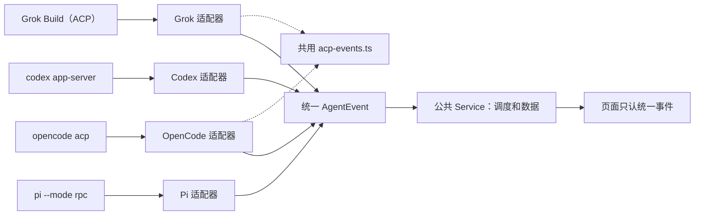
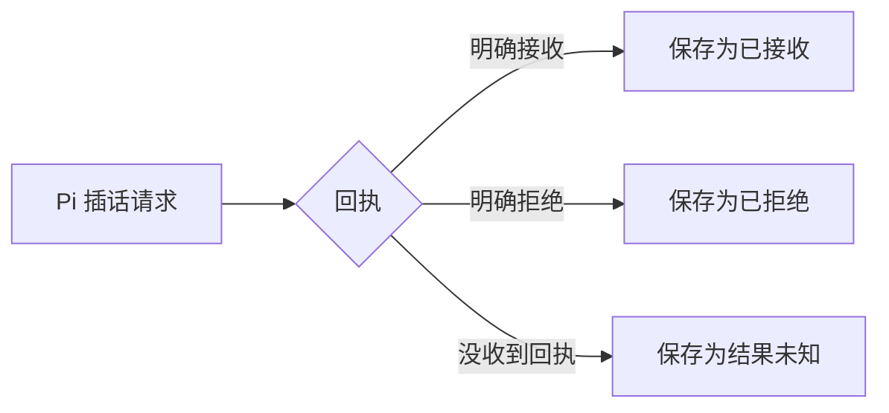
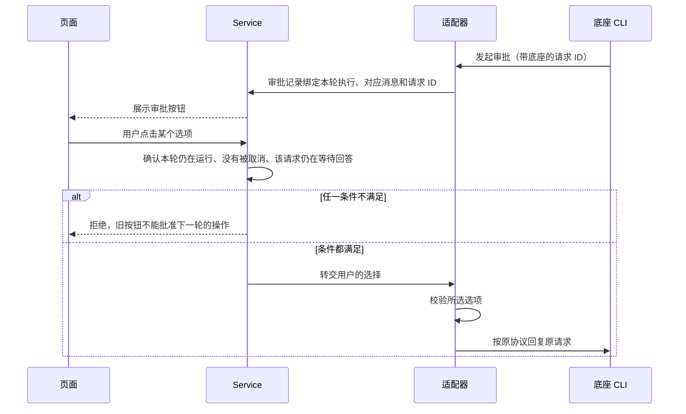
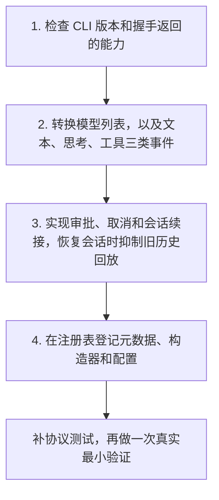
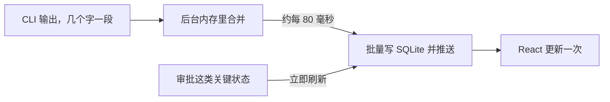
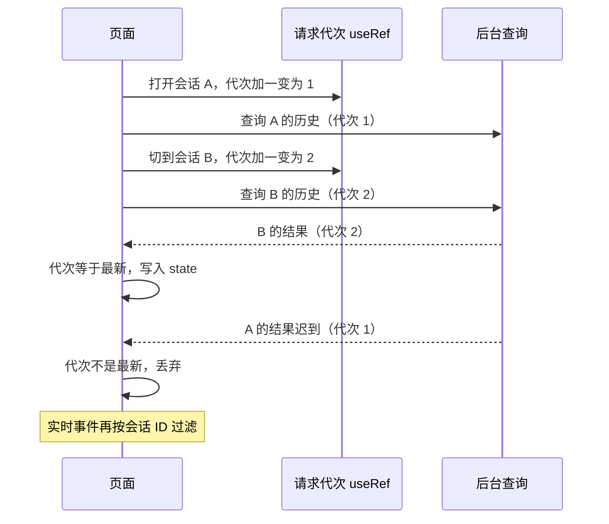

# 代理接入与流式消息

> 本篇收录追问资料第 5–6 节，节号与全套资料统一。源码基准 Moose 0.23.1。[追问资料目录](README.md)

## 5. 不同代理如何接进同一套界面

**一句话**：每家协议一个适配器，向上只输出统一的 `AgentEvent`；界面一样，能力不一定一样。

### 共用界面，分别处理协议



| 底座 | 通信方式 | 怎样延续会话 | 怎样判断一轮结束 |
| --- | --- | --- | --- |
| Codex | `codex app-server`，stdio 上的 JSON-RPC | 创建或恢复 thread，再开始 turn | 对应线程的 `turn/completed`；Goal 模式还要查目标状态 |
| Grok Build | ACP SDK，经 stdio 连接 | 按能力选择 `newSession` 或 `loadSession` | `prompt` 调用返回 |
| Pi | `pi --mode rpc`，每行一个 JSON | 保存 `sessionFile`，之后用它恢复 | `agent_settled`；看到 `agent_end` 还不能结束，之后可能继续重试或压缩 |
| OpenCode v2 | `opencode acp`，stdio 上的 ACP | `session/new` 或 `session/load` | `session/prompt` 返回；调用被受理不等于任务完成 |

- 统一事件的例子：“这是一段回答”“这是工具输出”“这里需要审批”“这一轮结束了”。页面不需要理解各家的原始字段。
- “都用 JSON”不代表协议相同。接入 Pi 时复用了按行读写、请求与回复配对、进程清理这些通用部分，消息格式转换是单独写的；Pi 的 RPC 并不是 Codex 那种 JSON-RPC。

### 为什么不把各家的执行逻辑写进一个大函数

```ts
// 反例（示意）：所有底座挤进同一个执行函数，代码里到处是“如果是 Pi 就……”
if (provider === 'pi') { /* 等 agent_settled，agent_end 之后还可能重试或压缩 */ }
else if (provider === 'grok') { /* 抑制恢复会话时回放的旧历史 */ }
else if (provider === 'codex') { /* 区分 thread、turn 和子线程 */ }

// 实际分工：适配层只统一输入、增量、审批和取消这些接口；
// 完成判断和会话恢复留在各适配器内部，公共 Service 只管调度和数据。
```

差异不只是字段名，还包括语义：

| 底座 | 语义差异 | 不处理会怎样 |
| --- | --- | --- |
| Grok | 恢复会话时可能把旧历史重新回放一遍 | 界面重复显示，需要抑制 |
| Pi | `agent_end` 之后还可能重试或压缩上下文 | 过早结束，必须等 `agent_settled` |
| Codex | 要区分 thread、turn 和子线程 | 由 Codex 适配器单独处理 |

原生历史、Git、配置和后台命令也各有独立模块，避免公共流程里堆满底座分支。

### 界面一样，能力不一定一样

| 能力 | Codex | Grok | Pi | OpenCode |
| --- | --- | --- | --- | --- |
| 运行中插话 | 已接入原生接口 | 已接入原生接口 | Pi 1.x 已接入原生接口 | 没有，只能走普通排队 |
| 权限 | 三档都有，映射见[专文](08-plan-goal-permissions.md) | 同左 | 没有可暂停的工具协议。请求批准会中止改动；帮我批准和完全访问是同一套工具策略 | 三档由 Moose 在权限回调里处理 |



- Pi 的插话回执可以不带原生 turn ID，所以这三种结果要分开保存。
- 不能因为页面上都有发送按钮，就说四个底座都能修改正在执行的回合。
- Pi 的扩展可以弹出确认问题，但这不等于所有工具执行都经过审批。

完整的支持情况集中维护在[能力表](../../providers/native-capabilities.md)，这里不重复。页面按已接入的能力开放入口，后台仍会检查 CLI 版本、握手结果和当前会话状态。

### 审批答案怎样送回原来的请求



| | 审批 | 提问 |
| --- | --- | --- |
| 问什么 | “这个操作可以执行吗” | “你的需求是什么”（例如改移动端还是桌面端） |
| 答案怎么送回 | 按原问题的 ID 送回 | 按原问题的 ID 送回 |
| 会不会进下一轮聊天 | 不会 | 不会 |

代码入口：[适配器接口](../../../electron/providers/types.ts)、[注册入口](../../../electron/providers/registry.ts)、[Codex](../../../electron/providers/codex.ts)、[Grok](../../../electron/providers/grok.ts)、[Pi](../../../electron/providers/pi.ts)、[OpenCode](../../../electron/providers/opencode.ts)。

### 新增一家 CLI，怎样避免越写越乱

以 OpenCode v2 为例：它通过 `opencode acp` 在 stdin／stdout 上通信，由 CLI 自己启动私有服务。



- Grok 和 OpenCode 共用的 ACP 事件转换放在 `acp-events.ts`，各自独有的控制留在自己的适配器里。

验证范围要如实说：OpenCode 2.0.10 验证过握手、隔离目录写文件、续接、审批和取消；0.22.0 起能列出并导入历史。这不代表所有模型和权限配置都通过了。额度查询还没接。计划和目标已接到界面，但没有 OpenCode 自己的目标状态机，见[专文](08-plan-goal-permissions.md)。工具权限仍按 CLI 自己的配置执行。

## 6. 流式消息和 React 页面如何保持一致

**一句话**：一轮回复拆成多条可更新记录，用 `seq` 防旧覆盖新，约 80 毫秒批量落盘，用请求代次丢弃迟到结果。

### 一轮回复为什么拆成多条记录

```text
runId = R1（一轮执行）
├── 回答记录    "先解释……"              可以追加文字
├── 工具记录    运行命令                 运行中 → 已完成
├── 审批记录    请求批准                 等待 → 已有结果
└── 回答记录    "最后总结……"            可以追加文字

复制回复时：按本轮把正文记录拼起来
```

- 如果只存一个答案字符串，就没法单独更新某个工具的状态或某个审批的结果。
- `runId` 把同一轮的记录归在一起，底座事件里的 key 区分每一条记录。

### 增量和最终结果怎么合并

| 时刻 | 收到什么 | Service 怎么处理 | 页面上看到什么 |
| --- | --- | --- | --- |
| t1 | 增量 `delta`：“已找到” | 追加，`seq` 加一 | 已找到 |
| t2 | 增量 `delta`：“登录问题” | 追加，`seq` 加一 | 已找到登录问题 |
| t3 | 完整 `text`：“已找到登录问题” | 覆盖，`seq` 加一 | 已找到登录问题 |
| 反例 | 如果 t3 也追加 | — | 已找到登录问题已找到登录问题（重复一遍） |

```ts
// 示意：同一条记录的合并规则
if (event.delta) record.text += event.delta;        // 增量：追加
else if (event.text != null) record.text = event.text; // 完整文本：覆盖
record.seq += 1;                                      // 每次更新版本加一

// 数据库和页面都只接受比当前更新的版本
if (incoming.seq <= current.seq) return current;      // 旧版本不能覆盖新版本
```

局限：如果上游自己重复发送了同一段增量又没带标识，`seq` 识别不出来。

### 为什么约每 80 毫秒保存一次



| | 内容 |
| --- | --- |
| 不合并的开销 | 每段都写一次 SQLite、跨进程推送一次、触发一次 React 更新 |
| 合并的收益 | 约每 80 毫秒批量保存和推送一次 |
| 代价 | 进程突然崩溃时，最后还没落盘的一小段增量可能丢失 |
| 不能说 | “每个字到达就已持久化” |

### 切换会话时，迟到的结果怎么办



如果直接使用迟到的 A 结果，B 的界面会被 A 的数据覆盖。

| React 手段 | 放什么 | 为什么 |
| --- | --- | --- |
| `useRef` | 请求代次 | 改它不触发重渲染 |
| state | 要显示的消息 | 变化需要重渲染 |
| effect 清理 | 取消订阅和定时器 | 离开会话后不再接收旧数据 |
| 函数式更新 state | 异步回调里的合并 | 避免旧闭包里的旧值覆盖新消息 |

### 长会话怎么处理

| 手段 | 解决什么 |
| --- | --- |
| 按 `position` 游标分页，每页 80 条，多取一条 | 多取的一条用来判断还有没有更早的内容 |
| 按消息 ID 和 `seq` 合并新旧数据 | 新旧页面数据不冲突 |
| 消息行用 `memo` | 跳过没变化的记录 |
| 滚动组件 | 保持阅读位置 |
| `content-visibility` | 屏幕外的消息少做布局计算 |

#### 0.23.x 减少流式更新时的无效工作

0.23.0 让合并函数保留没变的消息对象：一万条里连续更新最后一条 2,000 次，函数耗时从 937 ms 降到 4 ms。这只是单个函数的微基准。同一轮还稳住了回调和 Markdown 组件的引用，避免 `memo` 失效，也避免代码块被卸掉后重读本地图片。条件和其余数字见 [0.23.0 验收记录](../../releases/0.23.0-validation.md)。

要主动说明的边界：

- **这不是严格的虚拟列表**，持续向上加载时 DOM 节点仍会增加。
- 一万条历史的测试验证了分页、持久化和交互正常，没有证明同时渲染一万条也不卡。

代码入口：[执行与 flush](../../../electron/session-execution.ts)、[前端数据 Hook](../../../src/lib/workspace.ts)、[消息合并](../../../src/lib/transcript-messages.ts)、[时间线](../../../src/components/transcript.tsx)、[滚动组件](../../../src/components/ui/message-scroller.tsx)。

---

上一篇：[项目全貌：职责、进程与任务链路](01-project-overview.md) ｜ [追问资料目录](README.md) ｜ 下一篇：[任务执行：排队恢复、Plan／Goal 与历史](03-execution.md)
