# 任务执行：排队恢复、Plan／Goal 与历史

> 本篇收录追问资料第 7–9 节，节号与全套资料统一。源码基准 Moose 0.23.1。[追问资料目录](README.md)

## 7. 排队、并行和重启恢复

**一句话**：Moose 按实际工作目录串行化需要独占的操作，队列先落库；重启后按记录核对状态，结果不明的写操作不自动重试。

### 为什么按实际目录控制并发

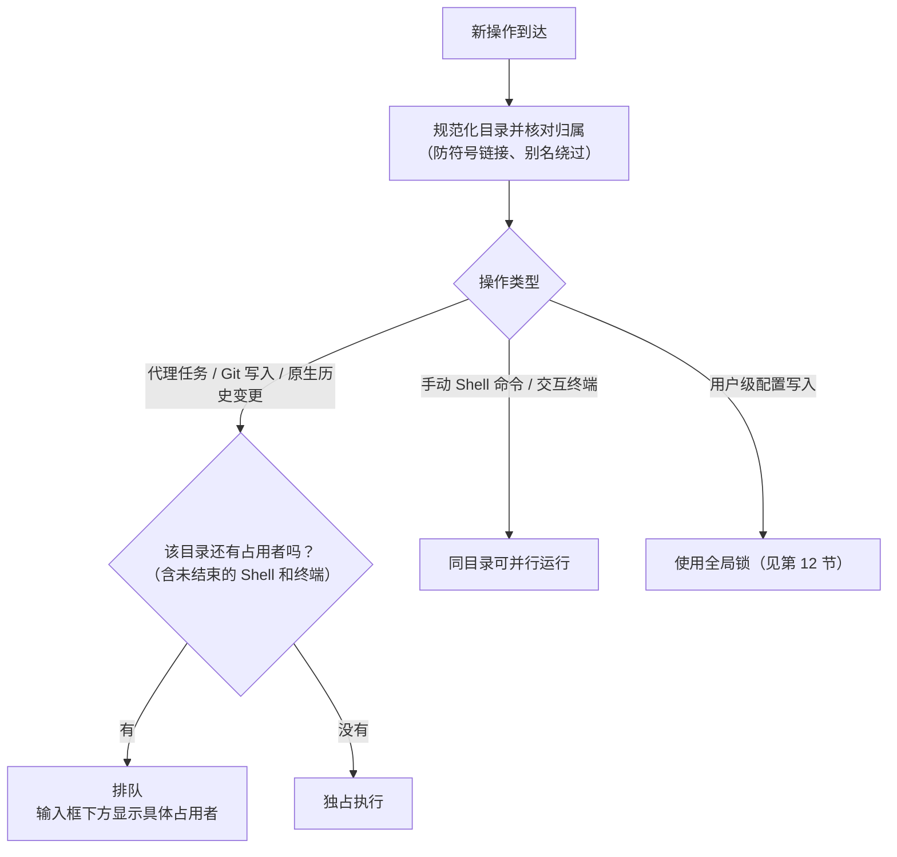

两个会话即使任务不同，也可能同时改 `App.tsx`，所以调度单位是**实际工作目录**：同目录串行，不同目录可以并行。同一项目想并行改代码，就用 worktree 给会话分配不同目录（见第 10 节）。

| 操作 | 是否独占目录 | 说明 |
| --- | --- | --- |
| 代理任务、Git 写入、原生历史变更 | 独占 | 同一目录内串行 |
| 手动 Shell 命令、交互终端 | 不独占 | 可在同目录并行，但只要还有一个没结束，就会挡住上面那些独占操作 |
| 用户级配置写入 | 全局锁 | 影响所有项目，另用一把锁 |

- 不能笼统地说“同目录所有进程都串行”。
- “为什么还在排队”由后台根据实际占用算出，可以定位到具体占用者，不是前端按等待时长猜的。
- 底座内部的子代理怎么并发，仍由底座决定。

边界：

- 不是操作系统级的文件锁，外部程序照样能改文件。
- 不检测父子目录或重叠的仓库。

### JavaScript 是单线程，为什么还要防竞争

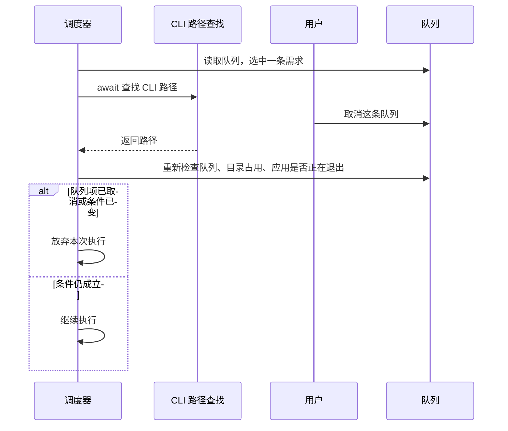

- 单线程只保证同一时刻只有一段代码在跑，不保证 `await` 前的判断在 `await` 之后仍然成立。
- 如果沿用旧判断，就会执行一条已经失效的需求。
- 对策：调度循环防止重入，每次异步准备结束后重新检查队列、目录占用和应用是否正在退出。

### 队列为什么先写数据库

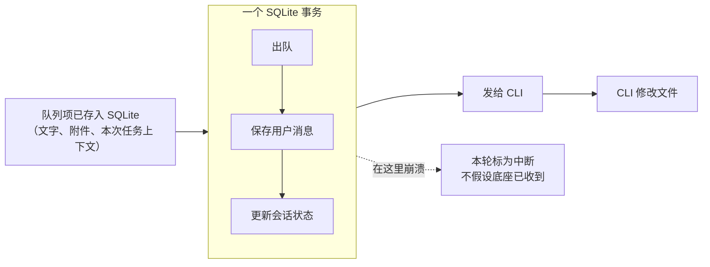

- 队列项先写进 SQLite，应用退出也不会丢。
- 事务只覆盖数据库，不包括 CLI 调用和文件修改。
- 如果在“出队之后、发给 CLI 之前”崩溃，这一轮标为中断。

队列项不是完整的设置快照：

| 随输入一起保存 | 执行时才读取会话当时的配置 |
| --- | --- |
| 文件引用、技能、模式 | 模型、权限 |

### 重启后能恢复到哪一步

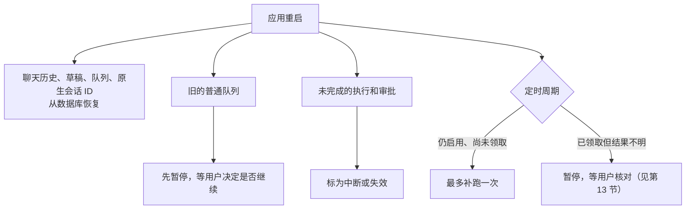

| 能恢复 | 不能恢复 |
| --- | --- |
| 聊天历史、草稿、队列、原生会话 ID | 已经退出的 CLI 进程不会复活 |
| 旧的普通队列：先暂停，等用户决定是否继续 | 进程已经改过的文件不会被撤销 |
| 未完成的执行和审批：标为中断或失效 | 不能凭会话 ID 让死掉的 Shell 重新运行 |
| 仍启用、尚未领取的定时周期：最多补跑一次 | 已领取但结果不明的周期：暂停，等用户核对（见第 13 节） |

存储做法：

| 做法 | 好处或边界 |
| --- | --- |
| SQLite 开启 WAL 和外键约束 | — |
| 表结构升级走迁移脚本和事务 | — |
| 历史、关系和排序数据用专门的表 | — |
| 扩展操作、后台命令和调度记录按命名空间存在 settings 的 JSON 里 | 好处：能和其他状态共用一个事务。边界：记录量变大以后，可以再拆成专表并加索引 |

### 为什么要有“结果未知”

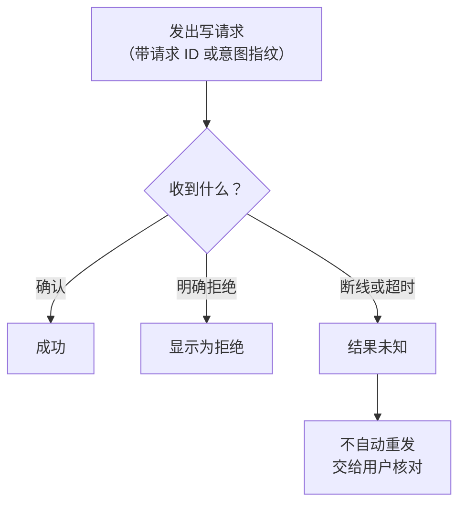

- 写请求发出后断线，只能确定“没收到确认”，不能确定对方没执行。
- 自动重试可能重复提交、重复创建任务或重复消耗额度。
- 插话、原生历史变更、Git 提交和扩展管理都会记录请求 ID 或“意图指纹”（对操作内容的摘要）。

两种检查作用不同：

| 检查 | 确认什么 |
| --- | --- |
| 版本检查 | 对象还是用户看到的那个版本 |
| 请求 ID 检查 | 这个请求是否已经提交过 |

边界：SQLite、CLI、Git 和远端服务之间没有共同的事务，所以不能承诺外部操作“严格只执行一次”。

### 长时间运行、断连、休眠和升级，分别怎么恢复

| 情况 | 怎么处理 |
| --- | --- |
| 客户端断开（关桌面窗口或浏览器），后台还活着 | 任务照常继续；重连后读取快照和消息，补读终端输出 |
| 后台崩溃 | 只能根据记录核对状态，不能靠会话 ID 让 Shell 复活 |
| 写操作可能已执行、只是回执丢了 | 标为结果未知，不自动重试 |
| 重连时有待处理的审批 | 不会自动批准 |
| 升级后遇到旧版本后台 | 新客户端拒绝写入，提示先停掉旧后台再启动 |

> **面试时可以这样说**：客户端断开和后台退出是两回事。桌面窗口和浏览器只是界面，数据库、代理进程和终端都在后台。后台还活着时，关窗口任务照常继续，重连后读取快照和消息、补读终端输出；后台崩溃了，就只能根据记录核对状态，不能靠会话 ID 让 Shell 复活。写操作可能已经执行、只是回执丢了，所以标为结果未知，不自动重试；重连也不会自动批准审批。升级后遇到旧版本后台，新客户端拒绝写入，提示先停掉旧后台再启动。

#### 验证到哪一步

| 验证 | 结果 | 边界 |
| --- | --- | --- |
| 协议夹具 | 覆盖了断连和重启的时序 | — |
| Pi、OpenCode 真实运行 | 真实文件写入、跨进程续接和取消；OpenCode 还验证了审批批准／拒绝 | — |
| 0.22.0 发布后，对源码构建跑两小时固定负载 | 720 次循环、180 轮流式任务、119 次 Web 重连、11 次桌面重开，没有应用错误；按相同阶段对比资源占用，没有看到持续累积，结束后没有残留进程 | 自动化负载，不是真实系统休眠，也不是真实模型的长任务 |
| 此前另一次长运行 | 在 4394 秒时因测试窗口意外关闭而失败 | 根因至今没有确认 |
| 真实休眠／唤醒 | 还没有人工验收 | — |

两小时负载的证据见 [0.22.0 证据索引](../../releases/0.22.0-evidence.md)。

#### 常见追问

**重连会把漏掉的事件全部重放吗？** 不会。

- 界面靠快照、已保存的消息和终端游标补读，没有通用的全量事件日志。
- SSE 重连成功也不意味着写操作可以安全重试。

**任务从五分钟变成二十分钟，怎么查？**

```text
总耗时 = 排队 + CLI 握手 + 首个输出 + 工具执行 + 等待审批 + 界面更新
         （每段分别测，并在相同底座、模型和输入下对比）
```

- 页面卡顿查渲染进程，工具卡住查子进程。
- 目前还没有统一的跨进程 trace 面板。

**内存测量的边界。**

| 时间 | 场景 | 结果 | 边界 |
| --- | --- | --- | --- |
| 2026-09-21 | 一万条历史反复打开和分页 20 次，共 66 秒 | DOM 没有累积；第 5～20 轮在 GC 后，JS 堆从 10.44 MiB 增到 10.93 MiB | 只是渲染进程的短时场景，不能证明整个应用没有内存泄漏 |

见[长历史测量记录](../../releases/runtime-validation-history.md#长历史短时测量2026-09-21)。

代码入口：[目录调度](../../../electron/session-execution.ts)、[数据库](../../../electron/db/store.ts)、[迁移](../../../electron/db/migrations.ts)、[原生操作记录](../../../electron/native-history.ts)、[插话记录](../../../electron/steering.ts)。

## 8. Plan、Goal 和运行中插话

**一句话**：Plan 是“先出方案、批准某个版本后再做”，Goal 的续跑由底座决定，插话是送进正在运行的回合；三者都由 Moose 后台按模式调用 CLI，而不是把斜杠命令原样转发。

> **权限三档和各家差异以[计划、目标与三档权限](08-plan-goal-permissions.md)为准。** 下面保留 Codex 的协议时序。范围表已按 0.23.3 改过。

| | 用户想表达的 | 0.23.3 的范围 |
| --- | --- | --- |
| **Plan** | “先给我方案，我批准后再做。” | 四个底座都有。Codex 优先原生协作模式，其余由 Moose 收成只读 |
| **Goal** | “按这个目标一直做下去，直到完成或遇到阻碍。” | 四个底座都有。只有 Codex 在回合结束后继续等下一轮 |
| **插话** | 在当前任务执行过程中补充要求 | Codex、Grok、Pi 1.x；OpenCode 不支持，走普通队列 |

#### `/plan` 和 `/goal` 是模式选择入口

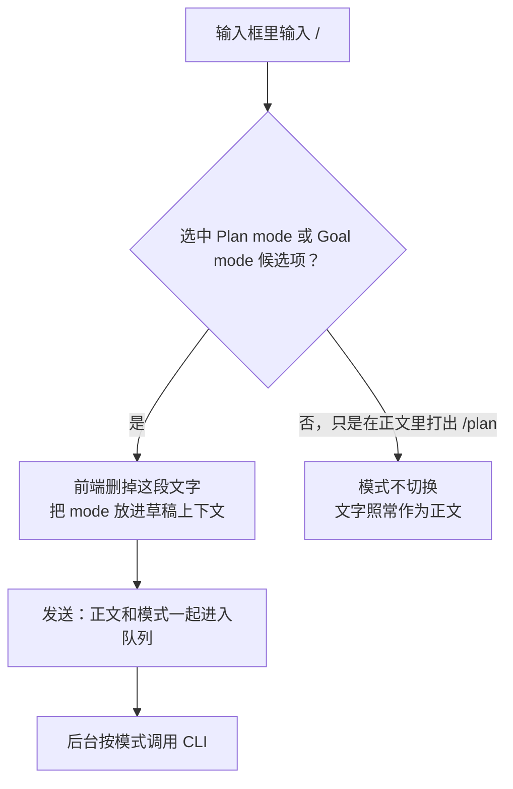

- `/plan`、`/goal` 是 **Moose 的模式选择入口**，不是发给 CLI 的命令。
- 选中后草稿上下文里是 `mode: 'plan'` 或 `mode: 'goal'`。

#### `turn/start` 这类名字是什么

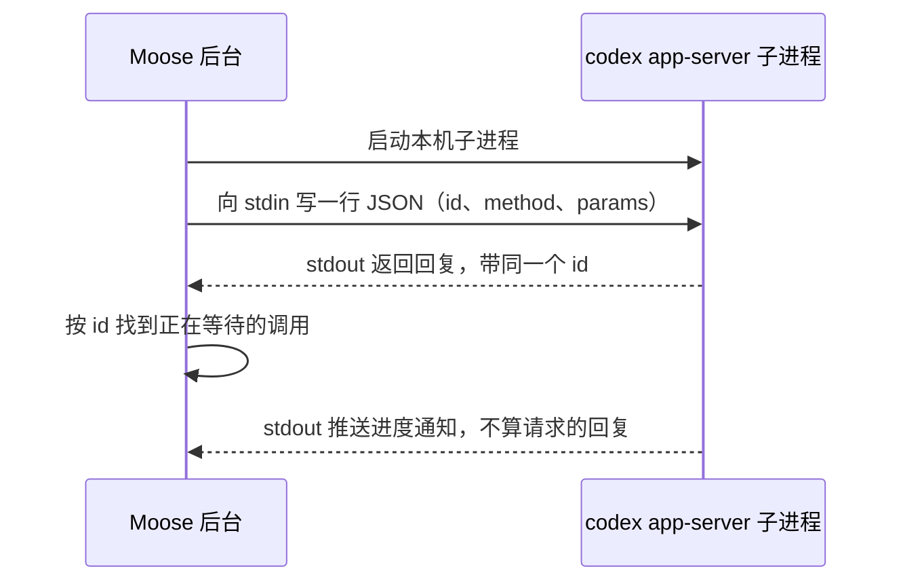

- `turn/start`、`thread/goal/set` 等是 **Moose 后台发给 Codex 的请求名**，不是用户输入的命令，也不是网址。
- 它们走第 5 节说的 stdio 管道，每行是 `{ id, method, params }`，所以“发请求”不一定走 HTTP。
- 源码见[进程启动](../../../electron/providers/process.ts)、[请求与回复配对](../../../electron/providers/rpc.ts)和 [Codex 适配器](../../../electron/providers/codex.ts)。

| 名称 | 含义 |
| --- | --- |
| thread（会话） | Codex 保存对话和任务状态的地方，同一个 thread 可以执行多轮 |
| turn（执行轮次） | 在 thread 里处理一次输入。Plan 的“写方案”和批准后的“执行方案”是两个 turn |
| `turn/start` | 开始一个 turn，把正文和本轮模式交给 Codex |
| `thread/goal/set` | 创建或更新长期目标：目标文字、暂停或继续、可选的 token 预算 |
| `thread/goal/get` | 读取目标当前的状态，供 Moose 判断是否还要等待 |

### Plan：批准的是哪一版计划

以输入 `/plan`、选中“Plan mode”、发送“给登录页加验证码”为例：

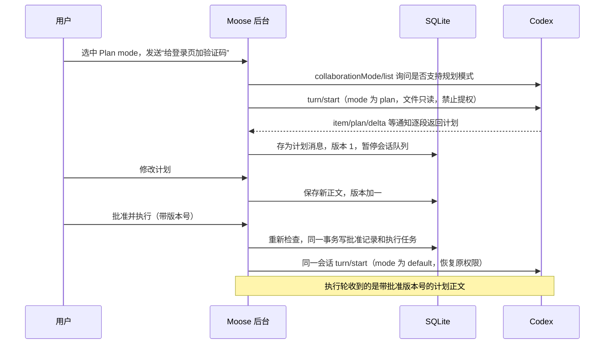

- 写方案这一轮权限限制为只读、禁止提权；即使会话平时允许写文件，也不沿用写权限。
- 页面显示“修改计划”和“批准并执行”；规划完成本身不会自动开始写代码。

批准时后台重新检查四个条件，全部满足才放行：

```text
计划已经生成完毕
  且 版本仍是最新
  且 还没被批准过
  且 会话里没有更新的需求
```

“批准记录”和“按此版本执行的新任务”在同一个事务里写入，所以重复点击不会执行两次，也不会执行旧版本。

迟到的批准请求：

| 时刻 | 发生了什么 | 结果 |
| --- | --- | --- |
| T1 | 页面停在计划版本 2 | 按钮看起来仍可点 |
| T2 | 另一处把计划改成版本 3 | 数据库里最新版本是 3 |
| T3 | 针对版本 2 的批准请求到达后台 | 后台拒绝 |

只把旧按钮置灰挡不住迟到的请求，所以后台必须自己检查版本。

代码入口：[模式候选项](../../../src/components/context-suggestions.tsx)、[计划展示与按钮](../../../src/components/plan-review.tsx)、[计划版本与批准事务](../../../electron/plans.ts)、[队列与暂停](../../../electron/session-execution.ts)、[Codex Plan 协议](../../../electron/providers/codex.ts)。

### Goal：谁来安排下一轮

以输入 `/goal`、选中“Goal mode”、发送“把项目里的类型错误修完”为例。Moose 负责启动任务、显示结果；要不要继续下一轮，由底座的 Goal 机制决定。

#### 选择 Codex 时

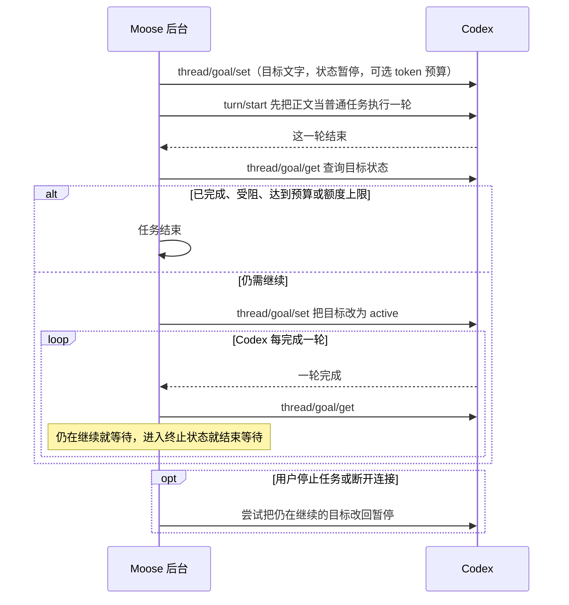

- 后续轮次由 Codex 安排，Moose 只负责查询状态、决定是否还要等待。

#### 选择 Grok 时

```text
实际发给 Grok 的内容（ACP 的 session/prompt）：
/goal 把项目里的类型错误修完
```

| 底座 | Goal 怎么实现 | Moose 等什么 |
| --- | --- | --- |
| Codex | `thread/goal/set` 和 `thread/goal/get` | 目标进入完成、受阻或达到上限等终止状态 |
| Grok | 后台在正文前加上 `/goal `，通过 ACP 的 `session/prompt` 发送，由 Grok 自己处理 | 这次调用返回即可；不使用 Codex 的 `thread/goal/*` 接口 |
| Pi、OpenCode | 没有原生目标状态机。目标约束只写进这一轮提示，回合结束即停 | 这一轮调用返回 |

代码入口：[模式与提示](../../../electron/providers/modes.ts)、[模式候选项](../../../src/components/context-suggestions.tsx)、[Codex](../../../electron/providers/codex.ts)、[Grok](../../../electron/providers/grok.ts)、[Pi](../../../electron/providers/pi.ts)、[OpenCode](../../../electron/providers/opencode.ts)。

### 插话：和下一条排队消息有什么不同

| | 普通发送 | 插话 |
| --- | --- | --- |
| 什么时候生效 | 等当前任务结束后再开始 | 送进正在运行的回合 |
| 由谁保存和调度 | Moose 的持久化队列 | 底座接收后自行处理 |
| 各底座的接口 | — | Codex：带 `expectedTurnId` 的 `turn/steer`；Grok：ACP 扩展 `_x.ai/interject`；Pi 1.x：原生 `steer`；OpenCode：不支持，走普通队列 |

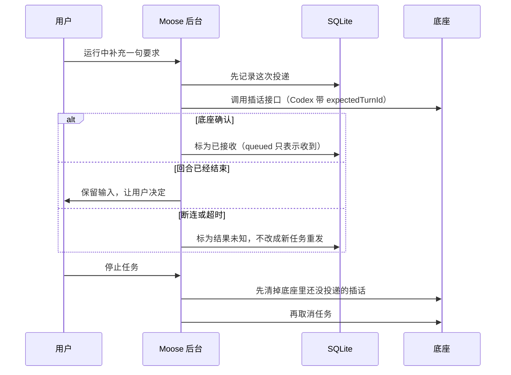

- `expectedTurnId` 确保插话进的是用户看到的那个回合，而不是已经换掉的新回合。
- 底座返回 `queued` 只表示它收到了，不表示模型已经采纳。
- 停止时先清插话再取消，防止迟到的插话变成下一轮的输入。

插话不能做的事：

- 不能让代理停在某一行代码。
- 不能撤回已执行的操作。
- 不能悄悄改变本轮的模型、权限或模式。

代码入口：[投递状态](../../../electron/steering.ts)、[Codex](../../../electron/providers/codex.ts)、[Grok](../../../electron/providers/grok.ts)、[Pi](../../../electron/providers/pi.ts)。

## 9. 原生历史与子代理

**一句话**：CLI 自己的历史只读导入、关联原生 ID，不改源数据也不双向同步；子代理由底座决定是否派出，Moose 只负责识别、展示和守住审批与完成状态的规则。

### 为什么还要读取 CLI 自己的历史

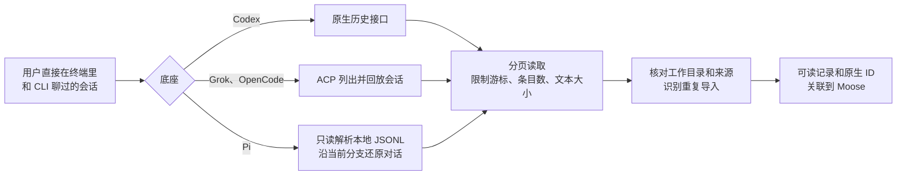

这些会话不在 Moose 的数据库里，为了能接着继续工作，Moose 提供浏览、预览和导入。

- 限制游标、条目数和文本大小，是为了防止死循环或内存耗尽。
- 原生历史本身不被修改；Pi 的源文件也不改写。
- 不做持续的双向同步。

### 编辑、分叉、压缩分别改变什么

| 操作 | 解决什么问题 | **不会**自动发生什么 |
| --- | --- | --- |
| 编辑最新一条用户消息 | 修正刚才的需求：替换最后一轮并重新执行 | 不会撤销上一轮已经改过的文件 |
| 原生分叉 | 从某个历史节点另开一段对话，保留来源关系 | 不会创建独立的代码目录 |
| 手动压缩 | 让底座整理上下文，控制上下文长度 | 不会删除 Moose 的聊天记录 |

- 目前只有 Codex 接入了分叉和压缩的原生接口。
- 如果某个底座只能用可见文字重建上下文，就不能说是完整复制了内部状态。

### 子代理是不是 Moose 派出来的

不是。是否委派、委派给谁，由底座根据任务和自身配置决定，Moose 不强制拆分任务。

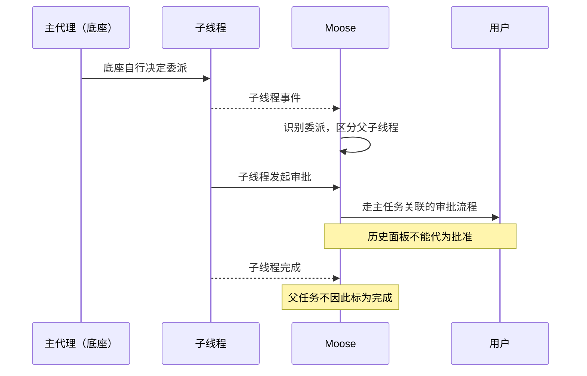

| 底座 | 提供什么 | Moose 能做什么 |
| --- | --- | --- |
| Codex | 结构化的父子关系和历史 | 展示子线程，对子线程发送消息和停止 |
| Grok | 只有 ACP 工具活动 | 只展示这些活动，不伪造一棵完整的子线程树 |

- 控制请求被底座接收，也不代表子任务已经完成。
- 在 Codex 里用 `thread/resume` 打开一个已结束的子线程，只是把它的历史加载出来，不会让它重新运行；要继续那部分工作，需要主代理重新委派。

### 为什么有时看不到“思考”

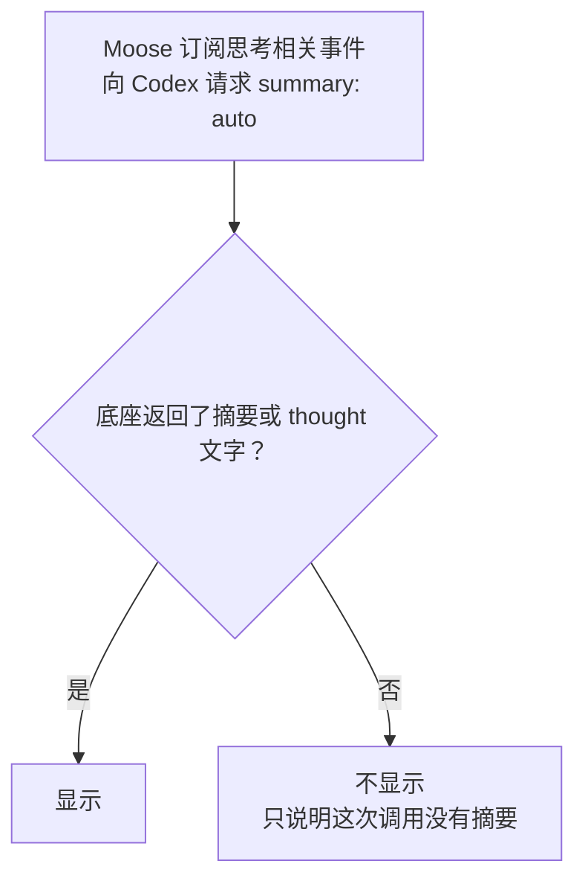

- 一次探测中回答正常、却没有返回任何摘要，这只能说明那次调用没有摘要，不能推断所有模型都不支持。
- 准确的说法是“展示底座提供的思考摘要或 thought 内容”。协议没给的内部推理，客户端拿不到。

代码入口：[历史协调](../../../electron/native-history.ts)、[Codex 原生会话](../../../electron/providers/codex-sessions.ts)、[Grok 原生会话](../../../electron/providers/grok-sessions.ts)、[Pi 历史](../../../electron/providers/pi-sessions.ts)、[ACP 历史](../../../electron/providers/acp-sessions.ts)、[子代理事件转换](../../../electron/providers/codex-subagents.ts)。

---

上一篇：[代理接入与流式消息](02-agents-and-streaming.md) ｜ [追问资料目录](README.md) ｜ 下一篇：[Git、扩展配置与后台任务](04-git-extensions-background.md)
