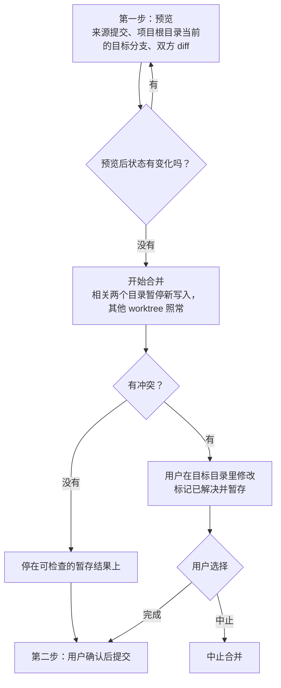
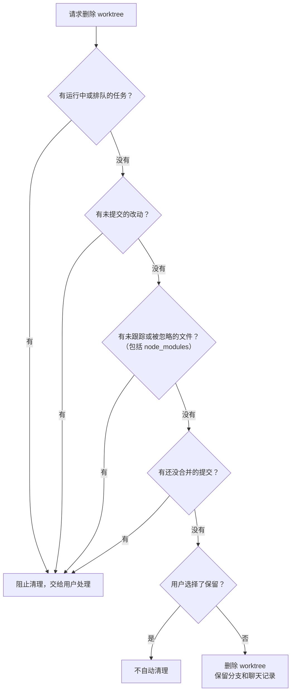
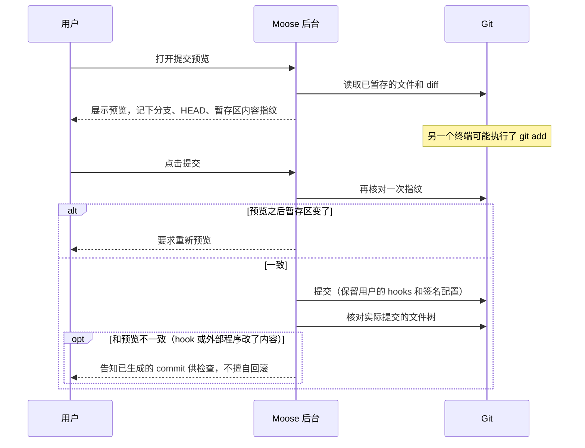
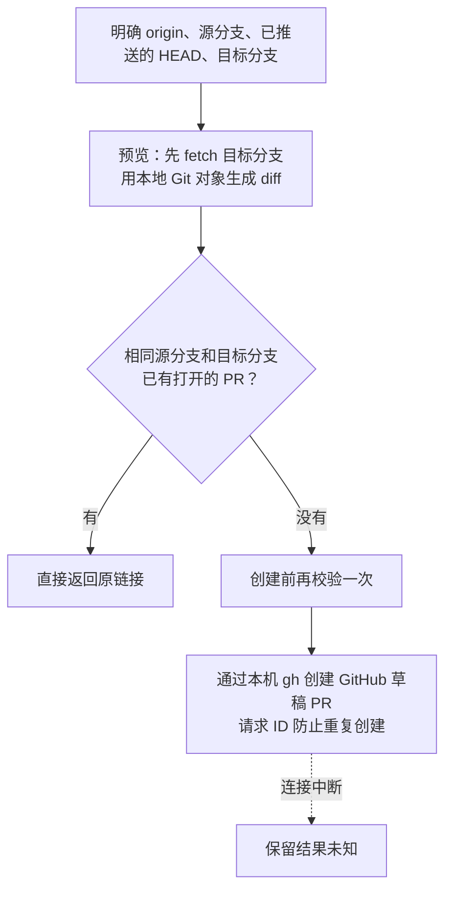
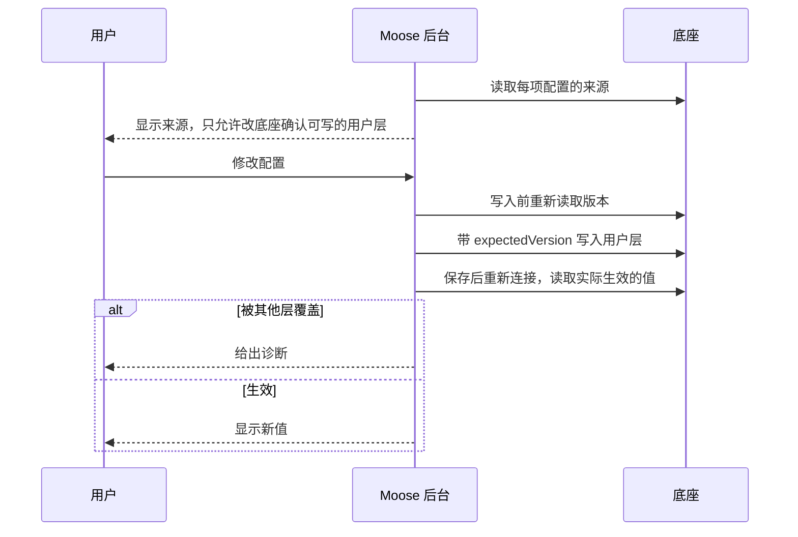
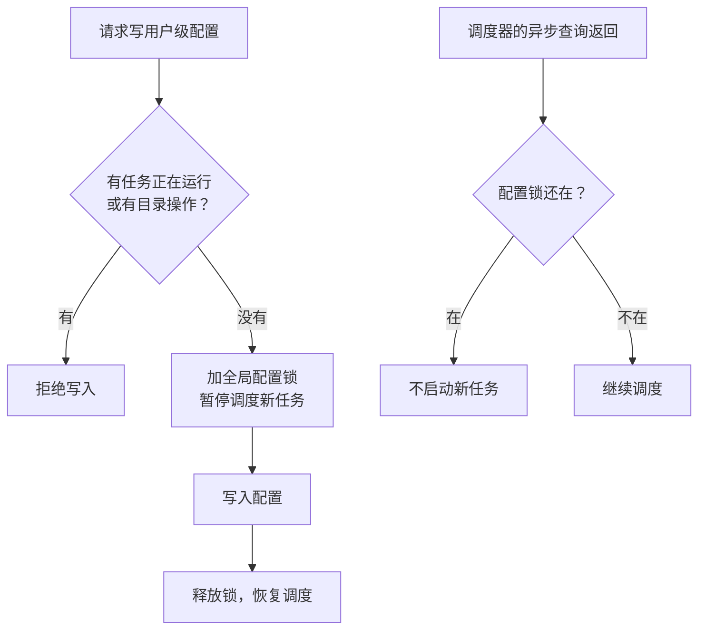
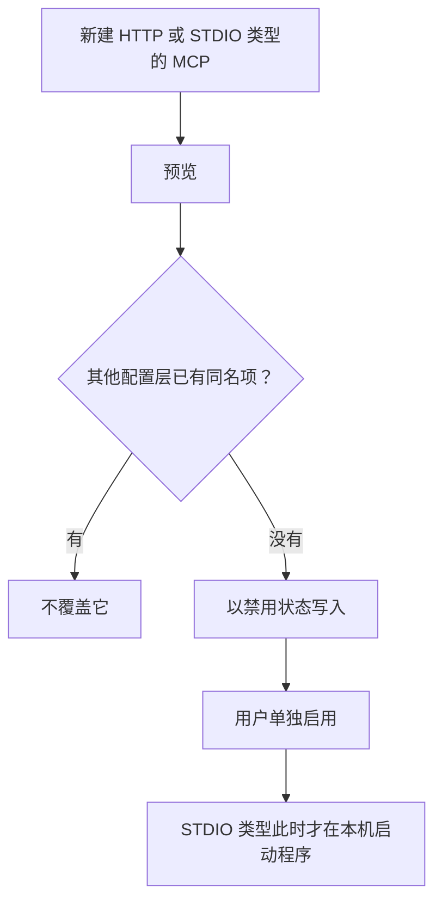
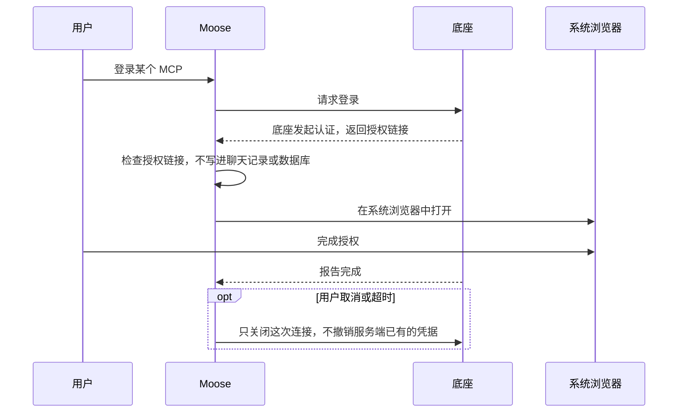
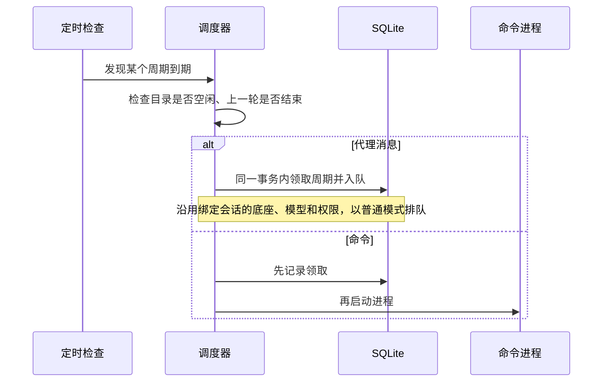
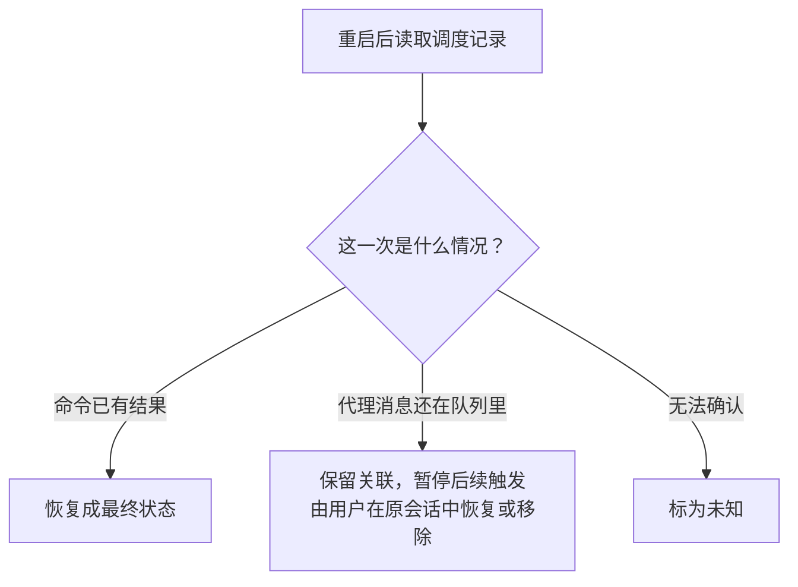

# Git、扩展配置与后台任务

> 本篇收录追问资料第 10–13 节，节号与全套资料统一。源码基准 Moose 0.23.1。[追问资料目录](README.md)

## 10. 用 worktree 隔离代码修改

**一句话**：会话分叉只隔离对话，worktree 才隔离文件；合并分预览和确认两步，清理前逐项检查，宁可阻止也不误删。

```text
项目 shop
├─ 会话 A → 项目根目录       → 当前分支
├─ 会话 B → worktree/login   → 登录修复分支
└─ 会话 C → worktree/search  → 搜索改进分支
```

Git worktree 可以为同一个仓库提供多个工作目录，各自在不同分支上，所以 B 和 C 可以并行改代码。

| | 会话分叉 | worktree |
| --- | --- | --- |
| 隔离对话 | 是 | 新建一个空白会话 |
| 隔离文件 | 否 | 是，独立工作目录和分支 |

创建 worktree 时：

- Moose 从指定的 ref 创建分支和受管的 worktree，并为它新建一个空白会话。
- 原会话的目录和原生 ID 不变。
- 未提交的文件、依赖目录和聊天历史都不会自动复制过去。

必须跟着切换到各自目录的东西：文件引用、技能、代理、命令、Git diff 和“用编辑器打开”。如果只改了 CLI 的 `cwd`，就会出现“代理改的是 A 目录，用户看到的 diff 却是 B 目录”的错位。

### 合并为什么分两步



- 即使没有冲突，也先停在暂存结果上，用户确认后再提交。
- 合并中途应用重启：Moose 同时核对 Git 的实际状态和自己的记录，保留冲突现场供用户继续或中止，不会只凭数据库状态重新执行 merge。

### 为什么清理这么谨慎



- 连 `node_modules` 这类被忽略的目录也会阻止清理，需要用户先处理。
- 清理后，旧会话不会悄悄退回项目根目录去写文件。

验证与边界：

| 项目 | 内容 |
| --- | --- |
| 验证方式 | 真实的临时 Git 仓库，覆盖创建、冲突、继续、中止和清理 |
| 0.22.x 回归 | 冲突状态下桌面重开后，通过界面完成或中止合并 |
| 隔离不了的 | 端口、外部数据库、远端资源和共享配置 |

代码入口：[worktree 管理](../../../electron/worktrees.ts)、[worktree 的 Git 操作](../../../electron/worktree-git.ts)、[真实 Git 验收](../../releases/feature-validation-history.md#worktree)。

## 11. Git 提交、PR 和原生代码审查

**一句话**：提交前后各核对一次，保证用户确认的就是实际提交的；PR 只建草稿、不自动推送；代码审查另开只读线程，结果如实标注为底座输出。

### 用户确认的内容和实际提交的内容要一致

改动面板的分类：

| 分类 | 说明 |
| --- | --- |
| 已暂存 | 同一个文件可以同时有已暂存和未暂存的部分 |
| 未暂存 | 暂存按文件进行 |
| 未跟踪 | 新文件 |

面板里也包括代理运行**之前**就存在的改动，所以不能把它们都标成“本轮 AI 生成”。



- 提交后不一致时，不会假装符合预览，也不会擅自回滚。

安全细节：

| 做法 | 说明 |
| --- | --- |
| Git 命令以参数数组调用，路径按字面处理 | 避免路径被当成命令解析 |
| 读取 diff 时关闭外部 diff 工具和 textconv | — |
| 还没结束的 merge、rebase、cherry-pick | 不能被普通提交绕过 |

### 创建 PR 的边界



不做的事：

- 不会自动推送分支。
- 暂不支持跨 fork、GitHub 企业版和其他代码平台。

### 原生代码审查为什么另开线程

| | 执行任务的会话 | 审查线程 |
| --- | --- | --- |
| 上下文 | 已经带着任务上下文 | 新建的干净线程 |
| 权限 | 有写权限 | 只读 |
| 调用 | — | Codex 的 `review/start` |
| 结果保存 | — | 审查结果、状态和停止入口单独保存 |

- 可以审查：未提交的改动、相对某个分支的 diff、某个 commit。
- 文件路径和行号直接采用底座返回的值。

要如实说明：

- 审查会消耗额度。
- 可能漏报或误报，不能代替测试。
- 不是 Moose 自研的静态分析器。

代码入口：[Git 操作](../../../electron/git-actions.ts)、[审查管理](../../../electron/review-workbench.ts)、[PR 操作](../../../electron/pull-requests.ts)、[Git 与审查验收](../../releases/feature-validation-history.md#git-与原生审查)。

## 12. 配置、MCP、插件与认证

**一句话**：Moose 只写底座确认可写的用户级配置，写前带版本、写后核对生效值，写入期间用全局锁暂停调度；新 MCP 默认禁用，敏感信息不进页面和数据库。

### 先分清几类扩展

| 概念 | 是什么 |
| --- | --- |
| Skill | 给代理阅读的操作说明（`SKILL.md`） |
| MCP | 让代理连接外部工具或资源的协议 |
| 插件 | 由底座管理的扩展能力包 |
| Hook | 在特定事件发生时触发的脚本 |

它们彼此有关联，但配置方式各不相同。设置里的 **扩展（Extensions）** 页管理所选底座的**用户级**配置：

| 底座 | 已接入 | 未开放或需在别处完成 |
| --- | --- | --- |
| Codex | 查看配置来源、默认模型、MCP、插件和 MCP 的 OAuth 登录 | 项目级配置写入、Hooks 编辑 |
| Grok、Pi、OpenCode | 各自的一部分用户级管理 | 项目级配置写入、Hooks 编辑；OAuth 仍需在 CLI 里完成 |

- 各底座具体支持什么，见[能力表](../../providers/native-capabilities.md)。
- 早期“只有 Codex 支持配置管理”的说法已经过时。

### 为什么先显示“来源”，再允许修改

一个配置项的最终值可能来自用户级、项目级、profile 或组织下发的受管理配置。用户改了却不生效，往往是别的层级优先级更高。



- `expectedVersion` 避免覆盖别处刚做的修改。
- 插件的安装和卸载调用经过验证的 CLI 命令，启用和停用走配置接口。
- 协议里出现的字段，不会直接当成稳定能力开放。

### 为什么配置写入要用全局锁



目录锁只保护一个工作目录，而用户级配置会影响所有项目，所以需要全局锁。

| 做法 | 解决什么 | 代价/边界 |
| --- | --- | --- |
| 有任务运行或有目录操作时拒绝写配置，写入期间暂停调度 | 用户级配置影响所有项目，目录锁管不到 | 用户必须等任务结束才能改配置 |
| 调度器异步查询返回后重新检查配置锁 | `await` 期间锁状态可能已变（同第 7 节） | — |
| 全局锁本身 | — | 只约束 Moose 自己，挡不住外部终端直接改配置文件 |

### 新注册的 MCP 为什么默认不启用



注册和运行是两回事：STDIO 类型的 MCP 一启用就会在本机启动一个程序，所以保存时不应立即运行。

| 字段 | 怎么保存 |
| --- | --- |
| STDIO 的命令和参数 | 分字段保存，不拼成一段 Shell 文本 |
| 环境变量 | 只填变量名，不保存密钥的值 |

### OAuth 和敏感信息怎么处理



| 页面能拿到 | 页面拿不到 |
| --- | --- |
| 白名单里的展示字段 | 完整配置、命令、请求头、环境变量的值 |

- 诊断信息不直接透传原始报错。
- 操作回执只保存意图指纹，不重复保存 MCP 配置正文。
- 边界：以上保护只覆盖配置链路。代理的回复和命令输出仍会进入历史记录，如果它们自己打印了密钥，Moose 没有全局自动脱敏。

代码入口：[配置操作协调](../../../electron/extensions.ts)、[Codex 配置适配](../../../electron/providers/codex-extensions.ts)、[其他底座的用户配置](../../../electron/providers/user-extensions.ts)、[插件 CLI](../../../electron/providers/codex-plugins.ts)、[MCP 输入约束](../../../shared/mcp-registration.ts)。

## 13. 后台命令与定时任务

**一句话**：命令和终端跑在共享后台里，关窗不停；定时任务先“领取”周期再执行，错过的周期最多补跑一次，结果不明就标为未知、不自动重跑。

### 两种运行命令的方式

| | 命令面板 | 交互终端 |
| --- | --- | --- |
| 适合 | 一次性命令 | vim 等需要终端的交互程序 |
| 技术 | 直接通过管道读写 stdin／stdout／stderr | PTY 伪终端，页面用 xterm.js 显示 |
| 能做什么 | 查看输出、向 stdin 发送文字或结束符（EOF）、停止进程 | 完整的终端体验，可停靠在弹窗、底部或右侧 |

命令面板的例子：

```bash
# 命令会读入用户在界面上输入的一行文字，再原样打印
read line; printf '%s' "$line"
```

终端面板的行为（0.21.3 起统一，操作步骤见[使用指南](../../usage.md#终端命令与定时任务)）：

| 操作 | 行为 |
| --- | --- |
| 打开面板 | 没有标签就新建一个 Shell，已有则复用 |
| 切换停靠位置 | 不会重建进程 |
| 关闭最后一个标签，或最后一个 Shell 自己退出 | 面板自动收起 |
| 只是隐藏面板 | Shell 仍然保留 |

保留量：

| 内容 | 保留多少 |
| --- | --- |
| 命令输出 | 最近约 128K 字符 |
| 命令记录 | 每个项目最近 100 条 |
| 旧的请求记录 | 仍保留，用来识别重复请求 |
| stdin 的输入 | 不单独记录，但命令自己可能把它回显到输出里 |

### 关窗口、退出、崩溃是三种情况

| 情况 | 结果 |
| --- | --- |
| 安装版关窗或普通退出 | 共享后台、命令和终端继续运行 |
| 显式停止后台 | 这时才清理进程 |
| 后台被强制结束 | 父进程管道关闭，监视逻辑清理它启动的命令进程组 |
| 重启后 | 不按旧 PID 杀进程，因为 PID 可能已被别的程序复用；无法确认结果的旧记录标为未知，不自动重跑 |

- 独立开发模式下，后台随应用退出。
- 主动脱离进程组的守护程序，目前没有完整的生命周期保证。

### 定时器只是入口，关键是持久化

调度记录保存：内容、绝对时间、时区、间隔、启用状态和上次结果。



- 原则是**先“领取”这个周期，再执行有副作用的操作**。
- 这样重启后能分清哪些周期已经处理过。

### 休眠期间错过了十次，要补跑十次吗

不要。以每分钟一次的任务、电脑休眠十分钟为例：

| 时刻 | 发生了什么 | 结果 |
| --- | --- | --- |
| 休眠开始 | 电脑进入睡眠 | 不会唤醒电脑，睡眠期间不保证准时 |
| 休眠中的十分钟 | 本应触发十次 | 都没有执行 |
| 唤醒后 | 调度器发现错过十个周期 | 合并为最多补跑一次 |
| 补跑之后 | 计算下次时间 | 下次时间推到未来，不会连跑十次 |
| 补跑还没结束时又到期 | 上一轮仍在运行 | 不会重叠启动下一轮 |

两种时间规则：

| 规则 | 怎么算 | 注意 |
| --- | --- | --- |
| 固定间隔 | 按实际经过的时长 | “每隔 24 小时”在夏令时切换时与“每天当地九点”不同 |
| 日历规则 | 按指定时区的每天或每周某个钟点，可预览接下来几次的时间 | — |

- 目前不支持每月规则或任意 cron 表达式。
- 安装版退出后共享后台仍能继续调度，但没有开机自启。

### 编辑和恢复有哪些限制

重启后先核对事实，再决定状态：



编辑规则：

- 必须先暂停，才能编辑名称、类型、正文、时间和间隔；保存后仍是暂停状态，需要单独恢复。
- 后台会检查版本。已经被领取、正在排队或运行的那一次不能换内容。
- 已执行过的单次任务不能再恢复。
- “创建”请求的指纹和后续编辑分开保存。重试原来的创建请求只会返回已有任务，不会因为名称改过就当成新请求，也不会覆盖内容或解除暂停。

代码入口：[命令生命周期](../../../electron/command-jobs.ts)、[调度器](../../../electron/schedules.ts)、[后台记录](../../../electron/background-store.ts)、[定时任务编辑](../../../src/components/schedule-form.tsx)、[测试方法](../../testing.md)。

---

上一篇：[任务执行：排队恢复、Plan／Goal 与历史](03-execution.md) ｜ [追问资料目录](README.md) ｜ 下一篇：[安全边界与功能验证](05-security-and-verification.md)
