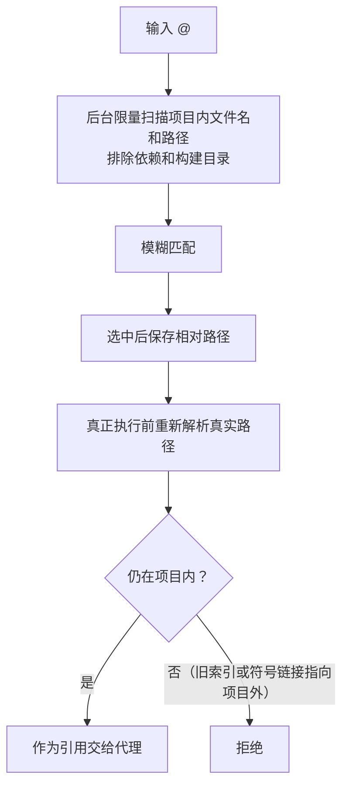
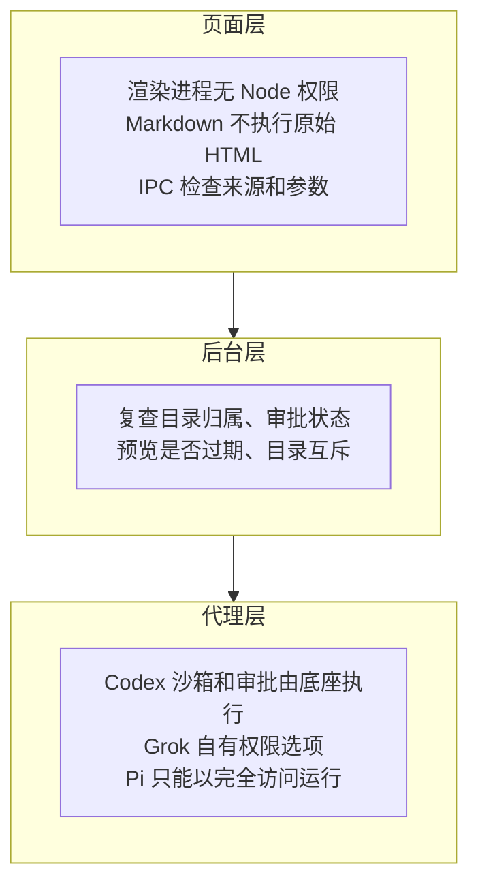
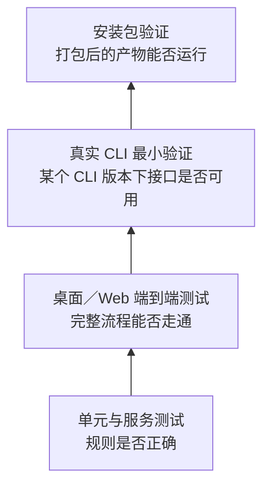
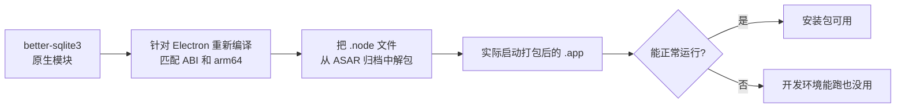

# 安全边界与功能验证

> 本篇收录追问资料第 14–15 节，节号与全套资料统一。源码基准 Moose 0.23.1。[追问资料目录](README.md)

## 14. 输入体验和安全边界

**一句话**：文件引用、附件和技能在执行前都会再次校验；前端照顾输入法、键盘、可访问性和动效；安全按页面、后台、代理三层分别说明，前端禁用按钮不是防线。

### 文件引用、附件和技能

| 输入 | 怎么处理 | 边界 |
| --- | --- | --- |
| **`@` 文件引用** | 只搜索项目内的文件名和路径，执行前重新检查真实路径 | 防止旧索引或符号链接指向项目外 |
| **附件** | 复制到应用数据目录，原文件被移动后草稿仍然有效；每次最多 10 个，单个不超过 20 MB；图片按文件内容（而不是扩展名）识别；小文本可以直接读进上下文；其他文件交给代理处理 | Moose 不是万能格式解析器；能否理解图片取决于底座和模型 |
| **技能** | 读取 `SKILL.md` 的名称、描述和位置，按真实路径去重，提交时再校验；Codex 支持结构化的技能引用，其他底座以文本形式传递技能位置 | 扫描和选择技能，不等于 Moose 执行了技能里的代码 |

### 前端交互有哪些值得讲的细节

| 方面 | 做法 |
| --- | --- |
| **中文输入法** | 按 Enter 可能只是确认候选词，所以发送前先检查是否处于输入法组合状态 |
| **键盘操作** | `@` 和 `/` 菜单支持方向键、Enter／Tab 选择、Escape 关闭，并始终保留输入框焦点。0.23.1 起文件树支持 Tab 进入、方向键浏览、Enter 打开；搜索结果支持 Ctrl／⌘+Home／End 跳到首尾 |
| **可访问性** | 图标按钮有可读名称，对话框有标题，Base UI 负责焦点管理和键盘操作；收起的侧栏设为 `inert`，读屏和 Tab 都不会进入 |
| **动效** | 侧栏宽度、标题栏留白和 Web 切换按钮绑定在同一个无回弹的弹簧动画上，避免折叠时标题先往右跳再拉回；动画中途反向时从当前位置和速度继续 |
| **减少动态效果** | 系统开启时直接切换；窄屏 Web 改用覆盖式侧栏 |
| **过渡统一** | 0.23.0 起菜单、弹窗和提示也统一为可中途反向的过渡 |
| **语言与主题** | 中英双语和主题集中配置 |

动效验证：

- 桌面和 Web 共用[逐帧回归检查](../../../tests/e2e/sidebar-motion.ts)，验证单向移动、起止边界和中途反向。
- 在真实可见窗口里的视觉核对仍需单独做。

这些都可以现场演示。边界：还没有做过完整的 VoiceOver 人工听读审计。

### 安全分三层讲

| 层 | 措施 |
| --- | --- |
| 页面层 | 渲染进程没有 Node 权限；Markdown 不执行原始 HTML；IPC 检查请求来源和参数；禁止任意导航、新开窗口和嵌入 webview |
| 后台层 | 复查目录归属、审批状态、预览是否过期和目录互斥——前端禁用按钮只是提示，不是防线。Git 等程序以参数数组调用；用户自己输入的 Shell 脚本则照原样作为脚本执行 |
| 代理层 | Codex 的沙箱和审批由底座执行；Grok 有自己的权限选项；Pi 没有内置审批沙箱，只能明确以完全访问运行。Moose 的后台 Shell 以本机用户权限运行，不继承 Codex 的只读沙箱 |

还要补一句：

- Plan 的只读限制只约束本地文件，不能保证外部 MCP 工具没有副作用。
- 页面权限、CLI 文件权限和远端工具权限要分别说明。

代码入口：[附件处理](../../../electron/attachments.ts)、[引用与技能](../../../electron/context-catalog.ts)、[输入框](../../../src/components/composer.tsx)、[权限映射](../../../electron/providers/codex-permissions.ts)、[主进程安全设置](../../../electron/main.ts)。

## 15. 怎么证明这些功能真的可用

**一句话**：四类验证各证明一层，组合起来才可信；每一层都有它证明不了的东西，引用时要说清版本和边界。

### 四类验证各管什么

图从下往上读：越往上越接近用户真实使用，但覆盖的场景也越少。

| 验证方式 | 能证明什么 | 不能据此推出什么 |
| --- | --- | --- |
| 单元与服务测试 | 消息合并、队列事务、版本冲突、目录约束、取消和重启状态等规则正确 | 所有真实 CLI 版本都会按相同顺序返回事件 |
| 桌面／Web 端到端测试 | 页面、宿主传输、后台和 SQLite 能走通完整流程 | 测试用 CLI 的回答等于真实模型的结果 |
| 真实 CLI 最小验证 | 某个 CLI 版本下，接口和实际事件确实可用 | 所有账号、模型、系统和复杂任务都验证过 |
| 安装包验证 | 原生依赖、签名、启动和打包后的代码能运行 | 已完成 Apple 公证，或已支持所有平台 |

#### 为什么既用模拟 CLI 又用真实 CLI

| 手段 | 用在哪里 | 作用 |
| --- | --- | --- |
| 模拟 CLI 程序 | “完成通知先到”“审批被拒绝”“连接突然断开”等难以复现的场景 | 稳定地制造这些顺序和故障 |
| 临时目录里的真实程序 | Git 和 Shell 的关键场景 | 直接验证真实命令的行为 |
| 少量真实协议验证 | 各代理 CLI 的接口 | 防止模拟程序和客户端对接口有同样的误解 |

### 当前可以引用的证据

| 证据类型 | 内容 | 边界 |
| --- | --- | --- |
| 0.23.1 发布验收 | 35 个文件、209 项单元测试，83 项桌面／Web 端到端测试全部通过；另有格式、lint、类型检查、构建、桌面安装包检查、独立 Web 干净安装和公网安装验证。见 [0.23.1 验收记录](../../releases/0.23.1-validation.md) | 这是该版本的用例数量，不是覆盖率，也不保证没有缺陷；真实 CLI 验证另算 |
| 长时间运行 | 0.22.0 发布后对源码构建跑了两小时固定负载，结果见第 7 节 | 针对源码构建 |
| 持续回归覆盖 | 中文和特殊字符搜索、跨分页定位、阅读历史时的流式更新、桌面与 Web 通知去重、保存失败时保留输入、结果未知时不重发、文件读取边界等 | 自动化回归 |
| 未做人工验收的 | 系统通知授权弹窗的点击、通知中心的实际展示、VoiceOver 听读、真实休眠／唤醒 | 面试时要主动说明没测 |

#### 真实 CLI 验证时间线（各自注明版本）

| 时间／版本 | 底座 | 验证内容 |
| --- | --- | --- |
| 更早（Moose 0.11.0） | Codex 0.155.1 | 真实的只读配置探测；用户配置写入、插件安装和服务端 OAuth 使用的是隔离夹具，原生审查和远端 PR 创建也没有完整的真实服务验收 |
| — | Codex 0.155.0 | 原生 Plan、修改计划后批准执行、同一回合内插话 |
| — | Codex 和 Grok | 各让子代理计算 `2 + 2` 得到 `4`，以及历史读取的最小验证 |
| 2026-09-21 | Pi 0.85.1 和 OpenCode 2.0.10 | 隔离目录里真实写文件、跨进程续接、运行中取消；OpenCode 还通过了审批批准／拒绝 |
| 2026-10-02 | Pi 1.0.0 和 OpenCode 2.0.21 | 历史预览、去重导入、跨目录拒绝、导入后续聊；Pi 还验证了原生插话被实际消费 |

### 为什么要单独检查安装包

- 原生模块的二进制必须匹配 Electron 的 ABI 和 arm64 架构。
- 开发环境能跑，不能证明安装包能跑。

#### 每次发布的两步检查

| 命令 | 桌面包 | 独立 Web 包 |
| --- | --- | --- |
| `pnpm release:prepare` | 严格签名、版本、渲染进程沙箱、SQLite、命令输入输出、终端三种停靠位置、定时任务编辑 | 干净安装、重复启动、更新时保留运行中的任务、校验失败时保留旧版 |
| `pnpm release:publish` | — | 部署后从公网安装器真实安装一遍 |

#### 交付范围

| 项目 | 现状 |
| --- | --- |
| 桌面 | Apple Silicon macOS 桌面 DMG；ad-hoc 签名，没有 Developer ID 公证 |
| Web | 独立 Web 安装包 |
| 更新方式 | Web 版可手动执行 `moose update` 更新；桌面版是检查到新版本后下载替换；都不是后台自动安装升级 |
| 其他平台 | 没有 Windows 和 Linux 安装包 |

相关入口：[测试总览](../../testing.md)、[打包检查脚本](../../../scripts/package-smoke.ts)、[签名检查](../../../scripts/verify-signature.cjs)、[发布记录](../../releases/)。

---

上一篇：[Git、扩展配置与后台任务](04-git-extensions-background.md) ｜ [追问资料目录](README.md) ｜ 下一篇：[面试表达：案例、取舍、简历与演示](06-interview-expression.md)
