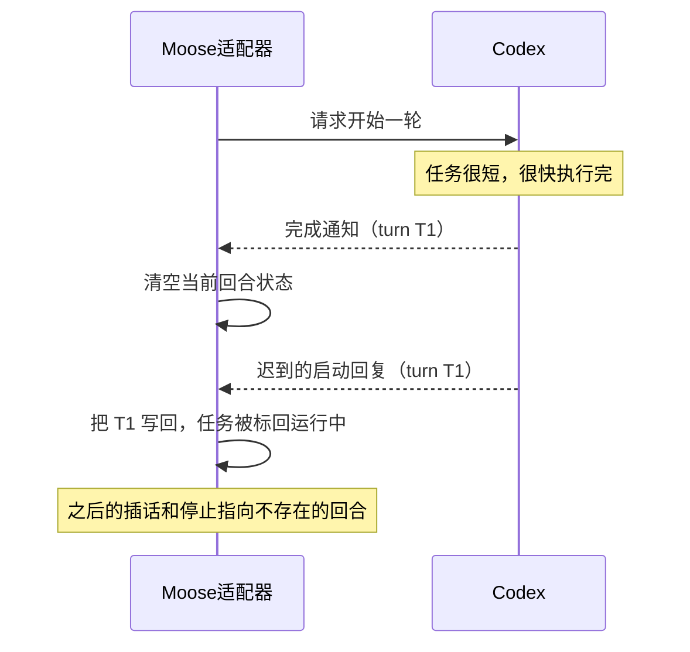
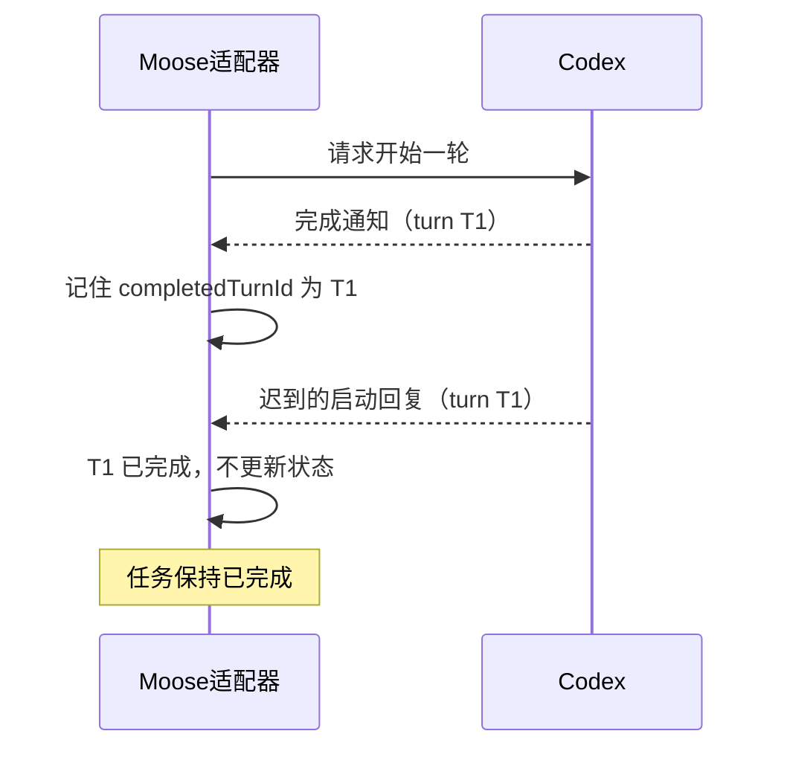
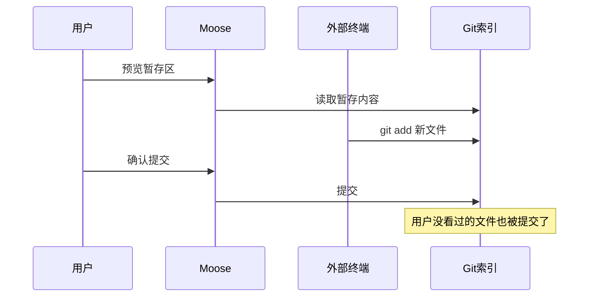
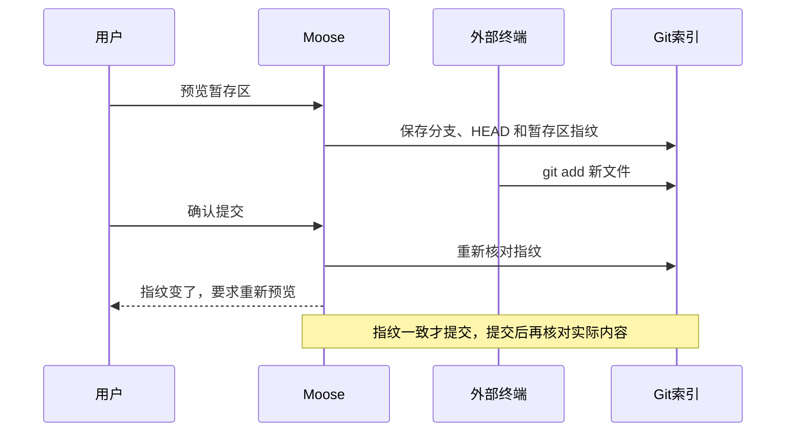
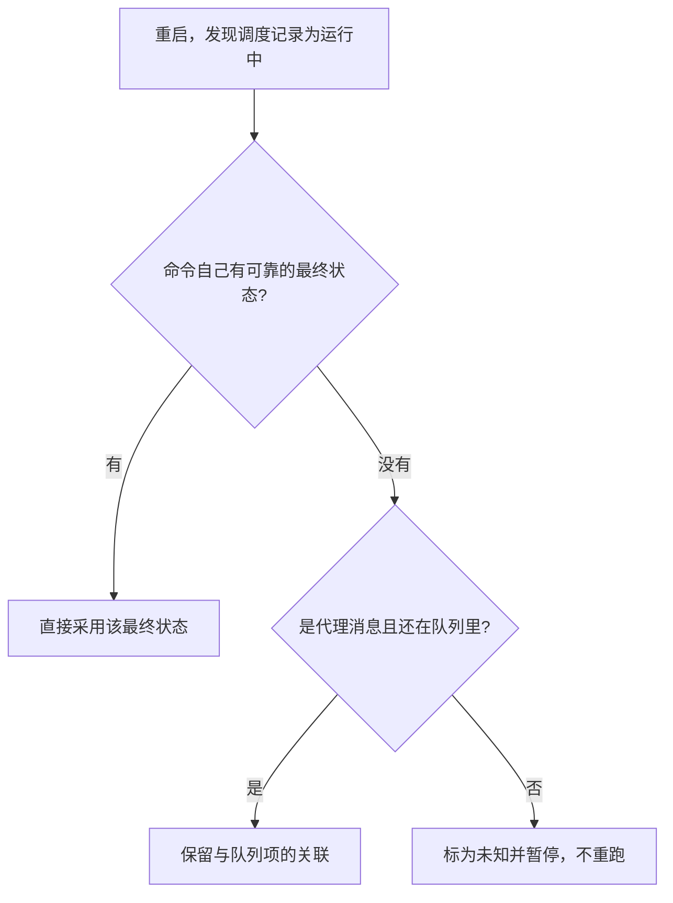
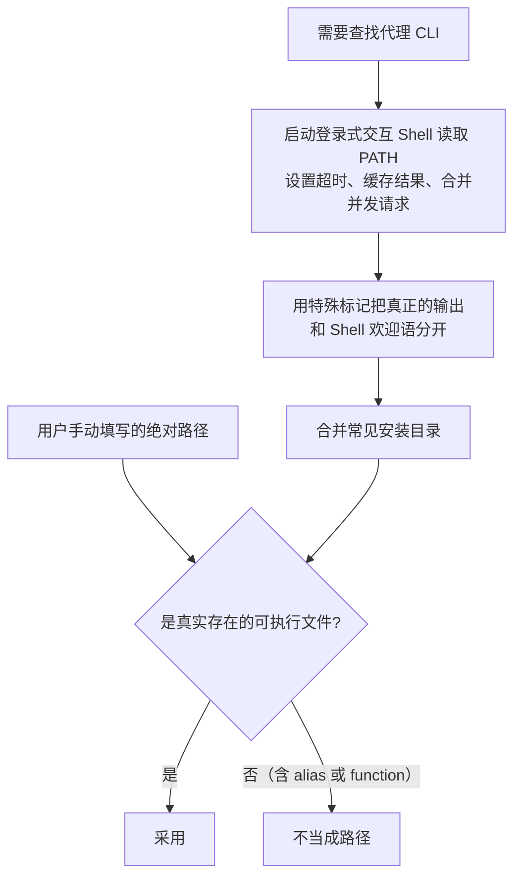
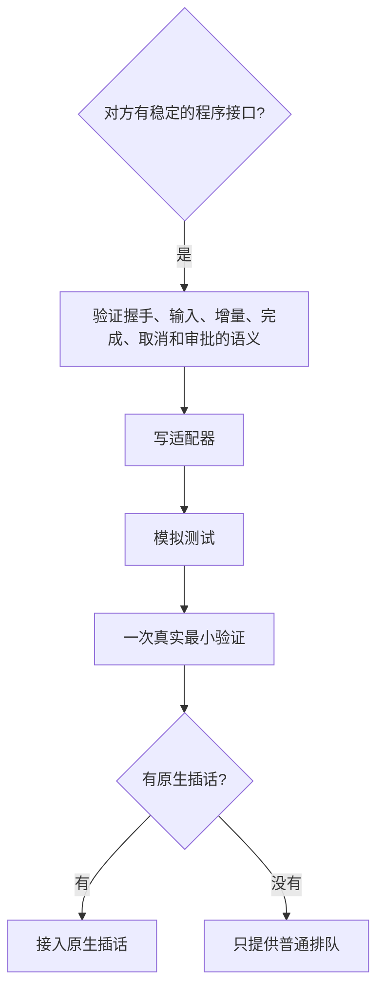
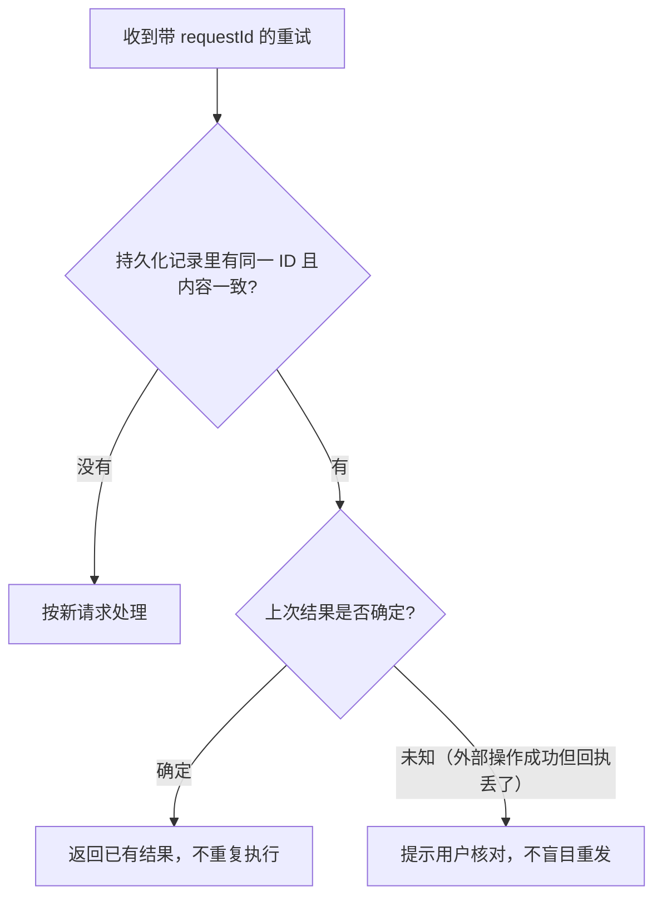

# 面试表达：案例、取舍、简历与演示

> 本篇收录追问资料第 16–18 节，节号与全套资料统一。源码基准 Moose 0.23.1。[追问资料目录](README.md)

## 16. 面试里值得展开的四个问题

**一句话**：四个案例分别讲异步乱序、过期预览、重启核对和图形环境 PATH，都有代码和回归测试作依据，挑两三个自己能讲透的即可。

| 案例 | 核心问题 | 关键手段 |
| --- | --- | --- |
| 例子一 | 回复和通知的到达顺序不确定 | 用回合 ID 判断状态 |
| 例子二 | 预览后暂存区被外部修改 | 提交前复核指纹 |
| 例子三 | 命令完成但调度记录没更新 | 重启时对照多处记录 |
| 例子四 | 图形应用拿不到 Shell 的 PATH | 登录式 Shell 读取加兜底 |

### 例子一：请求回复和完成通知，谁先到都有可能

#### 出问题的时序

#### 修复后的时序

| | 内容 |
| --- | --- |
| 场景 | Moose 向 Codex 发“开始一轮”的请求，Codex 会先回复一个 turn ID，执行完再发“完成”通知。异步接口不保证回复一定先于通知到达，很短的任务可能先收到完成通知 |
| 问题 | 完成通知到达后，状态被清空；随后迟到的启动回复又把 turn ID 写了回去，已经结束的任务就被标回“运行中”，之后的插话和停止都会指向一个不存在的回合 |
| 处理 | 适配器记住已完成的 turn ID，启动回复只更新还没完成的回合。回归测试专门构造了“通知先到”的顺序 |

> **面试时可以这样说**：请求的回复和推送的通知即使走同一条连接，也不能假设先后顺序。我用回合 ID 判断状态，防止迟到的启动回复把已完成的任务改回运行中，并写了测试覆盖这种乱序。

依据：[Codex 适配器的 completedTurnId](../../../electron/providers/codex.ts)、[原生工作流回归](../../../tests/unit/native-workflows.test.ts)。

### 例子二：用户预览过，不代表现在还是那份改动

#### 出问题的时序

#### 修复后的时序

| | 内容 |
| --- | --- |
| 场景 | 用户预览了暂存区准备提交，这时另一个终端执行了 `git add`，预览已经过期 |
| 问题 | 如果只检查“用户点过确认”，就可能把用户没看过的文件一起提交。Moose 的目录锁也挡不住外部终端修改索引 |
| 处理 | 预览时保存分支、HEAD 和暂存区指纹，提交前重新核对，变了就要求重新预览。提交后再核对实际提交的内容；如果 hook 改动了内容，报告已经生成的 commit，不擅自撤销 |

> **面试时可以这样说**：预览之后，外部终端可能还在暂存文件。所以我在提交前复核分支、HEAD 和暂存区指纹，有变化就要求重新预览。计划批准、配置保存、定时任务编辑也用了类似的版本检查，各自按业务规则处理。

依据：[Git 操作实现](../../../electron/git-actions.ts)、[Git 操作测试](../../../tests/unit/git-actions.test.ts)。

### 例子三：命令已经结束，调度记录却还写着运行中

#### 出问题的时间线

| 时刻 | 发生了什么 | 数据库里的状态 |
| --- | --- | --- |
| t1 | 定时触发命令 | 调度记录：运行中 |
| t2 | 命令跑完，退出码已保存 | 命令结果：已完成；调度记录：仍是运行中 |
| t3 | 更新调度状态之前应用退出 | 两处记录不一致 |
| t4 | 重启 | 全标未知会误报；直接重跑可能重复修改文件 |

#### 修复后的重启核对

| | 内容 |
| --- | --- |
| 场景 | 定时触发的命令已经跑完，退出码也存好了，但更新调度状态之前应用退出了 |
| 问题 | 重启后如果把所有“运行中”都标为未知，会误报；如果直接重跑，又可能重复修改文件 |
| 处理 | 重启时先查命令自己的结果，有可靠的最终状态就直接采用；如果是代理消息且还在队列里，就保留关联；只有确实无从判断时才标为未知并暂停 |

> **面试时可以这样说**：恢复时我会把命令结果、队列项和调度记录对照着看：有结果就恢复成最终状态，还在队列就保留关联，确实无法确认才标为未知并暂停，避免重复执行。

依据：[调度器的 reconcileCommands](../../../electron/schedules.ts)、[后台任务恢复测试](../../../tests/unit/background.test.ts)。

### 例子四：终端里能找到 CLI，桌面应用却找不到

#### 出问题的对比

| 启动方式 | 能拿到 Shell 配置里的 PATH 吗 | 结果 |
| --- | --- | --- |
| 从终端启动 | 能 | 找得到 pnpm 等工具安装的 CLI |
| 从 Finder 打开 | 不能 | 提示找不到 CLI |

#### 修复后的路径发现

| | 内容 |
| --- | --- |
| 场景 | 用户在终端里能运行代理 CLI，从 Finder 打开 Moose 却提示找不到。原因是 pnpm 等工具的安装路径写在 Shell 配置里，而从 Finder 启动的图形应用拿不到这些 PATH |
| 问题 | 只从终端启动来测试，发现不了这个问题 |
| 处理 | 启动登录式交互 Shell 读取它的 PATH，再合并常见安装目录，同时支持用户手动填写绝对路径。读取 PATH 时设置超时、缓存结果、合并并发请求，并用特殊标记把真正的输出和 Shell 欢迎语分开。只接受真实存在的可执行文件，不把 alias 或 function 当成路径 |

> **面试时可以这样说**：只从终端启动应用测试，会漏掉图形界面环境下的问题。我单独验证了路径发现，并在开发文档里写了 PATH 的排查方法；桌面应用要按用户真实的启动方式来验收。

依据：[进程与路径发现](../../../electron/providers/process.ts)、[路径发现测试](../../../tests/unit/process.test.ts)、[开发说明](../../development.md)。

## 17. 容易被追问的技术取舍

**一句话**：每个取舍都讲“为什么够用、代价是什么、什么时候再改”；性能结论只说测量能支持的部分。

### Electron 启动慢、包体积大、内存高，你怎么优化？

**先讲结论**：做过三类事——首屏按需加载、发行包少装用不到的二进制和语言包、少把整段历史读进 JavaScript。首屏代码明显变小，安装包和启动时间不是同一件事。字节数和三次样本都在 [0.23.0 验收](../../releases/0.23.0-validation.md) 和 [性能计划](../../perf-refactor-plan.md)，这里只留能说出口的边界。

一项变好不代表另一项也变好。0.23.0 把静态入口 JS 从约 730 KB 降到约 224 KB，欢迎图也小了一个数量级，但 DMG 只少了不到 1%：代码大多挪进了按需模块，Chromium 仍占着安装包。同一条件的三次热启动仍在大约 560–650 ms 里波动，不能说启动变快。进程树 RSS 只小幅下降，而且含共享页，不是独占内存。更早的 0.16.1 把 DMG 从约 122 MiB 收到约 110 MiB，启动同样没有明确变快；0.16.2 换 Electron 小版本后也没有。更早版本的后台还不是共享服务，不能把这几组数连成一条趋势。

测量拦住过一次退步：根入口加 Suspense 之后，打包检查显示启动多了约 0.5 秒，于是改成先加载宿主模块再挂载 React。终端恢复则改成在 SQLite 里更新状态，不再把全部历史输出反序列化进 JS。合成实验里 JS 堆增量从约 54 MiB 降到不足 1 MiB，这只说明那个隔离场景，不代表整个应用少占了几十 MiB。

0.23.2 又做了分进程测量、适配器按需加载、桌面包只留一份后台，以及 V8 代码缓存，并把底座探测提前到后台启动。原计划里「把探测挪到首帧之后」没有按那条做。虚拟列表仍没上：没有长会话的帧时间证据之前不做。方法可以参考 [Electron 性能指南](https://www.electronjs.org/docs/latest/tutorial/performance)，结论以项目自己的打包测量为准。

### 为什么选 Electron，而不是原生 Swift 或 Tauri

| 收益 | 代价 | 没做过的 |
| --- | --- | --- |
| 长时间线、Markdown、diff 和复杂表单可以复用熟悉的 React 和 TypeScript；方便接入本机 CLI | 包体和运行开销 | 目前只做 Apple Silicon Mac，没有和 Swift、Tauri 做过同场景的性能对比 |

> **面试时可以这样说**：项目里有长时间线、Markdown、diff 和复杂表单。Electron 让我复用熟悉的 React 和 TypeScript，也方便接入本机 CLI。代价是包体和运行开销。目前只做 Apple Silicon Mac，没有和 Swift、Tauri 做过同场景的性能对比。

### 为什么用同步 SQLite，不怕卡住吗

| 做法 | 仍然存在的限制 |
| --- | --- |
| 队列、消息和状态需要事务，所以用数据库 | — |
| 同步 SQLite 放在独立的后台进程里 | 它仍然会阻塞后台进程本身 |
| 批量落库、分页和输出上限 | 数据量增长后要先测慢查询和后台响应延迟，再决定怎么调整 |
| WAL 模式 | 不能让写入无限并发，也替代不了应用层的调度 |

> **面试时可以这样说**：本地的队列、消息和状态需要事务，适合用数据库。同步 SQLite 放在独立的后台进程里，配合批量落库、分页和输出上限；它仍然会阻塞后台进程本身。数据量增长后，我会先测慢查询和后台响应延迟，再决定怎么调整。

### 为什么没用 Redux、Redis 或消息队列

| 没用的东西 | 现在的需求 | 现在的方案 |
| --- | --- | --- |
| Redux | 界面状态分成全局快照、当前会话时间线和局部表单三类 | Hook 加事件订阅 |
| Redis／消息队列 | 队列只在本机运行，没有跨机器消费或云端协作的需求 | SQLite 把入队和状态更新放进同一个事务 |

> **面试时可以这样说**：界面状态分成全局快照、当前会话时间线和局部表单三类，用 Hook 加事件订阅就够了。队列只在本机运行，SQLite 能把入队和状态更新放进同一个事务；目前没有跨机器消费或云端协作的需求。

“没用某个库”本身不是成果，要讲的是现在的结构为什么满足需求。

### 适配器有什么不足，下一家代理怎么接

- 界面可以复用，能力不一定通用；部分能力仍要按底座单独实现。
- 从协议生成的类型能发现字段变化，但代替不了运行时校验和真实验证。

> **面试时可以这样说**：先确认对方有稳定的程序接口，并验证握手、输入、增量、完成、取消和审批的语义，再写适配器、模拟测试和一次真实最小验证。界面可以复用，能力不一定通用；没有原生插话，就只提供普通排队。

### 如果所有请求都带 requestId，是不是就不会重复执行

- requestId 必须持久化，重试时要同时核对 ID 和请求内容。
- 不承诺跨 SQLite、CLI 和远端服务严格只执行一次。

> **面试时可以这样说**：requestId 必须持久化，重试时要同时核对 ID 和请求内容。但如果外部操作成功了、回执却丢了，结果仍然是未知的。这时我会提示用户核对，而不是承诺跨 SQLite、CLI 和远端服务严格只执行一次。

### 你会怎么继续优化

| 触发条件 | 先做什么 |
| --- | --- |
| 长历史 | 先测滚动性能和内存，再决定要不要做虚拟列表 |
| 后台记录变多 | 建专表、加索引、设清理策略 |
| 协议变化频繁 | 整理按版本划分的能力测试用例 |

#### 已交付和未做，别说反

| 已经交付（不要再说成待办） | 还没做 |
| --- | --- |
| PTY 终端 | 真实休眠等长期运行验收 |
| 终端输出推送与重连补读 | 系统级后台服务管理 |
| 多客户端终端控制权 | 自动安装更新 |
| 安装版共享后台 | Apple 公证 |
| Web 手动更新 | 其他平台的安装包 |
| 消息内容搜索 | |
| 通知 | |
| 只读文件面板 | |
| Pi 和 OpenCode 的原生历史 | |

## 18. 简历写法、演示和最后复习

**一句话**：简历写三四条自己做的设计与实现，演示用临时仓库讲清一个因果关系，最后对照“容易说过头”表格逐条收口。

### 简历可以这样写

| 简历条目 | 对应能力 |
| --- | --- |
| 代理适配层 | 多底座接入与统一事件 |
| 进程分工与存储 | IPC 校验、SQLite、目录串并行 |
| 原生工作流与代码交付 | Plan、插话、历史、子代理、worktree、提交预览、审查 |
| 配置与调度 | MCP／插件、后台命令、定时任务、防重复 |
| 测试与交付 | 夹具、单元、端到端、安装包验收 |

**Moose｜个人独立项目｜可扩展的 AI 编程代理工作台**

技术栈：Electron、React、TypeScript、SQLite／Drizzle、Vite、Vitest、Playwright。

- 设计可扩展的代理适配层，接入 Codex、Grok Build、Pi、OpenCode 等编程代理的程序接口，把流式回复、工具活动、审批和提问转换为统一事件，复用会话界面，同时保留各底座的能力差异。
- 设计渲染进程、主进程与本机后台的分工，用类型约束加运行时校验处理 IPC；用 SQLite 保存历史和队列，按实际工作目录组织任务的串行与并行。
- 实现 Codex 原生 Plan 审阅后执行、运行中插话、多底座原生历史导入、子代理面板，以及 Git worktree 隔离与合并、提交预览和独立只读代码审查。
- 实现多底座用户级配置与 MCP／插件管理、后台命令和持久化定时任务；用版本检查、请求去重和重启后状态核对，避免执行过期操作和重复执行。
- 建立协议夹具、业务单元测试、桌面／浏览器端到端测试和安装包验收，覆盖审批、断连、目录互斥、取消和恢复；测试数量引用对应版本的发布记录。

| 可以写 | 不要写 |
| --- | --- |
| 需求、界面、协议、数据、测试和交付 | 把本地后台写成云服务 |
| 时间和职责按实际情况填写，压缩成三四条即可 | 把底座的模型能力写成自己的成果 |

### 三到五分钟的演示怎么安排

前提：用一个可以随时丢弃的临时 Git 仓库；调用真实模型前，先确认 CLI 已登录、额度够用，并准备不依赖模型的备选方案。

| 顺序 | 主线演示 | 展示什么 |
| --- | --- | --- |
| 1 | 打开项目、新建会话，发一个短任务 | 流式文字和工具活动 |
| 2 | 处理一次审批 | 审批流程 |
| 3 | 查看 diff、暂存文件、打开提交预览 | 代码交付 |
| 加分 | 有时间再演示 worktree、合并冲突或原生 Plan | 每次只讲清一个因果关系，比如“这两个会话为什么能并行” |

#### 不消耗模型额度的备选

| 顺序 | 操作 | 说明 |
| --- | --- | --- |
| 1 | 在命令面板运行 `read line; printf 'received:%s' "$line"`，输入 `hello` | 展示输出和退出码 |
| 2 | 创建一个未来执行的 Shell 定时任务，暂停后编辑 | 说明“保存后仍保持暂停” |
| 能展示的 | Electron、IPC、后台和持久化 | |

### 最后检查这些话有没有说过头

| 容易说过头的话 | 更准确的说法 |
| --- | --- |
| 我实现了一套多 Agent 调度系统 | 子代理由底座自主委派，Moose 接收活动并提供受支持的控制；Moose 自己调度的是会话队列和定时任务 |
| 各个底座功能完全统一 | 共用交互和事件结构，能力按实际接入情况区分 |
| 分叉后两个任务就能安全地并行改代码 | 对话分叉还要配合独立 worktree，而且外部资源仍可能冲突 |
| 请求失败就重试，能保证只执行一次 | 明确拒绝和结果未知分开处理，同一请求不盲目重发 |
| Plan 绝对不会产生副作用 | 使用原生规划模式加本地只读约束；外部工具有没有副作用要单独判断 |
| 支持终端和系统级定时任务 | 有 PTY、命令和日历调度，但依赖本机后台运行，没有开机自启和系统唤醒 |
| 万条消息不卡，性能提升明显 | 有万条历史的分页与搜索测试，搜索有后端耗时基准；不能推广成整页帧率或用户提效 |
| 重连后事件全部重放 | 靠快照、已保存的消息和终端游标补读，没有通用的全量事件日志 |
| 已完成跨平台、安全认证和自动更新 | 只交付 macOS arm64 桌面和 Web 包；没有公证；Web 是手动更新，不是自动安装升级 |
| 项目提效了 X% | 没有实测的提效数据，不报数字 |
| 用了 RAG、训练了模型、支持云端多租户 | 这些都不是本项目实现的能力 |

#### 最容易混的三组概念

| 概念 A | 概念 B | 区别 |
| --- | --- | --- |
| 会话分叉 | worktree | 前者隔离对话，后者隔离文件 |
| 界面重连 | 进程恢复 | 重连只是重新读数据，退出的进程不会复活 |
| 客户端退出 | 停止后台 | 关窗口不等于停任务 |

### 面试前值得自己打开的代码

| 想复习什么 | 先读哪里 | 读完能回答的问题 |
| --- | --- | --- |
| 一条输入的完整执行 | [service.ts](../../../electron/service.ts) 的 `send` 请求处理，[session-execution.ts](../../../electron/session-execution.ts) 的 `drain`、`execute`、`accept`、`flush` | 什么时候入队、开始执行、保存和释放目录 |
| 持久化和重启 | [store.ts](../../../electron/db/store.ts)、[migrations.ts](../../../electron/db/migrations.ts) | 事务保护了什么，哪些状态无法恢复 |
| IPC 与进程边界 | [main.ts](../../../electron/main.ts)、[shared-runtime.ts](../../../electron/shared-runtime.ts)、[validation.ts](../../../shared/validation.ts) | 页面能调用什么，超时和后台退出怎么处理 |
| 各底座的差异 | [providers/types.ts](../../../electron/providers/types.ts) 和已注册的适配器 | 哪些是共用的，哪些语义要单独实现 |
| 页面消息一致性 | [workspace.ts](../../../src/lib/workspace.ts)、[transcript-messages.ts](../../../src/lib/transcript-messages.ts)、[transcript.tsx](../../../src/components/transcript.tsx) | 迟到的查询、消息版本和分页怎么处理 |
| 计划和插话 | [plans.ts](../../../electron/plans.ts)、[steering.ts](../../../electron/steering.ts) | 批准的版本和投递结果怎么保存 |
| 并行与代码交付 | [worktrees.ts](../../../electron/worktrees.ts)、[git-actions.ts](../../../electron/git-actions.ts) | 目录隔离、过期预览和冲突怎么处理 |
| 配置与后台调度 | [extensions.ts](../../../electron/extensions.ts)、[schedules.ts](../../../electron/schedules.ts) | 为什么需要版本检查、互斥和重启核对 |
| 测试证据 | [0.23.1 验收记录](../../releases/0.23.1-validation.md)、[后台测试](../../../tests/unit/background.test.ts)、[桌面测试](../../../tests/e2e/background.spec.ts) | 测到了哪些边界，哪些还没实测 |

#### 用“修登录按钮”把全链路串一遍

最后确认自己能回答这五个问题：

1. 输入怎样保存？
2. 在哪个目录执行？
3. 谁决定调用工具？
4. 状态怎样回到页面？
5. 中途断掉后用户会看到什么？

---

上一篇：[安全边界与功能验证](05-security-and-verification.md) ｜ [追问资料目录](README.md) ｜ 下一篇：[搜索、通知与文件预览](07-search-notice-preview.md)
