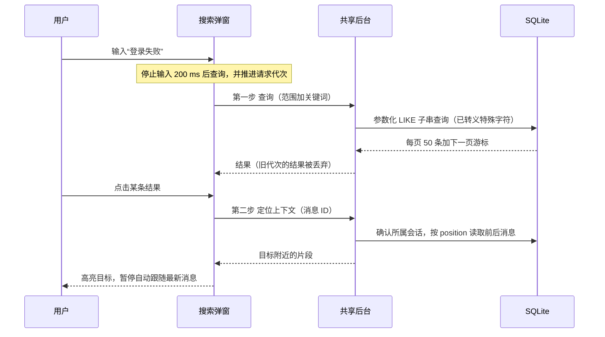
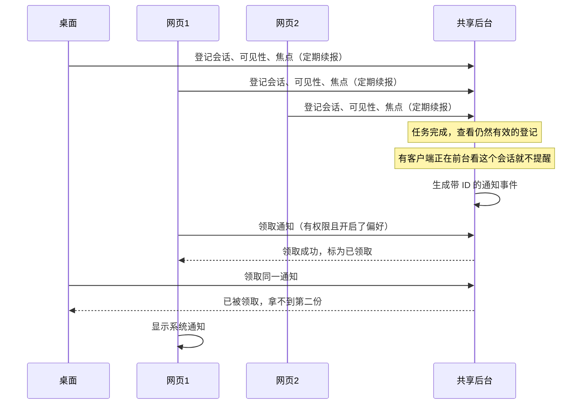
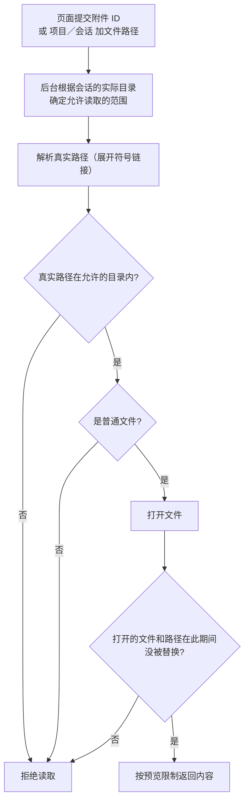
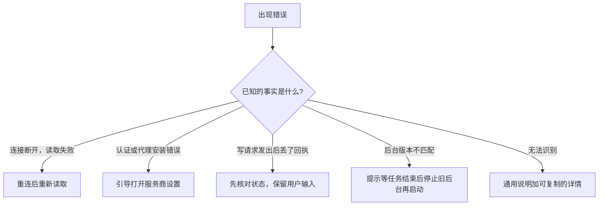

# 搜索、通知与文件预览

> 本篇收录追问资料第 19 节，节号与全套资料统一。源码基准 Moose 0.23.1。[追问资料目录](README.md)

## 19. 搜索、通知和文件预览怎样串起用户体验

**一句话**：任务可能运行很久，搜索帮用户找回原文，通知告诉用户该回来了，文件预览让用户检查产出；三者都复用已有的后台和数据库，没有另建搜索服务或云端推送。

| 功能 | 回答用户的问题 | 关键设计 |
| --- | --- | --- |
| 搜索 | 当初那条原文在哪？ | 先查询，再加载目标附近的上下文 |
| 通知 | 离开页面后，什么时候该回来？ | 共享后台统一分配，只领取一次 |
| 文件预览 | 代理产出的文件对不对？ | 后台按会话实际目录校验路径 |
| 状态和错误 | 接下来该做什么？ | 先分类，再决定页面行为 |

### 搜索命中后，怎样找到很久以前的消息？

用户搜索“登录失败”，命中的消息在两千条之前，而页面只加载了最近 80 条；只在当前 DOM 里找，必然找不到。所以分两步：**先查询，再加载目标附近的上下文**。

| 步骤 | 做法 | 边界 |
| --- | --- | --- |
| 1. 防抖加代次 | 输入停止 200 ms 后才查询，范围可以是全部项目、当前项目或当前会话；每次输入或切换范围都推进请求代次，较晚返回的旧结果不会覆盖新结果 | 防抖减少查询次数，代次保证显示正确，两者不能互相替代 |
| 2. 字面子串匹配 | 后台对项目名、会话标题和消息的标题／正文做参数化的 `LIKE` 子串查询，并转义 `%`、`_` 和反斜杠，让它们按普通字符匹配；包括已归档的会话 | 不扫描草稿、配置凭据和 CLI 的隐藏数据；如果密钥本身被写进了消息正文，它仍会被搜到——这里没有自动识别敏感内容的机制 |
| 3. 游标分页 | 每页 50 条，按时间、消息位置和会话 ID 排序，用最后一条的这几个值生成下一页的游标 | 不是相关性排序，也不是全文索引；查询期间数据仍可能变化，不提供冻结的结果快照 |
| 4. 定位上下文 | 点击结果后，后台确认消息所属的会话，按它的 `position` 读取前后的消息，页面高亮目标 | 和普通历史分页（每页 80 条）不是同一个接口 |
| 5. 阅读历史时不打扰 | 查看目标期间，新到的其他消息不会插进当前片段，页面也不会自动滚回底部；已有消息的新版本仍会更新 | 用户点“回到最新消息”才恢复实时跟随 |

请求代次的写法和[流式那一节](02-agents-and-streaming.md#6-流式消息和-react-页面如何保持一致)相同：每次输入或切换范围都推进代次，返回时对不上就丢掉。搜索这里只是把同一办法用在查询上。

#### 为什么先用 SQLite 子串查询

| 好处 | 代价 | 实测 |
| --- | --- | --- |
| 天然支持中文和特殊字符；不需要索引迁移；没有额外服务 | `%关键词%` 可能扫描大量文本 | 0.21.0 用一万条、每条约 1 KiB 的数据测得后端 P95 约 33 ms；之后的回归继续检查 300 ms 的预算，并确认同时运行的终端仍然响应 |

这个数字不包括防抖、网络和渲染，也不保证更大的数据库同样快。

代码：[查询与定位](../../../electron/experience-data.ts)、[搜索弹窗](../../../src/components/search-dialog.tsx)、[消息加载](../../../src/lib/workspace.ts)。验证：[数据与性能测试](../../../tests/unit/experience.test.ts)、[用户流程](../../../tests/e2e/experience.spec.ts)。

### 桌面和两个网页都开着，为什么只提醒一次？

如果每个页面收到“任务完成”都自己弹通知，同一件事会提醒三次。所以由共享后台统一决定由谁来显示。

| 环节 | 做法 |
| --- | --- |
| 登记 | 每个客户端登记自己当前打开的会话、页面是否可见、是否有焦点，并定期续报；后台只采用仍然有效的登记 |
| 免打扰判断 | 只要有客户端正在前台查看这个会话，就不再提醒 |
| 领取 | 任务产生带 ID 的通知事件，由有权限且开启了对应偏好的客户端来领取；后台把它标为已领取，其他客户端就拿不到第二份 |
| 权限 | 只有用户主动开启通知时才申请权限；Web 使用浏览器权限；桌面通过应用自己的 macOS 原生桥接读取和申请权限，用户拒绝时不会把开关误显示为开启 |

#### 保证什么，不保证什么

| 保证 | 不保证 |
| --- | --- |
| 同一个后台只分配一次 | 操作系统一定会显示：领取后客户端崩溃、系统开了勿扰或权限变了，都可能让通知看不到 |
| — | 必达：Moose 不会为了“必达”去重放历史提醒 |
| — | 跨数据目录去重：不同数据目录的独立后台之间不共享去重状态 |
| — | 离线推送：所有页面都关了、桌面也退出后，没有常驻的推送服务 |

- 通知只包含项目、会话标题和状态，不含正文、命令或审批内容。
- 点击后回到对应会话或待处理项。
- 读取历史快照也不会重新生成通知。

代码：[后台协调](../../../electron/notices.ts)、[页面焦点与领取](../../../src/lib/notifications.ts)、[桌面权限桥接](../../../electron/notification-permission.ts)。验证用的是真实共享后台，系统显示和权限申请的结果是受控模拟；真实读取权限和人工点击弹窗要分开说明。

### 本地文件链接为什么不能直接交给页面读取？

例如 worktree 会话的回复里出现 `../private.txt`，或一个指向其他目录的符号链接，只看文件名看不出它最终会读到哪里。所以页面只提交 ID 和相对信息，由后台重新确定允许读取的范围。

- 附件另外限制在 Moose 的附件目录内。
- 这能减少路径穿越和符号链接绕过，但不能说是能防住同一用户下恶意本地进程的完整沙箱。

#### 预览限制

| 类型 | 处理 |
| --- | --- |
| 文本 | 最多读前 1 MiB 并提示截断 |
| 图片 | 预览上限 20 MiB |
| PDF 和其他无法显示的格式 | 提供下载 |
| 下载 | 桌面用系统保存对话框，Web 下载仍需登录认证；“另存为”不能覆盖正在读取的源文件 |
| 远程图片 | 只保留链接，不会自动向外部网站发请求 |

#### 右侧文件面板（只读查看器）

| 支持 | 不支持或限制 |
| --- | --- |
| 目录按需展开 | 单个目录最多显示 2,000 项 |
| 代码高亮使用本地打包的 Pierre／Shiki | 隐藏 `.git` 和符号链接 |
| Markdown 默认渲染，并按文件所在目录解析相对链接 | 不支持编辑保存 |
| 多标签、查找和复制 | 不支持代码折叠 |
| 打开或关闭面板不会丢掉聊天草稿 | |

代码：[读取与边界检查](../../../electron/file-preview.ts)、[文件面板](../../../src/components/files-panel.tsx)、[源码显示](../../../src/components/code-preview.tsx)。验证覆盖了文件消失、超出大小限制、越界路径、worktree，以及另存时保护源文件。

### 状态和错误怎样指导下一步，而不是堆提示？

#### 侧栏状态

| 状态 | 侧栏表现 |
| --- | --- |
| 运行中、待处理、排队、异常 | 显示图标，图标仍带提示文字和读屏名称 |
| 完成、空闲 | 不加图标 |
| 需要解释时 | 输入区显示后台根据实际调度条件算出的原因，例如“队列已暂停”或“终端正占用目录”，并提供跳转到占用者的入口 |

前端不会根据“等了多久”去猜原因。

#### 错误先分类，再决定页面怎么做

| 已知的事实 | 页面怎么做 | 为什么 |
| --- | --- | --- |
| 连接断开，读取失败 | 重连后重新读取 | 读取不会重复创建任务 |
| 明确的认证或代理安装错误 | 引导打开服务商设置 | 反复重发修不好登录或安装问题 |
| 写请求发出后丢了回执 | 先核对状态，保留用户输入 | 可能已经执行过，自动重发可能重复操作 |
| 后台版本不匹配 | 提示等任务结束后停止旧后台再启动 | 自动停止可能打断正在执行的任务 |
| 无法识别的错误 | 通用说明加可复制的详情 | 不能凭错误文案猜出确定的诊断 |

#### 其他细节

| 设计 | 内容 |
| --- | --- |
| 状态分开保存 | 连接状态和操作失败分开保存，所以一次刷新成功不会抹掉还没处理的保存失败 |
| 提示分开 | CLI 路径“已保存”和代理“能连接”分开提示 |
| 终端 | 结束终端需要确认，关闭面板时终端继续运行 |
| 归档撤销 | 提供 10 秒撤销，鼠标悬停或键盘聚焦时暂停倒计时，撤销后队列仍保持暂停 |

这些设计都是为了避免把“界面恢复了”误当成“外部操作已经安全完成”。

代码：[稳定错误码](../../../shared/errors.ts)、[错误入口](../../../src/components/error-notice.tsx)、[调度原因](../../../electron/service.ts)；验证集中在 [experience.spec.ts](../../../tests/e2e/experience.spec.ts)。

---

上一篇：[面试表达：案例、取舍、简历与演示](06-interview-expression.md) ｜ [追问资料目录](README.md) ｜ 下一篇：[计划、目标与三档权限](08-plan-goal-permissions.md)
