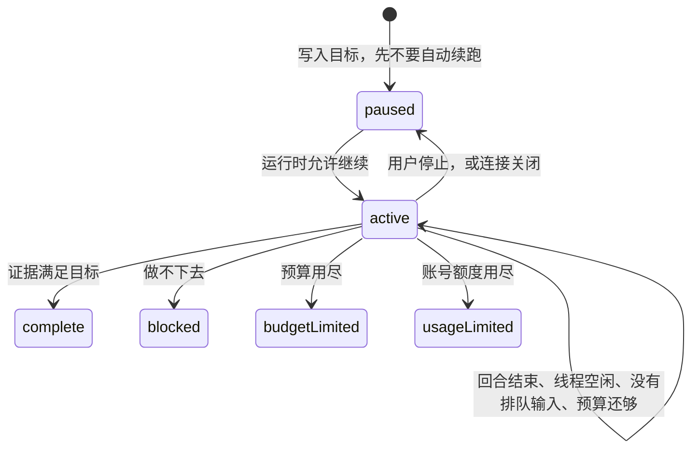
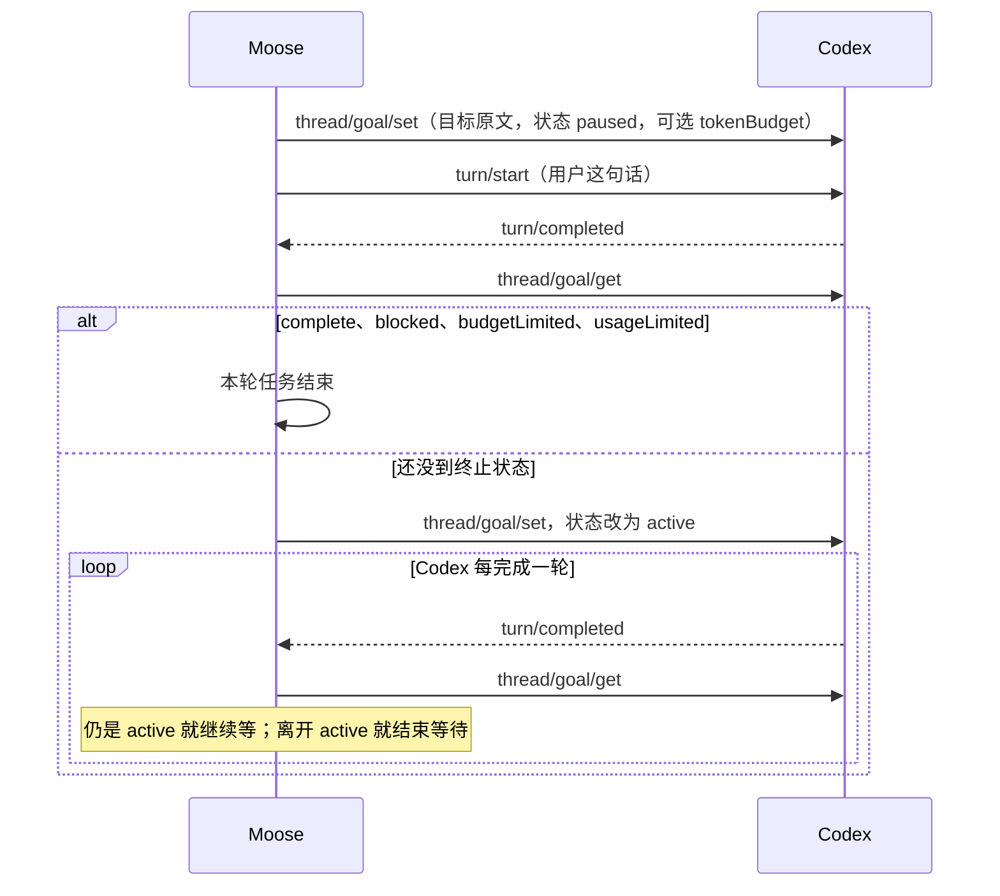

# 计划模式、目标模式与三档权限

> 源码基准 **Moose 0.23.3**（核对日期：2026-10-10）。Codex 的协议时序和计划批准事务仍在[第 8 节](03-execution.md#8-plangoal-和运行中插话)。主流产品的行为以文末官方文档为准，产品会改，回答时带上文档日期。

**一句话**：计划模式和目标模式都是宿主（跑代理的那个程序）的状态，不是把「做到完」写进提示词就结束。权限三档是另一条轴，决定工具能不能跑。

## 30 秒怎么答

计划模式是先只读地出方案，人批准某一版之后才按那一版改代码。目标模式是一条持久目标：模型每一轮自己选下一步；这一轮结束后，由运行时看目标还在不在、预算够不够、线程是不是空闲，再决定要不要自动开下一轮。完成要对照证据。预算或额度用尽是停，不是假装做完。

可以收成四个词：**持久目标 + 一轮一轮的代理循环 + 完成检查 + 预算**。模型决定下一步，运行时决定能不能继续。

Moose 0.23.3 给 Codex、Grok Build、Pi、OpenCode 都放了计划、目标和三档权限（请求批准、帮我批准、完全访问）。CLI 有原生接口就用原生的；没有就用只读提示、拒绝会改动的工具，或在审批回调里代选。只有 Codex 会在回合结束后按原生目标状态继续等待下一轮。Pi 和 OpenCode 的目标只约束当前这一轮。

## 1. 先把两个开关分开

界面上是两个独立选择，存在不同字段里：

| | 任务模式 | 权限档位 |
| --- | --- | --- |
| 用户在选什么 | 这一轮要交付什么 | 工具调用要不要人点头，执行范围有多宽 |
| 界面文案 | 构建、计划模式、目标模式 | 请求批准、帮我批准、完全访问 |
| 代码里的值 | `PromptContext.mode`：`build` / `plan` / `goal` | `Session.mode`：`ask` / `auto` / `full` |
| 没保存过时 | 构建 | 帮我批准 |

新安装和空档位都收成帮我批准，不会收成完全访问。探测缓存里即使只剩「完全访问」这一项，也不会因此把用户抬上去；回退顺序是帮我批准，然后才是请求批准。见 [selection.ts](../../../shared/selection.ts)。

输入框里打 `/` 并选中「计划模式」或「目标模式」后，这段斜杠文字会从草稿里删掉，只把 `mode` 放进发送上下文。没有选中候选项、只是在正文里打出 `/plan`，模式不会变。这是 Moose 的模式入口，不是把这两个字原样转发给每一家 CLI。Grok 的目标模式是例外：适配器会在正文前加上 `/goal `。

计划模式会盖过权限档位。就算会话是完全访问，计划这一轮仍然拒绝会改动的工具。批准之后，执行轮回到构建模式，并恢复会话原来的权限。

可选的 `goalBudget` 是 1000 到 1,000,000 的整数，校验在 [validation.ts](../../../shared/validation.ts)。输入区没有预算控件。不传，Codex 就不写 `tokenBudget`，其他底座也不附加预算那一行。面试时不要说界面上有预算滑块。

## 2. Plan 和 Goal 是宿主概念

代理循环每次都一样小：模型看上下文，选出下一步，运行时执行工具，把结果塞回上下文。差别在于**谁决定循环还要不要再转一圈**。

```ts
// 示意，不是 Moose 的某一个函数。
// 模型只产生 action；while、执行和「要不要再来」属于运行时。
while (goal.status === 'active' && withinBudget && threadIdle && !userQueued) {
  const action = await llm(contextWithObjective);
  context.push(await execute(action));
  goal = await readGoal(); // 完成看证据；预算用尽不是 complete
}
```

### 计划模式：先看，批准后再改

宿主把这一轮收成只读（沙箱、权限规则，或直接拒绝写工具），模型交出方案，人批准某一版之后，宿主才放开修改。批准的是那一版正文，不是模型嘴里的「我打算这么做」。

| 产品 | 计划模式实际是什么 | 依据 |
| --- | --- | --- |
| Codex | 协作模式 `plan`。Moose 同时把沙箱设成只读、关掉提权 | Codex 的 `collaborationMode`；Moose 见下文 |
| Claude Code | 一种权限模式。读文件、用只读方式探查、写计划，源码编辑默认要等你批准计划。`Shift+Tab`、单条 `/plan`，或 `claude --permission-mode plan` | [权限模式](https://code.claude.com/docs/en/permission-modes) |
| Grok Build | `/plan` 或 `Shift+Tab`。批准前只有会话计划文件能改，和 ask / auto / always-approve 是两条轴。自动批准不会跳过计划审阅 | [Plan Mode](https://docs.x.ai/build/features/plan-mode) |
| OpenCode v2 | 内置 `plan` 代理：允许提问，除 `~/.opencode/plan` 下的文件外拒绝编辑 | [Permissions](https://opencode.ai/v2/docs/permissions/) |
| Pi | 产品默认没有计划模式。官方示例扩展可以用 `/plan` 关掉写工具，并把 bash 限制在只读命令。Moose 没有去装这个扩展 | [Pi README](https://github.com/earendil-works/pi/blob/main/packages/coding-agent/README.md)、[plan-mode 扩展示例](https://github.com/earendil-works/pi/blob/main/packages/coding-agent/examples/extensions/plan-mode/index.ts) |

### 目标模式：持久状态，不是一次无限长的模型调用

目标挂在**这一条线程 / 会话**上，不是全局记忆，也不是仓库里的说明文件。一轮结束后运行时再看：目标是否仍是进行中、有没有用户插进来的输入、预算是否还够。够，就再开一轮，并重新把目标放回上下文，避免长任务漂走。不够，就停在对应状态上。



Codex 协议里的状态就是这六种：`active`、`paused`、`blocked`、`usageLimited`、`budgetLimited`、`complete`。公开说明常用 active、paused、complete、budget-limited 来讲生命周期，意思一致：预算用尽要停下来总结，不能记成完成。

公开说明还划了一条权限：模型可以发起目标，并且只有证据支持时才能标完成；暂停、恢复、清除和预算用尽由用户或系统决定。证据是文件、命令、测试、基准或生成物，不是模型说「好了」。续跑只发生在线程空闲、目标仍为 active、预算内、没有排队的用户输入时。只做计划的工作不触发续跑。一轮续跑如果没有任何工具调用，下一次自动续跑会被压住，避免空转。见 [Using Goals in Codex](https://developers.openai.com/cookbook/examples/codex/using_goals_in_codex)。

Claude Code 也有 `/goal`，但是另一套宿主机制，不要说成 Codex 的线程目标表：

- 它是当前会话上的完成条件，包了一层 Stop hook。每一轮结束后，另一个小模型只读已经写进对话的内容，给出「还没达到 / 达到了 / 不可能」。它自己不跑命令、不读文件。
- 还没达到就再开一轮。达到、被判不可能，或遇到必须由人修的错误（登录失败、额度耗尽、压缩不了的上下文溢出、模型不可用）就清掉目标。
- 目标不改变权限模式。要无人值守，得另外开 auto。
- 公开文档没有单独的 token 预算字段。想限制轮数或时间，把条件写进目标句子里，例如「或 20 轮后停止」。`--max-turns` 是另一回事：只限制 `claude -p` 的轮数，到了就报错退出。
- 恢复会话时会带回还没结束的目标，但轮数、计时和 token 计数重新起算。

见 [Keep Claude working toward a goal](https://code.claude.com/docs/en/goal) 和 [CLI reference](https://code.claude.com/docs/en/cli-reference)。

Grok Build 的公开文档写了 `/plan`、权限模式和 `--max-turns`，没有与 Codex `thread/goal` 对等的状态说明。Pi 的 README 写明默认不做计划模式，也没有一等的目标状态机。OpenCode v2 的权限文档有 plan 代理，没有这种跨回合目标表。

## 3. Moose 怎样驱动 Codex 的目标

Codex 自己负责空闲后续跑。Moose 负责把目标写进去、先跑用户这句话、然后看状态、决定还等不等。



先写成 `paused`，是为了用这一次 `turn/start` 跑用户的原话，而不是一写入就让 Codex 自己开回合。这一轮结束若还没到终止状态，再改成 `active`。之后 Moose 不另写一条「继续」的 steering；下一轮由 Codex 在线程空闲时自己开。等待期间没有单独的 Moose 超时。用户停止或适配器关闭时，会尝试把仍为 `active` 的目标改回 `paused`。

`thread/goal/set` 失败时，Moose 退回成一轮提示：在正文前加上 “Goal mode is active…”，跑完这一轮就停，不再查询目标状态。目标原文超过 4000 字直接拒绝，不会发给 CLI。

进入等待之后，若某一轮结束时状态已经不是 `active`，界面会收到一条 `Goal: <status>` 通知。第一轮结束就已经是完成、受阻或达到上限时，任务直接结束，不一定有这行通知。Moose 不自己重跑测试来验收；它相信 CLI 报上来的状态。面试时要补一句：状态是 `complete` 还是 `budgetLimited`，得看 Codex 那一侧有没有把证据写进目标；Moose 没有第二套验收器。

计划模式的批准时序（版本、同一事务、迟到的旧版本会被拒绝）仍以[第 8 节](03-execution.md#8-plangoal-和运行中插话)为准。这里只补 0.23.3 和 Codex 的交界：

- CLI 的 `collaborationMode/list` 里有 `plan` 时，这一轮的协作模式就是 `plan`，正文不加计划提示。
- 没有时，协作模式用 `default`，正文前加上只读计划提示，助手正文收成可审阅的计划。
- 两种情况都会把沙箱改成 `read-only`、审批策略改成 `never`，并且直接拒绝这一轮的命令、文件和提权请求。会话平时是完全访问也一样。
- 点「批准并执行」会在同一个事务里记下这一版，并把带版本号的计划正文排进构建模式。计划结束本身会暂停队列；批准会取消暂停并开始执行。同一版不能批准两次。

## 4. 0.23.3 四家分别怎么接

有原生接口就走原生接口。没有，就用 [modes.ts](../../../electron/providers/modes.ts) 里的提示和代选，不额外多跑一轮。

| 底座 | 计划模式 | 目标模式 |
| --- | --- | --- |
| Codex | 有原生 `plan` 就用；没有就加只读提示。沙箱始终只读，写操作的审批直接拒绝 | `thread/goal/set` / `get`。失败才退回一轮目标提示。只有这条路径会在回合后继续等 |
| Grok Build | 不调用未验证的 `session/set_mode(plan)`。正文加只读提示；权限回调里拒绝会改动的工具 | 正文前加上 `/goal` 和目标原文，有预算再加一行。等这一次 ACP `prompt` 返回，不轮询目标状态 |
| Pi | 没有原生模式。正文加只读提示；看到会改动的工具就中止这一轮 | 正文加目标提示。等 `agent_settled`。不会在回合后再开一轮 |
| OpenCode v2 | 会话配置里列出了 `plan` 就选中它，同时加只读提示，权限回调也拒绝会改动的工具 | 没有原生目标接口。正文加目标提示。等这一次 `session/prompt` 返回 |

权限三档的实现不要记成同一套参数：

| 底座 | 请求批准 | 帮我批准 | 完全访问 |
| --- | --- | --- | --- |
| Codex | `on-request`，审批人 `user`，沙箱 `workspace-write`，工作区网络和网页搜索关掉 | 同样是 `on-request` 和 `workspace-write`，审批人改成 `auto_review`。这是受约束的自动复核，不是拿掉沙箱 | `never` 加上 `danger-full-access` |
| Grok Build | `--permission-mode default`，并先发 `/always-approve off`。剩下的 ACP 权限交给用户。CLI 不认识该参数时去掉它重连，回调仍在 | `--permission-mode auto`。若仍弹出权限，Moose 选一次性允许 | `--always-approve`。若仍弹出权限，选始终允许 |
| Pi | 会改动的工具直接中止这一轮。扩展的确认题才显示成卡片。Pi 没有可暂停的工具协议 | 允许工具运行，并代答扩展确认 | 和帮我批准是同一套工具策略。没有更宽的沙箱开关。`--approve` 只表示信任项目目录里的扩展，不能当成完全访问 |
| OpenCode v2 | `session/request_permission` 交给用户。Moose 不改写用户的权限配置文件 | 在 CLI 给出的选项里选 `allow_once`，不写永久允许规则 | 选 `allow_always`（CLI 提供时）。没有单独的沙箱逃逸参数 |

代选的顺序是：先看是不是计划模式，再看权限档位。计划模式里，看起来只读的工具选一次性允许；会改动的工具选拒绝；认不出、也没有拒绝选项时，才退回问用户。构建模式下，请求批准一律问用户；帮我批准优先一次性允许；完全访问优先始终允许。没有对应选项时仍然问用户，不会发明一个「允许」。

```ts
// electron/providers/modes.ts 节选。计划模式先于三档权限。
if (taskMode === 'plan') {
  if (!toolMutates(toolName, toolTitle)) {
    const allow = allowOnce || allowAlways;
    if (allow) return { action: 'select', optionId: allow.id };
  }
  if (reject) return { action: 'select', optionId: reject.id };
  return { action: 'ask' };
}
if (mode === 'ask') return { action: 'ask' };
if (mode === 'full') {
  const allow = allowAlways || allowOnce;
  if (allow) return { action: 'select', optionId: allow.id };
}
```

认「会不会改动」靠工具名和标题里的 read / grep / bash / write 这一类词。认错了就可能把会写文件的工具放行，或把只读工具拒绝掉。这是 Moose 的补齐，不是各 CLI 自己的沙箱。

## 5. 和主流产品的权限怎么对上

名字相近，行为不要划等号。面试时先说「对应的是哪一条轴」，再说差在哪。

| Moose | 更接近的官方机制 | 不要说成 |
| --- | --- | --- |
| 请求批准 | Claude Code 的 `default`（界面常标 Manual）；Grok 的 Ask；OpenCode 规则效果 `ask` | 「所有读取都要点一次」。只读工具在各家往往默认放行 |
| 帮我批准 | Codex 的 `auto_review`；Claude Code 的 `auto`（后台分类器，危险操作仍可能问）；Grok 的 Auto；OpenCode 的一次性 `allow` | 完全访问，或 Claude Code 的 `acceptEdits`。后者主要自动接受工作区内的文件编辑和常见文件命令 |
| 完全访问 | Codex 的 `danger-full-access`；Claude Code 的 `bypassPermissions`（官方要求隔离环境，部分危险删除仍会拦）；Grok 的 always-approve（`deny` 规则和 hook 仍然有效） | Pi 的完全访问。Pi 没有更宽的沙箱，这一档和帮我批准执行同一组工具 |
| 计划模式 | Claude Code 把 plan 放在权限模式里；Grok 和 Moose 把它放在权限旁边，批准前限制编辑 | 「计划模式就是把权限设成请求批准」 |

Grok 和 Claude Code 都有宿主侧的 `--max-turns`。Codex 目标用的是线程上的 token 预算，用尽进入 `budgetLimited`。Moose 只在调用方传入 `goalBudget` 时把这个数字交给 Codex，或写进 Grok / 提示文本。

## 6. 不要说成

- 「`/goal` 就是系统提示里写一句做到完。」这只是 Pi、OpenCode，以及 Codex 接口失败时的退路，而且只活一轮。
- 「四家都会在回合结束后自动开下一轮。」只有 Codex 这条原生路径会。
- 「帮我批准等于完全访问。」Codex 的自动复核仍在 `workspace-write` 里；ACP 的帮我批准选的是一次性允许。
- 「Moose 会自己跑测试来宣布目标完成。」它读的是 CLI 的目标状态。
- 「Claude Code 没有目标。」2026-10-10 的官方文档有 `/goal`，但是会话级的第二次评判，不是 Codex 那张带预算字段的线程目标。
- 「Claude Code 的评判模型会自己跑测试。」官方写明它只看对话里已经出现的内容。
- 「Pi 的 `--approve` 是完全访问。」那是项目信任，决定是否加载项目里的扩展和设置。
- 「输入区可以设 token 预算。」协议留了字段，界面没有这个控件。

代码入口：[modes.ts](../../../electron/providers/modes.ts)、[codex-permissions.ts](../../../electron/providers/codex-permissions.ts)、[codex.ts](../../../electron/providers/codex.ts)、[grok.ts](../../../electron/providers/grok.ts)、[pi.ts](../../../electron/providers/pi.ts)、[opencode.ts](../../../electron/providers/opencode.ts)、[plans.ts](../../../electron/plans.ts)。日常操作见[使用指南](../../usage.md)，支持范围见[能力表](../../providers/native-capabilities.md)。

## 来源

核对日期 2026-10-10。

- Codex 目标：[Using Goals in Codex](https://developers.openai.com/cookbook/examples/codex/using_goals_in_codex)、[Follow a goal](https://developers.openai.com/codex/use-cases/follow-goals)。空闲后续跑可以对照仓库里的 `continue_if_idle`（`codex-rs/ext/goal/src/runtime.rs`）。
- Claude Code：[goal](https://code.claude.com/docs/en/goal)、[permission modes](https://code.claude.com/docs/en/permission-modes)、[CLI `--max-turns`](https://code.claude.com/docs/en/cli-reference)。
- Pi：[coding-agent README](https://github.com/earendil-works/pi/blob/main/packages/coding-agent/README.md)、[settings（`--approve` 是项目信任）](https://github.com/earendil-works/pi/blob/main/packages/coding-agent/docs/settings.md)、[plan-mode 扩展示例](https://github.com/earendil-works/pi/blob/main/packages/coding-agent/examples/extensions/plan-mode/index.ts)。
- OpenCode v2：[Permissions](https://opencode.ai/v2/docs/permissions/)。
- Grok Build：[Plan Mode](https://docs.x.ai/build/features/plan-mode)、[Permissions](https://docs.x.ai/build/features/permissions)、[CLI reference](https://docs.x.ai/build/cli/reference)。

---

上一篇：[搜索、通知与文件预览](07-search-notice-preview.md) ｜ [追问资料目录](README.md)
