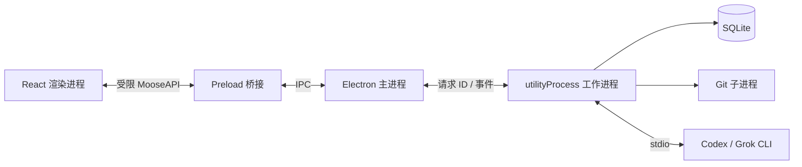

# Moose 项目经历与技术详解

## 一、项目经历（简历版本）

**Moose（Coding Agent 桌面客户端）｜独立开发｜全栈开发**

技术栈：Electron、React、TypeScript、Vite、shadcn/Base UI、Tailwind CSS、Drizzle ORM、SQLite

- 面向 macOS 开发本地 Coding Agent 客户端，通过 Codex App Server 与 Grok ACP 接入代理，统一流式输出、工具记录、权限审批和交互提问。
- 划分主进程、沙箱渲染进程与后台工作进程，通过类型化 IPC 和运行时校验通信；实现同目录任务串行、跨项目并行、消息队列及中断恢复。
- 实现项目与会话管理、历史分支续聊、附件与图片输入、Git 改动审阅；支持 `@` 文件模糊搜索、技能选择及 Codex Plan、Goal 模式。
- 完成中英双语、主题切换、键盘快捷键及 arm64 打包；通过 22 项单元测试、6 项 Electron 端到端测试，并验证真实 Codex 调用与打包后运行。

## 二、项目定位、个人职责与技术栈

### 2.1 独立开发，非任职项目

Moose 是个人独立开发项目，应放在简历的“个人项目”或“独立项目”中，不归入比亚迪的任职经历。项目时间应填写自己的实际开发时间，不套用上一段工作经历的任职时间。

个人职责覆盖需求定义、界面设计、Electron 工程搭建、代理协议接入、本地数据建模、交互实现、测试与打包。这里的“全栈”指桌面渲染端、具备系统能力的本地后台和数据层，并不意味着开发了云端 API 或模型推理服务。

项目定位是统一已有 Coding Agent 的桌面操作入口。Moose 负责组织项目、会话、输入、审批、结果与 Git 审阅；具体推理和工具执行由本机安装的官方 CLI 完成。目前没有用户规模、商业收入或团队提效数据，不应添加未经测量的百分比成果。

### 2.2 为什么选择这些技术

| 技术 | 当前用途与选择理由 | 对应代码 |
| --- | --- | --- |
| Electron | 提供原生窗口、文件选择、菜单、剪贴板、系统浏览器入口和后台进程能力 | [main.ts](../electron/main.ts) |
| React | 组织会话时间线、输入区、设置页和 Git 审阅等交互；通过状态与事件同步界面 | [app.tsx](../src/app.tsx)、[workspace.ts](../src/lib/workspace.ts) |
| TypeScript | 约束前后端 IPC、代理事件、项目与会话数据类型 | [types.ts](../shared/types.ts) |
| Vite、vite-plugin-electron | 统一渲染端与 Electron 多入口开发构建，处理热更新和进程重启 | [vite.config.ts](../vite.config.ts) |
| shadcn/Base UI | 复用 Select、Dialog、Menu 等交互组件，减少自行实现焦点管理与键盘交互的成本 | [ui](../src/components/ui)、[components.json](../components.json) |
| Tailwind CSS | 配合语义颜色 tokens 和局部 CSS 调整排版、主题与组件状态 | [app.css](../src/app.css) |
| Drizzle ORM | 类型化地操作 SQLite 表结构、查询和事务 | [schema.ts](../electron/db/schema.ts)、[store.ts](../electron/db/store.ts) |
| SQLite、better-sqlite3 | 将历史、队列、草稿与设置保存在本地；同步数据库操作放到工作进程 | [store.ts](../electron/db/store.ts) |
| Zod | 在运行时校验跨进程请求，补足 TypeScript 无法验证外部输入的问题 | [validation.ts](../shared/validation.ts) |
| Motion | 实现可中途反向操作的侧栏动画，适配减少动态效果设置 | [app.tsx](../src/app.tsx) |
| pnpm、ES module | 管理固定版本依赖与 lockfile；主进程和工作进程采用 ESM 输出 | [package.json](../package.json) |

首版是本地应用，没有引入 Hono 或 Cloudflare。同步、账号服务和远程协作不在当前范围内，没有必要为这些尚不存在的需求部署云基础设施。

以下说明基于 Moose 0.3.0。代码片段标注为“节选”或“简化示意”，完整实现以链接文件为准。

## 三、第一条：接入代理，统一交互

> 面向 macOS 开发本地 Coding Agent 客户端，通过 Codex App Server 与 Grok ACP 接入代理，统一流式输出、工具记录、权限审批和交互提问。

### 3.1 “本地客户端”具体指什么

项目目录、SQLite 数据库、附件副本与 CLI 进程都在用户的 Mac 上。Moose 查找已经安装的 `codex`、`grok` 可执行文件，并允许用户在设置中指定绝对路径。PATH 补充了 Homebrew 和常见 CLI 安装目录，避免从 Finder 启动应用时找不到命令。

“本地”不表示模型离线运行。CLI 仍按其自身机制访问模型服务，用户输入和被代理读取的内容可能发送给服务商。Moose 不自行实现登录、不保存账号密码，也不将 CLI 凭据复制到自己的数据库。

代码：[process.ts](../electron/providers/process.ts)、[settings-dialog.tsx](../src/components/settings-dialog.tsx)。

### 3.2 Codex App Server 如何接入

通过子进程启动 `codex app-server`，使用 stdio 传输 JSON-RPC 消息。请求通过 ID 匹配响应；通知用于接收异步增量与任务状态；服务端发起的请求用于审批和提问。

基本流程是初始化连接、读取账号和模型能力、创建或恢复 thread、启动 turn、接收事件、处理完成或取消。Moose 保存 provider 的原生 thread ID；下次发送消息时优先恢复该 thread，而不是把每次输入都作为独立对话。

```ts
// 节选：electron/providers/codex.ts
await rpc.request('initialize', {
  clientInfo: { name: 'moose', title: 'Moose', version: '0.1.0' },
  capabilities: { experimentalApi: true },
});
rpc.send({ method: 'initialized', params: {} });
```

片段中的 clientInfo 版本是当前适配器中的静态字符串，不是安装包版本号；安装包版本由 package.json 管理。协议类型由所选 Codex CLI 生成并保存在仓库中，但生成类型不能替代真实协议验证，也不能保证任意 CLI 版本兼容。

代码：[codex.ts](../electron/providers/codex.ts)、[rpc.ts](../electron/providers/rpc.ts)、[generated/codex](../electron/providers/generated/codex)。

### 3.3 Grok ACP 如何接入

Grok 使用 ACP SDK 的 `ClientSideConnection` 和 NDJSON 流连接 `grok agent … stdio`。初始化后读取能力；如果官方 CLI 提供 `cached_token` 登录方式，就调用该认证入口复用现有登录状态。

首次对话使用 `newSession`；后续在能力允许时调用 `loadSession`。恢复过程可能回放已有消息，因此适配器在新 prompt 开始前抑制旧消息进入当前执行，避免重复展示历史。

Grok 与 Codex 的会话、模型和权限格式不同。Moose 没有把两者硬套成完全相同的协议，而是在适配器内部处理差异，再向上提供统一接口。

代码：[grok.ts](../electron/providers/grok.ts)。真实 Grok 握手、认证和模型发现已验证；实际生成曾因 HTTP 402 额度耗尽失败，文件修改与续聊不能写成已完成真实验证。

### 3.4 统一适配器与事件模型

```ts
// 节选：electron/providers/types.ts
export interface AgentAdapter {
  probe(): Promise<Pick<ProviderInfo, 'models' | 'modes' | 'images'>>;
  fork?(session: Session, cwd: string, lastTurnId: string): Promise<string>;
  run(context: RunContext): Promise<void>;
  respond(key: string, choice?: string, answers?: Record<string, string>): void;
  cancel(): Promise<void>;
  close(): Promise<void>;
}
```

`probe` 返回真实可用能力，`run` 承载一次输入的执行，`respond` 回答服务端请求，`cancel` 与 `close` 管理取消和资源释放。`fork` 是可选能力，避免要求所有 provider 支持同一种历史分支机制。

归一化事件包含 `key`、`kind`、`text`/`delta`、`state`、`choices` 和 `questions`。界面只需要根据事件类别渲染消息、工具、审批或提问卡片，不必在每个组件中判断原始 JSON-RPC/ACP 字段。

### 3.5 流式输出与工具记录

Codex 的 `item/agentMessage/delta` 被转换为文本增量；`item/completed` 里的最终文本覆盖已有内容。覆盖与追加必须区分，否则容易把完整响应再次追加到增量响应后面。

```ts
// 节选：electron/service.ts
if (event.text !== undefined) row.text = event.text.slice(0, 500_000);
if (event.delta) row.text = (row.text + event.delta).slice(0, 500_000);
run.rows.set(id, row);
run.dirty.add(id);
```

服务层以约 80 ms 的间隔刷新 dirty 消息，降低频繁落库与 IPC 通知的开销。渲染端通过 React Markdown、GFM 和代码高亮展示结果。工具输出与思考过程使用可展开记录，避免长命令输出占满时间线。

当前单条文本最多保留 500,000 个字符，这是内存和展示上的保护边界，并非无限日志存储。工具记录保存的是代理返回的执行信息，Moose 没有另做一个通用终端。

代码：[service.ts](../electron/service.ts)、[transcript.tsx](../src/components/transcript.tsx)。

### 3.6 权限审批如何准确关联

适配器记录服务端请求 ID、请求类型和允许的选项，服务层将其归属到当前执行。用户点击审批时，后台检查执行是否仍然存在、消息是否仍为 pending、选项是否属于原请求，然后返回原协议要求的响应结构。

Codex 的三档权限对应如下：

| 界面选项 | 审批策略 | 审批处理者 | 沙箱 |
| --- | --- | --- | --- |
| 请求批准 | on-request | user | workspace-write，网络关闭 |
| 帮我批准 | on-request | auto_review | 同上 |
| 完全访问 | never | user | danger-full-access |

“帮我批准”调用 Codex 提供的审核机制，Moose 没有自行编写风险评分模型。停止任务或进程结束后，未回答审批会失效；迟到的点击不能作用到下一次执行。Grok 当前只暴露已支持的请求批准与完全访问，不伪装出风险自动审核能力。

代码：[codexPermissions](../electron/providers/codex.ts)、[respond 处理](../electron/service.ts)。

### 3.7 交互提问如何区别于审批

审批通常是允许或拒绝某个工具操作；提问是代理需要用户补充需求。统一问题结构保存问题 ID、文本、选项以及是否属于秘密输入。界面支持选择已有选项或输入答案，后台检查必填问题是否已回答。

Codex 对接 `item/tool/requestUserInput`；Grok 对接其 ask-user-question 扩展，并将回答重新组装成原协议字段。这样能保持原始问题关联，而不是把回答当成一条没有上下文的新聊天消息。

**这一条可以这样讲：**“我负责把不同 CLI 的事件和请求转换成统一桌面交互。难点在于协议差异、流式事件与最终事件的合并，以及审批必须关联到准确的执行和原始请求。”

## 四、第二条：进程架构、调度与恢复

> 划分主进程、沙箱渲染进程与后台工作进程，通过类型化 IPC 和运行时校验通信；实现同目录任务串行、跨项目并行、消息队列及中断恢复。

### 4.1 三类进程为什么要分开



主进程处理窗口、菜单、文件选择和系统入口；渲染进程负责界面；`utilityProcess` 承载代理、Git 和数据库。Preload 是受限桥接脚本，不是第四个独立业务进程。

SQLite 使用同步驱动，将其放在工作进程能避免同步查询直接阻塞主进程的窗口操作。隔离并不代表后台永远不会阻塞；大查询、文件遍历和事件合并仍需要控制规模。

代码：[main.ts](../electron/main.ts)、[runtime-host.ts](../electron/runtime-host.ts)、[runtime.ts](../electron/runtime.ts)。

### 4.2 沙箱与能力边界

```ts
// 节选：electron/main.ts
webPreferences: {
  preload: join(directory, '../preload/preload.cjs'),
  sandbox: true,
  contextIsolation: true,
  nodeIntegration: false,
  spellcheck: true,
}
```

渲染层不能直接使用 Node 文件或进程 API。Preload 只暴露 `request` 与 `subscribe`；主进程还会检查 IPC 来自当前可信窗口的主 frame。

Markdown 不执行原始 HTML；外链只允许 HTTP(S)，经过校验后交给系统浏览器；应用禁止任意新窗口、webview 和页面导航，并配置 CSP。这是减少渲染内容获得系统能力的入口，不应在面试中描述为“绝对安全”或“完全隔离代理执行”：代理 CLI 的权限由另一层沙箱和审批策略决定。

### 4.3 类型化 IPC 与运行时校验各解决什么问题

```ts
// 节选：shared/types.ts
export interface MooseAPI {
  request<M extends Method>(method: M, params: Requests[M]): Promise<Responses[M]>;
  subscribe(listener: (event: AppEvent) => void): () => void;
}
```

泛型关联方法名、参数和返回值，让开发时误传字段、误用返回结构更容易被编译器发现。但运行时收到的数据并不会因为声明了 TS 类型就自动可信，因此还需要 Zod。

```ts
// 节选：shared/validation.ts
export function validate<M extends Method>(method: M, input: unknown): Requests[M] {
  if (!Object.hasOwn(schemas, method)) throw new Error('Unknown operation');
  return schemas[method].parse(input) as Requests[M];
}
```

各方法使用 strictObject，校验 UUID、字符串长度、枚举、附件数量与 URL 协议。主进程到工作进程的请求另有 ID、pending Map 和超时处理；工作进程异常退出时拒绝未完成请求并通知界面，避免请求永久挂起。

### 4.4 同目录串行、跨项目并行

项目添加时使用 `realpath` 规范化路径。调度器用规范化后的项目路径作为 `active` Map 的键；同一目录已有执行时，后续消息留在队列中。

```ts
// 节选：electron/service.ts
if (session.archived || this.active.has(project.path) || this.editing.has(project.path)) continue;
// …创建 run 并登记目录占用…
this.active.set(project.path, run);
run.promise = this.execute(run, project.path, item.text, item.attachments || [], item.context);
```

调度循环没有立即 await 每个 `execute`，因此不同目录可以同时执行。`draining` 与 `drainAgain` 避免异步查找 CLI 期间重复进入调度造成竞争。执行结束后释放目录并再次调度。

选择目录作为单位，是因为两个会话可能修改同一份代码。这个约束只覆盖 Moose 内部的相同规范化项目目录，不是跨应用文件锁，也不覆盖任意父子目录或 Git 仓库重叠关系；外部终端和其他客户端仍能修改文件。

### 4.5 队列为什么要持久化

运行中的后续输入先保存为 queue 记录，包含文本、附件和上下文选择，可编辑文本或取消。任务真正开始时，通过事务将队列项移除、更新会话状态并写入用户消息，减少“队列已经消费但用户消息没有保存”的中间状态。

应用重新打开时，已有队列会进入暂停集合，需要用户明确继续，不会自动重放潜在的文件修改请求。排队消息的模式、文件引用与技能是提交时保存的上下文；模型与权限仍采用执行时的会话配置，并非所有配置都作为队列快照固化。

代码：[enqueue / begin](../electron/db/store.ts)、[Composer 队列界面](../src/components/composer.tsx)。

### 4.6 中断恢复的准确含义

数据库保存项目、会话、消息、队列与设置；附件内容保存为本地文件。SQLite 开启 WAL 和外键约束；数据库升级通过 `PRAGMA user_version` 与事务执行，目前迁移到 v3，增加了草稿和队列上下文字段。

启动时，未完成会话标记为 interrupted，未完成消息或审批标记为 expired。历史、草稿和 provider 原生会话 ID 保留，用户可以继续会话。

“恢复”并不是恢复被杀死进程的内存，也不保证恢复某条命令执行到一半的现场，更不自动重试所有中断操作。已产生的文件改动需要用户审阅后决定如何继续。

代码：[Store 构造函数](../electron/db/store.ts)、[migrations.ts](../electron/db/migrations.ts)。

### 4.7 如何避免重复、迟到事件污染

服务层用 `runId + provider event key` 生成消息 ID，每次更新递增 `seq`。数据库和渲染层只接受比已有记录更新的序号。取消后通过 `run.cancelled` 拒绝后续事件；切换会话时，前端用请求代次忽略旧异步请求结果。

这里保障的是已归一化消息更新的顺序和幂等合并。对于 provider 本身重复发送、且没有可识别原始序号的同一段 delta，不能宣称端到端 exactly-once。

代码：[accept](../electron/service.ts)、[saveMessage](../electron/db/store.ts)、[mergeMessages](../src/lib/workspace.ts)。

### 4.8 关窗口与退出应用

macOS 关闭窗口后保留后台任务；再次激活应用时重建窗口。Cmd+Q 则触发有序退出：停止新请求、取消执行、关闭 CLI、刷新数据、关闭数据库。

CLI 在独立进程组内启动，清理时先 SIGTERM，超时再 SIGKILL，尽量清理派生子进程。这不构成对断电、强制杀进程和所有 daemon 化子进程的绝对保证。

**这一条可以这样讲：**“我将有系统权限的工作移到 utilityProcess，并通过受限 IPC 与渲染层通信。调度以目录为单位，数据以事务保存；重启恢复历史和待处理输入，但不擅自重发有副作用的任务。”

## 五、第三条：项目、历史与上下文能力

> 实现项目与会话管理、历史分支续聊、附件与图片输入、Git 改动审阅；支持 `@` 文件模糊搜索、技能选择及 Codex Plan、Goal 模式。

### 5.1 项目与会话管理

项目对应一个本地目录，会话归属于项目并固定 provider。界面支持新建、重命名、标题搜索、会话归档与恢复，以及项目下全部会话归档。项目删除删除的是 Moose 中的项目及相关会话、消息、队列记录，不删除代码目录，也不删除官方 CLI 历史。

归档与删除经过确认弹窗；有运行中任务或历史操作时，后台拒绝相关项目变更，避免只靠界面禁用按钮。项目归档的实际行为是归档其会话，并不是为项目另建一个独立 archived 状态。

代码：[sidebar.tsx](../src/components/sidebar.tsx)、[confirm-dialog.tsx](../src/components/confirm-dialog.tsx)、[service.ts](../electron/service.ts)。

### 5.2 历史分支续聊与编辑消息

复制消息通过受限 IPC 写入系统剪贴板。编辑历史用户消息不直接覆盖原记录，而是创建一个新会话：保留选中用户消息之前的历史，将该消息内容放入新草稿，原会话仍然保留。

回到 AI 消息时保留到其所属执行结束的位置。Codex 有有效的原生 turn ID 时，调用 `thread/fork` 并传入 `lastTurnId`；否则将保留的可见消息组织为历史上下文供新会话继续。Grok 当前采用后者。

```ts
// 节选：electron/service.ts
if (source.provider === 'codex' && source.nativeId && lastUser?.nativeTurnId) {
  adapter = this.adapterFactory(source.provider, await this.providerPath(source.provider));
  this.probing.add(adapter);
  if (adapter.fork) nativeId = await adapter.fork(source, project.path, lastUser.nativeTurnId);
}
```

可见历史重建不等同于完整复制模型内部状态；原生 fork 失败也不会被静默伪装成成功。最重要的边界是：历史分支改变对话上下文，不会回滚代码文件，也没有创建 Git worktree。

### 5.3 附件与图片输入

提供原生文件选择、拖放文件、粘贴图片入口。导入时复制到应用数据目录，使用 UUID 文件名与元数据记录，避免后续引用完全依赖原文件位置。单文件限制 20 MB，每次最多 10 个；常见视频扩展名不支持。

图片按文件签名识别 PNG、JPEG、GIF、WebP，不只相信扩展名。Codex 使用 `localImage` 输入；小于等于 1 MB 的文本附件读成文本上下文；其他文件提供路径交给代理处理。因此“附件支持”不等于内置了完整 PDF、音视频解析器。

Grok 1.0.30 的 ACP 没有声明图片输入能力，界面和适配器会阻止向它发送图片，不把路径字符串假装成图片理解。

代码：[attachments.ts](../electron/attachments.ts)、[attachments.tsx](../src/components/attachments.tsx)。

### 5.4 Git 改动审阅

使用 `git status --porcelain=v1 -z` 获取稳定、以 NUL 分隔的输出，分别解析索引状态与工作区状态。同一文件可以同时属于 staged 和 unstaged；重命名记录需要额外读取旧路径字段。

已暂存使用 `git diff --cached`，未暂存使用 `git diff`；未跟踪文本直接读取后生成新增行预览。Git 命令通过参数数组执行，关闭外部 diff/textconv，路径作为字面 pathspec 处理，降低特殊文件名和外部命令带来的干扰。

预览前验证路径归属与当前 Git 状态；二进制只提示不可预览，超大 diff 限制到 256 KB，符号链接按链接信息处理。渲染端解析 hunk 的起始行号，分别显示旧行号与新行号。

审阅范围是整个工作区当前改动，包含运行代理前已有的修改，不宣称能精确证明每一行都是本轮 AI 生成。当前没有内置提交、推送或通用文件编辑器。

代码：[git.ts](../electron/git.ts)、[diff.ts](../src/lib/diff.ts)、[review-panel.tsx](../src/components/review-panel.tsx)。

### 5.5 `@` 文件与文件夹模糊搜索

输入框识别光标之前的 `@query`，调用后台项目目录索引。索引同时包含文件和文件夹，排除 `.git`、node_modules、构建输出等目录与符号链接，限制遍历深度和总条目数，并短暂缓存结果。

匹配先看连续子串，再看字符子序列，对连续匹配和词边界加分，同时考虑文件名与相对路径。结果排序后最多返回 60 项。例如 `aptsx` 可以匹配 `Application.tsx`；中文名称也按字符参与匹配。这里是有界的轻量文件搜索，不是全文内容检索。

选择后保存项目相对路径；真正执行前重新解析 realpath 并检查目录归属，避免索引中的旧路径或越界链接直接成为后台读文件入口。macOS `/var` 与 `/private/var` 的别名需要统一后再比较。

代码：[context-catalog.ts](../electron/context-catalog.ts)、[context-suggestions.tsx](../src/components/context-suggestions.tsx)。

### 5.6 技能发现与选择

扫描用户主目录和当前项目下的 `.agents/skills`、`.codex/skills`、`.grok/skills`，读取 SKILL.md 的名称与描述，按全局和项目分组，并按真实路径去重。后台为路径生成标识；用户提交时再次确认标识属于当前技能目录。

Codex 将技能转换成结构化 `{ type: 'skill', name, path }` 输入，文件引用转换成 mention；Grok 则通过文本明确提供技能文件位置。技能选择不是给 Moose 安装可任意执行的扩展，实际读取和应用技能由代理完成。

目录发现有遍历数量、深度和单文件大小限制；frontmatter 是轻量字段提取，不是完整 YAML 引擎，也不保证发现所有服务商插件系统中的技能。

### 5.7 Plan 模式如何实现

当前选定 Codex 生成协议中没有可直接采用的 turn collaborationMode 字段，因此 Moose 使用只读沙箱、规划开发者指令和拒绝提权处理实现计划模式。

```ts
// 简化示意，源自 electron/providers/codex.ts
const planning = context.promptContext?.mode === 'plan';
const overrides = planning ? {
  sandbox: 'read-only',
  approvalPolicy: 'never',
  approvalsReviewer: 'user',
  config: { web_search: 'disabled' },
} : {};
```

这让“先探索并给计划”不仅是输入框上的标签。用户选择 Plan 时，即使会话原本设置完全访问，本轮也使用只读配置。当前 Grok Plan 不可用，不把同名 UI 选项等同于服务商原生支持。

只读沙箱主要限制本机命令的文件操作；外部工具仍需遵循规划指令和对应权限机制，不能把它描述为对任意远端工具的通用只读证明。

### 5.8 Goal 模式如何实现

Codex 使用 `thread/goal/set` 和 `thread/goal/get` 管理持久化目标。当前流程先保存 paused 目标，启动带完整用户输入及上下文的首轮；首轮结束后检查目标状态，如果尚未达到终态则激活原生目标，等待后续执行。

之所以要区分首轮完成与目标完成，是因为 Goal 可能跨越多个 turn。适配器不会在每个 `turn/completed` 后立即结束 Moose 的任务，而是检查目标是否仍为 active。停止时将目标暂停并中断当前 turn；结束清理时也尝试暂停仍然活动的目标。

目标支持的实际停止状态包括完成、阻塞和额度/预算限制，不能把所有正常结束都描述为目标必然达成。Grok 的 `/goal` 命令已接入，但额度限制下尚未完成真实生成验证。

**这一条可以这样讲：**“我将项目文件、技能和历史都做成可管理的输入上下文，并贯穿草稿、队列与实际协议输入；Git 用于审阅当前结果，历史分支用于恢复对话上下文，两者的边界是分开的。”

## 六、第四条：桌面体验、测试与交付

> 完成中英双语、主题切换、键盘快捷键及 arm64 打包；通过 22 项单元测试、6 项 Electron 端到端测试，并验证真实 Codex 调用与打包后运行。

### 6.1 中英双语与主题切换

界面文本通过统一词典和 LocaleContext 获取，支持跟随系统及手动选择。原生菜单也读取语言设置；代理输出、代码和命令保持原文。

主题支持浅色、深色、跟随系统。主进程读取 nativeTheme 与系统辅助功能设置，通过快照和事件通知渲染层；CSS 使用语义 tokens 控制背景、正文、边框、强调和危险颜色。用户文字缩放保存到设置，目前默认基础字号为 15 px。

这不表示所有 provider 原始错误都经过完整本地化，也不表示代理输出会自动翻译。

代码：[i18n.tsx](../src/lib/i18n.tsx)、[app.tsx](../src/app.tsx)、[app.css](../src/app.css)。

### 6.2 键盘、输入法与交互细节

原生菜单定义 Cmd+N 新建会话、Cmd+K 搜索、Cmd+, 设置和 Cmd+B 侧栏开关，再向界面发送命令事件。输入框 Enter 发送、Shift+Enter 换行；检查 `isComposing` 和 keyCode 229，避免中文输入法确认候选词时误发送。

`@`、`/` 菜单保留输入焦点，支持方向键、Enter/Tab 选择和 Escape 关闭。图标按钮提供可访问名称；消息操作在悬浮或键盘聚焦时出现。设置返回按钮采用完整行点击区域，完全访问使用危险色强调。

侧栏保留在布局中，通过 Motion 改变宽度；收起时设为 inert，防止键盘进入不可见内容。弹簧动画允许中途反向操作，并在减少动态效果时立即切换。当前做了 ARIA、键盘和减少动态适配，尚未完成完整人工 VoiceOver 审计。

### 6.3 长会话与流式响应性能

数据库按消息 position 进行游标式分页，每次展示页读取 80 条，额外取一条判断是否还有历史。前端按 ID/seq 合并消息，避免整段会话每次重新获取；配合消息滚动组件保持阅读位置并提供“回到最新”。

```ts
// 节选：src/lib/workspace.ts
const rows = new Map(previous.map(row => [row.id, row]));
for (const row of incoming) {
  const old = rows.get(row.id);
  if (!old || old.seq < row.seq) rows.set(row.id, row);
}
return [...rows.values()].sort((a, b) => a.position - b.position);
```

10,000 条历史测试主要验证持久化、80 条分页、加载更早内容与输入响应，并不是一次挂载全部 10,000 条 DOM 的性能证明。随着用户不断加载更早消息，内存中的列表仍会增长；不应把现状写成严格恒定内存的无限虚拟列表。

### 6.4 arm64 构建与原生依赖

vite-plugin-electron 的 Flat API 配置 main、preload、runtime 三个入口，等首次构建都完成后再启动 Electron。React 走 HMR；preload 更新刷新窗口；main/runtime 更新重启应用并清理旧进程。主进程和 runtime 输出 ESM，沙箱 preload 输出单个 CJS 文件。

better-sqlite3 包含原生二进制，必须匹配 Electron ABI 与 arm64 架构。打包时将其作为运行时依赖外置，重建并在 ASAR 中解包 `.node` 文件，最终通过 electron-builder 生成 `.app` 和 `.dmg`。

当前只验证 Apple Silicon macOS，不能把 Electron 理论上的跨平台能力写成已交付 Windows/Linux。安装包未配置 Developer ID 签名、公证和自动更新。

代码：[vite.config.ts](../vite.config.ts)、[package.json](../package.json)、[dev-smoke.ts](../scripts/dev-smoke.ts)。

### 6.5 22 项单元测试分别验证什么

| 测试文件 | 主要验证点 |
| --- | --- |
| [store.test.ts](../tests/unit/store.test.ts) | 数据库升级、重启状态、消息幂等合并、分页、队列事务 |
| [service.test.ts](../tests/unit/service.test.ts) | 同目录串行与跨目录并行、审批失效、取消后迟到事件、显式恢复队列 |
| [protocol.test.ts](../tests/unit/protocol.test.ts) | Codex/Grok 事件归一化、能力数据、错误展开、IPC 参数拒绝 |
| [git.test.ts](../tests/unit/git.test.ts) | Git 状态与特殊路径、二进制/大文件/符号链接、路径限制 |
| [conversation.test.ts](../tests/unit/conversation.test.ts) | 保留原历史的分支、项目删除范围、附件保存、权限映射、diff 行号 |
| [context.test.ts](../tests/unit/context.test.ts) | 文件模糊搜索、目录越界、技能发现与校验、原生目标续轮等待 |

22 指当时通过的测试用例数，不是断言总数、覆盖率或“没有缺陷”的保证。测试替身可以稳定制造审批、取消与协议事件，属于可重复验证，不替代真实服务商调用。

### 6.6 六条 Electron 端到端流程

Playwright 启动真实 Electron 应用，跨越 renderer、preload、main、runtime 和 SQLite；代理端使用仓库内专用协议 fixture，测试它产生的真实临时文件改动。

1. 打开项目、发送任务、审批、检查文件与 diff、保存草稿、切换主题和语言。
2. 10,000 条历史分页、中文输入法、重命名、归档/恢复及重启草稿恢复。
3. Grok ACP 拒绝审批、交互提问、取消和队列保留。
4. 附件、权限、消息复制与编辑、侧栏快捷键。
5. 项目归档/删除确认及取消，检查代码文件保留。
6. `@` 搜索、技能与 Plan 键盘选择、结构化协议输入、设置返回按钮点击区域。

代码：[workspace.spec.ts](../tests/e2e/workspace.spec.ts)、[agent.mjs](../tests/fixtures/agent.mjs)。测试 fixture 不进入生产安装包。

### 6.7 真实调用与安装包验证

真实 Codex 验证覆盖临时项目修改文件、关闭进程后续聊、图片与文本读取、原生历史分支、文件引用、只读计划和目标完成。打包后再次启动可执行文件，检查版本号、渲染沙箱和经后台访问 SQLite 的结果，补上“开发运行成功但安装包缺少原生模块”的验证缺口。

真实 Codex 的普通工作区写入没有触发审批，审批路径通过专门协议 fixture 验证；不能将两者拼接描述成“真实模型所有审批场景均已通过”。Grok 的真实生成仍受账号额度影响。

完整证据与复现入口：[validation.md](validation.md)、[check-revision.ts](../scripts/check-revision.ts)、[check-modes.ts](../scripts/check-modes.ts)、[package-smoke.ts](../scripts/package-smoke.ts)。真实模型脚本会消耗服务商额度。

**这一条可以这样讲：**“我不仅验证 React 页面，还用 Playwright 跑实际 Electron 多进程链路，并单独验证真实 CLI 和安装包。自动化测试、真实服务商调用和打包后运行各自解决不同的问题。”

## 七、面试陈述建议

### 7.1 一分钟介绍

> Moose 是我独立开发的 macOS Coding Agent 客户端。它通过官方 CLI 接入 Codex 和 Grok，把项目、会话、流式消息、审批和 Git 改动组织在统一界面中。我主要处理了三类问题：不同代理协议的适配，多进程应用的权限与生命周期，以及同目录并发修改和历史恢复。界面使用 Electron、React 和 TypeScript，后台工作进程承载代理、Git 与 SQLite。当前已完成 arm64 打包和自动化测试，真实 Codex 的文件修改、续聊、图片输入与 Plan/Goal 已验证；Grok 已完成接入和握手，但真实生成还受到账号额度限制。

### 7.2 最值得展开的三个技术点

| 追问方向 | 建议讲解顺序 |
| --- | --- |
| 如何接多种代理？ | 先讲 stdio 协议差异，再讲 AgentAdapter/AgentEvent，最后讲能力探测和审批请求关联 |
| 怎么处理并发和恢复？ | 先讲目录规范化和 active Map，再讲事务队列，最后讲 runId/seq、取消与重启后不自动重放 |
| 桌面工程有什么难点？ | 先讲 sandbox + preload + utilityProcess，再讲原生依赖 ABI、多入口热更新，最后讲安装包实测 |

技术价值来自可解释的实现与取舍。没有实际测量的数据，不补写用户量、效率提升百分比、测试覆盖率或跨平台交付成果。
