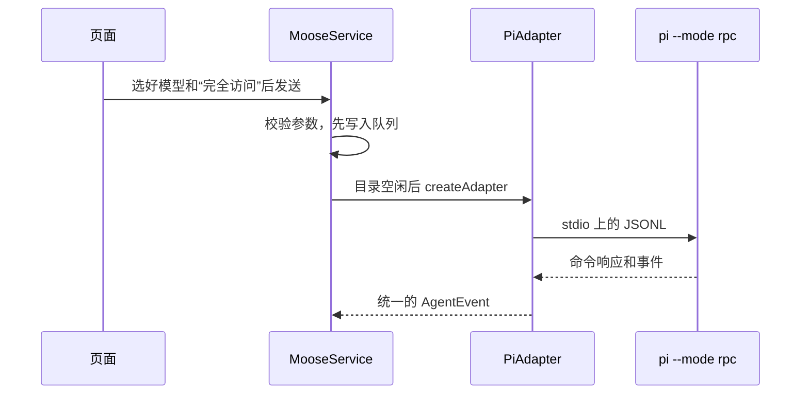

# Pi 接入

前面是使用步骤。[调用脉络](#调用脉络)之后是给改适配器的人看的：一次任务怎么走，以及为什么不把四家协议合成一个执行循环。

## 如何使用

1. 安装官方 CLI：`npm install -g --ignore-scripts @earendil-works/pi-coding-agent`。
2. 在终端启动 `pi`，用 `/login` 登录所需模型服务，或按 Pi 文档配置 API 模型。
3. Moose 设置 → 代理连接 → Pi，刷新检测；自动发现读取 shell PATH，并覆盖 PNPM_HOME 与 `~/Library/pnpm/bin`；仍找不到时填写可执行文件的绝对路径，点击空白处自动保存。
4. 输入区模型选择器中选 Pi 和实际可用模型，明确选择“完全访问”后发送。

Moose 不安装或捆绑 Pi，也不复制其凭据。0.22.0 已重新核对 Pi 1.0.0 的 RPC 协议；模型和推理档位实时查询，不内置模型目录。普通对话兼容性与插话能力分别探测，旧版不开放本轮新增的插话入口。

## 能力边界

- 支持流式正文、模型提供的思考内容、工具记录、停止、图片输入（取决于模型）、文件附件和原生会话恢复。
- Pi 保存 sessionFile；Moose 保存其路径，下次用 `--session` 恢复。编辑历史继续使用 Moose 的文本历史重建机制，不撤销工作区文件。
- 顶部更多 → 原生会话可浏览、预览并去重导入当前项目的历史，导入后可续聊。只读处理 v2/v3 JSONL 的当前分支和压缩记录，保留源历史；跨目录、损坏文件和超出读取边界明确报错。
- 1.x 的运行中“立即发送”使用原生 `steer`；普通发送继续进入 Moose 队列。明确拒绝、已接收和结果未知分别记录，回执不要求原生 turn ID。取消先清除原生待投递输入，清除失败则关闭该连接，避免继续投递。
- Pi 没有内置审批沙箱，只能选择完全访问。扩展发出的确认和提问可显示为交互卡片，这不代表所有工具执行都受到审批保护。
- 不展示 Pi 不具备的原生 Plan/Goal 模式。支持读取全局 `~/.pi/agent/skills` 和项目 `.pi/skills`，也保留 Moose 原有 skills 路径。
- 上下文用量来自 `get_session_stats.contextUsage`；没有账户套餐额度接口，不推算或伪造剩余额度。
- Pi 自己的全屏界面、小组件和终端里的编辑器没有接进 Moose。

## 调用脉络

一次 Pi 任务按这个顺序走。页面不解析 Pi 的协议，时间线上也不会出现 Pi 专用的消息类型。图里的 JSONL 是一行一条 JSON，从标准输入输出传给 `pi --mode rpc`。

- `piCodec` 只转换消息信封。请求对应、超时、缓冲上限和进程退出清理用的是公共传输层。
- `normalizePi` 把文本、思考和工具事件转成统一的 AgentEvent。
- 同一段文字的增量和最后的完整快照用同一个 key，避免回答显示两遍。
- 一轮结束要等 `agent_settled`。`agent_end` 之后还可能重试或压缩，不能拿它当结束。

## 代理层收在哪几个文件

改 Pi 或再加一家代理时，从这几处入手，不必在服务和设置页里各写一套分支：

- `shared/providers.ts`：集中代理 ID、设置字段、安装指南和任务模式；类型、参数校验、服务商设置、命令菜单和探测脚本复用。
- `electron/providers/registry.ts`：适配器实例在这里创建。服务和探测脚本不再各自判断是哪一家。
- `electron/providers/prompt.ts`：复用附件文本封装及无原生引用协议的路径提示，保留 Codex 的原生 mention/skill 输入。
- 设置保存与代理重连只触发一次，移除 App 与设置页的重复探测。

不合并各协议的执行循环：Codex、ACP 与 Pi 的握手、完成事件和审批语义不同，保留独立适配器更易阅读和排查。

## 验证范围

验证分为协议探测、客户端回归和真实模型任务：

- Pi 0.85.1 已完成真实 RPC 握手；自动化使用隔离协议 fixture，覆盖能力探测、事件归一化、扩展确认、停止、会话路径恢复，以及桌面中选择 Pi 后发送和持久化，不消耗模型额度。
- 2026-09-21 使用 Pi 0.85.1 与 `openai-codex/gpt-5.6-luna`，在隔离目录验证了真实文件写入、重新创建适配器后的会话续接，以及取消后无迟到写入。
- 2026-10-02 使用 Pi 1.0.0 验证真实两轮写入、只读历史预览、重复导入、跨目录拒绝与导入后续聊；使用 `openai/gpt-6-luna`／low 验证原生插话被本轮消费。分支、压缩、损坏历史、符号链接边界、超时和取消竞争由隔离夹具补充验证，不能替代对所有真实模型和扩展的认证。
- 0.21.2 客户端联合发布回归通过，不代表此次重新验收了 Pi 的所有模型和扩展。真实最小任务、取消方法及边界统一见[测试指南](../testing.md#长期运行与恢复当前覆盖与待验收)，各底座对照见[验证记录](native-capabilities.md#已验证到哪里)。

协议参考：[Pi RPC 文档](https://github.com/earendil-works/pi/blob/main/packages/coding-agent/docs/rpc.md)。
