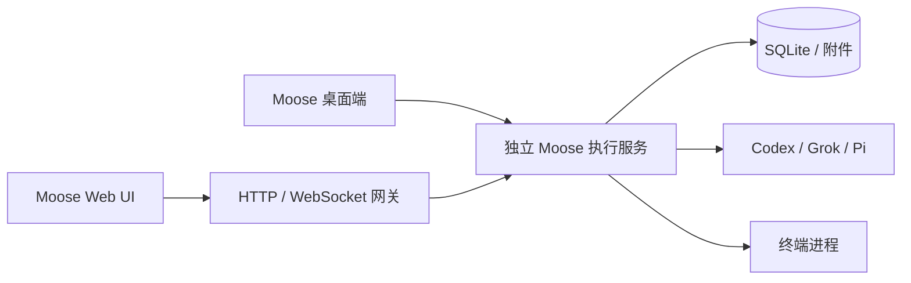

# Moose Web UI 可行性与 Roost 借鉴方向

调研日期：2026-09-20。Moose 基线为 0.14.0（8e37e14）。

参考源码：Roost `e25b9816bd86dfe24309b79c29238852b5214c51`，DeepSeek Harness `ddefc45fbc7f8e46dd73185e68295696d1297887`。本次阅读文档与关键实现，没有运行这两个项目，未实测其网络性能或逐个验证 CLI 兼容性。下述阶段是初始建议；第一阶段的 Web 入口与 OpenCode 接入已有开发实现，当前状态见 [Web 使用说明](../web.md)，其余阶段不应理解为已完成。

## 结论

值得给 Moose 增加 Web UI。复用现有 React 界面和业务服务，让桌面端与浏览器连接同一个执行服务，比另写一套网页或把产品改成纯终端更合适。

Roost 最值得借鉴的是终端生命周期、断线续接和轻量辅助工具；DeepSeek Harness 最值得借鉴的是界面、传输和执行宿主的分层。Moose 保留自己的多 CLI 适配、审批、计划、子代理与 Git 工作流，不需要为了 Web 支持引入另一套 agent 引擎或插件框架。

## 两个项目分别做什么

Roost 以原生 Shell / CLI 终端为中心。浏览器显示终端，独立 daemon 持有 PTY，HTTP 网关负责连接。其 README 展示了以下功能，关键处已对照实现：

| 能力 | 实现与边界 | 对 Moose 的价值 |
| --- | --- | --- |
| 终端保活 | 独立 daemon 持有进程，网关断开不结束 PTY；daemon 崩溃、机器重启或明确 kill 后不能恢复原进程 | 高：桌面退出后仍能继续运行，浏览器随时接回 |
| 多设备接续 | 每个客户端有自己的回放游标；终端实例身份、输出序列与尺寸事件参与同步 | 高：从另一台设备查看任务，不漏掉审批或输出 |
| CLI 识别与状态 | 注册表列出 Claude Code、Codex、Grok、Qwen、OpenCode、Gemini、Oh My Pi；身份识别与状态观察是不同层 | 中：Moose 已有协议事件；对用户手动在终端启动的 CLI 可额外支持 |
| 本地回显 | 前端预测覆盖层，真实输出到达后核对；不把预测写进终端解析器或网络；控制字符、超时等会撤销预测 | 后置：主要解决远程终端输入体验，对聊天输入框收益小 |
| 文件工具 | 文件树、搜索、上传下载、预览和编辑；文件浮窗可固定，编辑检测外部修改 | 高：先做只读预览、复制路径，编辑后置 |
| 笔记与片段 | 选中输出存笔记／片段，另有历史归档与搜索 | 中：适合保存结论、命令和排障记录 |
| 机器与额度信息 | 系统资源、进程和端口信息，另有订阅额度入口 | 中：远程场景更有价值；适合按需展开，不必常驻全部指标 |

不能把“识别 7 家 CLI”理解为“每家都提供同样完整的协议集成”。例如注册表包含 7 家，而图片插入适配仍有单独的类型和验证范围。Codex 状态观察读取线程协议通知，Claude 有专门的 hook 接收入口；各家需要分别验收。

作者强调“不读屏幕猜状态”，这个方向值得学习；也不能据此推断仓库任何功能都不读取屏幕。仓库还有屏幕／输入框相关辅助实现，需按具体能力判断。

DeepSeek Harness 自己拥有 agent 运行时，Web UI 提供工作区、会话、模型设置、审批、计划和委派等交互。它的 Web / Electron 宿主可使用不同传输，业务能力通过统一调用与事件约定对外暴露。Gateway 支持类型校验、取消和流，多条逻辑流可共享 WebSocket，重连期间会重新建立事件订阅和状态基线。这比“把终端塞进网页”更接近 Moose 的产品方向。

## Moose 已经具备哪些基础

以当前源码为准，旧版 architecture.md 中“没有内置终端／worktree”等描述已过时。

- `src/` 已经是 React Web 界面，终端也是 xterm.js，不需要重写整个 UI。
- `electron/preload.ts` 只暴露 `request / subscribe`，适合增加浏览器传输实现。
- `shared/types.ts` 和 `shared/validation.ts` 已有请求、响应、事件与运行时校验。
- `electron/service.ts` 的 `MooseService` 集中业务逻辑，大部分实现使用 Node 能力；可以抽出不依赖 Electron 的启动入口。
- Provider adapter 已把底座输出转成结构化消息、问题、审批与委派事件，不需要靠终端静默时间推断 agent 状态。
- SQLite 已保存消息，前端按消息 ID、seq 和 position 合并；这能复用，但不是完整的网络事件续传协议。

当前必须改的地方：

| 当前实现 | Web 需要补什么 |
| --- | --- |
| `runtime.ts` 要求 Electron `process.parentPort` | 独立 Node 服务入口；复用业务服务与生命周期管理 |
| `main.ts` 校验 IPC 来源 frame | HTTP / WebSocket 的认证、来源校验、会话失效与请求限额；复用业务参数校验，但不能复用 frame 信任 |
| `main.ts` 负责目录选择、附件选择、剪贴板、Finder、编辑器 | 区分桌面与浏览器能力；远程项目选择的是服务端目录，附件需上传，网页剪贴板需浏览器许可 |
| `terminal-view.tsx` 每 100ms 轮询输出，并串行等待输入请求 | 终端双向流、独立输入序列和流量控制；远程 RTT 下不可继续每个输入等待上一条响应 |
| `pty-host.ts` 在父管道结束时清理 Shell | 独立守护进程所有权；关闭客户端只断开连接，停止终端才结束进程 |
| 每个显示终端的窗口都能发送 resize | 明确终端控制者，避免两台设备不断争抢窗口尺寸 |
| 消息 seq 是单条消息版本 | 增加事件流游标／快照版本；断线后补齐消息和当前待审批状态 |
| 多数写操作为本地可靠 IPC 设计 | 发送、审批、提交、PR 等逐项审计幂等性；断线后查结果，不盲目重发 |

Node 独立运行还需处理 better-sqlite3 / node-pty 的 Node 与 Electron ABI、PTY 启动路径和环境变量。当前 Shell 明确使用 `/bin/zsh`，不能把“有 Web UI”直接等同于已经支持 Linux / Windows 部署。

## 建议架构

桌面端与 Web 共用 UI 和业务 API；各自只实现宿主差异。执行服务是任务、审批、数据库和目录锁的唯一所有者，不能让桌面和 Web 各自启动一个业务调度器写同一份数据库。

第一版可让桌面继续通过 IPC 访问服务，浏览器通过 HTTP 请求和事件流访问；终端使用 WebSocket。无需一开始设计通用插件系统。将来若需要重启 Web 网关也不影响任务，网关与执行服务必须有独立进程边界；仅在 Electron 主进程里加 HTTP 端口做不到这一点。

“关页面继续跑”“退出桌面继续跑”“网关重启继续跑”“执行服务崩溃后恢复”是不同验收级别。持久化历史不等于恢复活进程，第一版不承诺最后一项。

多客户端第一版建议允许同时查看，但一个终端只允许一个连接控制输入和尺寸。审批在服务端原子地结束待决状态，其他页面同步结果；用户主动发送和终端击键不能因重连重复执行。

## 分阶段落地

### 1. 本机浏览器入口

增加独立启动入口和浏览器 bridge，复用现有界面。完成项目列表、会话、发送、停止、审批与输出更新。默认仅监听回环地址，先单用户；浏览器选项目时明确这是服务所在机器的目录。

验收：通过测试 provider 跑一轮消息，刷新页面后继续显示同一任务；重复审批不会执行两次；附件通过上传进入服务端工作区；浏览器入口不依赖 Electron 全局对象。

### 2. 后台保活与可靠重连

把执行服务从桌面生命周期中分离；同一数据目录只有一个服务实例。补终端流、输出补偿、多客户端控制、心跳和明确的停止入口。桌面退出只断开自己的连接，保留单独“停止后台服务”的操作。

验收：退出桌面／关页面／断网时任务继续；重新连接时输出连续；杀掉网关后能接回同一终端实例；旧连接不能误发输入；多个浏览器不争抢 resize；慢客户端不拖停其他客户端。

### 3. 远程访问与辅助能力

先支持通过 SSH 隧道访问单台服务；后续再增加正式远程登录和部署方式。桌面与 Web 必须清楚标识执行机器和项目路径。远程开放需要认证、TLS 和文件访问范围，不以 CORS 替代认证。

再逐步加文件预览／固定查看、笔记／片段、完成与待审批通知、端口和资源信息。对真实高延迟终端测量后，再决定是否加入本地回显预测。

验收尽量使用测试代理、真实 Shell、临时仓库和网络故障注入，不需要消耗真实模型 token。最后针对已安装 CLI 做少量真实协议验收。

## 界面取舍

保留 Moose 的对话优先布局和可停靠终端。借鉴 Roost 的“临时内容看完就关”：文件预览默认浮层，需要长期对照再固定；资源监控藏在状态入口；笔记由消息／选区操作进入。不要一次新增文件树、任务板、监控栏和笔记栏挤满主界面。

用户手动开启的终端继续保留原生输出；结构化代理对话继续用现有时间线。这两种模式对应不同工作方式，可以共存。

## 参考入口

- [Roost README](https://github.com/wxyhgk/roost/blob/e25b9816bd86dfe24309b79c29238852b5214c51/README.md)
- [独立终端 daemon 与生命周期](https://github.com/wxyhgk/roost/blob/e25b9816bd86dfe24309b79c29238852b5214c51/packages/terminal-daemon/README.md)
- [CLI 注册表](https://github.com/wxyhgk/roost/blob/e25b9816bd86dfe24309b79c29238852b5214c51/packages/cli-adapters/src/registry.ts)
- [Codex 状态观察](https://github.com/wxyhgk/roost/blob/e25b9816bd86dfe24309b79c29238852b5214c51/packages/terminal-daemon/src/codex-observation.ts)
- [本地回显实现](https://github.com/wxyhgk/roost/blob/e25b9816bd86dfe24309b79c29238852b5214c51/frontend/src/features/terminal/engine/localEcho.ts)
- [终端传输与慢客户端处理](https://github.com/wxyhgk/roost/blob/e25b9816bd86dfe24309b79c29238852b5214c51/backend/src/terminalTransport.ts)
- [DeepSeek Harness Web 指南](https://github.com/deepseek-ai/deepseek-harness/blob/ddefc45fbc7f8e46dd73185e68295696d1297887/docs/user/guide/index.zh.md)
- [Web 宿主与 Electron 分层](https://github.com/deepseek-ai/deepseek-harness/blob/ddefc45fbc7f8e46dd73185e68295696d1297887/packages/host/webserver/README.zh.md)
- [调用、事件流与重连](https://github.com/deepseek-ai/deepseek-harness/blob/ddefc45fbc7f8e46dd73185e68295696d1297887/packages/api/gateway/README.zh.md)

## 后续落实：显式共享实例

已增加桌面连接独立 Web 后台的入口，两端使用同一会话和终端，退出桌面不会停止后台任务。这是第二阶段的第一步；显式共享启动命令已支持自动连接／启动后台、状态查询和停止；默认入口切换、数据迁移、流式终端及控制权仍待实现。移动端和云端部署暂缓。见 [使用步骤](../web.md)。
