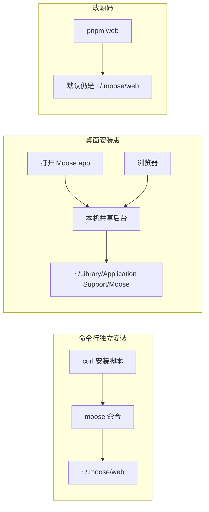
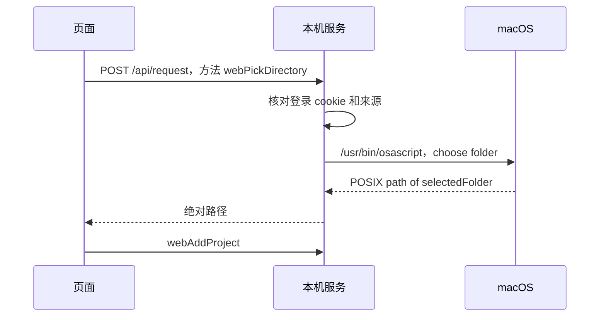

# Moose Web

浏览器里用的是同一套 React 界面和业务服务。本页适用于 0.23.3，日常操作见[使用指南](usage.md)。

先选入口。三条路的数据不会自动合并，关浏览器页面也不会把任务停掉。



| 你想做的事 | 看哪一节 | 数据在哪 | 怎样才算停掉任务 |
| --- | --- | --- | --- |
| 不装桌面，只要浏览器 | [独立安装](#独立-web-安装) | `~/.moose/web` | `moose stop` |
| 桌面已经在用，想用浏览器看同一份会话 | [连接桌面工作区](#桌面安装版在浏览器中打开同一工作区) | 桌面数据目录 | 等任务结束，再用该节的命令停止后台 |
| 改 Moose 源码 | [从源码启动](#从源码启动独立-web-工作区) | 默认 `~/.moose/web`。不要指到桌面数据目录 | 终端里 Ctrl+C |

## 独立 Web 安装

macOS Apple Silicon：

```sh
curl -fsSL https://moose.shqingda.workers.dev/install.sh | sh
```

新终端输入 `moose`，启动本机服务并自动打开 localhost 页面。`moose start` 仅启动，`moose status` 查看状态，`moose stop` 停止服务和任务。独立安装版自带 Node.js，不要求用户预装运行环境。数据默认在 `~/.moose/web`，与桌面默认数据目录独立。

| 命令 | 行为 |
| --- | --- |
| `moose` / `moose web` | 启动或复用后台，并打开浏览器 |
| `moose start` | 启动或复用后台，不打开浏览器 |
| `moose status` | 查看后台地址和数据目录 |
| `moose --version` | 查看命令所指向的已安装版本 |
| `moose update` | 下载、校验并切换安装文件，保留现有后台和任务 |
| `moose stop` | 停止后台及其任务和终端 |

## 更新独立 Web 版

```sh
moose update
moose --version
moose status
```

更新保留旧发行目录；下载或校验失败不切换安装版本。`moose --version` 显示已安装版本；`moose status` 确认后台可连接并显示地址与数据目录，不显示后台版本。已安装版本更新后，旧后台仍可能继续运行。更新不会自动停止后台或重发任务。

等活动任务结束，再执行：

```sh
moose stop && moose
```

刷新已有页面，或使用启动器打开的新链接进入新版。重启会更换访问令牌，旧页面可能需要重新认证。0.21.0 及更早版本需先重新运行一次安装命令，以获得 `moose update`；源码环境的 `pnpm web` 不使用这个安装更新命令。

Web 与桌面每次使用同一个版本号发布，但安装目录和默认工作区独立。连接桌面数据目录的 Web 工作区随其后台更新，参照[桌面更新](usage.md#更新桌面版)，不要用独立安装器替换它的后台。

## 桌面安装版：在浏览器中打开同一工作区

打开 Moose 即可。后台按需启动，沿用原来的桌面数据目录，项目、会话、设置和附件无需搬迁。

当前桌面菜单保留标准退出，没有“在浏览器中打开”和“退出并停止后台”入口。退出 Moose 只关闭客户端，任务和终端继续运行。若已安装同版本独立 Web 启动器，可显式连接桌面数据目录：

```sh
MOOSE_WEB_DATA_DIR="$HOME/Library/Application Support/Moose" moose web
```

等任务结束并退出桌面后，使用下列命令停止这个后台，再打开新版桌面：

```sh
MOOSE_WEB_DATA_DIR="$HOME/Library/Application Support/Moose" moose stop
```

没有安装启动器时，可在配置好依赖的源码仓库中执行：

```bash
MOOSE_WEB_DATA_DIR="$HOME/Library/Application Support/Moose" pnpm runtime:stop
```

后台只监听本机回环地址，自动选择空闲端口。再次打开桌面复用已有服务，不新开一份数据库。升级后若旧后台仍在运行，会提示先停止旧后台再重新打开，避免新版界面向旧版后台发送业务请求。

这不是开机启动服务；电脑重启后需要再打开一次 Moose，活进程不会跨重启恢复。原来通过源码创建的 `~/.moose/web` 工作区保持独立，不自动与桌面历史合并。开发模式和指定隔离数据目录的测试默认使用原有独立后台；可设置 `MOOSE_RUNTIME_MODE=shared` 验证自动共享入口。

需要回退独立模式时，先停止共享后台，再设置 `MOOSE_RUNTIME_MODE=local` 启动。同一目录存在共享后台锁时，独立模式拒绝打开数据库。异常退出留下的锁不会自动删除，也不会按旧 PID 杀进程；先核对数据目录的 `runtime.log` 和实际进程状态。

## 从源码启动独立 Web 工作区

在项目根目录执行：

```sh
export PATH="/opt/homebrew/bin:$PATH"
pnpm install
pnpm web:build
```

完成构建后，终端会打印包含访问令牌的链接。打开这个链接进入工作区。以后代码未改动时直接执行 `pnpm web`。

服务默认监听 `127.0.0.1:4318`，数据保存在 `~/.moose/web`。需要隔离测试时可指定 `MOOSE_WEB_DATA_DIR` 和 `MOOSE_WEB_PORT`。该目录不要设成桌面版数据目录。服务通过排他锁阻止多个 Web 调度器同时打开同一份数据库；异常退出留下锁时，先核对锁里的 PID 是否已退出，再清除过期锁。

源码的 `pnpm web` 使用 Electron 自带的 Node 运行时启动无窗口服务；命令行独立安装版使用随包提供的 Node.js。两者均不要求 Electron 桌面窗口保持打开。

## 日常使用

- macOS 本机点击“打开项目”会直接弹出系统文件夹选择器，确认后打开原目录，取消不创建项目。无需上传项目。
- 通过 SSH 启动或非 macOS 时，使用网页目录浏览弹窗；支持逐层进入、返回上级、主目录和粘贴绝对路径。也可设置 `MOOSE_WEB_DIRECTORY_PICKER=browse` 强制使用网页选择。
- CLI 安装、登录、模型与文件执行都发生在服务所在机器。附件选择后会上传到服务端。
- 重新打开页面可以读到历史、当前审批和终端输出。怎么停，看页首那张表。电脑重启后，原来的 Shell 和代理进程也不会自己回来。
- 安装版打开 Moose.app 之后，浏览器可以连到同一份桌面数据，方法见[连接桌面工作区](#桌面安装版在浏览器中打开同一工作区)。源码的 `pnpm web` 默认用另一份 `~/.moose/web`，不要把数据目录指到桌面那份。
- 连接断开会提示重连。保存、发送、提交如果当时断了，不会自动再发一次；先看结果，再决定要不要重试。

打开页面用的链接里带有访问令牌。登录成功后，令牌放进 HttpOnly cookie，地址栏里的那一段会被清掉。令牌只在这次服务进程活着时有效；服务一重启，旧页面要重新打开新链接。服务默认只听本机 `127.0.0.1`，不对外网开放，也没有开机自启。断线后，界面用一份当前状态恢复，终端输出按游标把缺口补上。临时从另一台设备打开的方法见[远程预览](#临时远程预览)。

Web 侧栏可从左上角收起或展开；窄窗口使用覆盖式布局。开启系统“减少动态效果”时直接切换，不播放滑动动画。

## Web 专门适配

| 项目 | Web 行为 |
| --- | --- |
| 窗口布局 | 无原生标题栏留白；760px 以下侧栏覆盖展示，审阅面板全宽，右停靠终端改为上下布局 |
| 系统外观 | 主题选择为“跟随系统”时响应系统明暗变化；辅助功能偏好和语言变化由浏览器提供 |
| 标签页图标 | 跟随系统主题；浅色系统用深色剪影，深色系统用浅色剪影，独立于应用内主题 |
| 快捷键 | Alt+Shift+N 新会话、O 项目、K 搜索、B 侧栏、R 审阅、U 用量、J 命令、S 定时、L 输入框、逗号设置；终端 Ctrl+反引号。具体见设置页 |
| 认证恢复 | cookie 失效后在当前页输入新令牌，保留内存草稿并重建 SSE；不自动重发写操作 |
| 草稿 | 页面隐藏和退出时提交待保存草稿，短请求使用 keepalive；断网与强制关闭不能保证保存成功 |
| 扩展登录 | 点击认证后再点击授权链接，避免异步弹窗拦截 |
| 文件与附件 | 本地 macOS 系统目录选择；远程或无图形环境使用服务端目录浏览。附件从浏览器上传 |
| 原生桌面入口 | Finder、编辑器与原生菜单不在浏览器中模拟，入口隐藏；终端和后台任务继续使用同一套服务 |

登录在 localhost 与 127.0.0.1 下按浏览器来源分别保存 cookie，需要各自的带令牌链接。两者仍是同一个服务、同一份数据。

## 桌面与浏览器共用一个后台

这一节给改源码的人：让桌面开发版连上已经在跑的 Web 服务。安装版用户不用做这些，打开 Moose.app 就会连到原来的桌面数据。

源码环境可执行 `pnpm desktop:shared`：构建后连接已有后台；没有后台时自动启动独立后台，再打开桌面。以后可用 `pnpm runtime:status` 查看状态、`pnpm runtime:stop` 停止后台；只启动后台用 `pnpm build && pnpm runtime:start`。后台日志在数据目录的 `runtime.log`。此源码入口默认使用独立 Web 数据目录，不自动迁移桌面历史。

需要开发热更新时，先在一个终端运行 `pnpm web:build`，保持这个服务运行。它会打印桌面连接文件路径，默认是 `~/.moose/web/connection.json`。在另一个终端启动桌面开发版：

```sh
export PATH="/opt/homebrew/bin:$PATH"
MOOSE_SHARED_RUNTIME_FILE="$HOME/.moose/web/connection.json" pnpm dev
```

指定了自定义 Web 数据目录时，使用服务打印的连接文件路径。先退出之前启动的 Moose Dev，避免单实例机制唤起旧进程。不要把 `MOOSE_DATA_DIR` 指向 Web 数据目录；两端通过服务请求共享状态，不各自打开同一数据库。

共享模式下，桌面保留原生菜单、文件选择和剪贴板；业务请求转发给本机 Web 服务。退出桌面或关闭网页都不会停止任务；停止 Web 服务才会关闭它管理的进程。连接中断后会重新登录并继续收事件，然后刷新状态。保存、发送这类写入不会自动再发一次。

连接文件含访问凭据，权限为 0600，只供同一用户的桌面主进程读取，不送入渲染页面。桌面客户端只接受 `http://127.0.0.1` 地址。服务停止后删除连接文件，下次启动生成新凭据。源码独立工作区不会自动导入桌面历史，也不安装后台守护服务。安装版直接复用原桌面数据目录，无需复制数据库。

代理安装与支持范围统一见[底座能力](providers/native-capabilities.md)，包括 [OpenCode v2](providers/native-capabilities.md#opencode-v2)。后续工作统一见[开发计划](providers/native-capabilities-plan.md)。

## 网页为什么能打开系统弹窗、发现 CLI

浏览器只负责显示界面和发 HTTP 请求。`pnpm web` 在你这台电脑上启动服务：用的是 Electron 自带的 Node，不打开桌面窗口。文件和进程权限属于启动服务的那个用户，不属于浏览器。

打开项目时，系统文件夹窗口出现在**跑着服务的那台 Mac** 上，返回的是这台机器的绝对路径。这和浏览器的 `showDirectoryPicker()` 不一样，后者给的是目录句柄，不是路径。



取消不创建项目。系统选择失败就显示错误，不会再弹第二层选择器。实现参考 [DeepSeek Harness 的原生选择器](https://github.com/deepseek-ai/deepseek-harness/blob/ddefc45fbc7f8e46dd73185e68295696d1297887/packages/host/directory-picker-native/src/native-picker.ts)。

发现 CLI 走的是 `providers` → MooseService → `discover()`。服务先看设置里填的路径，没有再查当前进程 PATH、登录 shell 的 PATH 和常见安装目录，然后运行 `--version`，由对应适配器探测协议和模型列表。

| 状态 | 只说明 |
| --- | --- |
| 找到文件 | 这个路径上有可执行文件 |
| 能启动 | `--version` 跑起来了 |
| 握手成功 | 协议和模型列表读到了 |

这三步都通过，仍不等于每个模型都已登录、都能调用。真正执行任务时，也是服务去启动 CLI，浏览器只接收结果。

桌面用 Electron IPC，Web 用 HTTP 和 SSE。发现 CLI 和执行任务的业务代码是同一份。服务若放到另一台机器上，找到的 CLI 和弹出的窗口都属于那台机器。当前默认只监听本机回环地址。

## 临时远程预览

这一节是实验入口，还没作为正式功能推进。日常使用不需要它。

<details>
<summary>用 HTTPS 隧道临时打开（实验性）</summary>

服务仍然只听 `127.0.0.1`，外面通过一条 HTTPS 反向隧道进来。先运行 `ssh -R 80:127.0.0.1:4320 nokey@localhost.run` 获取临时 HTTPS 地址，然后在另一个终端启动独立预览后台：

```sh
MOOSE_WEB_DATA_DIR="$HOME/.moose/mobile-preview" MOOSE_WEB_PORT=4320 \
MOOSE_WEB_PUBLIC_ORIGIN=https://实际分配的域名 \
pnpm runtime:start
```

将启动输出中链接的 `http://127.0.0.1:4320` 换成该 HTTPS 地址，保留 `/#token=…`，在手机打开。令牌赋予操作该服务的权限，请勿公开分享。公共入口严格校验 Host 与 Origin，并设置 Secure 登录 cookie；手机打开项目使用服务端目录浏览，不在 Mac 弹系统选择器。

停止预览：`MOOSE_WEB_DATA_DIR="$HOME/.moose/mobile-preview" pnpm runtime:stop`，再停止 SSH 隧道。电脑睡眠、断网或隧道失效后地址不可用；这是临时开发入口，不是托管部署。

</details>

## 多窗口终端控制

在共享模式下，桌面和 Web 可以查看同一个终端。第一个打开终端面板的窗口获得控制权，其他窗口显示“仅查看”；点击“接管终端”后，原窗口停止接收键盘输入，也不能再改变服务端终端尺寸。查看窗口按控制端的终端行列数显示输出，避免两个窗口来回修改 PTY（伪终端）尺寸。

控制窗口每 5 秒续租，15 秒未续租则失效。关闭面板主动释放；窗口异常退出或网络中断时由租约过期兜底。其他窗口可以立即手动接管，不必等待到期。恢复连接只恢复查看和输出补偿，不会强行夺回已经转交的控制权。浏览器后台节流或电脑休眠也可能使租约失效，此时点击接管即可继续。

控制权只协调当前用户的多个客户端，不是多人权限系统。客户端标识由桌面连接或浏览器页面生成，输入与调整尺寸均由服务端检查；续租和释放还校验本次租约，防止旧面板的清理请求释放新控制权。租约不写入数据库，不影响 Shell 进程存活。程序化客户端在终端无人控制时可以通过首次输入取得控制权；有其他控制端时请求会被拒绝，输入仍不自动重试。

终端输出补偿和慢连接处理见[技术架构](architecture.md#终端输出传输)。

## 搜索、预览与通知

Web 与桌面共用全文搜索和受控文件预览。下载通过当前登录会话认证，不在下载 URL 中携带令牌。浏览器关闭全部页面后没有通知推送；权限只在主动开启通知时请求，拒绝后可以到浏览器设置中允许。多窗口去重以同一共享后台为边界，断线重连不补发历史提醒。功能入口见[使用指南](usage.md#状态搜索和结果查看)。
